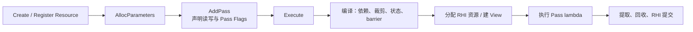
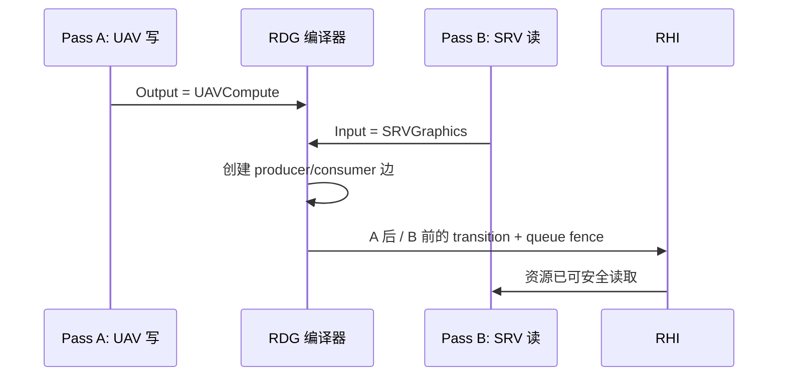
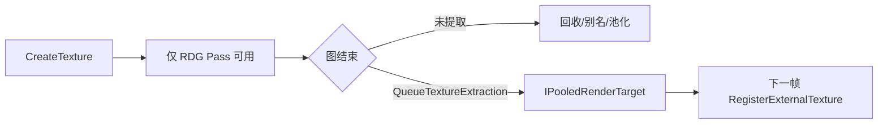

# UE5 Render Dependency Graph（RDG）实现解析

RDG（Render Dependency Graph）是 UE5 RenderCore 中的帧内渲染图系统。它让 Renderer 以“Pass 读写哪些资源”的方式描述 GPU 工作，
再由 `FRDGBuilder` 在 `Execute()` 阶段编译、裁剪、分配资源、安排同步并提交 RHI 命令。

它解决的不是“如何写 shader”，而是现代渲染器的调度问题：数百个 Pass、临时纹理、异步计算、显式 API barrier、资源别名和调试信息
不能再由每个 Pass 手工维护。

## 1. 核心模型：声明图，而非立即执行

RDG 的主入口是 `RenderCore/Public/RenderGraphBuilder.h` 中的 `FRDGBuilder`。一个 Builder 通常在渲染线程栈上创建，添加资源和
Pass，最后必须调用 `Execute()`：

```cpp
FRDGBuilder GraphBuilder(RHICmdList, RDG_EVENT_NAME("Example"));

FRDGTextureRef Output = GraphBuilder.CreateTexture(Desc, TEXT("Example.Output"));
FExampleParameters* Parameters = GraphBuilder.AllocParameters<FExampleParameters>();
Parameters->Output = GraphBuilder.CreateUAV(Output);

GraphBuilder.AddPass(
	RDG_EVENT_NAME("ExampleCS"),
	Parameters,
	ERDGPassFlags::Compute,
	[Parameters](FRHIComputeCommandList& RHICmdList)
	{
		// 设置 shader 参数并 Dispatch。
	});

GraphBuilder.Execute();
```

`AddPass` 并不在正常模式下立即执行 lambda。它保存 Pass 名称、参数结构、Pass 类型和执行 lambda；RDG 从参数结构中的 RDG
资源字段提取依赖。`FRDGBuilder` 的类注释明确：资源 barrier 和生命周期由 `AddPass` 参数结构中的 `_RDG` 参数推导，图在
`Execute()` 中编译、裁剪和执行。



## 2. 主要对象与职责

| 类型 | 职责 |
| --- | --- |
| `FRDGBuilder` | 图的所有者；创建/注册资源，添加 Pass，管理编译、执行、资源分配和清理。 |
| `FRDGPass` | 一个逻辑 GPU 工作单元，保存 `FRDGParameterStruct`、`ERDGPassFlags`、pipeline、barrier 批次和执行 lambda。 |
| `FRDGTexture` / `FRDGBuffer` | 图跟踪的纹理和缓冲。它们在图内是逻辑资源，底层 `FRHITexture` / `FRHIBuffer` 不保证在整个 Builder 生命周期有效。 |
| `FRDGTextureSRV/UAV`、`FRDGBufferSRV/UAV` | 图内 View；将资源的子范围和只读/读写用途显式交给 Pass。 |
| `FRDGParameterStruct` | 从 shader 参数元数据构建的参数视图；用于枚举纹理、buffer、view、render target、uniform buffer 等依赖。 |
| `FRDGSubresourceState` | 跟踪纹理 mip/array/plane 或 buffer 的访问状态、首末 Pass、pipeline 和 UAV barrier 需求。 |
| `FRDGBarrierBatchBegin/End` | 汇集并提交 RHI transition、aliasing barrier 和跨 pipeline fence。 |
| `FRDGUserValidation` | 非 Shipping/Test 版本的用户 API 校验层，发现漏声明、无效用法和生命周期错误。 |
| `FRDGBufferPool` / Render Target Pool / transient allocator | 复用跨帧池化资源或在一帧中按生命周期别名 transient memory。 |

`FRDGResource::GetRHI()` 的设计值得注意：其文档约束为“仅在 Pass 执行期间调用”。在调试构建中，RDG 会验证该资源是否在当前 Pass
参数中声明；未声明或在执行期之外取得 RHI 对象会触发检查。

## 3. Pass 参数如何变成依赖

### 3.1 参数是 RDG 的事实来源

RDG 不分析 lambda 的 C++ 代码，也不知道 shader 实际会读什么。它只信任 Pass 参数结构中以 RDG 宏声明的资源。例如：

```cpp
BEGIN_SHADER_PARAMETER_STRUCT(FBlurParameters, )
	SHADER_PARAMETER_RDG_TEXTURE_SRV(Texture2D, Input)
	SHADER_PARAMETER_RDG_TEXTURE_UAV(RWTexture2D<float4>, Output)
END_SHADER_PARAMETER_STRUCT()
```

`AddPass` 接收的 `FBlurParameters` 会成为 `FRDGParameterStruct`。`RenderGraphBuilder.cpp` 的
`EnumerateTextureAccess` / `EnumerateBufferAccess` 遍历参数元数据，将字段解释为资源访问：

| 参数类型 | RDG 推导的用途 |
| --- | --- |
| `RDG_TEXTURE` | 根据 Pass 类型作为 SRV 读取。 |
| `RDG_TEXTURE_SRV` / `RDG_BUFFER_SRV` | 图形或计算 shader 的只读访问。 |
| `RDG_TEXTURE_UAV` / `RDG_BUFFER_UAV` | 图形或计算 shader 的读写访问。 |
| `RENDER_TARGET_BINDING_SLOTS` | color target 使用 `RTV`，深度模板使用 `DSVRead` / `DSVWrite`，resolve target 额外带 `ResolveDst`。 |
| `RDG_*_ACCESS` | 调用方显式指定 `ERHIAccess`，适合 Copy、Indirect Args、Present 等非标准绑定。 |
| RDG Uniform Buffer | 递归枚举其中包含的 RDG 资源。 |

Pass flags 决定默认访问所在 pipeline：`Raster` 对应 `SRVGraphics` / `UAVGraphics`，`Compute` 对应 graphics queue 上的
`SRVCompute` / `UAVCompute`，`AsyncCompute` 对应异步计算 pipeline，`Copy` 则以 copy access 表达。也就是说，**资源字段和
Pass flags 必须同时正确**；只声明 UAV 而把 Pass 标为 Raster/Compute 的错误组合，会导致不正确的访问或校验失败。

### 3.2 生产者、消费者与子资源

RDG 为资源保留生产者状态。纹理不是一个不可分割的整体：`FRDGTextureSubresourceRange` 可区分 mip、array slice、plane，
`FRDGSubresourceState` 为这些范围记录访问、首末 Pass 和 pipeline。这样一个 Pass 写 mip 0、另一个 Pass 读取 mip 1 时，
RDG 能避免把两者错误地串行为同一资源冲突。

每次写入建立 producer；后续读取或写入建立依赖边。尤其是 UAV 同时具备读写特性，即便前后状态名相同也可能需要 UAV barrier，
所以它不能按“同状态无需转换”的简单规则处理。

## 4. `Execute()` 的编译与执行阶段

`Execute()` 将之前的声明转为实际 RHI 工作。概念上可拆为以下阶段；具体内部函数会随 UE 小版本调整，但职责由
`RenderGraphBuilder.cpp`、`RenderGraphPass.cpp` 和 `RenderGraphResources.cpp` 共同实现。

### 4.1 依赖分析与 Pass 裁剪

RDG 从必须保留的根开始反向追溯生产者：外部输出、提取资源、`NeverCull` Pass、readback 等都不能被删除。一个只写临时资源、
其结果既不被后续 Pass 使用也未导出的 Pass，以及它仅有的生产链，都可以被裁剪。

`ERDGPassFlags::NeverCull` 用于 RDG 看不到的外部副作用，例如参数为空的 RHI 工作或写入外部系统；它应谨慎使用。若把普通 Pass
都标记为 `NeverCull`，RDG 会失去裁剪无效工作和缩短资源生命周期的机会。

### 4.2 状态合并与 barrier 计划

对保留的 Pass，RDG 依序处理每个资源的子资源状态。`FRDGSubresourceState::IsMergeAllowed` 会尽量合并相邻、兼容的访问状态，
避免不必要 transition；但存在以下情形时不能合并：

* 只读与可写状态混合，或只写与可读状态混合；
* UAV 与非 UAV 访问混合；
* 深度读/写与其他状态混合；
* 平台声明为不可合并的 access，或跨 pipeline 的状态不能合并；
* UAV 使用没有请求跳过 barrier。

若 `IsTransitionRequired` 判定状态、pipeline 或 transition flags 变化，RDG 创建 `FRDGTransitionInfo`，再将多个 transition
聚合为 `FRDGBarrierBatchBegin/End`。最终 `CreateTransition` 调用 RHI 的 `RHICreateTransition`，后端把它映射为 D3D12 resource
barrier、Vulkan pipeline barrier/layout transition，或旧式 API 所需的状态处理。

`ERDGBarrierLocation` 说明 barrier 放在 Pass lambda 前的 **Prologue** 或后的 **Epilogue**。大多数转换在 prologue；某些别名
discard 操作必须在特定 Pass 之后发生，因而使用 epilogue。跨 graphics/async-compute pipeline 时，批次还可带单独 fence，以保证
生产 queue 与消费 queue 正确衔接。



### 4.3 资源分配、池化和 transient aliasing

逻辑资源不等于立即分配一块专属 GPU 内存。RDG 已知资源首个与最后一个有效 Pass 后，可以选择：

* **外部资源**：由 `RegisterExternalTexture` / `RegisterExternalBuffer` 引入；RDG 跟踪本图访问，但不拥有跨帧生命周期。
* **池化资源**：通过 render target pool / `FRDGBufferPool` 复用前帧或此前不再使用的 RHI 资源。
* **Transient 资源**：交给 `FRHITransientResourceAllocator`；两个生命周期不重叠且规格兼容的逻辑资源可复用同一段 GPU 内存。

`FRDGBufferPool::ScheduleAllocation` 会按对齐后的 desc 查找可重用 buffer，并用 fence 信息避免复用仍被 GPU 使用的资源。
`FRDGBufferPool::TickPoolElements` 会回收长期未请求的空闲资源。Transient aliasing 更激进：资源 A 最后使用后，资源 B 可以占用 A 的
物理内存；因此 RDG 还生成 aliasing barrier，防止后续把同一内存误当作仍含 A 的有效数据。

这种优化的前提是生命周期信息真实可靠。将 `FRDGTextureRef` 保存到图结束后使用、或在未声明的 Pass 中访问资源，会破坏这一前提，
导致别名内存被覆盖、偶发花屏或设备错误。

### 4.4 Pass 执行与 RHI 提交

资源就绪后，RDG 按依赖顺序执行 Pass。对于 raster Pass，`FRDGParameterStruct::GetRenderPassInfo` 从 render target binding
构造 `FRHIRenderPassInfo`，包括 color/depth target、load/store action、MSAA resolve、VRS 纹理等；执行阶段据此 begin/end
RHI render pass。Pass lambda 在 RDG 允许的执行作用域内取得资源 RHI 对象，绑定 shader 参数，然后 draw 或 dispatch。

执行顺序不是简单的“添加顺序全部照做”：无依赖的 Pass 可并行录制，连续兼容 raster Pass 可合并 render pass，异步计算 Pass 可进入
async compute queue。最终仍必须满足资源边、queue fence 和 RHI 命令顺序。

## 5. Pass Flags、并行与异步计算

`ERDGPassFlags` 是 RDG 的重要调度输入：

| Flag | 含义与影响 |
| --- | --- |
| `Raster` | 使用 graphics pipeline；RDG 根据 render target binding 建立 render pass，并可尝试合并。 |
| `Compute` | 在 graphics queue 的计算工作。 |
| `AsyncCompute` | 使用 async compute pipeline；RDG 要处理与 graphics queue 的跨 pipeline 同步。 |
| `Copy` | 复制工作，使用 copy 访问语义。 |
| `NeverCull` | 保留该 Pass 及其生产依赖。 |
| `NeverMerge` | 禁止与相邻 raster Pass 合并。 |
| `SkipRenderPass` | 调用方自行处理 begin/end render pass；也禁用合并。 |
| `NeverParallel` | 强制在渲染线程内联执行。 |

`ERDGBuilderFlags::ParallelSetup`、`ParallelCompile`、`ParallelExecute` 控制 Builder 是否将 setup、图编译和 Pass 执行分发到任务。
但并不是每个 lambda 都可并行：若 lambda 参数是 `FRHICommandListImmediate&`，它必须在 RT 内联执行；使用普通
`FRHICommandList&` 或 `FRHIComputeCommandList&` 才能被并行录制。

`FRDGAsyncTask` 允许并行执行任务在 `Execute()` 返回后继续存在，RDG 会把分配器生命周期延长至最后一个异步任务结束。此模式需要调用方
通过 `WaitForAsyncExecuteTasks()`、`GetAsyncExecuteTask()` 或 RHI command list 的等待路径自行建立正确同步。

异步计算也不是“所有 Compute 自动更快”：它必须没有与 graphics queue 的紧迫数据依赖，硬件必须支持并行队列，且额外 barrier、fence、
资源竞争不能抵消收益。`r.RDG.AsyncCompute` 控制策略；调试时 `r.RDG.Debug.FlushGPU=1` 会禁用 async compute 和并行执行。

## 6. 资源生命周期：创建、注册、提取

### 6.1 图内创建

`CreateTexture` / `CreateBuffer` 创建的资源由 RDG 所有。CPU 侧对象和用 `GraphBuilder.Alloc*` 分配的参数，通常有效到图执行结束；
底层 RHI 资源只保证对**声明它的 Pass**有效。不能将它们保存到下一帧。

### 6.2 外部资源

`RegisterExternalTexture` / `RegisterExternalBuffer` 把已有的 `IPooledRenderTarget`、`FRDGPooledBuffer` 或其他长期 RHI 资源接入图。
RDG 会跟踪和转换它们，但资源生命周期仍由外部所有者管理。注册同一外部资源时 Builder 会返回关联的 RDG 对象，而不是创建不一致的
平行状态记录。

对只读且状态已由调用方保证的资源，`SkipTracking` 可跳过跟踪以减少成本；代价是 RDG 不会转换它，且图内禁止写入。它是性能优化，
不是修复访问状态问题的通用开关。

### 6.3 图外导出

使用 `QueueTextureExtraction` / `QueueBufferExtraction` 将一个图内结果导出到 `IPooledRenderTarget` / `FRDGPooledBuffer` 指针，
使它在图结束后继续有效。导出资源会成为图的可观察输出，故不会被裁剪；下帧需要重新 `RegisterExternal*` 后才能继续由 RDG 使用。
还应指定合适的 final access，使图外消费者获得预期状态。



## 7. Validation 与调试机制

`RenderGraphValidation.cpp` 的 `FRDGUserValidation` 面向调用者 API 错误，而不是内部算法断言。调试构建默认开启
`r.RDG.Validation=1`，它会检查：

* Builder 是否最终执行；一个时刻是否错误地存在多个 Builder；
* 创建描述是否有效，buffer 是否为零大小；
* 资源是否先生产后消费，是否在 Pass 参数中声明；
* 资源是否被错误提取、转换为外部资源或在错误访问模式下使用；
* Pass 执行时是否真的使用了声明的依赖，帮助发现多余依赖；
* transition 与 aliasing barrier 是否符合图记录的状态。

常用调试 CVar：

| CVar | 用途 |
| --- | --- |
| `r.RDG.ImmediateMode=1` | 添加时立即执行 Pass，崩溃时能得到 wiring 调用栈；不代表正常调度。 |
| `r.RDG.Validation=1` | 启用 API 与依赖校验。 |
| `r.RDG.Debug=1/2` | 输出低效或可疑 wiring 的警告。 |
| `r.RDG.TransitionLog` | 输出资源 transition。 |
| `r.RDG.Debug.ExtendResourceLifetimes=1` | 禁止资源生命周期重叠，排查 transient aliasing 问题。 |
| `r.RDG.Debug.DisableTransientResources=1` | 绕开 transient allocator，隔离 transient 资源问题。 |
| `r.RDG.ClobberResources` | 分配时以特殊值清空 RT/UAV，暴露未初始化读取。 |
| `r.RDG.Debug.FlushGPU=1` | 每 Pass flush GPU，便于定位但严重改变性能和异步行为。 |

此外，`FRDGEventName` 将 Pass 名称输出为 GPU event、profiling scope 与 RHI breadcrumb；配合 `ProfileGPU`、RenderDoc、PIX、Nsight
和 Unreal Insights，可把代码中的 `RDG_EVENT_NAME` 对应到真实 GPU 工作。

## 8. 编写 RDG Pass 的实践规则

1. 每个 Pass 使用 `GraphBuilder.AllocParameters<T>()` 创建参数，传给 `AddPass` 后不再修改它。
2. 通过 RDG 参数字段声明所有纹理、buffer、SRV、UAV 和 render target；不要仅在 lambda capture 中偷用 `FRDG*Ref`。
3. 使用正确的 `ERDGPassFlags`，尤其区分 `Compute` 与 `AsyncCompute`，不要为防裁剪而默认加 `NeverCull`。
4. lambda 假定延迟执行：不要捕获指向已离开作用域的引用；捕获值或用 `GraphBuilder.Alloc*` 持有数据。
5. 仅在执行 lambda 内调用 `GetRHI()`；对跨帧结果使用 extraction，对已有持久资源使用 register。
6. 使用 RDG 的 texture/buffer/view 创建函数，而不是提前创建 RHI resource 后绕过图；确有外部 RHI 资源时注册它并声明初末访问。
7. 只有确认连续 UAV 访问无需顺序保证时才使用 `ERDGUnorderedAccessViewFlags::SkipBarrier`，否则可能出现非确定性结果。

## 9. 源码阅读路线

1. `RenderCore/Public/RenderGraphBuilder.h`：从 `FRDGBuilder`、`AddPass`、资源创建和 extraction API 认识外部契约。
2. `RenderCore/Public/RenderGraphDefinitions.h`：阅读 Builder/Pass/资源 flag 与并行执行语义。
3. `RenderCore/Public/RenderGraphResources.h` 和 `Private/RenderGraphResources.cpp`：理解资源、子资源状态、状态合并与 transition 判断。
4. `RenderCore/Private/RenderGraphBuilder.cpp`：阅读参数访问枚举、图编译和执行主流程。
5. `RenderCore/Public/RenderGraphPass.h` 与 `Private/RenderGraphPass.cpp`：查看 Pass、barrier batch 与 RHI render pass 的构建。
6. `RenderCore/Private/RenderGraphResourcePool.cpp`：理解池化与 transient allocation 的实际回收/复用。
7. `RenderCore/Private/RenderGraphValidation.cpp` 和 `RenderGraphPrivate.cpp`：阅读验证、CVar、transition log、clobber 和调试模式。

RDG 的一句话总结是：**Pass 参数声明资源事实，RDG 将这些事实编译为最少且正确的资源生命周期、同步和 RHI 命令。**
