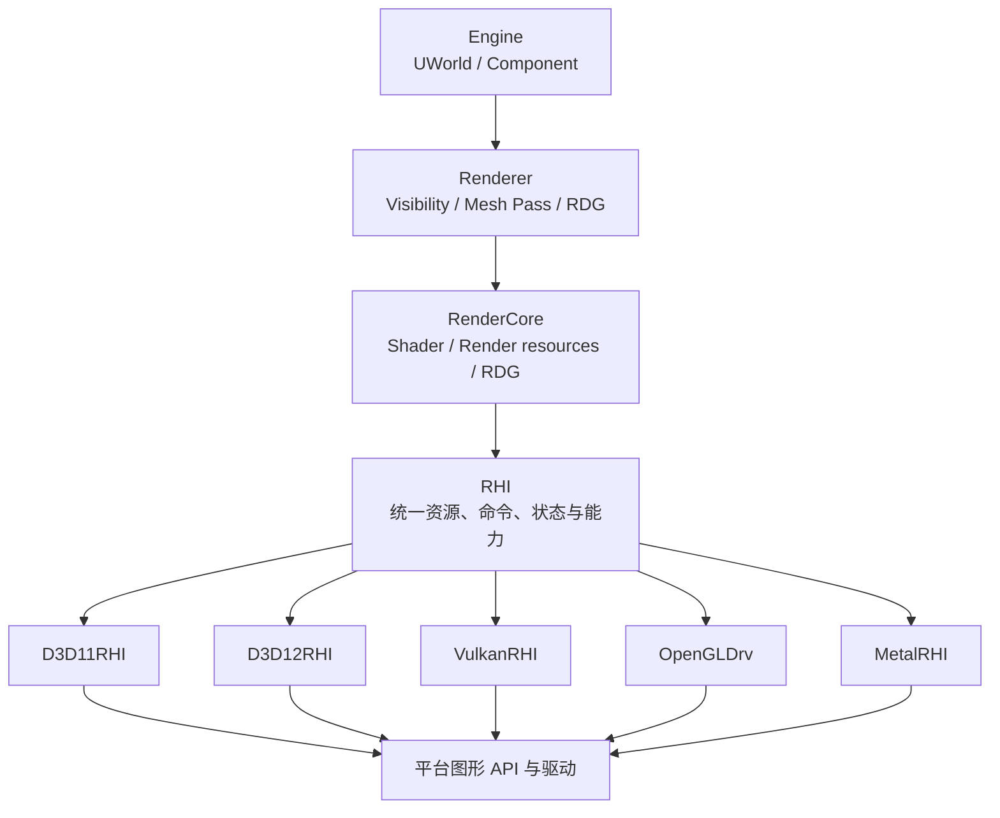
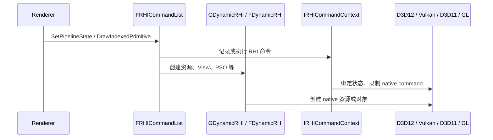
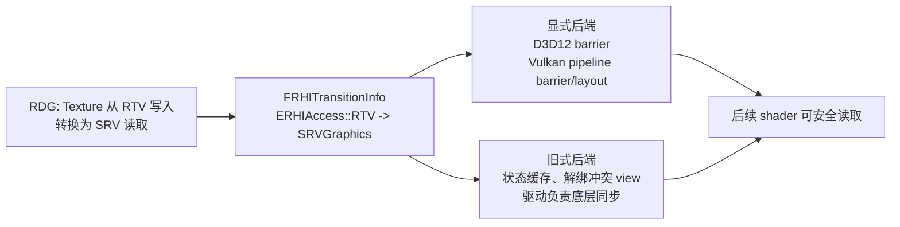

# UE5 RHI 模块详解

RHI（Rendering Hardware Interface）是 Unreal Engine 的图形硬件抽象层。它将 Renderer、RenderCore 看到的纹理、缓冲、
shader、管线和命令，映射到 D3D11、D3D12、Vulkan、Metal、OpenGL 等平台图形程序接口。RHI 的目标不是抹平所有硬件能力差异，
而是在统一语义下暴露能力、特性级别和回退路径，使上层渲染器不必为每种 API 复制整套实现。

本文所述公共接口主要位于 `RHI/Public`，具体实现位于 `D3D11RHI`、`D3D12RHI`、`VulkanRHI`、`OpenGLDrv`、`MetalRHI` 等
Runtime 模块。

## 1. RHI 在渲染栈中的位置



* **Renderer** 决定要渲染什么：可见性、Mesh Draw Command、阴影、光照和后处理。
* **RDG** 声明本帧资源读写依赖，并据此安排 Pass、生命周期和 barrier。
* **RHI** 将 RDG/Renderer 最终需要的资源与 GPU 命令编码为平台无关对象。
* **后端模块** 将 RHI 调用转换成对应 API 的设备、命令上下文/命令列表、资源视图、描述符和同步原语。

RHI 不是渲染器。它不决定一个 Actor 是否可见，也不实现 Lumen 或 Nanite 算法；它提供这些系统执行 GPU 工作所需的最小、统一基础。

## 2. 如何抽象不同平台图形 API

### 2.1 启动时选择一个动态后端

UE 并不在每次 Draw Call 动态判断“使用 D3D12 还是 Vulkan”。进程启动时，平台代码和 RHI 模块选择一个后端并创建
`FDynamicRHI` 实例，赋给全局 `GDynamicRHI`。例如具体后端分别实现 `FD3D11DynamicRHI`、`FD3D12DynamicRHI`、
`FVulkanDynamicRHI` 或 `FOpenGLDynamicRHI`。

`RHI/Public/DynamicRHI.h` 中的 `FDynamicRHI` 是后端虚接口，包含：

* 初始化、关闭、设备信息和像素格式能力；
* 创建 sampler、rasterizer、depth-stencil、blend、vertex declaration；
* 创建 texture、buffer、shader、view、query、fence、pipeline state；
* swap chain / viewport、present 和帧末处理；
* Ray Tracing、Multi-GPU、shader library 等可选能力。

上层调用统一的 RHI 包装函数或 `FRHICommandList` 方法；后者通常转发给 `GDynamicRHI` 或当前的
`IRHICommandContext`。因此，Renderer 代码可以写：

```cpp
FRHITextureCreateDesc Desc = FRHITextureCreateDesc::Create2D(TEXT("SceneColor"), Size, PF_FloatRGBA)
	 .SetFlags(ETextureCreateFlags::RenderTargetable | ETextureCreateFlags::ShaderResource);
FTextureRHIRef SceneColor = RHICreateTexture(Desc);
```

而无需分支为 `ID3D12Device::CreateCommittedResource`、`vkCreateImage` 或 `glTexStorage2D`。实际的 native 资源创建由已选
后端完成。

### 2.2 统一语义，不伪造能力

不同 API/硬件并不等价。RHI 用以下机制将差异显式化：

| 机制 | 作用 |
| --- | --- |
| `ERHIInterfaceType` | 标识当前接口族，例如 D3D、Vulkan、Metal。 |
| Feature Level / Shader Platform | 区分 SM5、SM6、移动端等渲染与 shader 能力组合。 |
| `GRHISupports*`、`GRHIGlobals` | 公开运行时特性支持，例如 ray tracing、mesh shader、bindless、async compute。 |
| `GMaxRHIShaderPlatform` | 选择当前最高 shader 平台和对应排列。 |
| 空实现或回退实现 | `FDynamicRHI` 的部分可选方法默认返回空对象或采用通用实现；上层必须先检查能力。 |
| `DataDrivenShaderPlatformInfo` | 将大量平台 shader 能力从硬编码分支转为数据驱动描述。 |

例如，`RHICreateMeshShader` 在基类中可以返回空引用；只有支持 Mesh Shader 的后端和平台才会提供真实对象。正确的上层代码需要
同时检查 shader platform 与 RHI feature，而不能假设所有设备都有该能力。

### 2.3 三层调用模型

RHI 常见调用路径可概括为：



* `FDynamicRHI` 侧重设备级、资源级对象创建与帧/视口管理。
* `IRHICommandContext` / `IRHIComputeContext` 表示可执行图形或计算命令的上下文。
* `FRHICommandList` 负责把命令组织为可在 RT/RHI 线程执行的命令流；bypass 模式下可直接调用，线程化模式下可延后执行。

## 3. 重要类型地图

### 3.1 资源、引用和描述

`RHI/Public/RHIResources.h` 定义大部分资源基础类型。

| 类型 | 含义 |
| --- | --- |
| `FRHIResource` | 所有 RHI 资源的引用计数基类。资源不会由任意 `delete` 立即销毁，而通过删除队列在合适时机回收，避免 GPU/线程仍引用已释放对象。 |
| `FRHITexture` | 统一的 2D/3D/cube/array/MSAA 纹理对象；描述由 `FRHITextureDesc` / `FRHITextureCreateDesc` 给出。 |
| `FRHIBuffer` | 顶点、索引、结构化、字节地址、间接参数等缓冲；由 `FRHIBufferDesc` 和 `EBufferUsageFlags` 描述。 |
| `FRHIViewableResource` | 可创建 shader 或渲染目标视图的资源基类。 |
| `FRHIShaderResourceView`（SRV） | shader 只读视图。 |
| `FRHIUnorderedAccessView`（UAV） | shader 随机读写视图，通常用于 compute 或像素 shader 写入。 |
| `FRHIRenderQuery` / `FRHIGPUFence` | 时间戳、遮挡查询与 GPU 完成同步。 |
| `TRefCountPtr`、`FTextureRHIRef` 等 | RHI 资源的智能引用；`FTextureRHIRef` 是常用强类型别名。 |

资源描述而非后端枚举是跨 API 的关键。`ETextureCreateFlags`、`EBufferUsageFlags`、`EPixelFormat`、尺寸、mip、array、clear value
表达“资源将被如何使用”，后端据此选择格式、内存类型、usage bit 和 native view。`FRHIViewDesc` 则表达对某个资源的子范围和解释方式，
例如纹理 mip/slice 或 buffer 的 raw、typed、structured 视图。

### 3.2 Shader、状态与管线

| 类型 | 含义 |
| --- | --- |
| `FRHIVertexShader`、`FRHIPixelShader`、`FRHIComputeShader` | 已编译、可由当前 API 使用的各阶段 shader；另有 geometry、mesh、amplification、ray tracing shader。 |
| `FRHIVertexDeclaration` | 顶点 buffer 中元素与 shader input 的布局映射。 |
| `FRHISamplerState` | 过滤、寻址、比较等采样状态。 |
| `FRHIRasterizerState` | 剔除、填充、深度 bias 等光栅化固定状态。 |
| `FRHIDepthStencilState` | 深度测试/写入与 stencil 行为。 |
| `FRHIBlendState` | render target 的颜色/alpha 混合规则。 |
| `FGraphicsPipelineStateInitializer` | 图形 PSO 的高层描述：shader、顶点声明、固定状态、render target 格式等。 |
| `FGraphicsPipelineState` / `FRHIComputePipelineState` | 可绑定的管线状态对象或其缓存结果。 |

UE 将 shader 和固定功能状态分开描述，随后通过 PSO 将它们组合。对 D3D12/Vulkan，这通常映射为显式、不可变的 native pipeline；
对 D3D11/OpenGL，后端可能以状态对象绑定、状态缓存或模拟的 PSO 方式实现相同上层语义。

### 3.3 命令、绑定和同步

| 类型 | 含义 |
| --- | --- |
| `FRHICommandListBase` | 命令列表共同基础，处理命令分配、线程和执行器交互。 |
| `FRHICommandList` / `FRHICommandListImmediate` | 图形命令列表；Immediate 代表主立即命令流和帧边界操作。 |
| `FRHIComputeCommandList` | 计算命令接口。 |
| `IRHICommandContext` / `IRHIComputeContext` | 后端实际执行 `Draw*`、`Dispatch*`、绑定资源、设置 viewport 等操作的接口。 |
| `FRHITransitionInfo`、`FRHITransition`、`ERHIAccess` | 描述资源从何种访问状态转换到何种访问状态，以及所属 pipeline / queue。 |
| `FRHIGPUMask` | 多 GPU 场景下资源或命令作用的 GPU 集合。 |
| `FRHIUniformBuffer`、Shader Parameter API | 以统一布局传递常量、SRV、UAV、Sampler 等 shader 绑定。 |

`ERHIAccess` 的例子包括 `RTV`、`DSVWrite`、`SRVGraphics`、`SRVCompute`、`UAVCompute`、`CopySrc`、`CopyDest`、`Present`。
它们描述**意图和危险关系**，不是简单等同于某个 API 的 layout 枚举；后端根据当前资源状态、队列和目标访问生成实际 barrier。

## 4. 旧式 API 与显式 API 的根本差异

### 4.1 两类 API

这里的“旧式”是以 D3D11 和传统 OpenGL 为代表的**驱动管理大部分状态和同步**的 API；“显式”是以 D3D12 与 Vulkan 为代表的
**应用程序必须管理对象、命令录制、资源状态和队列同步**的 API。差异可概括为：

| 维度 | D3D11 / OpenGL | D3D12 / Vulkan |
| --- | --- | --- |
| 命令提交 | Immediate Context / GL Context，调用常隐式生效 | 应用录制 command list / command buffer 后提交到 queue。 |
| 资源状态 | 驱动多半隐式追踪并处理 hazard | 应用显式指定 layout/state 并插入 barrier。 |
| 绑定模型 | Context 状态机，逐槽绑定资源 | descriptor heap/set、root signature/pipeline layout 等显式绑定布局。 |
| 管线状态 | 可分步修改状态 | 常预建或缓存不可变 PSO。 |
| 同步 | 驱动承担较多隐式同步 | fence、semaphore、queue ownership 等由应用明确安排。 |
| 性能责任 | 使用方便，驱动验证和状态追踪开销较高 | CPU 开销可低、并行度高，但引擎必须正确实现更多机制。 |

注意：D3D11 也有 Deferred Context，OpenGL 可通过扩展实现一些现代特性；D3D12/Vulkan 也有驱动工作。这里是主要编程模型差异，
不是绝对二分法。

### 4.2 RHI 如何用同一套语义覆盖两类 API

RHI 的策略不是退化到“所有 API 的最小公分母”，而是采用**以显式模型为中心的公共语义**，再由旧后端模拟或忽略不需要的细节：

1. **显式资源用途**：创建时使用 flags，使用时通过 SRV/UAV/RTV/DSV 和 `ERHIAccess` 表达读取、写入和阶段。
2. **统一的 transition 请求**：RDG 或 Renderer 生成 `FRHITransitionInfo`；D3D12/Vulkan 后端发出 resource barrier/layout transition，
	D3D11/OpenGL 后端通常更新状态缓存、解绑冲突 view、插入必要 flush 或将请求作为验证信息处理。
3. **统一 PSO 抽象**：Renderer 以 `FGraphicsPipelineStateInitializer` 选择管线。显式后端创建/缓存原生 PSO；旧后端将其拆成 shader、
	blend、rasterizer、depth-stencil 和 input layout 的绑定序列，并用状态缓存避免冗余调用。
4. **统一命令列表**：`FRHICommandList` 让 Renderer 以同样方式组织 draw/dispatch。显式后端更自然地映射为并行录制和 command buffer；
	旧式后端可在执行时调用 immediate context，或以自身机制序列化。
5. **统一视图与参数绑定**：SRV/UAV/Sampler/Uniform Buffer 是 RHI 的共同绑定语言。后端映射为 D3D11 slots、D3D12 descriptors/root
	parameters、Vulkan descriptor set 或 OpenGL texture/image binding。
6. **能力查询而非假装支持**：缺少 ray tracing、VRS、mesh shader、bindless 等功能时，上层选择替代 shader permutation 或渲染路径。



### 4.3 RDG 与显式同步的配合

现代 UE Renderer 大量采用 RDG。Pass 参数中声明 `RDG_TEXTURE_ACCESS`、SRV、UAV、render target 等读写关系；RDG 编译图后得知
生产者、消费者、资源生命周期和 queue，最终向 RHI 生成正确的 transition、barrier 和命令顺序。

这使大多数 Renderer 代码不必手工针对 D3D12/Vulkan 写 barrier，也避免了把 D3D11/OpenGL 的隐式同步假设扩散到上层。但 RDG
只能覆盖在图中正确声明的资源：若原生 RHI 操作绕过 RDG，开发者必须按照 RHI 约定处理资源注册、访问状态和外部资源生命周期。

## 5. 后端分别承担什么工作

### 5.1 D3D11RHI / OpenGLDrv：管理状态机和驱动隐式行为

这些后端将 RHI 的显式意图降低到状态机 API：

* 将 RHI 资源、view 和 shader 包装为 `ID3D11*` 或 GL object；
* 维护 context state cache，避免重复绑定 shader、纹理、sampler 和固定状态；
* 处理同一资源既作为输出又作为输入的绑定冲突，例如解绑 D3D11 的 SRV 再绑定 RTV/UAV；
* 将 Draw/Dispatch 发送到 context，驱动执行底层 hazard 管理和命令提交；
* 在受限平台上通过 capability/format 检查选择兼容格式与回退路径。

因此 legacy 后端仍然接收 `RHITransition`，但它不一定存在与 D3D12 resource state 一一对应的原生 barrier。Transition 的统一接口依然
有价值：它保留 Renderer 的正确资源依赖模型，并让 validation、RDG 和其他后端共享同一调用路径。

### 5.2 D3D12RHI / VulkanRHI：落实显式内存、状态与队列

这些后端需要执行更多 RHI 语义：

* 根据 `FRHITextureCreateDesc` / `FRHIBufferDesc` 分配或放置 native memory，并维护资源生命周期；
* 将 `ERHIAccess` 映射为 D3D12 resource states 或 Vulkan image layout、stage/access masks；
* 用 command list / command buffer 录制 draw、dispatch、copy 与 barrier，提交到 graphics、compute 或 copy queue；
* 管理 descriptor heap / descriptor set、pipeline layout/root signature 与 descriptor 缓存；
* 创建和缓存图形/计算 PSO，避免运行时重复构建昂贵 native pipeline；
* 用 fence、semaphore、queue dependency 和 GPU timestamp 实现跨队列同步及 profiling。

显式后端的性能上限更高，但后端实现必须精确追踪资源状态、别名内存、跨队列 ownership 和对象生命周期。RHI 与 RDG 将这部分复杂度集中在
平台后端，而不是散落在每个 Renderer Pass 中。

## 6. 一个跨后端 Pass 的实际路径

以计算 Pass 写入一张纹理、后续像素 shader 读取为例：

1. Renderer/RDG 创建或注册 `FRDGTexture`，声明 compute Pass 对它的 UAV 写入。
2. RDG 编译时确定写入前后的访问状态、执行顺序和是否可使用异步计算。
3. RDG 将逻辑纹理映射到 `FRHITexture`，调用 RHI 命令列表绑定 `FRHIUnorderedAccessView` 并执行 Dispatch。
4. 在读取 Pass 前，RDG 要求从 `UAVCompute` 转换到 `SRVGraphics`。
5. D3D12/Vulkan 后端发出对应的 barrier/layout transition；D3D11/OpenGL 后端确保 view 绑定不冲突，并利用状态缓存/驱动同步满足
	读取条件。
6. 后续图形 Pass 以 `FRHIShaderResourceView` 或 shader 参数绑定纹理，执行 Draw。

上层 Pass 无需知道 native 资源是 `ID3D12Resource`、`VkImage` 还是 `GLuint`；但它必须准确声明“写”和“读”以及所需 feature。

## 7. 线程、安全与生命周期

RHI 对象可跨 GT、RT、RHI 线程传递，但创建、销毁和命令使用必须遵守调用点约束。`FDynamicRHI` 中某些函数明确标注
`FlushType`，例如创建 shader 或 vertex declaration 可能需要等待 RHI 线程。`FRHIResource` 采用引用计数和删除队列：最后一个引用
释放时先标记删除，真正析构延后到安全时机，防止 RT、RHI 或 GPU 尚在使用该资源。

常见原则：

* Renderer 普通代码优先使用 RDG 资源与 Pass 参数，不直接保留帧内 `FRDGTextureRef` 到图执行后。
* 跨帧持久资源使用 `FTextureRHIRef` / `FRDGPooledBuffer` 等受控对象，并在下一帧注册进 RDG。
* 需要 CPU 等待 GPU 结果时使用 `FRHIGPUFence`、readback 或 query；不要以资源引用仍存在来推断 GPU 已完成。
* 不要在游戏线程直接操作仅供 RT 使用的 `IRHICommandContext`；通过引擎的 render command / RHI command list 路径交接。

## 8. 源码阅读路线

1. `RHI/Public/DynamicRHI.h`：阅读 `FDynamicRHI` 的创建、帧、资源、shader 和 viewport 虚接口。
2. `RHI/Public/RHIResources.h`：理解 `FRHIResource`、纹理/缓冲/view、引用计数与描述结构。
3. `RHI/Public/RHICommandList.h` 与 `RHIContext.h`：理解命令列表如何转发到 `IRHICommandContext`。
4. `RHI/Public/RHITransition.h`、`RHIDefinitions.h`：查看 `ERHIAccess`、transition 和 pipeline/queue 语义。
5. 选一个操作横向跟踪，例如 `RHICreateTexture` 或 `RHITransition`，依次查看 D3D11RHI、D3D12RHI、VulkanRHI 的实现。
6. 最后回到 `RenderCore/Public/RenderGraphBuilder.h`，观察 RDG 如何把 Pass 依赖翻译为 RHI 的资源访问和命令。

调试时可使用 RHI validation、GPU crash debugging / breadcrumbs、RenderDoc、PIX、Nsight、Unreal Insights 和 `stat RHI`。
这些工具分别帮助发现错误状态转换、设备丢失、PSO/命令问题、GPU Pass 耗时与线程等待。
