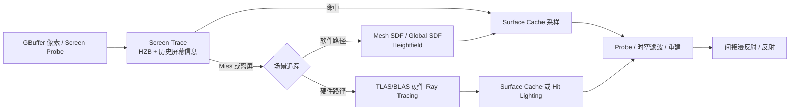
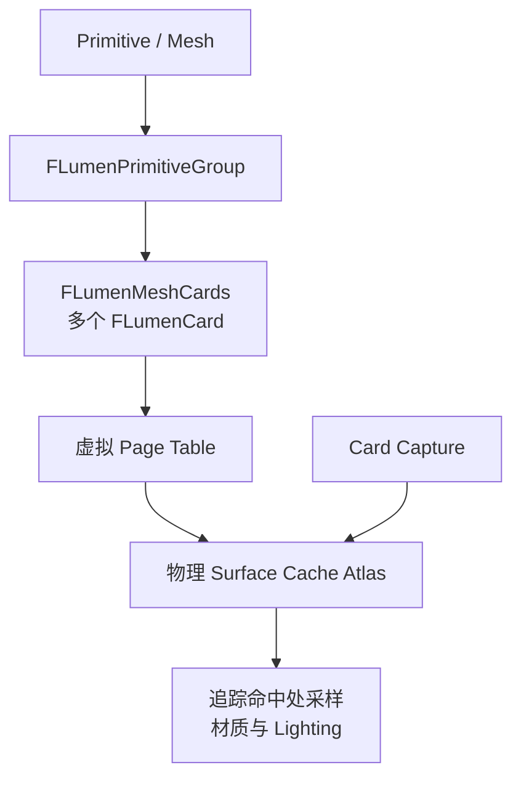
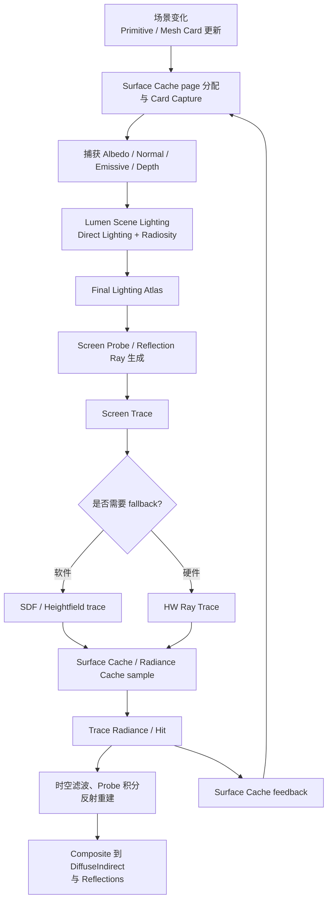

# UE5 Lumen：实现原理与算法解析

Lumen 是 UE5 的动态全局光照（Diffuse Indirect Global Illumination）和反射（Reflections）系统。它不是单一的光线追踪器，
而是一组可按平台和质量设置组合的算法：屏幕空间追踪、Surface Cache、Mesh/Global Signed Distance Field（SDF）软件追踪、硬件
Ray Tracing、Screen Probe Gather、Radiance Cache、时间重投影与空间滤波共同产生最终结果。

本文以 `Renderer/Private/Lumen` 源码为依据，重点解释默认实时路径的原理。具体 Pass、CVar 和 shader permutation 会随 UE5
版本、平台、Show Flag、项目设置及硬件能力变化，因此文中的顺序是逻辑依赖顺序，不是对每个项目固定不变的 GPU event 列表。

## 1. Lumen 要解决的问题与总体策略

理想的动态 GI 要计算渲染方程中的半球积分：

$$L_o(x, \omega_o) = L_e(x, \omega_o) + \int_{\Omega} f_r(x, \omega_i, \omega_o)L_i(x, \omega_i)(n\cdot\omega_i)\,d\omega_i$$

其中 $L_i$ 包含直接光以及任意次数的间接反弹。逐像素、每帧、大量射线地精确求解在实时预算内不可行。Lumen 的工程解法是：

1. 用**不同精度的场景表示**覆盖近景、离屏几何和远景；
2. 用少量、抖动的射线采样间接光；
3. 通过 Surface Cache、Radiance Cache 和历史帧重用结果；
4. 在屏幕空间以深度、法线、速度约束的滤波与重投影，将低采样结果恢复为稳定的全分辨率光照；
5. 当一个表示或追踪方法不可靠时，切换/续追到下一层表示。

`Lumen/Lumen.h` 的 `ShouldRenderLumenDiffuseGI`、`ShouldRenderLumenReflections` 和
`Lumen::IsLumenFeatureAllowedForView` 决定某个 View 是否可使用 Lumen。除项目设置外，代码还检查 runtime pixel format 能力、
View State、Scene 的 `DefaultLumenSceneData`、视图类型，以及软件 SDF 或硬件 RT 路径是否可用。

## 2. Lumen 的场景表示

Lumen 之所以能在动态场景运行，是因为它不要求每条光线都对原始三角形进行完整材质着色。不同任务使用不同表示。

| 表示 | 覆盖范围与用途 | 优点 | 主要限制 |
| --- | --- | --- | --- |
| Scene Depth / HZB / History | 当前屏幕可见表面 | 最高细节、极低额外几何成本 | 只能看到屏幕内已有信息；遮挡面、离屏物体不存在。 |
| Lumen Surface Cache | Mesh Card 捕获的材质与光照缓存 | 二次命中可快速采样，避免重跑完整材质图 | 近似几何/材质表示，缓存页有更新延迟和容量限制。 |
| Mesh SDF | 单个网格的有符号距离场 | 软件射线步进可获得较准确近景遮挡 | 依赖距离场资产；薄面、重叠实例和高密度场景有误差/成本。 |
| Global SDF | 相机附近多个 clipmap 的合成距离场 | 覆盖更大范围，查询简单 | 分辨率更低，细节与薄几何容易丢失。 |
| Heightfield | Landscape 专用表示 | 适合地形软件追踪 | 只覆盖高度场类型几何。 |
| 硬件 RT Scene | BLAS/TLAS 中的真实三角形 | 命中精度高，适合复杂反射/动态几何 | 需要支持 RT 的 RHI/硬件，构建和追踪成本更高。 |

### 2.1 Lumen Scene 与 Mesh Cards

`FLumenSceneData` 是 Lumen 渲染侧场景数据。场景 primitive 被组织为 `FLumenPrimitiveGroup`，再由 `FLumenMeshCards` 与
`FLumenCard` 表示。Card 是贴合网格包围盒/表面方向的局部平面代理，不是屏幕上的卡片；一个 mesh 可有多个 Card。

`LumenMeshCards.h` 定义六个轴对齐方向（`NumAxisAlignedDirections = 6`）的 lookup。`LumenMeshCards.cpp` 会把 Card 的
OBB、分辨率级别、page table 偏移、可见性、材质/光照 channel 等压缩进 GPU buffer；shader 由此将追踪命中点映射到 Card UV 和
Surface Cache 页。为降低对象数，具有相同 RayTracingGroupId 的组件或实例可合并为一组 Mesh Cards，但合并会牺牲局部更新粒度。

### 2.2 Surface Cache：虚拟化的表面属性与光照

Surface Cache 是 Lumen 的核心加速结构。它把 Card 上的表面数据捕获到虚拟分页 atlas，而不是每次射线命中都重新运行材质。

`Lumen/Lumen.h` 定义：物理页边长为 $128$ texel，虚拟页为 $127$ texel（留出半 texel边界），Card 最小分辨率为 $8$，
并支持从 $2^3$ 到 $2^{11}$ 的分辨率等级。`FLumenCardScene` 绑定给 shader 的资源包括：

* Card、Card Page、Mesh Card、Heightfield、Primitive Group 的结构化 buffer；
* 虚拟到物理页的 page table；
* `AlbedoAtlas`、`OpacityAtlas`、`NormalAtlas`、`EmissiveAtlas`、`DepthAtlas`；
* 直接光、间接光和最终光照 atlas。

`LumenSurfaceCache.cpp` 中 `AllocateCardAtlases` 为这些层创建 RDG 纹理。Albedo、Normal、Emissive 可根据 RHI 能力使用
BC7、BC5、BC6H 压缩；代码支持 UAV format aliasing、临时压缩 atlas 或不压缩复制等路径。这样 Lumen 用较小显存保存面属性，
同时仍可按需更新 Card 页面。

Surface Cache 不是完全静态。光线追踪中会把访问的页写入 feedback buffer；后续帧按优先级更新/分配页面。这样镜头附近或实际被光线看到的
页面优先获得细节，代价是新出现区域、快速移动物体或缓存压力大时可能短暂缺失、模糊或滞后。

### 2.3 Lumen Scene Lighting 与 Radiosity

Lumen 同时维护 Surface Cache 上的直接光、间接光和组合后的最终光。`RenderLumenSceneLighting` 调用
`Lumen::BuildCardUpdateContext`，再分别更新直接光和 radiosity，最后通过 `CombineLumenSceneLighting` 计算：

$$L_{final} \approx L_{emissive} + \frac{L_{direct} + L_{indirect}}{\max(1, \text{DiffuseColorBoost})}$$

实际实现还会处理 opacity、曝光、格式量化和更多材质语义。为控制预算，`r.LumenScene.DirectLighting.UpdateFactor` 和
`r.LumenScene.Radiosity.UpdateFactor` 分别只更新 atlas 的一部分 texel；源码默认值为 32 和 64。对全局光照改变，系统通过更新上下文、
反馈和历史有效性逐帧传播，而不是每帧暴力重算全部 Surface Cache。

`LumenRadiosity` 使用 probe atlas、trace radiance/hit distance 和球谐（SH）分量存储/过滤 Card 上的间接光。它为“光在 Lumen
Scene 内继续传播”提供低频、渐进式近似，这与之后面向相机的 Screen Probe Gather 分工不同。

## 3. 两种追踪后端

### 3.1 软件 Lumen：SDF sphere tracing 与混合追踪

软件路径的前提是项目支持 distance field，`Lumen::IsSoftwareRayTracingSupported()` 直接以 `DoesProjectSupportDistanceFields()`
判断。常见追踪优先级如下：

1. **Screen Trace**：利用 HZB、当前/历史 Scene Depth 和 Scene Color 在屏幕内追踪，命中时保留屏幕可见的完整细节。
2. **Mesh SDF Detail Trace**：在近距离采用 per-mesh SDF。距离场值给出到最近表面的保守距离，光线可按该距离前进：

   $$p_{k+1} = p_k + d(p_k)\hat{r}$$

   当 $d(p_k)$ 足够小即认为命中。`r.Lumen.TraceMeshSDFs` 开启时精度更高，但实例密集、距离场重叠时成本上升。
3. **Global SDF Trace**：使用相机周围 clipmap 的低分辨率合成 SDF 覆盖更远区域；`LumenScene.cpp` 中 clipmap extent 随层级以
   $2^i$ 增长。它更便宜但会损失小几何和薄面。
4. **Heightfield Trace**：Landscape 可使用专用高度场追踪；`r.LumenScene.Heightfield.MaxTracingSteps` 控制软件步数上限。
5. **Surface Cache Lookup**：命中 Card/几何代理后，在 atlas 中获取法线、albedo、emissive 和已缓存光照。

`LumenTracingUtils.cpp` 的 `GetLumenCardTracingParameters` 同时绑定 Card atlas、Global DF object grid、页使用记录和 feedback
buffer；`CullForCardTracing` 先按 View 对 Mesh SDF/Heightfield 建立网格化剔除列表，避免每条光线遍历全部对象。

软件路径的关键近似是“以距离场和 Card 代表真实三角形”。所以它对极薄墙面、非常小的几何、重叠距离场、没有生成 Mesh Distance Field
的资产以及高频 WPO 可能出现漏光、错误遮挡或近似命中。

### 3.2 硬件 Lumen：真实三角形命中与 Hit Lighting

当 `Lumen::UseHardwareRayTracing` 为真时，Lumen 可通过 RHI ray tracing scene 的 BLAS/TLAS 发射硬件光线。相关开关包括：

* `UseHardwareRayTracedScreenProbeGather`；
* `UseHardwareRayTracedReflections`；
* `UseHardwareRayTracedSceneLighting` / Direct Lighting / Radiosity；
* `UseHardwareInlineRayTracing`。

硬件 RT 解决了软件 SDF 对复杂、动态或细小三角形的几何近似问题，但命中后仍有两种着色策略：

* **Surface Cache Lighting**：将命中点投影到 Card，读取已有缓存。成本低，但受 Card 分辨率/更新所限。
* **Hit Lighting**：在真实命中点按材质和光源计算更精确的光照。它更适合高质量反射或 Surface Cache 覆盖不足区域，但更昂贵。

硬件 RT 并不自动替代所有 Lumen 缓存。Radiance Cache、Screen Probe、时间滤波仍是控制采样数与噪声的必要机制。硬件路径还会受
TLAS 构建、动态实例、材质 hit shader、队列同步与显存压力影响；只有 inline ray tracing 时，Lumen 的某些 async compute 路径才可并行。

## 4. Diffuse GI：Screen Probe Gather

默认 Lumen diffuse final gather 的实现位于 `LumenScreenProbeGather.cpp`。它不对每个全分辨率像素独立追踪完整半球，而是在屏幕上
放置稀疏探针，探针以 octahedral 参数化存储方向采样结果，再将结果滤波并积分回像素。

### 4.1 Probe 分布与方向采样

`r.Lumen.ScreenProbeGather.DownsampleFactor` 默认是 16，表示规则 Screen Probe 网格覆盖约 $16\times16$ 像素区域。
高方差或几何/BRDF 变化处可额外分配 adaptive probes，最小 downsample 可由
`r.Lumen.ScreenProbeGather.AdaptiveProbeMinDownsampleFactor` 控制。

每个 probe 的方向被展开到 octahedron 纹理。`r.Lumen.ScreenProbeGather.TracingOctahedronResolution` 默认值为 8，故基本方向
采样数近似为：

$$N_{rays/probe} \approx R^2, \quad R = \text{TracingOctahedronResolution}$$

实际采样还会受重要性采样、trace compaction、光源采样和质量档影响。该稀疏采样远少于“每像素数百条半球射线”，是 Lumen 能实时运行的
直接原因。

### 4.2 Screen Trace、场景追踪与命中辐亮度

`TraceScreenProbes` 的逻辑可理解为：

1. 从 downsampled depth/normal、Blue Noise、probe jitter 生成方向；可根据 BRDF PDF 重要性采样。
2. 先进行 HZB screen trace，快速获取当前屏幕的命中与辐亮度。
3. 对失败、离屏或需要续追的光线，使用 Mesh SDF/Global SDF/Heightfield，或硬件 RT。
4. 命中后采样 Surface Cache 或执行 Hit Lighting；Miss 可使用天空、环境或 fallback。
5. 将结果写入 `TraceRadiance` 和 `TraceHit` atlas；再 compact trace，减少无效线程。

Screen trace 并非低质量的可选装饰，而是混合策略中保留屏幕内几何细节的重要层。它的固有限制同样明显：相机外、被遮挡的表面没有
depth/scene color，必须依赖后续 Lumen Scene 或 RT/SDF fallback；屏幕边缘和快速运动处容易产生不连续。

### 4.3 Radiance Cache：在世界空间重用远处辐亮度

`LumenRadianceCache::UpdateRadianceCaches` 的注释清楚描述了算法：在被标记的世界位置周围放置 radiance probes，尽可能复用
缓存结果，只对其中一部分执行追踪，然后为标记位置提供插值参数。它维护多个 clipmap；每个 probe 的最终 radiance、irradiance、
depth/occlusion、world offset 与 indirection texture 可跨帧保留，下一帧通过 `RegisterExternalTexture/Buffer` 再接入 RDG。

Radiance Cache 特别适合低频、远距离的间接光：Screen Probe 或 reflection ray 无需一直追到很远，只需在合适位置插值已缓存的
环境辐亮度。`r.Lumen.RadianceCache.NumFramesToKeepCachedProbes` 默认为 8；更长的复用降低更新成本，但会扩大陈旧缓存被滤波的风险。

### 4.4 Probe 过滤、时间累计与像素积分

追踪结果很稀疏且有随机噪声，必须重建：

1. 对同一 probe 方向图进行空间滤波，可转换为低阶 SH 或 octahedral irradiance；
2. 使用上一帧 history，按深度、法线、速度、相对运动和命中距离决定是否接受时间样本；
3. 对每个像素以其法线和 BRDF 对附近 probe 的方向性辐亮度做漫反射积分；
4. 以深度/法线边缘约束 Upsample，避免光照跨物体泄漏；
5. 额外计算 short-range AO / bent normal，补回大 downsample probe 缺少的接触遮蔽高频细节。

时间滤波的核心权衡是：累计帧数越多，噪声越低但响应越慢。源码中
`r.Lumen.ScreenProbeGather.Temporal.MaxFramesAccumulated` 默认 10；降低它可减少灯光或物体变化的拖影，但增加闪烁。
`DistanceThreshold`、normal rejection 和 fast update mode 用来在运动物体附近更快丢弃历史，代价是局部噪声增大。

## 5. 反射路径

Lumen 反射位于 `LumenReflections.cpp`。与 diffuse GI 相比，镜面/低粗糙度反射更需要方向精度，所以通常为像素或下采样像素发射
专用 GGX 重要性采样反射光线。

典型流程为：

1. 从 GBuffer 读取位置、法线、粗糙度和反射 BRDF，构建 `RayBuffer`；
2. 按粗糙度和 tile 分类，清理/压缩需要追踪的 ray；
3. 可先做屏幕空间反射追踪，再用 SDF 或硬件 RT 续追；
4. 命中时采样 Surface Cache，或者硬件 RT 的 Hit Lighting；对较粗糙的反射可重用 Radiance Cache 并缩短专用 ray；
5. temporal filter、屏幕空间 BRDF reweighting reconstruction、bilateral filter 后，与 reflection environment / scene color 合成。

`r.Lumen.Reflections.DownsampleFactor` 是主要追踪成本控制项。`MaxRoughnessToTrace` 限制专用反射射线覆盖的粗糙度范围，越粗糙的
表面越可由低频环境或 Radiance Cache 近似。`MaxRayIntensity` 限制异常亮样本（fireflies）；降采样、时间累计与空间滤波以少量偏差换取
稳定性能。

## 6. 一帧 Lumen 的逻辑 Pass 图

渲染器并非总在同一时点完成所有步骤。`RenderLumenSceneLighting` 可在可用时使用 `ERDGPassFlags::AsyncCompute`；而 Screen Probe、
反射与后处理对 Scene Texture 的依赖会限制可重叠区域。RDG 负责根据这些读写关系放置资源 transition、跨 pipeline fence 和实际执行。

## 7. 缓存更新、动态性与多次反弹

Lumen 的“动态”不是指零缓存，而是缓存具有增量更新、feedback 和失效机制：

* **几何变化**：组件代理/primitive group 改变时，Mesh Card、Surface Cache 页面及相关场景数据被添加、删除或失效。
* **材质变化**：Card Capture 重写相应页的 albedo/normal/emissive 等表面数据。
* **直接光变化**：Surface Cache direct lighting 在更新预算内重算；全局改变会触发更广的传播。
* **间接光变化**：Radiosity、Screen Probe history、Radiance Cache probe 逐步重算和过滤。
* **观测反馈**：射线访问记录页的 last-used/高分辨率使用情况和 feedback，指导下帧优先更新。

多次反弹不等同于“每个像素递归发射无限射线”。Lumen 通过 Surface Cache 上的 radiosity、Radiance Cache 的已追踪 probe、历史累计和
环境/天空近似传播低频能量。它在视觉上支持动态多次漫反射，但在每一步都使用有限采样、有限缓存分辨率和渐进更新。

## 8. 质量、性能与典型伪影

| 现象 | 根因 | 常见应对方向 |
| --- | --- | --- |
| 漏光、薄墙遮挡错误 | SDF/Global SDF、Card 和 voxel 表示过粗 | 改善网格封闭性/距离场，启用 Mesh SDF detail traces 或使用硬件 RT。 |
| 新区域短暂黑/糊 | Surface Cache 页尚未捕获或更新预算不足 | 提升 Scene/Surface Cache 质量或更新预算，检查 Card 覆盖。 |
| 快速变化时 GI 拖影 | history / Radiance Cache 复用过久 | 降低 temporal 累计帧数，改善 velocity 与 history rejection。 |
| GI/反射闪烁 | 每帧 ray budget 过低，历史被拒绝或随机采样方差高 | 增加质量/采样，允许更多时间累计，检查动画/相机抖动。 |
| 反射模糊或噪声 | 下采样 trace、低命中精度、滤波偏差 | 降低 Reflection DownsampleFactor，调整 roughness 门限或使用 HWRT Hit Lighting。 |
| GPU 成本过高 | Mesh SDF 高密度、RT ray 数、Surface Cache 更新或多队列同步 | 降低追踪距离/分辨率，限制 Mesh SDF detail trace，分析 `ProfileGPU`。 |

由于 Lumen 是近似系统，优化目标通常是“让缓存、SDF、Screen Trace 和实际游戏内容的尺度相匹配”，不是盲目提高所有 CVar。比如，
对大开放场景，增大全局追踪距离可能成本极高；对室内镜面材质，提高反射质量或使用硬件 RT 的收益反而更直接。

## 9. 调试与源码阅读路线

### 9.1 推荐调试

* 使用 Lumen Scene、Surface Cache、Card、Radiance Cache、Screen Probe 等 Visualize 模式检查几何和缓存覆盖。
* 使用 `ProfileGPU`、RenderDoc、PIX 或 Nsight 查看 `LumenSceneLighting`、ScreenProbeGather、Reflections 的 Pass 和耗时。
* 用 `r.Lumen.ScreenProbeGather.ReferenceMode=1` 运行高采样、无缓存/滤波的参考模式，只用于比较质量，不能作为实际性能设置。
* 用 `r.Lumen.RadianceCache.ForceFullUpdate=1`、`r.LumenScene.Lighting.ForceLightingUpdate=1` 判断问题是否来自渐进更新。
* 通过 RDG 的 `r.RDG.TransitionLog`、`r.RDG.Debug.*` 排查资源状态和 transient 问题，不要把 Lumen 的缓存异常误判为 RHI 错误。

### 9.2 源码入口

1. `Lumen/Lumen.h`、`Lumen.cpp`：特性开关、平台能力、软件/硬件路径选择。
2. `Lumen/LumenSceneData.h`、`LumenScene.cpp`、`LumenMeshCards.cpp`：Lumen Scene、primitive group、Mesh Card、page table。
3. `Lumen/LumenSurfaceCache.cpp`、`LumenSceneLighting.cpp`、`LumenRadiosity.*`：Card 捕获、atlas、直接光与间接光传播。
4. `Lumen/LumenScreenProbeGather.cpp`、`LumenRadianceCache.cpp`：diffuse final gather、probe、缓存、时空滤波。
5. `Lumen/LumenTracingUtils.*`：Screen/HZB、SDF、Card、Heightfield tracing 的共享参数与剔除。
6. `Lumen/LumenReflections.cpp`：反射射线、追踪压缩、历史滤波和屏幕重建。
7. `Renderer/Private/DeferredShadingRenderer.cpp`：Lumen 被插入整帧延迟渲染 RDG 图的顶层位置。

一句话概括：**Lumen 用 Screen Trace 保留可见细节，用 Lumen Scene/Surface Cache 表示离屏场景，用 SDF 或硬件 RT 求交，用
Screen Probe 与 Radiance Cache 重用辐亮度，再用时空滤波把有限采样变成可用的动态 GI 和反射。**
