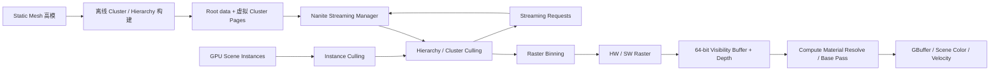
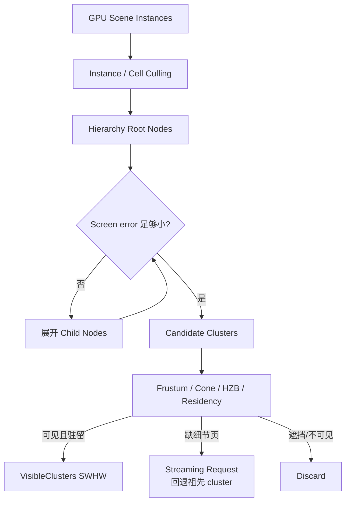
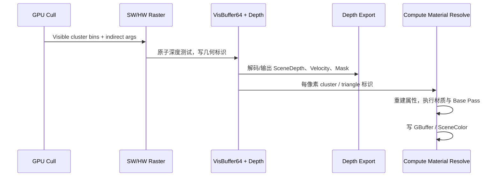

# UE5 Nanite：虚拟化几何的实现原理与算法

Nanite 是 UE5 的虚拟化微多边形几何系统。它的目标不是单纯“支持更多三角形”，而是把传统渲染中由 CPU 驱动的 mesh LOD、section
draw call 和逐对象提交，替换为 GPU 驱动的 instance / hierarchy node / cluster 裁剪、按需页流送和 visibility-buffer 着色。

本文以 `Renderer/Private/Nanite`、`Engine/Private/Rendering/Nanite*`、`NaniteStreamingManager` 相关源码为主线。Nanite 的
实现会随 UE5 版本、RHI 能力和材质特性发展；本文解释当前 Runtime 源码可见的核心数据流与算法，不把某个 CVar 默认值当作固定 ABI。

## 1. Nanite 解决什么问题

传统静态网格路径通常是：CPU 选择 LOD，按 section/材质建立 draw command，GPU 执行每个 draw 的顶点、光栅化和像素 shader。
当场景有大量高模、实例和不同材质时，CPU draw-call 开销、手工 LOD 制作、不可见三角形处理和显存占用都会成为瓶颈。

Nanite 的主要策略是：

1. 离线把 mesh 重组为固定上限的小三角形组 **cluster**，并建立层级 cluster 图；
2. 将高分辨率 cluster 页虚拟化，常驻粗粒度 root 数据，细节页按可见性请求流送；
3. 每帧在 GPU 上遍历 instance 与 hierarchy，基于屏幕误差、视锥和 HZB 决定需要哪些 cluster；
4. 对可见 cluster 按材质和栅格路径分 bin，选择硬件或计算软件栅格；
5. 先写 64-bit visibility buffer 和深度，再以 compute shader 按可见像素解析三角形/材质并写 Base Pass 输出。

## 2. 离线数据：从三角形到 Cluster Hierarchy

### 2.1 Cluster 与层级 cut

导入/构建 Nanite mesh 时，引擎把原始三角形分区为 cluster。cluster 是相邻、局部空间上紧凑的小几何块，携带压缩顶点、索引、材质范围、
边界、法线锥等数据。随后系统自底向上把 cluster 组合成更粗的近似 cluster，并记录父子关系及近似误差，从而形成层级表示。

运行时并非选择一个离散 `LOD0/LOD1/LOD2` 网格，而是在 hierarchy 上选取一个 **cut**：对于某个节点，要么继续展开其 children，
要么使用该节点的粗近似。目标是让投影几何误差不超过像素阈值，形成连续、自动的 LOD 变化。

简化地说，若节点误差为 $e$、投影缩放为 $s$、距离为 $d$，则屏幕空间误差与下式同阶：

$$E_{screen} \propto \frac{e\cdot s}{d}$$

当 $E_{screen}$ 超过阈值，遍历继续向细节 child 下降；否则保留当前 cluster。实际 shader 使用预计算的 LOD bounds、view 参数和
`FPackedView::LODScales`，同时考虑实例缩放、视图和全局质量设置。

`NaniteShared.cpp` 中 `FPackedView::UpdateLODScales` 将投影矩阵和 `r.Nanite.MaxPixelsPerEdge` 转为 LOD scale。该 CVar 的语义是
目标三角形边长的像素量：值更小会追求更细几何，值更大会接受更粗的 cut 以降低成本。

### 2.2 虚拟页与资源布局

Nanite 不要求整个高模常驻 GPU。资源通常分为：

* **Root data**：快速开始遍历/显示所需的粗几何和 hierarchy 数据；
* **Streamable cluster pages**：更细 cluster 的压缩几何页；
* **Hierarchy buffer**：层级节点、边界、误差与子引用；
* **Cluster page data**：物理驻留页、资源索引和页地址等查询数据；
* **Imposter / fallback 数据**：极小投影或非 Nanite 路径所需的辅助表示，具体取决于资源与平台。

`Nanite::GStreamingManager` 向 shader 提供 `GetClusterPageDataSRV()` 与 `GetHierarchySRV()`。GPU cluster culling 读取这些 buffer；
若需要的细节页不在物理池中，则写出 `FStreamingRequest`。Streaming Manager 结合 GPU feedback、优先级、I/O 与页池，在后续帧装入
页面。缺页时系统保留可用的祖先/粗层级，而不是等待同步 I/O，因此细节是渐进出现的。

这就是“虚拟化几何”的含义：资产可远大于当前 GPU page pool，只有本帧可能影响屏幕的细节 cluster 页需要驻留。它不是把全部模型
压缩后一次性上传，也不是传统纹理 Virtual Texture 的简单复用，尽管二者都有 virtual-to-physical page 映射与 feedback 的思想。

## 3. 场景接入：从 Component 到 GPU Scene Instance

一个启用 Nanite 的 `UStaticMeshComponent` 仍会创建 Scene Proxy 并注册进 `FScene`，但它不按传统 Static Mesh 路径每帧生成所有
section draw command。`NaniteSceneProxy` 与 `GPUScene` 把实例变换、primitive ID、材质/instance 信息、可见性和资源引用上传为
GPU 可访问数据。

`FRenderer` 在 `NaniteCullRaster.cpp` 中以 `FScene`、`FViewInfo`、`FSceneUniformBuffer` 和 `FRasterContext` 构造执行上下文。
其 `PageConstants` 使用 GPU Scene 的 instance data stride 与 Streaming Manager 的最大页数；因此 culling shader 可以从实例 ID
定位 transform、bounds 和 Nanite resource，再跳转到 hierarchy/page 数据。

这条路径仍保留传统可见性语义：hidden/show-only primitive、HLOD、draw distance、Show Flag、lighting channel、全局 clip plane、
WPO disable distance 等在 GPU culling 前或过程中参与过滤。`FPrimitiveFilter_CS` 会将隐藏/仅显示 primitive 列表编码为 GPU bitmask。

## 4. 每帧 GPU 驱动裁剪

`NaniteCullRaster.cpp` 是主入口。`FRenderer::DrawGeometry` 组织 RDG Pass；重要 shader 包括 `FInstanceCull_CS`、
`FNodeAndClusterCull_CS` 和可选 `FInstanceHierarchyCull_CS`。

### 4.1 Instance Culling

首先按 instance 的 bounds 进行粗筛，典型判断包括：

* View frustum / global clip plane；
* primitive filter、Show Flag、draw distance 与实例可见性；
* 屏幕投影大小，小到阈值时可转为 imposter；
* HZB 遮挡测试（当当前 culling pass 启用遮挡）；
* Virtual Shadow Map（VSM）目标的页矩形、视图和阴影相关过滤。

引擎可选用 scene instance hierarchy。`FInstanceHierarchyDriver` 把 Scene Culling 的 cell/group work 转交给
`FInstanceHierarchyCull_CS`，先按空间层级排除整个实例组；不能层级裁剪的实例再走公共 `FInstanceCull_CS`。大量 foliage/instance
场景中，这比逐实例扫描更具扩展性。

### 4.2 两阶段 HZB 遮挡裁剪

Nanite 可使用上帧 HZB（`PrevHZB`）进行 two-pass occlusion culling：

1. **Main pass**：将确定未遮挡的实例/cluster 输出为主绘制列表，把可能被遮挡者保存在 `OccludedInstances`；
2. 先栅格主列表，获得本帧更准确的深度；
3. **Post pass**：对先前保守地判为遮挡的实例再次测试/裁剪，并绘制新发现可见的部分。

这样可减少上一帧 HZB 在镜头快速移动、遮挡物移除或新区域露出时误剔除的风险。若 HZB 无效或
`r.Nanite.Culling.TwoPass=0`，构造函数会关闭此路径。Two-pass 不是“多画一次全部场景”，而是将不确定集合延后处理。

### 4.3 Hierarchy Node 与 Cluster Culling

通过 instance cull 的工作项会进入 hierarchy traversal。`FNodeAndClusterCull_CS` 有 Node、Cluster 以及 persistent threads 的排列。
非 persistent 模式中，运行时使用两个 indirect-args buffer ping-pong：

1. 初始化 root/candidate node 队列；
2. 对每一 hierarchy level，以间接 dispatch 处理本层节点；
3. 不满足 LOD 条件的节点展开 children，满足条件的节点产生 candidate cluster；
4. 对 candidate cluster 做更细的 frustum、backface/cone、屏幕误差、HZB 和页驻留判断；
5. 输出 `VisibleClustersSWHW`、软件/硬件 raster indirect args，并把缺页写入 streaming request buffer。

这种队列化、间接 dispatch 的意义在于 GPU 决定下一级工作量，CPU 不需要读取可见 cluster 数量或逐 cluster 发 draw。`FGlobalResources`
定义了 `r.Nanite.MaxNodes`、`MaxCandidateClusters`、`MaxVisibleClusters` 等安全上限，防止异常场景导致无界工作/缓冲溢出。

## 5. Raster Binning 与材质可编程性

裁剪只产出可见 cluster，还不能直接以一个 PSO 绘制所有几何。材质可能不同、双面、masked、WPO、Pixel Depth Offset、位移、spline 或
skinned mesh 等特性也会不同。Nanite 先执行 `FRasterBinBuild_CS`：把可见 cluster 按 raster pipeline / material feature 分桶，
为每个 bin 生成 indirect args 与 metadata。

`FNaniteRasterMaterialCacheKey` 将 feature level、WPO、per-pixel evaluation、mesh/primitive shader、displacement、双面、
VSM、skinning 等状态打包为键。`PackMaterialBitFlags` 则从材质导出以下关键差异：

* **固定功能 fast path**：常见不透明、无复杂变形的材质可共享有限固定 bins；
* **Vertex programmable**：WPO、custom UV/vertex interpolator、spline/skin 等要求在顶点/mesh 阶段运行材质逻辑；
* **Pixel programmable**：masked discard、PDO 或特定逐像素逻辑要求可编程像素路径；
* **Displacement / Tessellation**：需 patch split 与软件 micropolygon 流程。

分 bin 让一批 cluster 使用相同 shader permutation 和管线，同时避免把所有材质强制退化为默认材质。代价是可编程材质越多，bin、PSO
和 dispatch 数越多，Nanite 的合批优势越小。

## 6. 双栅格化路径：硬件大三角形，软件微三角形

`ERasterScheduling` 有三种策略：`HardwareOnly`、`HardwareThenSoftware`、`HardwareAndSoftwareOverlap`。默认思路是混合路径：
大三角形交给硬件 rasterizer，小三角形交给 compute software rasterizer。

### 6.1 为什么需要计算栅格化

对于屏幕投影仅覆盖几个像素甚至小于一个像素的三角形，固定硬件管线的 setup、波前利用率、quad overdraw 与 draw 调度可能效率不佳。
Nanite 的软件路径让线程组批量处理 cluster/micropolygon，直接以原子操作更新 depth/visibility；它能针对微三角形组织工作，避免传统
pipeline 对极端细碎几何的低效率。

`FMicropolyRasterizeCS` 对应 `/Engine/Private/Nanite/NaniteRasterizer.usf` 的 `MicropolyRasterize`。`r.Nanite.ComputeRasterization`
控制是否允许该路径，`r.Nanite.MaxPixelsPerEdge` 影响 LOD，`r.Nanite.MinPixelsPerEdgeHW` 是开始偏向硬件栅格的像素尺度阈值。

### 6.2 硬件栅格路径

大三角形或指定 `HardwareOnly` 时，Nanite 使用 `FHWRasterizeVS/PS`，并按能力选择：

* 传统 Vertex Shader + Pixel Shader；
* Primitive Shader；
* Mesh Shader（支持 tier 1 时）；
* 某些平台的 shader bundle / work graph 优化路径。

`UseMeshShader` 会检查 shader platform、RHI 能力、clip distance 限制和 CVar，不能使用时回落到 primitive/vertex 路径。即使使用硬件
栅格，输入也不是传统 CPU 建立的 per-mesh vertex buffer draw：shader 根据 `VisibleClustersSWHW`、Cluster Page Data、View 和
Raster Bin 间接读取压缩 cluster 数据并发出间接绘制。

### 6.3 位移与 Patch Split

Nanite 的运行时 displacement/tessellation 需要先由 `FPatchSplitCS` 根据目标 dicing rate 拆分 patch，输出可见 patch 队列，
再由软件 rasterizer 处理。源码中 displacement 会强制使用软件路径，因为最终微面片数和顶点位置不再是原始 cluster 的固定硬件输入。
`r.Nanite.DicingRate` 以像素尺度控制微多边形大小，越小越精细也越昂贵。

## 7. Visibility Buffer、Depth Export 与 Material Resolve

Nanite 的 primary raster 通常不直接输出完整 GBuffer。`FRasterParameters` 的核心输出是：

* `OutDepthBuffer`；
* `OutVisBuffer64`；
* 可选 debug buffer。

`VisBuffer64` 保存能定位可见几何的信息，例如可见 cluster 引用、primitive/instance 与三角形/重建所需编码，而非最终颜色。深度与
visibility 写入后，`NaniteComposition.cpp` 的 `EmitDepthTargets` 通过 compute `FDepthExportCS`（平台支持时）或像素回退路径，
将 Nanite 深度、速度、stencil/HTile 和 `ShadingMask` 输出/合并到标准 Scene Depth 等目标。

随后 `NaniteShading.cpp` 建立 `FNaniteShadingUniformParameters`，绑定：

* Cluster Page Data、Hierarchy 和 VisibleClusters；
* `VisBuffer64`、Shading Mask、Packed Views；
* Raster Bin/`ShadingBinData`；
* 普通 Base Pass、Scene 和 View uniform buffer。

compute shading 根据每个可见像素的 visibility ID 找回 cluster、三角形、重心坐标/插值数据和材质 bin，重建顶点属性，执行对应材质
shader，并写入 Base Pass render target、GBuffer、Scene Color、Substrate 目标或其他启用输出。

该拆分的优势是几何可见性与材质着色解耦：同一个材质可批量解析，昂贵材质仅在最终可见像素运行，且能更好管理微三角形。它也带来限制：
一些需要传统即时 raster/GBuffer 语义的材质域、透明混合、特殊顶点工厂或平台能力可能走传统 fallback，而不是 Nanite 主路径。

## 8. Streaming、LOD 连续性与动态预算

Cluster culling 的 `OutStreamingRequests` 是运行时几何流送的反馈源。请求不只表示“页缺失”，还可含所需页、优先级与可见性相关信息。
Streaming Manager 维护物理页池，将 I/O/解压后的 cluster 页映射入 GPU，更新 `ClusterPageData`，使下帧 traversal 能选择更细的 cut。

因此 Nanite 的连续 LOD 由两个机制共同决定：

1. hierarchy 根据屏幕误差想要多细的 cluster；
2. streaming 决定该层级页是否已驻留，未驻留时保留可用祖先/较粗 cut。

当 streaming 跟不上相机移动时，表现通常是短暂较粗几何或 LOD 差异，而不是传统逐对象弹出式 LOD 切换。阴影会受几何 LOD 变化影响；
`r.Nanite.VSMInvalidateOnLODDelta` 可在细节页到达时触发 VSM invalidation，代价是更多 shadow page 重绘。

Nanite 还可按 GPU 时间预算动态放宽几何阈值。`GDynamicNaniteScalingPrimary` / Shadow 的 heuristic 通过
`PrimaryRaster.TimeBudgetMs`、`PixelsPerEdgeScaling` 等设置，在超预算时提高允许的像素误差，减少 cluster 数量。其本质是几何质量的
动态分辨率，而不是改变屏幕渲染分辨率。

## 9. 与 Virtual Shadow Maps、Lumen 和光追的集成

### 9.1 Virtual Shadow Maps

VSM 是 Nanite 的重要协作对象。阴影渲染以多 view、virtual texture target 运行 Nanite culling/raster，`FVirtualTargetParameters`
带有 VSM page table、HZB 页信息和 dirty page flags。只有请求/可见的 shadow pages 需要绘制，Nanite 的 cluster culling 可同时
服务主视图与阴影视图。

Nanite shadow raster 可是 depth-only，并按平台/CVar 使用硬件或计算路径；`Nanite.cpp` 中也存在将 Nanite 深度发射到传统 shadow map
atlas/cubemap 的兼容路径。VSM 与 Nanite 都是虚拟化系统，但一个虚拟化几何细节、另一个虚拟化阴影纹理页。

### 9.2 Lumen

Lumen Card Capture 可将 Nanite 作为 `EPipeline::Lumen` / `ENaniteMeshPass::LumenCardCapture` 的 raster 目标。这样 Lumen
Surface Cache 能捕获 Nanite 细节对应的材质表面。两者可复用 GPU-driven culling 和 RDG 调度，但承担不同职责：Nanite 解决“哪些三角形
与像素可见”，Lumen 解决“间接光与反射如何近似”。

### 9.3 Ray Tracing

Nanite 还可向 Ray Tracing 路径 stream out 适当 cut 的顶点/索引数据；`NaniteStreamOut.cpp` 展示了对 stream-out request 的 hierarchy
traversal、顶点/三角形计数、范围分配与写入流程。这个 cut 由 ray tracing 误差预算控制，不必等于主视图 raster cut。它让硬件 RT/Lumen
等系统可以在合理内存与构建成本下使用 Nanite 资产，而不是始终展开最高细节。

## 10. 限制、材质边界与常见误解

### 10.1 Nanite 不等于“任意对象自动高效”

* 它主要优化高密度不透明/遮罩几何的可见性与栅格化；透明材质因排序和混合需求通常不适合 visibility-buffer 主路径。
* 极大量独立实例、复杂 WPO、masked/PDO、频繁形变、displacement 或不同材质 bin 仍有显著成本。
* Nanite 需要平台支持。`ShouldRenderNanite` 检查 `UseNanite`、资源登记、Show Flag，并且 shader 中多处要求 native 64-bit image atomics；
	不支持的平台走 fallback。
* 它减少了手工 LOD 制作和 CPU draw 提交压力，但不消除像素着色、阴影、材质、纹理带宽、过度绘制或 streaming I/O 成本。

### 10.2 常见伪影和成因

| 现象 | 常见原因 | 优先检查 |
| --- | --- | --- |
| 细节延迟出现 | 流送页尚未驻留或页池/带宽不足 | Nanite streaming 与可见请求，镜头速度和资源规模。 |
| 小几何闪烁/不稳定 | 屏幕误差阈值、遮挡历史、像素尺度过小 | `MaxPixelsPerEdge`、HZB/TwoPass culling 与 TAA/TSR。 |
| 性能未改善 | 材质 programmable bins 多、像素着色/阴影成为瓶颈 | Nanite stats、ProfileGPU、材质 WPO/masked/PDO。 |
| 阴影更新滞后 | VSM 页缓存与 Nanite 页 LOD 变化不同步 | VSM invalidation、阴影视图和 streaming。 |
| 与非 Nanite 对象接缝 | 深度/速度/材质输出合成及不同 LOD/位移语义 | Depth Export、Base Pass、材质与 fallback 设置。 |

## 11. 调试与源码阅读路线

### 11.1 调试建议

* 用 Nanite Visualization 检查 cluster、LOD、overdraw、streaming、raster mode 与 material complexity。
* `r.Nanite.ShowStats=1` 与 `NaniteStats` 可显示 culling/raster/shading 统计；`r.Nanite.StatsFilter` 可聚焦 primary 或某阴影目标。
* 使用 `ProfileGPU`、RenderDoc、PIX、Nsight 查看 `InstanceCull`、`NodeAndClusterCull`、`RasterBin*`、`HW Rasterize`、
	`MicropolyRasterize`、`DepthExport` 和 Nanite shading Pass。
* 仅为定位问题时调节 `r.Nanite.Culling.HZB`、`Frustum`、`TwoPass`、`ComputeRasterization`；不要将关闭裁剪作为性能方案。
* 对 LOD/预算问题同时观察 `r.Nanite.MaxPixelsPerEdge` 与动态 scaling 的 time budget，避免只看三角形总数。

### 11.2 源码入口

1. `Renderer/Private/Nanite/NaniteShared.*`：`FPackedView`、全局队列上限、平台启用条件。
2. `Renderer/Private/Nanite/NaniteCullRaster.*`：`FRenderer`、instance/hierarchy/cluster culling、HZB two-pass、raster bin 与 SW/HW raster。
3. `Renderer/Private/Nanite/NaniteRasterizer.usf`、`NaniteClusterCulling.usf`、`NaniteInstanceCulling.usf`：核心 GPU 算法实现。
4. `Renderer/Private/Nanite/NaniteComposition.cpp`：visibility/depth 到标准 Scene Depth、Velocity、Shading Mask 的输出。
5. `Renderer/Private/Nanite/NaniteShading.cpp`、`NaniteMaterials.cpp`：visibility resolve、shading bin、材质/PSO 组合。
6. `Engine/Private/Rendering/NaniteStreamingManager.*`：页请求、I/O、驻留与物理页管理。
7. `Renderer/Private/Nanite/NaniteStreamOut.cpp`：向 ray tracing 等消费者导出满足误差 cut 的几何。
8. `Renderer/Private/VirtualShadowMaps` 与 `Renderer/Private/Lumen`：理解 VSM 和 Lumen Card Capture 的集成。

一句话总结：**Nanite 将几何变为可流送的 cluster hierarchy，由 GPU 根据像素误差与可见性选择当前 cut，以混合软硬栅格写入
visibility buffer，再延迟解析材质；它把“画哪些三角形”的决策从 CPU/对象 LOD 推进到 GPU/cluster 级。**
