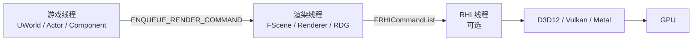
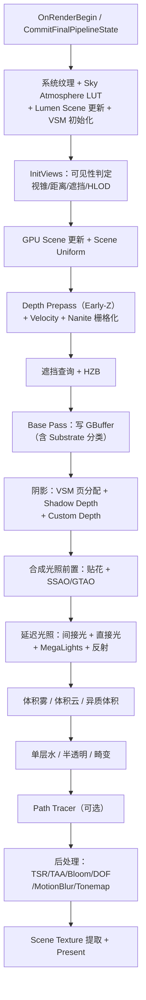
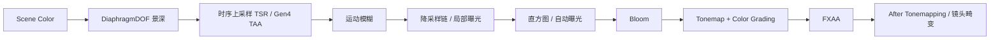

# UE5 Renderer 模块渲染管线与技术调研

本文是 UE5 渲染系统的**总调研文档**：以 `Engine/Source/Runtime/Renderer` 模块源码为主线，梳理引擎完整的渲染管线，
并解析 UE5 使用的渲染技术与算法。本文是「纲」，与同目录下的专题文档互为补充——各专题已深入某一子系统，本文则把它们
串成一条完整的帧内数据流，并补齐尚未单独成文的部分（阴影、直接光照、后处理、大气雾、距离场、半透明、光追等）。

| 专题文档 | 覆盖内容 |
| --- | --- |
| [Rendering_Overview.md](Rendering_Overview.md) | 渲染系统全局分层、一个 Mesh 如何变成像素、线程模型总览。 |
| [Rendering_Tick.md](Rendering_Tick.md) | 游戏线程/渲染线程/RHI 线程的一帧时序与同步。 |
| [RHI.md](RHI.md) | 图形硬件抽象层，跨 D3D12/Vulkan/Metal 的统一资源与命令模型。 |
| [RDG.md](RDG.md) | Render Dependency Graph：帧内 Pass 调度、barrier 与资源生命周期。 |
| [Renderer_Nanite.md](Renderer_Nanite.md) | Nanite 虚拟化几何：cluster hierarchy、GPU 裁剪、软硬栅格、visibility buffer。 |
| [Renderer_Lumen.md](Renderer_Lumen.md) | Lumen 动态 GI/反射：Surface Cache、SDF/硬件光追、Screen Probe、Radiance Cache。 |
| [Rendering_VirtualTexture.md](Rendering_VirtualTexture.md) | 虚拟贴图：页表、物理池、feedback、SVT/RVT。 |

本文默认以桌面端延迟渲染器 `FDeferredShadingSceneRenderer` 为主线（UE 5.5，分支 `5.5`）。移动端、前向着色、路径追踪
等分支路径在各节内单独说明。Pass 的具体列表、CVar 默认值与 shader permutation 会随平台、Feature Level、Show Flag、
项目设置与硬件能力变化，因此文中呈现的是逻辑依赖顺序，而非对所有项目恒定不变的 GPU event 列表。

---

## 1. Renderer 模块全景

`Renderer` 模块是引擎默认的实时渲染器。其代码位于 `Renderer/Private`，约 600 个源文件、22 个子目录。按职责可分为几大群组：

| 群组 | 子目录 / 代表文件 | 职责 |
| --- | --- | --- |
| 顶层调度 | `DeferredShadingRenderer.cpp`、`SceneRendering.cpp`、`Scene.cpp` | 整帧管线编排、场景渲染侧数据、视图管理。 |
| 可见性 | `SceneVisibility.cpp`、`SceneOcclusion.cpp`、`InstanceCulling/`、`SceneCulling/` | 视锥/距离/遮挡裁剪、GPU instance culling、HZB。 |
| 场景基础设施 | `GPUScene.cpp`、`SceneTextures.cpp`、`SceneUniformBuffer.cpp`、`Internal/SceneTextures.h` | GPU Scene 数据、场景渲染目标、uniform buffer。 |
| 几何与基色 | `BasePassRendering.cpp`、`DepthRendering.cpp`、`MeshPassProcessor.cpp`、`MeshDrawCommands.cpp`、`Substrate/` | Depth Prepass、GBuffer/Base Pass、Mesh Draw Command 缓存、Substrate 材质模型。 |
| 阴影 | `ShadowRendering.cpp`、`ShadowSetup.cpp`、`ShadowDepthRendering.cpp`、`VirtualShadowMaps/`、`Shadows/` | 传统阴影贴图、VSM、光追阴影、屏幕空间阴影。 |
| 光照 | `LightRendering.cpp`、`ClusteredDeferredShadingPass.cpp`、`LightGridInjection.cpp`、`MegaLights/`、`StochasticLighting/`、`Froxel/` | 直接光照、clustered culling、随机光照、光函数/IES。 |
| 间接光与 GI | `IndirectLightRendering.cpp`、`ReflectionEnvironment.cpp`、`Lumen/`、`DistanceField*.cpp`、`GlobalDistanceField.cpp`、`ScreenSpaceRayTracing.cpp` | 反射捕获、天空光、Lumen、距离场 AO/阴影、SSR/SSGI。 |
| 环境效果 | `SkyAtmosphereRendering.cpp`、`FogRendering.cpp`、`VolumetricFog.cpp`、`VolumetricCloudRendering.cpp`、`LocalFogVolumeRendering.cpp`、`LightShaftRendering.cpp` | 大气、雾、体积雾、体积云、光轴。 |
| 半透明 | `TranslucentRendering.cpp`、`TranslucentLighting.cpp`、`OIT/`、`SingleLayerWaterRendering.cpp` | 半透明渲染、半透明光照体积、顺序无关半透明、单层水。 |
| 后处理 | `PostProcess/`、`CompositionLighting/` | TAA/TSR、曝光、Bloom、DOF、运动模糊、Tonemap、SSAO/GTAO、贴花。 |
| 光追 | `RayTracing/`、`PathTracing.cpp` | TLAS/BLAS、SBT、光追各效果、路径追踪。 |
| 特殊子系统 | `HairStrands/`、`HeterogeneousVolumes/`、`VariableRateShading/`、`SparseVolumeTexture/`、`Skinning/` | 头发、异质体积、VRS、稀疏体积纹理、蒙皮。 |
| 虚拟纹理 | `VT/` | 虚拟贴图系统（SVT/RVT）。 |
| 虚拟几何 | `Nanite/` | Nanite 虚拟化几何。 |

这套模块划分揭示了 UE5 渲染器的根本性质：**它不是一条写死的 Pass 流水线，而是由 `FDeferredShadingSceneRenderer::Render`
根据平台能力、视图、材质、Show Flag、CVar 与场景内容动态装配出的一棵 RDG 图**。理解它，关键是理解「每个阶段读什么、
写什么、依赖谁」，而不是死记 Pass 顺序。

---

## 2. 渲染架构分层

UE 渲染栈自顶向下分为四层（详细时序见 [Rendering_Tick.md](Rendering_Tick.md)）：

* **Engine 层**（`UWorld`、`UPrimitiveComponent`、材质资源）描述「场景里有什么」，通过 `FPrimitiveSceneProxy` 把渲染所需的
  稳定快照带到渲染线程。
* **Renderer 层**（`FScene`、`FSceneRenderer`、可见性、阴影、光照、后处理）决定「这一帧怎么画」。
* **RenderCore 层**（shader 系统、渲染资源、RDG）提供跨渲染器的着色器与图调度基础设施。
* **RHI 层**（[RHI.md](RHI.md)）把引擎语义映射到具体图形 API。

一帧的 GPU 工作由 RDG（[RDG.md](RDG.md)）组织：Renderer 以「Pass 读写哪些资源」的方式声明工作，`FRDGBuilder::Execute`
再编译、裁剪、插入 barrier 并提交。UE5 的几乎所有 Pass（Nanite、Lumen、VSM、后处理）都建立在这套声明式调度之上。

---

## 3. 场景数据基础设施

在进入具体 Pass 之前，先理解几个贯穿全管线的数据载体。它们决定了「一帧内信息如何流转」。

### 3.1 GPU Scene：把场景搬到 GPU

`GPUScene.cpp` 维护一份 GPU 可读的场景数据，核心是 [GPUScene.h](Renderer/Private/GPUScene.h) 中的
`FGPUSceneResourceParameters`：

| Buffer | 内容 |
| --- | --- |
| `GPUSceneInstanceSceneData` | 每个实例的变换、边界、可见性、材质、Custom Primitive Data 等（SoA 布局）。 |
| `GPUScenePrimitiveSceneData` | 每个 primitive 的共享数据（光照通道、距离裁剪、flags、材质资源索引）。 |
| `GPUSceneLightData` | 光源数据。 |

实例数据以 **Structure-of-Arrays（SoA）** 布局存储，`InstanceSceneDataSOAStride` 表示相邻数组间的 float4 距离。实例槽位由
`FSpanAllocator` 分配。GPU Scene 是 Nanite、GPU instance culling、Lumen、VSM、光追实例收集等所有 GPU-driven 系统的共同数据源：
一个 primitive 注册进 `FScene` 后，其数据被写入这些 buffer，后续 GPU 系统只需一个 primitive/instance ID 即可定位全部信息。

### 3.2 Scene Textures：一帧的渲染目标集合

[SceneTextures.h](Renderer/Internal/SceneTextures.h) 定义了两个层次：

* `FMinimalSceneTextures`：所有渲染配置共有的最小集合——`Color`（场景色）、`Depth`（场景深度）、`Stencil`、
  `PartialDepth`（水等二次深度前的主深度拷贝）、`CustomDepth`（自定义深度）、`UserSceneTextures`（材质自定义输出）。
* `FSceneTextures`（延迟渲染完整集合）：在其上追加 `GBufferA..F`、`Velocity`、`SmallDepth`（降采样保守深度，用于遮挡）、
  `ScreenSpaceAO`、`QuadOverdraw` 等。

这些纹理贯穿整帧，并在各阶段被「重建」（更新 uniform buffer 以反映当前可用的集合），例如 Base Pass 后加入 GBuffer、SSAO
后加入 `ScreenSpaceAO`、速度输出后加入 `Velocity`。

### 3.3 GBuffer：延迟着色的几何缓冲

UE 的 GBuffer 布局是**数据驱动**的，由 [GBufferInfo.h](../RenderCore/Public/GBufferInfo.h) 与 `GBufferInfo.cpp` 定义。
`EGBufferSlot` 枚举列出所有语义槽（BaseColor、WorldNormal、Metallic、Roughness、ShadingModelId、CustomData、Velocity 等
30 余项），`FGBufferBindings` 把它们打包进固定的 `GBufferA..E + GBufferVelocity` 六个渲染目标。运行时按 `FGBufferParams`
（是否含 velocity/tangent/精确阴影因子）动态组合。

典型桌面布局如下：

| 渲染目标 | 内容 | 格式 |
| --- | --- | --- |
| SceneColor | `GBS_SceneColor`（发光前的直接/间接光） | RGB 11.11.10 |
| GBufferA | WorldNormal（RGB）+ PerObjectGBufferData（A） | 10.10.10.2 或 FP16 |
| GBufferB | Metallic(R) Specular(G) Roughness(B)；**ShadingModelID**(A bit0-3) + SelectiveOutputMask(A bit4-7) | R8G8B8A8 |
| GBufferC | BaseColor(RGB, sRGB) + GenericAO(A) | R8G8B8A8 |
| GBufferD | CustomData（按着色模型复用） | RGBA8 |
| GBufferE | PrecomputedShadowFactor（静态阴影/烘焙光） | RGBA8 |
| GBufferF | WorldTangent(RGB) + Anisotropy(A) | RGBA8 |
| Velocity | 运动向量 | RG float16 |

延迟着色核心只消费 **SceneColor + GBufferA/B/C/D**（及可选 E/F）。法线用 octahedral 打包，颜色可用 sqrt 量化压缩
（`GBC_Packed_Color_*_Sqrt`），在带宽与精度间权衡。

**着色模型**（`EngineTypes.h` 的 `EMaterialShadingModel`）：`Unlit(0)`、`DefaultLit`、`Subsurface`、`PreintegratedSkin`、
`ClearCoat`、`SubsurfaceProfile`、`TwoSidedFoliage`、`Hair`、`Cloth`、`Eye`、`SingleLayerWater`、`ThinTranslucent`、
`Strata` 等，共 `MSM_NUM ≤ 16` 个，以 4 bit 写进 GBufferB 的 alpha 高 4 位。`CustomData`（GBufferD）按模型复用：
Subsurface 存次表面颜色、ClearCoat 存涂层强度/粗糙度、Hair/Eye 存各自数据。

**Substrate**（UE 5.5 新材质模型，[Substrate.cpp](Renderer/Private/Substrate/Substrate.cpp)）：用「closure 树」替代固定着色模型。
BSDF 类型有 Slab/VolumetricFogCloud/Unlit/Hair/SingleLayerWater/Eye，算子有 Weight/Vertical/Horizontal/Add/BSDF/BSDF_Legacy。
它在**旧 GBuffer 之后追加 3 个 `R32_UINT` slice**（`SUBSTRATE_BASE_PASS_MRT_OUTPUT_COUNT = 3`）作为材质数据纹理，另加
TopLayerTexture，因此与旧 GBuffer 共存。像素按 tile 分类为 Simple/Single/Complex/ComplexSpecial（stencil 标记），使后续
tile-based 光照可以走不同路径。Substrate 让材质混合、多层表面表达更灵活，代价是 GBuffer 与分类逻辑更复杂。

### 3.4 Mesh Draw Command：几何提交的缓存层

[MeshPassProcessor.cpp](Renderer/Private/MeshPassProcessor.cpp) 把「mesh section + 材质 + 顶点工厂 + Pass」组合为
`FMeshDrawCommand`——一份可提交的最小绘制描述（shader 绑定、顶点流、索引、PSO id、绘制参数、stencil）。它把高成本的
shader/PSO 选择工作**缓存在场景注册期**，每帧只做筛选、排序、提交：

* 静态 mesh 在 `AddPrimitive` 时构建并缓存，按 `FGraphicsMinimalPipelineStateInitializer` 排序去重；
* `StateBucketId` 使相同状态的命令可合并为 instanced draw（动态合批）；
* Base Pass 排序键按 `Masked` 优先 → `PixelShaderHash` → `VertexShaderHash`，减少状态切换；
* 动态 mesh（每帧由 `GetDynamicMeshElements` 产生）走独立路径，无缓存。

`EMeshPass` 枚举定义了 38 种 pass（DepthPass、BasePass、ShadowDepth、SingleLayerWater、Nanite 各 pass 等），
`FPassProcessorManager` 按 `EShadingPath × EMeshPass` 跳表创建对应处理器。

---

## 4. 一帧的完整渲染管线

这是本文的核心。`FDeferredShadingSceneRenderer::Render`（[DeferredShadingRenderer.cpp:1340](Renderer/Private/DeferredShadingRenderer.cpp#L1340)）
先调用 `CommitFinalPipelineState` 把整帧的管线拓扑（是否 Nanite、是否 Lumen、AO/反射方法、HZB 策略）**一次性确定为不可变状态**
（`TPipelineState`），随后按下列逻辑顺序装配 RDG 图。

对应的阶段与主要工作如下（更细的依赖见各节）：

| 阶段 | 代表函数 / 文件 | 主要输入 → 输出 |
| --- | --- | --- |
| 帧/视图准备 | `OnRenderBegin`、`CommitFinalPipelineState`、`BeginInitViews` | 视图矩阵、GPU Scene、管线拓扑 |
| 大气/环境预更新 | `RenderSkyAtmosphereLookUpTables`、`UpdateLumenScene` | Sky LUT、Lumen Surface Cache |
| 可见性 | `SceneVisibility.cpp`、`ComputeViewVisibility` | 可见 primitive、Mesh Draw Command |
| 深度预通道 | `RenderPrePass`（`DepthRendering.cpp`） | Scene Depth（Early-Z） |
| Nanite 栅格 | `RenderNanite`（`NaniteCullRaster.cpp`） | Nanite 深度/可见性/速度 |
| 遮挡与 HZB | `RenderOcclusion`、`RenderHzb` | 遮挡结果、HZB |
| Base Pass | `RenderBasePass`（`BasePassRendering.cpp`） | GBuffer + Scene Color（未光照） |
| 阴影 | `RenderShadowDepthMaps`、`VirtualShadowMapArray` | Shadow Map / VSM 页 |
| 合成前置 | `CompositionLighting` | 贴花、SSAO/GTAO |
| 直接/间接光照 | `RenderLights`、`RenderDiffuseIndirectAndAmbientOcclusion`、`RenderMegaLights`、`RenderDeferredReflectionsAndSkyLighting` | 光照后的 HDR Scene Color |
| 体积效果 | `RenderVolumetricFog`、`RenderVolumetricCloud` | 体积雾/云合成 |
| 半透明/水 | `RenderTranslucency`、`RenderSingleLayerWater` | 半透明合成到 Scene Color |
| 后处理 | `AddPostProcessingPasses` | 最终 Back Buffer |

需要强调的是时序上的几处关键设计：

* **Lumen 场景光照尽量提前**：`RenderLumenSceneLighting` 在 Base Pass 前后即可异步运行，与几何阶段重叠。
* **阴影在 Base Pass 之后**：VSM 页分配需要深度信息（single layer water depth prepass、front layer translucent 的
  VSM page marking 都先于 shadow depth）。
* **体积雾在 GI 与阴影之后**：它需要 Lumen GI 与 shadow depth 结果做光照注入。
* **Lumen 的 async 工作**：`DispatchAsyncLumenIndirectLightingWork` 把 Screen Probe/反射放到 async compute 队列，
  与直接光照重叠，最后在 `RenderDiffuseIndirectAndAmbientOcclusion` 的 composite 阶段汇合。

---

## 5. 可见性系统

可见性决定「哪些 primitive 需要画」。核心在 [SceneVisibility.cpp](Renderer/Private/SceneVisibility.cpp)（约 6200 行），
分 CPU 与 GPU 两条路径协作。

### 5.1 CPU 可见性

每视图对场景 primitive 依次执行（可并行化，`FRelevancePacket` 分片处理）：

1. **视锥裁剪**（`FrustumCull`）：`r.FrustumCull` 控制；可用八叉树（`r.FrustumCullUseOctree`）加速；先做球体测试再做
   精确相交（`r.FrustumCullUseSphereTestFirst`、`r.FrustumCullUseFastIntersect`）。
2. **距离裁剪**（`FViewInfo::IsDistanceCulled`）：按 Min/MaxDrawDistance、LOD 过渡（dithered LOD fade）。
3. **HLOD**：远距离用 HLOD 替代子级 primitive。
4. **遮挡裁剪**（`SceneOcclusion.cpp`）：硬件遮挡查询（HZB occlusion query）与 HZB GPU 遮挡（`GHZBOcclusion`）两种。
   遮挡结果跨帧复用（`FramesNotOcclusionTestedToExpandBBoxes`），新出现/运动的物体用扩展包围盒保守处理。
5. **Relevance 计算**（`FRelevancePacket::ComputeRelevance`）：得出每个 primitive 在哪些 pass 可见（depth/base/translucent
   等 `FPrimitiveViewRelevance`），为后续 mesh pass 收集做准备。

### 5.2 GPU Instance Culling

UE5 逐步把裁剪下沉到 GPU。[InstanceCulling/](Renderer/Private/InstanceCulling/) 的 `FInstanceCullingManager` 管理 indirect
args 与 culling job（`BeginDeferredCulling`），配合 `InstanceCullingOcclusionQuery` 与 `InstanceCullingLoadBalancer`。Nanite 则
有自己的完整 GPU 裁剪链（cluster hierarchy 遍历 + HZB two-pass，见 [Renderer_Nanite.md](Renderer_Nanite.md)）。
`SceneCulling/` 提供了基于层级空间哈希网格的实例裁剪驱动（`FInstanceHierarchyDriver`），用于大量 foliage/实例场景。

### 5.3 HZB

HZB（Hierarchical Z-Buffer）是 GPU 裁剪与屏幕空间追踪的共同基础设施。`RenderHzb` 从 Scene Depth 生成多级 mip 的最近/最远
深度金字塔，供：Nanite 遮挡裁剪、VSM 页裁剪、SSR/SSGI 的屏幕空间 ray marching、GTAO 的 horizon 搜索、体积雾的 tile 剔除等
使用。HZB 可走 async compute（`FBuildHZBAsyncComputeParams`），与前序阶段重叠。

---

## 6. 几何渲染

### 6.1 Depth Prepass / Early-Z

Depth Prepass（[DepthRendering.cpp](Renderer/Private/DepthRendering.cpp)）先把深度写入 Scene Depth，目的是：

* 让 Base Pass 用 `Equal` 深度测试（read-only depth），避免同一像素被多次着色（early-Z 消除 overdraw）；
* 支持 DBuffer 前置贴花（需要深度）、dithered LOD 过渡（stencil）；
* Nanite 会强制一个完整 depth prepass。

`EDepthDrawingMode` 有六种模式：`DDM_None / DDM_NonMaskedOnly / DDM_AllOccluders / DDM_AllOpaque / DDM_MaskedOnly /
DDM_AllOpaqueNoVelocity`。`r.EarlyZPass`（默认 3）按启发式选择：只画大的遮挡体（非 masked）还是全部不透明。Masked 材质
用 `FDepthOnlyPS`（含 clip 与 Pixel Depth Offset），非 masked 用 position-only VS，均不跑完整材质。

`DDM_AllOpaqueNoVelocity` 是一种特殊模式：深度在 prepass 写，velocity 延后到独立 velocity pass 写，二者共享深度目标，
避免重复光栅化。

### 6.2 Base Pass

Base Pass（[BasePassRendering.cpp](Renderer/Private/BasePassRendering.cpp)）对可见不透明 mesh 执行材质 shader，写出
GBuffer（见 §3.3）。它**不做光照**——只输出表面的材质属性（Base Color、法线、粗糙度、金属度、着色模型 ID 等）以及
必要的自发光/天空光预乘项到 Scene Color。光照在后续延迟 pass 用这些 GBuffer 完成。

Base Pass 的关键点：

* 静态网格走缓存的 `FMeshDrawCommand`，动态网格每帧生成；
* Nanite 几何不走传统 Base Pass，而是在 `NaniteShading.cpp` 用 compute shader 解析 visibility buffer 后写同样的 GBuffer
  目标（与 Nanite 集成见 [Renderer_Nanite.md](Renderer_Nanite.md)）；
* 半透明、SingleLayerWater 等在独立 pass 处理，因为它们的排序与混合需求不同。

### 6.3 Nanite

Nanite 是 UE5 的虚拟化几何系统，已在 [Renderer_Nanite.md](Renderer_Nanite.md) 详细解析，这里仅强调它在管线中的位置：
`RenderNanite` 在 depth prepass 之后运行，产出 Nanite 深度、可见性与速度；随后 `RenderBasePass` 中 Nanite 的 shading 与
传统几何合并写 GBuffer。它把「画哪些三角形」的决策从 CPU/对象级 LOD 推进到 GPU/cluster 级，是高模场景的核心。

---

## 7. 阴影系统

UE5 有四套阴影路径，可并存并按光源/平台选择：传统阴影贴图、Virtual Shadow Maps（VSM）、硬件光追阴影、距离场软阴影。

### 7.1 传统阴影贴图

**级联阴影贴图（CSM/PSSM）** 服务于方向光。级联划分数学在 [DirectionalLightComponent.cpp](../Engine/Private/Components/DirectionalLightComponent.cpp)：
按几何级数累加计算级联比例，`CascadeDistributionExponent` 默认 3.0（无预计算光照时固定 4）。每级级联用视锥段的最小包围球
（`GetShadowSplitBounds`）确定正交投影，保证旋转稳定性。远级联独立划分以覆盖大场景。

级联间用 **transition 混合** 消除边界：`FadeAlpha = 1 - Pow(SizeRatio, Exponent)`，`r.Shadow.TransitionScale` 控制过渡带。

**其它光源**：点光用 cubemap shadow（支持 one-pass 画 6 面，`bOnePassPointLightShadow`，几何着色器/分层渲染一次输出），
聚光用单透视投影，`inset shadow` 用于近距离特写。多光源 shadow 打包进 atlas（`FTextureLayout` 矩形装箱），加
`SHADOW_BORDER` 防止滤波串扰。

**Shadow Depth Pass**（[ShadowDepthRendering.cpp](Renderer/Private/ShadowDepthRendering.cpp)）只画 cast shadow 的物体：
`bPositionOnlyVS` 命中时用位置流 + **null pixel shader**，无材质、无颜色，最大化深度吞吐。方向光正交投影、非方向光透视校正、
VSM 有各自顶点着色器 permutation。

**静态阴影缓存**（`r.Shadow.CSMCaching`）：缓存静态物体的 shadow depth，每帧只重绘 movable 物体，静态部分直接拷贝
（`CopyCachedShadowMap`），大幅降低静态场景的 shadow 重绘成本。

### 7.2 Virtual Shadow Maps（VSM）

VSM 是 UE5 的虚拟化阴影（[VirtualShadowMaps/](Renderer/Private/VirtualShadowMaps/)），用「虚拟页表 + 物理页池」替代
传统 atlas，让高分辨率阴影只花在实际可见的区域：

* **页结构**：物理页 128×128 texel，Level0 为 128×128 页 = **16K 虚拟分辨率**，共 8 级 mip，页表尺寸 21845；
* **物理池**：页地址 16 bit，物理池最大 65536 页（`r.Shadow.Virtual.MaxPhysicalPages`），static/dynamic 分离缓存；
* **Clipmap**：每个方向光一组 clipmap，每级 clipmap 是一个独立 VSM，级数由 `r.Shadow.Virtual.Clipmap.FirstLevel/LastLevel`
  控制，覆盖半径逐级扩大；
* **页分配与失效**：LRU 分配（`AllocateViaLRU`），失效按 primitive instance 追踪（Added/Updated/Removed），方向光因
  clipmap 滚动/深度范围变化失效；
* **投影**：SMRT（Shadow-Map Ray Tracing）沿光线 marching 查询页表、按斜率外推减少采样（`SCREEN_RAY_SAMPLES=4`），
  支持 one-pass 把所有 local 光一次性投影到 mask bits；
* **与 Nanite 集成**：`RenderVirtualShadowMapsNanite` 与 `RenderVirtualShadowMapsNonNanite` 分别处理，Nanite 深度只输出。

VSM 与 Nanite 是 UE5 的两个「虚拟化」系统：一个虚拟化阴影纹理页、一个虚拟化几何细节，二者共享 GPU-driven culling 与
页失效机制。

### 7.3 硬件光追阴影

光追阴影（[RayTracingShadows.cpp](Renderer/Private/RayTracing/RayTracingShadows.cpp)）每像素发射 1 根遮挡射线
（`FOcclusionRGS`/`FOcclusionCS`），输出 shadow mask 与 hit distance，再交给降噪器（[ScreenSpaceDenoise.cpp](Renderer/Private/ScreenSpaceDenoise.cpp)）。
降噪需求分三档 `EShadowRequirements`：`Bailout`（硬阴影）/ `PenumbraAndAvgOccluder` / `PenumbraAndClosestOccluder`，按光源
大小与软阴影需求选择。`r.RayTracing.Shadows.*` 控制各光源类型的启用与采样数。

### 7.4 距离场软阴影

距离场阴影（[DistanceFieldShadowing.cpp](Renderer/Private/DistanceFieldShadowing.cpp)）沿光线做 SDF sphere tracing，输出
半分辨率阴影因子，再双边上采样。它与深度 shadow map **取 min** 合成（在 `DeferredLightingCommon.ush` 的 `GetShadowTerms`），
用距离场补足传统 shadow map 在大范围、软阴影上的不足。`r.DistanceFieldShadowing`、`r.DFShadowQuality`（步数 20/32/64）控制
质量。

---

## 8. 光照系统

### 8.1 延迟着色（逐光源）

标准延迟光照（[LightRendering.cpp](Renderer/Private/LightRendering.cpp)）是**逐光源、逐 draw** 的：`RenderLights` 遍历
`sorted light set`，对每个光源 `InternalRenderLight` 画其包围体——方向光全屏 quad、点光/矩形光球体、聚光锥体，并配合
`DepthBounds` 裁剪跳过无影响区域。像素 shader `FDeferredLightPS` 按 `LIGHT_SOURCE_SHAPE`（Directional/Capsule/Rect）、
`USE_IES_PROFILE`、`USE_LIGHT_FUNCTION_ATLAS`、`USE_SOURCE_TEXTURE` 等 permutation 区分。

光照积分输入：GBuffer 中的位置（由深度重建）、法线、BaseColor、粗糙度、金属度、着色模型；光照参数
（`FDeferredLightUniformStruct`）含阴影通道掩码、距离淡出、衰减。衰减用 inverse-squared（`FalloffExponent=0`）。阴影 mask
（传统 shadow 或 VSM）经 `LightAttenuationTexture` 乘入。IES profile 与 light function 作为额外衰减项。

### 8.2 Clustered Deferred Shading

`r.UseClusteredDeferredShading`（默认 0）启用 clustered 路径（[ClusteredDeferredShadingPass.cpp](Renderer/Private/ClusteredDeferredShadingPass.cpp)）：
把视锥划分为 3D 网格（froxel），`FLightGridInjectionCS` 把光源注入到 grid，像素 shader 按所在 cluster 遍历光源。网格参数：
`r.Forward.LightGridPixelSize=64`（XY 64px）、`r.Forward.LightGridSizeZ=32`（深度 32 层），深度切片**对数分布**
（`slice = log2(z*B + O) * S`），近平面更密。clustered 在有大量光源时比逐光源更高效，但引入 grid 注入成本。

### 8.3 前向着色

前向着色（Forward Shading）把光照放进 Base Pass，移动端（[MobileBasePassRendering.cpp](Renderer/Private/MobileBasePassRendering.cpp)）
默认使用。桌面端 forward 与延迟共用同一套 light grid（`FForwardLightData.ForwardLocalLightBuffer`），光照在 Base Pass 就地
计算，避免了 GBuffer 的带宽与存储，适合大量光源或受限于带宽的平台。移动端局部光逐光源（含 stencil culling）、方向光单独处理，
也有移动端 clustered（`r.Mobile.UseClusteredDeferredShading`）。

### 8.4 MegaLights / StochasticLighting（UE 5.5）

MegaLights（[MegaLights.cpp](Renderer/Private/MegaLights/MegaLights.cpp)）解决「成千上万个带阴影的局部光源」问题。其核心是
**随机采样（stochastic sampling）**，而非逐光遍历或 ReSTIR：

* 每个半分辨率像素发射 N 条阴影射线（`r.MegaLights.NumSamplesPerPixel` 默认 4），随机分配到候选光源；
* `GuideByHistory` 用上帧可见性哈希降低「大概率被遮挡」光源的采样概率；
* Temporal 累积（含二阶矩）降噪，Spatial 滤波稳定结果；
* 阴影可走硬件光追（`EnabledRT`）或 VSM（`EnabledVSM`），`GetMegaLightsMode` 决定；
* 与 Lumen 共享 [StochasticLighting.cpp](Renderer/Private/StochasticLighting/StochasticLighting.cpp) 的深度/法线历史。

随机光照把「每个光源精确计算」换成「用少量随机样本统计逼近」，在光源数量爆炸时保持预算可控，代价是少量噪声（由时间/空间
滤波压制）。

### 8.5 光函数 / IES / Atlas

光函数（light function）投影材质到阴影 mask，实现图案化阴影/衰减（[LightFunctionRendering.cpp](Renderer/Private/LightFunctionRendering.cpp)）。
`LightFunctionAtlas.cpp` 把兼容光函数烘焙进 atlas（`USE_LIGHT_FUNCTION_ATLAS` permutation），避免逐光投影。IES profile 存于
IES atlas，为真实灯具提供方向性强度分布。

---

## 9. 间接光与全局光照

间接光（非 Lumen 路径）以反射捕获与天空光为骨干，屏幕空间与距离场技术补充。

### 9.1 反射捕获与天空光

**反射捕获**（[ReflectionEnvironment.cpp](Renderer/Private/ReflectionEnvironment.cpp)）：所有捕获共享单个 `TextureCubeArray`
（`PF_FloatRGBA`），预滤波用 GGX importance sampling（Hammersley 序列，粗糙度→mip 映射），漫反射部分投影到 **3 阶 SH**（9 系数）。
多个捕获按形状（sphere/box）做 **box projection / parallax correction** 重投影，捕获与 lightmap 的混合权重由
`r.ReflectionEnvironmentBegin/EndMixingRoughness` 控制。

**天空光**（[IndirectLightRendering.cpp](Renderer/Private/IndirectLightRendering.cpp)）：延迟着色中与反射环境在同一 PS 合成——
漫反射用 3 阶 SH（`GetSkySHDiffuse`），高光用 cubemap + mip 采样。动态天空光（无静态光照）的阴影由 DFAO/capsule 提供。

### 9.2 Lumen

Lumen 是 UE5 的动态全局光照与反射系统，已在 [Renderer_Lumen.md](Renderer_Lumen.md) 详细解析。核心策略：屏幕空间追踪保留
可见细节 + Lumen Scene/Surface Cache 表示离屏场景 + SDF 或硬件光追求交 + Screen Probe/Radiance Cache 重用辐亮度 + 时空滤波。
当项目使用 Lumen 时，它替代反射捕获 + 天空光的间接光路径（`CommitIndirectLightingState` 选择 `EDiffuseIndirectMethod`）。

### 9.3 SSR / SSGI（屏幕空间）

[ScreenSpaceRayTracing.cpp](Renderer/Private/ScreenSpaceRayTracing.cpp) 提供屏幕空间反射（SSR）与屏幕空间全局光照（SSGI）：

* **SSR**：用 HZB ray marching 在屏幕空间追踪反射，`r.SSR.Quality`（0-4）控制质量，`r.SSR.Temporal` 时间滤波。
* **SSGI**：屏幕空间漫反射 GI，`r.SSGI.Quality` 控制每像素射线数，配合 `LeakFreeReprojection` 防泄漏。

屏幕空间方法只覆盖当前可见信息，离屏/被遮挡表面会 miss，因此常与 Lumen、反射捕获或降噪器配合。

### 9.4 距离场 AO / 全局距离场

**DFAO**（[DistanceFieldAmbientOcclusion.cpp](Renderer/Private/DistanceFieldAmbientOcclusion.cpp)）：用 9 个锥形方向
（`NumConeSampleDirections=9`，每锥 10 步）对 Mesh SDF 做 cone trace，输出 **bent normal**（RGBA），经时间历史滤波上采样。
**Global Distance Field**（[GlobalDistanceField.cpp](Renderer/Private/GlobalDistanceField.cpp)）：相机周围多层 clipmap 的合成
SDF，默认 4 层，距离指数增长，每帧只更新部分 clipmap，覆盖更大范围。DFAO 的 bent normal 同时用于遮蔽高光（specular occlusion）。

### 9.5 Capsule Shadow

[CapsuleShadowRendering.cpp](Renderer/Private/CapsuleShadowRendering.cpp) 把骨骼网格近似为一组 capsule，用 tiled 光栅化计算
软阴影，作为**间接阴影**乘到间接光照（`RenderIndirectCapsuleShadows`），补充角色等动态物体的低频接触阴影。也可叠加进 DFAO
bent normal（`RenderCapsuleShadowsForMovableSkylight`）。

### 9.6 环境遮蔽 SSAO / GTAO / RTAO

[PostProcessAmbientOcclusion.cpp](Renderer/Private/CompositionLighting/PostProcessAmbientOcclusion.cpp) 提供 SSAO 与 GTAO：

* **SSAO**（`r.AmbientOcclusion.Method=0`，默认）：屏幕空间 AO。
* **GTAO**（`=1`）：horizon-based AO，多角度（`r.GTAO.NumAngles`）在深度 buffer 上找水平线积分，用 HZB 加速，可选
  GBuffer 法线或 depth-derived 法线，经时间滤波 + 空间滤波 + depth-aware 上采样。
* **RTAO**（`EAmbientOcclusionMethod::RTAO`）：硬件光追 AO。

---

## 10. 半透明渲染

半透明对象因排序与混合需求，在不透明光照之后处理（[TranslucentRendering.cpp](Renderer/Private/TranslucentRendering.cpp)）。

**半透明光照体积**（[TranslucentLighting.cpp](Renderer/Private/TranslucentLighting.cpp)）：在相机周围放置两层级联 3D 体积
（`r.TranslucencyLightingVolumeDim` 默认 64），逐灯光注入并滤波，半透明对象采样该体积获得近似光照，避免每个半透明对象
完整跑延迟光照。

**Separate Translucency**（`r.SeparateTranslucencyScreenPercentage`）：把某些半透明（如特效）单独渲染到低分辨率缓冲再
上采样，降低填充成本。

**Front Layer Translucency**：`RenderFrontLayerTranslucency` 输出前层半透明（如近处玻璃），供 Lumen 反射与 VSM 页标记使用。

**OIT**（[OIT.cpp](Renderer/Private/OIT/OIT.cpp)）：顺序无关半透明，两种实现——`Sorted Triangles`（逐实例按视深排序三角形
索引）与 `Sorted Pixels`（MLAB 算法，ROV + 固定样本数 `Texture2DArray`），需硬件 ROV 支持。

---

## 11. 大气、天空与雾

### 11.1 Sky Atmosphere

[SkSyAtmosphereRendering.cpp](Renderer/Private/SkyAtmosphereRendering.cpp) 实现物理天空大气（Bruneton/Elek 风格单次散射
Rayleigh/Mie + 多重散射近似），预计算多张 LUT：

* **Transmittance LUT**（256×64）：视点→大气顶的光学厚度；
* **Multi-Scattering LUT**（32×32）：多重散射近似；
* **Sky View LUT**（每视图）：实际天空颜色，支持云阴影/第二大气光；
* **Aerial Perspective Volume**（3D froxel，32×32×16）：相机视锥内 inscattering/透射率，用于不透明与半透明的大气透视；
* **Distant Sky Light LUT**：供天光积分。

### 11.2 指数高度雾 / 局部雾体积

**指数高度雾**（[FogRendering.cpp](Renderer/Private/FogRendering.cpp)）：密度与高度衰减预折叠为
`CollapsedFogParameter = Density * 2^(-HeightFalloff * (ObserverHeight - FogHeight))`，加方向光 inscattering，用
`DepthBounds` 跳过近像素。半透明经 `RenderUnderWaterFog` 单独处理。

**局部雾体积 Local Fog Volume**（[LocalFogVolumeRendering.cpp](Renderer/Private/LocalFogVolumeRendering.cpp)，UE 5.5 新增）：
每个 LFV 是带局部 transform 的有限体积（radial + height 消光、albedo、emissive、phase），独立于全局高度雾，可 tile culling
独立渲染或注入体积雾。

### 11.3 体积雾

[VolumetricFog.cpp](Renderer/Private/VolumetricFog.cpp) 把视锥划分为 froxel 体素网格（16px XY、64 层 Z，指数深度分布），
经体素化、光源注入、时间重投影、光照积分四步：局部带阴影光用包围球单独注入，方向光在 light scattering CS 内用
ForwardLightData 计算；历史重投影（`HistoryWeight=0.9`）大幅降低噪声；最终沿深度 ray-march 积分成 3D inscattering 纹理，
在雾/材质 shader 中采样。

### 11.4 体积云

[VolumetricCloudRendering.cpp](Renderer/Private/VolumetricCloudRendering.cpp) 用 ray marching（主光线最多 768 步、阴影 80 步）
+ 空域跳过，光照用 Beer-Lambert 消光 + 多散射近似。配合 **VolumetricRenderTarget**（[VolumetricRenderTarget.cpp](Renderer/Private/VolumetricRenderTarget.cpp)）
以低分辨率追踪 + checkerboard 抖动 + 时域重构，最后双边上采样合成到场景。

### 11.5 光轴

[LightShaftRendering.cpp](Renderer/Private/LightShaftRendering.cpp) 用屏幕空间 radial blur（3 pass、12 采样，以光源屏幕位置
为 blur 原点）模拟方向光的 god rays，仅当光源在屏幕前方时渲染。

---

## 12. 后处理

后处理由 [PostProcessing.cpp](Renderer/Private/PostProcess/PostProcessing.cpp) 的 `AddPostProcessingPasses` 编排，顺序为：

### 12.1 TAA / TSR

**TAA**（[TemporalAA.cpp](Renderer/Private/PostProcess/TemporalAA.cpp)）：基于 velocity 的历史重投影 + neighborhood clamp
（`TemporalAA.usf`）抑制 ghost，可选 Catmull-Rom 滤波，历史分辨率可高于输出（TAAU 超采样）。

**TSR**（Temporal Super Resolution，[TemporalSuperResolution.cpp](Renderer/Private/PostProcess/TemporalSuperResolution.cpp)）：
UE5 的时序超分辨率。与 TAA 的关键区别：TSR 用**更高历史分辨率累积 16 样本**，并做显式 **shading rejection**
（`r.TSR.ShadingRejection.SampleCount`）区分鬼影，另有 Moiré 抑制与 `Resurrection`（复活历史样本）机制。Pass 顺序：
DilateVelocity → DecimateHistory → RejectShading → SpatialAntiAliasing → UpdateHistory → ResolveHistory。

### 12.2 自动曝光

[PostProcessEyeAdaptation.cpp](Renderer/Private/PostProcess/PostProcessEyeAdaptation.cpp) 三种方法（Manual/Basic/Histogram）。
直方图法用 64 bucket 直方图（`Histogram.usf`），按物理 EV100
（`log2(Fstop² · ShutterSpeed · 100 / ISO)`）与 0.18 中灰计算曝光，speed up/down 控制收敛速度。

### 12.3 Bloom

两种实现：**Gaussian Bloom**（[PostProcessBloomSetup.cpp](Renderer/Private/PostProcess/PostProcessBloomSetup.cpp)，多级金字塔
+ 可分离高斯，`r.BloomQuality` 控制级数）与 **FFT Bloom**（[PostProcessFFTBloom.cpp](Renderer/Private/PostProcess/PostProcessFFTBloom.cpp)，
频域卷积，kernel 可来自物理镜头纹理，支持 lens dirt）。

### 12.4 景深 DOF

[DiaphragmDOF.cpp](Renderer/Private/PostProcess/DiaphragmDOF.cpp) 实现物理镜头景深：CoC 由
`coc = f² / (n·(d−f))` 计算，前景/背景按 CoC 符号分离，bokeh 支持叶片数/形状，Gather/Scatter 混合（大 CoC 用 sprite 散射、
小 CoC 用 ring gather）。

### 12.5 运动模糊

[PostProcessMotionBlur.cpp](Renderer/Private/PostProcess/PostProcessMotionBlur.cpp) 基于 velocity buffer：把速度拍平到 tile
（velocity flatten）→ 膨胀 gather → 按速度方向模糊，scatter 与 gather 按最大速度切换。

### 12.6 Tonemapping / Color Grading

[PostProcessCombineLUTs.cpp](Renderer/Private/PostProcess/PostProcessCombineLUTs.cpp) 把 tonemap + color grading 烘焙进 3D
LUT（ACES 曲线 + 白平衡 + 阴影/中间调/高光三区调色），`PostProcessTonemap.usf` 应用 LUT 并叠加 film grain 等。

---

## 13. 硬件光追与路径追踪

### 13.1 TLAS/BLAS 与 SBT

[RayTracingScene.cpp](Renderer/Private/RayTracing/RayTracingScene.cpp) 两阶段构建加速结构：`Create()` 用 compute shader 从
GPU Scene 生成实例 buffer，`Build()` 调 `BuildAccelerationStructure` 构建 TLAS，BLAS 按几何去重构建。实例收集与 GPU 剔除在
[RayTracingInstanceCulling.cpp](Renderer/Private/RayTracing/RayTracingInstanceCulling.cpp)。材质 hit shader
（[RayTracingMaterialHitShaders.cpp](Renderer/Private/RayTracing/RayTracingMaterialHitShaders.cpp)）按 anyhit/intersection/
texture LOD/lightmap 策略 permutation，SBT 由 [RayTracingShaderBindingTable.cpp](Renderer/Private/RayTracing/RayTracingShaderBindingTable.cpp)
静态段（去重）+ 动态段组成。inline ray tracing（Lumen 用）走 compute + `RayQuery`，pipeline 模式走 RayGen/hit/miss/callable。

### 13.2 光追各效果

光追反射、阴影、AO、半透明、天空光共享同一 `FRayTracingScene` 与 SBT，各自提供 RayGen 与 miss/hit shader，命中后写各自的
降噪输入，由统一降噪器 [ScreenSpaceDenoise.cpp](Renderer/Private/ScreenSpaceDenoise.cpp) 处理。

### 13.3 Path Tracer

[PathTracing.cpp](Renderer/Private/PathTracing.cpp) 是独立的离线路径：每像素多采样、逐帧累积 radiance/albedo/normal/depth，
自适应采样用方差估计，降噪由插件（NNE/NFOR）或内置 temporal denoiser
（[PathTracingSpatialTemporalDenoising.cpp](Renderer/Private/PathTracingSpatialTemporalDenoising.cpp)）完成。它替换整条光栅化
着色路径（`ShowFlags.PathTracing`），用于电影级渲染。

---

## 14. 特殊子系统

| 子系统 | 位置 | 核心技术 |
| --- | --- | --- |
| 头发 Hair | [HairStrands/](Renderer/Private/HairStrands/) | visibility buffer + deep shadow（deep opacity）+ transmittance 通道 + MSAA，在光照阶段合成。 |
| 异质体积 HeterogeneousVolumes | [HeterogeneousVolumes/](Renderer/Private/HeterogeneousVolumes/) | 体积材质 ray marching + 可选硬件光追，Preshading（MaterialBaking）/LiveShading/SparseVoxel 多条 pipeline。 |
| 单层水 SingleLayerWater | [SingleLayerWaterRendering.cpp](Renderer/Private/SingleLayerWaterRendering.cpp) | 专属 GBuffer + 折射降采样拷贝 + SSR/光追反射 + composite。 |
| 可变速率着色 VRS | [VariableRateShading/](Renderer/Private/VariableRateShading/) | Foveated + ContrastAdaptive 两种 generator，用上帧亮度算 shading rate image。 |
| 稀疏体积纹理 SparseVolumeTexture | [SparseVolumeTexture/](Renderer/Private/SparseVolumeTexture/) | 稀疏体积纹理的流送与可视化（雾/烟媒质数据）。 |
| 蒙皮 Skinning | [Skinning/](Renderer/Private/Skinning/) | GPU 蒙皮变换提供者，供 Nanite/传统路径共享。 |

---

## 15. 移动端渲染

移动端（`MobileShadingRenderer.cpp`）走前向着色 + 独立的后处理链，避免 GBuffer 带宽：光照在 Base Pass 内完成（局部光逐光源
含 stencil culling、方向光单独），使用移动端局部光 buffer 与可选 clustered。移动端有独立的光照体积、SSR、畸变、雾等简化实现
（`Mobile*` 系列文件），以适配 TBDR GPU 的带宽与寄存器约束。

---

## 16. 渲染技术总清单

| 类别 | 代表技术 | 源码锚点 |
| --- | --- | --- |
| 几何组织 | Nanite cluster hierarchy、HLOD、Instancing、GPU Scene | `Nanite/`、`GPUScene.cpp` |
| 可见性 | 视锥/距离/遮挡裁剪、HZB、GPU instance culling | `SceneVisibility.cpp`、`InstanceCulling/`、`SceneCulling/` |
| 几何着色 | Depth Prepass、Base Pass、Substrate | `DepthRendering.cpp`、`BasePassRendering.cpp`、`Substrate/` |
| 阴影 | CSM、点光 cubemap、VSM、光追阴影、DF 软阴影 | `ShadowRendering.cpp`、`VirtualShadowMaps/`、`DistanceFieldShadowing.cpp` |
| 直接光照 | 延迟着色、Clustered Deferred、前向着色、MegaLights | `LightRendering.cpp`、`ClusteredDeferredShadingPass.cpp`、`MegaLights/` |
| 间接光 | 反射捕获 + SH、天空光、Lumen、SSGI | `ReflectionEnvironment.cpp`、`Lumen/`、`ScreenSpaceRayTracing.cpp` |
| AO | SSAO/GTAO、DFAO、RTAO、Capsule Shadow | `CompositionLighting/`、`DistanceFieldAmbientOcclusion.cpp` |
| 反射 | SSR、Lumen 反射、光追反射 | `ScreenSpaceRayTracing.cpp`、`Lumen/`、`RayTracing/` |
| 环境效果 | Sky Atmosphere、高度雾、体积雾、体积云、LFV、光轴 | `SkyAtmosphereRendering.cpp`、`VolumetricFog.cpp`、`VolumetricCloudRendering.cpp` |
| 半透明 | 半透明光照体积、Separate Translucency、OIT、单层水 | `TranslucentLighting.cpp`、`OIT/`、`SingleLayerWaterRendering.cpp` |
| 后处理 | TSR/TAA、自动曝光、Bloom、DOF、运动模糊、Tonemap | `PostProcess/` |
| 光追 | TLAS/BLAS、SBT、光追各效果、Path Tracer | `RayTracing/`、`PathTracing.cpp` |
| 虚拟纹理 | SVT/RVT | `VT/` |
| 特殊 | 头发、异质体积、VRS、稀疏体积纹理 | `HairStrands/`、`HeterogeneousVolumes/`、`VariableRateShading/` |

---

## 17. 调试与源码阅读路线

**阅读路线**（建议顺序）：

1. [DeferredShadingRenderer.cpp](Renderer/Private/DeferredShadingRenderer.cpp) 的 `Render()`：建立整帧管线心智模型。
2. [SceneTextures.h](Renderer/Internal/SceneTextures.h) 与 [GBufferInfo.h](../RenderCore/Public/GBufferInfo.h)：理解场景渲染
   目标与 GBuffer 布局。
3. [SceneVisibility.cpp](Renderer/Private/SceneVisibility.cpp)：可见性判定。
4. 按数据流逐阶段深入：`DepthRendering.cpp` → `BasePassRendering.cpp` → `ShadowRendering.cpp`/`VirtualShadowMaps/` →
   `LightRendering.cpp` → `IndirectLightRendering.cpp` → `PostProcess/`。
5. 每个 GPU-driven 系统都从「CPU 提交什么、GPU 读什么 buffer、输出什么」三问入手，再进入对应 `.usf` shader。

**调试工具**：

* `stat gpu` / `ProfileGPU`：拆分 GPU Pass 耗时。
* Unreal Insights：GT/RT/RHI 线程时序与等待。
* RenderDoc / PIX / Nsight：查看 RDG Pass 图与资源绑定。
* `r.RDG.*`（TransitionLog、Debug、ClobberResources、FlushGPU）：排查资源状态与 transient aliasing 问题。
* 各子系统的 Visualize 模式（Nanite、Lumen Scene、VSM、Volume 等）：检查中间表示的正确性。

**方法论**：UE5 渲染器的一切「逻辑 Pass」都可能因并行、材质 permutation、分辨率缩放、async compute 或硬件能力拆成多个真实
GPU event。阅读时应始终区分「逻辑阶段」与「最终 GPU Pass」，并以 RDG 的资源读写关系为纲，而不是死记 Pass 顺序。

---

一句话概括：**UE5 的 Renderer 以 RDG 为调度骨架、GPU Scene 为数据底座，用 Nanite 虚拟化几何、Lumen 处理动态 GI、VSM
虚拟化阴影、TSR 做时序重建，把「每帧画什么、怎么画、在哪个 Pass」的决策尽量下沉到 GPU，形成一条高度数据驱动、按需装配的
延迟渲染管线。**
