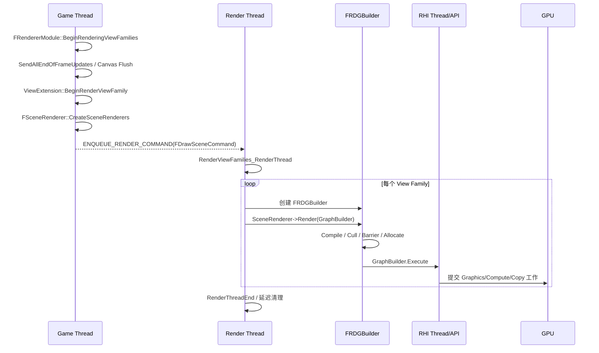
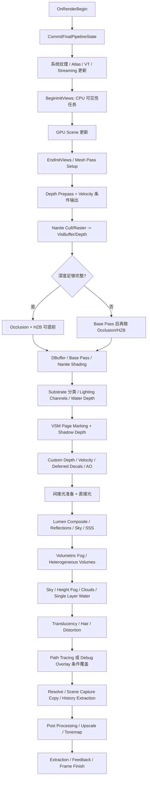
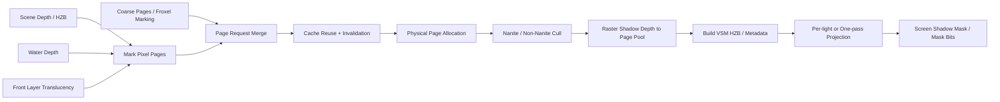

# UE5 Renderer 源码导读：从 View Family 到最终像素

> 本文基于当前仓库 `Build.version`：**UE 5.5.4**。主线源码位于
> `Engine/Source/Runtime/Renderer`，RDG 与通用渲染资源位于 `RenderCore`。不同 UE5 小版本会调整
> Pass 顺序、默认 CVar 和实验功能，阅读其他分支时应以该分支的 `FDeferredShadingSceneRenderer::Render()` 为准。

本文不是 [Renderer_Survey.md](Renderer_Survey.md) 的简单复述，而是从源码控制流重新建立一张更细的地图，重点补充原文较少涉及的内容：

- 游戏线程如何创建 renderer、渲染线程如何建立并执行 RDG；
- `FScene`、`FSceneRenderer`、`FViewInfo`、GPU Scene、Scene Textures、Mesh Draw Command 的所有权与生命周期；
- 深度、遮挡、Base Pass、阴影、Lumen、光照、体积效果、半透明、后处理之间的真实数据依赖；
- Deferred、Desktop Forward、Mobile、Scene Capture、Custom Render Pass、Path Tracing 等分支为何不是同一条固定流水线；
- async setup task、async compute、External Access Queue、跨帧 history、流送反馈和扩展点等工程细节。

## 文档导航

- **架构与主线**：§1-4（模块边界、核心对象、线程入口、Deferred 整帧拓扑）
- **场景到几何**：§5-10（可见性、GPU Scene、Scene Textures、Draw Command、Early-Z、Nanite）
- **光照与阴影**：§11-14（Shadow/VSM、直接光、Lumen、非 Lumen 间接光）
- **画面完成阶段**：§15-18（大气体积、Water/Translucency/Hair、后处理、Ray Tracing/Path Tracing）
- **平台与工程机制**：§19-22（Mobile/Forward/Capture、RDG、扩展点、跨帧缓存）
- **实践索引**：§23-25（性能诊断、源码索引、总结）

---

## 1. 先给出结论：Renderer 不是固定 Pass 列表

UE5 的主渲染器更接近一个**每帧图生成器**：CPU 侧根据 View Family、Feature Level、Shader Platform、Show Flag、场景内容、材质和 CVar，向
`FRDGBuilder` 声明一组 Raster / Compute / Async Compute / Copy Pass；RDG 再根据资源读写关系编译图、裁掉无效节点、安排资源生命周期、插入 barrier，最后提交到 RHI。

因此，下列说法都不够准确：

1. “阴影永远在 Base Pass 后”：Deferred + VSM 通常如此，但 Desktop Forward 为了在 Base Pass 内取阴影，会提前执行 shadow depth 与 projection。
2. “HZB 永远在 Base Pass 前”：完整 Early-Z 时可以提前；深度不完整时，遮挡阶段会延后到 Base Pass 后。
3. “Path Tracer 完全绕过光栅管线”：它最终覆盖 Scene Color，但 renderer 仍执行大量场景更新、可见性、GPU Scene、RT scene、部分公共资源和后处理准备。
4. “GBuffer 是固定六张纹理”：其语义与打包由平台和 `FGBufferParams` 决定；Velocity、Tangent、Static Shadow、Substrate 附加数据均是条件项。
5. “一个引擎帧只有一个 RDG”：同一 Scene 可包含多个 View Family；当前代码为每个 Scene Renderer 建立并执行一个 RDG。

阅读 Renderer 时，应优先追踪三个问题：

- **控制流**：谁决定这个 Pass 是否存在？
- **数据流**：这个 Pass 读写哪些 RDG resource？
- **历史状态**：哪些结果通过 `FSceneViewState`、缓存管理器或流送系统跨帧保留？

---

## 2. 模块边界与核心对象

### 2.1 四层职责

| 层 | 典型对象 | 主要职责 |
| --- | --- | --- |
| Engine | `UWorld`、`UPrimitiveComponent`、`FSceneViewFamily` | 组织游戏世界、组件和玩家视图；在游戏线程发起渲染。 |
| Renderer | `FScene`、`FSceneRenderer`、`FViewInfo` | 维护渲染线程场景镜像，决定一帧画什么并构建 RDG。 |
| RenderCore | `FRDGBuilder`、Shader Map、`FRenderResource` | 图编译、资源状态、shader/PSO 与通用 GPU 资源。 |
| RHI | `FRHICommandList`、`FRHITexture`、`FRHIBuffer` | 抽象 D3D12、Vulkan、Metal 等后端。 |

`Renderer` 不直接等于“所有渲染代码”。例如 RDG 的实现位于
`RenderCore/Private/RenderGraphBuilder.cpp`，Nanite 流送管理器的一部分位于 Engine 模块，而平台命令提交位于 RHI/DynamicRHI。

### 2.2 长生命周期对象与每帧对象

| 对象 | 生命周期 | 作用 |
| --- | --- | --- |
| `FScene` | World 注册到渲染器期间 | 游戏场景的渲染线程镜像；持有 primitives、lights、GPU Scene、距离场、Nanite、Lumen、VSM cache 等。 |
| `FPrimitiveSceneProxy` | Component 注册期间 | 从 UObject 世界隔离出的渲染代理；渲染线程读取，不应反向依赖游戏对象状态。 |
| `FPrimitiveSceneInfo` | Primitive 在 Scene 中期间 | Scene 内部索引、静态 mesh、light interaction、GPU Scene allocation 等的连接点。 |
| `FSceneViewState` | 跨帧/跨 View | 保存 TAA/TSR、Lumen、HZB、曝光、遮挡查询等 history。 |
| `FSceneViewFamily` | 一次 View Family 渲染 | 一组共享 show flags、输出目标和时间设置的 View。 |
| `FSceneRenderer` | 一次 View Family 渲染 | 复制 View Family 成渲染器私有状态，编排本次渲染；结束后延迟销毁。 |
| `FViewInfo` | 一次 Scene Renderer | `FSceneView` 的 renderer 扩展，保存可见性、mesh pass、uniform、history 引用和各子系统的 per-view 数据。 |
| `FRDGBuilder` | 一次 Scene Renderer | 记录、编译并执行该 View Family 的帧内渲染图。 |

这里最重要的边界是：`FScene` 是持续存在的场景数据库，`FSceneRenderer` 是一次渲染请求的执行计划，`FViewInfo` 是该计划中的视图工作集。

---

## 3. 从游戏线程到 GPU 的真实入口

主入口在 `SceneRendering.cpp`：



### 3.1 `BeginRenderingViewFamilies()` 在游戏线程做什么

源码锚点：`FRendererModule::BeginRenderingViewFamilies()`。

1. 调用 `World->SendAllEndOfFrameUpdates()`，确保组件变换、材质和渲染状态的 deferred update 已发送。
2. Flush Canvas，避免 Canvas 命令与 Scene 渲染目标顺序错乱。
3. 更新 Scene frame number、streaming view origins 与 View Family frame counter。
4. 调用每个 `ISceneViewExtension::BeginRenderViewFamily()`；第三方 temporal/spatial upscaler 也在这里注入。
5. 处理 deferred Scene Capture 和 Planar Reflection 更新。
6. `FSceneRenderer::CreateSceneRenderers()` 根据 shading path 创建实际 renderer。
7. 将 renderer 数组捕获进 `FDrawSceneCommand`，交给渲染线程。

`CreateSceneRenderers()` 的核心选择非常直接：

```text
GetFeatureLevelShadingPath(Scene->GetFeatureLevel())
  Deferred -> FDeferredShadingSceneRenderer
  Mobile   -> FMobileSceneRenderer
```

Desktop Forward 并不是第三个 renderer 类；它仍使用 `FDeferredShadingSceneRenderer`，只是在其中由
`IsForwardShadingEnabled(ShaderPlatform)` 改变 Base Pass、阴影和光照阶段。

### 3.2 渲染线程如何执行

`RenderViewFamilies_RenderThread()` 对每个 renderer：

1. 创建带 `ERDGBuilderFlags::Parallel` 的 `FRDGBuilder`；
2. Hit Proxy 模式调用 `RenderHitProxies()`，正常模式调用虚函数 `Render()`；
3. `GraphBuilder.Execute()` 才真正编译和执行刚才声明的图；
4. 将当前 View 信息拷贝到 View State 的跨帧区域；
5. 所有 View Family 完成后，统一结束 Hair、Distance Field、RT Scene 等 per-frame 状态；
6. `RenderThreadEnd()` 等待必要任务，并立即或延迟销毁 renderer。

这解释了为什么在 `FDeferredShadingSceneRenderer::Render()` 中看到的 `RenderBasePass()` 通常不是立即向 GPU 提交：它主要是在
RDG 中登记 Pass 和参数。只有少量 legacy / immediate 路径例外。

### 3.3 多 View Family 的含义

`BeginRenderingViewFamilies()` 要求输入 View Family 指向同一个 Scene，但可一次创建多个 renderer，例如 nDisplay、多 viewport 或辅助 View。
当前实现对每个 renderer 单独创建和执行 RDG，同时共享：

- `FScene` 的持久资源；
- `AllFamilyViews` / `AllFamilies` 汇总信息；
- 部分只应更新一次的资源，例如 RT Scene 的更新权由首个需要光追的 renderer 获得；
- Nanite streaming request 的累积与首 View 更新策略。

因此，优化时要区分“每 Scene 每帧一次”和“每 View Family 一次”的工作，错误放置会在多 View Family 下放大成本。

---

## 4. `FDeferredShadingSceneRenderer::Render()` 的阶段拓扑

下面是 UE 5.5.4 当前实现的逻辑依赖图。它不是严格的 GPU 时间轴：异步任务和 async compute 可与其它节点重叠。



### 4.1 启动与拓扑冻结

函数开头先完成：

- Ray tracing geometry build request；
- `OnRenderBegin()`，创建 Init View 任务数据；
- VT update / feedback begin；
- `CommitFinalPipelineState()`；
- System Textures、Light Function Atlas、Sky Atmosphere light state；
- VSM array 初始化；
- Lumen Scene task 与 Nanite visibility query 的启动；
- Distance Field、Shadow Scene、RT instance gather、SVT/Nanite streaming 的异步更新。

`CommitFinalPipelineState()` 的意义不是创建 PSO，而是把这一帧各 View 的 GI、reflection、AO、HZB 等方法选择提交成不可随意回改的
pipeline state，避免后续阶段相互查询时得到矛盾拓扑。

### 4.2 三种输出深度

`FSceneRenderer::ERendererOutput` 将同一个 renderer 缩短为三种输出：

| 输出 | 行为 |
| --- | --- |
| `DepthPrepassOnly` | 只执行深度预通道及必要的遮挡/拷贝，常用于优化后的 Scene Capture depth。 |
| `BasePass` | 执行 Prepass、Base Pass、必要的水和 capture copy，不进入完整光照/后处理。 |
| `FinalSceneColor` | 完整实时渲染路径。 |

Custom Render Pass 还能在主 View 之前复用 `RenderPrepassAndVelocity` 和 Base Pass，并在结束后恢复主 Scene Texture uniform，防止污染后续状态。

### 4.3 为什么阶段会重排

- 完整 Early-Z 时，Scene Depth 足以提前生成 HZB 和发起 occlusion query；否则 Base Pass 还会写深度，遮挡只能延后。
- Forward Shading 在 Base Pass 内求光照，必须提前得到 shadow map、screen shadow mask 与 volumetric fog。
- VSM page allocation 需要主深度、Single Layer Water depth 和 Front Layer Translucency 标记，因此通常在 Base Pass 后。
- Lumen async indirect 可在直接光照期间运行，最终 composite 被故意延后以增加重叠。
- Sky Atmosphere LUT 可配置在 Prepass 前、Occlusion 前或 Base Pass 前生成，但必须在天空材质和依赖它的 Lumen 更新前可用。

---

## 5. View 初始化与可见性任务图

### 5.1 `BeginInitViews()` 与 `EndInitViews()` 不是简单的一对同步函数

`BeginInitViews()` 启动一组可并行的 setup task，包括 frustum cull、light visibility、relevance、dynamic mesh gathering、shadow setup 等。
主渲染线程继续准备 RT、streaming、FX 和其它资源，直到确实消费结果时才等待。`EndInitViews()` 完成剩余汇合、初始化 View uniform、
建立 mesh pass，随后 Substrate、Hair 等才能读取完整 relevance。

可见性结果不是单个 `VisiblePrimitives` 数组，而是多层输出：

- primitive visibility / fading / occlusion bitset；
- `FPrimitiveViewRelevance`，决定 Base、Depth、Translucency、Shadow、Custom Depth 等 pass relevance；
- visible static mesh elements；
- dynamic mesh element 列表；
- 每个 `EMeshPass` 的 dynamic build request 和可见 Mesh Draw Command；
- light visibility 与 projected shadow 工作集；
- Nanite 自己的 instance / cluster visibility query。

### 5.2 CPU 侧裁剪

典型顺序包括：

1. **Show Flag / Hidden / Owner 条件**：编辑器隐藏、仅 owner 可见等最先排除。
2. **距离裁剪**：Min/Max Draw Distance、Cull Distance Volume、LOD 与 dither transition。
3. **视锥裁剪**：primitive bounds 对 View Frustum；大型场景可借助 Scene spatial structure 减少遍历。
4. **HLOD**：父子节点与过渡状态决定保留 HLOD proxy 还是原始 primitive。
5. **遮挡历史**：读取硬件 query 或 HZB 测试的历史结果；新出现和不确定对象按保守可见处理。
6. **Relevance**：只有通过前述测试的 primitive 才询问 proxy 需要进入哪些 mesh pass。

CPU 可见性重点是 primitive / mesh batch 粒度；Nanite cluster、ISM instance 和部分 Ray Tracing instance 还会继续走 GPU 裁剪。

### 5.3 HZB 与遮挡的双重角色

HZB 从深度构建 mip 金字塔。它不仅用于“物体是否被挡住”：

- Nanite cluster two-pass occlusion；
- GPU instance culling；
- VSM page marking / receiver 分析；
- SSR、SSGI、Lumen screen trace；
- GTAO horizon search；
- 部分 froxel、cloud 和局部体积剔除。

HZB 是跨多个算法共享的屏幕空间加速结构。其生成时机变化，会同时改变可见性与屏幕空间效果的可用输入。

---

## 6. GPU Scene、Scene Uniform 与实例裁剪

### 6.1 GPU Scene 保存什么

`FGPUSceneResourceParameters` 暴露的核心 buffer 包括：

| Buffer | 内容 |
| --- | --- |
| `GPUScenePrimitiveSceneData` | primitive 级 flags、bounds、材质/光照相关索引和 transform 元数据。 |
| `GPUSceneInstanceSceneData` | instance transform、previous transform、primitive id、随机值等 SoA 数据。 |
| `GPUSceneInstancePayloadData` | lightmap、custom data、局部 bounds 等按需 payload。 |
| `GPUSceneLightmapData` | lightmap 相关数据。 |
| `GPUSceneLightData` | GPU 可读的光源数组。 |

持久 primitive 在 Scene 更新阶段分配槽位；每帧动态 mesh 由 `FGPUScenePrimitiveCollector` 收集，在 renderer 生命周期内分配临时范围。
`FGPUSceneDynamicContext` 的生命周期与 `FSceneRenderer` 对齐，销毁前必须确保使用它的 setup / draw task 已结束。

### 6.2 当前帧更新时机

在 `BeginInitViews()` 启动可见性后，renderer 会：

1. 完成 dynamic mesh gathering；
2. 为每个 View 上传 dynamic primitive shader data；
3. 调 `InstanceCullingManager.BeginDeferredCulling()`；
4. 允许 Scene Extension 在 GPU Scene 更新完成后修改 Scene Uniform；
5. 后续 mesh pass 在真正 build rendering command 时消费 GPU Scene 和 instance culling 输出。

Scene uniform 与 View uniform 要分清：前者描述 Scene 共享资源，后者包含相机矩阵、ViewRect、pre-exposure、history transform 等每视图数据。

### 6.3 Instance Culling 的延迟批处理

`FInstanceCullingManager` 不要求每个 mesh pass 立即 dispatch culling。各 pass 注册 context 和 draw request，manager 聚合后生成 compacted instance ID、
indirect args 等 GPU 数据，再由 `FParallelMeshDrawCommandPass::BuildRenderingCommands()` 接入实际绘制。这减少重复 dispatch，也使 GPU-driven
instance 数量不必回读 CPU。

Shadow rendering 前会重新 `BeginDeferredCulling()`，因为 shadow view 可能引用主 View 尚未上传的动态 primitive，并拥有独立的 culling view。

---

## 7. Scene Textures 与 GBuffer 的演化

### 7.1 Scene Textures 不是一次性全部有效

`FSceneTextures` 在 View Family 开始时分配核心目标，但 `SceneTextures.UniformBuffer` 会随着阶段重建：

1. Prepass 后：Scene Depth / Partial Depth 有效；
2. Base Pass 后：Scene Color、GBuffer、可能的 Velocity 有效；
3. Custom Depth、Deferred Decal、AO、独立 Velocity 后：`SetupMode::All`；
4. Single Layer Water prepass 后：主 Depth 可能替换为“场景 + 水”的深度；
5. 后处理前：Scene Color resolve、Custom Depth、Exposure 等打包进 `FPostProcessingInputs`。

Uniform Buffer 的重建不是复制纹理，而是更新 shader 看到的绑定集合。读取尚未 produced 的 RDG resource 会触发验证错误或绑定 fallback。

### 7.2 GBuffer 的正确理解

延迟 Base Pass 保存“稍后求光照所需的材质状态”。典型语义包括：

- encoded world normal；
- base color、metallic、specular、roughness；
- shading model id 与 selective output mask；
- per-model custom data；
- AO、precomputed shadow、anisotropy/tangent；
- velocity（可在 Base Pass、Depth/Velocity 或独立 pass 输出）。

实际 attachment 数、格式和通道由 `GBufferInfo`、平台能力和 `FGBufferParams` 决定。不要把某个平台抓帧中的 A-F 固定布局当成跨平台 ABI。

### 7.3 Substrate 如何改变材质数据流

Substrate 不是“增加一个 shading model id”，而是把材质表示扩展为可组合 BSDF closure，并建立 per-pixel material storage。当前帧中关键步骤是：

1. `PreInitViews()` 与 `InitialiseSubstrateFrameSceneData()` 根据 View / relevance 配置资源；
2. Base Pass 或 Nanite Shading 写 legacy-compatible GBuffer 与 Substrate material data；
3. Base Pass 后执行 material classification，生成 Simple / Single / Complex 等 tile 列表；
4. Deferred Lighting、SSS、rough refraction 等按 tile 类型选择更便宜或更完整的 shader；
5. 使用 stencil 的分类标记在后续阶段清除，避免干扰 responsive AA 等用途。

这是一种“材质复杂度驱动的 tiled shading”：复杂材质付出更多存储和计算，简单像素不必承担最高成本。

---

## 8. Mesh Pass、Draw Command 与 PSO

### 8.1 从 Mesh Batch 到 Draw Command

渲染代理提供 `FMeshBatch`；每种 Pass 的 `FMeshPassProcessor` 判断该 batch 是否参与，并选择：

- material shader permutation；
- vertex factory；
- blend / rasterizer / depth-stencil state；
- render target layout；
- shader bindings 与 draw parameters。

结果编码为 `FMeshDrawCommand`。静态 mesh command 可在场景注册或更新时缓存；dynamic mesh command 每帧生成。

### 8.2 每帧不是把所有 Draw Command 直接循环提交

`FParallelMeshDrawCommandPass` 把工作拆为：

1. `DispatchPassSetup()`：过滤缓存命令、构造动态命令、生成 sort key、合并兼容 draw；
2. GPU instance culling：生成可见 instance list 与 indirect args；
3. `BuildRenderingCommands()`：等待 setup，并把 culling 输出接入 command；
4. `Draw()` / `Dispatch()`：在 RDG raster pass 中记录实际 RHI draw。

这种设计让可见性、命令生成和渲染线程其它工作重叠，也让相同 PSO / shader bindings 的静态 mesh 可以合并 instancing。

### 8.3 PSO precache 与 permutation 成本

Renderer 中大量 `CollectPSOInitializers()` 不是渲染逻辑本身，而是在已知材质、vertex factory 和 pass 配置时预收集 PSO，降低运行时 hitch。
功能开关若进入 shader permutation，会扩大 cook 与 PSO 数；能成为 runtime branch、atlas lookup 或数据驱动参数的功能，通常更利于控制组合爆炸。

---

## 9. Early-Z、Velocity、Nanite 与 Base Pass 的结合

### 9.1 Early-Z 模式

`EDepthDrawingMode` 决定传统几何在 Prepass 画多少：不画、非 masked、大遮挡体、全部 opaque、仅 masked、全部 opaque 但 velocity 分离等。
Prepass 的收益来自减少昂贵 Base Pass overdraw，并为 DBuffer、HZB、occlusion 和 GPU-driven 系统尽早提供深度；代价是重复变换和光栅化。

Masked material、Pixel Depth Offset、World Position Offset 会降低 position-only 快速路径的适用性。是否完整 Early-Z 不能只看 `r.EarlyZPass`，还受平台、Nanite、DBuffer、材质和项目设置影响。

### 9.2 Velocity 的三种常见来源

- Base Pass MRT 直接输出；
- `DDM_AllOpaqueNoVelocity` 下，Opaque Velocity pass 同时补全 Early Depth；
- Base Pass 后的独立 Velocity pass。

半透明 velocity 更晚，在 Translucency 后单独绘制，因为它可能写自己的 depth/velocity。TSR/TAA、motion blur、Lumen 和 stochastic denoiser 都依赖 velocity 与 previous transform 的一致性。

### 9.3 Base Pass 在 Deferred 与 Forward 的差异

| 路径 | Base Pass 输出 / 工作 |
| --- | --- |
| Deferred | 主要写材质 GBuffer、自发光和预计算/间接项；直接光稍后按屏幕像素求值。 |
| Desktop Forward | 在 Base Pass 读取 light grid、shadow mask、fog 等并直接求光照；不走标准 deferred light accumulation。 |
| Mobile Forward | 使用移动端专用 shader permutation、lightmap policy、方向光/局部光和 tile GPU 约束。 |
| Nanite | 先写 visibility/depth，再通过 material/shading bin 执行 shading，最终写与传统路径兼容的 Scene Textures。 |

### 9.4 Base Pass 周围容易漏掉的阶段

- DBuffer decal 在 Base Pass 前写 DBuffer，Base Pass 材质读取并融合；
- Custom Depth 可配置在 Base Pass 前或后；
- Lighting Channel 要在 deferred decal 改写 stencil 前复制出来；
- Substrate classification 在 Base Pass 后、VSM 与 tiled lighting 前；
- Single Layer Water depth prepass 必须在 VSM page allocation 前；
- Exposure illuminance 会在光照前提取 emissive，稍后再完成计算。

---

## 10. Nanite：从 Cluster 到材质着色

Nanite 的完整源码横跨 `Renderer/Private/Nanite` 与 Engine 中的资源/流送代码。其主帧路径可拆成五层。

### 10.1 离线数据

静态网格被分割成 cluster，并构建层级和可流送 page。每个 cluster 有误差度量、bounds、material range 和压缩几何数据；层级节点允许 GPU 根据屏幕误差选择足够精细的 cluster，而不是选择整个 mesh 的单一 LOD。

### 10.2 Streaming

Root page 常驻，细节页按 GPU feedback、显式 prefetch 和资源请求进入 streaming manager。每帧：

1. `BeginAsyncUpdate()` 处理上一批反馈、IO/transcode/install；
2. 资源修改会通知 Nanite RT manager；
3. Raster 产生新的 page request；
4. `SubmitFrameStreamingRequests()` 在帧后段提交请求。

Streaming pool 超订时可通过 quality scale 降低目标细节，避免只表现为随机缺页。

### 10.3 GPU Culling

GPU 从 instance 开始遍历 cluster hierarchy，执行 frustum、distance/LOD、HZB occlusion 等测试。常见 two-pass 策略是：

- Main pass 使用上一帧 HZB，快速处理大部分确定可见 cluster；
- Post pass 针对被旧 HZB 判遮挡但本帧可能因 disocclusion 重新出现的 cluster，使用当前深度/HZB 再测试。

这在遮挡保守性和避免整帧延迟之间折中。

### 10.4 Hybrid Raster

大三角形适合固定功能硬件 raster，小到会造成低效率的 cluster 可走 compute software raster。两条路径写统一的 Nanite visibility/depth 结果。
Visibility Buffer 编码可追溯到 instance/cluster/triangle 的标识，而不是直接执行完整 material pixel shader。

### 10.5 Material Shading

Raster 完成后，Nanite 根据可见像素和材质建立 shading bin，通过 compute/material pass 只对真正可见的表面着色，再写 Scene Color、GBuffer、Velocity 和 Substrate data。
因此 Nanite 不是“没有 Base Pass”，而是把传统“几何光栅 + 材质着色绑定在一次 draw”解耦为 visibility 与 shading 两阶段。

### 10.6 与其它系统的接口

- VSM 有 Nanite 专用 shadow cull/raster，可直接输出虚拟页；
- Lumen Surface Cache 使用 Nanite card capture shading commands；
- Custom Depth 根据 Nanite visibility result 生成 instance draw list；
- Ray Tracing 可使用 fallback mesh，当前分支也有 Nanite RT manager 维护动态 RT 表示；
- Scene Capture、Hit Proxy、debug visualization 各自有显式兼容路径，不能假设都复用主 View 结果。

---

## 11. 阴影系统：从 caster setup 到 screen mask

UE5 的阴影不是单一算法，而是多个“生成可见性”路径，最后向直接光照提供 shadow factor / transmittance：

| 路径 | 适用范围 | 主要表示 |
| --- | --- | --- |
| 传统 Shadow Map | CSM、spot、point/cube、per-object、preshadow | Atlas / cube depth texture |
| Virtual Shadow Map | 高端动态阴影，尤其 Nanite | 虚拟页表 + physical page pool |
| Ray Traced Shadow | 支持 HWRT 的光源 | ray hit / visibility + denoiser |
| Distance Field Shadow | 大范围方向光/软阴影补充 | Mesh / Global SDF cone or sphere trace |
| Capsule Shadow | 角色低频间接/接触阴影 | capsule analytic occlusion |

### 11.1 阴影 setup 是 CPU task graph 的一部分

`BeginInitDynamicShadows()` 启动 shadow setup；它依赖 light visibility、primitive relevance、light-primitive interaction、cached mesh command 等任务。
`CreateDynamicShadows()` 为可见光创建 `FProjectedShadowInfo`，决定：

- shadow 类型与投影矩阵；
- 分辨率、fade、atlas allocation；
- subject / receiver primitive；
- cached static、movable、one-pass point light 等模式；
- VSM id 或传统 shadow depth 资源；
- 各 shadow view 的 mesh draw setup。

方向光 CSM 是 view-dependent 的正交 split；point light 可使用 cubemap / one-pass 分层输出；spot light 使用透视投影；preshadow 与 per-object shadow
解决静态世界和可动物体之间的局部交互。传统路径在 `RenderShadowDepthMapAtlases()` 写 depth，再由 `RenderShadowProjections()` 投影到屏幕 shadow mask。

### 11.2 传统 Shadow Map 的缓存与投影

传统 whole-scene cache 可把静态 caster 深度保留，更新时只绘制 movable 部分并与 cache 合成。其收益取决于光和静态场景是否稳定；移动光或大量
WPO/deformable caster 会显著降低命中率。最终投影阶段按 View 和 light scissor 读取 shadow depth，输出 light attenuation；VSM shadow 在这里会被跳过，
因为它由独立 projection 路径处理。

Shadow Depth mesh processor 尽量使用 position-only vertex stream 和 null pixel shader；masked/WPO/PDO material 则必须运行更完整的 shader。
“阴影 draw 很多”不一定意味着 triangle 太多，也可能是大量材质状态、shadow view、atlas split 或无法缓存的 caster 导致。

### 11.3 VSM 的地址空间

`FVirtualShadowMap` 定义了固定的虚拟地址结构：Level 0 的页维度乘 page size 形成很高的虚拟分辨率，并有多级 mip。关键是“虚拟”：
没有任何一盏灯常驻一张同尺寸物理纹理。每帧只有 receiver 实际请求的 virtual page 映射到 physical pool。

方向光使用 `FVirtualShadowMapClipmap`：多个以相机附近为中心、尺度递增的 VSM level 覆盖近远区域。各 level 的中心按页粒度 snap，缓存支持
clipmap panning，使相机平移时旧物理页可以重映射而非全部重画。局部光按投影和 mip 选择页面；很远/很小的局部光还能进入 distant-light 模式，
降低更新频率与页表开销。

### 11.4 一帧 VSM 的数据流



具体而言：

1. 主 Scene Depth、Water depth 和 front-layer translucency 把屏幕 receiver 反投影到各灯的 virtual space，标记需要的页；
2. coarse page 保证低分辨率覆盖，避免离屏/体积效果完全无数据；
3. cache manager 复用上一帧 page table、page flags、projection data 和 physical pages；
4. 新页从 pool 分配，未请求过久的页按 age 回收，接近容量时可提高全局 LOD bias；
5. Nanite 和非 Nanite caster 分别裁剪并只向 mapped page 光栅化；
6. projection shader 读取 physical page pool，以 SMRT 方式采样并产生软阴影；
7. local light 可用 one-pass projection 写 packed shadow mask bits，方向光仍独立投影。

### 11.5 VSM 缓存为什么会失效

`FVirtualShadowMapArrayCacheManager` 追踪 per-light、per-shadow-map 和 primitive instance 的状态。典型失效源：

- primitive add/remove/transform change；
- deformable mesh、WPO 或动态缓存分类；
- 原本被 CPU cull、后来 revealed 的非 Nanite primitive；
- light transform、projection、clipmap level 或深度范围变化；
- physical pool pressure 与 page age 回收。

失效不是简单“整盏灯重画”：系统先用 light radius、bounds，甚至上一帧 HZB 排除无影响或完全遮挡的 instance，再把覆盖到的页标 dirty。
Static Separate Cache 将静态和动态 caster 分层，能保留静态页，但会增加 physical pool 成本。排查 VSM 性能应看 requested/new/cached/invalidated page，
而不是只看 `ShadowDepths` 总时间。

### 11.6 VSM 与半透明、Hair、Subsurface

- Front Layer Translucency 可在 page marking 阶段贡献 receiver；
- lit translucency 默认不等价于 opaque 的高质量 VSM 采样，高质量模式有显著成本；
- Hair 使用独立输入类型、hair depth/voxel 和 transmittance；
- Subsurface projection 可根据 opacity 扩大有效 light source radius，模拟更柔和的透射阴影；
- one-pass local projection 依赖 Forward Light Grid，因此即使 Deferred 逐灯光照，也可能必须建立 light grid。

### 11.7 Ray Traced 与 Distance Field Shadow

Ray traced shadow 为 light 生成 visibility / hit-distance，再由 denoiser 根据光源尺寸和需求重建 penumbra。其主要成本不只是 ray dispatch，还包括 TLAS/BLAS 更新、
material any-hit、alpha mask、多个 light batch 和时空降噪。

Distance Field Shadow 对 Mesh SDF / Global SDF 做 sphere tracing，适合较长距离的软阴影。它避免高分辨率 shadow map，但依赖 distance-field asset、atlas streaming
和 conservative bias；薄片、非均匀缩放、开放网格、WPO 会产生表示误差。最终它通常与其它 shadow term 合成，而不是替代所有近场阴影。

---

## 12. 直接光照：逐灯、Light Grid 与 MegaLights

### 12.1 Light gather / sort 是公共前置

`GatherAndSortLights()` 在 setup task 中收集可见光，按类型和渲染策略划分区间，结果 `FSortedLightSetSceneInfo` 同时服务于：

- Deferred light draw；
- Forward / clustered light grid；
- VSM local light page marking 与 one-pass projection；
- Translucency Lighting Volume；
- MegaLights；
- Lumen、Volumetric Fog / Cloud、Local Fog 等需要局部光的系统。

“Deferred 是否需要 light grid”不只由 clustered deferred 决定。VSM、Lumen、体积效果或 debug view 都可能使 `bComputeLightGrid` 为真。

### 12.2 标准 Deferred Lighting

Base Pass 已将材质属性写入 GBuffer。Deferred light pixel shader 从 depth 重建 translated world position，读取 normal、roughness、metallic、base color、shading model，
再求局部光 BRDF 和 attenuation。方向光画 fullscreen；有限光画 sphere/cone 等 bounds，并结合 scissor、stencil/depth bounds 减少无效像素。

概念上单像素输出可写为：

$$
L_o = L_e + L_{indirect} + \sum_l V_l A_l\left(f_d + f_s\right)L_l
$$

其中 $V_l$ 来自 VSM / shadow map / ray traced shadow，$A_l$ 包含距离与角度衰减、IES、light function、lighting channel 等。
实际 shader 还按 shading model、Hair、Substrate tile、light shape 和 source texture 分支。

### 12.3 Forward Light Grid 与 Clustered

Forward shading 无法先画 GBuffer 再逐灯，因此将局部光注入 view-space 3D grid。XY 按 screen tile，Z 通常按非线性深度分层；每个 cell 存影响它的 light index。
Base Pass 像素只遍历本 cell 的光。Reflection Capture、fog、Lumen 或 clustered deferred 也可读取同一类数据。

Clustered 的核心收益是把复杂度从“每灯覆盖大量屏幕像素”变为“每像素遍历局部候选列表”，适合许多小光；但极密重叠会使 cell list 变长，
并增加 cull/injection、buffer 和 overflow 风险。

### 12.4 Light Function Atlas 与 IES Atlas

Legacy light function 会逐灯渲染材质到屏幕/volume，状态切换和重复求值较贵。`FLightFunctionAtlas`：

1. 按材质去重 light function；
2. 分配 atlas slot；
3. 将兼容 function 渲染到 2D atlas；
4. 为每盏灯保存 UV 和 light-space transform；
5. Deferred、Lumen、Volumetric Fog 等统一采样。

IES Atlas 同样把灯具强度曲线集中管理。Atlas 化的价值不只是省纹理，还让多灯 batch / one-pass shader 不必逐灯切换 material pipeline。

### 12.5 MegaLights

MegaLights 面向大量重叠、可投影阴影的局部光。与确定性地遍历 cell 中所有光不同，它在受控样本预算下随机选择候选光，追踪 VSM 或 HWRT 可见性，
再以 temporal accumulation、moments 和 spatial filter 重建稳定结果。其关键权衡是：

- 光数量增加时，单像素样本预算不必线性增加；
- 稀有但极亮的光需要良好的候选概率和权重；
- history guide 可减少持续被挡光的无效样本，但快速运动/显隐会挑战 history；
- 噪声、响应速度和 ghosting 由采样数与滤波共同决定。

MegaLights 不是 Lumen GI。它解决直接局部光与阴影；Lumen 解决间接漫反射/反射，并可有自己的 surface-cache direct lighting。

### 12.6 Translucency Lighting Volume

传统 lit translucency 不能直接读取 deferred GBuffer，因此建立围绕相机的级联 3D lighting volume。光源按 bounds 注入，支持 batch、shadow、VSM id、ambient cubemap，
随后 filter；半透明材质在 forward shading 时采样体积。FOV 会 clamp 和 snap，volume center 按 voxel 尺寸 snap，以降低相机运动造成的 shimmering。

---

## 13. Lumen：场景表示、追踪与 Final Gather

把 Lumen 理解成单个“GI Pass”会遗漏其主要结构。它至少有四层长期/短期复用：

| 层 | 空间 | 保存内容 | 主要用途 |
| --- | --- | --- | --- |
| Lumen Scene / Mesh Cards | 世界空间 | 几何的 card 表示 | 离屏命中与 surface 参数化 |
| Surface Cache | card atlas | albedo/normal/emissive/depth/lighting | 廉价 hit lighting 与多次复用 |
| Radiance Cache | 世界空间 clipmap probe | 方向辐亮度/irradiance/occlusion | 远处、粗糙反射、translucency 等低频复用 |
| Screen Probe / Reflection History | 屏幕空间 | 当前 View 的采样与时空历史 | 最终像素质量与抗噪 |

### 13.1 Lumen Scene 与 Surface Cache

离线/构建数据为 mesh 生成多个 oriented card。运行时 `FLumenSceneData` 按 primitive group 管理 Mesh Cards、Card、page table 和 physical atlas。
View feedback 决定哪些 card page 需要更高分辨率或更新；未覆盖区域会在 Surface Cache visualization 中表现为缺失。

Card capture 从 card 方向建立临时 View：传统 mesh 用专用 VS/PS，Nanite 用 `ENaniteMeshPass::LumenCardCapture` compute shading。
capture 产生 Albedo、Opacity、Normal、Emissive、Depth，再复制/压缩到持久 atlas。Direct Lighting、Radiosity 与 Final Lighting 使用独立 atlas，
避免每条 GI/reflection ray 在命中点重新运行完整材质和光照。

### 13.2 Surface Cache 是按预算增量更新

每帧不会重画全部 atlas。`BuildCardUpdateContext()` 根据 feedback、距离、lighting change 与 update factor 选择 page/tile；direct lighting 和 radiosity 各有预算。
强制全更新会引起巨大 spike，但渐进更新会在快速光照变化时产生收敛延迟。这也是 Lumen “更新速度 vs. 稳定成本”的根源之一。

Surface Cache lighting 可以读取 light function atlas、cloud transmittance，并用 Mesh SDF、Global SDF、heightfield 或 HWRT 计算离屏 shadow。
最终 `CombineLumenSceneLighting()` 把 emissive、direct 和 indirect 合成 Final Lighting Atlas。

### 13.3 追踪层级

典型 Lumen ray 不是只选择一种求交：

1. **Screen Trace**：使用当前/上一帧 depth、HZB 和 scene color，命中当前可见表面，细节最高且便宜；
2. **Mesh SDF Detail Trace**：软件路径近场追踪对象 SDF，精度较高但实例密集时成本高；
3. **Global SDF**：clipmap 合成场，覆盖远处，精度较低但遍历稳定；
4. **Heightfield / Voxel**：针对 landscape 和 Lumen voxel lighting；
5. **Hardware RT**：用 TLAS 求交，可选择 Surface Cache hit lighting 或在 hit 处运行更完整材质/直接光；
6. **Far Field**：可选的远距离 representation，与 near field 通过 dither 区间衔接。

Screen Trace 提供“画面中已经有的高频细节”，world-space representation 提供离屏 fallback。关闭 screen trace 并非单纯降质，它会暴露 Scene representation 的误差。

### 13.4 Screen Probe Gather

Screen Probe Gather 在规则 screen tile 放置 probe，并在几何/深度变化区域增加 adaptive probe。每个 probe 将方向映射为 octahedral layout：

1. 生成/采样 BRDF PDF 与 importance direction；
2. screen trace，miss 再进入 SDF/HWRT/world trace；
3. 从 Surface Cache 或 hit lighting 取 radiance；
4. spatial/temporal filter probe；
5. 按 depth、normal、position 对 full-resolution pixel gather；
6. 另算 full-resolution short-range AO / bent normal，补足 probe 下采样丢失的接触遮蔽。

Probe 间距、octahedron resolution、adaptive allocation、history rejection 和 moving-light fast-update 共同控制成本与 ghosting。当前分支还包含实验性 ReSTIR Final Gather，
但默认 Screen Probe 仍是主要路径。

### 13.5 Radiance Cache

Radiance Cache 是相机周围多级 clipmap probe cache。消费者先标记需要的 probe，系统复用仍有效的条目，只从预算中选一部分 retrace，再做 neighbor spatial filter 和 atlas mip。
它用于 Screen Probe 的远距离 radiance，也可服务 rough reflection、translucency GI volume、Lumen visualization 等。

Radiance Cache 擅长低频和远距离重用，不适合精确镜面细节；probe 留存过久会 stale，过短则失去跨帧复用。世界空间 cache 与屏幕 history 同时存在，
所以相机运动和光照运动对它们的失效模式不同。

### 13.6 Lumen Reflections

Lumen reflection 按 roughness 和 pass 类型为 opaque、Single Layer Water、Front Layer Translucency 建立 tracing tile：

- screen trace 捕捉当前可见高频细节；
- compact unresolved ray，提高后续 SDF/HWRT dispatch 利用率；
- Surface Cache 模式以较小 payload 取得 hit radiance；
- Hit Lighting 模式在 hit 处评估材质/光照，质量更高但需要更完整 SBT、light grid 和 shadow ray；
- rough ray 可提前使用 Radiance Cache；
- spatial reconstruction、temporal filter、neighborhood clamp 与 bilateral filter 降噪。

Front Layer Translucency 先单独写 frontmost depth/normal，再只为该层计算高质量 reflection；其它透明层仍使用较低频的 translucency lighting/radiance cache。

### 13.7 Async Lumen 如何与直接光重叠

Deferred 主线在 Base Pass 后调用 `DispatchAsyncLumenIndirectLightingWork()`。如果平台支持且选择 inline HWRT，Screen Probe 与 reflections 可进入 async compute。
随后 graphics queue 执行 shadow、decal/AO、传统 direct lights；`RenderDiffuseIndirectAndAmbientOcclusion()` 第一次启动/取得必要输出，第二次在 direct lights 后做 regular Lumen composite。

这种“先 dispatch、后 composite”是理解 GPU profile 的关键：Lumen event 的 wall-clock 区间可能与直接光重叠，单纯把各 event duration 相加会高估帧时间。

---

## 14. 非 Lumen 间接光、反射与 AO

### 14.1 方法选择不是互斥到只剩一个效果

`FPerViewPipelineState` 分别提交 Diffuse Indirect、Reflections、Ambient Occlusion 方法。可能的组合包括：

- baked lightmap / volumetric lightmap + reflection capture + SSAO；
- SSGI + SSR；
- Lumen GI + Lumen reflection + short-range AO；
- Lumen GI + 独立 reflection 方法；
- plugin GI；
- debug / Scene Capture 关闭部分方法。

因此应分别检查 `DiffuseIndirectMethod`、`ReflectionsMethod`、`AmbientOcclusionMethod`，不要只检查“Lumen 开关”。

### 14.2 Static Lighting 与 Reflection Environment

Lightmap policy 在 Base Pass 选择 baked direct/indirect 数据来源；动态 primitive 可采样 Volumetric Lightmap 或 Indirect Lighting Cache。
Reflection Capture 被过滤为 roughness mip 的 cubemap array，局部 sphere/box capture 做 parallax correction 和权重混合；Sky Light 提供 diffuse SH 与 specular cubemap。

Deferred reflections/sky pass 将 SSR/Lumen/RT reflection、reflection capture、Sky Light 与 specular occlusion 按 roughness 和有效性合成，而不是简单互相覆盖。

### 14.3 SSR 与 SSGI

SSR/SSGI 使用 depth、normal、HZB 和 previous scene color 做 screen-space ray march。优势是直接命中最终可见几何与材质细节；限制是：

- 无法命中屏幕外或被前景遮住的表面；
- thickness 与 depth discontinuity 会造成漏光/断裂；
- 依赖上一帧 scene color 时会引入时域延迟；
- 需要 fallback 或 fade 隐藏 miss。

Renderer 在帧末按需求提取 Scene Color 与 Depth 到 `PrevFrameViewInfo`，下一帧 screen trace 使用 pre-exposure correction 与 previous screen transform 对齐。

### 14.4 SSAO、GTAO、DFAO 与 Short Range AO

| 方法 | 输入表示 | 特点 |
| --- | --- | --- |
| SSAO | depth/normal | 屏幕空间、便宜、半径有限 |
| GTAO | depth/HZB/normal/velocity | horizon search，可时空滤波 |
| DFAO | Mesh + Global SDF | 世界空间较长距离，输出 bent normal |
| RTAO | TLAS | 几何覆盖好，需 HWRT 与 denoise |
| Lumen Short Range AO | full-res screen trace/HWRT | 补 Screen Probe 的近场接触细节 |

`CompositionLighting.ProcessAfterBasePass()` 负责 deferred decal 与 SSAO/GTAO 等 pre-lighting 工作；DFAO 还可作为 movable Sky Light 或 indirect shadowing 的输入。
当 Lumen short-range AO 开启时，额外 SSAO 通常不是默认必要项，但可按 scalability 作为替代。

### 14.5 Global Distance Field

Global Distance Field 将附近 Mesh SDF 合成到围绕 View 的多个 clipmap。相机移动时只更新新暴露区域和被修改 primitive 影响的区域，避免全 volume 重建。
Lumen、DFAO、distance-field shadow、particle collision 等可共享这套表示。它本质是低分辨率 signed distance approximation：小物体、薄墙和重叠表面可能消失，
因此 Lumen 近场常先 trace Mesh SDF，再转入 Global SDF。

---

## 15. 天空、大气、雾与体积云

### 15.1 Sky Atmosphere LUT 链

Sky Atmosphere 将昂贵的大气积分分解为可复用 LUT：

| 资源 | 表达 |
| --- | --- |
| Transmittance LUT | 光线穿过大气的透射率 |
| Multi-Scattering LUT | 多重散射近似 |
| Sky View LUT | 当前 View 方向上的天空辐亮度 |
| Camera Aerial Perspective Volume | View froxel 中的 inscattering / transmittance |
| Distant Sky Light LUT | Sky Light 远场积分 |

LUT 可走 async compute，并读取大气光、opaque shadow、VSM、cloud shadow / sky AO。它们还会写入 Scene/View uniform，供 sky material、fog、Lumen 和 real-time
Sky Light capture 使用。生成位置可配置在 Prepass 前、Occlusion 前或 Base Pass 前；唯一可靠的顺序是资源依赖，而不是某个固定行号。

### 15.2 Height Fog 与 Local Fog Volume

Exponential Height Fog 以解析近似根据世界高度积分 extinction 与 inscattering，再全屏合成。Local Fog Volume 是有限局部体，可按 View 排序并 tile cull：

- 若启用 Volumetric Fog，可 voxelize 到 volumetric grid；
- 也可在 Height Fog pass 或独立 pass 合成；
- 移动端可走 half-resolution LFV；
- renderer 明确维持 Height Fog、LFV、Volumetric Fog 的组合次序，避免重复应用。

### 15.3 Volumetric Fog

Volumetric Fog 把视锥离散成 froxel volume：

1. 初始化 extinction、albedo、emissive 等 volume material 属性；
2. 将方向光、局部光、light function、shadow、Sky / Lumen translucency lighting 注入；
3. 使用 temporal reprojection 降低每帧采样需求；
4. 沿 View ray 累积 scattering 与 transmittance；
5. Fog composition 和透明材质采样 integrated volume。

局部 shadowed light 可单独注入，directional light function 会建立针对 volume 的投影。Forward Shading 必须在 Base Pass 前计算 fog，Deferred 则在 Lumen GI 与 shadow depth 后计算。

### 15.4 Volumetric Cloud

Volumetric Cloud 用 volume material ray march 求 density、single/multiple scattering approximation 和 transmittance。当前实现包含：

- conservative density / empty-space skipping；
- cloud shadow map、sky AO、local light sampling；
- VSM atmospheric-light shadow sampling；
- min/max depth 限制无效 ray interval；
- low-resolution Volumetric Render Target + temporal reconstruction；
- per-pixel tracing 处理近景边缘或最终复合。

当支持 async compute 时，cloud offscreen tracing 在 Lumen async 之后启动，与 opaque graphics 工作重叠；之后 reconstruction 和 composition 等待必要输入。
水下 View、Single Layer Water 和 alpha holdout 会改变 cloud/fog 的复合目标与顺序。

### 15.5 Heterogeneous Volumes

Heterogeneous Volumes 面向由 volume material 描述的烟、火等非均匀介质。它与全屏 Volumetric Fog 不同：每个 volume 有局部 bounds、LOD 和体素表示，支持：

- live shading / lighting cache；
- sparse voxel pipeline 与 top-level / bottom-level grid；
- adaptive volumetric shadow map；
- shadow ray march 或 hardware ray tracing；
- height / volumetric fog 应用；
- before/after translucency composition 与 holdout。

主线在 opaque Base Pass 后先生成 heterogeneous shadow，再在 lighting/fog 后渲染介质，最终按配置在 translucency 前或后 composite。

---

## 16. Single Layer Water、半透明、Hair 与 OIT

### 16.1 为什么 Single Layer Water 独立

Single Layer Water 是“不透明几何流程中的透明表面特例”。它使用专门 shading model 和 pass，以避免通用多层透明的巨大成本：

1. 可选 water depth prepass 生成包含水面的 depth；
2. 保存 `SceneWithoutWater` color/depth，供 refraction；
3. water pass 读取 opaque lighting、fog/cloud、shadow 与 reflection；
4. Deferred 下再执行 SSR/Lumen reflection composite；Forward 在 water GBuffer/pass 内应用 reflection；
5. 若有 prepass，后续主 Scene Depth 替换为“opaque + water”版本。

水下相机先渲染 underwater translucency / fog，再渲染水面；水上相机顺序相反。这正是固定“sky -> fog -> water -> translucency”列表会失真的地方。

### 16.2 Translucency pass 分类

当前代码将透明材质映射到多个 `ETranslucencyPass`：

- Before Distortion / Modulate；
- After DOF / Modulate；
- After Motion Blur；
- Holdout；
- All（合并路径）。

这些不是命名上的标签，而是独立 `EMeshPass`、排序键、render target 和 post-process composite 时机。After DOF、modulate、after motion blur 必须放在 separate buffer；
普通 translucency 在降分辨率时也进入 separate translucency。

### 16.3 Separate Translucency 与动态分辨率

Separate Translucency 有独立 screen percentage，并可建立 Dynamic Render Scaling budget。其 heuristic 使用分辨率面积近似二次成本模型：

$$
C(s) \approx s^2, \qquad s_{new} \approx s_{old}\sqrt{\frac{t_{target}}{t_{measured}}}
$$

低分辨率结果用 bilinear 或 depth-aware nearest-depth 方式上采样。Light Shaft Bloom 也可能写入该 buffer，因此 renderer 在 light shaft 后才统一 upsample。

### 16.4 排序与 OIT

传统 alpha blend 仍依赖 back-to-front primitive sort，交叉面或单 mesh 内三角形会出错。UE 提供两层增强：

- **Sorted Triangles**：为每实例重排 index buffer，改善 mesh 内部顺序；
- **Sorted Pixels / MLAB**：硬件支持 ROV/OIT 时，每像素保留有限 fragment 样本，最后 compute combine。

MLAB 是 bounded-memory approximation，不是无限深度 A-buffer；最大样本数和 transmittance cutoff 决定成本与深层透明误差。

### 16.5 Lumen 透明光照

透明表面可同时使用：

- 传统 Translucency Lighting Volume 的直接光；
- Lumen Translucency GI Volume 与 temporal history；
- Radiance Cache glossy reflection；
- frontmost layer 的专用 Lumen reflection；
- high-quality VSM translucency shadow（按项目取舍）。

因此“Lumen 支持透明”并不表示所有层都使用 opaque 同质量 tracing。前层、体积和后续 alpha layer 使用不同近似。

### 16.6 Hair Strands

Hair 有独立 visibility / coverage / material 数据，不适合普通 GBuffer。主线通过 bookmark 在多个阶段调度：

- skin cache 后 interpolation；
- shadow-only groom 补更新；
- Hair pre/base pass；
- light、shadow/transmittance 与 scene-color scattering；
- 在 translucency 前或后 composition；
- 最终 debug 与 history。

Hair 深阴影、voxel/transmittance 和 subpixel depth 会参与 shadow projection。Hair event 分散在整帧多处，阅读时应沿 bookmark 枚举而不是只搜 `RenderHair()`。

---

## 17. 后处理：动态 Pass Sequence 与时序重建

### 17.1 后处理并非一条硬编码链

`AddPostProcessingPasses()` 建立 `TOverridePassSequence<EPass>`：每个 pass 根据 View、Show Flag、AA method、blendable、输出尺寸和 debug mode 启用，
View Extension 可注册 after-pass callback，最后一个有效 pass 可直接 override View Family output，省去额外 copy。

典型主链可概括为：

```mermaid
flowchart LR
	A[Resolved HDR Scene Color] --> B[DOF / Before-DOF Materials]
	B --> C[Temporal Upscaler: TSR/TAA/Third Party]
	C --> D[Motion Blur]
	D --> E[Before-Bloom Materials]
	E --> F[Downsample + Local Exposure + Eye Adaptation]
	F --> G[Bloom / Lens Flare]
	G --> H[Tonemap + Color Grading]
	H --> I[FXAA / After-Tonemap Materials]
	I --> J[Debug/Editor/HMD/Upscale]
```



但 DOF、TAA 与 translucency resources 的组合会改变实际顺序，Path Tracing/debug view/mobile 还有独立 sequence。

### 17.2 TSR、TAA 与第三方 Upscaler

Temporal upscaler 输入至少包括 HDR scene color、depth、velocity、exposure 和 previous history。第三方 upscaler 通过 `ITemporalUpscaler` 接口在
`ISceneViewExtension::BeginRenderViewFamily()` 注入，并拥有自己的 history object。

TSR 不只是“大分辨率 TAA”，其阶段包含 velocity dilation、history decimation/reprojection、shading rejection、flickering/moire heuristic、spatial AA、history update 与 resolve。
Renderer 在 translucency 前提取 flickering luminance，避免透明粒子污染 opaque moire 判定；separate translucency 在合适时机作为 upscaler input/composite。

所有时序方法的共同约束：

- current/previous jitter、ViewRect、pre-exposure 必须一致换算；
- velocity 要覆盖移动物体与相机运动；
- disocclusion、normal/depth mismatch 要拒绝 history；
- history 太重会 ghost，太轻会 flicker/noise；
- camera cut、分辨率变化和 method change 要 invalidate history。

### 17.3 DOF

Diaphragm DOF 以 circle of confusion 区分 near/far blur，按 tile 分类，再结合 gather 与 scatter 处理不同半径。大 blur 用 scatter 更有效，小 blur 用 gather 更稳定；
bokeh diaphragm 形状、foreground dilation 和 recombine 处理遮挡关系。DOF 与 After-DOF translucency 的资源分离是为了让粒子/UI 不被错误模糊。

### 17.4 Motion Blur

Motion Blur 先将 per-pixel velocity flatten 到 tile min/max，再扩张邻域，按最大速度选择 gather 或 scatter，并可使用 half-res color input。高速运动超过固定 gather 邻域时必须 scatter。
TSR 可提供可复用的 velocity flatten，避免重复工作；但相机 motion override、正交 View 等情况会禁用复用。

### 17.5 Exposure 与 Local Exposure

Auto Exposure 从 luminance downsample / histogram 估计目标 EV，并按 speed up/down 平滑写入 View State。Pre-exposure 在渲染时提前缩放 HDR 值，使 FP buffer 保持合适范围；
跨帧 history 采样必须乘 pre-exposure correction。

Local Exposure 通过局部 luminance / bilateral grid 调节暗部和亮部，可同时影响 bloom setup 与 tonemap。它不是独立“最终亮度滤镜”，而是贯穿 bloom/tonemap 的局部映射参数。

### 17.6 Bloom、Lens Flare 与 FFT

Gaussian Bloom 复用 scene downsample chain，按质量选择层数，再逐级 blur/upsample 累积。FFT Bloom 用频域卷积模拟较大、复杂 kernel，更适合镜头 PSF，但要求变换尺寸和额外临时资源。
Lens Flare 从 bloom/flare 输入提取亮点并以 bokeh quad blur，再与 bloom 合成。

### 17.7 Tonemap 与输出设备

Tonemap 将 pre-exposed HDR scene 映射到 View Family 的 display output：SDR、显式 gamma 或 HDR encoding。它组合 color grading LUT、local exposure、film grain、sharpen、chromatic fringe、
output-device transform 与 quantization dithering。Scene Capture 可要求 linear HDR 或带 tone curve 的 HDR，从而绕开常规 SDR 输出。

Tonemap 后才适合执行依赖显示空间的 blendable、FXAA 和 UI/editor overlay；需要 HDR 数据的 post-process material 必须放在 tonemap 前。

---

## 18. Hardware Ray Tracing 与 Path Tracer

### 18.1 RT Scene 的构建

实时 HWRT 路径从 GPU Scene / visible primitive 收集 instance，准备 dynamic geometry，构建或更新 BLAS，再生成 TLAS。Renderer 将 AS build 尽量与 Base Pass 重叠，
直到某个消费者真正需要 TLAS 时调用 `WaitForRayTracingScene()`。

代价分为：

- 静态 BLAS 存储与 streaming；
- skeletal、WPO、Hair 等 dynamic BLAS update；
- instance gather/culling 与 TLAS build；
- SBT / hit group binding；
- ray traversal、material any-hit/closest-hit；
- denoiser history 与额外 GBuffer。

只看 ray dispatch event 会漏掉前四类成本。

### 18.2 Inline 与 RayGen Pipeline

Inline Ray Tracing 在 compute shader 中用 RayQuery，适合 compact payload、受控 hit evaluation，并可进入 async compute；full pipeline 使用 RayGen / Miss / Hit Group / Callable 与 SBT，
可运行复杂材质和 Hit Lighting。Lumen 会根据平台和 lighting mode选择：Surface Cache 模式使用较轻的 minimal payload，Hit Lighting 需要更完整 pipeline。

### 18.3 Denoiser 接口

Shadow、reflection、AO、diffuse indirect 通常输出 radiance/mask + hit distance 等 noisy signal，再交给 `IScreenSpaceDenoiser`。默认 denoiser可被插件替换。
典型重建是 temporal reprojection + moments/variance + spatial filter；每种 signal 对 history rejection、penumbra/hit distance 的需求不同。

### 18.4 Path Tracer 的集成方式

Path Tracer 在完整 renderer 后段调用 `RenderPathTracing()`，读取 RT Scene、View、Scene Texture uniform，并将累积结果写入 Scene Color/Depth 和 `FPathTracingResources`，随后仍进入通用 post-process。
它支持多 bounce、MIS、emissive、subsurface random walk、volume、reference atmosphere/cloud、physical DOF、adaptive/compacted path 与 denoiser。

Path Tracing history 在 scene/camera/material/light 改变时失效；编辑器修改 Subsurface/Specular/Neural Profile 等资源会主动调用 `InvalidatePathTracedOutput()`。
为避免 Windows TDR，dispatch 可按 tile 拆分并在 tile/dispatch 后 flush。

---

## 19. Mobile、Desktop Forward 与其它渲染分支

### 19.1 Mobile Renderer 不是 Deferred Renderer 的降质开关

`FMobileSceneRenderer` 有独立 `Render()`，面向 tile-based GPU、memoryless attachment、subpass 与带宽约束。构造时确定：

- gamma-space 或 Mobile HDR；
- Mobile Forward 或 Mobile Deferred；
- full/masked depth prepass；
- DBuffer、clustered local lights/reflections；
- SSR、MSAA、SceneDepthAux；
- tonemap subpass 与 inline tonemap 能力；
- multiview / instanced stereo。

移动端常把多个逻辑阶段放入同一个 render pass/subpass，利用 tile memory 避免 attachment 落回系统内存。桌面抓帧经验不能直接套用移动 GPU。

### 19.2 Mobile Forward

光照通过 `TMobileBasePass*` material shader 和 LightMap Policy 在 Base Pass 完成。方向光、CSM、static lightmap、Sky Reflection、局部光、planar reflection 等通过 permutation / uniform 组合。
透明材质有 dual-source、programmable 或 single-source color transmittance fallback，以适配平台 blend 能力。

### 19.3 Mobile Deferred

Mobile Deferred 用较紧凑 GBuffer 与 tile/subpass deferred lighting，降低复杂材质下的重复光照，但要权衡 attachment 数、memoryless 存储和 MSAA。
它并不具备 Desktop Deferred 的全部 Lumen/Nanite/后处理组合。

### 19.4 Desktop Forward

Desktop Forward 仍由 `FDeferredShadingSceneRenderer` 编排。主要差异：

- shadow depth / projection 和 volumetric fog 前移到 Base Pass 前；
- Base Pass 读取 Forward Light Grid 直接着色；
- 标准 Deferred direct-light block 不执行；
- VSM 当前路径不支持；
- MSAA 是选择 Forward 的常见动机之一。

### 19.5 Scene Capture、Reflection 与 Custom Render Pass

Scene Capture 可请求 depth-only、Base Color、Normal、HDR Scene Color 或 Final Color。主 renderer 会根据 output 缩短管线，或把 capture 作为 Custom Render Pass 插入当前 RDG，
复用 Scene update 和 streaming。Planar Reflection 创建镜像 View Family；Reflection Capture 渲染 cubemap faces 后进行 brightness、filter 和 array copy。

这些辅助 View 可能禁用 Lumen、occlusion query、temporal history 或 ray tracing update。功能在主 viewport 可见，不代表 capture 自动支持。

---

## 20. RDG：Renderer 的调度骨架

### 20.1 Pass 参数就是依赖声明

`SHADER_PARAMETER_RDG_TEXTURE`、UAV、Buffer、Render Target Binding 等不仅用于 shader binding，也被 RDG 枚举为 resource access。根据 `ERDGPassFlags`，RDG 推断 graphics/compute/copy pipeline 的 SRV/UAV 状态，
在 compile 时建立 producer-consumer edge。

若 pass lambda 直接访问一个未出现在 parameter struct 中的 RHI resource，validation 会报“resource not referenced in parameters”。这不是形式要求，而是 barrier 和 lifetime 正确性的基础。

### 20.2 Compile 阶段做什么

概念上包括：

- 根据输出和 `NeverCull` 标志裁掉无副作用 pass；
- 合并 compatible access state，减少 transition；
- 对 UAV hazard 保留必要 barrier；
- 计算 graphics / async compute fork-join；
- 分配 transient resource 并按不重叠 lifetime alias memory；
- 规划 render pass merge / parallel execute；
- 建立 extraction 与 external access 的 prologue/epilogue transition。

资源“创建”通常只是建立 RDG descriptor；底层 transient allocation 可延迟到首个使用点。

### 20.3 External Resource 与 Extraction

跨帧资源不能只保留 `FRDGTextureRef`，因为它只在当前 builder 生命周期有效。两种方向：

- **RegisterExternal**：把 pooled / persistent RHI resource 导入当前图；
- **QueueTextureExtraction / QueueBufferExtraction**：在图末把 RDG resource 转为 pooled resource，写入 View State/cache manager。

TSR history、previous scene color/depth、Lumen atlas、Radiance Cache、VSM frame data 都使用这类桥接。

### 20.4 External Access Queue

有些 legacy 或外部系统需要在 RDG 外读取资源。`FRDGExternalAccessQueue` 批量声明资源最终访问状态，再 `Submit()` 给 GraphBuilder，避免逐个立即 transition 破坏图优化。
Renderer 中 VT、Sky Atmosphere、shadow atlas 等阶段会显式 submit，说明这些资源跨越 RDG/外部所有权边界。

### 20.5 Async Compute 不等于免费并行

Async pass 只有在以下条件满足时才有收益：

- 硬件有有效 compute/graphics overlap；
- 输入已就绪且输出足够晚才被 graphics 消费；
- 没有因共享 UAV、带宽或 cache 争用反而拖慢 graphics；
- fork/join barrier 不把并行窗口压缩掉。

Lumen、HZB、Sky LUT、Volumetric Cloud 都会按平台和 CVar选择 async。评估应看 GPU timeline 和 critical path，而非只看某个 async event duration。

---

## 21. 扩展点与插件边界

### 21.1 Scene View Extension

`ISceneViewExtension` 可介入 View Family begin、renderer 创建后、Pre Base Pass、Post Base Pass、Pre Post Process 和 post-process after-pass callback。
Temporal/Spatial Upscaler 也通过 View Family interface 注入。扩展应使用 RDG resource 和明确的 pass location，避免依赖偶然的 RHI state。

### 21.2 Scene Extension

`ISceneExtension` 为每个 `FScene` 创建持久 instance，并可产生：

- `ISceneExtensionUpdater`：在 primitive remove/add、GPU Scene update 前后接收 change set；
- `ISceneExtensionRenderer`：每次 Scene Renderer 创建 per-render helper，更新 Scene Uniform，并在主图 PreRender/PostRender 注入。

Nanite Materials/Skinning、Spline Mesh 等使用该机制。它比全局 delegate 更适合需要 per-scene 持久数据、GPU Scene 同步和 uniform binding 的功能。

### 21.3 Renderer Module Delegate

`FRendererModule` 还提供 Post Opaque、Overlay、Resolved Scene Color callback；Global Illumination plugin 有独立 delegate。选择扩展点时应以所需输入最早何时有效为准：

- 需要 GBuffer/opaque depth：Post Opaque；
- 需要 resolved HDR Scene Color：Resolved Scene Color；
- 需要最终 overlay：Overlay；
- 需要参与 scene primitive 生命周期：Scene Extension；
- 需要改变 View / upscaler / post chain：View Extension。

---

## 22. 跨帧历史、流送与失效

UE5 的实时质量大量来自复用，而每一种复用都有独立失效条件：

| 历史/缓存 | 保存在 | 常见失效 |
| --- | --- | --- |
| TAA/TSR | `FSceneViewState` | camera cut、rect/scale/method change、depth/velocity mismatch |
| Exposure | `FSceneViewState` | View State reset、manual override |
| Lumen screen history | `FLumenViewState` | camera cut、lighting movement、normal/depth rejection |
| Radiance Cache | View/Lumen state | clipmap movement、probe age、lighting change |
| Surface Cache | `FLumenSceneData` | page eviction、primitive/material/lighting update |
| VSM pages | VSM cache manager | caster/light change、reveal、pool pressure、page age |
| Nanite pages | streaming manager | request feedback、pool pressure、resource change |
| Previous Scene Color/Depth | `PrevFrameViewInfo` | View invalidation、method disabled、resolution incompatibility |
| RT acceleration structures | Scene/geometry manager | geometry stream/update、dynamic deformation、instance change |

调试闪烁、拖影和 pop 时，首先判断问题属于“当前帧计算错误”还是“历史验证/失效错误”。强制 clear history / disable cache 是很有效的二分法，但不能作为最终修复。

---

## 23. 性能诊断：从症状回到资源与算法

### 23.1 推荐的诊断顺序

1. **确认瓶颈线程**：Game、Render、RHI 还是 GPU；不要在 GPU bound 时先优化 scene proxy tick。
2. **看 GPU critical path**：使用 Unreal Insights、ProfileGPU、PIX/RenderDoc/Nsight，关注 overlap 后的总长，而非 event 求和。
3. **按表示分类**：geometry、shadow pages、light overlap、GI trace、translucent fill、post-process resolution。
4. **用 visualization 验证假设**：Nanite cluster/overdraw、VSM cache/mip/dirty、Lumen Surface Cache、Light Complexity、Shader Complexity、GBuffer、Velocity。
5. **单变量 A/B**：关闭一个功能或调整一个预算，记录 GPU time、画质和资源计数。

### 23.2 常见症状与更可能的根因

| 症状 | 优先检查 |
| --- | --- |
| Camera move 时 VSM spike | clipmap panning、new/invalidated pages、WPO/deformable caster、pool pressure |
| Lumen 室内漏光 | Surface Cache coverage、Mesh/Global SDF、thin wall、trace bias、screen trace fallback |
| TSR 拖影 | velocity、responsive/translucency pass、history rejection、pre-exposure、camera cut |
| Nanite 很慢但 triangle 不多 | raster/shading bin、material complexity、pixel overdraw、programmable raster、streaming miss |
| 大量小灯很慢 | light grid overlap、shadow method、one-pass VSM、MegaLights suitability |
| 透明特效成本跳变 | separate translucency resolution、overdraw、AfterDOF、distortion、OIT sample count |
| RT 打开即 spike | dynamic BLAS、TLAS instance count、SBT/material any-hit，而不只是 ray count |
| Fog/Cloud 带宽高 | froxel/volumetric RT resolution、temporal reconstruction、per-pixel tracing、local lights |

### 23.3 源码阅读路线

建议按以下顺序建立上下文：

1. `SceneRendering.cpp`：`BeginRenderingViewFamilies()`、`CreateSceneRenderers()`、`RenderViewFamilies_RenderThread()`；
2. `DeferredShadingRenderer.cpp::Render()`：先只标出大分支与资源汇合；
3. `SceneRendering.h`、`ScenePrivate.h`、`SceneTextures.h`：对象所有权与核心资源；
4. `SceneVisibility.cpp`、`MeshDrawCommands.*`、`GPUScene.*`：从 primitive 到 draw；
5. Depth / Base Pass / Light / Shadow；
6. 再进入 Nanite、Lumen、VSM 等 GPU-driven 子系统；
7. 最后读对应 `.usf/.ush`，验证 C++ 参数如何转化为 shader 算法。

每深入一个 pass，都记录四项：**启用条件、输入、输出、跨帧状态**。这比记函数调用顺序更不容易过时。

---

## 24. 源码索引

| 主题 | 主要源码 |
| --- | --- |
| 入口与整帧 | `Renderer/Private/SceneRendering.cpp`、`Renderer/Private/DeferredShadingRenderer.cpp`、`Renderer/Private/MobileShadingRenderer.cpp` |
| Scene / View | `Renderer/Private/ScenePrivate.h`、`Renderer/Private/SceneRendering.h`、`Renderer/Private/RendererScene.cpp` |
| Scene Texture | `Renderer/Internal/SceneTextures.h`、`Renderer/Private/SceneTextures.cpp`、`RenderCore/Public/GBufferInfo.h` |
| Visibility | `Renderer/Private/SceneVisibility.cpp`、`Renderer/Private/SceneOcclusion.cpp`、`Renderer/Private/InstanceCulling/` |
| Draw Command | `Renderer/Private/MeshPassProcessor.cpp`、`Renderer/Private/MeshDrawCommands.*` |
| GPU Scene | `Renderer/Private/GPUScene.*`、`Renderer/Private/ScenePrimitiveUpdates.h` |
| Geometry | `Renderer/Private/DepthRendering.cpp`、`Renderer/Private/BasePassRendering.cpp`、`Renderer/Private/VelocityRendering.cpp` |
| Nanite | `Renderer/Private/Nanite/`、`Engine/Private/Rendering/NaniteStreamingManager.cpp` |
| Shadow / VSM | `Renderer/Private/ShadowSetup.cpp`、`ShadowDepthRendering.cpp`、`ShadowRendering.cpp`、`VirtualShadowMaps/`、`Shadows/` |
| Direct Lighting | `Renderer/Private/LightRendering.cpp`、`LightGridInjection.cpp`、`ClusteredDeferredShadingPass.cpp`、`MegaLights/` |
| Lumen | `Renderer/Private/Lumen/`、`Renderer/Private/IndirectLightRendering.cpp` |
| Distance Field | `Renderer/Private/DistanceField*.cpp`、`Renderer/Private/GlobalDistanceField.cpp` |
| Atmosphere / Volume | `SkyAtmosphereRendering.cpp`、`FogRendering.cpp`、`VolumetricFog.cpp`、`VolumetricCloudRendering.cpp`、`HeterogeneousVolumes/` |
| Transparency / Water | `TranslucentRendering.cpp`、`TranslucentLighting.cpp`、`SingleLayerWaterRendering.cpp`、`OIT/` |
| Hair | `Renderer/Private/HairStrands/` |
| Post Process | `Renderer/Private/PostProcess/PostProcessing.cpp`、`TemporalSuperResolution.cpp`、`TemporalAA.cpp`、`PostProcessTonemap.cpp` |
| Ray Tracing | `Renderer/Private/RayTracing/`、`RenderCore/Private/RayTracingGeometry.cpp`、`Renderer/Private/PathTracing.cpp` |
| RDG | `RenderCore/Private/RenderGraphBuilder.cpp`、`RenderGraphPass.cpp`、`RenderGraphResources.cpp`、`RenderGraphValidation.cpp` |

---

## 25. 总结

UE5 Renderer 的核心不是某一项孤立技术，而是几套基础机制的组合：

- `FScene` 将游戏世界变成可在渲染线程长期维护的数据；
- GPU Scene、Mesh Draw Command 与 instance culling 将提交从对象驱动推向 GPU-driven；
- RDG 用显式资源依赖组织并行、barrier、transient memory 与跨队列执行；
- Nanite、VSM、Virtual Texture、Lumen Surface Cache 都以“虚拟地址 + feedback + physical cache + 增量失效”控制大规模数据；
- TSR、Lumen、denoiser、Volumetric Cloud 依靠跨帧重建把一次高成本计算分摊到时间维度；
- Deferred、Forward、Mobile、Capture 和 Path Tracing 共享基础设施，但根据数据依赖重排或替换中间阶段。

真正有效的源码心智模型是：**View Family 发起一次渲染，Scene Renderer 基于持久 Scene 与跨帧 View State 构建 RDG；各技术生产和消费明确的中间表示，
最终在 Scene Color、Depth、Velocity 与 histories 上汇合。** 抓住对象生命周期、资源依赖和失效规则，就能在版本变化后重新推导管线，而不必依赖一张很快过时的 Pass 列表。


