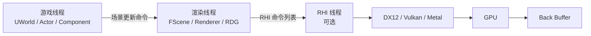
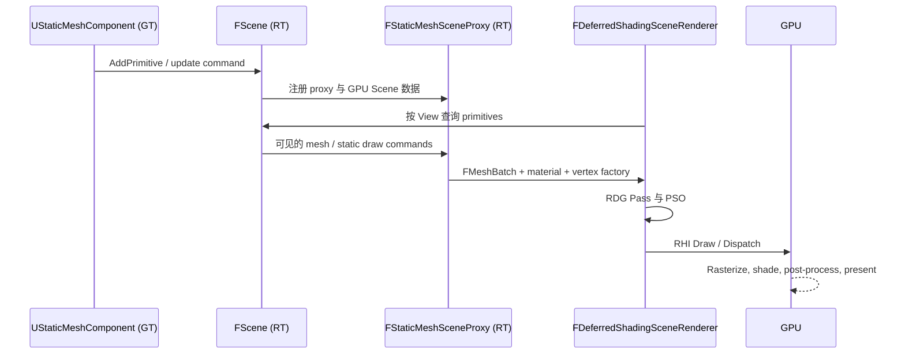
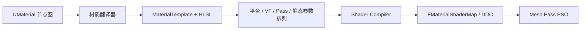

# 虚幻引擎渲染系统概览

本文以 UE5 的 `Engine/Source/Runtime` 源码为主线，解释一个带 `UMeshComponent`
（实践中通常为 `UStaticMeshComponent`、`USkinnedMeshComponent` 或其子类）的 Actor 如何变成屏幕
像素。UE 的渲染不是单一函数调用，而是游戏线程准备场景、渲染线程构建工作、RHI 提交 GPU 命令的流水线。

## 0. 全局分层与线程模型



* **Engine 模块**：拥有 `UWorld`、`UPrimitiveComponent`、资源 UObject；它描述“什么在场景中”。
* **Renderer 模块**：拥有 `FScene` 的渲染侧实现、`FSceneRenderer` / `FDeferredShadingSceneRenderer`、可见性、阴影、光照及后处理；它决定“如何画这一帧”。
* **RenderCore**：提供跨渲染器的着色器、渲染资源、渲染命令和 Render Dependency Graph（RDG）。
* **RHI**：将引擎的纹理、缓冲、管线和命令抽象成平台无关接口，再由 D3D12RHI、VulkanRHI、MetalRHI 等后端映射至图形 API。

游戏线程绝不能直接读写渲染线程持有的 `FPrimitiveSceneProxy`。两侧通过 `ENQUEUE_RENDER_COMMAND` 和帧同步传递数据；
因而一个组件的变换、材质或可见性发生变化后，通常是向渲染线程排入更新命令，而非立即发出 Draw Call。

## 1. 一个 Mesh Actor 如何被渲染

### 1.1 从 UObject 到 `FScene`

以下以一个已经加载到 `UWorld` 的 `AActor` 及其 `UStaticMeshComponent` 为例。骨骼网格的骨骼更新和蒙皮缓冲不同，
但其场景注册和代理机制一致。

1. Actor 的组件完成注册：`UActorComponent::RegisterComponentWithWorld`，随后原语组件建立渲染状态。
2. `UPrimitiveComponent::CreateRenderState_Concurrent` 在组件应被渲染、World 有效且 `World->Scene` 存在时，调用
	`FSceneInterface::AddPrimitive`。组件同时保留游戏线程的 UObject 数据。
3. `UPrimitiveComponent::CreateSceneProxy` 是关键虚函数。`UStaticMeshComponent` 创建
	`FStaticMeshSceneProxy`；`USkinnedMeshComponent` 创建对应的骨骼网格代理。代理将渲染所需的稳定快照带到渲染线程：
	Local-to-World 矩阵、边界、材质相关性、静态网格 LOD/section、顶点工厂、阴影和可见性标志等。
4. `FScene` 在渲染线程中把代理登记为 `FPrimitiveSceneInfo` / `FPrimitiveSceneInfoCompact`，分配 primitive ID，写入
	GPU Scene 的 instance/primitive 数据，并更新八叉树等空间结构。注册后的 Actor 不会每帧重新构建代理。
5. 变换、材质、Custom Primitive Data 等变更分别调用 `MarkRenderTransformDirty`、`MarkRenderStateDirty`、
	`MarkRenderDynamicDataDirty` 或 `FSceneInterface` 的对应更新函数。只有影响代理结构的变更才需要重建渲染状态。

可追踪入口包括 `Engine/Private/Components/PrimitiveComponent.cpp`、`Engine/Public/PrimitiveSceneProxy.h` 以及
`Renderer/Private/Scene.cpp`。`UPrimitiveComponent` 是场景原语边界；`UMeshComponent` 主要补充材质槽，具体几何由其派生类提供。

### 1.2 从 ViewFamily 到可见网格

每帧，Viewport 或 Scene Capture 创建 `FSceneViewFamily` 和一个或多个 `FSceneView`。Renderer 模块根据它们创建
`FSceneRenderer`，在默认桌面路径上通常是 `FDeferredShadingSceneRenderer`。在 `Render()` 中，大致执行：

1. 更新视图矩阵、Uniform Buffer、视锥和每视图状态；建立 GPU Scene、虚拟纹理反馈等全局数据。
2. **可见性判定**：根据视锥、距离、Show Flag、隐藏集合、预计算可见性、遮挡结果及 LOD，筛掉不可见 primitive。
	UE5 可使用 GPU instance culling；传统路径会建立每视图 `FPrimitiveViewRelevance` 和静态绘制命令可见位。
3. **收集网格批次**：动态原语由代理的 `GetDynamicMeshElements` 产生 `FMeshBatch`；静态原语在注册时建立
	`FStaticMeshBatch` 和 `FMeshDrawCommand`，本帧只筛选、排序和提交。一个 section、一个材质、一个 LOD 或一个 Pass
	都可能形成不同的 mesh draw command。
4. **选择着色器和管线状态**：`FVertexFactory` 描述顶点流，`FMaterialRenderProxy` 提供解析后的材质，
	Mesh Pass Processor 为 Depth、Base Pass、Shadow 等 Pass 选择对应的 shader permutation，组合
	PSO（顶点/像素或计算着色器、光栅化、深度模板、混合状态）。
5. **执行绘制或计算**：Renderer 把这些命令作为 RDG Pass 写入图；RDG 最终执行时调用 RHI，后端向 GPU 提交 draw、
	dispatch、barrier 和 present。GPU 写入场景颜色，后处理将结果写到 Back Buffer，显示器最终扫描该图像。



### 1.3 为什么 Actor 本身不“被绘制”

`AActor` 是游戏对象容器，Camera、Light、Mesh、Particle 等能力来自组件。只有提供 `FPrimitiveSceneProxy` 的
`UPrimitiveComponent` 进入主几何渲染路径；光源组件和天空组件则以各自的 scene info 参与光照或环境 Pass。一个 Actor 可有
多个原语组件，也可完全没有任何可绘制原语。

## 2. RHI：跨 API 的最薄执行层

### 2.1 职责与对象

RHI（Rendering Hardware Interface）把 D3D12、Vulkan、Metal 等 API 的共性抽象为 C++ 接口和资源类型。常见对象包括：

| RHI 概念 | 用途 |
| --- | --- |
| `FRHITexture`、`FRHIBuffer` | GPU 纹理和缓冲；可创建 SRV、UAV、RTV、DSV 等视图。 |
| `FRHIVertexShader`、`FRHIPixelShader`、`FRHIComputeShader` | 已创建的 GPU shader 对象。 |
| `FGraphicsPipelineStateInitializer` / PSO | 图形管线的 shader 与固定功能状态组合。 |
| `FRHICommandList` | 记录资源创建、状态转换、绘制、Dispatch、Copy、Present 等命令。 |
| `FDynamicRHI` | 当前平台 RHI 后端的动态入口。 |

`RHI/Public/RHICommandList.h` 定义命令列表，`DynamicRHI.h` 定义后端入口；具体后端模块将这些操作翻译为原生 API。
RHI 不决定场景可见性、材质模型或渲染顺序，它负责正确、高效地表达 Renderer 已经决定的 GPU 工作。

### 2.2 RHI 线程与资源状态

Renderer 可在渲染线程录制命令，RHI 再在独立 RHI 线程或任务系统中执行，以减少游戏线程、渲染线程与驱动提交间的等待。
现代 API 要求明确的资源访问状态；例如纹理从 Render Target 写入切换到 Shader Resource 读取。RHI 的 `ERHIAccess` 与 barrier
接口承载这些转换。手工管理虽可行，但容易遗漏依赖，这正是 RDG 存在的主要原因。

## 3. RDG：声明资源依赖，而非手写同步

RDG（Render Dependency Graph）位于 Renderer/RenderCore 与 RHI 之间。它不是另一种图形 API，而是本帧 GPU 工作的
声明式调度器。`FRDGBuilder` 的头部注释明确了核心约束：通过 Pass 参数结构体中的 RDG 参数声明资源读写，然后在 `Execute()`
阶段编译、裁剪并执行图。

典型写法为：

```cpp
FRDGTextureRef SceneColor = GraphBuilder.CreateTexture(Desc, TEXT("SceneColor"));
FMyPassParameters* Parameters = GraphBuilder.AllocParameters<FMyPassParameters>();
Parameters->Output = GraphBuilder.CreateUAV(SceneColor);
GraphBuilder.AddPass(RDG_EVENT_NAME("MyPass"), Parameters, ERDGPassFlags::Compute,
	 [Parameters](FRHICommandList& RHICmdList) { /* Dispatch */ });
GraphBuilder.Execute();
```

其中 `CreateTexture` / `CreateBuffer` 创建帧内逻辑资源，`RegisterExternalTexture` 把历史纹理或 Back Buffer 接入图，
`AddPass` 声明执行函数和访问方式。RDG 可据此完成：

* 依赖排序，保证生产者先于消费者；
* 自动插入 RHI transition / UAV barrier；
* 裁剪不影响外部输出的无用 Pass；
* 缩短资源生命周期并让临时纹理/缓冲发生 alias，降低峰值显存；
* 在条件满足时编排并行或异步计算队列；
* 提供 RDG event、资源名称与 RenderDoc / Insights 可读的调试信息。

RDG 资源只保证在图执行期间有效；要跨帧保存结果，必须提取为外部池化资源或下帧重新注册。Pass 参数必须如实声明所有读写资源，
否则 RDG 无法建立正确依赖，表现通常是数据竞争、错误 barrier 或偶发图像问题。

## 4. Material 与 Shader

### 4.1 材质资产到着色器排列

Material Editor 的节点图对应 `UMaterial`；`UMaterialInstance` 通过静态开关、纹理和标量/向量参数复用父材质；
`UMaterialInstanceDynamic`（MID）允许在运行时改参数。`UMaterialInterface` 是渲染侧统一访问入口，
`FMaterialRenderProxy` 负责在渲染线程解析实例参数和回退材质。

编译时，材质图会被翻译为 HLSL 片段并与引擎的 `.usf` / `.ush` 模板组合。Shader Compiler 对每种目标平台、Feature Level、
材质域、着色模型、顶点工厂和静态参数产生 **permutation**；结果汇入 `FMaterialShaderMap`，并通过 DDC 缓存。Cook 会预编译
目标平台需要的排列，运行时尽量只从缓存加载，而不在玩家机器上即时编译。



### 4.2 运行时绑定

当某个 mesh section 被提交给一个 Pass 时，顶点工厂提供位置、法线、UV、颜色、骨骼权重或实例数据的读取方式；材质提供
`FMaterialShader` 的具体变体和参数。UE 的 Shader Parameter 结构把 Uniform Buffer、SRV、UAV、Sampler 显式绑定到 shader。
材质的 `Blend Mode` 和 `Shading Model` 不只是视觉选项：它们影响是否写深度、进入 GBuffer 还是透明 Pass、需要哪些 shader
排列以及可用的光照路径。

默认不透明表面常使用 PBR 金属度-粗糙度模型，Base Pass 输出 Base Color、Normal、Roughness、Metallic、Specular、
Shading Model 等 GBuffer 数据；随后延迟光照读取这些数据。透明材质通常不能按同样方式完整写 GBuffer，因此在不透明光照之后以
独立 Pass 处理，并受排序与屏幕空间效果限制。

常见源码锚点：`Engine/Private/Materials`（UObject 与编译请求）、`RenderCore` / `ShaderCore`（shader map 和编译基础设施）、
`Renderer/Private/MeshPassProcessor.cpp`（把 mesh、材质和 Pass 组合为绘制命令）。

## 5. Renderer 模块与典型一帧

`Renderer` 模块是默认实时渲染器。`Renderer/Private/DeferredShadingRenderer.cpp` 是延迟路径的顶层循环，
`FDeferredShadingSceneRenderer::Render` 依据平台能力、View、Show Flag、材质、CVar 和场景内容，构建实际 RDG 图。
所以没有对所有项目恒定不变的 Pass 列表；下面是启用典型 UE5 特性时的一种逻辑顺序。

| 阶段 | 代表工作 | 主要输出 |
| --- | --- | --- |
| 帧与视图准备 | View Uniform、GPU Scene、实例/距离裁剪、虚拟纹理反馈 | 每视图与每 primitive 数据 |
| 深度与遮挡 | Depth Prepass、HZB、Occlusion Query / GPU culling | Scene Depth、可见性 |
| 阴影 | Shadow Depth、Virtual Shadow Map 页分配与渲染，或传统 CSM/atlas | Shadow map / VSM page table |
| 几何与 GBuffer | Base Pass，Nanite visibility/raster，速度向量 | GBuffer、Depth、Velocity |
| 环境与间接光 | Sky / Atmosphere、Lumen Screen Probe Gather、反射、AO | 间接漫反射、间接高光、环境光 |
| 直接光照 | Deferred Lighting、光体积、SSS / hair / water 等专用合成 | HDR Scene Color |
| 前向与透明 | Translucency、粒子、体积雾、云、单层水、UI 前的合成 | 更新后的 Scene Color |
| 后处理与展示 | TAA/TSR、Bloom、景深、运动模糊、色调映射、曝光、Upscale | Back Buffer 并 Present |

移动端、Forward Shading、Path Tracing、Scene Capture、编辑器可视化和禁用特性的项目会选择不同子图。Forward 路径会将更多
光照放入几何 Pass；Path Tracer 则是独立的离线路径，不能用上表替代。

### 5.1 Nanite：虚拟化微多边形几何

Nanite 将静态网格离线转换为层级化的 cluster / cluster group 数据。运行时不以传统“选择一个完整 LOD 网格，再逐 section
提交”的方式处理，而是利用 GPU 对层级 cluster 进行视锥、背面、屏幕误差和遮挡裁剪，只栅格化当前像素实际需要的三角形。

核心收益是高几何细节、自动连续 LOD 和减少 CPU Draw Call 压力。典型工作链为：

1. CPU 只提交 Nanite instance 与资源引用；
2. GPU culling 按层级遍历 cluster，生成可见工作队列；
3. Nanite rasterization 生成可见性/深度等中间结果；
4. Nanite shading 根据材质对可见像素着色，并与常规几何、阴影及 Scene Texture 合成。

Nanite 不是“所有几何的自动加速开关”。资产/材质特性、平台能力、WPO、透明、特定渲染路径和调试 Show Flag 都可能使几何走传统
Raster 或需要额外处理。其 Runtime 代码主要在 `Renderer/Private/Nanite` 与 `Renderer/Private/Rendering/Nanite*`。

### 5.2 Lumen：动态全局光照和反射

Lumen 目标是在动态场景中提供多次反弹的间接漫反射与反射。它并非单一算法，而是混合系统：屏幕空间信息覆盖当前可见细节，
Lumen Scene（由 mesh distance field、card/surface cache 等表示）覆盖离屏区域，软件 ray tracing 或硬件 DXR/Vulkan ray tracing
完成射线查询；Screen Probe Gather 聚集并过滤间接光。反射路径会结合屏幕追踪、Lumen 场景追踪和命中着色。

Lumen 的关键权衡是使用近似表示、时间累积、空间过滤和有限 ray budget 换取实时性能。因此它可能在快速运动、极小高频几何、
镜面多次反射或缓存更新区域呈现噪声、拖影或细节差异。质量和预算通过 Project Settings 与 `r.Lumen.*` CVar 调整。

## 6. UE5 常用渲染技术与算法清单

| 类别 | 代表技术 | 目的 |
| --- | --- | --- |
| 几何组织 | Static Mesh LOD、HLOD、Instancing、GPU Scene、Nanite | 降低几何提交与像素不可见工作。 |
| 可见性 | Frustum culling、距离裁剪、HZB、硬件遮挡查询、GPU instance / cluster culling | 不处理摄像机看不到的对象。 |
| 光照 | 延迟着色、Forward Shading、Clustered/Local light culling、IBL、Lightmass（烘焙）、Lumen | 计算直接光、间接光和反射。 |
| 阴影 | CSM、Shadow Map atlas、Virtual Shadow Maps、距离场阴影、硬件光追阴影 | 为不同尺度和平台生成阴影。 |
| 环境效果 | Sky Atmosphere、Volumetric Fog、Volumetric Cloud、Exponential Height Fog | 模拟大气和参与介质。 |
| 屏幕空间 | SSAO/GTAO、SSR、SSGI（取决于配置）、屏幕空间去噪 | 低成本补充可见区域的局部效果。 |
| 抗锯齿与重建 | TAA、TSR、DLSS/FSR/XeSS 等插件路径、动态分辨率 | 用历史或 AI/重建技术提升有效分辨率。 |
| 材质与纹理 | PBR、Substrate、Virtual Texture、Runtime Virtual Texture、Virtual Shadow Map | 控制表面模型和大规模纹理/阴影内存。 |
| 光线追踪 | 硬件 Ray Tracing、软件距离场追踪、Path Tracer | 精确可见性、反射、阴影及高质量离线结果。 |
| 后处理 | Bloom、DOF、Motion Blur、色调映射、曝光、LUT、Sharpen | 将 HDR 场景颜色变为最终显示图像。 |

## 7. 调试与源码阅读路线

建议以一个简单静态网格场景为起点，依次断点或搜索：

1. `UPrimitiveComponent::CreateRenderState_Concurrent` 与 `CreateSceneProxy`：确认组件如何进入 `FScene`。
2. `FPrimitiveSceneProxy::GetDynamicMeshElements`、`FMeshBatch`、`FMeshDrawCommand`：确认几何如何变成 Pass 可提交数据。
3. `FSceneRenderer::Render` 和 `FDeferredShadingSceneRenderer::Render`：查看该 View 实际启用了哪些 Renderer 阶段。
4. `FRDGBuilder::AddPass`、`Execute`：查看资源依赖如何落实为 RHI 命令。
5. `RHICommandList.h` 及目标平台 RHI：从引擎命令追到 D3D12、Vulkan 或 Metal。

运行时可配合 `stat gpu`、`ProfileGPU`、Unreal Insights、RenderDoc 和 `r.RDG.*` 调试选项观察真实 Pass 图与耗时。阅读时应始终把
“逻辑 Pass”与“最终 GPU Pass”区分开：一个逻辑阶段可能因并行、材质排列、分辨率、异步计算或硬件能力拆成多个 GPU 事件。