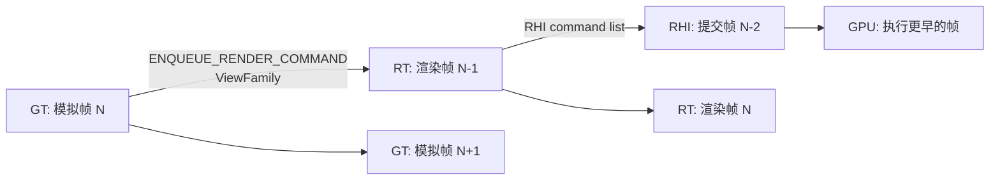
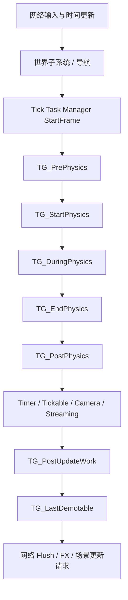
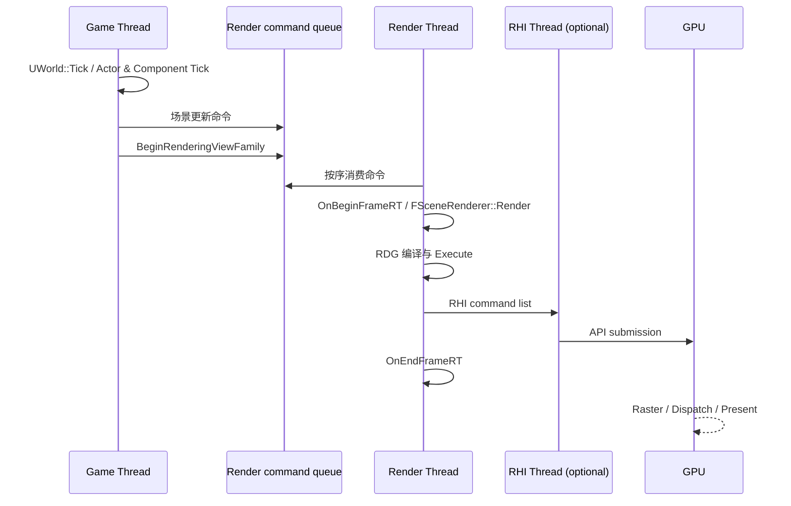

# 虚幻引擎主线程 Tick 与渲染线程 Tick

本文讨论 UE5 中一帧如何在**游戏线程（Game Thread，通常也称主线程）**、**渲染线程（Render Thread）**及可选的
**RHI 线程**之间流动。这里的 “Tick” 有两种含义，必须先区分：

1. `UWorld::Tick` / `FTickFunction` 是游戏逻辑的 Tick 系统，驱动 Actor、组件、物理和网络更新。
2. 渲染线程没有一个与 `UWorld::Tick` 对称的 “RenderWorldTick”。它消费游戏线程排入的渲染命令，执行每个
   `FSceneViewFamily` 的渲染工作，并在渲染帧边界运行渲染侧 tickable/delegate。

## 1. 线程职责

| 执行域 | 持有的主要数据 | 每帧主要职责 |
| --- | --- | --- |
| 游戏线程（GT） | `UWorld`、Actor、Component、UObject、输入和游戏状态 | 更新模拟；改变组件状态；建立 ViewFamily；排入场景更新和渲染请求。 |
| 任务线程 | Tick Task、动画、物理、资源加载等可并行工作 | 依赖满足时执行任务；GT 在需要结果的 Tick Group 等待。 |
| 渲染线程（RT） | `FScene` 渲染侧数据、`FPrimitiveSceneProxy`、Renderer、RDG | 消费场景更新；可见性和 Mesh Pass；构建并执行 RDG；录制 RHI 命令。 |
| RHI 线程（可选） | RHI 命令流 | 将 RT 已录制的命令提交给图形 API / 驱动。 |
| GPU | 纹理、缓冲、PSO 和 shader 的实际执行状态 | 执行 RT/RHI 已提交的 draw、dispatch、copy、present。 |

`UObject` 及大多数游戏状态只能由游戏线程直接访问；`FPrimitiveSceneProxy`、`FScene` 的渲染内部状态只能在渲染线程访问。
二者之间不共享可随意修改的对象，而是用渲染命令、复制后的数据及受控的帧同步交接。



上图展示理想的流水并行，而不是严格固定的帧号承诺。实际延迟取决于 `r.OneFrameThreadLag`、VSync、GPU 排队深度、平台与是否发生
flush。核心事实是：GT 可以模拟后续帧，而 RT/GPU 正在处理更早提交的状态。

## 2. 游戏线程：`FEngineLoop::Tick` 到 `UWorld::Tick`

引擎每帧的顶层入口是 `FEngineLoop::Tick`，实现在 `Launch/Private/LaunchEngineLoop.cpp`。它负责帧范围的管理，例如：

* 处理退出、心跳、热修复、CVar sink、统计和 Trace 帧标记；
* 锁定本帧渲染线程配置（`LatchRenderThreadConfiguration`）；
* 广播 `FCoreDelegates::OnBeginFrame`；
* 驱动 Engine、World、Slate、异步加载、音频及帧末同步；
* 在未启用多线程渲染的 `-onethread` 模式下，直接调用 `TickRenderingTickables`，避免渲染侧对象没有机会更新。

`UEngine::Tick` 会继续驱动各 World。核心世界模拟入口为 `UWorld::Tick(ELevelTick, float)`，位于
`Engine/Private/LevelTick.cpp`。简化后的世界 Tick 顺序如下：



### 2.1 Tick Function 与 Tick Group

Actor 和组件通常通过 `PrimaryActorTick`、`PrimaryComponentTick` 注册 `FTickFunction`。`FTickTaskManagerInterface` 依赖 Tick
Group、`AddPrerequisite` 关系及任务图调度这些函数；它们不必全部串行运行。常见组为：

| Tick Group | 用途 |
| --- | --- |
| `TG_PrePhysics` | 物理前更新，例如输入驱动的移动准备。 |
| `TG_StartPhysics` / `TG_DuringPhysics` / `TG_EndPhysics` | 启动物理、可并行的物理期间工作、处理物理完成相关工作。 |
| `TG_PostPhysics` | 依赖本帧物理结果的游戏逻辑。 |
| `TG_PostUpdateWork` | 相机、特效或其他最后更新工作之后的任务。 |
| `TG_LastDemotable` | 可延后的低优先级工作。 |

`RunTickGroup` 在组边界按需要等待依赖完成。特别是 `TG_DuringPhysics` 可以先运行至空闲而不等待全部异步 Tick 完成，随后在需要一致
结果的边界再同步。因此 “Actor Tick 在主线程” 是常见但不完整的说法：Tick 的发起和世界一致性由 GT 控制，允许并发的 Tick 工作可在
任务线程执行。

### 2.2 游戏状态如何传给渲染线程

当 `UPrimitiveComponent` 的状态改变时，GT 不直接改 `FScene`。它根据变化类型调用：

* `MarkRenderTransformDirty`：仅同步 Local-to-World、Bounds 等变换相关数据；
* `MarkRenderDynamicDataDirty`：同步骨骼姿态、粒子实例等动态数据；
* `MarkRenderStateDirty`：材质、网格、可见性等影响代理结构的变化，可能重建 `FPrimitiveSceneProxy`；
* 组件注册/注销：通过 `FSceneInterface::AddPrimitive` / `RemovePrimitive` 增删渲染原语。

这些操作以渲染命令排入 RT 队列。命令执行前，RT 仍只会看到旧版本代理；命令执行后，GT 不能再假设自己可访问该代理。这种“数据所有权
切换”比互斥锁更适合高频帧流水线。

## 3. 从游戏 Tick 到渲染请求

游戏世界的 Actor Tick 结束后，Viewport 绘制阶段构建渲染所需的视图。`UGameViewportClient::Draw` 会创建
`FSceneViewFamily`、为 Local Player 计算 `FSceneView`，然后调用：

```cpp
GetRendererModule().BeginRenderingViewFamily(SceneCanvas, &ViewFamily);
```

这是 GT 向 Renderer 发起“渲染这个 ViewFamily”的关键交接点。它会把对 `FScene` 的渲染请求排入 RT；调用返回不代表像素已经完成。
GT 随后可以继续 HUD、Slate、下一帧模拟或在帧末等待。Scene Capture、反射捕获、编辑器视口等也会建立自己的 ViewFamily，因此一帧中
可能有多个渲染请求。

ViewFamily 中包括视图矩阵、Show Flag、分辨率、后处理设置、动态分辨率信息和 `FSceneInterface`。在提交后，这些跨线程使用的数据
必须在 RT 消费前保持有效或按接口要求复制；不要在排入渲染命令后捕获、修改裸 UObject 指针。

## 4. 渲染线程：一帧“Tick”实际做什么

RT 的工作单位不是世界 Tick Group，而是队列中的渲染命令和 ViewFamily 请求。每个请求到达后，Renderer 大致执行：

1. 执行先前由 GT 排入的 primitive、light、resource 等场景更新命令，使 `FScene` 追上可用的游戏状态。
2. 为 ViewFamily 创建 `FSceneRenderer`；默认桌面延迟渲染通常使用 `FDeferredShadingSceneRenderer`。
3. 更新 View Uniform、GPU Scene、instance 数据和渲染侧资源。
4. 对每个 View 进行视锥、距离、遮挡和实例可见性判定；收集静态/动态 Mesh Draw Command。
5. 用 `FRDGBuilder` 声明深度、GBuffer、阴影、Nanite、Lumen、光照、透明和后处理等 Pass，并执行 RDG。
6. RDG 向 `FRHICommandList` 录制 barrier、draw、dispatch、copy 与 present；RHI 后端再提交给 GPU。

在渲染帧边界，RenderCore 广播 `FCoreDelegates::OnBeginFrameRT` 和 `OnEndFrameRT`。渲染侧统计、资源维护以及
`FTickableObjectRenderThread` 一类对象可在此更新；这就是常被口语化为“渲染线程 Tick”的部分。它服务于渲染基础设施，并不等同于
逐个调用 Actor/Component 的 `Tick()`。



## 5. 同步、帧滞后与 Flush

### 5.1 正常帧同步

多线程渲染的目的不是让 GT 每帧等待 RT，而是让二者重叠。UE 会在帧边界用 `FFrameEndSync` 等机制限制 GT 领先 RT 的程度；
`r.OneFrameThreadLag` 控制是否允许 GT 相对 RT 保持约一帧领先。平台、VSync、帧率限制和 GPU 压力仍可能让 GT、RT 或 RHI 线程
在不同点阻塞。

若性能瓶颈在 GT，RT/GPU 会空等新帧；若瓶颈在 RT，GT 会因帧滞后上限而等待；若瓶颈在 GPU，RHI 的提交或交换链 present 会反压到
RT，最终也会阻塞 GT。帧时间近似由最长关键路径决定，而不是各线程耗时的简单相加：

$$T_{frame} \approx \max(T_{GT}, T_{RT}, T_{RHI/GPU}) + T_{sync}$$

### 5.2 `FlushRenderingCommands` 的语义

`FlushRenderingCommands()` 是强同步：GT 等待所有已排入的渲染命令完成，并确保 RT 追上 GT。它用于释放 RT 仍可能引用的资源、
关停 XR / 渲染对象或少数必须立即得到结果的路径。它会破坏流水并行，频繁调用会造成明显卡顿，因此不应用作普通组件更新后的“刷新”。

还要区分三个完成层次：

| 等待对象 | 表示什么 | 不表示什么 |
| --- | --- | --- |
| Render command fence | RT 已执行队列中此前命令 | GPU 一定已完成所有像素执行。 |
| `FlushRenderingCommands` | RT 命令队列已清空到该同步点 | 显示器已经显示最终画面。 |
| GPU fence / RHI GPU 同步 | GPU 已完成此前命令 | GT 的游戏逻辑已完成下一帧。 |

资源销毁应采用引擎的渲染资源生命周期、fence 或延迟释放机制，而不是仅凭“本帧看起来已经不需要”来释放。

## 6. 单线程模式与不应依赖的假设

在 `-onethread` 或不支持线程化渲染的环境，GT 会承担 RT 工作，`GUseThreadedRendering` 为 false，`FEngineLoop::Tick` 会主动
tick rendering tickables。此模式适合调试和某些平台，但不能作为多线程时序的依据。

编写渲染代码时应遵守：

* 使用 `IsInGameThread()`、`IsInRenderingThread()`、`IsInRHIThread()` 断言正确执行域；
* 从 GT 向 RT 传递值、线程安全引用或按引擎约定生命周期管理的数据，不捕获将被销毁的 UObject；
* RT 读取 CVar 时使用 `GetValueOnRenderThread()`，GT 则使用 `GetValueOnGameThread()`；
* 需要读回 GPU 结果时使用异步 readback / fence，避免每帧同步等待；
* 不将 GT 的帧号、RT 的帧号、GPU 已完成帧号混为同一个“当前帧”。

## 7. 性能诊断路线

1. 使用 Unreal Insights 的 CPU timeline 检查 GT、RT、RHI Thread 的空闲区与依赖等待。
2. 使用 `stat unit` 判断主要受 `Game`、`Draw`（RT）还是 `GPU` 限制；使用 `stat unitgraph` 观察抖动。
3. 使用 `ProfileGPU` / `stat gpu` 拆分 GPU Pass，而非把所有 `Draw` 时间误认为 GPU 时间。
4. 搜索 `WaitForTasks`、`FFrameEndSync`、`FlushRenderingCommands` 和 Trace 中的 wait event，定位不必要的跨线程同步。
5. 对组件频繁变化问题，检查是否误用 `MarkRenderStateDirty`；若只更新变换或动态参数，应使用范围更小的更新路径。

相关源码入口：`Launch/Private/LaunchEngineLoop.cpp`（顶层帧循环）、`Engine/Private/LevelTick.cpp`（世界 Tick）、
`Engine/Private/TickTaskManager.cpp`（Tick 任务调度）、`Engine/Private/GameViewportClient.cpp`（ViewFamily 提交）、
`RenderCore/Private/RenderingThread.cpp`（RT/RHI 线程与渲染 tickable）以及 `Renderer/Private/DeferredShadingRenderer.cpp`（默认渲染器）。
