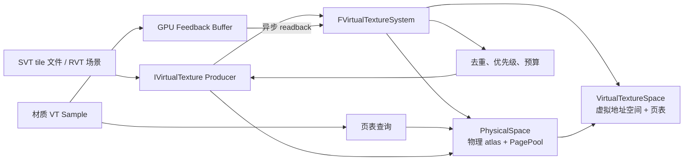
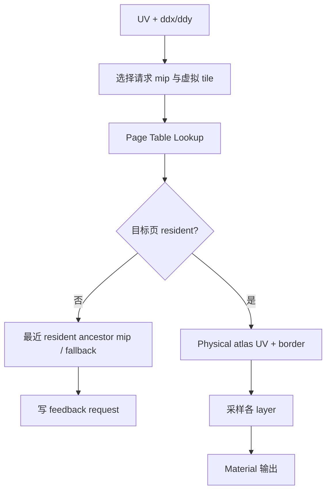
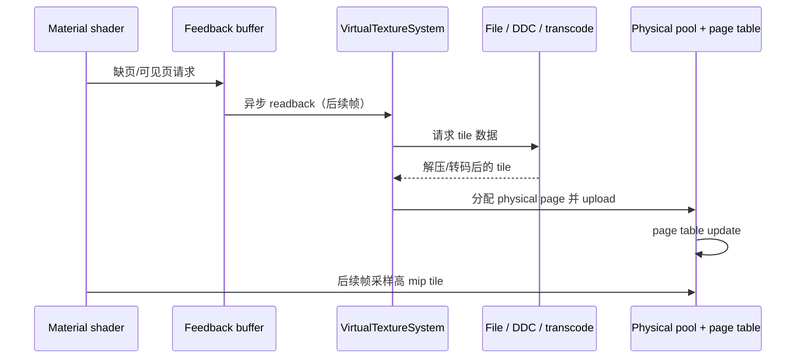
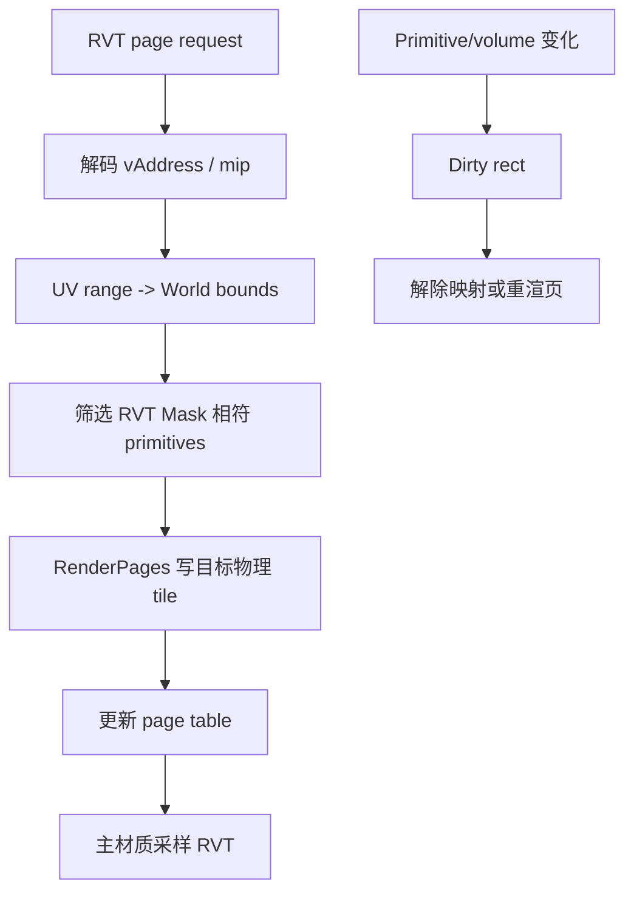

# UE5 虚拟贴图技术解析

UE5 的虚拟贴图（Virtual Texturing，VT）将逻辑上巨大的纹理切成固定大小的 **tile/page**，只让当前屏幕需要的页驻留在有限的
GPU physical cache 中。材质采样时先查询页表，把虚拟 UV 映射到物理 atlas 的坐标，再读取真实 texel。

UE 的 VT 系统不仅服务磁盘流送贴图，也服务运行时把场景渲染到贴图的 Runtime Virtual Texture（RVT）。二者共享地址空间、页表、
物理池、feedback 和 producer 框架，区别在于页内容来源：

* **Streaming Virtual Texture（SVT）**：页来自 cook 后的纹理 tile 数据，经 I/O、解压/转码和上传进入物理页池。
* **Runtime Virtual Texture（RVT）**：页由场景 primitive 使用 RVT 材质域实时渲染生成，按请求写入物理页池。

本文主要依据 `Renderer/Private/VT` 和 `Engine/Private/VT` 实现。它讨论的是 UE 的虚拟纹理系统，而非 Nanite 的 cluster page streaming；
两者都使用“虚拟地址 + 有限物理页 + feedback”的思想，但资源、生产者和采样路径不同。

## 1. 为什么需要虚拟贴图

一张大纹理的传统 mip streaming 以“整张纹理的 mip”为单位加载。它有两个极端：要么加载较大 mip 导致绝大部分 texel 不可见，
要么只保留低 mip 导致局部近景模糊。开放世界地表、扫描资产、地形遮罩和大量 decal 特别容易触发这个矛盾。

虚拟贴图将每个 mip 分成 tile。只要被采样的 tile 集合远小于完整纹理，物理显存需求可近似为：

$$M_{physical} \approx N_{resident\ tiles}\times(T+2B)^2\times\sum_l b_l$$

其中 $T$ 为 tile 内部边长，$B$ 为 border，$b_l$ 为第 $l$ 个 texture layer 的每 texel 字节数。逻辑纹理大小不再直接决定
当前显存占用；真正决定的是同时可见/锁定的页、物理池大小和格式层数。

tile border 复制邻页边缘 texel，使硬件双线性/各向异性过滤在页边界不会采到无效数据。border 占用额外显存，因此 tile 过小会增加
页表、border 和请求开销，tile 过大又会降低按需加载的粒度。

## 2. 统一架构

核心类及职责如下。

| 类型 | 职责 |
| --- | --- |
| `FVirtualTextureSystem` | 全局调度器；管理 Space、PhysicalSpace、producer、反馈读取、页请求、生产、映射和 RDG 更新。 |
| `FVirtualTextureProducer` | 将一个 `IVirtualTexture` 与其格式、tile 尺寸、层数、最大 mip 等描述注册到系统。 |
| `IVirtualTexture` | 页内容来源接口；SVT 读取/准备 tile，RVT 渲染 tile。 |
| `FAllocatedVirtualTexture` | 某个可被材质采样的已分配 VT；持有虚拟地址范围与页表绑定信息。 |
| `FVirtualTextureSpace` | 虚拟地址空间；拥有 page table texture、allocator 与每 layer 的 `FTexturePageMap`。 |
| `FVirtualTexturePhysicalSpace` | 物理 tile atlas；按 tile size、维度、format/layer 组合复用。 |
| `FTexturePagePool` | physical tile 的分配、锁定、LRU 使用记录、驱逐及页表映射链。 |
| `FVirtualTextureFeedback` | 异步将 GPU feedback buffer 回读到 CPU，避免每帧等待 GPU。 |

`FVirtualTextureSystem::Update` 是每帧 VT 更新总入口。它通过 `BeginUpdate`、异步 request/feedback task、`EndUpdate` 将 CPU 侧请求分析
与 RDG/RHI 侧页生成、upload、page table 更新衔接起来。

## 3. 虚拟地址、页表与物理空间

### 3.1 Virtual Space

`FVirtualTextureSpace` 表示可被多个 VT 分配/共享的虚拟地址空间。其描述 `FVTSpaceDescription` 包含：

* `TileSize` 与 `TileBorderSize`；
* 二维/三维 `Dimensions`；
* 页表格式（`UInt16` 或 `UInt32`）；
* 页表 layer 数及是否 private space；
* 最大虚拟空间尺寸与可选页表 indirection texture。

一个 VT 分配后得到 `vAddress`。shader 从 VT uniform 参数取得 space ID、虚拟地址偏移、页表纹理与物理层信息，再根据输入 UV 和 mip
计算虚拟 tile 坐标。页表项编码该虚拟 tile 当前映射的 physical address、mip/祖先映射和必要标志。

多 layer VT 可把页表通道打包。`FVirtualTextureSpace::GetNumPageTableTextures()` 会按
`IAllocatedVirtualTexture::LayersPerPageTableTexture` 将层拆到一个或多个 page table texture；因此一次 lookup 可得到多个相关层的
物理地址/UV。

### 3.2 Physical Space 与层组

`FVirtualTexturePhysicalSpace` 是真实 GPU atlas 与 `FTexturePagePool` 的组合。它由 tile size（包含 border）、维度、format、
layer 数、sRGB view 和 continuous update 属性决定；格式/布局兼容的 producer 可共享同一个 Physical Space。

一个 producer 的 texture layer 还能映射为 **physical group**。同组 layer 始终通过同一页表 channel 查询，拥有相同 physical UV，
例如 Base Color、Normal、Roughness 等关联层可以同步驻留，避免“颜色页存在但法线页不存在”的采样不一致。

Physical Space 的 $N\times N$ tile atlas 中，physical address 可概念化为：

$$p = x + N\cdot y$$

`GetPhysicalLocation` 用该地址返回 atlas tile 坐标。若 physical pool 每方向不超过 64 个 tile，可使用 16-bit page table；较大池
需要更宽的地址表示，页表显存也相应增加。

### 3.3 页表更新

当一个 virtual page 获得 physical tile，`FTexturePagePool::MapPage` 请求 Space 的 `QueueUpdate`；后者记录
`FPageTableUpdate`（virtual address、mip level、physical location 等）。`FVirtualTextureSpace::ApplyUpdates` 在 RDG 中批量将更新
写入 page table texture，而不是为每一页单独提交 API 调用。

`VirtualTextureSpace.cpp` 中 page table update shader 可使用掩码 quad 更新，`r.VT.MaskedPageTableUpdates` 用于降低大量稀疏更新时的
像素填充成本。资源最终通过 texture reference 对材质 shader 可见，从而让下一个可执行采样看到新映射。

## 4. 材质采样算法

材质中的 Virtual Texture Sample 节点会编译为虚拟纹理 shader 采样逻辑。它的概念流程如下：

1. 根据 UV 导数估算所需 mip $m$，并求虚拟 tile 坐标 $(t_x,t_y)$ 与 tile 内坐标 $(u_t,v_t)$；
2. 查询该 VT 的页表，获取最近已映射的 tile 的 physical address 和实际可用 mip；
3. 用 physical address 转为 atlas tile 原点，再将 tile 内坐标加上 border，得到 physical UV；
4. 对每个 physical group/layer 从对应 atlas 采样；
5. 若所需页未驻留，使用可用祖先 mip 或 fallback，并向 feedback UAV 写请求编码；
6. 对相邻 mip/页做必要的过滤，处理 border、mip bias 和硬件能力差异。

重要的是：采样缺页通常不会停住 GPU 等待磁盘。它采用较粗祖先页或 fallback，随后由反馈补页。这正是 VT 的性能基础，也解释了相机快速
移动时可能出现的暂时模糊/低 mip（mip pop-in）。

VT 的过滤比普通 `Texture2DSample` 更复杂：物理页并不在虚拟 UV 的连续纹理内，mip/邻页切换、border 尺寸、anisotropy 和
tile residency 都要参与计算。`r.VT.AnisotropicFiltering` 与 `r.VT.MaxAnisotropy` 控制相应质量/成本；部分移动路径会使用手工
trilinear filtering。

## 5. Feedback：GPU 告诉 CPU 需要哪些页

CPU 无法可靠预测每个像素最终会采样哪些材质 VT tile，因此 UE 使用 GPU feedback。

### 5.1 生成与降采样

`FVirtualTextureFeedbackBuffer::Begin` 创建 structured feedback buffer，清为 `~0u`，并把 UAV 通过 View/材质参数提供给
shader。VT sample 在选定像素写入编码后的 page request。feedback 不必覆盖每个像素：

* `GetVirtualTextureFeedbackScale` 将 ViewFamily factor 向上取为 2 的幂；
* 反馈 buffer 尺寸为 scene extent 除以该 factor；
* `SampleVirtualTextureFeedbackSequence` 使用 reverse Morton 序列让不同帧采样不同子像素位置，长期覆盖完整屏幕。

这将 feedback 的带宽和 readback 成本从全分辨率降低到可控水平，代价是请求会有数帧延迟或不完整采样。VT 依赖 parent mip 与预取来
掩盖该延迟。

### 5.2 异步读回与请求合并

帧末 `FVirtualTextureFeedbackBuffer::End` 结束 UAV overlap、转换为 CopySrc，并调用 `GVirtualTextureFeedback.TransferGPUToCPU`。
`FVirtualTextureFeedback` 使用 staging buffer 与 GPU fence 的 ring buffer；只有 fence 完成后才 `Map`，所以不会为读取 feedback 强制
stall GPU。源码的最大 pending transfer 数为 8，积压过多会丢弃旧/额外 transfer，而不是无限增加内存和延迟。

`FVirtualTextureSystem` 接着在任务中：

1. 解码 feedback page ID；
2. 通过 `FUniquePageList` / `FUniqueRequestList` 去重、合并；
3. 合并显式 prefetch、locked tile、recorded playback 和 continuous-update 请求；
4. 按 producer、mip、优先级、物理组与 budget 发起页请求；
5. 请求 physical pool 分配地址、生产/upload 内容，并排队 page table 更新。

## 6. Physical Page Pool、驱逐和 residency

`FTexturePagePool` 管理有限 physical tile。每个 tile 关联 owner producer、local virtual address、local mip level 和 group index，并能
维护“该物理 tile 被映射到了哪些 Space/layer/page table”的链表。

其关键策略：

* `Alloc` 在有空闲页时直接分配；池满时先解除旧映射，再复用最合适的页；
* `UpdateUsage` 标记本帧可见页，避免本帧被驱逐，并影响 LRU 优先级；
* `Lock` / `Unlock` 管理必须常驻的页，producer 的 persistent highest mip 常会锁定；
* `FindNearestPageAddress/Level` 支持找最近已驻留 ancestor，供缺页回退；
* `EvictPages`、`UnmapAllPagesForSpace` 支持 producer 卸载、区域失效与 cache flush。

`r.VT.PageFreeThreshold` 控制“距上次使用多少帧后可视为可回收”的阈值。由于 GPU 使用信息不是每个 sample 都同步传回 CPU，阈值过低可能
误判仍会使用的页，增加反复换入换出；过高则降低 cache 可用容量。

`FVirtualTexturePhysicalSpace::UpdateResidencyTracking` 跟踪可见、锁定和过量使用情况，并可给出 `ResidencyMipMapBias`。在 pool
超额时，提高 mip bias 能请求更粗页以降低 working set，这是保持帧率的渐进降质策略。`r.VT.PoolSizeScale`、项目 pool config 和
`r.VT.PoolAutoGrow` 共同影响池尺寸与超额处理。

## 7. Streaming Virtual Texture（SVT）

### 7.1 内容来源与页生产

SVT 通常来自启用 Virtual Texture Streaming 的 `UTexture2D` / `UVirtualTexture2D`。Cook 会把纹理按 tile、mip、layer 组织为
可独立读取的 build data/chunk，并存入包或 DDC。运行时的 SVT producer 在 `RequestPageData` 后从文件/缓存取得对应 tile，必要时
解压或转码，最后借助 `FVirtualTextureUploadCache` 上传到 physical atlas。

`FVirtualTextureUploadCache` 提供格式/tile size 分组的 staging allocator：平台支持时可直接锁定 GPU buffer，否则使用 CPU heap；
`SubmitTile` 把准备好的 tile 拷入 destination physical texture，`Finalize` 在 RDG 中完成延后 upload。`r.VT.MaxUploadMemory`、
`r.VT.MaxUploadRequests` 用于限制 in-flight upload 对内存和带宽的占用。

### 7.2 SVT 的典型帧时序

SVT 最大收益是大规模静态纹理资产只按可见区域占显存。其瓶颈可能变为 feedback 延迟、磁盘吞吐、解压/转码 CPU、upload 带宽、page table
大小与物理池 thrashing。`r.VT.MaxUploadsPerFrame.Streaming` 可以为 SVT 单独设置 upload budget；若 streaming 数据到达很慢，过低
的 upload budget 反而会加长请求在队列中的等待时间。

## 8. Runtime Virtual Texture（RVT）

RVT 使用同一页表与物理池，但其 producer 不读取磁盘 tile。它将世界空间体积/UV 范围映射为虚拟纹理空间，按需将参与 RVT 的场景
primitive 渲染进所请求的物理 tile。常见用途包括 landscape 与 mesh 的材质/高度/法线混合、地面痕迹、地表缓存，以及在复杂场景中
避免重复计算同一层材质信息。

### 8.1 RVT 组件与 Scene Proxy

`URuntimeVirtualTextureComponent` 在渲染侧由 `FRuntimeVirtualTextureSceneProxy` 管理。proxy 保存 UV-to-world transform、虚拟
纹理尺寸、producer handle、space ID 以及 dirty rect。场景或体积内 primitive 改变时，`Dirty(Bounds)` 累积区域，
`FlushDirtyPages()` 令相关页解除映射或被重新生成。

RVT 可拥有多个 layer，例如 Base Color、Normal、Roughness/Specular、World Height 等。它们常配置为同一 physical group，保证页的
共同更新和物理坐标一致；若层处于不同 physical space，页驱逐时可能出现 partial layer request，`RuntimeVirtualTextureProducer.cpp`
对此采取“当前仍渲全部可用 layer”的保守策略。

### 8.2 按页渲染

`FRuntimeVirtualTextureProducer::RequestPageData` 检查 finalizer 是否 ready。RVT 需要 GPU Scene 已更新的正常 scene render 时段；
否则返回 `Saturated`，避免在材质烘焙等不具备完整场景状态的时机错误渲染。

对可用请求，`ProducePageData` 将 virtual address、mip 和目标 physical layer 加入 `FRuntimeVirtualTextureFinalizer` 的 tile 队列。
在 RDG `Finalize` 中：

1. 将 Morton 编码的 virtual address 还原为 tile $(x,y)$；
2. 根据 mip 计算该 tile 的 UV range 和 border 扩展；
3. 将 virtual UV 映射回 world-space bounds；
4. 把目标 physical page 地址转为 atlas 内的 destination rect；
5. 将多个 tile 合并为 `RuntimeVirtualTexture::FRenderPageBatchDesc`；
6. 调用 `RuntimeVirtualTexture::RenderPages`，以 RVT mask 过滤 scene primitive 并渲染对应材质域。

RVT 的根本权衡是“渲一次、采样多次”与“按 tile 更新”的组合。若覆盖区域高度动态、dirty 范围很大，RVT 可能频繁重渲物理页，收益降低。
`r.VT.MaxTilesProducedPerFrame`、`MaxContinuousUpdatesPerFrame` 与 RVT tile-count bias 是重要预算控制点。

## 9. SVT 与 RVT 的差异

| 维度 | SVT | RVT |
| --- | --- | --- |
| 页内容来源 | Cooked texture 数据、包/文件/缓存 | GPU 渲染的场景 primitive 与 RVT 材质域。 |
| 主要瓶颈 | I/O、解压/转码、upload、cache thrashing | tile 渲染、场景 culling、dirty/continuous update、physical pool。 |
| 典型用途 | 超大 base color/normal/mask、扫描材质 | Landscape-mesh 混合、地表属性缓存、height/normal 合成。 |
| 首次缺页 | 先采样父 mip/fallback，等待 streaming upload | 先采样父 mip/fallback，随后渲染所需 tile。 |
| 失效来源 | 资源卸载、pool 驱逐、配置变化 | 上述因素加上世界区域与参与 primitive 的变化。 |
| 共享机制 | Space、page table、physical pool、feedback、producer | 同左。 |

二者可同时存在且可能共享格式兼容的 physical pool。它们也都不是免费的纹理压缩：VT 将“整纹理常驻”改为“页表、缓存、feedback、调度和
按需生产”的开销模型。

## 10. 性能、质量与调试

### 10.1 常见问题

| 现象 | 成因 | 检查方向 |
| --- | --- | --- |
| 快速移动时纹理短暂模糊 | feedback/readback/I/O 延迟，先使用祖先 mip | 提升 pool/预取，检查 I/O 与 SVT upload budget。 |
| 反复清晰又模糊 | physical pool 过小导致 LRU thrashing | 查看 residency，扩大匹配 format/tile 的 physical pool。 |
| RVT 区域更新滞后 | page production / continuous update budget 太低 | 检查 dirty bounds、`MaxTilesProducedPerFrame` 与 continuous update 限制。 |
| 显存高于预期 | 多 format/layer 生成多个 physical space，page table 或 border 开销高 | 检查 pool config、format 分组、tile/border 与 page table format。 |
| RVT 结果不出现 | producer 不在 scene-ready 阶段，RVT mask/volume/world bounds 配置错误 | 检查 Scene Proxy、参与 primitive、RVT material domain。 |
| 边缘接缝/过滤异常 | border 不足、错误 mip/UV 或层格式不一致 | 检查 tile border、采样类型和 Virtual Texture Sample 参数。 |

### 10.2 重要 CVar 与工具

* `stat virtualtexturing`：观察 request、map、upload、pool 等统计。
* `r.VT.Residency.Show=1`：显示 physical pool residency 图。
* `r.VT.EnableFeedback=0/1`：用于隔离 feedback 引起的行为，不应作为正式配置关闭。
* `r.VT.MaxUploadsPerFrame`、`r.VT.MaxUploadsPerFrame.Streaming`：控制每帧页 upload 预算。
* `r.VT.MaxTilesProducedPerFrame`：控制 RVT/SVT producer 的页生产预算。
* `r.VT.PageFreeThreshold`：影响 LRU 回收保守程度。
* `r.VT.PoolSizeScale`、pool config、`r.VT.PoolAutoGrow`：控制物理池容量与超额策略。
* `r.VT.FlushAndEvictFileCache`：同时清 physical page cache 与 file cache，只适用于调试/验证。

不要只通过提高 pool 尺寸处理所有问题。若工作集本身远超预算，或 SVT I/O 不能跟上镜头速度，更大的 pool 只会延迟 thrashing；应结合 tile
格式、纹理使用范围、mip bias、预取、streaming 预算和内容组织分析。

## 11. 源码阅读路线

1. `Renderer/Private/VT/VirtualTextureSystem.h/.cpp`：从 `FVirtualTextureSystem::Update`、producer 注册、request 合并和 update 阶段
   建立全局模型。
2. `Renderer/Private/VT/VirtualTextureSpace.*`：理解虚拟地址分配、page table texture、queued page update 与 RDG 更新。
3. `Renderer/Private/VT/VirtualTexturePhysicalSpace.*`、`TexturePagePool.*`：理解物理 atlas、LRU、锁定、映射和驱逐。
4. `Renderer/Private/VT/VirtualTextureFeedback.*`、`VirtualTextureFeedbackBuffer.*`：跟踪 GPU feedback、fence 和异步 CPU readback。
5. `Engine/Private/VT/VirtualTextureUploadCache.*`：查看 SVT staging memory、upload 和带宽限制。
6. `Renderer/Private/VT/RuntimeVirtualTextureProducer.*`、`RuntimeVirtualTextureSceneProxy.*`：查看 RVT 请求如何批量转换为
   `RuntimeVirtualTexture::RenderPages`。
7. 材质生成的 Virtual Texture Sample shader：最后从 VT uniform/page table lookup/physical atlas sample 路径追踪具体平台过滤实现。

一句话概括：**UE5 VT 用页表把材质中的巨大逻辑纹理映射到有限的物理 tile atlas；GPU feedback 决定下一批页，SVT 从存储系统供页，
RVT 从场景渲染供页，而物理池、祖先 mip 回退和增量更新在不阻塞帧的前提下维持质量。**
