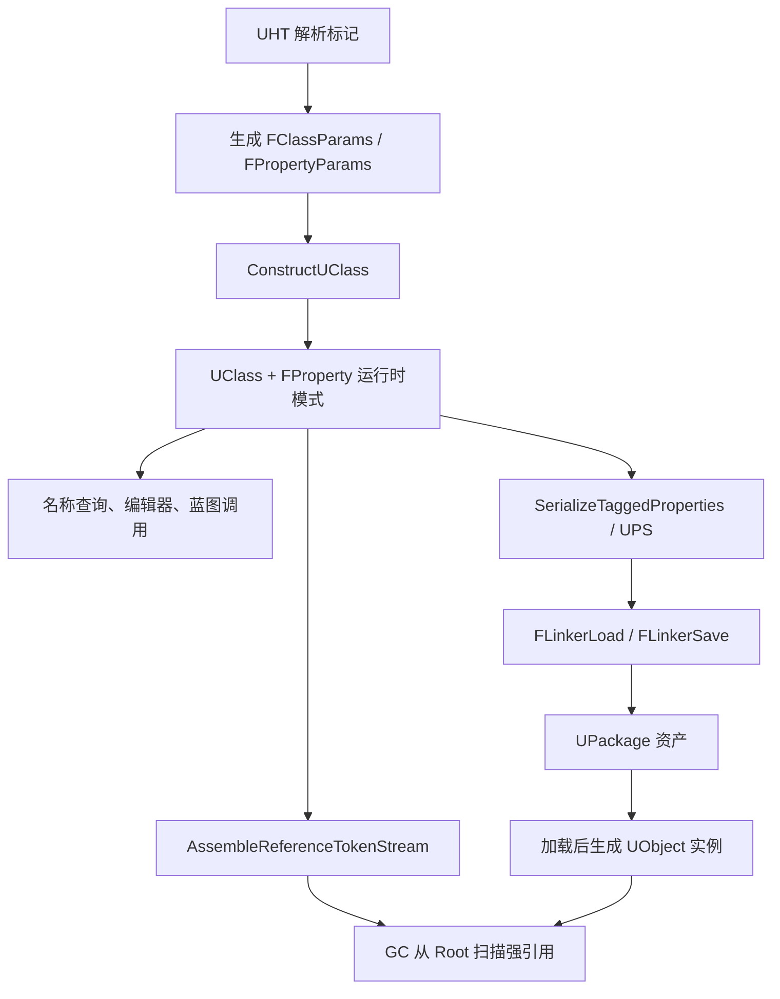

# UObject 系统原理与设计

本文基于 `Runtime/CoreUObject` 的 UE5 源码，从反射、垃圾回收和序列化三个方面解释 UObject
系统。阅读时最重要的主线是：**UHT 生成的运行时类型描述并不只服务于“反射查询”，它同时是 GC
遍历引用和默认属性序列化的模式（schema）来源。** 三套机制共享 `UClass`、`FProperty` 和对象标识，
因而能以较少的手写代码支持编辑器、蓝图、资产、网络复制和热重载等上层系统。

> 本文描述当前源码中的主路径。编辑器与 Cook、同步与异步加载、Tagged 与 Unversioned
> Property Serialization 会走不同分支，但它们共享下述对象模型和设计原则。

## 1. 基础对象模型

### 1.1 UObject 的最小身份

`UObjectBase` 保存一个被引擎管理的对象所需的四项核心信息：

- `ClassPrivate`：对象的运行时类型 `UClass`；
- `NamePrivate`：对象在其 Outer 中的逻辑名称 `FName`；
- `OuterPrivate`：对象的所有权/命名层级；
- `InternalIndex`：对象在全局对象数组中的槽位。

对应声明见 `CoreUObject/Public/UObject/UObjectBase.h`。`UObjectBase::AddObject` 会把新对象加入名称
哈希表和全局对象数组。由此，一个 UObject 同时拥有两种坐标：

1. `Outer + Name` 组成稳定的逻辑路径，例如 `/Game/Foo.Bar:SubObject`；
2. `InternalIndex` 指向进程内高效访问的 `FUObjectItem` 槽位。

Outer 是命名、查找和资产组织关系，**不是自动的强引用关系**。仅仅把 A 设为 B 的 Outer，不能
普遍推导出 B 会因为 A 存活；是否可达仍由 GC 根和引用收集结果决定。

### 1.2 全局对象表与对象本体分离

`GUObjectArray` 定义于 `CoreUObject/Private/UObject/UObjectHash.cpp`，公开结构位于
`CoreUObject/Public/UObject/UObjectArray.h`。每个 `FUObjectItem` 主要保存：

| 字段 | 作用 |
| --- | --- |
| `Object` | 指向实际分配的 `UObjectBase` |
| `Flags` | GC、Root、异步加载等内部状态 |
| `ClusterRootIndex` | Cluster 所属关系，或 Cluster 自身索引的编码 |
| `SerialNumber` | 与槽位索引共同校验弱指针，防止槽位复用后误指新对象 |
| `RefCount` | 特定内部引用计数用途，不等同于 UObject 的主生命周期算法 |

对象地址与管理元数据分离有三个收益：GC 可以紧凑扫描管理槽位；弱指针可以用
`Index + SerialNumber` 验证；对象槽位可以回收，而不会把裸地址当成永久身份。

### 1.3 类型也是对象

UObject 的类型描述不是独立 RTTI 数据库，而是一组对象和字段：

- `UClass` 描述 UObject 类，记录父类、函数、接口、属性链、构造函数和 CDO；
- `UScriptStruct` 描述可反射结构体；
- `UFunction` 描述可调用函数，其参数和返回值也表示为属性；
- `FField` / `FProperty` 描述字段及其内存偏移、类型、标志和序列化行为；
- `UPackage` 是顶层命名、加载和保存边界。

`UClass` 本身也是 UObject，因此类型信息可以参与查找、加载、序列化和热重载。属性在 UE5 中
主要属于轻量的 `FField` 层级，而非每个属性都是 UObject，这降低了大量字段描述的内存开销。

## 2. 反射与 UHT

### 2.1 为什么需要 UHT

C++ 原生 RTTI 不包含属性偏移、元数据、编辑器可见性、蓝图调用约定或 GC 引用类别，也不能
满足 UE 对跨模块注册和稳定资产格式的需求。UHT 在编译前解析 `UCLASS`、`USTRUCT`、
`UFUNCTION`、`UPROPERTY` 等标记，生成 `.generated.h` 和 `.gen.cpp`，把声明转换成普通 C++
静态描述数据与注册函数。

这些宏本身不是运行时反射的全部实现。`ObjectMacros.h` 中的宏负责向 C++ 类注入 `StaticClass`、
构造辅助、类型特征和注册声明；真正的属性数组、函数表、依赖单例与元数据由 UHT 生成。

### 2.2 从生成代码到 UClass

生成代码的典型注册链如下：

```text
模块加载 / C++ 静态初始化
	-> FRegisterCompiledInInfo
	-> RegisterCompiledInInfo(...)
	-> FClassDeferredRegistry 暂存注册项
	-> Z_Construct_UClass_T()
	-> UECodeGen_Private::ConstructUClass(OutClass, FClassParams)
	-> ConstructFProperties
	-> UClass::StaticLink
```

`FRegisterCompiledInInfo` 定义在 `CoreUObject/Public/UObject/UObjectBase.h`。它的构造函数最终调用
`RegisterCompiledInInfo`；后者在 `CoreUObject/Private/UObject/UObjectBase.cpp` 中把类、结构体和
枚举加入延迟注册表。延迟注册解决了 C++ 跨翻译单元静态初始化顺序不可控的问题：先收集描述，
再在 CoreUObject 已具备基础类型后按依赖构造。

`ConstructUClass` 位于 `CoreUObject/Private/UObject/UObjectGlobals.cpp`，其关键步骤是：

1. 调用 `DependencySingletonFuncArray`，保证父类、包和签名中依赖的类型先存在；
2. 通过 `ClassNoRegisterFunc` 取得低层 `UClass` 单例并强制完成对象注册；
3. 合并可继承的 `EClassFlags`；
4. 把生成的 `FClassFunctionLinkInfo` 加入函数映射；
5. `ConstructFProperties` 根据 `FPropertyParamsBase` 数组构造属性对象；
6. 安装接口、元数据、配置名和 C++ 类型信息；
7. 调用 `StaticLink` 计算属性布局并完成类型链接。

因此 `Z_Construct_UClass_T` 是幂等的类型单例构造器，而 `FClassParams` 是 UHT 结果与运行时类型
系统之间的主要 ABI。`CLASS_Constructed` 防止重复构造；Reload 版本信息则让 Hot Reload / Live
Coding 能判断已有类型描述是否发生变化。

### 2.3 FProperty 是三套系统的共同语言

不同 `FProperty` 子类知道如何处理对应 C++ 数据：

- `FObjectProperty` 表示 UObject 强引用；
- `FWeakObjectProperty`、`FSoftObjectProperty` 表示不同语义的非强引用；
- `FArrayProperty`、`FMapProperty`、`FSetProperty` 递归描述容器元素；
- `FStructProperty` 把处理委托给 `UScriptStruct`；
- 数值、名称、字符串、枚举等属性负责自己的值序列化和文本转换。

属性描述包含内存偏移和 `EPropertyFlags`。上层系统不需要理解每个 C++ 成员，只需沿属性链调用
统一接口。这也是“写一个 `UPROPERTY`，编辑器、GC、序列化都能识别”的根本原因。

### 2.4 CDO 与构造语义

每个 `UClass` 持有一个 Class Default Object（CDO）。CDO 是类构造完成后的默认实例，普通对象
构造时以 CDO 或指定 Archetype 为模板初始化，序列化时也可只保存相对于默认值的差异。

这解释了 UObject 构造函数为何不等同于普通业务对象的“每次完整初始化”：构造函数也会参与
CDO 创建，加载对象还会经历“分配并按模板初始化 -> 反序列化覆盖 -> `PostLoad`”的流程。

## 3. 生命周期与垃圾回收

### 3.1 创建与注册

常规对象通过 `NewObject` / `StaticConstructObject_Internal` 创建，主路径位于
`CoreUObject/Private/UObject/UObjectGlobals.cpp`：

```text
选择 Class、Outer、Name、Flags、Template
	-> StaticAllocateObject 分配并注册 UObject
	-> 调用 UClass 保存的 ClassConstructor
	-> FObjectInitializer 复制默认属性并创建默认子对象
	-> PostInitProperties
```

对象一旦加入 `GUObjectArray`，GC、弱指针和全局查找系统才拥有统一的进程内身份。对象销毁则不能
直接由业务代码 `delete`，因为引擎必须先从引用图、哈希表、异步资源和全局槽位中有序移除它。

### 3.2 GC 是追踪式标记回收

UObject 的主生命周期不是引用计数，而是以根集合为起点的 tracing GC。简化后的存活条件是：

```text
对象存活 <=> 它是根/被保留对象，或能从某个根沿强引用边到达
```

典型根来源包括 Root Set（`AddToRoot`）、引擎显式保留的对象、特定内部 Keep Flags、Cluster 根，
以及通过 `FGCObject::AddReferencedObjects` 暴露给 GC 的非 UObject 所有者。

以下关系不能单独保证存活：

- C++ 裸指针；
- `TWeakObjectPtr`；
- `TSoftObjectPtr` / 软对象路径；
- 未被反射描述、也未在 `AddReferencedObjects` 中报告的引用。

### 3.3 引用模式如何生成

GC 不会在每次回收时反射性地逐个解释所有属性。`UClass::AssembleReferenceTokenStreamInternal`
位于 `CoreUObject/Private/UObject/GarbageCollection.cpp`，它沿父类模式和属性链调用
`FProperty::EmitReferenceInfo`，把对象引用、容器循环、结构体嵌套和原生
`AddReferencedObjects` 回调编译为 `UClass::ReferenceSchema`。

例如 `FArrayProperty::EmitReferenceInfo` 会为数组元素建立内部 schema，`FStructProperty` 会递归
展开结构体属性。真正的可达性扫描由 `FastReferenceCollector.h` 消费这个预编译模式。其设计目的
是把较慢的类型分析放到类链接阶段，使高频 GC 扫描主要执行紧凑的偏移和循环指令。

对无法由 `UPROPERTY` 表达的引用，应实现静态 `AddReferencedObjects(UObject*, FReferenceCollector&)`；
非 UObject 管理者可继承 `FGCObject`。这两者本质上都是向引用图补边。

### 3.4 标记阶段

主实现在 `CoreUObject/Private/UObject/GarbageCollection.cpp`。`FRealtimeGC` 的关键流程为：

```text
MarkObjectsAsUnreachable
	-> 交换 Reachable / MaybeUnreachable 状态，先把候选对象视为可能不可达
	-> 把 Root、KeepFlags 和 Cluster 保留对象放入 InitialObjects
PerformReachabilityAnalysis
	-> FastReferenceCollector 按 UClass::ReferenceSchema 扫描引用
	-> 原子地恢复被发现对象的 Reachable 状态并加入工作队列
	-> 队列为空时，仍为 MaybeUnreachable 的对象成为垃圾
```

“先假定不可达，再从根恢复”免去了单独维护一张完整 mark bitmap 的需要，并与 `FUObjectItem`
内部标志结合。工作上下文池、原子状态与预取支持并行扫描；`EGCOptions::IncrementalReachability`
允许可达性分析按时间预算挂起，并通过写屏障把期间新增的可达引用重新加入工作集。

### 3.5 Cluster 的意义

Cluster 把通常共同存亡的大量 UObject 聚合起来。Cluster 根可达时，成员和引用的其他 Cluster
可以批量标记；根不可达时则可批量进入清理。它减少大型资产对象图中逐对象调度与重复遍历的
成本，但不改变“从根沿强引用判定存活”的语义。

### 3.6 清扫与两阶段销毁

可达性分析只决定谁是垃圾。`IncrementalPurgeGarbage` 随后执行清扫：

1. `UnhashUnreachableObjects` 将不可达对象从查找结构移除并路由 `ConditionalBeginDestroy`；
2. `BeginDestroy` 启动资源释放，可提交渲染线程或异步清理工作；
3. GC 反复查询 `IsReadyForFinishDestroy`；
4. 就绪后调用 `ConditionalFinishDestroy` / `FinishDestroy`；
5. 调用析构、释放 `GUObjectArray` 槽位，最终回收内存。

拆成 `BeginDestroy` 和 `FinishDestroy` 是为了避免在 GC 中同步阻塞渲染线程、RHI 或异步 IO。
`IncrementalPurgeGarbage` 还按帧时间预算推进清理，降低一次性销毁大量对象造成的卡顿。

弱指针在此处体现 `SerialNumber` 的价值：对象槽位释放并复用后，旧弱指针的序列号不匹配，因而
不会错误地解析成占据同一槽位的新对象。

## 4. 序列化与资产

### 4.1 FArchive 把“数据是什么”与“数据去哪里”分离

UE 序列化的中心抽象是 `FArchive`。值类型通常实现 `operator<<`，UObject 实现 `Serialize`，具体
Archive 决定操作语义：加载、保存、引用收集、复制、事务、内存计数或文本化。

`FStructuredArchive` 在 `FArchive` 上增加 Record、Field、Array、Map、Slot 等结构语义；
`UObject::Serialize(FStructuredArchive::FRecord)` 位于 `CoreUObject/Private/UObject/Obj.cpp`。
它不会把对象的 `Class`、`Outer`、`Name` 当作普通属性写入 export 数据，因为这些身份信息已由
包的 Import/Export 表描述。默认实现把属性处理交给运行时类，并由 Archive 选择格式：

```text
UObject::Serialize
	-> UObject::SerializeScriptProperties
			 -> 文本或非二进制属性归档：UClass::SerializeTaggedProperties
			 -> 二进制属性归档：UClass::SerializeBin / SerializeBinEx
	-> 各 FProperty 按格式序列化对应内存地址
```

派生类可以覆写 `Serialize` 处理原生数据，但应调用 `Super::Serialize`，否则会截断父类和反射属性
的默认序列化链。

### 4.2 Tagged 与 Unversioned Property Serialization

`UStruct::SerializeTaggedProperties` 位于 `CoreUObject/Private/UObject/Class.cpp`，根据 Archive 状态
选择两种格式：

| 模式 | 特点 | 典型场景 |
| --- | --- | --- |
| Versioned Tagged Properties | 属性值带名称、类型等标签，可跳过未知字段并做类型转换 | 编辑器资产、需要演进兼容的数据 |
| Unversioned Property Serialization | 依据当前 schema 和片段头按固定顺序读写，省略大部分标签 | Cook 后、schema 与构建严格匹配的运行时包 |

Tagged 格式牺牲空间和解析速度换取版本韧性。属性重排、新增、删除后，加载器仍可按标签匹配；
重命名通常还需 Core Redirect。Unversioned 格式更紧凑，但把兼容性责任移到 Cook 产物与运行时
schema 的一致性上。

属性标志控制参与条件，例如 `Transient` 不进入普通持久化，`SaveGame` 可供特定 Archive 过滤，
EditorOnly 数据可在 Cook 时剔除。需要注意：`UPROPERTY(SaveGame)` 不是自动保存系统，它只是供
设置了相应过滤语义的 Archive 选择字段。

### 4.3 包文件不是对象内存的直接转储

`UPackage` 是资产保存与加载的边界。包数据主要由以下逻辑部分组成：

- Package Summary：版本、偏移、标志和各表数量；
- Name Map：包内使用的名称；
- Import Map：由本包对象引用、但定义在其他包中的对象；
- Export Map：本包实际拥有的对象，含 Class、Outer、ObjectName、ObjectFlags、SerialOffset 和
	`SerialSize` 等；
- Dependency / Soft Reference 等辅助表；
- 每个 Export 的序列化数据与 Bulk Data。

相关结构见 `CoreUObject/Public/UObject/ObjectResource.h`，Linker 公共逻辑见
`CoreUObject/Private/UObject/Linker.cpp`。对象引用在包内通常映射为 `FPackageIndex`：索引指向
Import 或 Export，而不是把运行时地址写入文件。加载时 Linker 再把逻辑索引解析为 UObject。

### 4.4 加载路径

传统同步加载主路径可概括为：

```text
LoadPackage / LoadObject
	-> 创建 FLinkerLoad，读取 Summary 与 Name/Import/Export 表
	-> CreateExport：确定 Class、Outer、Name，分配 UObject 并以 Archetype/CDO 初始化
	-> FLinkerLoad::Preload(Object)
			 -> 先加载父结构、Class、CDO 等依赖
			 -> Seek 到 FObjectExport::SerialOffset
			 -> Object->Serialize(Archive)
	-> 解析导入和对象引用
	-> PostLoad / PostLoadSubobjects
```

`FLinkerLoad::Preload` 位于 `CoreUObject/Private/UObject/LinkerLoad.cpp`。它以 `RF_NeedLoad` 保证
同一对象不会重复反序列化，并使用 Export 的 `SerialOffset/SerialSize` 定位数据。对象在 Serialize
之前已经存在且具有默认值，所以缺失的属性自然保留 CDO/Archetype 默认值，磁盘数据只负责覆盖。

现代异步加载由 `AsyncLoading2.cpp` 将创建、依赖解析、序列化和 PostLoad 拆成可调度节点，但核心
契约相同：先建立对象身份和依赖，再把 export 数据喂给对象的 Serialize，最后发布为可用对象。

### 4.5 保存路径

当前保存主流程位于 `CoreUObject/Private/UObject/SavePackage2.cpp`：

```text
UPackage::SavePackage
	-> PreSave / 准备 Cook 数据
	-> HarvestPackage
			 -> 从顶层资产遍历引用
			 -> 判定 Export、Import、依赖、名称和自定义版本
	-> CreateLinker(FLinkerSave)
	-> 排序并写 Package Header
	-> 对每个 Export 调用 Serialize，记录偏移与大小
	-> 写 Bulk Data / Trailer
	-> PackageWriter 提交输出
	-> PostSave
```

保存前必须先 Harvest，是因为头部的 Name、Import、Export 和依赖表必须在写对象数据前确定；而
这些集合只有遍历待保存对象及其引用后才完整。Harvester 使用 Archive 接口观察对象序列化会触及
的引用和名称，随后真正保存阶段再次调用 Serialize。由此得到一条重要约束：**SavePackage 期间
Serialize 可能被调用多次，Serialize 不应依赖只执行一次，也不应产生不可重复的副作用。**

### 4.6 硬引用、软引用与资产依赖

- 硬 UObject 引用参与 GC，可在保存 Harvest 时形成 Import/Export 依赖，加载时解析为对象；
- `TSoftObjectPtr` 保存逻辑资产路径，不让目标仅因该引用而常驻内存，可按需异步加载；
- `TWeakObjectPtr` 主要表达进程内非拥有观察关系，不能作为跨会话资产身份；
- Bulk Data 把大块载荷与 UObject 属性元数据分离，便于流式读取、虚拟化和独立 IO。

选择引用类型实际是在同时声明生命周期、加载耦合和磁盘依赖，不能只从 C++ 指针便利性出发。

## 5. 三套机制如何闭环



这套设计的核心不是“给 C++ 增加反射”这么简单，而是建立一个统一的运行时类型协议：

1. UHT 把 C++ 声明编译为可注册的类型与字段模式；
2. 反射层提供对象布局、属性语义、函数调用和元数据；
3. GC 把属性模式进一步编译为高效的引用扫描 schema；
4. 序列化按相同属性模式把对象值映射到 Archive；
5. Package/Linker 把运行时对象图转换为可重定位、可版本化的资产对象图。

代价也很明确：UObject 必须遵守引擎的创建和销毁协议；未声明给系统的引用对 GC 不可见；类型或
属性演进必须考虑资产兼容；构造、加载和保存阶段的回调都有严格语义。换来的则是跨平台资产、
编辑器可视化、自动生命周期管理和数据驱动工作流共享同一套基础设施。

## 6. 源码阅读索引

建议按以下顺序阅读，先看稳定接口，再进入实现：

1. `CoreUObject/Public/UObject/UObjectBase.h`：对象最小身份与注册入口；
2. `CoreUObject/Public/UObject/Object.h`：UObject 生命周期和 Serialize 契约；
3. `CoreUObject/Public/UObject/Class.h`、`UnrealType.h`：类型与属性模型；
4. `CoreUObject/Public/UObject/ObjectMacros.h`：生成代码使用的宏和标志；
5. `CoreUObject/Private/UObject/UObjectBase.cpp`：编译期类型的延迟注册；
6. `CoreUObject/Private/UObject/UObjectGlobals.cpp`：对象创建与 `ConstructUClass`；
7. `CoreUObject/Public/UObject/UObjectArray.h`：`FUObjectItem` 与全局对象表；
8. `CoreUObject/Private/UObject/Class.cpp`：Tagged/Unversioned 属性序列化；
9. `CoreUObject/Private/UObject/GarbageCollection.cpp`：ReferenceSchema 构建、可达性分析和增量清扫；
10. `CoreUObject/Private/UObject/Obj.cpp`：UObject 默认序列化与销毁回调；
11. `CoreUObject/Public/UObject/ObjectResource.h`：包的 Import/Export 数据结构；
12. `CoreUObject/Private/UObject/LinkerLoad.cpp`：对象加载和 Preload；
13. `CoreUObject/Private/UObject/SavePackage2.cpp`：Harvest、LinkerSave 与包输出。