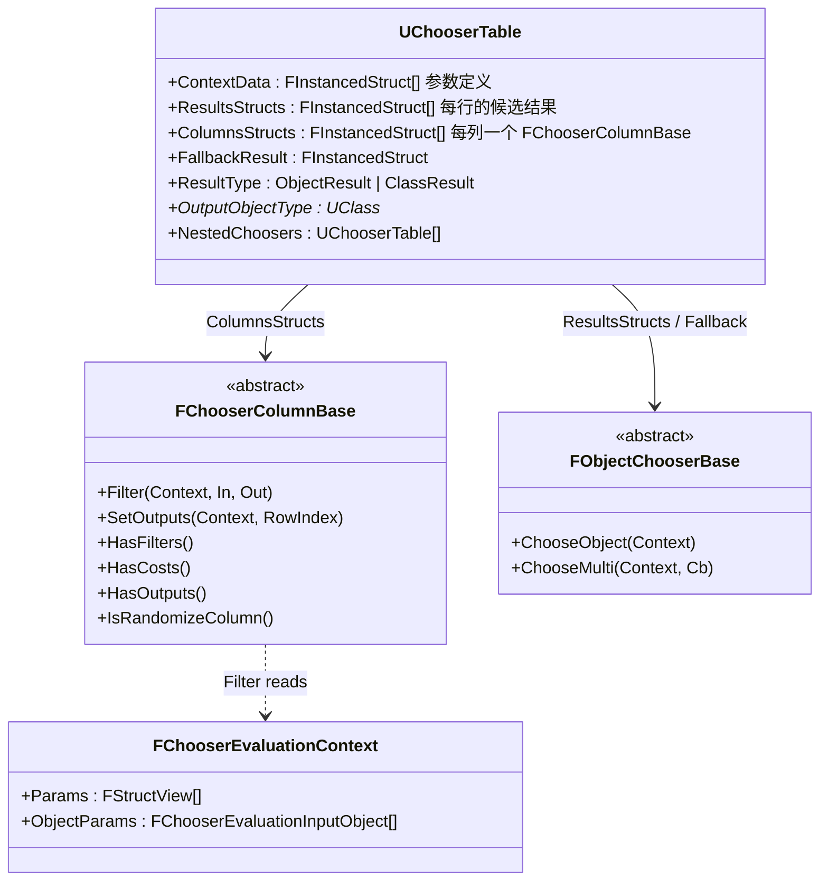
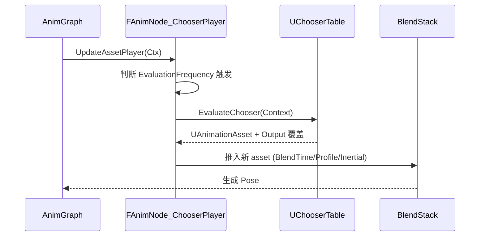
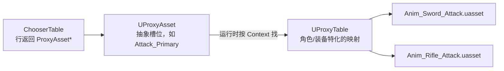

# UE5 Chooser 系统详解

> 基于 UE 5.5.4 源码。代码入口：[Plugins/Chooser](Plugins/Chooser)。
> Chooser 是 UE 5.1 引入、5.3~5.5 逐步稳定的**通用"数据驱动资产选择"框架**，属于 Animation 类别，但**并不局限于动画**：任何"根据一组运行时输入从若干候选 `UObject` / `UClass` 里挑一个"的需求都可以用它建模。

---

## 一、它解决什么问题？

传统做法要在蓝图/AnimBP 里挂一大堆 `Select`、`Switch`、`If` 节点：

> "角色手里拿剑 → 播 `Attack_Sword`；拿枪 → `Attack_Rifle`；且速度 > 300 且在跑 → `Sprint_Attack`；否则回退到 `Idle`……"

这种逻辑写在图里的问题：
- **不可数据化**：设计师改一条规则要动图。
- **难以复用**：同一条件矩阵没法跨角色/资产共享。
- **难以调试**：一堆布尔连线看不清究竟走了哪一路。
- **性能一般**：图节点的分支+属性访问在密集调用时开销明显。

Chooser 把这类逻辑抽象成一张**二维决策表**（Excel 式），列 = 条件维度，行 = 候选结果。运行时按列逐个"筛"（filter）、再按代价（cost）排序，最后按顺序回调直到有人成功。

---

## 二、核心数据模型



### 2.1 `UChooserTable` —— 决策表资产

见 [Chooser.h](Plugins/Chooser/Source/Chooser/Internal/Chooser.h)。核心字段：

| 字段 | 含义 |
|---|---|
| `ContextData` | 描述"我需要哪些外部参数"（如 `Character*`、`FMovementState` 结构体）。运行时用 `FChooserEvaluationContext` 传入相同顺序/类型的值。 |
| `ResultsStructs` | 表的**行**。每行是一个 `FObjectChooserBase`（如 `FAssetChooser`：直接返回资产；`FNestedChooser` / `FEvaluateChooser`：嵌套调用另一个 ChooserTable；`FEvaluateProxyAsset`：走代理表）。 |
| `ColumnsStructs` | 表的**列**。每列一个 `FChooserColumnBase` 派生类型，负责按自己的判据筛掉不满足的行。 |
| `FallbackResult` | 当没有任何行通过筛选时的兜底。空则返回 `nullptr`。 |
| `ResultType` + `OutputObjectType` | 输出的是 Object 实例还是 UClass 子类。 |
| `NestedChoosers` | 可以嵌入子表，把决策拆成分层。 |

结果类型是 `FInstancedStruct` 而非 `TScriptInterface`，意味着**每行本身也可以是"再评估一次别的 Chooser"这种复合行为**——这是 Chooser 的可组合性来源。

### 2.2 `FChooserColumnBase` —— 列

见 [IChooserColumn.h](Plugins/Chooser/Source/Chooser/Public/IChooserColumn.h)。抽象接口：

```cpp
virtual void Filter(FChooserEvaluationContext& Context,
                    const FChooserIndexArray& IndexListIn,
                    FChooserIndexArray& IndexListOut) const;   // 过滤
virtual void SetOutputs(FChooserEvaluationContext& Context,
                        int RowIndex) const;                   // 写回结果到 Context
virtual bool HasFilters() const;
virtual bool HasCosts() const;
virtual bool HasOutputs() const;
virtual bool IsRandomizeColumn() const;                        // 随机列，恒最后
```

**内置列**（[Plugins/Chooser/Source/Chooser/Private](Plugins/Chooser/Source/Chooser/Private) 与 `Internal/`）：

| 列 | 类型 | 作用 |
|---|---|---|
| `FBoolColumn` | 输入 | 按 bool 精确匹配 |
| `FEnumColumn` / `FMultiEnumColumn` | 输入 | 按枚举/枚举位掩码匹配 |
| `FGameplayTagColumn` | 输入 | GameplayTag 容器 All/Any + Exact/Partial + Invert |
| `FFloatRangeColumn` | 输入 | 每行 [Min, Max]，可选 Wrap（角度） |
| `FFloatDistanceColumn` | 输入+代价 | 与每行值的距离作为 cost |
| `FObjectColumn` / `FObjectClassColumn` | 输入 | 按对象/类匹配 |
| `FRandomizeColumn` | 特殊 | 在剩余行里按加权随机挑一个 |
| `FOutputBool/Enum/Float/Object/StructColumn` | 输出 | 命中行时把该行的值回写到 Context 里的属性 |

约定：`IsRandomizeColumn() == true` 的列必须放在**最后一列**——因为它把 N 行随机压缩到 1 行，且用到 cost 排序结果。

### 2.3 `FObjectChooserBase` —— 结果

见 [IObjectChooser.h](Plugins/Chooser/Source/Chooser/Public/IObjectChooser.h)。它是"如何从行取到最终 UObject"的策略：

- `FAssetChooser` / `FClassChooser`：直接返回一个资产/类。
- `FNestedChooser`：调用**嵌入在同一资产内**的子表 `UChooserTable`（避免拆多个 asset）。
- `FEvaluateChooser`：跳转到**另一个** `UChooserTable` 资产。
- `FEvaluateProxyAsset`：走 Proxy Table 间接查询（见第五节）。

`ChooseMulti` 支持迭代所有匹配项，`ChooseObject` 只返回第一个。

### 2.4 `FChooserEvaluationContext` —— 上下文

```cpp
TArray<FStructView, TInlineAllocator<4>> Params;                  // 所有输入引用
TArray<FChooserEvaluationInputObject, TFixedAllocator<4>> ObjectParams;
```

- 输入统一通过 `FStructView`（对结构体/对象引用的轻量视图），列内部用 `FChooserPropertyBinding` 按名字路径读取属性，等价于 UE 的 PropertyAccess。
- `TInlineAllocator<4>` / `TFixedAllocator<4>` 表示**每帧调用零堆分配**（在栈上/内联存储）。

---

## 三、核心算法：EvaluateChooser

源码入口在 [Chooser.cpp](Plugins/Chooser/Source/Chooser/Private/Chooser.cpp) 第 400 行 `UChooserTable::EvaluateChooser`。抽象为伪代码：

```text
输入: Context, Chooser
1. 初始化 IndicesIn = { i | 行 i 未被禁用 }
2. 对每个未禁用的 Column:
     if Column.HasFilters():
        Swap(IndicesIn, IndicesOut)
        Column.Filter(Context, IndicesIn, IndicesOut)  // 只保留通过的行
        若 Column 产出 cost, 给 IndicesOut 打上 HasCosts 标记
3. 若 IndicesOut.Num() > 1 且 HasCosts, 按 cost 升序排序
4. 顺序迭代 IndicesOut:
     result = ResultsArray[i]
     status = result.ChooseMulti(Context, Callback)
     if status != Continue:
        对所有输出列调用 SetOutputs(Context, i)
     if status == Stop: return
5. 若一行都没走成功: 用 FallbackResult (若有) 走一次同样流程
```

关键设计点：

### 3.1 双缓冲 `FChooserIndexArray`

见 [ChooserIndexArray.h](Plugins/Chooser/Source/Chooser/Public/ChooserIndexArray.h)。用 `FMemory_Alloca` 在栈上分配两块 `FIndexData[Count]` 缓冲：

```cpp
FChooserIndexArray Indices1(FMemory_Alloca(BufferSize), Count);
FChooserIndexArray Indices2(FMemory_Alloca(BufferSize), Count);
```

- 每列 Filter 是"Ping-Pong 交换"：`Swap(In, Out); Out->SetNum(0); Column.Filter(In, Out);`
- **零堆分配**，是 Chooser 相对蓝图逻辑的最大性能优势之一。

### 3.2 `FIndexData` = 行号 + 代价

```cpp
struct FIndexData {
    uint32 Index;
    float  Cost;
    bool operator<(const FIndexData& o) const { return Cost < o.Cost; }
};
```

代价（cost）在**具备连续量纲**的列（如 `FFloatDistanceColumn`）里累加：

$$
\text{cost}(i) = \sum_{c \in \mathcal{C}_{\text{cost}}} k_c \cdot \operatorname{clip}_{[0,1]}\!\left( \frac{|x_c - v_{c,i}|}{d_c^{\max}} \right)
$$

- $v_{c,i}$：列 $c$ 在第 $i$ 行的目标值
- $x_c$：来自 Context 的实测值
- $d_c^{\max}$：列的 `MaxDistance`
- $k_c$：列的 `CostMultiplier`
- 支持"回绕距离"（角度 -180~180）：

$$
d = \min\left( |x - v|,\ (\text{range}) - |x - v| \right)
$$

排序完只需选 cost 最小的行——这就是**最近邻式匹配**，非常适合"选与当前速度/角度最匹配的动画"这类需求。

### 3.3 Filter 的短路 & Passthrough

每列 `Filter` 若无法解析输入（如 Context 里没绑定），一般走 `IndexListOut = IndexListIn` 直接透传（见 `FloatRangeColumn` / `GameplayTagColumn`）。这使得**表在部分参数缺失时仍能工作**——利于编辑器 live editing。

### 3.4 加权随机（Randomize）列

见 [RandomizeColumn.cpp](Plugins/Chooser/Source/Chooser/Private/RandomizeColumn.cpp)。

- 与其它列独立：**必须放在最后**（否则会破坏后续列的多行前提）。
- 每行有一个权重 $w_i$（`RowValues[i]`）。
- 若前面列已经产生 cost，Randomize 只在"最低 cost 附近"的行（`FMath::IsNearlyEqual(LowestCost, cost, EqualCostThreshold)`）里做加权随机，保证仍偏好高质量匹配。
- 概率：

$$
P(i) = \frac{w_i \cdot m_i}{\sum_j w_j \cdot m_j},\quad
m_i = \begin{cases} r & i = \text{上一次选择的行} \\ 1 & \text{否则} \end{cases}
$$

$r = $ `RepeatProbabilityMultiplier`，通常 <1，用来避免连续两次选到同一动画（"反重复"）。
- 状态存在 `FChooserRandomizationContext`（Context 的一个 struct 参数）里，key 是**列指针本身**，因此**天然多实例安全**、可跨帧记忆。

### 3.5 Output 列

`FOutput*Column` 的 `HasFilters()` 返回 false，只实现 `SetOutputs`。命中行后，把该行存储的值（Bool/Enum/Float/Object/Struct）写回 Context 指定的属性——**Chooser 不只挑资产，还能同时"配置"多个输出参数**（比如挑动画的同时写入播放速率、循环标志、混合时间等）。这是 `FAnimNode_ChooserPlayer` 的核心用法。

---

## 四、动画节点集成：`FAnimNode_ChooserPlayer`

见 [AnimNode_ChooserPlayer.h](Plugins/Chooser/Source/Chooser/Internal/AnimNode_ChooserPlayer.h)。它继承 `FAnimNode_BlendStack_Standalone`（BlendStack 插件），是 Chooser 在 AnimGraph 里最主流的落地形态。

关键字段：
- `EvaluationFrequency`：`OnInitialUpdate` / `OnBecomeRelevant` / `OnLoop` / `OnUpdate`——**决定每帧是否重新走一遍决策**。多数情况下 `OnBecomeRelevant` + `OnLoop` 就够了，避免每帧都跑列过滤。
- `Chooser`：一个 `FInstancedStruct`，通常放 `FEvaluateChooser`。
- `DefaultSettings : FChooserPlayerSettings`：镜像、起始时间、播放速率、循环、曲线覆盖、混合时长/曲线/骨骼混合权重、是否 Inertial Blend。
- 这些 `FChooserPlayerSettings` 的**每一项都可以被 Chooser 的 Output 列在选中行时改写**——所以设计师能在同一张表里同时定义"选谁 + 怎么播"。
- `bStartFromMatchingPose`：可选与 PoseSearch 联动，用姿态匹配确定入场时间点。

流程：



---

## 五、Proxy Table（代理表）

见 [ProxyTable.h](Plugins/Chooser/Source/Chooser/Source/ProxyTable/Public/ProxyTable.h) 与 [ProxyAsset.h](Plugins/Chooser/Source/ProxyTable/Public/ProxyAsset.h)。

问题：多角色/多套装备时，Chooser 里如果直接引用具体动画资产，就得为每个角色复制一份决策表。Proxy 提供**间接层**：



- `UProxyAsset`：一个"命名槽位"资产，有 `Type`（结果类型）和 `Guid`，本身不指向具体资源。
- `UProxyTable`：`{ Guid -> Value }` 的表，`InheritEntriesFrom` 支持表继承（"骑士装备表"继承"通用武器表"）。
- 行返回 `FEvaluateProxyAsset` 时，运行时通过 Context 里配置的 Proxy Table 参数把 Proxy 解析成实际资产。

于是：**逻辑（Chooser）和数据（ProxyTable）解耦**——一张动作决策表可跨所有角色/装备复用，切装备只需换 Proxy Table。

---

## 六、蓝图/C++ 使用要点

`UChooserFunctionLibrary`（[ChooserFunctionLibrary.h](Plugins/Chooser/Source/Chooser/Public/ChooserFunctionLibrary.h)）暴露：

```cpp
static UObject* EvaluateChooser(const UObject* ContextObject,
                                const UChooserTable* ChooserTable,
                                TSubclassOf<UObject> ObjectClass);   // 单选
static TArray<UObject*> EvaluateChooserMulti(...);                    // 多选
static UObject* EvaluateObjectChooserBase(FChooserEvaluationContext& Context,
                                          const FInstancedStruct& ObjectChooser,
                                          TSubclassOf<UObject> ObjectClass,
                                          bool bResultIsClass);
static void AddChooserObjectInput(FChooserEvaluationContext&, UObject*);
static void AddChooserStructInput(...);   // CustomThunk，接任意 USTRUCT
static void GetChooserStructOutput(...);  // CustomThunk 读出 Output 列写入的结构体
```

`BlueprintThreadSafe` 说明 Chooser 是**线程安全的纯函数**（不做任何持久修改，除非 Randomize 列显式在 Context 中存了状态）——因此可以在 Worker 线程的 AnimGraph Update 中直接调用。

---

## 七、调试

- 编辑器：`UChooserTable` 记录 `DebugSelectedRow` / `DebugTargetName` / `RecentContextObjects`，编辑器会高亮实时命中的行、列通过/失败状态（`bEnableDebugTesting` + `TestValue`）。
- Runtime：`CHOOSER_TRACE_ENABLED` 时通过 `TRACE_CHOOSER_EVALUATION` / `TRACE_CHOOSER_VALUE` 写入 UE Trace；配合 **Rewind Debugger**（`RewindDebuggerChooserRuntime`）可以在时间线上回溯每次选择的列输入值和结果行。

---

## 八、性能特征小结

| 项 | 表现 |
|---|---|
| 堆分配 | 0（Params 用 InlineAlloc，索引数组用 Alloca） |
| 时间复杂度 | $O(R \cdot C)$，$R$=行数，$C$=列数，常数极小（PropertyAccess + 一次 branch） |
| 分支预测 | 每列独立循环，缓存/分支非常友好 |
| 排序 | 仅在 `HasCosts && Num>1` 时执行 |
| 线程 | Thread-safe，可在 Worker 线程调用 |

---

## 九、典型用法样板

**AnimBP 场景**：
1. 建 `ChooserTable`，`ContextData` 加入 `Character*` 和 `FLocomotionState`。
2. 列：`Enum(WeaponType) | Float Range(Speed) | Tag(State) | Randomize`。
3. 行：多个 `FAssetChooser` 指向不同 AnimSequence；再加一列 `Output Float` 写 `PlaybackRate`。
4. AnimGraph 用 `FAnimNode_ChooserPlayer`，`EvaluationFrequency = OnBecomeRelevant`，`FallbackResult = 空闲动画`。

**装备/角色跨复用**：
1. 抽象出 `ProxyAsset`：`Attack_Primary`、`Attack_Heavy`。
2. Chooser 行改为 `FEvaluateProxyAsset(Attack_Primary)`。
3. 每个武器 BP 提供各自的 `UProxyTable`，运行时挂到 Context。
4. 只维护**一张**决策逻辑表，装备/角色数据完全解耦。

**非动画场景**：
- 生成器选敌人类：`ResultType = ClassResult`，`OutputObjectType = ACharacter`。
- UI 选卡片模板、物品掉落表、AI 行为选择、对话选支……只要能表达成"多个候选 + 多列条件筛"就适合。

---

## 十、一句话总结

**Chooser = 无堆分配、双缓冲索引流水线过滤 + 可累计代价排序 + 加权反重复随机 + 组合式嵌套/代理 的通用 UObject 选择器**。它把过去写在蓝图/AnimBP 里的"if-else 决策森林"外化为**可编辑、可继承、可 Trace、可 Worker 线程调用的数据表**，并通过 `FAnimNode_ChooserPlayer` + BlendStack 与 UE 动画管线深度集成，同时借 Proxy Table 实现"逻辑 vs 数据"解耦。

---

## 关键源码索引

- 表 / 求值：[Chooser.h](Plugins/Chooser/Source/Chooser/Internal/Chooser.h) · [Chooser.cpp](Plugins/Chooser/Source/Chooser/Private/Chooser.cpp)（`EvaluateChooser` 第 400 行）
- 列接口：[IChooserColumn.h](Plugins/Chooser/Source/Chooser/Public/IChooserColumn.h)
- 索引流水线：[ChooserIndexArray.h](Plugins/Chooser/Source/Chooser/Public/ChooserIndexArray.h)
- 结果接口：[IObjectChooser.h](Plugins/Chooser/Source/Chooser/Public/IObjectChooser.h)
- 代价列示例：[FloatDistanceColumn.cpp](Plugins/Chooser/Source/Chooser/Private/FloatDistanceColumn.cpp)
- 随机列：[RandomizeColumn.cpp](Plugins/Chooser/Source/Chooser/Private/RandomizeColumn.cpp)
- 蓝图库：[ChooserFunctionLibrary.h](Plugins/Chooser/Source/Chooser/Public/ChooserFunctionLibrary.h)
- AnimGraph 节点：[AnimNode_ChooserPlayer.h](Plugins/Chooser/Source/Chooser/Internal/AnimNode_ChooserPlayer.h)
- Proxy Table：[ProxyTable.h](Plugins/Chooser/Source/ProxyTable/Public/ProxyTable.h) · [ProxyAsset.h](Plugins/Chooser/Source/ProxyTable/Public/ProxyAsset.h)
