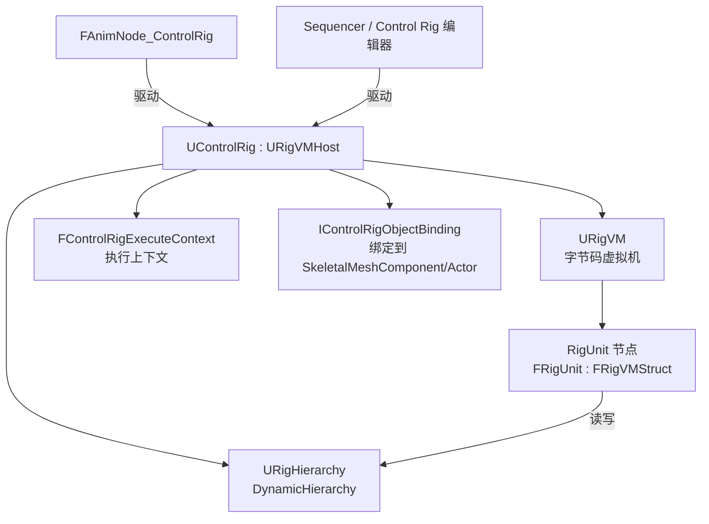
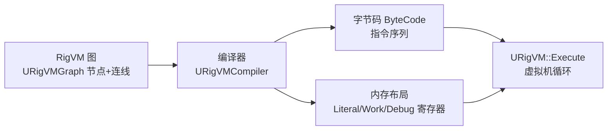
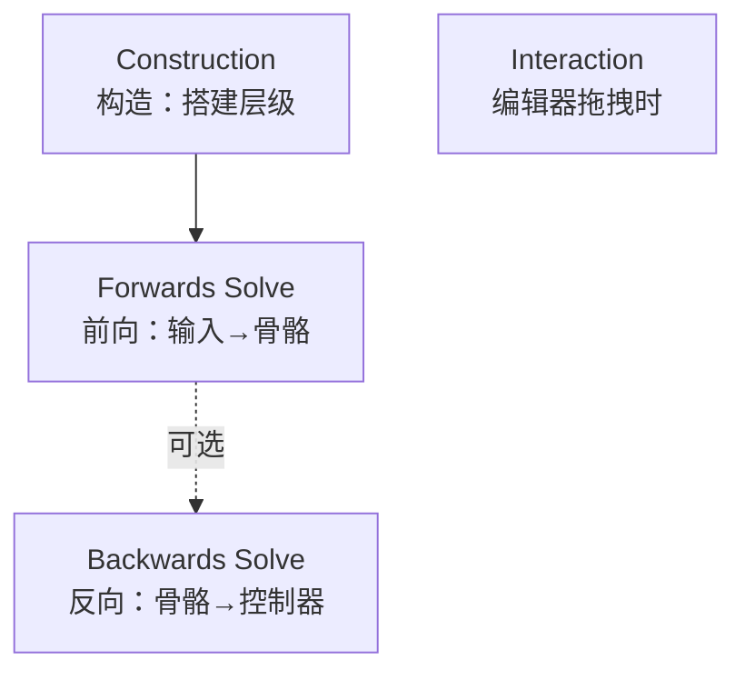
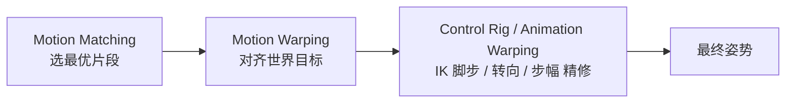

# UE5 Control Rig 实现解析 与 Motion Warping 应用

> 基于 UnrealEngine 5.5.4 源码
> 插件路径：`Engine/Plugins/Animation/ControlRig`
> 依赖框架：`RigVM`（`Engine/Plugins/Runtime/RigVM`）

---

## 目录

- [UE5 Control Rig 实现解析 与 Motion Warping 应用](#ue5-control-rig-实现解析-与-motion-warping-应用)
  - [目录](#目录)
- [第一部分 Control Rig 是什么](#第一部分-control-rig-是什么)
- [第二部分 整体架构](#第二部分-整体架构)
- [第三部分 URigHierarchy：骨架数据模型](#第三部分-urighierarchy骨架数据模型)
  - [3.1 元素类型](#31-元素类型)
  - [3.2 变换的双表示与惰性求值](#32-变换的双表示与惰性求值)
  - [3.3 脏标记传播（Dirty Propagation）](#33-脏标记传播dirty-propagation)
- [第四部分 RigVM：执行引擎](#第四部分-rigvm执行引擎)
  - [4.1 RigUnit 节点](#41-rigunit-节点)
  - [4.2 编译：从图到字节码](#42-编译从图到字节码)
  - [4.3 执行上下文 `FControlRigExecuteContext`](#43-执行上下文-fcontrolrigexecutecontext)
- [第五部分 事件与求解模型](#第五部分-事件与求解模型)
  - [5.1 Construction Event（构造）](#51-construction-event构造)
  - [5.2 Forwards Solve（前向求解）](#52-forwards-solve前向求解)
  - [5.3 Backwards Solve（反向求解）](#53-backwards-solve反向求解)
  - [5.4 Interaction / Pre / Post](#54-interaction--pre--post)
- [第六部分 求解器节点与数学](#第六部分-求解器节点与数学)
- [第七部分 与 AnimGraph 集成：AnimNode\_ControlRig](#第七部分-与-animgraph-集成animnode_controlrig)
- [第八部分 Modular Rig 与 Connectors（5.x 新特性）](#第八部分-modular-rig-与-connectors5x-新特性)
- [第九部分 Control Rig 的应用](#第九部分-control-rig-的应用)
- [第十部分 Motion Warping 的应用](#第十部分-motion-warping-的应用)
- [附录：关键类型对照表](#附录关键类型对照表)

---

# 第一部分 Control Rig 是什么

**Control Rig** 是 UE5 中的**程序化绑定与动画系统**。它把"骨架操控逻辑"表达成一张**可视化节点图**（本质是编译到 **RigVM 虚拟机**的程序），在运行时对骨骼层级施加变换。

一句话定位：

> Control Rig = **RigVM 程序**（逻辑） + **RigHierarchy**（数据）+ **事件模型**（何时执行）。

典型用途：

- **运行时程序化动画**：IK、脚步修正、Look-At、二级动力学（弹簧/尾巴/布料抖动）、Full-Body IK。
- **动画编辑**：在 Sequencer 里用 Control（控制器）像 Maya 一样 K 帧摆姿势。
- **重定向 / Retarget**：IK Rig / IK Retargeter 底层复用同一套层级与求解思想。
- **Modular Rig**：把绑定拆成可复用模块（手臂、腿、脊椎），拼装角色。

---

# 第二部分 整体架构



核心类（`ControlRig.h`）：

```cpp
UCLASS(Blueprintable, Abstract, editinlinenew)
class CONTROLRIG_API UControlRig : public URigVMHost,
    public INodeMappingProviderInterface, public IRigHierarchyProvider
{
    // 数据模型
    URigHierarchy* GetHierarchy() { return DynamicHierarchy; }

    // 执行入口（来自 URigVMHost）
    virtual bool Execute(const FName& InEventName) override;
    virtual bool Execute_Internal(const FName& InEventName) override;
    virtual void Evaluate_AnyThread() override;

    // 上下文类型
    virtual UScriptStruct* GetPublicContextStruct() const override
    { return FControlRigExecuteContext::StaticStruct(); }
};
```

要点：

- `UControlRig` 继承自 **`URigVMHost`**——即它是一个"RigVM 虚拟机的宿主"。图的执行、字节码、内存管理都来自 RigVM 框架。
- `DynamicHierarchy`（`URigHierarchy`）是**唯一的数据真相源**，所有节点读写它。
- 通过 `IControlRigObjectBinding` 绑定到具体的 `USkeletalMeshComponent` 或 `AActor`。

---

# 第三部分 URigHierarchy：骨架数据模型

`URigHierarchy`（`Rigs/RigHierarchy.h`）是一个**扁平数组 + 键索引**的层级容器：所有元素存于 `TArray<FRigBaseElement*> Elements`，通过 `FRigElementKey`（类型 + 名字）查找。

## 3.1 元素类型

`ERigElementType`（`Rigs/RigHierarchyDefines.h`）是**位掩码**枚举：

```cpp
enum class ERigElementType : uint8
{
    None      = 0,
    Bone      = 0x001,  // 骨骼（可来自导入骨架 Imported 或用户 User）
    Null      = 0x002,  // 空间/定位器（旧称 Space），组织层级、做参考系
    Control   = 0x004,  // 控制器（Sequencer 里可 K 帧的操纵柄）
    Curve     = 0x008,  // 曲线/浮点通道（morph、驱动值）
    Physics   = 0x010,  // 物理元素
    Reference = 0x020,  // 外部引用
    Connector = 0x040,  // 连接器（Modular Rig 用）
    Socket    = 0x080,  // 插槽
    All = Bone | Null | Control | Curve | Physics | Reference | Connector | Socket,
};
```

- **Bone**：对应网格骨骼，Forwards Solve 的最终输出通常写到它们。
- **Control**：动画师操作的控制器，带 Offset/Shape/Limit（`FRigControlElement`）。
- **Null**：无渲染的定位节点，用作父级/参考系（例如 IK 极向量目标）。
- **Curve**：驱动 morph target 或作为标量参数。

## 3.2 变换的双表示与惰性求值

每个变换元素同时维护**局部（Local）**与**全局（Global）**两套变换，且区分 **Initial（参考姿势）** 与 **Current（当前）**。核心 API：

```cpp
GetLocalTransform(Key)   / SetLocalTransform(Key, T)
GetGlobalTransform(Key)  / SetGlobalTransform(Key, T)
GetInitialLocalTransform(Key)  // 参考姿势
```

关系（$P$ 为父元素）：

$$T^{\text{global}}_{\text{child}} = T^{\text{local}}_{\text{child}} \cdot T^{\text{global}}_{\text{parent}}$$

（UE 变换乘法为"子 · 父"顺序，`FTransform` 左乘子局部、右乘父全局。）

Hierarchy 采用**惰性求值**：设置了 Local 就把 Global 标脏，反之亦然；只有真正 `Get` 时才沿父链**按需计算**并缓存。这样避免每次改动都全量重算。

## 3.3 脏标记传播（Dirty Propagation）

当某元素的变换被修改，其子孙的 Global 变换缓存被标记为"脏"。下次访问子孙 Global 时才重新用父链计算。这是 Control Rig 高效的关键：

- 改一个父骨 → 只标脏、不立即重算。
- 读某个叶子 Global → 沿链回溯到最近的干净父节点，逐级相乘缓存。
- `bPropagateToChildren` 之类选项控制是否主动把 Local 重算下推给子级。

---

# 第四部分 RigVM：执行引擎

Control Rig 的图**不是每帧解释执行**的，而是**编译成字节码**由 RigVM 虚拟机跑，接近原生性能且可多线程。

## 4.1 RigUnit 节点

图中的每个功能节点是一个 `FRigUnit`（`Units/RigUnit.h`），继承自 `FRigVMStruct`：

```cpp
USTRUCT(meta=(Abstract, ExecuteContext="FControlRigExecuteContext"))
struct FRigUnit : public FRigVMStruct
{
    // 每个 unit 用 RIGVM_METHOD 标注的执行函数
    // 例如 FRigUnit_BeginExecution::Execute()
};
```

- 用 `UPROPERTY(meta=(Input))` / `(Output)` 声明引脚，RigVM 据此连线与传参。
- `RIGVM_METHOD() virtual void Execute()` 是被编译进字节码的执行体。
- 分类：Hierarchy（Get/Set Transform）、Highlevel（IK/Aim/Chain 求解器）、Simulation（弹簧/点模拟）、Execution（事件）、DynamicHierarchy（运行时增删元素）等。

## 4.2 编译：从图到字节码



- 节点被拓扑排序 → 生成指令（Execute / Copy / Zero / BeginBlock 等）。
- 引脚值放入内存寄存器（常量 Literal、运行时 Work 内存）。
- 运行时 `URigVM::Execute` 顺序执行指令，调用各 `FRigUnit::Execute`。
- **Work Data**：有状态求解器（如 FABRIK 的 `FRigUnit_FABRIK_WorkData`、模拟节点）把跨帧状态存在 Work 内存里。

## 4.3 执行上下文 `FControlRigExecuteContext`

所有 unit 通过统一的执行上下文访问运行期数据：Hierarchy 指针、DeltaTime、绝对时间、绘制接口、命名空间、事件名等。`GetPublicContextStruct()` 返回该类型，让 RigVM 知道图的公共上下文。

---

# 第五部分 事件与求解模型

Control Rig 通过**具名事件**决定"何时、以何种方向"执行。事件本身也是 RigUnit（`Units/Execution/`），`CanOnlyExistOnce() == true` 保证图里唯一。



## 5.1 Construction Event（构造）

`FRigUnit_PrepareForExecution`，事件名 `"Construction"`（`RigUnit_PrepareForExecution.h`）。

- 只在绑定/重建时运行一次，用于**程序化搭建层级**：创建骨骼/控制器/Null、设置初始变换、建立父子关系。
- `RequestConstruction()` 触发下一次执行时重跑构造。
- 构造后 `ToResetAfterConstructionEvent`（Bone/Control/Curve/Socket）会被重置到初始态。

## 5.2 Forwards Solve（前向求解）

`FRigUnit_BeginExecution`，事件名 **`"Forwards Solve"`**（`RigUnit_BeginExecution.h`）——**每帧核心**。

- 方向：**输入（控制器值/变量/动画姿势）→ 计算 → 写入骨骼**。
- 配套 `Pre Forwards Solve` / `Post Forwards Solve` 在前后各执行一次（做准备/清理、debug 绘制）。
- 对应回调：`OnPreForwardsSolve_AnyThread` / `OnPostForwardsSolve_AnyThread`。

## 5.3 Backwards Solve（反向求解）

`FRigUnit_InverseExecution`，事件名 `"Inverse"`（`RigUnit_InverseExecution.h`）。

- 方向：**从骨骼姿势反推控制器值**（Forwards 的逆过程）。
- 用途：把一段动画序列"烘"到 Rig 控制器上供编辑（Bake to Control Rig）；Additive Rig 通过 `InvertInputPose` 由 backward solve 后的姿势反解控制器增量。
- `SupportsBackwardsSolve()` 查询图是否实现了该事件。

## 5.4 Interaction / Pre / Post

`FRigUnit_InteractionExecution`：在编辑器里**拖拽控制器**时触发，用于交互式约束求解（`RigUnit_IsInteracting` 可查询是否正在交互）。

---

# 第六部分 求解器节点与数学

`Units/Highlevel/Hierarchy/` 提供一组即用型求解器。核心是 **IK（逆运动学）**：给定末端目标，反求链上各骨旋转。

**Two-Bone IK**（`RigUnit_TwoBoneIKSimple`）——解析解，用于腿/臂：已知大腿根 $A$、目标 $T$、链长 $l_1,l_2$，用余弦定理求膝角：

$$\cos\theta = \frac{l_1^2 + l_2^2 - \|T-A\|^2}{2\,l_1 l_2}$$

再用极向量（Pole Vector）确定膝盖朝向平面。$O(1)$、稳定，是脚/手 IK 的首选。

**FABRIK**（`RigUnit_FABRIK`，Forward And Backward Reaching IK）——N 骨链迭代解：

```
重复直到收敛或达 MaxIterations：
  后向：从末端拉到目标，逐节回根，保持骨长
  前向：从根拉回原位，逐节到末端，保持骨长
```

数学上每步是"把点投影到以父节点为球心、骨长为半径的球面"：

$$p_i' = p_{i+1}' + l_i\cdot \frac{p_i - p_{i+1}'}{\|p_i - p_{i+1}'\|}$$

以 `Precision` 为收敛阈值、`MaxIterations` 上限（源码 `FRigUnit_FABRIK_WorkData` 缓存链 `Chain`）。适合尾巴、脊椎、绳索等长链。

**CCDIK**（`RigUnit_CCDIK`，Cyclic Coordinate Descent）——逐关节旋转使末端趋近目标，迭代收敛，可加角度限制。

其他：`RigUnit_AimBone`（Look-At，构造朝向四元数）、`RigUnit_SpringIK` / `RigUnit_ChainHarmonics` / `RigUnit_PointSimulation`（弹簧/谐波二级动力学）、`RigUnit_DistributeRotation`（沿链分配旋转）、`RigUnit_FitChainToCurve`（贴合曲线）。

这些配合 [第五部分](#第五部分-事件与求解模型) 的 Forwards Solve，在每帧把动画姿势"精修"成符合物理/交互约束的最终姿势。

---

# 第七部分 与 AnimGraph 集成：AnimNode_ControlRig

`FAnimNode_ControlRig`（`AnimNode_ControlRig.h`，继承 `FAnimNode_ControlRigBase`）把 Control Rig 作为一个 **AnimGraph 节点**嵌入动画蓝图：

```cpp
struct FAnimNode_ControlRig : public FAnimNode_ControlRigBase
{
    TSubclassOf<UControlRig> ControlRigClass;  // 使用的 Rig 类
    TObjectPtr<UControlRig> ControlRig;        // 实例
    float Alpha;                               // 混合权重
    TMap<FName, FName> InputMapping, OutputMapping; // 曲线/属性 I/O 映射
    int32 LODThreshold;                        // 超过该 LOD 停止求解
};
```

每帧 `Evaluate_AnyThread` 流程：


- **输入映射**：把 AnimGraph 曲线/变量喂给 Rig 的控制器/变量。
- **Alpha 混合**：支持 bool/float/curve 三种来源（`AlphaInputType`），可平滑开关 Rig 效果。
- **LOD 剔除**：`LODThreshold` 在远距离 LOD 停止求解省性能。
- `bSetRefPoseFromSkeleton`：用网格参考姿势覆盖 Rig 初始变换。

这使得 IK、脚步修正、Look-At 等可作为动画后处理层，接在 Motion Matching / 状态机之后。

---

# 第八部分 Modular Rig 与 Connectors（5.x 新特性）

为解决"每个角色重复搭 Rig"的问题，UE5 引入 **Modular Rig**：

- `UControlRig` 可被标记为 **Rig Module**（`IsRigModule()`），带命名空间（如 `ArmModule::`）。
- **Connector**（`ERigElementType::Connector`）是模块的"接口引脚"，运行时通过 `FRigElementKeyRedirector` 解析（resolve）到宿主骨架的具体元素。
- `UModularRig`（`IsModularRig()`）把多个模块（手臂、腿、脊椎）**组合**成完整角色绑定，`AllConnectorsAreResolved()` 校验接线完整。
- 相关 unit：`Units/Modules/`（`RigUnit_ConnectorExecution`、`RigUnit_ConnectionCandidates`）。

好处：绑定逻辑**复用、可组合**，一套"腿模块"可套到不同骨架。

---

# 第九部分 Control Rig 的应用

1. **运行时 IK**：脚步贴地（Foot IK）、手部抓取对齐、瞄准手臂 IK、Full-Body IK。
2. **二级动力学**：尾巴、耳朵、头发、披风、胸甲的弹簧抖动（`SpringIK`/`ChainHarmonics`）。
3. **程序化姿势修正**：Look-At 转头看目标、上半身瞄准、倾斜身体过弯。
4. **动画编辑（Sequencer）**：用控制器像 DCC 一样 K 帧做过场动画；Backwards Solve 把现有动画烘到控制器再编辑。
5. **重定向**：IK Rig / IK Retargeter 复用层级与求解，把动画迁移到不同比例骨架。
6. **Modular 角色装配**：模块化绑定快速搭建大量角色。
7. **与 Motion Matching / Warping 组合**：作为动画管线末端的姿势精修层。

---

# 第十部分 Motion Warping 的应用

> Motion Warping 的数学原理与实现详见同目录 [AnimationMotionWarping.md](AnimationMotionWarping.md)。以下汇总其典型应用。

Motion Warping 通过在动画的 Notify 窗口内**缩放/斜切根运动**，让固定动画**精确对齐**世界中的动态目标：

| 应用场景 | 说明 | 使用的 Warp |
|----------|------|------------|
| **翻越 / 攀爬（Mantle/Vault）** | 一段翻越动画适配不同高度、距离的边缘 | SkewWarp（平移缩放 + 旋转对齐墙面） |
| **跳跃落点对齐** | 精确落到平台边缘/缝隙对面，避免落空穿插 | SkewWarp（含 Z 轴对齐） |
| **处决 / 终结技** | 攻击者动画对齐到受击者的相对位置与朝向，保证接触点吻合 | SkewWarp + Facing 旋转 |
| **交互对齐** | 开门、按按钮、翻窗、拾取——手/根对齐到交互物插槽 | SkewWarp（跟随组件目标） |
| **点到点攀岩** | 在墙面锚点间移动时对齐下一个抓握点 | SkewWarp |
| **精确停步到标记** | 走到并停在指定位置、朝向指定方向 | 无位移时的"添加平移"插值 |

**与其他系统的协作管线**（现代 UE5 角色）：



- **Motion Matching** 决定"播哪段"（近似）。
- **Motion Warping** 把根运动"贴到"精确目标（精确，但会引入几何失真）。
- **Control Rig / Animation Warping** 在末端修正脚步 IK、转向、步幅，消除滑步与穿插。

三者互补：搜索得越准 → warp 量越小 → 失真越低 → Control Rig 修正越轻。

---

# 附录：关键类型对照表

| 概念 | 类型 / 文件 | 说明 |
|------|-------------|------|
| Rig 主类 | `UControlRig : URigVMHost` (`ControlRig.h`) | RigVM 宿主 + 层级持有者 |
| 数据模型 | `URigHierarchy` (`Rigs/RigHierarchy.h`) | 扁平元素数组 + 键索引 |
| 元素类型 | `ERigElementType` (`RigHierarchyDefines.h`) | Bone/Null/Control/Curve/Physics/Connector/Socket |
| 元素基类 | `FRigBaseElement` / `FRigControlElement` (`RigHierarchyElements.h`) | Local/Global × Initial/Current 变换 |
| 执行引擎 | `URigVM` (`RigVMCore/RigVM.h`) | 字节码虚拟机 |
| 节点基类 | `FRigUnit : FRigVMStruct` (`Units/RigUnit.h`) | RIGVM_METHOD 执行体 |
| 执行上下文 | `FControlRigExecuteContext` | Hierarchy/DeltaTime/绘制等 |
| 构造事件 | `FRigUnit_PrepareForExecution` → `"Construction"` | 搭建层级 |
| 前向求解 | `FRigUnit_BeginExecution` → `"Forwards Solve"` | 输入→骨骼（每帧） |
| 反向求解 | `FRigUnit_InverseExecution` → `"Inverse"` | 骨骼→控制器（烘焙） |
| 求解器 | `RigUnit_TwoBoneIK` / `FABRIK` / `CCDIK` / `AimBone` | IK / Look-At / 动力学 |
| AnimGraph 集成 | `FAnimNode_ControlRig` (`AnimNode_ControlRig.h`) | 作为后处理动画节点 |
| 模块化 | `UModularRig` / Connector / `FRigElementKeyRedirector` | 可复用绑定模块 |

---

*本文档基于 UnrealEngine 5.5.4 源码分析整理，代码引用来自 `Engine/Plugins/Animation/ControlRig`。Motion Warping 详解参见同目录 `AnimationMotionWarping.md`，Motion Matching 参见 `AnimationPoseSearch.md`。*
