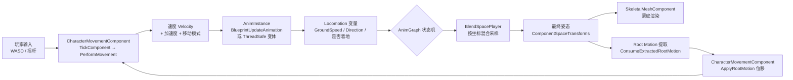
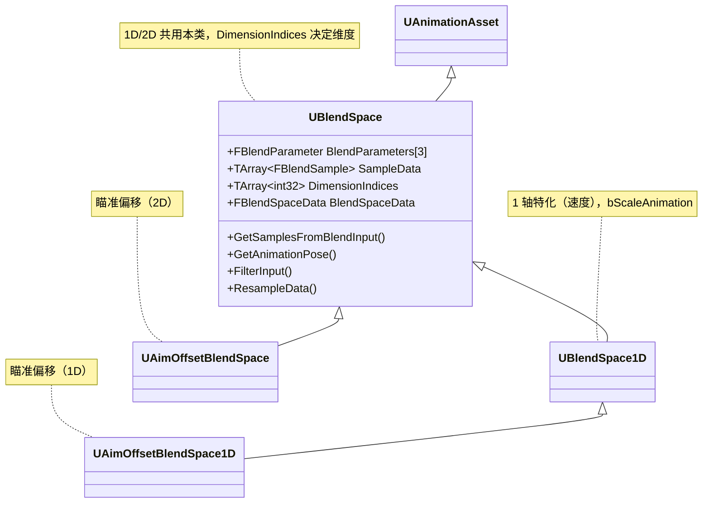
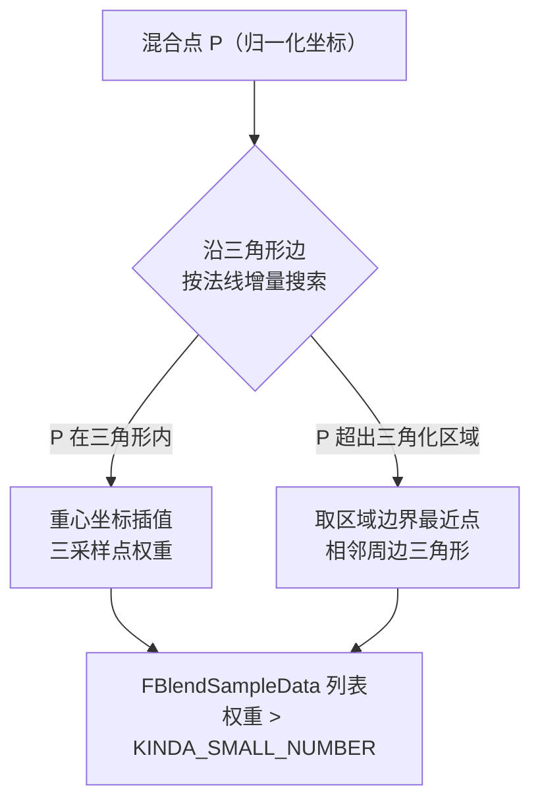
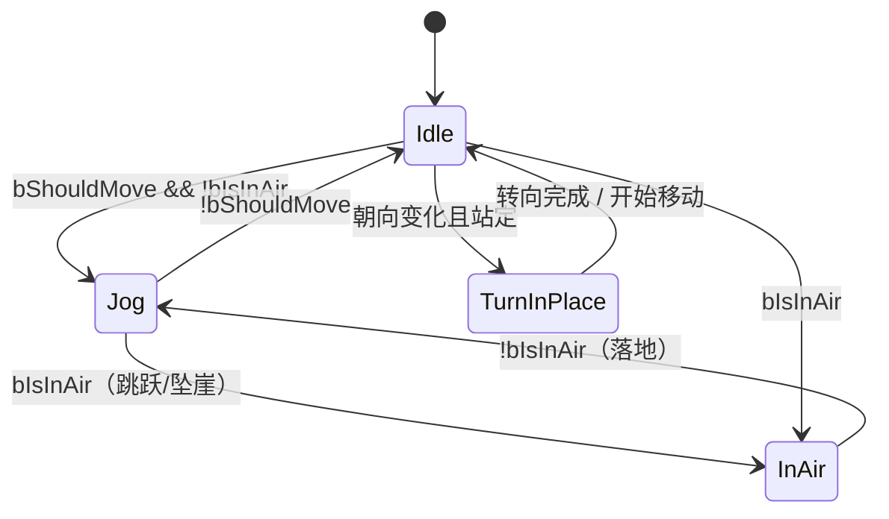
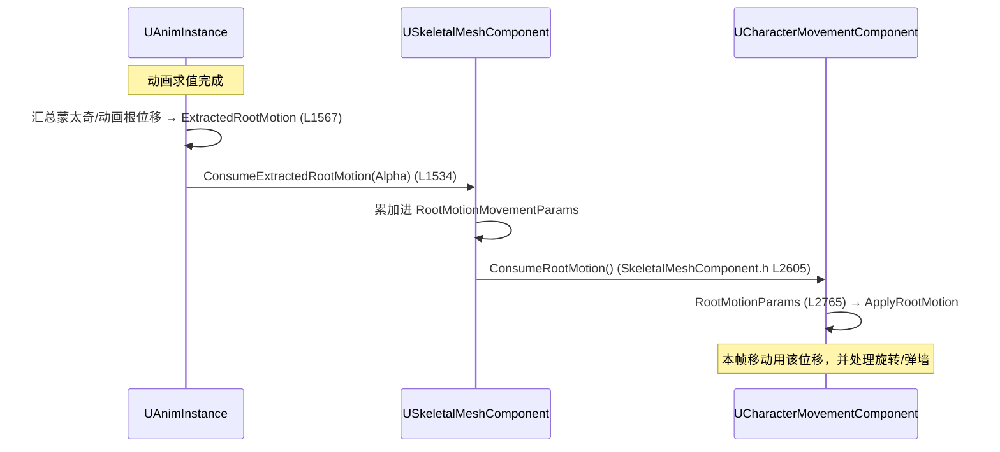
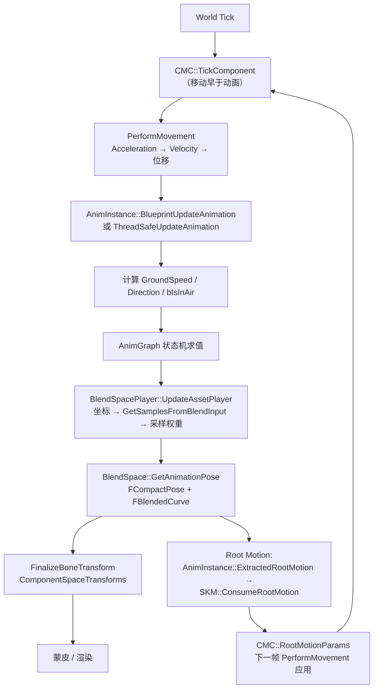

# Locomotion 深度解析：从"速度"到"动画姿态"的完整管道

> 版本：UE 5.5.4
> 源码路径：
> - `Source/Runtime/Engine/Classes/Animation/BlendSpace.h`（混合空间核心）
> - `Source/Runtime/Engine/Classes/GameFramework/CharacterMovementComponent.h`（运动数据来源）
> - `Source/Runtime/Engine/Classes/Animation/AnimEnums.h`（Root Motion 枚举）
> - `Source/Runtime/Engine/Classes/GameFramework/RootMotionSource.h`（Root Motion 源）
> - `Source/Runtime/AnimGraphRuntime/Public/AnimNodes/AnimNode_BlendSpacePlayer.h`（运行时节点）
> 目标读者：想理解"角色为什么这样走路/跑步"，以及如何用混合空间 + 状态机 + Root Motion 搭建自己的 Locomotion 系统的动画/游戏程序员

---

## 目录

- [Locomotion 深度解析：从"速度"到"动画姿态"的完整管道](#locomotion-深度解析从速度到动画姿态的完整管道)
  - [目录](#目录)
  - [1. 什么是 Locomotion：概念地图](#1-什么是-locomotion概念地图)
    - [1.1 一个容易混淆的前提：5.5 没有 AnimNode\_Locomotion](#11-一个容易混淆的前提55-没有-animnode_locomotion)
    - [1.2 完整数据流](#12-完整数据流)
    - [1.3 两条技术路线](#13-两条技术路线)
  - [2. 运动数据来源：速度、加速度、移动模式](#2-运动数据来源速度加速度移动模式)
    - [2.1 CharacterMovementComponent 是"事实来源"](#21-charactermovementcomponent-是事实来源)
    - [2.2 AnimInstance 如何桥接](#22-animinstance-如何桥接)
    - [2.3 核心算法：CalculateDirection](#23-核心算法calculatedirection)
    - [2.4 一套标准的 Locomotion 变量](#24-一套标准的-locomotion-变量)
  - [3. 混合空间 BlendSpace：Locomotion 的核心资产](#3-混合空间-blendspacelocomotion-的核心资产)
    - [3.1 类层次](#31-类层次)
    - [3.2 核心数据结构](#32-核心数据结构)
    - [3.3 采样算法：分段与三角化](#33-采样算法分段与三角化)
    - [3.4 权重平滑与输入滤波](#34-权重平滑与输入滤波)
    - [3.5 时间推进与同步](#35-时间推进与同步)
    - [3.6 典型 Locomotion 混合空间布局](#36-典型-locomotion-混合空间布局)
  - [4. AnimGraph 中的 Locomotion 组装](#4-animgraph-中的-locomotion-组装)
    - [4.1 运行时节点家族（AnimGraphRuntime）](#41-运行时节点家族animgraphruntime)
    - [4.2 编辑器侧节点（Editor/AnimGraph）](#42-编辑器侧节点editoranimgraph)
    - [4.3 典型 Locomotion 状态机](#43-典型-locomotion-状态机)
    - [4.4 转向与瞄准（Turn In Place / Aim Offset）](#44-转向与瞄准turn-in-place--aim-offset)
  - [5. Root Motion：让动画真正驱动移动](#5-root-motion让动画真正驱动移动)
    - [5.1 四种 Root Motion 模式](#51-四种-root-motion-模式)
    - [5.2 提取链路（动画侧）](#52-提取链路动画侧)
    - [5.3 应用链路（移动侧）](#53-应用链路移动侧)
    - [5.4 FRootMotionSource 家族](#54-frootmotionsource-家族)
    - [5.5 实践注意点](#55-实践注意点)
  - [6. Motion Matching：Locomotion 的新范式](#6-motion-matchinglocomotion-的新范式)
  - [7. 一帧 Locomotion 调用链](#7-一帧-locomotion-调用链)
  - [8. 调试与调优](#8-调试与调优)
  - [附录：关键源码速查表](#附录关键源码速查表)

---

## 1. 什么是 Locomotion：概念地图

**Locomotion（移动动画）** 不是某个单一的类或节点，而是 UE 动画系统里一整条把"角色在物理世界的移动状态"翻译成"屏幕上的动画姿态"的运行时管道。它回答的问题只有一个：**这个角色现在应该播放哪段动画、以什么权重混合起来。**

这条管道的两端，一头连着 [UCharacterMovementComponent](Source/Runtime/Engine/Classes/GameFramework/CharacterMovementComponent.h)（速度/加速度/移动模式的事实来源），另一头连着 [USkeletalMeshComponent](Source/Runtime/Engine/Classes/Components/SkeletalMeshComponent.h)（最终姿态的消费者）。中间负责翻译的，就是 Locomotion 系统。

### 1.1 一个容易混淆的前提：5.5 没有 AnimNode_Locomotion

UE 5.6 起，Epic 在 AnimGraph 里加入了一个自动生成基础移动状态机的 **"Basic Locomotion" 节点**（`AnimNode_Locomotion` / `UAnimGraphNode_Locomotion`）。**在 5.5.4 的源码中并不存在这个节点**——对 `Source/` 全量搜索 `Locomotion` 命中的只有资产命名空间（如 `FAnimNode_BlendSpacePlayer` 内部没有任何 "Locomotion" 字符串）。

因此 5.5.4 的 Locomotion 全部由**通用积木**搭建：

| 积木 | 扮演的角色 |
|---|---|
| `CharacterMovementComponent` | 提供速度、加速度、移动模式、是否着地 |
| **混合空间 BlendSpace** | 按速度/方向在多段动画间平滑混合 |
| **AnimGraph 状态机** | 管理 Idle / Walk / Jog / InAir / TurnInPlace 等离散状态 |
| **Root Motion** | 让动画姿态中的位移真正驱动角色移动 |
| （可选）**PoseSearch** | 5.4 引入的 Motion Matching 替代方案 |

这也是本系列文档 [AnimationPoseSearch.md](AnimationPoseSearch.md) 与本文的关系：前者讲"如何用搜索替代显式状态机"，本文讲"传统的、由状态机 + 混合空间组成的 Locomotion"。

### 1.2 完整数据流



一句话总结：**移动系统算出速度 → 动画系统按速度查混合空间 → 混合空间输出姿态 → 若动画本身带位移则再回写移动系统。**

### 1.3 两条技术路线

| 维度 | 状态机 + 混合空间（传统，5.5 主力） | Motion Matching（PoseSearch，5.4+） |
|---|---|---|
| 状态组织 | 美术/程序显式设计状态与过渡 | 无显式状态，逐帧最近邻搜索 |
| 动画选择 | 按变量（速度/方向）映射到采样点 | 按特征向量（速度/方向/轨迹）算代价 |
| 资产量 | 少而精（每个状态几段循环） | 大（大量连续动作捕捉） |
| 过度控制 | 强（状态图明确） | 弱（依赖搜索代价设计） |
| 维护成本 | 状态爆炸后变高 | 动作库扩展时反而低 |
| 实现位置 | [BlendSpace.h](Source/Runtime/Engine/Classes/Animation/BlendSpace.h) + AnimGraph | `Plugins/Animation/PoseSearch`（见 [AnimationPoseSearch.md](AnimationPoseSearch.md)） |

两条路线可以共存：例如用状态机管理大状态（Idle / Jog），状态内部用 Motion Matching 选择细节动作。

---

## 2. 运动数据来源：速度、加速度、移动模式

### 2.1 CharacterMovementComponent 是"事实来源"

所有 Locomotion 变量最终都源自 [CharacterMovementComponent.h](Source/Runtime/Engine/Classes/GameFramework/CharacterMovementComponent.h)（下称 CMC）：

| 数据 | 声明 | 说明 |
|---|---|---|
| `MovementMode` | [L229](Source/Runtime/Engine/Classes/GameFramework/CharacterMovementComponent.h#L229) | 当前移动模式，`TEnumAsByte<enum EMovementMode>` |
| `LastUpdateVelocity` | [L654](Source/Runtime/Engine/Classes/GameFramework/CharacterMovementComponent.h#L654) | 上次 `PerformMovement` 后的速度，getter 见 [L712](Source/Runtime/Engine/Classes/GameFramework/CharacterMovementComponent.h#L712) |
| `GetCurrentAcceleration()` | [L1543](Source/Runtime/Engine/Classes/GameFramework/CharacterMovementComponent.h#L1543) | 当前加速度（由输入经各轴映射而来），**Locomotion 最常用的量之一** |
| `IsMovingOnGround()` | [L1294](Source/Runtime/Engine/Classes/GameFramework/CharacterMovementComponent.h#L1294) | 是否在地面（Walking / NavWalking） |
| `RootMotionParams` | [L2765](Source/Runtime/Engine/Classes/GameFramework/CharacterMovementComponent.h#L2765) | 从动画提取的 Root Motion 位移；`HasAnimRootMotion()` [L2773](Source/Runtime/Engine/Classes/GameFramework/CharacterMovementComponent.h#L2773) 判断是否生效 |

`EMovementMode` 定义在 [EngineTypes.h:922](Source/Runtime/Engine/Classes/Engine/EngineTypes.h#L922)：`MOVE_None / MOVE_Walking / MOVE_NavWalking / MOVE_Falling / MOVE_Swimming / MOVE_Flying / MOVE_Custom`。

输入向量本身不挂在 CMC 上，而在其基类 [UPawnMovementComponent](Source/Runtime/Engine/Classes/GameFramework/PawnMovementComponent.h) 上：`GetLastInputVector()`（[L78](Source/Runtime/Engine/Classes/GameFramework/PawnMovementComponent.h#L78)）、`GetPendingInputVector()`（[L69](Source/Runtime/Engine/Classes/GameFramework/PawnMovementComponent.h#L69)）、`ConsumeInputVector()`（[L86](Source/Runtime/Engine/Classes/GameFramework/PawnMovementComponent.h#L86)）。

### 2.2 AnimInstance 如何桥接

动画蓝图（AnimBP）的函数上下文是 `UAnimInstance`，而数据在 Pawn / CMC 上。桥接入口：

- `TryGetPawnOwner()`：[AnimInstance.h:421](Source/Runtime/Engine/Classes/Animation/AnimInstance.h#L421)——返回拥有组件的 Pawn，AnimBP 里所有 "Get Pawn Owner" 逻辑的起点。
- `GetOwningActor()` / `GetOwningComponent()`：[AnimInstance.h:499-504](Source/Runtime/Engine/Classes/Animation/AnimInstance.h#L499-L504)。

典型的 AnimBP Event Graph 结构：

```
BlueprintUpdateAnimation(DeltaTime)
 ├── TryGetPawnOwner() → 拿到 Pawn / CMC
 ├── 计算 GroundSpeed = Velocity.Size2D()
 ├── 计算 Direction = CalculateDirection(Velocity, ActorRotation)
 ├── 记录 bIsInAir = !IsMovingOnGround()
 └── 更新动画图表变量 → 驱动状态机 / 混合空间坐标
```

`Velocity` 在 AnimBP 中取的是 **Actor 的速度**（`AActor::GetVelocity()`，等于 CMC 的 `LastUpdateVelocity`），而非胶囊体移动速度——两者在普通行走时一致，但在 Root Motion、被击退等场景会有差异，调试时常在此踩坑。

### 2.3 核心算法：CalculateDirection

`CalculateDirection` 是 UE 官方提供的"速度 → 朝向角"转换函数，输出一个 `-180° ~ 180°` 的角度，**这正是大多数 Locomotion 2D 混合空间横向坐标的标准输入**。实现见 [AnimInstance.cpp:3891](Source/Runtime/Engine/Private/Animation/AnimInstance.cpp#L3891)：

```cpp
float UAnimInstance::CalculateDirection(const FVector& Velocity, const FRotator& BaseRotation) const
{
    if (!Velocity.IsNearlyZero())
    {
        FMatrix RotMatrix = FRotationMatrix(BaseRotation);
        FVector ForwardVector = RotMatrix.GetScaledAxis(EAxis::X);   // 面向方向
        FVector RightVector  = RotMatrix.GetScaledAxis(EAxis::Y);    // 右侧方向
        FVector NormalizedVel = Velocity.GetSafeNormal2D();          // 只关心水平方向

        float ForwardCosAngle = FVector::DotProduct(ForwardVector, NormalizedVel);
        float ForwardDeltaDegree = FMath::RadiansToDegrees(FMath::Acos(ForwardCosAngle));

        // 根据速度在角色右/左侧决定正负号
        float RightCosAngle = FVector::DotProduct(RightVector, NormalizedVel);
        if (RightCosAngle < 0) ForwardDeltaDegree *= -1.f;

        return ForwardDeltaDegree;
    }
    return 0.f;
}
```

算法本质：把速度投影到角色朝向（Forward）与右侧（Right）两个基向量上，用 `Acos(Dot(Forward, Vel))` 求夹角，再用与 Right 的点积符号决定正负。结果：**向前为 0°，向右为 +90°，向后为 ±180°，向左为 -90°**。

### 2.4 一套标准的 Locomotion 变量

| 变量 | 计算方式 | 用途 |
|---|---|---|
| `Speed` / `GroundSpeed` | `Velocity.Size2D()` | 1D 混合空间横轴 / 状态机切换阈值 |
| `Direction` | `CalculateDirection(...)` | 2D 混合空间横轴（左-右） |
| `bIsInAir` | `!IsMovingOnGround()` | 切到 InAir 状态 |
| `bShouldMove` | `Speed > 阈值` | Idle ↔ Walk 切换 |
| `Acceleration` | `GetCurrentAcceleration()` | 起步/刹车动画选择 |
| `MovementMode` | `CMC->MovementMode` | 细分 Falling / Swimming 等 |

这些变量**不是引擎内置的**，而是每个 AnimBP 自己用 [2.2](#22-animinstance-如何桥接) 的桥接函数算出来的——引擎只提供数据与计算原语（`CalculateDirection`），组织逻辑完全由用户决定。

---

## 3. 混合空间 BlendSpace：Locomotion 的核心资产

### 3.1 类层次



- [UBlendSpace](Source/Runtime/Engine/Classes/Animation/BlendSpace.h#L457)：基类。**5.5 中不存在 `UBlendSpace2D` 这个类**——2D 混合空间就是基类 `UBlendSpace` 本身，由 `DimensionIndices`（[L904](Source/Runtime/Engine/Classes/Animation/BlendSpace.h#L904)，"e.g. [1, 2] means a 2D blend using Y and Z"）决定参与混合的维度，默认 `{0, 1}` 即 X、Y 两轴。实现 `IInterpolationIndexProvider`（逐骨骼插值索引查询）。
- [UBlendSpace1D](Source/Runtime/Engine/Classes/Animation/BlendSpace1D.h#L19)：1 轴特化，典型用法是"速度轴"——`bScaleAnimation` 允许通过缩放播放速度来补偿混合结果与目标速度的差距（[BlendSpace1D.h:35-36](Source/Runtime/Engine/Classes/Animation/BlendSpace1D.h#L35-L36)）。
- `AimOffsetBlendSpace`（[L20](Source/Runtime/Engine/Classes/Animation/AimOffsetBlendSpace.h#L20)）/ `AimOffsetBlendSpace1D`：瞄准偏移专用（详见 [4.4](#44-转向与瞄准turn-in-place--aim-offset)）。

### 3.2 核心数据结构

**轴参数 `FBlendParameter`**（[BlendSpace.h:112](Source/Runtime/Engine/Classes/Animation/BlendSpace.h#L112)）：每根轴一个 `Min / Max / GridNum / bSnapToGrid / bWrapInput`。`GetRange()` / `GetGridSize()` 把输入归一到网格空间。

**采样点 `FBlendSample`**（[BlendSpace.h:163](Source/Runtime/Engine/Classes/Animation/BlendSpace.h#L163)）：`Animation`（一段动画）+ `SampleValue`（X/Y/Z 三维坐标，实际使用多少维由 `DimensionIndices` 决定）+ `RateScale`（播放速率缩放）。

**两种插值容器**（运行时二选一，见 [BlendSpace.h:317](Source/Runtime/Engine/Classes/Animation/BlendSpace.h#L317) `FBlendSpaceData` 注释 *"only one of Segments/Triangles will be in use, depending on the dimensionality"*）：

| 结构 | 维度 | 说明 |
|---|---|---|
| `FBlendSpaceSegment`（[L227](Source/Runtime/Engine/Classes/Animation/BlendSpace.h#L227)） | 1D | 线段，两端顶点索引 + 归一化顶点坐标 |
| `FBlendSpaceTriangle`（[L277](Source/Runtime/Engine/Classes/Animation/BlendSpace.h#L277)） | 2D | 三角形，三顶点 + 每条边的 `FBlendSpaceTriangleEdgeInfo`（外法线、邻接三角形、周边信息） |
| `FBlendSpaceData`（[L321](Source/Runtime/Engine/Classes/Animation/BlendSpace.h#L321)） | 容器 | `Segments` / `Triangles` 二选一，`GetSamples()` 派发到 1D/2D 实现 |

编辑器侧还有一套**网格**结构：`FEditorElement`（[L366](Source/Runtime/Engine/Classes/Animation/BlendSpace.h#L366)）——每个网格单元记录最多 3 个顶点索引与权重。运行时默认使用三角化，仅当 `bInterpolateUsingGrid` 开启时才退化为网格插值（见 3.3）。

### 3.3 采样算法：分段与三角化

入口是 `UBlendSpace::GetSamplesFromBlendInput()`（[BlendSpace.cpp:1211](Source/Runtime/Engine/Private/Animation/BlendSpace.cpp#L1211)）：给定混合坐标 → 输出一组 `FBlendSampleData`（采样索引 + 权重）。内部经 `FBlendSpaceData::GetSamples()`（[L2948](Source/Runtime/Engine/Private/Animation/BlendSpace.cpp#L2948)）派发。

**1D 分段搜索**（[BlendSpace.cpp:2690](Source/Runtime/Engine/Private/Animation/BlendSpace.cpp#L2690)）：

- 把所有采样点排序成首尾相接的线段数组。
- 从缓存线段索引出发，沿线段左右移动（`P < Vertices[0]` 向左、`P > Vertices[1]` 向右，**warm-start 缓存上一帧索引**，位置连续时近似 O(1)）。
- 落入线段后按比例 `Frac = (P-P0)/(P1-P0)` 线性混合两端采样。

**2D 三角化搜索**（[BlendSpace.cpp:2768](Source/Runtime/Engine/Private/Animation/BlendSpace.cpp#L2768)）：



实现要点：

- 每个三角形记录三条边的**外法线**，靠法线点积判断查询点落在哪一侧，从而沿边"爬"到正确三角形——因为是凸区域，该增量搜索保证收敛（[BlendSpace.cpp:2782-2785](Source/Runtime/Engine/Private/Animation/BlendSpace.cpp#L2782-L2785)）。
- 若查询点不在任何三角形内（超出凸包），返回三角化区域内最近的点。
- 单三角形退化情况（单点 / 双点）单独处理：单点直接 100% 权重；双点做投影线性混合（[BlendSpace.cpp:2791-2818](Source/Runtime/Engine/Private/Animation/BlendSpace.cpp#L2791-L2818)）。
- 输入坐标先经 `GetClampedAndWrappedBlendInput()`（[BlendSpace.cpp:1896](Source/Runtime/Engine/Private/Animation/BlendSpace.cpp#L1896)）：默认夹到 Min/Max；若轴开了 `bWrapInput` 则环绕（循环运动空间）。

**何时做三角化**：`ResampleData()`（[BlendSpace.h:650](Source/Runtime/Engine/Classes/Animation/BlendSpace.h#L650)）在编辑器改动采样点 / 轴参数后调用，生成 `FBlendSpaceData`。`bInterpolateUsingGrid`（[BlendSpace.h:833](Source/Runtime/Engine/Classes/Animation/BlendSpace.h#L833)）可退化为网格插值；`PreferredTriangulationDirection`（[L838](Source/Runtime/Engine/Classes/Animation/BlendSpace.h#L838)）控制歧义矩形沿"切向/径向"分割，影响转角时穿中间的过渡路径。

### 3.4 权重平滑与输入滤波

Locomotion 最大的观感问题是**急变**：速度从 0 突跳到 600 时，混合坐标瞬间跳到右端会让角色"瞬移步态"。UE 提供两层平滑：

**（1）输入平滑（每轴）**：`FInterpolationParameter`（[BlendSpace.h:78](Source/Runtime/Engine/Classes/Animation/BlendSpace.h#L78)），挂在 `InterpolationParam[3]`（[L748](Source/Runtime/Engine/Classes/Animation/BlendSpace.h#L748)）：

| 字段 | 含义 |
|---|---|
| `InterpolationTime` | 平滑时间（0 = 不平滑） |
| `InterpolationType` | `BSIT_SpringDamper`（弹簧阻尼，DampingRatio≈0.7 最自然）/ `BSIT_Exponential`（指数）/ `BSIT_Linear` |
| `DampingRatio` | 仅弹簧阻尼；1 = 无过冲快速到位，<1 = 允许轻微过冲 |
| `MaxSpeed` | 最大变化速率（如 90°/s 限制转向速率） |

运行时由 `FilterInput(FBlendFilter*, BlendInput, DeltaTime)`（[BlendSpace.h:594](Source/Runtime/Engine/Classes/Animation/BlendSpace.h#L594)）驱动，滤波状态保存在 `FBlendFilter`（由 `InitializeFilter` 分配，[L560](Source/Runtime/Engine/Classes/Animation/BlendSpace.h#L560)）。

**（2）权重平滑（全局/逐骨骼）**：

- `TargetWeightInterpolationSpeedPerSec`（[BlendSpace.h:779](Source/Runtime/Engine/Classes/Animation/BlendSpace.h#L779)）：采样权重变化速率，>0 时**直接从旧混合点走向新混合点，而不经过中间采样点**——官方注释举的例子正是 Locomotion：从左切到右不会经过"前进"（[L770-774](Source/Runtime/Engine/Classes/Animation/BlendSpace.h#L770-L774)）。
- 逐骨骼覆盖：`PerBoneBlendMode`（[L846](Source/Runtime/Engine/Classes/Animation/BlendSpace.h#L846)）可选 `ManualPerBoneOverride` / `BlendProfile`；`FPerBoneInterpolation`（[L410](Source/Runtime/Engine/Classes/Animation/BlendSpace.h#L410)）指定某骨骼及其后代更快的权重变化速度——典型用途是让**头部/上身**先于躯干到位（瞄准时头先转过去，[bAllowMeshSpaceBlending](Source/Runtime/Engine/Classes/Animation/BlendSpace.h#L801) 的注释解释了这需要 mesh-space 混合，代价更高）。

### 3.5 时间推进与同步

混合空间里多段动画同时播放，需要让它们**相位对齐**，否则步伐会"打架"：

- 采样时间推进：`UpdateBlendSamples()`（[BlendSpace.h:575](Source/Runtime/Engine/Classes/Animation/BlendSpace.h#L575)）维护 `FBlendSampleData` 缓存（上一帧结果复用，支持权重插值）；资产级入口 `TickAssetPlayer`（[L478](Source/Runtime/Engine/Classes/Animation/BlendSpace.h#L478)）。
- 最大采样长度：`AnimLength`（[L822](Source/Runtime/Engine/Classes/Animation/BlendSpace.h#L822)）——`GetPlayLength()` 返回 1（归一化时间，[L482](Source/Runtime/Engine/Classes/Animation/BlendSpace.h#L482)）。
- **Marker Based Sync（基于标记的同步）**：`bAllowMarkerBasedSync`（[L812](Source/Runtime/Engine/Classes/Animation/BlendSpace.h#L812)）。给动画加"落地/起脚"标记后，各采样按标记推进：Leader 采样领先，Follower 采样 `TickFollowerSamples`（[L698](Source/Runtime/Engine/Classes/Animation/BlendSpace.h#L698)）追平标记相位——这是 Locomotion 混合"不滑步"的关键。
- Notify 触发模式 `NotifyTriggerMode`（[L830](Source/Runtime/Engine/Classes/Animation/BlendSpace.h#L830)）：`AllAnimations`（全部触发）/ `HighestWeightedAnimation`（只触发权重最高）/ `None`。

### 3.6 典型 Locomotion 混合空间布局

以第三人称角色为例，一个 2D 混合空间（即 `UBlendSpace`，`DimensionIndices = {0, 1}`）：

```
          向前
          ▲
      (0, +1) ← 前进循环
          │
 向左◀────┼────▶ 向右      ← 横轴 = Direction（-180° ~ 180°）
          │
          ▼
       (0, -1) ← 后退循环
  纵轴 = Speed（0 ~ 600 cm/s）
```

1D 混合空间则只放速度轴：`Idle(0) — Walk(120) — Jog(400) — Sprint(600)`，配合 `bScaleAnimation` 让中间速度段播放速度自适应。

---

## 4. AnimGraph 中的 Locomotion 组装

### 4.1 运行时节点家族（AnimGraphRuntime）

混合空间真正被求值，靠的是 AnimGraphRuntime 模块里的运行时节点：

- **`FAnimNode_BlendSpacePlayerBase`**（[AnimNode_BlendSpacePlayer.h:15](Source/Runtime/AnimGraphRuntime/Public/AnimNodes/AnimNode_BlendSpacePlayer.h#L15)）：运行时播放节点基类。核心属性：`BlendSpace`（资产，[L180](Source/Runtime/AnimGraphRuntime/Public/AnimNodes/AnimNode_BlendSpacePlayer.h#L180)）、`X / Y` 坐标（[L155-160](Source/Runtime/AnimGraphRuntime/Public/AnimNodes/AnimNode_BlendSpacePlayer.h#L155-L160)，Pin 默认显示）、`PlayRate`（[L163](Source/Runtime/AnimGraphRuntime/Public/AnimNodes/AnimNode_BlendSpacePlayer.h#L163)）、`bLoop`（[L167](Source/Runtime/AnimGraphRuntime/Public/AnimNodes/AnimNode_BlendSpacePlayer.h#L167)）、`StartPosition`（[L175](Source/Runtime/AnimGraphRuntime/Public/AnimNodes/AnimNode_BlendSpacePlayer.h#L175)）、`bResetPlayTimeWhenBlendSpaceChanges`（[L171](Source/Runtime/AnimGraphRuntime/Public/AnimNodes/AnimNode_BlendSpacePlayer.h#L171)）。内部持有 `FBlendFilter BlendFilter` 做坐标阻尼（[L21](Source/Runtime/AnimGraphRuntime/Public/AnimNodes/AnimNode_BlendSpacePlayer.h#L21)）与 `FBlendSampleData` 缓存（[L24](Source/Runtime/AnimGraphRuntime/Public/AnimNodes/AnimNode_BlendSpacePlayer.h#L24)）。求值经 `UpdateAssetPlayer`（[L44](Source/Runtime/AnimGraphRuntime/Public/AnimNodes/AnimNode_BlendSpacePlayer.h#L44)）→ `GetAnimationPose`（[BlendSpace.h:528](Source/Runtime/Engine/Classes/Animation/BlendSpace.h#L528)）产出姿态。
- **`FAnimNode_BlendListByBool`**（[AnimNode_BlendListByBool.h](Source/Runtime/AnimGraphRuntime/Public/AnimNodes/AnimNode_BlendListByBool.h)）：布尔选择器（如 `bShouldMove` → Idle / Walk 两条链）。
- **`FAnimNode_AimOffsetLookAt`** / **`FAnimNode_RotationOffsetBlendSpace`**（[AnimNode_AimOffsetLookAt.h](Source/Runtime/AnimGraphRuntime/Public/AnimNodes/AnimNode_AimOffsetLookAt.h)、[AnimNode_RotationOffsetBlendSpace.h](Source/Runtime/AnimGraphRuntime/Public/AnimNodes/AnimNode_RotationOffsetBlendSpace.h)）：瞄准相关，见 4.4。

### 4.2 编辑器侧节点（Editor/AnimGraph）

编辑器侧节点类（`UAnimGraphNode_*`）是运行时节点的 Blueprint 封装，负责属性面板、引脚、预览：

| 节点 | 声明 |
|---|---|
| `UAnimGraphNode_BlendSpacePlayer` | [AnimGraphNode_BlendSpacePlayer.h:15-16](Source/Editor/AnimGraph/Public/AnimGraphNode_BlendSpacePlayer.h#L15-L16) |
| `UAnimGraphNode_BlendListByBool` | [AnimGraphNode_BlendListByBool.h:11-12](Source/Editor/AnimGraph/Public/AnimGraphNode_BlendListByBool.h#L11-L12) |
| `UAnimGraphNode_StateMachine` | [AnimGraphNode_StateMachine.h](Source/Editor/AnimGraph/Public/AnimGraphNode_StateMachine.h) |
| `UAnimGraphNode_AimOffsetLookAt` | [AnimGraphNode_AimOffsetLookAt.h](Source/Editor/AnimGraph/Public/AnimGraphNode_AimOffsetLookAt.h) |

### 4.3 典型 Locomotion 状态机



状态机本身是通用设施：运行时 `FAnimNode_StateMachine`（[AnimNode_StateMachine.h](Source/Runtime/AnimGraphRuntime/Public/AnimNodes/AnimNode_StateMachine.h)），编辑器 `UAnimGraphNode_StateMachine`。Locomotion 的工程经验：

- **过渡时间**：Jog→Idle 通常比 Idle→Jog 短（刹车比起步急）；用"期望姿势"或 Blend Time 控制。
- **过渡条件尽量用变量阈值**（`Speed < 10`），避免一帧瞬跳。
- 每个状态内部再接混合空间 / 嵌套状态机，形成"大状态 → 细混合"两层结构。

### 4.4 转向与瞄准（Turn In Place / Aim Offset）

站定转向是 Locomotion 的经典难点：角色原地转向，步伐会滑。

- **Aim Offset**：`AimOffsetBlendSpace` / `AimOffsetBlendSpace1D`（[Classes/Animation](Source/Runtime/Engine/Classes/Animation/AimOffsetBlendSpace.h)）——一个以朝向为输入的混合空间，让**上半身**旋转以跟随瞄准方向，下半身保持。配合 `FAnimNode_AimOffsetLookAt` 按 LookAt 目标自动算坐标。
- **Turn In Place**：转向超过阈值且站定时，切到专门的转向动画状态（如 90° 左/右转身），完成后回到 Idle。`MaxSpeed` 平滑（3.4）可限制转向角速度，让触发更自然。

---

## 5. Root Motion：让动画真正驱动移动

Locomotion 有两种位移哲学：**In Place**（动画角色脚下原地播放，位移全由 CMC 速度驱动）与 **Root Motion**（动画自带位移，CMC 跟随动画走）。混合空间循环动画通常用前者，蒙太奇（翻滚、过肩摔、处决）用后者。

### 5.1 四种 Root Motion 模式

`ERootMotionMode` 定义在 [AnimEnums.h:26-43](Source/Runtime/Engine/Classes/Animation/AnimEnums.h#L26-L43)：

| 枚举 | 含义 | 网络 | 典型用途 |
|---|---|---|---|
| `NoRootMotionExtraction` | 不提取，根骨骼位移留在动画里（In Place） | 安全 | 循环 Locomotion |
| `IgnoreRootMotion` | 提取但丢弃，不应用 | — | 只想读、不想动 |
| `RootMotionFromEverything` | 从**所有**贡献姿态的动画提取 | 不适合多人 | 单机快速原型 |
| `RootMotionFromMontagesOnly` | 只从蒙太奇提取 | 适合多人（网络可预测） | 主流生产选择 |

模式保存在 `UAnimInstance::RootMotionMode`（[AnimInstance.h:335-336](Source/Runtime/Engine/Classes/Animation/AnimInstance.h#L335-L336)），运行时 `SetRootMotionMode()`（[L971](Source/Runtime/Engine/Classes/Animation/AnimInstance.h#L971)）。`ShouldExtractRootMotion()`（[L403](Source/Runtime/Engine/Classes/Animation/AnimInstance.h#L403)）判断是否需要进入提取流程。

### 5.2 提取链路（动画侧）



关键点：

- 提取结果类型 `FRootMotionMovementParams`：只记录根骨骼**相对上一帧**的位移增量，带 `bHasRootMotion` 标志。
- `GetRootMotionMontageInstance()`（[AnimInstance.h:1531](Source/Runtime/Engine/Classes/Animation/AnimInstance.h#L1531)）拿到当前贡献 Root Motion 的蒙太奇实例；`QueueRootMotionBlend()`（[L1540](Source/Runtime/Engine/Classes/Animation/AnimInstance.h#L1540)）支持多槽位根运动混合。
- 旋转处理：`ERootMotionRootLock`（[AnimEnums.h:11-24](Source/Runtime/Engine/Classes/Animation/AnimEnums.h#L11-L24)）决定提取时根骨骼被"锁"到哪个姿态（`RefPose` / `AnimFirstFrame` / `Zero`），避免蒙太奇里角色原地大转时骨骼被拉飞。

### 5.3 应用链路（移动侧）

CMC 侧消费：`SkeletalMeshComponent::ConsumeRootMotion()`（[SkeletalMeshComponent.h:2605](Source/Runtime/Engine/Classes/Components/SkeletalMeshComponent.h#L2605)）→ CMC 的 `RootMotionParams`（[L2765](Source/Runtime/Engine/Classes/GameFramework/CharacterMovementComponent.h#L2765)）→ `PerformMovement` 内调用 `ApplyRootMotion` 系列把位移应用到胶囊体，并解析碰撞。`bAllowPhysicsRotationDuringAnimRootMotion`（[L1054](Source/Runtime/Engine/Classes/GameFramework/CharacterMovementComponent.h#L1054)）控制根运动期间是否允许物理/寻路旋转角色朝向。

### 5.4 FRootMotionSource 家族

`FRootMotionSource`（[RootMotionSource.h:222-223](Source/Runtime/Engine/Classes/GameFramework/RootMotionSource.h#L222-L223)）是"程序化根运动"的基类——不依赖动画文件，用参数生成位移，常用于击退、位移技能、平滑跟随。每个源有唯一的 `ERootMotionSourceID`（[L77](Source/Runtime/Engine/Classes/GameFramework/RootMotionSource.h#L77)），由 `FRootMotionSourceGroup`（[L751-752](Source/Runtime/Engine/Classes/GameFramework/RootMotionSource.h#L751-L752)）统一管理（添加/移除/融合/优先级）。

| 派生类 | 声明 | 用途 |
|---|---|---|
| `FRootMotionSource_ConstantForce` | [L418](Source/Runtime/Engine/Classes/GameFramework/RootMotionSource.h#L418) | 恒定力位移（被击退） |
| `FRootMotionSource_RadialForce` | [L469](Source/Runtime/Engine/Classes/GameFramework/RootMotionSource.h#L469) | 径向力（爆炸推飞） |
| `FRootMotionSource_MoveToForce` | [L544](Source/Runtime/Engine/Classes/GameFramework/RootMotionSource.h#L544) | 沿给定力向量移动 |
| `FRootMotionSource_MoveToDynamicForce` | [L608](Source/Runtime/Engine/Classes/GameFramework/RootMotionSource.h#L608) | 终点动态变化的 MoveTo |
| `FRootMotionSource_JumpForce` | [L678](Source/Runtime/Engine/Classes/GameFramework/RootMotionSource.h#L678) | 程序化跳跃弧线 |

状态机流转由 `FRootMotionSourceStatus`（[L98](Source/Runtime/Engine/Classes/GameFramework/RootMotionSource.h#L98)）承载（`Prepared / Finishing / Finished / MarkedForRemoval` 等标志）。

### 5.5 实践注意点

- **网络**：`RootMotionFromEverything` 在复制角色上会因本地/服务器姿态不一致而"抖"；生产多用 `RootMotionFromMontagesOnly` + 蒙太奇复制（`bReplicateAnimMontage`），配合 [AnimationMontage_ChatGpt_5_4.md](AnimationMontage_ChatGpt_5_4.md) 里讲的 `ClientAdjustRootMotionSourcePosition`（[CMC.h:2513](Source/Runtime/Engine/Classes/GameFramework/CharacterMovementComponent.h#L2513)）进行服务器校正。
- **Root Motion 与 Locomotion 混合**：蒙太奇叠加在状态机之上（Slot 节点），根位移从蒙太奇提取、循环动画不提取，两者互不干扰。
- **Motion Warping**：用根运动做到"任意起点翻滚进掩体"，本质是运行时修改根运动速度曲线，见 [AnimationMotionWarping.md](AnimationMotionWarping.md)。

---

## 6. Motion Matching：Locomotion 的新范式

UE 5.4 引入 PoseSearch 插件把 Motion Matching 正式带入引擎，5.5 已可用于生产。它把 [1.2](#12-完整数据流) 里的"状态机 + 混合空间"换成：

```
CMC 速度/朝向 + 轨迹 → 特征向量 → 与动作库逐帧计算代价 → 选代价最低帧 → 播放 + 过渡
```

- 特征（Schema / Feature Channels）把速度、方向、位移差等编码为高维向量；用**加权马氏距离**衡量"当前状态"与"动画库每一帧"的相似度；用 PCA 降维 + KD/VP 树加速搜索。
- 优势：省去显式状态图，动作库自动衔接；劣势：资产量大、代价函数调参成本高。
- 详细数学与实现见 **[AnimationPoseSearch.md](AnimationPoseSearch.md)**。两者可混用：状态机管理大状态，状态内部用 PoseSearch 播细节。

---

## 7. 一帧 Locomotion 调用链

以受控（本地玩家）角色为例，按 Tick 优先级串联：



要点：**移动先于动画更新**（依赖图保证），动画读到的是"上一帧移动算出的速度"，因此 Locomotion 天然滞后一帧，这在 `AnimInstance::UpdateAnimation`（[AnimInstance.cpp:506](Source/Runtime/Engine/Private/Animation/AnimInstance.cpp#L506)）的调用时序中体现。

---

## 8. 调试与调优

- **混合空间权重可视化**：选中 BlendSpace 资产 → Preview 视口直接拖混合点，观察 `FBlendSampleData` 权重输出；或用调试绘制显示当前采样点位置。
- **Animation Insights**：`Tools → Debugging → Animation Insights`，查看每帧节点耗时、混合空间坐标、状态机当前状态——Locomotion 问题（某帧坐标异常、过渡卡住）第一站。
- **动画蓝图调试**：Event Graph 里给 `GroundSpeed / Direction` 加 Break 点，确认变量计算是否正确（常见错误：用世界速度而非角色局部速度、`GetSafeNormal` 没做 2D）。
- **滑步排查**：先确认混合空间各采样动画步伐节奏一致（用 Marker Based Sync），再检查 `bScaleAnimation` 是否开启、`MaxSpeed` 是否限制过度。
- **URO 影响**：`bEnableUpdateRateOptimizations`（更新率优化）跳帧时，混合空间坐标缓存插值可能让步态"顿挫"，见 [SkeletalMeshComp.md](SkeletalMeshComp.md) 的 3.7 节。
- **网络观察**：`p.NetShowCorrections 1` / `p.NetPause` 观察 Root Motion 校正，配合 `showdebug anim` 查看动画状态。

---

## 附录：关键源码速查表

| 主题 | 文件 | 关键位置 |
|---|---|---|
| 移动数据源 | [CharacterMovementComponent.h](Source/Runtime/Engine/Classes/GameFramework/CharacterMovementComponent.h) | `MovementMode` L229、`GetCurrentAcceleration` L1543、`IsMovingOnGround` L1294、`RootMotionParams` L2765 |
| 移动模式枚举 | [EngineTypes.h](Source/Runtime/Engine/Classes/Engine/EngineTypes.h) | `EMovementMode` L922 |
| 方向计算 | [AnimInstance.cpp](Source/Runtime/Engine/Private/Animation/AnimInstance.cpp) | `CalculateDirection` L3891 |
| AnimInstance 桥接 | [AnimInstance.h](Source/Runtime/Engine/Classes/Animation/AnimInstance.h) | `TryGetPawnOwner` L421、`RootMotionMode` L335、`ConsumeExtractedRootMotion` L1534 |
| 混合空间资产 | [BlendSpace.h](Source/Runtime/Engine/Classes/Animation/BlendSpace.h) | `FBlendSample` L163、`FBlendParameter` L112、`FBlendSpaceData` L321、`GetSamplesFromBlendInput` L551、`FilterInput` L594 |
| 混合空间采样 | [BlendSpace.cpp](Source/Runtime/Engine/Private/Animation/BlendSpace.cpp) | `GetSamplesFromBlendInput` L1211、`GetSamples1D` L2690、`GetSamples2D` L2768 |
| 运行时播放节点 | [AnimNode_BlendSpacePlayer.h](Source/Runtime/AnimGraphRuntime/Public/AnimNodes/AnimNode_BlendSpacePlayer.h) | 基类 L29、`GetBlendSpace` L61 |
| 编辑器节点 | [AnimGraphNode_BlendSpacePlayer.h](Source/Editor/AnimGraph/Public/AnimGraphNode_BlendSpacePlayer.h) | 类声明 L15-16 |
| Root Motion 模式 | [AnimEnums.h](Source/Runtime/Engine/Classes/Animation/AnimEnums.h) | `ERootMotionMode` L26、`ERootMotionRootLock` L11 |
| Root Motion 源 | [RootMotionSource.h](Source/Runtime/Engine/Classes/GameFramework/RootMotionSource.h) | 基类 L222、`FRootMotionSourceGroup` L751、五种派生源 |
| 根运动消费 | [SkeletalMeshComponent.h](Source/Runtime/Engine/Classes/Components/SkeletalMeshComponent.h) | `ConsumeRootMotion` L2605 |

**相关文档**：动画求值整体链路见 [SkeletalMeshComp.md](SkeletalMeshComp.md)；蒙太奇与 Root Motion 见 [AnimationMontage_ChatGpt_5_4.md](AnimationMontage_ChatGpt_5_4.md)；Root Motion 修正见 [AnimationMotionWarping.md](AnimationMotionWarping.md)；Motion Matching 替代方案见 [AnimationPoseSearch.md](AnimationPoseSearch.md)。
