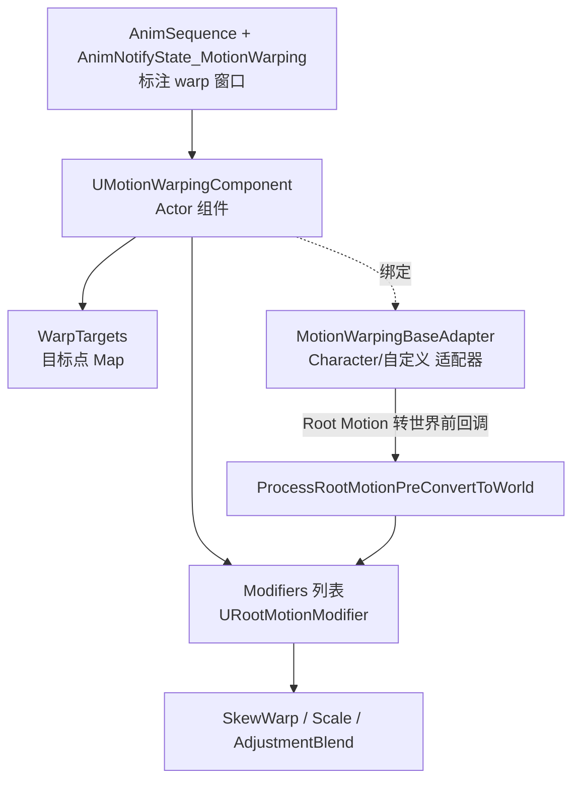
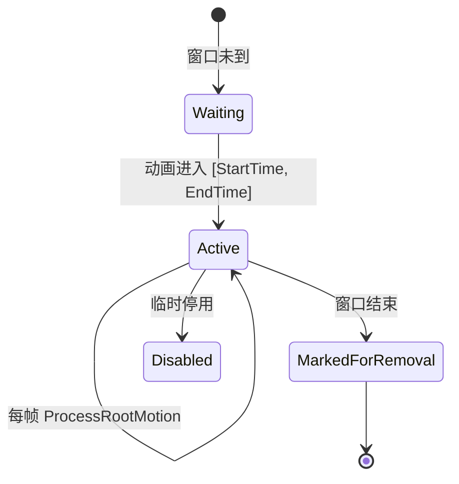

# Motion Warping 数学原理、UE5 实现、应用与对比

> 基于 UnrealEngine 5.5.4 源码
> 主插件路径：`Engine/Plugins/Animation/MotionWarping`（Root Motion 目标对齐）
> 相关插件：`Engine/Plugins/Animation/AnimationWarping`（程序化 Orientation/Stride/Slope 等）

---

## 目录

- [Motion Warping 数学原理、UE5 实现、应用与对比](#motion-warping-数学原理ue5-实现应用与对比)
  - [目录](#目录)
  - [第零部分 两类 Warping 的区分](#第零部分-两类-warping-的区分)
- [第一部分 Motion Warping 数学原理](#第一部分-motion-warping-数学原理)
  - [1.1 问题定义：Root Motion 对齐](#11-问题定义root-motion-对齐)
  - [1.2 平移 Warp：等比缩放（SimpleWarp）](#12-平移-warp等比缩放simplewarp)
  - [1.3 平移 Warp：斜切 + 缩放（SkewWarp）](#13-平移-warp斜切--缩放skewwarp)
    - [核心思想](#核心思想)
    - [数学推导](#数学推导)
  - [1.4 无位移时的"添加平移"](#14-无位移时的添加平移)
  - [1.5 旋转 Warp](#15-旋转-warp)
  - [1.6 程序化 Warping 的数学（Orientation / Stride）](#16-程序化-warping-的数学orientation--stride)
- [第二部分 UE5 中 Warping 的实现](#第二部分-ue5-中-warping-的实现)
  - [2.1 整体架构](#21-整体架构)
  - [2.2 MotionWarpingComponent：处理管线](#22-motionwarpingcomponent处理管线)
  - [2.3 RootMotionModifier：状态机与基类](#23-rootmotionmodifier状态机与基类)
  - [2.4 Warp Target 与 Notify 窗口](#24-warp-target-与-notify-窗口)
  - [2.5 SkewWarp 实现细节](#25-skewwarp-实现细节)
  - [2.6 WarpRotation 实现细节](#26-warprotation-实现细节)
  - [2.7 其他 Modifier](#27-其他-modifier)
  - [2.8 程序化 Animation Warping 节点](#28-程序化-animation-warping-节点)
- [第三部分 Motion Warping 的应用](#第三部分-motion-warping-的应用)
- [第四部分 Motion Warping vs Pose Search 对比](#第四部分-motion-warping-vs-pose-search-对比)
- [附录：数学与代码对照表](#附录数学与代码对照表)

---

## 第零部分 两类 Warping 的区分

UE5 里"Warping"实际上是**两套互补系统**，容易混淆：

| 系统 | 插件 | 作用对象 | 本质 | 典型场景 |
|------|------|---------|------|---------|
| **Motion Warping** | `MotionWarping` | **Root Motion**（根运动位移/旋转） | 缩放/斜切根运动，让角色**精确对齐**世界中的目标点 | 爬墙、跳跃落点、攀爬、处决对齐 |
| **Animation Warping** | `AnimationWarping` | **骨骼姿势**（Pose） | 程序化修改骨骼，补偿运动与动画的差异 | Orientation（转身）、Stride（步幅）、Slope（斜坡）、FootPlacement |

本文以 **Motion Warping（Root Motion 目标对齐）** 为主线讲数学原理与实现，并在 [1.6](#16-程序化-warping-的数学orientation--stride) 与 [2.8](#28-程序化-animation-warping-节点) 补充程序化 Animation Warping。

---

# 第一部分 Motion Warping 数学原理

## 1.1 问题定义：Root Motion 对齐

带 Root Motion 的动画（如一段"跳上 1m 高台"）在制作时锁定了**固定的位移曲线**。但游戏运行时目标（台子）的**实际位置/朝向**千变万化。Motion Warping 要解决的核心问题：

> 在一个**时间窗口** $[t_s, t_e]$ 内，动态地**缩放/扭曲**每帧的根运动增量 $\Delta$，使得窗口结束时角色根部**恰好落在目标变换** $T_{\text{target}}$ 上，同时尽量保留原动画的运动风格。

记号：

- $\Delta r_k$：第 $k$ 帧的**原始根运动位移增量**（动画烘焙值）。
- $R_{\text{total}} = \sum_{k} \Delta r_k$：窗口内**剩余**原始根运动总位移。
- $C$：角色**当前**根部世界位置。
- $P_{\text{target}}$：目标世界位置。
- 目标：找到每帧的**warp 后增量** $\Delta r_k'$，使 $C + \sum \Delta r_k' = P_{\text{target}}$。

## 1.2 平移 Warp：等比缩放（SimpleWarp）

最直观的方案（`UDEPRECATED_RootMotionModifier_SimpleWarp`，已弃用但数学最清晰）：把**剩余原始位移**按"目标距离 / 原始距离"整体缩放。

水平方向（2D）：

$$\text{scale}_{xy} = \frac{\|P_{\text{target}} - C\|_{2D}}{\|R_{\text{total}}\|_{2D}}, \qquad \Delta r_k' = \text{scale}_{xy}\cdot \|\Delta r_k\|_{2D}\cdot \hat{d}$$

其中 $\hat{d}$ 是"角色指向目标"的水平单位方向。源码对应：

```cpp
const float HorizontalDelta    = RootMotionDelta.GetTranslation().Size2D();      // ‖Δr_k‖₂D
const float HorizontalTarget   = FVector::Dist2D(CharacterTransform.GetLocation(), GetTargetLocation()); // 剩余目标距离
const float HorizontalOriginal = RootMotionTotal.GetTranslation().Size2D();      // ‖R_total‖₂D
const float HorizontalTranslationWarped = ((HorizontalDelta * HorizontalTarget) / HorizontalOriginal);
// 方向：角色本地空间下指向目标的水平方向
DeltaTranslation = MeshTransform.InverseTransformPositionNoScale(GetTargetLocation()).GetSafeNormal2D()
                   * HorizontalTranslationWarped;
```

垂直方向 $Z$ 独立同理缩放（`bIgnoreZAxis=false` 时）：

$$\Delta r_{k,z}' = \frac{P_{\text{target},z} - C_z}{R_{\text{total},z}}\cdot \Delta r_{k,z}$$

**局限**：SimpleWarp 只做**各向同性缩放 + 强制指向目标**，会破坏原动画在侧向、曲线上的细节（例如动画本身有个绕弧线的走位会被拉直）。这正是 SkewWarp 出现的原因。

## 1.3 平移 Warp：斜切 + 缩放（SkewWarp）

`URootMotionModifier_SkewWarp`（当前默认）用**仿射变换（缩放 + 斜切/Shear）**来 warp，能在把终点拉到目标的同时**保留侧向偏移的形状**。

### 核心思想

构造一个"同步空间（Sync Space）"，其 X 轴指向"当前 → 原始终点"方向 $\hat{u}_{\text{root}}$。在该空间里：

- **X 方向**（前进方向）：做缩放，把长度对齐到目标。
- **Y、Z 方向**（侧向/垂直）：通过**斜切**，让原始的侧向分量随前进量同步偏转，指向真实目标。

### 数学推导

设：
- $O_{\text{world}} = P_{\text{target}} - C$：当前指向目标的偏移。
- $O_{\text{root}} = (C + R_{\text{total}}) - C = R_{\text{total}}$：当前指向原始终点的偏移。

在 Sync Space（X 轴 = $\hat{O}_{\text{root}}$）下把两者变换，得到 $O^s_{\text{world}}$、$O^s_{\text{root}}$。

**(1) 前进缩放系数**——原始终点方向上，目标偏移的投影长度比：

$$\text{ProjectedScale} = \frac{O^s_{\text{world}}\cdot \hat{O}^s_{\text{root}}}{\|O^s_{\text{root}}\|}$$

```cpp
float ProjectedScale = FVector::DotProduct(CurrentToWorldSync, CurrentToRootMotionSyncNorm)
                       / CurrentToRootMotionSync.Size();
```

**(2) 斜切角（绕 Z 的偏航 Yaw、绕 Y 的俯仰 Pitch）**——目标方向相对原始方向在水平面/垂直面内的夹角：

$$\theta_{z} = \pm\arccos(\hat{O}^s_{\text{world},xy}\cdot \hat{O}^s_{\text{root},xy}), \qquad
\theta_{y} = \pm\arccos(\hat{O}^s_{\text{world},xz}\cdot \hat{O}^s_{\text{root},xz})$$

**(3) 组合仿射矩阵**——缩放矩阵 × 沿 Y 斜切 × 沿 Z 斜切：

$$M = S \cdot H_{y}(\theta_z) \cdot H_{z}(\theta_y)$$

$$S=\begin{bmatrix} s & 0 & 0\\ 0 & 1 & 0\\ 0 & 0 & 1\end{bmatrix},\;
H_{y}=\begin{bmatrix} 1 & \tan\theta_z & 0\\ 0 & 1 & 0\\ 0 & 0 & 1\end{bmatrix},\;
H_{z}=\begin{bmatrix} 1 & 0 & \tan\theta_y\\ 0 & 1 & 0\\ 0 & 0 & 1\end{bmatrix}$$

```cpp
FMatrix ScaleMatrix;        ScaleMatrix.SetAxis(0, FVector(ProjectedScale, 0, 0));
FMatrix ShearXAlongYMatrix; ShearXAlongYMatrix.SetAxis(0, FVector(1, FMath::Tan(AngleAboutZNorm), 0));
FMatrix ShearXAlongZMatrix; ShearXAlongZMatrix.SetAxis(0, FVector(1, 0, FMath::Tan(AngleAboutYNorm)));
FMatrix ScaledSkewMatrix = ScaleMatrix * ShearXAlongYMatrix * ShearXAlongZMatrix;
SkewedRootMotion = ScaledSkewMatrix.TransformVector(RootMotionInSyncSpace);
```

**(4) 变回世界空间**：$\Delta r_k' = R_{\text{sync}}\cdot M\cdot R_{\text{sync}}^{-1}\,\Delta r_k$。

直观理解：SkewWarp 把根运动放进"看向终点"的坐标系，**沿前进轴缩放**、**用斜切把侧向分量重新导向真实目标**，因此比 SimpleWarp 更好地保留了动画原有的曲线与侧移形状。

## 1.4 无位移时的"添加平移"

若动画在窗口内**几乎没有根位移**（`TotalRootMotionWithinWindow` 近似 0，例如一段原地攀爬），则无法"缩放不存在的位移"。此时改为**沿时间插值**直接生成位移：

$$\alpha = \text{Ease}\!\left(\frac{t - t_s}{t_e - t_s}\right), \qquad
L_{\text{next}} = \text{Lerp}(L_{\text{start}}, P_{\text{target}}, \alpha)$$

```cpp
float Alpha = FMath::Clamp((CurrentPosition - ActualStartTime) / (EndTime - ActualStartTime), 0.f, 1.f);
Alpha = FAlphaBlend::AlphaToBlendOption(Alpha, AddTranslationEasingFunc, AddTranslationEasingCurve);
const FVector NextLocation = FMath::Lerp(StartTransform.GetLocation(), TargetLocation, Alpha);
FVector FinalDeltaTranslation = (NextLocation - CurrentLocation);
```

`AddTranslationEasingFunc` 提供缓入缓出曲线（`EAlphaBlendOption`），让凭空添加的位移平滑。

## 1.5 旋转 Warp

`URootMotionModifier_Warp::WarpRotation` 用**球面线性插值（Slerp）**把当前朝向逐帧转向目标朝向。

设 $q_{\text{cur}}$ 当前朝向、$q_{\text{tgt}}$ 目标朝向、剩余时间 $T_{\text{rem}}=(t_e - t_{\text{prev}})\cdot m$（$m$ 为 `WarpRotationTimeMultiplier`）：

$$\alpha = \mathrm{clamp}\!\left(\frac{\Delta t}{T_{\text{rem}}},0,1\right), \qquad
q_{\text{frame}} = \mathrm{Slerp}(q_{\text{RMtotal}},\, q_{\text{tgt}},\, \alpha)$$

最终输出的每帧旋转增量：

$$\Delta q' = \big(q_{\text{frame}}\cdot q_{\text{RMtotal}}^{-1}\big)\cdot \Delta q_{\text{RM}}$$

```cpp
const float TimeRemaining = (EndTime - PreviousPosition) * WarpRotationTimeMultiplier;
const float Alpha = FMath::Clamp(DeltaSeconds / TimeRemaining, 0.f, 1.f);
FQuat TargetRotThisFrame = FQuat::Slerp(TotalRootMotionRotation, TargetRotation, Alpha);
// ...（ConstantRate / ClampedRate 时按 WarpMaxRotationRate 限速）
const FQuat DeltaOut = TargetRotThisFrame * TotalRootMotionRotation.Inverse();
return (DeltaOut * RootMotionDelta.GetRotation());
```

三种旋转方式（`EMotionWarpRotationMethod`）：

- **Slerp**：纯球面插值。
- **SlerpWithClampedRate**：Slerp 但每帧角度不超过 `WarpMaxRotationRate·Δt`。
- **ConstantRate**：恒定角速度旋转。

`RotationType` 有 `Default`（匹配目标朝向）与 `Facing`（始终面向目标点，用 `MakeFromXZ(ToSyncPoint, Up)` 构造）。

## 1.6 程序化 Warping 的数学（Orientation / Stride）

`AnimationWarping` 插件对**骨骼**做程序化修正，不改 Root Motion。

**Orientation Warping**（转身对齐）：让下半身转向真实移动方向、上半身仍看向前方。核心是求**根运动方向**与**期望移动方向**之间的有符号夹角：

$$\theta_{\text{orient}} = \angle\big(\hat{d}_{\text{rootmotion}},\, \hat{d}_{\text{locomotion}}\big)$$

```cpp
TargetOrientationAngleRad =
    UE::Anim::SignedAngleRadBetweenNormals(RootMotionDeltaDirection, LocomotionForward, RotationAxisVector);
```

再把该旋转以 `DistributedBoneOrientationAlpha` 分配到脊椎/下半身，并用 `RotationInterpSpeed` 做插值平滑，避免突变（如"走 A 键但动画是向前走"时，让角色斜着走而非滑步）。

**Stride Warping**（步幅缩放）：按"期望速度 / 根运动速度"缩放脚的迈步幅度，用 IK 把脚重定位，避免脚底打滑（foot sliding）：

$$\text{StrideScale} = \frac{v_{\text{locomotion}}}{v_{\text{rootmotion}}}$$

---

# 第二部分 UE5 中 Warping 的实现

## 2.1 整体架构



关键文件：

| 文件 | 职责 |
|------|------|
| `Public/MotionWarpingComponent.h` | `UMotionWarpingComponent`：管理 targets 与 modifiers、驱动管线 |
| `Public/RootMotionModifier.h` | `URootMotionModifier` 基类、`URootMotionModifier_Warp`、`FMotionWarpingTarget` |
| `Public/RootMotionModifier_SkewWarp.h` | SkewWarp（默认平移 warp） |
| `Public/RootMotionModifier_AdjustmentBlendWarp.h` | 调整混合 warp（含 IK 骨骼） |
| `Public/AnimNotifyState_MotionWarping.h` | 定义 warp 窗口的 Notify State |
| `Public/MotionWarpingAdapter.h` / `MotionWarpingCharacterAdapter.h` | 适配层（5.5 解耦 Character，支持任意 Actor） |

## 2.2 MotionWarpingComponent：处理管线

核心入口 `ProcessRootMotionPreConvertToWorld`（`MotionWarpingComponent.cpp`）——在**根运动从本地空间转到世界空间之前**被回调：

```cpp
FTransform UMotionWarpingComponent::ProcessRootMotionPreConvertToWorld(
    const FTransform& InRootMotion, float DeltaSeconds, const FMotionWarpingUpdateContext* InContext)
{
    // 1. 根据动画播放位置检查/更新 warp 窗口，激活或移除 modifier
    UpdateWithContext(*InContext, DeltaSeconds);

    // 2. 依次让每个处于 Active 的 modifier 处理根运动
    FTransform FinalRootMotion = InRootMotion;
    for (URootMotionModifier* Modifier : Modifiers)
    {
        if (Modifier->GetState() == ERootMotionModifierState::Active)
        {
            FinalRootMotion = Modifier->ProcessRootMotion(FinalRootMotion, DeltaSeconds);
        }
    }
    return FinalRootMotion;
}
```

要点：

- warp 发生在**本地根运动空间**，之后才由移动组件转世界并驱动胶囊体。
- 多个 modifier **链式**处理（前一个的输出是后一个的输入）。
- 5.5 通过 `MotionWarpingBaseAdapter` 解耦，不再局限于 `ACharacter`，任意 Actor（含自定义移动）都可接入。

## 2.3 RootMotionModifier：状态机与基类

每个 modifier 是一个状态机（`ERootMotionModifierState`）：



基类 `URootMotionModifier` 关键字段与接口：

```cpp
float StartTime, EndTime;              // warp 窗口
float PreviousPosition, CurrentPosition; // 动画播放位置
FTransform StartTransform;             // 激活瞬间角色变换
FTransform TotalRootMotionWithinWindow;// 窗口内总根运动（判断有无位移）
virtual FTransform ProcessRootMotion(const FTransform& InRootMotion, float DeltaSeconds); // 核心 warp
```

`URootMotionModifier_Warp` 在其上增加目标解析（`WarpTargetName`、`CachedTargetTransform`）、平移/旋转开关、旋转方式等，并实现通用的 `WarpRotation`。

## 2.4 Warp Target 与 Notify 窗口

**Warp Target**（`FMotionWarpingTarget`）表示世界中的一个对齐点：

- 可来自**静态变换**、**场景组件 + 骨骼**（`bFollowComponent` 时每帧跟随），带位置/旋转偏移。
- 通过 `UMotionWarpingComponent::AddOrUpdateWarpTarget` 由游戏逻辑按名字注册。

**Notify 窗口**（`UAnimNotifyState_MotionWarping`）在动画时间轴上标出 `[StartTime, EndTime]`，并指定使用哪种 `RootMotionModifier` 及其 `WarpTargetName`。运行时动画播放进入该窗口 → 组件创建对应 modifier → 激活 warp。

**Warp Point 来源**（`EWarpPointAnimProvider`）：`None` / `Static`（Notify 里硬编码变换）/ `Bone`（动画里某骨骼），用于把"动画作者预期的对齐点"与"世界目标"对应起来。

## 2.5 SkewWarp 实现细节

`ProcessRootMotion`（`RootMotionModifier_SkewWarp.cpp`）流程：

1. 用 `ExtractRootMotionFromAnimation` 抽取三段根运动：
   - `RootMotionTotal`：`[PreviousPosition, EndTime]` 剩余总量。
   - `RootMotionDelta`：`[PreviousPosition, min(CurrentPosition, EndTime)]` 本帧量。
   - `ExtraRootMotion`：若 `CurrentPosition > EndTime`，窗口结束后的溢出量（原样叠加，不 warp）。
2. 求目标位置 `TargetLocation`（`bIgnoreZAxis` 时保持角色当前 Z）。
3. **有位移**：调 `WarpTranslation`（[1.3](#13-平移-warp斜切--缩放skewwarp) 的斜切缩放）。
4. **无位移**：走 [1.4](#14-无位移时的添加平移) 的时间插值添加平移。
5. `bWarpRotation` 时叠加 `WarpRotation` 的旋转增量。

注意目标点会先被变换到**网格本地空间**再参与计算：`TargetLocation = MeshTransform.InverseTransformPositionNoScale(TargetLocation)`，以匹配根运动所在空间。

## 2.6 WarpRotation 实现细节

见 [1.5](#15-旋转-warp)。补充要点：

- 当前朝向包含**网格可视旋转偏移** `GetBaseVisualRotationOffset()`（角色胶囊与网格朝向差，通常 -90°）。
- `ConstantRate` / `ClampedRate` 通过 `AngularDistance` 计算角差，用 `WarpMaxRotationRate·Δt` 限速，防止瞬间大角度旋转导致穿插。
- 输出的是**每帧旋转增量**，叠加回原始 `RootMotionDelta.GetRotation()`。

## 2.7 其他 Modifier

| Modifier | 作用 |
|----------|------|
| `URootMotionModifier_SkewWarp` | 默认平移 warp（斜切+缩放） + 旋转 warp |
| `UDEPRECATED_..._SimpleWarp` | 旧版等比缩放 warp（保留作参考） |
| `URootMotionModifier_Scale` | 纯按 `FVector Scale` 缩放平移（不涉及目标） |
| `URootMotionModifier_AdjustmentBlendWarp` | 结合调整混合，可额外 warp IK 骨骼（`bWarpIKBones`），处理更复杂的对齐 |

## 2.8 程序化 Animation Warping 节点

`AnimationWarping` 插件提供一组 `FAnimNode_SkeletalControlBase` 骨骼控制节点（在 AnimGraph 中使用）：

| 节点 | 功能 | 关键输入 |
|------|------|---------|
| `FAnimNode_OrientationWarping` | 下半身转向移动方向、上半身保持朝向 | `LocomotionDirection` / `LocomotionAngle`、`SpineBones`、`DistributedBoneOrientationAlpha` |
| `FAnimNode_StrideWarping` | 缩放步幅、IK 重定位脚以消除滑步 | `StrideScale` 或 `LocomotionSpeed`、Foot/Thigh/Pelvis 定义 |
| `FAnimNode_SlopeWarping` | 让脚贴合斜坡/台阶 | 地面法线、IK 脚 |
| `FAnimNode_FootPlacement` | 脚步落点 IK 修正 | 足骨、地面 trace |
| `FAnimNode_Steering` | 转向预测辅助 | 目标朝向 |
| `FAnimNode_OffsetRootBone` / `OverrideRootMotion` | 根骨偏移/覆盖，配合上面各节点 | — |

这些节点常与 Motion Matching + Motion Warping **组合使用**：Motion Matching 选片段 → Motion Warping 对齐落点 → Orientation/Stride/FootPlacement 精修姿势与脚步。

---

# 第三部分 Motion Warping 的应用

**目标对齐类（Root Motion Motion Warping）：**

1. **攀爬 / 翻越（Mantle / Vault）**：一段翻越动画对齐到不同高度/距离的边缘。目标 = 边缘变换；用 SkewWarp 缩放位移、旋转对齐面向墙面。
2. **跳跃落点对齐**：跳跃动画精确落到平台/缝隙对面，避免落空或穿插。
3. **处决 / 终结技（Finisher）**：攻击者与受击者的相对位置千差万别，用 Warp 把攻击动画对齐到受害者位置与朝向，保证接触点吻合。
4. **交互对齐**：开门、按按钮、翻窗、拾取——把交互动画的手/根对齐到交互物体的插槽。
5. **攀岩 / 攀墙点到点移动**：在墙面锚点之间移动时对齐到下一个抓握点。
6. **精确停步 / 转向到标记点**：让角色走到并停在指定标记，朝向指定方向。

**程序化姿势类（Animation Warping）：**

7. **八向移动转身自然化**：Orientation Warping 让"按侧向键但只有前进动画"时角色斜身移动，而非脚步打滑。
8. **变速消除滑步**：Stride Warping 按实际速度缩放步幅，配合 IK 让脚不打滑。
9. **地形适配**：Slope / FootPlacement 让脚贴合斜坡与台阶。

**组合管线（现代 UE5 角色）：**


---

# 第四部分 Motion Warping vs Pose Search 对比

两者常被一起讨论，但解决的是**完全不同的问题**，且**互补**而非替代。

| 维度 | **Pose Search / Motion Matching** | **Motion Warping** |
|------|-----------------------------------|--------------------|
| 解决的问题 | **选哪个动画**（从动作库检索最匹配的姿势/片段） | **改这个动画**（让已选动画精确对齐世界目标） |
| 本质 | 高维特征空间的**最近邻搜索** | 根运动的**几何仿射变换**（缩放/斜切/Slerp） |
| 核心数学 | 加权马氏距离、PCA、KD/VP-Tree kNN | 缩放/斜切矩阵、四元数 Slerp、线性插值 |
| 输入 | 当前姿势 + 未来轨迹 → 查询向量 | 当前变换 + 目标变换 + 根运动 |
| 输出 | 命中的 `PoseIdx` / 动画时间 | warp 后的每帧 Root Motion 增量 |
| 作用时机 | 每 N 帧做一次搜索决策 | 每帧在根运动转世界前修正 |
| 作用对象 | 动画选择（宏观） | 根运动/位移（微观对齐） |
| 数据准备 | 需离线烘焙特征数据库（`FSearchIndex`） | 无需烘焙，只需 Notify 窗口 + Warp Target |
| 精度保证 | 近似匹配，不保证精确落点 | **保证**窗口结束时精确到达目标 |
| 典型开销 | 搜索（KD-Tree/暴力）+ 内存索引 | 每帧少量矩阵/四元数运算，开销极小 |
| 失败风险 | 库不够丰富时匹配生硬 | 目标与动画差异过大时出现拉伸/滑步失真 |
| 插件 | `PoseSearch` | `MotionWarping` |

**关系与协作：**

- **Pose Search 负责"选"**：根据玩家意图与当前状态，从海量动画中检索出**最接近**的一段（例如"一个大致朝目标方向的翻越动画"）。它是**近似**的——库里不可能对每个目标距离都存一段。
- **Motion Warping 负责"对齐"**：把这段近似匹配的动画**精确**扭曲到真实目标（例如把翻越终点对齐到实际墙沿）。它是**精确**的，但会引入几何失真，失真大小取决于"选得有多准"。
- 因此 **Pose Search 越准，Motion Warping 需要 warp 的量越小，失真越低** —— 二者形成"粗选 + 精调"的黄金搭档。

**一句话总结：**

> Pose Search 回答"**播哪段动画**"，Motion Warping 回答"**如何把这段动画贴到世界里的精确位置**"。前者是搜索问题，后者是几何变换问题；前者近似、后者精确；实践中先搜后 warp，配合程序化 Animation Warping 精修姿势。

---

# 附录：数学与代码对照表

| 数学概念 | 公式 | UE5 对应实现 |
|----------|------|--------------|
| 等比缩放 warp | $\text{scale}=\dfrac{\|P_{tgt}-C\|}{\|R_{total}\|}$ | `SimpleWarp::ProcessRootMotion` |
| Sync Space 前进缩放 | $s=\dfrac{O^s_{world}\cdot\hat O^s_{root}}{\|O^s_{root}\|}$ | `ProjectedScale`（`SkewWarp::WarpTranslation`） |
| 斜切角 | $\theta=\pm\arccos(\hat a\cdot\hat b)$ | `AngleAboutZNorm` / `AngleAboutYNorm` |
| 仿射 warp 矩阵 | $M=S\,H_y(\theta_z)\,H_z(\theta_y)$ | `ScaledSkewMatrix = ScaleMatrix * ShearXAlongYMatrix * ShearXAlongZMatrix` |
| 添加平移插值 | $L=\text{Lerp}(L_s,P_{tgt},\text{Ease}(\alpha))$ | `FMath::Lerp` + `FAlphaBlend::AlphaToBlendOption` |
| 旋转 Slerp | $q=\text{Slerp}(q_{RM},q_{tgt},\alpha)$ | `FQuat::Slerp`（`WarpRotation`） |
| 恒速/限速旋转 | $\Delta\theta\le r\cdot\Delta t$ | `WarpMaxRotationRate` + `AngularDistance` |
| Orientation 角 | $\theta=\angle(\hat d_{RM},\hat d_{loco})$ | `SignedAngleRadBetweenNormals` |
| Stride 缩放 | $\text{StrideScale}=\dfrac{v_{loco}}{v_{RM}}$ | `FAnimNode_StrideWarping` |
| 处理管线 | — | `MotionWarpingComponent::ProcessRootMotionPreConvertToWorld` |
| Modifier 状态机 | — | `ERootMotionModifierState` |

---

*本文档基于 UnrealEngine 5.5.4 源码分析整理，代码引用来自 `Engine/Plugins/Animation/MotionWarping` 与 `Engine/Plugins/Animation/AnimationWarping`。与 Pose Search 的对比参见同目录 `AnimationPoseSearch.md`。*
