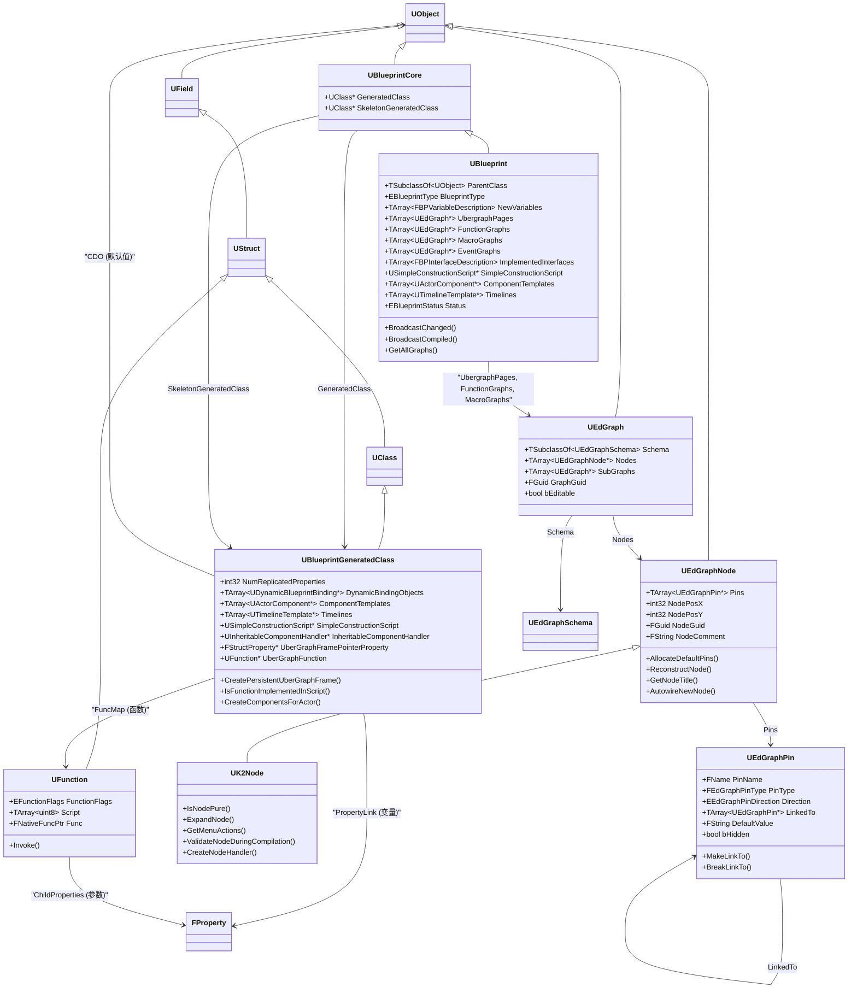

# UE5 蓝图系统原理与设计

> 本文档基于 UE5 引擎源代码（分支 5.5）编写，深入解析蓝图系统的核心架构和设计原理。蓝图系统是建立在 UObject/反射系统之上的**可视化脚本系统**，它允许开发者通过节点图（Graph）来定义类型、编写逻辑，而无需编写 C++ 代码。

---

## 目录

1. [蓝图系统如何建立在 UObject 之上](#1-蓝图系统如何建立在-uobject-之上)
2. [蓝图核心类型与类图](#2-蓝图核心类型与类图)
3. [蓝图的继承实现](#3-蓝图的继承实现)
4. [蓝图的编译](#4-蓝图的编译)
5. [蓝图的执行（虚拟机）](#5-蓝图的执行虚拟机)
6. [蓝图的持久化与加载](#6-蓝图的持久化与加载)
7. [蓝图编辑器](#7-蓝图编辑器)

---

## 1. 蓝图系统如何建立在 UObject 之上

### 1.1 三层架构

蓝图系统的设计可以理解为三个层次：

```
┌──────────────────────────────────────────────────────────────┐
│                    蓝图编辑器层 (Editor)                       │
│  UEdGraph / UEdGraphNode / UEdGraphPin / UK2Node / Schema    │
│  提供可视化的节点图编辑界面，用户拖拽连线定义逻辑                │
├──────────────────────────────────────────────────────────────┤
│                    蓝图资产层 (Asset)                          │
│  UBlueprint / UBlueprintCore                                 │
│  存储蓝图的数据：变量定义、图、函数签名、接口实现等              │
├──────────────────────────────────────────────────────────────┤
│                    运行时类层 (Runtime)                        │
│  UBlueprintGeneratedClass / UClass / UFunction / FProperty   │
│  编译产物：继承自 UClass，包含编译后的字节码和属性              │
│  这些是 UObject 反射系统的一等公民，完全参与 GC、序列化等        │
└──────────────────────────────────────────────────────────────┘
```

### 1.2 建立在反射系统之上

蓝图系统并非另起炉灶——它的编译产物 `UBlueprintGeneratedClass` **直接继承自 `UClass`**，编译后的蓝图函数就是 `UFunction` 对象，蓝图变量就是 `FProperty` 对象。这意味着：

1. **运行时代码是标准 UObject 反射数据**：蓝图编译后的字节码存储在 `UFunction::Script` 数组中，属性信息存储在 `FProperty` 链表中。蓝图类就是 UClass，参与所有 UObject 标准流程。

2. **蓝图调用 = UFunction::Invoke**：当蓝图函数被调用时，走的是与 C++ UFUNCTION 完全相同的路径——`UObject::ProcessEvent()` → `UFunction::Invoke()`。唯一的区别是 C++ 函数执行 `FNativeFuncPtr`（Thunk），而蓝图函数执行字节码解释器。

3. **蓝图变量 = FProperty**：蓝图中定义的每个变量在编译后都成为 `FProperty` 子对象，挂在 `UBlueprintGeneratedClass` 上。编辑器访问蓝图变量、序列化蓝图实例、GC 追踪蓝图引用——全部通过标准的 `FProperty` API。

4. **CDO 机制复用**：蓝图类的 CDO（`UClass::ClassDefaultObject`）存储所有蓝图变量的默认值。实例化时通过 delta 序列化从 CDO 复制属性，这与 C++ 类完全相同。

```
用户编写的蓝图图 (UEdGraph)
        │
        ▼  [FKismetCompilerContext 编译]
        │
UBlueprintGeneratedClass (继承 UClass)
  ├── UFunction* (函数, Script[] 存储字节码)
  ├── FProperty* (变量, 标准反射属性)
  └── CDO (UObject*, 存储默认值)
        │
        ▼  [运行时]
UObject::ProcessEvent() → UFunction::Invoke() → FFrame (字节码解释器)
```

### 1.3 关键继承关系

```
UObject
 ├── UField
 │    └── UStruct
 │         ├── UClass  ← UBlueprintGeneratedClass 继承自这里！
 │         │    └── UBlueprintGeneratedClass   ← 蓝图编译产物
 │         ├── UFunction  ← 蓝图函数就是 UFunction
 │         └── UScriptStruct
 ├── UBlueprintCore
 │    └── UBlueprint  ← 蓝图资产（编辑器数据）
 └── UEdGraph / UEdGraphNode / UEdGraphPin  ← 可视化图（编辑器数据）
```

**`UBlueprintGeneratedClass` 同时是 `UClass`**，这意味着蓝图类：
- 有 CDO（通过 `UClass::ClassDefaultObject`）
- 参与 GC 引用追踪（通过 `FProperty` 链表的 ReferenceSchema）
- 可以被序列化（通过 `UObject::Serialize` + `FProperty::SerializeItem`）
- 可以被 `Cast<>()`、`IsChildOf()` 等反射 API 操作
- 可以参与网络复制（通过 `FProperty::NetSerializeItem`）

---

## 2. 蓝图核心类型与类图

### 2.1 类型总览

```
┌──────────────────────────────────────────────────────────────────┐
│                        蓝图资产层                                 │
│                                                                  │
│  UBlueprintCore                                                  │
│  ├── GeneratedClass (UClass*)          编译生成的类               │
│  └── SkeletonGeneratedClass (UClass*)  骨架类（编辑器快速预览）    │
│                                                                  │
│  UBlueprint : UBlueprintCore                                    │
│  ├── ParentClass (TSubclassOf<UObject>) 父类                     │
│  ├── BlueprintType (EBlueprintType)     蓝图类型                  │
│  ├── NewVariables (TArray<FBPVariableDescription>) 新变量         │
│  ├── UbergraphPages (TArray<UEdGraph*>) 事件图                    │
│  ├── FunctionGraphs (TArray<UEdGraph*>) 函数图                    │
│  ├── MacroGraphs (TArray<UEdGraph*>)    宏图                      │
│  ├── ImplementedInterfaces             实现的接口                  │
│  ├── SimpleConstructionScript          简单构造脚本（组件）        │
│  ├── ComponentTemplates                组件模板                   │
│  └── Timelines                         时间轴模板                 │
├──────────────────────────────────────────────────────────────────┤
│                        运行时类层                                 │
│                                                                  │
│  UBlueprintGeneratedClass : UClass                              │
│  ├── NumReplicatedProperties            网络复制属性数量          │
│  ├── DynamicBindingObjects              动态绑定对象             │
│  ├── ComponentTemplates                 组件模板（运行时）        │
│  ├── Timelines                          时间轴模板（运行时）      │
│  ├── SimpleConstructionScript           构造脚本（运行时）        │
│  ├── UberGraphFunction                  UberGraph 函数指针       │
│  ├── UberGraphFramePointerProperty      UberGraph Frame 属性     │
│  ├── CookedComponentInstancingData      熟化组件实例化数据        │
│  └── [继承自 UClass 的所有成员]          CDO, FuncMap, 属性链表等  │
├──────────────────────────────────────────────────────────────────┤
│                        图编辑器层                                 │
│                                                                  │
│  UEdGraph                                                       │
│  ├── Schema (UEdGraphSchema*)           图的模式/规则             │
│  ├── Nodes (TArray<UEdGraphNode*>)      图中所有节点              │
│  └── SubGraphs (TArray<UEdGraph*>)      子图                     │
│                                                                  │
│  UEdGraphNode                                                   │
│  ├── Pins (TArray<UEdGraphPin*>)        节点的引脚                │
│  ├── NodePosX/NodePosY                  节点在编辑器中的位置       │
│  └── NodeGuid (FGuid)                   节点唯一标识              │
│                                                                  │
│  UK2Node : UEdGraphNode  ← 蓝图节点的基类                        │
│                                                                  │
│  UEdGraphPin                                                    │
│  ├── PinName (FName)                    引脚名称                 │
│  ├── Direction (EEdGraphPinDirection)   方向（输入/输出）          │
│  ├── PinType (FEdGraphPinType)          引脚类型信息              │
│  └── LinkedTo (TArray<UEdGraphPin*>)    连接的引脚                │
└──────────────────────────────────────────────────────────────────┘
```

### 2.2 UBlueprint —— 蓝图资产

**文件位置**：[Engine/Classes/Engine/Blueprint.h](f:\GitHub\UnrealEngine\Engine\Source\Runtime\Engine\Classes\Engine\Blueprint.h)

`UBlueprint` 是蓝图资产的"数据容器"，存储了用户在图编辑器中创建的所有内容。它本身不直接参与运行时逻辑——运行时代码由 `UBlueprintGeneratedClass` 承载。

**关键成员变量：**

| 成员 | 类型 | 说明 |
|------|------|------|
| `ParentClass` | `TSubclassOf<UObject>` | 父类。生成的 `UBlueprintGeneratedClass` 将继承自此类 |
| `BlueprintType` | `EBlueprintType` | 蓝图类型：`BPTYPE_Normal`（普通蓝图类）、`BPTYPE_MacroLibrary`（宏库）、`BPTYPE_Interface`（蓝图接口）、`BPTYPE_LevelScript`（关卡蓝图）、`BPTYPE_FunctionLibrary`（函数库） |
| `BlueprintSystemVersion` | `int32` | 创建此蓝图时使用的蓝图系统版本 |
| `NewVariables` | `TArray<FBPVariableDescription>` | **仅编辑器**：蓝图定义的新变量列表。每个 `FBPVariableDescription` 包含 `VarName`、`VarGuid`、`VarType`（FEdGraphPinType）、`PropertyFlags`、`DefaultValue`、`MetaDataArray` |
| `UbergraphPages` | `TArray<UEdGraph*>` | **仅编辑器**：事件图（包含 BeginPlay、Tick 等事件节点） |
| `FunctionGraphs` | `TArray<UEdGraph*>` | **仅编辑器**：函数图列表 |
| `MacroGraphs` | `TArray<UEdGraph*>` | **仅编辑器**：宏图列表 |
| `DelegateSignatureGraphs` | `TArray<UEdGraph*>` | **仅编辑器**：委托签名图 |
| `EventGraphs` | `TArray<UEdGraph*>` | **仅编辑器**：编译过程中实际使用的事件图 |
| `ImplementedInterfaces` | `TArray<FBPInterfaceDescription>` | **仅编辑器**：实现的接口列表 |
| `SimpleConstructionScript` | `USimpleConstructionScript*` | 简单构造脚本（定义组件层级） |
| `ComponentTemplates` | `TArray<UActorComponent*>` | 组件模板对象数组 |
| `Timelines` | `TArray<UTimelineTemplate*>` | 时间轴模板数组 |
| `Status` | `EBlueprintStatus` | 蓝图编译状态：`BS_UpToDate`（最新）、`BS_Dirty`（已修改未编译）、`BS_Error`（编译失败）、`BS_UpToDateWithWarnings`（有警告） |
| `bRecompileOnLoad` | `bool` | 是否在加载时重新编译 |

`UBlueprintCore`（父类）持有两个关键指针：
- `GeneratedClass` — 指向编译生成的 `UBlueprintGeneratedClass`
- `SkeletonGeneratedClass` — 指向"骨架类"（仅编辑器，用于快速类型解析而不需要完整编译）

**关键成员函数：**

| 函数 | 说明 |
|------|------|
| `GetAllGraphs(TArray<UEdGraph*>&)` | 收集蓝图中的所有图 |
| `BroadcastChanged()` | 广播蓝图已更改事件，触发编辑器 UI 刷新 |
| `BroadcastCompiled()` | 广播蓝图已编译事件 |
| `OnChanged()` / `OnCompiled()` | 返回变更/编译事件的委托 |
| `GetBlueprintClass()` | 返回 `GeneratedClass` |

### 2.3 UBlueprintGeneratedClass —— 蓝图编译产物

**文件位置**：[Engine/Classes/Engine/BlueprintGeneratedClass.h](f:\GitHub\UnrealEngine\Engine\Source\Runtime\Engine\Classes\Engine\BlueprintGeneratedClass.h)

`UBlueprintGeneratedClass` 继承自 `UClass`，是蓝图编译的真正产物。蓝图的所有图在编译后转化为 `UFunction`（函数）和 `FProperty`（变量），全部存储在此类中。

**设计哲学**：`UBlueprintGeneratedClass` **就是** UClass。唯一的区别是它不是通过 C++ 编译产生的，而是通过蓝图编译器（`FKismetCompilerContext`）从 `UEdGraph` 节点图翻译而来。

**关键成员变量（继承自 UClass 之外）：**

| 成员 | 类型 | 说明 |
|------|------|------|
| `NumReplicatedProperties` | `int32` | 网络复制属性数量 |
| `DynamicBindingObjects` | `TArray<UDynamicBlueprintBinding*>` | 动态绑定对象（如事件委托绑定） |
| `ComponentTemplates` | `TArray<UActorComponent*>` | 组件模板（运行时实例化用） |
| `Timelines` | `TArray<UTimelineTemplate*>` | 时间轴模板（运行时用） |
| `SimpleConstructionScript` | `USimpleConstructionScript*` | 简单构造脚本（运行时用） |
| `InheritableComponentHandler` | `UInheritableComponentHandler*` | 可继承的组件处理器 |
| `UberGraphFramePointerProperty` | `FStructProperty*` | UberGraph 帧指针属性 |
| `UberGraphFunction` | `UFunction*` | UberGraph 函数指针 |
| `CookedComponentInstancingData` | `TMap<FName, FBlueprintCookedComponentInstancingData>` | 熟化组件实例化数据（运行时优化） |
| `PropertyGuids` | `TMap<FName, FGuid>` | **仅编辑器**：属性 GUID 映射 |
| `CookedPropertyGuids` | `TMap<FName, FGuid>` | 熟化后属性 GUID 映射 |

**关键成员函数：**

| 函数 | 说明 |
|------|------|
| `Serialize(FArchive&)` | 序列化蓝图类的编译数据 |
| `PostLoad()` | 加载后初始化，触发编译回退逻辑 |
| `Link(FArchive&, bool)` | 链接属性，处理 UberGraph Frame |
| `PurgeClass(bool)` | 清除类数据（重新编译前） |
| `Bind()` | 绑定蓝图类到其父类 |
| `CreatePersistentUberGraphFrame(UObject*, ...)` | 创建持久化 UberGraph 帧 |
| `DestroyPersistentUberGraphFrame(UObject*, ...)` | 销毁持久化 UberGraph 帧 |
| `GetPersistentUberGraphFrame(UObject*, UFunction*)` | 获取持久化 UberGraph 帧指针 |
| `IsFunctionImplementedInScript(FName)` | 检查函数是否在蓝图中实现 |
| `CreateComponentsForActor(const UClass*, AActor*)` | 为该类实例创建组件 |
| `ForEachGeneratedClassInHierarchy(...)` | 遍历蓝图类继承链 |
| `FindComponentTemplateByName(FName)` | 按名称查找组件模板 |
| `GetGeneratedClassesHierarchy(...)` | 静态方法：获取蓝图类的完整继承链 |

### 2.4 UEdGraph / UEdGraphNode / UEdGraphPin —— 图编辑器核心

#### UEdGraph（图）

**文件位置**：[Engine/Classes/EdGraph/EdGraph.h](f:\GitHub\UnrealEngine\Engine\Source\Runtime\Engine\Classes\EdGraph\EdGraph.h)

图是节点和连线的容器，代表蓝图中的一个"页面"（事件图、函数图、宏图等）。

| 成员 | 类型 | 说明 |
|------|------|------|
| `Schema` | `TSubclassOf<UEdGraphSchema>` | 图的模式类，定义了图的规则（哪些节点可以连接等） |
| `Nodes` | `TArray<UEdGraphNode*>` | 图中所有节点 |
| `SubGraphs` | `TArray<UEdGraph*>` | 子图（如 collapsed graph） |
| `GraphGuid` | `FGuid` | 图的全局唯一标识 |
| `bEditable` | `bool` | 是否可编辑 |
| `bAllowDeletion` | `bool` | 是否可删除 |

**关键函数**：`AddNode()`、`RemoveNode()`、`CreateIntermediateNode<T>()`（用于编译期间创建中间节点）、`NotifyGraphChanged()`、`GetNodesOfClass<T>()`。

#### UEdGraphNode（节点）

**文件位置**：[Engine/Classes/EdGraph/EdGraphNode.h](f:\GitHub\UnrealEngine\Engine\Source\Runtime\Engine\Classes\EdGraph\EdGraphNode.h)

节点是图中的单个元素——函数调用、变量获取、分支、循环等。

| 成员 | 类型 | 说明 |
|------|------|------|
| `Pins` | `TArray<UEdGraphPin*>` | 节点的所有引脚 |
| `NodePosX` / `NodePosY` | `int32` | 节点在编辑器画布上的位置 |
| `NodeWidth` / `NodeHeight` | `int32` | 节点尺寸 |
| `NodeGuid` | `FGuid` | 节点唯一标识 |
| `NodeComment` | `FString` | 节点注释 |
| `ErrorType` | `int32` | 错误类型 |
| `ErrorMsg` | `FString` | 错误消息 |
| `bIsNodeEnabled` | `bool` | 节点是否启用（禁用时编译为 NOP） |
| `bIsIntermediateNode` | `bool` | 是否为编译期间创建的中间节点（非用户可见） |

**关键成员函数：** `AllocateDefaultPins()`（创建默认引脚）、`ReconstructNode()`（重建节点）、`GetNodeTitle()`、`AutowireNewNode()`、`PostPlacedNewNode()`、`PinConnectionListChanged()`、`CreatePin()`。

#### UEdGraphPin（引脚）

**文件位置**：[Engine/Classes/EdGraph/EdGraphPin.h](f:\GitHub\UnrealEngine\Engine\Source\Runtime\Engine\Classes\EdGraph\EdGraphPin.h)

引脚是节点上的连接点——数据流入/流出的端口。**注意：UEdGraphPin 不是 UObject**，而是一个由 `TArray` 管理的普通 C++ 类。

| 成员 | 类型 | 说明 |
|------|------|------|
| `PinName` | `FName` | 引脚名称 |
| `PinType` | `FEdGraphPinType` | 引脚类型信息（类别、子类别、容器类型等） |
| `Direction` | `EEdGraphPinDirection` | 方向：`EGPD_Input`（输入）或 `EGPD_Output`（输出） |
| `LinkedTo` | `TArray<UEdGraphPin*>` | 连接到此引脚的其他引脚 |
| `DefaultValue` | `FString` | 默认值（字符串形式） |
| `DefaultObject` | `UObject*` | 默认对象引用 |
| `ParentPin` | `UEdGraphPin*` | 父引脚（用于分拆引脚，如 Vector → X/Y/Z） |
| `SubPins` | `TArray<UEdGraphPin*>` | 子引脚列表 |
| `bHidden` | `bool` | 是否隐藏 |

**关键函数：** `MakeLinkTo()`、`BreakLinkTo()`、`BreakAllPinLinks()`、`CreatePin()`（静态工厂）。

#### FEdGraphPinType —— 引脚类型描述

```cpp
struct FEdGraphPinType {
    FName PinCategory;               // 主类别："exec", "int", "float", "object", "struct", "class", ...
    FName PinSubCategory;            // 子类别：具体类型名
    UObject* PinSubCategoryObject;   // 子类别对象（如 UClass* 或 UScriptStruct*）
    FEdGraphTerminalType PinValueType; // 容器元素终端类型
    EPinContainerType ContainerType; // 容器类型：None, Array, Set, Map
    bool bIsReference;               // 是否引用
    bool bIsConst;                   // 是否 const
    bool bIsWeakPointer;             // 是否弱指针
};
```

其中，`PinCategory` 的关键值包括：
- `"exec"` — 执行引脚（白色连线，控制流）
- `"int"`, `"real"`（float/double）, `"bool"`, `"byte"`, `"string"`, `"text"`, `"name"` — 基本类型
- `"object"` — UObject 引用
- `"class"` — UClass 引用
- `"struct"` — 结构体
- `"delegate"` — 委托
- `"interface"` — 接口引用

### 2.5 UK2Node 层次 —— 蓝图节点的基类

**文件位置**：[Editor/BlueprintGraph/Classes/K2Node.h](f:\GitHub\UnrealEngine\Engine\Source\Editor\BlueprintGraph\Classes\K2Node.h)

`UK2Node` 继承自 `UEdGraphNode`，是所有蓝图特定节点的基类。每个 `UK2Node` 子类代表了蓝图中的一种"语句"或"表达式"——编译器遍历节点图时，通过 `UK2Node` 的虚函数接口将每个节点翻译为字节码。

**关键派生类层次：**

```
UK2Node
 ├── UK2Node_CallFunction       调用函数节点（最常用）
 │    ├── UK2Node_CallParentFunction   调用父类函数
 │    └── UK2Node_CallArrayFunction    调用数组函数
 ├── UK2Node_Event               事件节点（BeginPlay, Tick 等）
 │    ├── UK2Node_CustomEvent    自定义事件
 │    ├── UK2Node_InputAction    输入 Action 事件
 │    ├── UK2Node_InputKey       输入按键事件
 │    └── UK2Node_InputTouch     触摸事件
 ├── UK2Node_FunctionEntry       函数入口节点
 ├── UK2Node_FunctionResult      函数返回节点
 ├── UK2Node_Variable            变量访问节点
 │    ├── UK2Node_VariableGet    获取变量（纯函数）
 │    └── UK2Node_VariableSet    设置变量（非纯函数）
 ├── UK2Node_ExecutionSequence   序列节点（Sequential）
 ├── UK2Node_IfThenElse          分支节点
 ├── UK2Node_ForEachLoop         ForEachLoop 节点
 ├── UK2Node_Switch              Switch 节点（按枚举/int/字符串/名称）
 ├── UK2Node_MacroInstance       宏实例节点
 ├── UK2Node_DynamicCast         动态类型转换节点
 ├── UK2Node_Self                 Self 引用节点
 ├── UK2Node_Literal             字面量节点（常量）
 ├── UK2Node_Timeline            时间轴节点
 ├── UK2Node_Tunnel              隧道节点（宏入口/出口）
 ├── UK2Node_Knot                导线重新路由节点（编译时被消除）
 ├── UK2Node_Composite           复合节点（折叠图）
 ├── UK2Node_CreateDelegate      创建委托
 ├── UK2Node_AddDelegate         绑定委托
 ├── UK2Node_CallDelegate        调用委托
 ├── UK2Node_TemporaryVariable   临时变量节点（编译中间产物）
 ├── UK2Node_AsyncAction         异步 Action 节点（Latent）
 ├── UK2Node_MakeStruct          构建结构体
 ├── UK2Node_BreakStruct         拆分结构体
 ├── UK2Node_MakeArray / MakeMap / MakeSet  容器构造
 └── UK2Node_MathExpression      内联数学表达式
```

**UK2Node 关键虚函数接口：**

| 函数 | 说明 |
|------|------|
| `IsNodePure()` | 是否为纯函数节点（无执行引脚，值缓存复用） |
| `AllocateDefaultPins()` | 创建节点的默认引脚 |
| `ExpandNode(FKismetCompilerContext&, UEdGraph*)` | 节点展开——将高级节点替换为基础节点集合 |
| `CreateNodeHandler()` | 创建编译用的 `FNodeHandlingFunctor` |
| `GetMenuActions()` | 提供右键菜单中的创建选项 |
| `ValidateNodeDuringCompilation(...)` | 编译时验证节点 |
| `NotifyPinConnectionListChanged(UEdGraphPin*)` | 引脚连接变更通知 |
| `ReallocatePinsDuringReconstruction(...)` | 重建时重新分配引脚 |
| `GetExecPin()` / `GetThenPin()` | 获取执行输入/输出引脚 |

### 2.6 类图总览



---

## 3. 蓝图的继承实现

### 3.1 核心原理

蓝图继承的核心是：**编译器在 `UClass` 的父类链之上生成新的 `UBlueprintGeneratedClass`**。蓝图的 `ParentClass` 直接成为 `UBlueprintGeneratedClass::GetSuperClass()` 的返回值。

这意味着：
- 蓝图可以继承自 C++ 类（如 `AActor`、`UObject`、`APawn`）
- 蓝图可以继承自另一个蓝图
- 子蓝图继承父蓝图/C++ 类的所有属性、函数和事件

### 3.2 继承链遍历

`UBlueprintGeneratedClass::GetGeneratedClassesHierarchy()` 遍历蓝图的继承链，返回从最派生到最基类的所有 `UBlueprintGeneratedClass`：

```cpp
static bool GetGeneratedClassesHierarchy(const UClass* InClass, 
    TArray<const UBlueprintGeneratedClass*>& OutBPGClasses);
```

### 3.3 属性继承

蓝图类继承父类的所有 `FProperty`。在 `UStruct::Link()` 期间，`PropertyLink` 链表会递归遍历 `SuperStruct`，将所有父类属性追加到子类的属性链表之后：

```
子类 PropertyLink → 子类属性1 → 子类属性2 → 父类 PropertyLink → 父类属性1 → ...
```

蓝图新增的变量（`UBlueprint::NewVariables`）在编译时被转化为 `FProperty` 子对象，挂载在 `UBlueprintGeneratedClass` 上。

### 3.4 函数覆盖

蓝图可以覆盖（Override）父类的函数和事件。覆盖是通过**函数名匹配**和 `FUNC_Override` 标志来实现的：

1. 用户在蓝图中创建一个与父类函数同名的事件图节点
2. 编译器创建对应的 `UFunction` 对象，其 `GetSuperFunction()` 返回父类的 `UFunction`
3. 运行时，`UObject::ProcessEvent()` 通过虚函数分发机制调用最派生的实现
4. 蓝图覆盖的 C++ 函数需要标记为 `BlueprintImplementableEvent` 或 `BlueprintNativeEvent`

### 3.5 接口实现

蓝图实现接口时（`UBlueprint::ImplementedInterfaces`），编译器：
1. 在 `UBlueprintGeneratedClass::Interfaces` 数组中添加 `FImplementedInterface` 条目
2. 为接口中的每个函数创建对应的 `UFunction` 对象
3. 将 `UFunction` 注册到 `FuncMap` 中

### 3.6 组件继承

蓝图组件通过 `SimpleConstructionScript`（SCS）定义。子蓝图可以通过 `InheritableComponentHandler` 覆盖父蓝图组件的属性。`UBlueprintGeneratedClass::CreateComponentsForActor()` 在 Actor 实例化时创建完整的组件树。

### 3.7 CDO 继承链

蓝图类的 CDO 在创建时（`UClass::CreateDefaultObject()`）会：
1. 递归确保父类 CDO 已存在
2. 以父类 CDO 为 `ObjectArchetype` 构造 CDO
3. `PostConstructInit()` 从父 CDO 复制所有属性值
4. 然后应用蓝图用户设置的默认值

这保证了蓝图实例在构造时，先获得完整的父类默认值，再被蓝图特定默认值覆盖。

---

## 4. 蓝图的编译

### 4.1 编译器概述

蓝图编译由 `FKismetCompilerContext` 执行（[Editor/KismetCompiler/Public/KismetCompiler.h](f:\GitHub\UnrealEngine\Engine\Source\Editor\KismetCompiler\Public\KismetCompiler.h)）。编译过程将**可视化的节点图（UEdGraph）** 翻译为**可执行的字节码（UFunction::Script）**。

编译由 `FBlueprintCompilationManager` 统一调度，支持批量编译、按需重编译和骨架编译。

### 4.2 编译触发时机

- 用户在编辑器中点击 "Compile" 按钮
- 蓝图被加载时（如果 `bRecompileOnLoad` 为 true 或类版本不匹配）
- 依赖的蓝图/类发生变更
- 批量编译（`CompileAllBlueprints`）
- PIE（Play In Editor）启动时

### 4.3 编译阶段

`FKismetCompilerContext::Compile()` 分为两个主要阶段：

```
Compile()
  ├── CompileClassLayout()     // 阶段 1：类布局编译
  │    ├── PreCompile()             预处理
  │    ├── 验证父类存在，确保 GeneratedClass 类型正确
  │    ├── CleanAndSanitizeClass()  清理旧类的属性和函数
  │    ├── 设置 ClassFlags、ClassCastFlags
  │    ├── ValidateVariableNames()  验证变量名唯一性
  │    ├── CreateClassVariablesFromBlueprint()  创建类属性
  │    │    └── 遍历 NewVariables，创建 FProperty 对象
  │    ├── AddInterfacesFromBlueprint()         添加接口
  │    ├── CreateFunctionList()      创建函数列表
  │    │    ├── CreateAndProcessUbergraph()    合并事件图页
  │    │    └── ProcessOneFunctionGraph()      处理每个函数图
  │    │         ├── 克隆源图
  │    │         ├── 合并子图（Collapsed Graphs）
  │    │         ├── ExpansionStep()  节点展开
  │    │         │    ├── ExpandTunnelsAndMacros()  展开隧道和宏
  │    │         │    ├── 裁剪孤立节点
  │    │         │    ├── 展开 Knot 节点（导线重路由）
  │    │         │    └── 展开所有 UK2Node（调用 ExpandNode）
  │    │         └── 验证图结构合法性
  │    └── PrecompileFunction()      预编译每个函数
  │         ├── 裁剪孤立节点
  │         ├── TransformNodes()  节点转换
  │         ├── 创建 UFunction 对象、设置 flag、metadata
  │         ├── CreateParametersForFunction()  创建函数参数
  │         ├── CreateLocalVariablesForFunction()  创建局部变量
  │         └── CreateExecutionSchedule()  拓扑排序执行顺序
  │
  └── CompileFunctions()       // 阶段 2：函数编译（生成字节码）
       ├── CreateLocalsAndRegisterNets()  创建局部变量并注册网络
       ├── [对 FunctionList 中的每个函数]
       │    ├── CompileFunction()    生成中间表示（IR）
       │    │    ├── 遍历 LinearExecutionList
       │    │    ├── 对每个节点调用 FNodeHandlingFunctor::Compile()
       │    │    ├── 生成 FBlueprintCompiledStatement 列表
       │    │    └── 将纯函数链内联到非纯函数调用者
       │    └── PostcompileFunction()
       │         ├── ResolveStatements()  解析 goto、排序、合并相邻语句
       │         └── FinishCompilingFunction()  Bind + StaticLink
       ├── FinishCompilingClass()  设置最终的类标志
       ├── PropagateValuesToCDO()  将默认值复制到 CDO
       └── FKismetCompilerVMBackend::GenerateCodeFromClass()
            └── 将 FBlueprintCompiledStatement 列表序列化为字节码
                 └── UFunction::Script[] 被填充
```

### 4.4 编译中间表示（IR）

编译过程采用两级中间表示：

#### FBPTerminal（终端）

终端的抽象——变量引用或字面量值。包含：`Name`、`Type`（FEdGraphPinType）、`bIsLiteral`、`SourcePin`、`AssociatedVarProperty`（对应的 FProperty）、`ObjectLiteral`、`TextLiteral` 等。

根据引用来源分为四种类型：
- `EVarType_Local` — 局部变量
- `EVarType_Default` — 类默认变量
- `EVarType_Instanced` — 实例变量
- `EVarType_SparseClassData` — 稀疏类数据变量

#### FBlueprintCompiledStatement（编译语句）

类似三地址码的中间表示。每种语句有一个 `Type`（`EKismetCompiledStatementType` 枚举），包含：
- `KCST_Nop` — 无操作
- `KCST_CallFunction` — 调用 UFunction
- `KCST_Assignment` — 赋值
- `KCST_UnconditionalGoto`、`KCST_GotoIfNot`、`KCST_ComputedGoto` — 控制流
- `KCST_PushState`、`KCST_EndOfThread` — 流栈推/弹（用于 Latent 函数）
- `KCST_Return` — 返回
- `KCST_DynamicCast`、`KCST_MetaCast` — 类型转换
- `KCST_CreateArray`、`KCST_CreateSet`、`KCST_CreateMap` — 容器构造
- `KCST_DebugSite`、`KCST_WireTraceSite` — 调试跟踪
- 各种 `KCST_*Delegate*` — 委托操作

每个语句的关键成员：
- `LHS`（左值，目标终端）
- `RHS`（右值列表，参数终端数组）
- `FunctionToCall`（目标 UFunction）
- `TargetLabel`（跳转目标）

#### 从语句到字节码

`FKismetCompilerVMBackend::GenerateCodeFromClass()` 逐函数遍历，对每个语句调用 `GenerateCodeForStatement()`——一个巨大的 switch 语句，将每种 `EKismetCompiledStatementType` 映射为对应的 `EExprToken` 系列字节码指令。

例如 `KCST_GotoIfNot` → 写入 `EX_JumpIfNot` + 跳过偏移；`KCST_Assignment` → 写入 `EX_Let` + 目标属性 + 源表达式指令。

### 4.5 节点展开（Node Expansion）

这是蓝图编译中最重要的概念之一。许多在编辑器中可见的高级节点在编译时会被"展开"为更基础的低级节点：

```
编辑器节点             →  展开后的中间节点
ForEachLoop            →  WhileLoop + GetEnumerator + Break
Switch (on Enum)       →  Sequence + IfThenElse 链
MakeArray              →  分配 + 逐个赋值
AsyncAction            →  CreateDelegate + 异步系统注册
MacroInstance          →  宏内容的内联副本
Composite (collapsed)  →  子图内容的内联副本
Knot (导线重路由)      →  直接连接（节点被消除）
Tunnel (隧道)          →  隧道内节点直接内联
```

展开后的中间图（存储在 `IntermediateGeneratedGraphs` 中）才是最终被编译为字节码的源。

### 4.6 节点处理函子（FNodeHandlingFunctor）

每种 UK2Node 子类通过 `CreateNodeHandler()` 返回一个专用的 `FNodeHandlingFunctor` 子类，负责该节点类型的编译策略：

- `FKCHandler_CallFunction` — 处理 `UK2Node_CallFunction`，生成 `KCST_CallFunction` 语句
- `FKCHandler_IfThenElse` — 处理分支，生成条件判断 + 条件跳转
- `FKCHandler_ExecutionSequence` — 处理序列，生成顺序执行 + goto

每个 Handler 实现 `Compile()`（生成语句）和可选的 `Transform()`（编译前转换）两个核心方法。

### 4.7 骨架编译（Skeleton Compile）

编辑器还支持一种"快速编译"模式——**骨架编译**（`EKismetCompileType::SkeletonOnly`）。骨架编译只生成类布局（属性、函数签名），不生成字节码。这允许编辑器在用户编辑过程中快速解析类型信息，而无需等待完整的字节码编译。

`UBlueprint::SkeletonGeneratedClass` 指向骨架编译的产物。

### 4.8 编译缓存

- `IntermediateGeneratedGraphs` — 存储展开后的中间图（用于调试和增量编译）
- `FBlueprintDebugData` — 存储字节码偏移到源节点的映射（用于调试断点）
- `CallsIntoUbergraph` — 记录哪些节点调用了事件图入口

---

## 5. 蓝图的执行（虚拟机）

### 5.1 执行入口

蓝图的运行时执行通过 UObject 系统的标准函数调用路径：

```
UObject::ProcessEvent(UFunction* Function, void* Parms)
  └── UFunction::Invoke(UObject* Obj, FFrame& Stack, void* Result)
       ├── [如果 FUNC_Native] → 调用 C++ Thunk 函数 (Func)
       └── [如果有 Script 字节码] → 启动蓝图虚拟机
            └── UObject::ProcessInternal()  (处理网络调用空间)
                 └── ProcessLocalScriptFunction()
                      └── [主循环] while(*Code != EX_Return) { Stack.Step(); }
```

### 5.2 FFrame —— 执行栈帧

**文件位置**：[CoreUObject/Public/UObject/Stack.h](f:\GitHub\UnrealEngine\Engine\Source\Runtime\CoreUObject\Public\UObject\Stack.h)

`FFrame` 表示蓝图虚拟机的一个栈帧——每次函数调用创建一个新的 `FFrame`，形成调用链。

**关键成员变量：**

| 成员 | 类型 | 说明 |
|------|------|------|
| `Node` | `UFunction*` | 当前正在执行的函数 |
| `Object` | `UObject*` | 函数所属的对象（上下文，即 `this`） |
| `Code` | `uint8*` | 当前指令指针（指向 `Script[]` 中的字节码） |
| `Locals` | `uint8*` | 局部变量内存区域的起始地址 |
| `PreviousFrame` | `FFrame*` | 调用者的栈帧（形成调用链） |
| `FlowStack` | `FlowStackType` | 执行流栈（用于 `EX_PushExecutionFlow`/`EX_PopExecutionFlow`，实现 Latent 函数） |
| `OutParms` | `FOutParmRec*` | Out 参数链表 |
| `PropertyChainForCompiledIn` | `FField*` | 编译内函数的属性链（用于 C++ Thunk 路径） |
| `CurrentNativeFunction` | `UFunction*` | 当前执行的 native 函数 |
| `MostRecentProperty` | `FProperty*` | 最近读取/评估的属性 |
| `MostRecentPropertyAddress` | `uint8*` | 最近评估属性的内存地址 |
| `bAbortingExecution` | `bool` | 是否正在中止执行（异常传播，会传递给栈下帧） |

**关键成员函数：**

| 函数 | 说明 |
|------|------|
| `Step(Object, Result)` | **核心分发**：读取一个字节码操作码 `int32 B = *Code++`，通过 `GNatives[B]` 表分发 |
| `PeekCode()` | 查看当前指令的操作码（不前进） |
| `SkipCode(NumOps)` | 跳过指定数量的操作码 |
| `Read<T>()` | 从字节码流读取指定类型的值 |
| `ReadObject()` | 从字节码读取 UObject* 指针 |
| `ReadName()` | 从字节码读取 FName |
| `ReadProperty()` | 从字节码读取 FProperty* 并设置 MostRecentProperty |
| `ReadCodeSkipCount()` | 读取跳转偏移量 |
| `ReadVariableSize(ExpressionField)` | 读取变量大小信息 |
| `GetStackTrace()` | 生成可读的调用栈信息 |

### 5.3 字节码指令集

**文件位置**：[CoreUObject/Public/UObject/Script.h](f:\GitHub\UnrealEngine\Engine\Source\Runtime\CoreUObject\Public\UObject\Script.h) (`EExprToken` 枚举)

蓝图 VM 是**基于栈的寄存器混合解释器**。共有约 90 个指令：

#### 变量访问指令

| 指令 | 编码 | 说明 |
|------|------|------|
| `EX_LocalVariable` | 0x00 | 读取局部变量 |
| `EX_InstanceVariable` | 0x01 | 读取实例变量（`this->Property`） |
| `EX_DefaultVariable` | 0x02 | 读取类默认变量 |
| `EX_LocalOutVariable` | 0x48 | 局部 out（引用传递）函数参数 |
| `EX_ClassSparseDataVariable` | 0x6C | 读取稀疏类数据变量 |

#### 赋值指令

| 指令 | 编码 | 说明 |
|------|------|------|
| `EX_Let` | 0x0F | 通用赋值（任意大小，通过 FProperty 复制） |
| `EX_LetBool` | 0x14 | 布尔赋值 |
| `EX_LetObj` | 0x5F | 对象引用赋值（通过 FObjectPropertyBase::SetObjectPropertyValue） |
| `EX_LetWeakObjPtr` | 0x60 | 弱对象指针赋值 |
| `EX_LetDelegate` | 0x44 | 委托赋值 |
| `EX_LetMulticastDelegate` | 0x43 | 多播委托赋值 |
| `EX_LetValueOnPersistentFrame` | 0x64 | UberGraph 持久帧赋值 |

#### 函数调用指令

| 指令 | 编码 | 说明 |
|------|------|------|
| `EX_FinalFunction` | 0x1C | 调用非虚函数（编译期已确定目标，直接指针） |
| `EX_VirtualFunction` | 0x1B | 调用虚函数（运行时通过名称查找） |
| `EX_LocalFinalFunction` | 0x46 | 本地执行的 final 函数（优化版，跳过网络检查） |
| `EX_LocalVirtualFunction` | 0x45 | 本地执行的 virtual 函数（优化版） |
| `EX_CallMath` | 0x68 | 调用纯数学函数（无副作用，直接在 CDO 上执行） |
| `EX_CallMulticastDelegate` | 0x63 | 调用多播委托（广播给所有注册的接收者） |

#### 控制流指令

| 指令 | 编码 | 说明 |
|------|------|------|
| `EX_Jump` | 0x06 | 无条件跳转 |
| `EX_JumpIfNot` | 0x07 | 条件为 false 时跳转 |
| `EX_ComputedJump` | 0x4E | 计算跳转目标（用于 Switch） |
| `EX_SwitchValue` | 0x69 | 值匹配 Switch |
| `EX_PushExecutionFlow` | 0x4C | 将地址压入执行流栈（延迟执行，Latent 函数核心机制） |
| `EX_PopExecutionFlow` | 0x4D | 从执行流栈弹出地址并跳转（结束 Latent 等待） |
| `EX_PopExecutionFlowIfNot` | 0x4F | 条件为 false 时弹出执行流 |
| `EX_Return` | 0x04 | 从函数返回 |

#### 上下文指令

| 指令 | 编码 | 说明 |
|------|------|------|
| `EX_Context` | 0x19 | 切换对象上下文并调用函数（标准 exec 引脚方法调用） |
| `EX_Context_FailSilent` | 0x1A | 静默失败的上下文调用（Context 为 NULL 时不报错） |
| `EX_ClassContext` | 0x12 | 切换为类默认对象上下文 |
| `EX_InterfaceContext` | 0x51 | 切换为接口上下文 |
| `EX_StructMemberContext` | 0x42 | 切换到结构体成员上下文 |

#### 常量指令

| 指令 | 编码 | 说明 |
|------|------|------|
| `EX_IntConst`, `EX_Int64Const`, `EX_FloatConst`, `EX_DoubleConst` | 0x1D, 0x35, 0x1E, 0x37 | 数值常量 |
| `EX_StringConst`, `EX_UnicodeStringConst` | 0x1F, 0x34 | 字符串常量 |
| `EX_TextConst` | 0x29 | FText 常量（支持三种模式：空文本、本地化文本、不变文本、字面量字符串） |
| `EX_NameConst` | 0x21 | FName 常量 |
| `EX_ObjectConst`, `EX_SoftObjectConst` | 0x20, 0x67 | 对象/软对象引用常量 |
| `EX_StructConst` … `EX_EndStructConst` | 0x2F-0x30 | 结构体常量 |
| `EX_VectorConst`, `EX_RotationConst`, `EX_TransformConst` | 0x23, 0x22, 0x2B | 向量/旋转/变换常量 |
| `EX_IntZero`, `EX_IntOne` | 0x25, 0x26 | 零/一常量 |
| `EX_True`, `EX_False` | 0x27, 0x28 | 布尔常量 |
| `EX_NoObject`, `EX_NoInterface` | 0x2A, 0x2D | 空对象/空接口 |

#### 类型转换指令

| 指令 | 编码 | 说明 |
|------|------|------|
| `EX_DynamicCast` | 0x2E | 动态类型转换（安全） |
| `EX_MetaCast` | 0x13 | 元类转换（ClassCast） |
| `EX_Cast` | 0x38 | 基础类型转换（如 double↔float，通过 `ECastToken` 后续字节指定类型） |
| `EX_ObjToInterfaceCast` | 0x52 | 对象到接口转换 |
| `EX_CrossInterfaceCast` | 0x54 | 接口到接口转换 |
| `EX_InterfaceToObjCast` | 0x55 | 接口到对象转换 |

#### 容器指令

| 指令 | 编码 | 说明 |
|------|------|------|
| `EX_SetArray` … `EX_EndArray` | 0x31-0x32 | 构建数组 |
| `EX_SetSet` … `EX_EndSet` | 0x39-0x3A | 构建 Set |
| `EX_SetMap` … `EX_EndMap` | 0x3B-0x3C | 构建 Map |
| `EX_ArrayConst` … `EX_EndArrayConst` | 0x65-0x66 | 数组常量 |
| `EX_SetConst` … `EX_EndSetConst` | 0x3D-0x3E | Set 常量 |
| `EX_MapConst` … `EX_EndMapConst` | 0x3F-0x40 | Map 常量 |
| `EX_ArrayGetByRef` | 0x6B | 按引用获取数组元素 |

#### 调试指令

| 指令 | 编码 | 说明 |
|------|------|------|
| `EX_Breakpoint` | 0x50 | 断点（编辑器中暂停执行） |
| `EX_WireTracepoint` | 0x5A | 连线追踪点（编辑器高亮执行线） |
| `EX_Tracepoint` | 0x5E | 通用追踪点 |
| `EX_InstrumentationEvent` | 0x6A | 插桩事件（性能分析） |

#### 其他指令

| 指令 | 编码 | 说明 |
|------|------|------|
| `EX_Nothing` | 0x0B | NOP（无操作） |
| `EX_NothingInt32` | 0x0C | 带 int32 参数的 NOP（调试反汇编用） |
| `EX_Self` | 0x17 | 获取 Self 对象 |
| `EX_Assert` | 0x09 | 断言 |
| `EX_Skip` | 0x18 | 可跳过的表达式 |
| `EX_EndOfScript` | 0x53 | 脚本结束标记（最后一个字节） |
| `EX_BindDelegate` | 0x61 | 绑定对象+函数名到委托 |
| `EX_AddMulticastDelegate` | 0x5C | 添加委托到多播目标 |
| `EX_RemoveMulticastDelegate` | 0x62 | 从多播目标移除委托 |
| `EX_ClearMulticastDelegate` | 0x5D | 清除多播的所有目标 |
| `EX_InstanceDelegate` | 0x4B | const 引用到一个委托或普通函数对象 |
| `EX_AutoRtfmTransact` … `EX_AutoRtfmAbortIfNot` | 0x70-0x72 | AutoRTFM 事务内存支持 |

### 5.4 操作码分发表 (GNatives)

**文件位置**：[CoreUObject/Private/UObject/ScriptCore.cpp](f:\GitHub\UnrealEngine\Engine\Source\Runtime\CoreUObject\Private\UObject\ScriptCore.cpp)

```cpp
COREUOBJECT_API FNativeFuncPtr GNatives[EX_Max];  // 256 条目

// 注册操作码处理器
void GRegisterNative(int32 NativeBytecodeIndex, const FNativeFuncPtr& Func)
{
    if (NativeBytecodeIndex == 0) {
        // 首次注册：将所有槽位初始化为 execUndefined（"未定义操作码"错误处理）
        for (int32 i = 0; i < EX_Max; i++)
            GNatives[i] = &UObject::execUndefined;
    }
    GNatives[NativeBytecodeIndex] = Func;
}
```

每个操作码通过 `IMPLEMENT_VM_FUNCTION(BytecodeIndex, func)` 宏在静态初始化时注册到 `GNatives` 表。

### 5.5 单指令分发

```cpp
void FFrame::Step(UObject* Context, RESULT_DECL)
{
    int32 B = *Code++;                   // 读取操作码，前进 Code 指针
    (GNatives[B])(Context, *this, RESULT_PARAM);  // 通过 256 条目的表间接跳转
}
```

这是 VM 的核心：一个字节读取 + 一次表跳转。每条指令处理器是一个 `DEFINE_FUNCTION(UObject::execXxx)` 函数。

### 5.6 主执行循环

蓝图 VM 的主循环（简化版）位于 `ProcessLocalScriptFunction()`：

```cpp
void ProcessLocalScriptFunction(UObject* Context, FFrame& Stack, RESULT_DECL)
{
    // 1. 检查无限循环/递归深度（BpET.Runaway > 1,000,000 次迭代限制）
    // 2. 检查递归深度（bp.ScriptRecurseLimit，默认 120）
    
    while (*Stack.Code != EX_Return && !Stack.bAbortingExecution)
    {
        // 每次迭代执行一个完整的表达式（一条指令 → GNatives 分发）
        Stack.Step(Stack.Object, Buffer);
    }
    // 跳过 EX_Return，评估返回表达式
}
```

### 5.7 函数调用的帧管理

当蓝图 VM 需要调用另一个函数时（通过 `EX_FinalFunction`、`EX_VirtualFunction` 等），发生以下流程：

1. 从字节码读取目标 `UFunction*`（或通过名称查找）
2. 创建子 `FFrame NewStack`，Code 指向目标函数的 `Script[]` 开头
3. 分配局部变量帧内存（栈分配器或持久化 UberGraph Frame）
4. 评估所有参数表达式——对每个 `ChildProperties` 链上的参数 FProperty，调用 `Stack.Step()` 评估实际参数
5. 对 Out 参数建立 `FOutParmRec` 链表
6. 调用 `UFunction::Invoke(ContextObj, NewStack, ReturnAddr)`
7. 返回后处理 Out 参数回写、销毁局部变量

### 5.8 UberGraph Frame

蓝图事件图（EventGraph）编译为 `UberGraphFunction`——一个包含所有事件处理逻辑的巨型函数。由于事件图需要在多次事件调用之间保持局部变量状态（如 Latent 动作的中间状态），蓝图引入了 **UberGraph 持久帧（Persistent UberGraph Frame）** 机制：

```cpp
struct FPointerToUberGraphFrame {
    uint8* RawPointer;  // 指向 UberGraph Frame 内存
};
```

- `UBlueprintGeneratedClass::UberGraphFramePointerProperty` 指向一个 `FStructProperty`
- 该属性在创建蓝图实例时被分配，存储在对象内存中
- 蓝图 VM 通过 `EX_LetValueOnPersistentFrame` 指令操作此帧
- `CreatePersistentUberGraphFrame()` 在对象实例化时创建帧
- `DestroyPersistentUberGraphFrame()` 在对象销毁时释放帧

### 5.9 蓝图与 C++ 的交互

蓝图调用 C++ 和 C++ 调用蓝图都通过 `UFunction` 进行：

**蓝图调用 C++（Native Function）：**
```
蓝图字节码 EX_FinalFunction / EX_LocalFinalFunction
  → UFunction::Invoke()
    → 检查 FUNC_Native 标志
      → 调用 UFunction::Func (Thunk 函数)
        → exec* 函数:
          P_GET_INT32(param)      // 从字节码栈读取参数
          P_GET_FLOAT(param)
          P_FINISH                 // 参数读取完毕
          P_NATIVE_BEGIN
          ActualCppFunction(params) // 调用实际 C++ 函数
          P_NATIVE_END
```

**C++ 调用蓝图（ProcessEvent）：**
```
C++: Object->ProcessEvent(FindFunctionByName("MyBPFunc"), &Params)
  → UFunction::Invoke()
    → 检查 Script 非空
      → 创建 FFrame，运行字节码解释器
```

---

## 6. 蓝图的持久化与加载

### 6.1 存储了什么

蓝图作为 UE 资产（`.uasset` 文件），其持久化涉及两层数据：

**1. UBlueprint 资产本身（编辑器数据）：**
- `ParentClass` 引用
- `BlueprintType`
- `NewVariables`（变量定义：名称、类型、默认值、属性标志、元数据）
- `UbergraphPages`、`FunctionGraphs`、`MacroGraphs` 等图
- 图中的所有 `UEdGraphNode` 和 `UEdGraphPin`
- `ImplementedInterfaces`
- `SimpleConstructionScript`
- `ComponentTemplates`、`Timelines`

**2. UBlueprintGeneratedClass（编译产物）：**
- 继承自 `UClass` 的所有反射数据
- `ComponentTemplates`、`Timelines` 等的运行时副本
- `DynamicBindingObjects`
- `CookedComponentInstancingData`
- 所有 `UFunction`（含 `Script[]` 字节码）
- 所有 `FProperty`（蓝图变量）
- CDO（类默认对象）

### 6.2 序列化机制

`UBlueprint` 使用标准的 `UObject::Serialize()` 机制——所有 `UPROPERTY()` 标记的成员自动参与序列化。图数据（`UEdGraph`、`UEdGraphNode`、`UEdGraphPin`）都是 `UObject` 子类，通过标准的包导出/导入机制持久化。

`UBlueprintGeneratedClass::Serialize()` 额外处理：
- 属性 GUID 的序列化（用于保存游戏兼容性）
- 组件实例化数据的序列化
- 动态绑定对象的序列化

### 6.3 蓝图包的内部结构

当一个蓝图包（`.uasset`）被保存时，它包含：

```
ExportMap:
  ├── UBlueprint (资产根对象)
  │   ├── 所有 UEdGraph 子对象
  │   │   ├── 每个图中的 UEdGraphNode
  │   │   │   └── 每个节点中的 UEdGraphPin
  │   │   └── ...
  │   ├── SimpleConstructionScript
  │   ├── ComponentTemplates
  │   └── Timelines
  └── UBlueprintGeneratedClass (编译产物)
      ├── 所有 UFunction 子对象 (编译后的函数，含 Script[] 字节码)
      ├── 所有 FProperty 子对象 (编译后的属性)
      └── CDO (类默认对象，存储蓝图变量默认值)
```

### 6.4 加载流程

1. **包请求**：系统请求加载 `/Game/MyBlueprint.MyBlueprint`
2. **FLinkerLoad 创建**：`GetPackageLinker()` 创建加载链接器
3. **表头解析**：读取 `FPackageFileSummary`、NameMap、ImportMap、ExportMap
4. **对象创建**：
   - 创建 `UBlueprint` 对象
   - 创建 `UBlueprintGeneratedClass` 对象
5. **序列化**：每个对象调用 `Serialize(FArchive&)` 从磁盘读取属性数据
6. **PostLoad**：
   - `UBlueprint::PostLoad()` — 验证数据完整性
   - `UBlueprintGeneratedClass::PostLoad()` — 触发按需重编译
7. **CDO 后加载**：`UBlueprintGeneratedClass::PostLoadDefaultObject()` 验证 CDO

### 6.5 重编译与兼容性

蓝图的一个重要设计是**按需重编译**（Compile-on-Load）：

- 如果蓝图类版本已过期或 `bRecompileOnLoad` 为 true，加载时会自动重新编译
- 引擎版本升级时，蓝图会在首次加载后被标记为脏状态并重编译
- `UBlueprintGeneratedClass::ConditionalRecompileClass()` 检查是否需要重编译

### 6.6 熟化（Cooking）中的蓝图

在熟化（发布）构建中：

1. 蓝图在 Cook 阶段被编译并剥离编辑器数据
2. `UBlueprint` 对象被剥离（仅保留编译产物 `UBlueprintGeneratedClass`）
3. 组件实例化数据被预计算并存储在 `CookedComponentInstancingData` 中——这是运行时快速实例化组件的关键优化
4. 属性 GUID 映射可选地保留（用于 SaveGame 兼容性）
5. 字节码保留在 `UFunction::Script[]` 中，运行时直接执行

### 6.7 资产注册表

蓝图在资产注册表中注册以下标签：
- `ParentClass` — 父类路径
- `BlueprintType` — 蓝图类型
- `NumReplicatedProperties` — 复制属性数量
- `ImplementedInterfaces` — 实现的接口列表
- `ImportedNamespaces` — 导入的命名空间

---

## 7. 蓝图编辑器

蓝图编辑器提供了可视化的蓝图创建和编辑环境。

### 7.1 重要编辑器类型

#### FBlueprintEditor

**文件位置**：[Editor/Kismet/Public/BlueprintEditor.h](f:\GitHub\UnrealEngine\Engine\Source\Editor\Kismet\Public)

`FBlueprintEditor` 是蓝图编辑器的主控制器。它继承自 `FWorkflowCentricApplication`，管理所有编辑器子面板的创建和协调。

**职责：**
- 打开/关闭蓝图进行编辑
- 管理蓝图图标签页（事件图、函数图、宏图）
- 协调编译流程
- 管理编辑器工具栏和菜单
- 处理调试器集成（断点、单步执行、变量监视）
- 提供三种编辑模式：Design（组件/SCS编辑）、Graph（图编辑）、Defaults（默认值编辑）

**关键子面板/Widget：**
- `SMyBlueprint` — My Blueprint 面板（变量、函数、宏、图列表）
- `SGraphEditor` — 图编辑画布
- `SKismetInspector` — 详情面板
- `SBlueprintPalette` — 节点面板
- `SBlueprintBookmarks` — 书签面板
- `SCompilerResults` — 编译器输出
- `SFindInBlueprints` — 蓝图中搜索
- `SSubobjectEditor` — 组件树编辑器

#### UEdGraphSchema / UEdGraphSchema_K2

Schema 定义了图的"规则"：
- 哪些类型的引脚可以相互连接（`CanCreateConnection()`）
- 拖拽引脚时创建什么菜单（`GetGraphContextActions()`）
- 节点放置、删除、复制时的行为
- 引脚默认值的自动设置

`UEdGraphSchema_K2` 是蓝图的具体 Schema 实现，还定义了：
- 引脚类别常量（`PC_Exec`、`PC_Int`、`PC_Real`、`PC_Boolean`、`PC_String`、`PC_Object`、`PC_Class`、`PC_Struct`、`PC_Enum`、`PC_Delegate`、`PC_Name`、`PC_Text` 等）
- 图名称约定（`FN_UserConstructionScript`、`FN_ExecuteUbergraphBase`）

#### FBlueprintActionDatabase

蓝图操作数据库，注册并管理所有可用的蓝图节点类型。当用户在图中右键时，显示的节点菜单就是由它提供的。

#### FBlueprintCompilationManager

编译管理器，统一调度所有蓝图的编译。支持批量编译、排队、依赖追踪和重实例化。

### 7.2 其他编辑器相关类型

| 类型 | 说明 |
|------|------|
| `UBlueprintFactory` | 蓝图工厂，负责在内容浏览器中创建新蓝图资产 |
| `FBlueprintEditorUtils` | 蓝图编辑器工具函数集（查找、创建、重命名图/节点、管理事件等） |
| `FBlueprintCompileReinstancer` | 蓝图重实例化器——蓝图重编译后更新所有已存在的实例 |
| `UInheritableComponentHandler` | 管理子蓝图对父蓝图组件的覆盖 |
| `FBlueprintDiff` | 蓝图差异比较工具 |
| `UBlueprintExtension` | 蓝图扩展基类（插件可继承以扩展蓝图功能） |
| `FPerBlueprintSettings` | 每个蓝图的设置（断点、监视引脚等） |
| `FBlueprintBreakpoint` | 蓝图断点数据结构 |
| `FGraphNodeCreator<T>` | 图节点创建辅助（RAII 模式：创建→配置→最终化） |

### 7.3 编辑器关键工作流

**1. 打开蓝图：**
- `FAssetEditorManager::OpenEditorForAsset()` 根据蓝图类型选择编辑器
- 加载 `UBlueprint` 资产
- 解析图并构建编辑器 UI

**2. 编辑图：**
- 用户拖拽连线、添加节点、修改默认值
- 每次修改广播 `UBlueprint::OnChanged()`
- 蓝图状态设为 `BS_Dirty`

**3. 编译：**
- 用户点击 Compile 或保存时触发
- `FKismetCompilerContext` 执行完整编译流程
- 编译成功后状态设为 `BS_UpToDate`
- `UBlueprint::OnCompiled()` 广播
- 编辑器 UI 刷新以反映编译结果（错误列表更新、断点位置更新等）

**4. 调试：**
- PIE 时，蓝图编辑器显示执行流（连线高亮）
- 断点触发时，编辑器跳转到对应节点
- 变量监视面板显示当前值
- 依赖于 `FBlueprintDebugData` 将字节码偏移映射回源节点

---

## 总结：蓝图系统的数据流

```
┌─────────────────────────────────────────────────────────────────────┐
│                           编辑器层                                    │
│                                                                     │
│  [用户拖拽节点、连线]                                                │
│       │                                                             │
│       ▼                                                             │
│  UEdGraph / UEdGraphNode (存储为 UBlueprint 的一部分)                │
│       │                                                             │
│       ▼  [点击 Compile]                                              │
│  FKismetCompilerContext                                              │
│       ├── ExpandNode() 展开高级节点                                  │
│       ├── PrecompileFunction() 预编译 (Transform, 创建UFunction)     │
│       ├── CompileFunction() 生成 IR (FBlueprintCompiledStatement)    │
│       ├── PostcompileFunction() 解析 goto，排序，合并               │
│       └── FKismetCompilerVMBackend 生成字节码                        │
│            │                                                        │
│            ▼                                                        │
├─────────────────────────────────────────────────────────────────────┤
│                         编译产物层                                    │
│                                                                     │
│  UBlueprintGeneratedClass : UClass                                  │
│       ├── UFunction* (Script[] = 字节码)                             │
│       ├── FProperty* (变量 = 反射属性)                               │
│       ├── FBlueprintDebugData (调试映射, 仅编辑器)                   │
│       └── CDO (默认值)                                               │
│                                                                     │
├─────────────────────────────────────────────────────────────────────┤
│                           运行时层                                    │
│                                                                     │
│  实例化:                                                             │
│    NewObject<T>(BPGeneratedClass)                                    │
│      → 从 CDO 复制属性到新实例                                       │
│      → CreateComponentsForActor() (如果是 Actor)                     │
│                                                                     │
│  调用蓝图函数:                                                        │
│    Object->ProcessEvent(MyBPFunction, &Params)                       │
│      → UFunction::Invoke()                                          │
│        → FFrame::Step() [GNatives[*Code++] 分发]                     │
│                                                                     │
│  GC:                                                                │
│    蓝图实例通过标准 FProperty::RefLink 被 GC 追踪                     │
│                                                                     │
│  序列化:                                                              │
│    蓝图实例通过标准 UObject::Serialize + FProperty::SerializeItem    │
│    蓝图资产通过 UBlueprint::Serialize + UEdGraph 序列化              │
└─────────────────────────────────────────────────────────────────────┘
```

---

## 参考资料

本文档基于以下 UE5 引擎源代码文件编写（分支 5.5）：

| 模块 | 关键文件 |
|------|---------|
| 蓝图资产 | `Engine/Source/Runtime/Engine/Classes/Engine/Blueprint.h`, `BlueprintCore.h` |
| 蓝图生成类 | `Engine/Source/Runtime/Engine/Classes/Engine/BlueprintGeneratedClass.h`, `Private/BlueprintGeneratedClass.cpp` |
| 图编辑器 | `Engine/Source/Runtime/Engine/Classes/EdGraph/EdGraph.h`, `EdGraphNode.h`, `EdGraphPin.h`, `EdGraphSchema.h` |
| K2Node | `Engine/Source/Editor/BlueprintGraph/Classes/K2Node.h` (+数十个子类) |
| 编译器 | `Engine/Source/Editor/KismetCompiler/Public/KismetCompiler.h`, `KismetCompiledFunctionContext.h`, `BlueprintCompiledStatement.h`, `BPTerminal.h` |
| 编译后端 | `Engine/Source/Editor/KismetCompiler/Private/KismetCompiler.cpp`, `KismetCompilerVMBackend.cpp`, `KismetCompilerBackend.h` |
| 编译管理 | `Engine/Source/Editor/Kismet/Public/BlueprintCompilationManager.h` |
| 虚拟机 | `Engine/Source/Runtime/CoreUObject/Public/UObject/Script.h`, `Stack.h`, `Private/UObject/ScriptCore.cpp` |
| UObject 系统 | `Engine/Source/Runtime/CoreUObject/Public/UObject/Class.h`, `Object.h`, `UnrealType.h` |
| 蓝图编辑器 | `Engine/Source/Editor/Kismet/Public/BlueprintEditor.h`, `SBlueprintEditor.h` |
| Schema | `Engine/Source/Editor/BlueprintGraph/Classes/EdGraphSchema_K2.h` |
