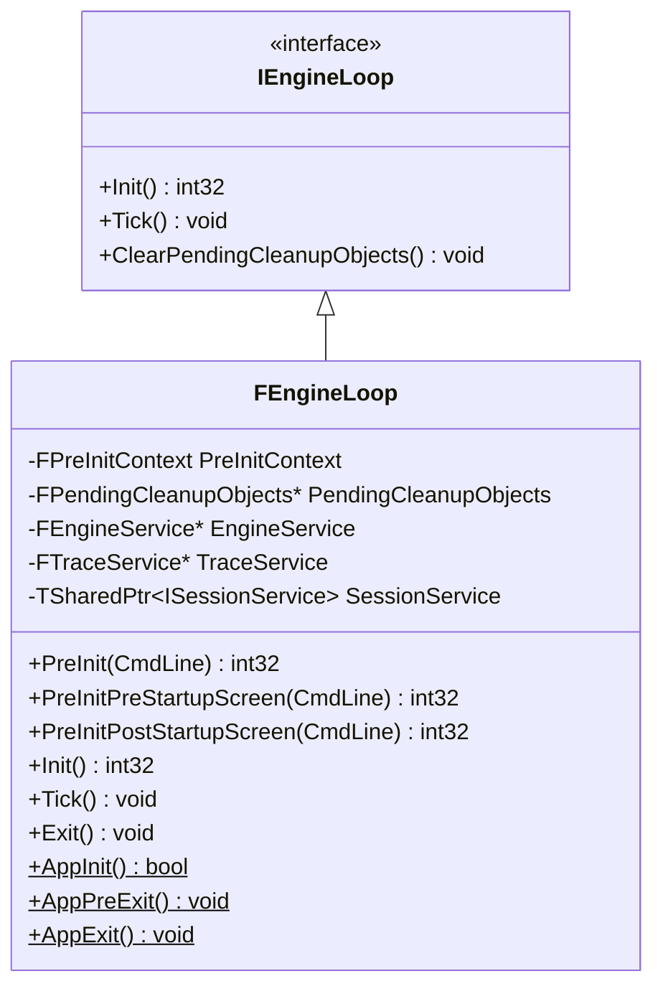
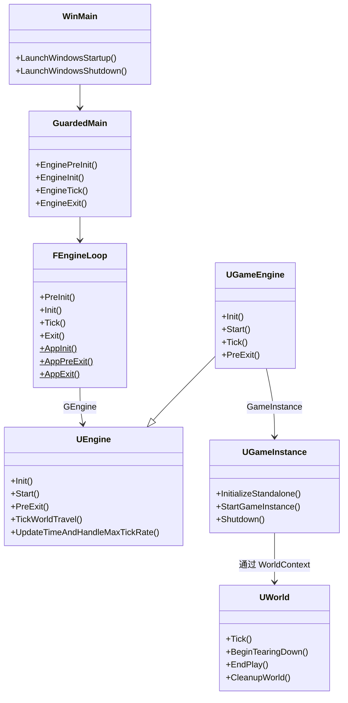

# 引擎启动、主循环与退出流程

## 核心文件

| 文件 | 作用 |
|------|------|
| `Runtime/Launch/Public/LaunchEngineLoop.h` | `FEngineLoop` 和 `IEngineLoop` 接口声明 |
| `Runtime/Launch/Private/LaunchEngineLoop.cpp` | `FEngineLoop` 全部实现（PreInit/Init/Tick/Exit） |
| `Runtime/Launch/Private/Launch.cpp` | `GuardedMain`、`EnginePreInit`、`EngineInit`、`EngineTick`、`EngineExit` 包装函数 |
| `Runtime/Launch/Private/Windows/LaunchWindows.cpp` | Windows 平台入口 `WinMain` 及 SEH 异常处理 |
| `Runtime/Engine/Public/UnrealEngine.h` | `UEngine`、`IEngineLoop`、`FLocalPlayerIterator` 等声明 |
| `Runtime/Engine/Private/UnrealEngine.cpp` | `UEngine::Init`、`UEngine::PreExit`、`UEngine::TickWorldTravel` 实现 |
| `Runtime/Engine/Private/GameEngine.cpp` | `UGameEngine::Init`、`UGameEngine::Start`、`UGameEngine::Tick`、`UGameEngine::PreExit` 实现 |
| `Runtime/Engine/Private/GameInstance.cpp` | `UGameInstance::StartGameInstance`、`UGameInstance::Shutdown` 实现 |

---

## 概览：完整生命周期流程图

```
WinMain (LaunchWindows.cpp)
  ├─ LaunchWindowsStartup()
  │    ├─ SetupWindowsEnvironment()        // CRT 调试设置
  │    ├─ ProcessCommandLine()             // 命令行解析与引号处理
  │    ├─ SEH __try/__except               // 结构化异常处理包装
  │    └─ GuardedMain(CmdLine)             // 受保护的主函数
  │         ├─ FCoreDelegates::GetPreMainInitDelegate().Broadcast()
  │         ├─ [EngineLoopCleanupGuard]    // RAII: 作用域退出时自动调用 EngineExit()
  │         ├─ EnginePreInit(CmdLine)
  │         │    └─ GEngineLoop.PreInit(CmdLine)
  │         │         ├─ PreInitPreStartupScreen()   // 引擎前期初始化
  │         │         └─ PreInitPostStartupScreen()  // 引擎后期初始化
  │         ├─ [WITH_EDITOR] EditorInit()
  │         │    └─ [ELSE] EngineInit()
  │         │              └─ GEngineLoop.Init()
  │         ├─ while (!IsEngineExitRequested())
  │         │    └─ EngineTick()
  │         │         └─ GEngineLoop.Tick()
  │         └─ [WITH_EDITOR] EditorExit()
  └─ LaunchWindowsShutdown()
       └─ FEngineLoop::AppExit()           // 最终平台级清理
```

---

## 一、入口：平台主函数

### 1.1 Windows 平台 (`LaunchWindows.cpp`)

```cpp
int32 WINAPI WinMain(_In_ HINSTANCE hInInstance, _In_opt_ HINSTANCE hPrevInstance,
                     _In_ char* pCmdLine, _In_ int32 nCmdShow)
{
    int32 Result = LaunchWindowsStartup(hInInstance, hPrevInstance, pCmdLine, nCmdShow, nullptr);
    LaunchWindowsShutdown();
    return Result;
}
```

`WinMain` 是 Windows 平台下 UE5 的入口点，参数均为 Win32 API 中 [WinMain](https://learn.microsoft.com/zh-cn/windows/win32/api/winbase/nf-winbase-winmain) 函数的标准参数。

### 1.2 `LaunchWindowsStartup` —— 启动与异常保护

该函数位于 [LaunchWindows.cpp:185](Launch/Private/Windows/LaunchWindows.cpp#L185)，主要职责：

1. **设置 Windows 环境**：`SetupWindowsEnvironment()` 注册 CRT 参数验证处理器，禁用 Debug 断言弹窗
2. **命令行处理**：通过 `CommandLineToArgvW` 解析命令行，对含空格的参数正确注入引号
3. **进程亲和性**：支持 `-processaffinity=` / `-processaffinityphysical=` 绑定 CPU 核心
4. **多层异常保护**：

```
LaunchWindowsStartup
  ├─ __try (SEH 外层)
  │    ├─ GuardedMainWrapper()             // 内层异常处理
  │    │    ├─ __try (SEH 内层, 仅 x64)
  │    │    │    └─ GuardedMain(CmdLine)
  │    │    └─ __except (ReportCrash)
  │    └─ [无异常处理模式] GuardedMain()
  └─ __except (HandleError / RequestExit)
```

异常处理的启用条件：
- 调试器已附加且未指定 `-IgnoreDebugger`：跳过 SEH，直接调用 `GuardedMain`（方便调试）
- 指定 `-noinnerexception`：禁用内层异常处理（绕过 XAudio2 兼容性问题）
- 嵌入式模式 (`bIsEmbedded`)：由外部应用负责崩溃报告
- 默认：两层 SEH 保护，内层提供准确调用栈，外层兜底

### 1.3 `LaunchWindowsShutdown` —— 退出清理

```cpp
void LaunchWindowsShutdown()
{
    FEngineLoop::AppExit();   // 平台级清理：Config、日志、文本本地化、Trace
    if (GShouldPauseBeforeExit) { Sleep(INFINITE); }
}
```

---

## 二、`GuardedMain` —— 受保护的主函数

定义于 [Launch.cpp:96](Launch/Private/Launch.cpp#L96)，是整个引擎生命周期的编排器：

```cpp
int32 GuardedMain(const TCHAR* CmdLine)
{
    // 1. 超早期初始化
    FCoreDelegates::GetPreMainInitDelegate().Broadcast();

    // 2. RAII 清理守卫（确保 GEngineLoop::Exit() 始终被调用）
    struct EngineLoopCleanupGuard {
        ~EngineLoopCleanupGuard() {
            if (!GUELibraryOverrideSettings.bIsEmbedded)
                EngineExit();   // → GEngineLoop.Exit()
        }
    } CleanupGuard;

    // 3. 引擎预初始化
    int32 ErrorLevel = EnginePreInit(CmdLine);   // → GEngineLoop.PreInit()
    if (ErrorLevel != 0 || IsEngineExitRequested()) return ErrorLevel;

    // 4. 引擎初始化（编辑器路径或游戏路径）
    if (GIsEditor)
        ErrorLevel = EditorInit(GEngineLoop);
    else
        ErrorLevel = EngineInit();               // → GEngineLoop.Init()

    // 5. 主循环
    while (!IsEngineExitRequested())
        EngineTick();                            // → GEngineLoop.Tick()

    // 6. 编辑器退出
    if (GIsEditor) EditorExit();
    return ErrorLevel;
}
```

关键设计要点：
- **RAII 守卫**：`EngineLoopCleanupGuard` 确保无论 `GuardedMain` 如何返回（正常返回/异常），`EngineExit()` 都会被调用
- **嵌入式模式**：当 `GUELibraryOverrideSettings.bIsEmbedded` 为 true 时，引擎作为库嵌入外部应用，不自行驱动 Tick 循环也不自行调用 Exit
- **两次慢任务分段**：`EnginePreInit` 消耗 80% 进度，`EngineInit` 消耗剩余 20%

### 2.1 包装函数一览

| 函数 | 定义位置 | 实际调用 |
|------|----------|----------|
| `EnginePreInit(CmdLine)` | [Launch.cpp:47](Launch/Private/Launch.cpp#L47) | `GEngineLoop.PreInit(CmdLine)` |
| `EngineInit()` | [Launch.cpp:57](Launch/Private/Launch.cpp#L57) | `GEngineLoop.Init()` |
| `EngineTick()` | [Launch.cpp:67](Launch/Private/Launch.cpp#L67) | `GEngineLoop.Tick()` |
| `EngineExit()` | [Launch.cpp:75](Launch/Private/Launch.cpp#L75) | 设置退出标志 + `GEngineLoop.Exit()` |

---

## 三、初始化：`FEngineLoop` 类

`GEngineLoop` 是定义在 [Launch.cpp:37](Launch/Private/Launch.cpp#L37) 的全局变量，类型为 `FEngineLoop`。`FEngineLoop` 继承自 `IEngineLoop` 接口：



### 3.1 PreInit —— 预初始化

`FEngineLoop::PreInit` 分为两个阶段：

#### 第一阶段：`PreInitPreStartupScreen`

位于 [LaunchEngineLoop.cpp:1923](Launch/Private/LaunchEngineLoop.cpp#L1923)，完成启动画面显示前的所有工作：

1. **命令行初始化**：`FCommandLine::Set(CmdLine)` — 必须最先完成
2. **设置游戏名称**：`LaunchSetGameName()` — 解析命令行中的 project 文件路径
3. **Trace 初始化**：`FTraceAuxiliary::Initialize(CmdLine)` — 性能追踪系统
4. **内存追踪**：`FLowLevelMemTracker` (LLM) 命令行处理
5. **Launcher 检查**：确保从官方启动器运行（`ILauncherCheckModule`）
6. **日志控制台**：创建 `FOutputDeviceConsole`
7. **工作目录**：`SetCurrentWorkingDirectoryToBaseDir()` 切换到可执行文件目录
8. **系统初始化**：
   - `FPlatformFileManager` 文件系统
   - `FConfigCacheIni` 配置系统
   - `FPlatformApplicationMisc::PreInit()` 平台应用层
   - `FPlatformOutputDevices::SetupOutputDevices()` 日志输出设备
   - `FTextLocalizationManager` 文本本地化
9. **模块加载**：加载 `CoreUObject` 模块

#### 第二阶段：`PreInitPostStartupScreen`

位于 [LaunchEngineLoop.cpp:3538](Launch/Private/LaunchEngineLoop.cpp#L3538)，在启动画面显示后进行：

1. **启动画面/预加载屏幕**：
   - 加载 `PreEarlyLoadingScreen` 阶段的模块
   - 播放早期启动影片 (`PlayEarlyStartupMovies`) 或 Early PreLoad Screen
   - 挂载早期安装的 Pak 文件
   - 重新应用 CVars 配置补丁
   - 打开 Shader 代码库 (`FShaderCodeLibrary::OpenLibrary`)
2. **脚本包注册**：`FPackageName::RegisterShortPackageNamesForUObjectModules()`
3. **资源注册中心**：加载 `AssetRegistry` 模块
4. **UObject 初始化**：`ProcessNewlyLoadedUObjects()` — 注册所有 UObject 类，初始化默认属性
5. **默认材质**：`UMaterialInterface::InitDefaultMaterials()` — 确保默认材质存在并已后加载
6. **纹理流送**：`IStreamingManager::Get()` 初始化
7. **启动核心模块**：`LoadStartupCoreModules()` — 加载 Core、Networking、Slate、SlateCore、UMG 等
8. **加载预处理/LoadingScreen 阶段模块**：
   - `ELoadingPhase::PreLoadingScreen` — 项目 + 插件模块
   - 引擎 Loading Screen 预加载
9. **RHI 初始化**：
   - `PostInitRHI()` — RHI 后初始化
   - `InitRenderingThread()` — 启动渲染线程
10. **播放 Loading 影片**
11. **加载预加载屏幕后的模块**：`ELoadingPhase::PostLoadingScreen`
12. **Slate 应用初始化**：`FSlateApplication::Create()`
13. **加载启动模块**：`LoadStartupModules()` — `ELoadingPhase::PostConfigInit` → `PreDefault` → `Default` → `PostDefault`

**PreInit 阶段模块加载时序**：
```
CoreUObject → PreEarlyLoadingScreen → PreLoadingScreen → PostLoadingScreen
→ PostConfigInit → PreDefault → Default → PostDefault → PostEngineInit
```

### 3.2 Init —— 引擎初始化

位于 [LaunchEngineLoop.cpp:4768](Launch/Private/LaunchEngineLoop.cpp#L4768)：

```
FEngineLoop::Init()
  ├─ 创建 GEngine 对象
  │    ├─ [Game]   UGameEngine::StaticClass() → NewObject<UEngine>
  │    └─ [Editor] UUnrealEdEngine::StaticClass() → GEngine = GEditor = NewObject<UUnrealEdEngine>
  ├─ GEngine->ParseCommandline()
  ├─ InitTime()                                    // 初始化时间选项
  ├─ GEngine->Init(this)                           // → UEngine::Init()
  │    ├─ RegisterEngineElements()                 // 注册引擎 Actor/组件类型
  │    ├─ EngineSubsystemCollection.Initialize()
  │    ├─ InitializeHMDDevice()                    // VR/AR 头显
  │    ├─ InitializeEyeTrackingDevice()
  │    ├─ FSlateApplication::Get().InitializeSound()
  │    ├─ LoadConfig()                             // 加载 Engine.ini
  │    ├─ InitializeObjectReferences()              // 默认材质、纹理等
  │    ├─ [Editor] CreateNewWorldContext(EWorldType::Editor)
  │    ├─ GetDerivedDataCacheRef().NotifyBootComplete()
  │    └─ InitializePortalServices()
  ├─ FCoreDelegates::OnPostEngineInit.Broadcast()  // 引擎初始化完成回调
  ├─ SessionService->Start()                       // 会话服务
  ├─ new FEngineService() / new FTraceService()
  ├─ LoadModulesForProject(ELoadingPhase::PostEngineInit)
  ├─ 引擎启动模块加载完成
  ├─ GEngine->Start()                              // → UGameEngine::Start()
  │    └─ GameInstance->StartGameInstance()
  │         ├─ 构建 DefaultURL
  │         ├─ 解析命令行中的 -REPLAY= / -map= 参数
  │         ├─ Engine->Browse(WorldContext, URL)    // 加载初始地图
  │         └─ BroadcastOnStart()                   // 广播 OnStartGameInstance
  ├─ 等待 Loading 画面完成
  ├─ 启用 Trace 命令行通道
  ├─ 初始化 Media、Automation 模块
  ├─ GIsRunning = true
  ├─ FThreadHeartBeat::Get().Start()
  └─ FCoreDelegates::OnFEngineLoopInitComplete.Broadcast()
```

#### `UGameEngine::Init` 详解

位于 [GameEngine.cpp:1106](Engine/Private/GameEngine.cpp#L1106)：

1. 调用 `UEngine::Init(InEngineLoop)` 完成基类初始化
2. 加载用户游戏设置：`UGameUserSettings::LoadSettings()` + `ApplyNonResolutionSettings()`
3. 创建 GameInstance：`NewObject<UGameInstance>` → `InitializeStandalone()`
   - 创建 `EWorldType::Game` 类型的 WorldContext
   - 创建 DummyWorld 避免 LoadMap 前无 World
4. 创建 GameViewportClient：`Init()` → `SetupInitialLocalPlayer()`
5. 创建游戏窗口 (`CreateGameWindow`) 和视口 (`CreateGameViewport`)

---

## 四、主循环：`FEngineLoop::Tick()`

位于 [LaunchEngineLoop.cpp:5588](Launch/Private/LaunchEngineLoop.cpp#L5588)，每帧执行一次。

### 4.1 主循环完整流程

```
FEngineLoop::Tick()
  │
  ├─ BeginExitIfRequested()                // 检查是否需要退出
  ├─ FThreadHeartBeat::Get().HeartBeat()   // 心跳（诊断线程）
  ├─ FGameThreadHitchHeartBeat::FrameStart()
  ├─ TickHotfixables()                     // 热修复更新
  ├─ CallAllConsoleVariableSinks()          // 控制台变量 Sink 回调
  │
  ├─ TRACE_BEGIN_FRAME(TraceFrameType_Game)
  │
  ├─ FCoreDelegates::OnBeginFrame.Broadcast()
  ├─ GLog->FlushThreadedLogs()             // 刷新其他线程的日志
  │
  ├─ [Benchmark 检查] 帧数/时间超限 → RequestExit
  │
  ├─ GEngine->UpdateTimeAndHandleMaxTickRate()  // ★ 计算 DeltaTime，必要时等待
  ├─ GEngine->SetSimulationLatencyMarkerStart()
  │
  ├─ ENQUEUE_RENDER_COMMAND(BeginFrame)     // → RHI BeginFrame
  ├─ Scene->StartFrame() (每个场景)
  │
  ├─ GEngine->TickPerformanceMonitoring()   // FPS 性能图表
  │
  ├─ FStats::AdvanceFrame()                // 统计系统帧前进
  ├─ CalculateFPSTimings()                  // 计算平均 FPS/MS
  │
  │   ┌─ 输入阶段 ─────────────────────────────┐
  ├─ FPlatformApplicationMisc::PumpMessages()   // Windows 消息泵
  ├─ [Idle 模式检查: t.IdleWhenNotForeground]    // 后台时降低 CPU 占用
  ├─ FPlatformFileManager::TickActivePlatformFile()
  ├─ FCoreDelegates::OnSamplingInput.Broadcast() // 记录输入采样时间
  ├─ FSlateApplication::PollGameDeviceState()    // 轮询游戏设备
  ├─ FSlateApplication::FinishedInputThisFrame() // 处理累积输入
  │   └──────────────────────────────────────────┘
  │
  │   ┌─ 游戏逻辑阶段 ──────────────────────────┐
  ├─ GEngine->Tick(DeltaSeconds, bIdleMode)       // ★ 核心游戏 Tick
  │    │  (详见 4.2 UGameEngine::Tick)
  │    ├─ UGameEngine::Tick()
  │    │    ├─ StaticTick() (异步加载)
  │    │    ├─ 遍历所有 WorldContext:
  │    │    │    ├─ TickWorldTravel() (无缝/服务器/客户端旅行)
  │    │    │    ├─ World->Tick(LEVELTICK_All, DeltaSeconds)
  │    │    │    ├─ 更新反射捕获
  │    │    │    └─ 关卡流式加载
  │    │    └─ FTickableGameObject::TickObjects()
  │    └─ 等待 Loading 画面
  │   └──────────────────────────────────────────┘
  │
  ├─ FAssetCompilingManager::ProcessAsyncTasks()
  │
  │   ┌─ Slate 与并发阶段 ───────────────────────┐
  ├─ ProcessLocalPlayerSlateOperations()          // 分发玩家 Slate 操作
  ├─ FSlateApplication::Tick(PlatformAndInput)
  ├─ [并发] DemoNetDriver::TickFlushAsyncEndOfFrame() 与 Slate 并行
  ├─ FSlateApplication::Tick(TimeAndWidgets)      // 更新与绘制 Slate 控件
  │   └──────────────────────────────────────────┘
  │
  │   ┌─ 渲染收尾阶段 ───────────────────────────┐
  ├─ Scene->EndFrame() (每个场景)
  ├─ RHITick(DeltaSeconds)
  ├─ GEngine->SetSimulationLatencyMarkerEnd()
  ├─ FFrameEndSync::Sync()                    // 同步游戏线程与渲染线程
  ├─ DeletePendingCleanupObjects()             // 清理上一帧延迟删除的对象
  ├─ DeleteLoaders()                           // 删除待销毁的 Linker
  ├─ FTSTicker::GetCoreTicker().Tick()          // 核心定时器
  ├─ FThreadManager::Get().Tick()
  ├─ GEngine->TickDeferredCommands()            // 执行延迟控制台命令
  │   └──────────────────────────────────────────┘
  │
  ├─ FCoreDelegates::OnEndFrame.Broadcast()
  ├─ GFrameCounter++                           // 全局帧计数器递增
  │
  ├─ ENQUEUE_RENDER_COMMAND(EndFrame)          // → RHI EndFrame
  │
  └─ TRACE_END_FRAME(TraceFrameType_Game)
```

### 4.2 `UGameEngine::Tick` —— 游戏引擎 Tick

位于 [GameEngine.cpp:1641](Engine/Private/GameEngine.cpp#L1641)：

1. **前置检查**：负 DeltaTime 直接 Fatal（Shipping 除外）
2. **视口清理**：关闭被标记清理的 GameViewport；若所有视口关闭则退出
3. **帧率自适应**：`GameViewport->SetDropDetail()` 动态调整画质
4. **媒体框架**：`MediaModule->TickPreEngine()`（如果无 Sequencer 绑定的 World）
5. **引擎子系统**：`StaticTick()` 处理异步加载
6. **遍历 World 列表**（核心）：
   - 切换 `GWorld` 到当前上下文
   - **旅行系统**：`TickWorldTravel()` — 无缝旅行、服务器切换、客户端旅行
   - **World Tick**：`World->Tick(LEVELTICK_All, DeltaSeconds)` — Actor/组件 Tick
   - **反射捕获**：更新天空光和反射捕获内容
   - **后加载事件**：`bWorldWasLoadedThisTick` → 触发 causeevent、`bTriggerPostLoadMap`
   - **关卡流送**：服务器端 `UpdateLevelStreaming()`
7. **延迟 Tickable 对象**：`FTickableGameObject::TickObjects()`
8. **恢复 GWorld** 到原始上下文

### 4.3 Idle 模式

`ShouldUseIdleMode()` 在以下条件下返回 true：
- `t.IdleWhenNotForeground` CVar 开启 且窗口无焦点
- 嵌入式模式下 `FEmbeddedCommunication::IsAwakeForTicking()` 为 false
- 但如果有 World 的 always loaded levels 未加载完成，则强制退出 Idle

Idle 模式下：Sleep 0.1s，不 Tick World，不处理 Slate Widget

### 4.4 时间管理

`GEngine->UpdateTimeAndHandleMaxTickRate()` 完成：
- 计算 `FApp::DeltaTime`（帧间隔）
- 更新 `FApp::CurrentTime`
- 如果设置了最大帧率 (`t.MaxFPS`)，通过 Sleep 等待以满足帧率上限

---

## 五、退出：`FEngineLoop::Exit()`

位于 [LaunchEngineLoop.cpp:5003](Launch/Private/LaunchEngineLoop.cpp#L5003)。

### 5.1 退出触发方式

1. **正常退出**：`GuardedMain` 中 `EngineLoopCleanupGuard` 析构时调用 `EngineExit()`
2. **主动请求**：代码中调用 `RequestEngineExit("reason")` 或 `FPlatformMisc::RequestExit()`
3. **所有视口关闭**：`UGameEngine::Tick` 检测到 `GameViewport == nullptr`
4. **Benchmark 完成**：帧数/时间达到上限
5. **致命错误**：`UE_LOG(Fatal, ...)` 触发
6. **窗口关闭消息**：Slate 应用关闭事件

### 5.2 退出流程详解

```
FEngineLoop::Exit()
  │
  ├─ GIsRunning = 0
  ├─ GLogConsole = nullptr
  │
  ├─ IInstallBundleManager::InstallBundleCompleteDelegate 解绑
  ├─ FPreLoadScreenManager::Destroy()
  ├─ FVisualLogger::TearDown()                    // 可视化日志
  ├─ FAssetCompilingManager::Shutdown()           // 资产编译管理器
  │
  │   ┌─ 服务关闭 ─────────────────────────────────┐
  ├─ delete EngineService / TraceService
  ├─ SessionService->Stop() / Reset()
  ├─ delete GDistanceFieldAsyncQueue              // 距离场异步队列
  ├─ delete GCardRepresentationAsyncQueue         // 网格体卡片异步队列
  │   └──────────────────────────────────────────┘
  │
  │   ┌─ 引擎 PreExit ─────────────────────────────┐
  ├─ GEngine->PreExit()                           // UGameEngine::PreExit()
  │    ├─ UGameUserSettings::SaveSettings()        // 保存用户设置
  │    ├─ 遍历所有 World:
  │    │    ├─ World->BeginTearingDown()
  │    │    ├─ 取消待处理的网络连接
  │    │    ├─ ShutdownWorldNetDriver()
  │    │    ├─ World->SetShouldForceUnloadStreamingLevels(true)
  │    │    ├─ World->FlushLevelStreaming(Visibility)
  │    │    ├─ World->EndPlay(EEndPlayReason::Quit)
  │    │    ├─ World->GetGameInstance()->Shutdown()  // → UGameInstance::Shutdown()
  │    │    │    ├─ ReceiveShutdown()               // 蓝图可重写
  │    │    │    ├─ OnlineSession 清理
  │    │    │    ├─ 移除所有 LocalPlayers
  │    │    │    └─ SubsystemCollection.Deinitialize()
  │    │    └─ World->CleanupWorld()
  │    └─ UEngine::PreExit()
  │         ├─ FCoreDelegates::OnEnginePreExit.Broadcast()
  │         ├─ 销毁 MovieSceneCapture
  │         ├─ FEngineAnalytics::Shutdown()
  │         ├─ ShutdownHMD()
  │         └─ EngineSubsystemCollection.Deinitialize()
  ├─ GEngine->ReleaseAudioDeviceManager()
  │   └──────────────────────────────────────────┘
  │
  ├─ FlushAsyncLoading() / CancelAsyncLoading()    // 处理异步加载
  ├─ SetAsyncLoadingAllowed(false)                 // 禁止新的异步加载
  ├─ IStreamingManager::BlockTillAllRequestsFinished()
  ├─ FAudioDeviceManager::Shutdown()               // 音频设备
  ├─ FSlateApplication::Shutdown()                 // ★ 关闭所有 Slate 窗口
  │
  │   ┌─ 渲染与 Shader 关闭 ───────────────────────┐
  ├─ ClearMaterialPSORequests()                    // 清除 PSO 编译请求
  ├─ PipelineStateCache::WaitForAllTasks()
  ├─ AppPreExit()
  │    ├─ FCoreDelegates::OnPreExit.Broadcast()
  │    ├─ FCoreDelegates::OnExit.Broadcast()
  │    ├─ GIOThreadPool->Destroy()
  │    ├─ delete GShaderCompilingManager
  │    └─ VerseVM::Shutdown()
  ├─ TermGamePhys()                                // 物理引擎清理
  ├─ ShutdownRenderingThread()                     // ★ 停止渲染线程
  ├─ FShaderPipelineCache::Shutdown()              // PSO 缓存
  ├─ ShutdownGlobalShaderMap()                     // 全局着色器映射
  ├─ FShaderCodeLibrary::Shutdown()                // 着色器代码库
  ├─ FIoDispatcher::Shutdown()
  │   └──────────────────────────────────────────┘
  │
  │   ┌─ 模块卸载 ─────────────────────────────────┐
  ├─ FModuleManager::Get().UnloadModulesAtShutdown() // 逆序调用所有 ShutdownModule()
  ├─ IStreamingManager::Shutdown()
  ├─ DestroyMoviePlayer()
  ├─ FThreadStats::StopThread()
  ├─ 销毁线程池: GThreadPool / GBackgroundPriorityThreadPool
  ├─ RHIExit()
  └─ FTaskGraphInterface::Shutdown()              // ★ 任务图系统最后关闭
```

### 5.3 `AppExit` —— 最终平台级清理

`FEngineLoop::AppExit()` 在 `LaunchWindowsShutdown()` 中被调用，是进程退出前的最后一步：

1. `FPlatformApplicationMisc::TearDown()` — 平台应用层清理
2. `FPlatformMisc::PlatformTearDown()` — 平台清理
3. `GConfig->Exit()` — 配置系统退出（写入缓存）
4. `GLog->TearDown()` — 日志系统关闭
5. `FTextLocalizationManager::TearDown()` / `FInternationalization::TearDown()`
6. `FTraceAuxiliary::Shutdown()` — 追踪系统关闭

> **注意**：`AppExit` 是静态方法，同时被 `LaunchWindowsShutdown` 和 `FEngineLoop::Exit` 中通过 `AppPreExit` 间接调用。（`AppExit` 有防重入保护）

---

## 六、关键委托 (Delegates) 时序

| 委托 | 调用时机 | 位置 |
|------|----------|------|
| `FCoreDelegates::GetPreMainInitDelegate()` | `GuardedMain` 最开始，最早的可执行时机 | [Launch.cpp:119](Launch/Private/Launch.cpp#L119) |
| `FCoreDelegates::OnPostEngineInit` | `GEngine->Init` 完成后 | [LaunchEngineLoop.cpp:4855](Launch/Private/LaunchEngineLoop.cpp#L4855) |
| `FCoreDelegates::OnFEngineLoopInitComplete` | `FEngineLoop::Init` 末尾 | [LaunchEngineLoop.cpp:4970](Launch/Private/LaunchEngineLoop.cpp#L4970) |
| `FCoreDelegates::OnBeginFrame` | 每帧最开始（统计系统帧前进后） | [LaunchEngineLoop.cpp:5713](Launch/Private/LaunchEngineLoop.cpp#L5713) |
| `FCoreDelegates::OnEndFrame` | 每帧最后（帧计数器递增前） | [LaunchEngineLoop.cpp:6121](Launch/Private/LaunchEngineLoop.cpp#L6121) |
| `FCoreDelegates::OnSamplingInput` | 每帧输入采样时 | [LaunchEngineLoop.cpp:5848](Launch/Private/LaunchEngineLoop.cpp#L5848) |
| `FCoreDelegates::OnEnginePreExit` | `UEngine::PreExit()` 中 | [UnrealEngine.cpp:2351](Engine/Private/UnrealEngine.cpp#L2351) |
| `FCoreDelegates::OnPreExit` | `AppPreExit()` 中 | [LaunchEngineLoop.cpp:6843](Launch/Private/LaunchEngineLoop.cpp#L6843) |
| `FCoreDelegates::OnExit` | `AppPreExit()` 中（晚于 OnPreExit） | [LaunchEngineLoop.cpp:6858](Launch/Private/LaunchEngineLoop.cpp#L6858) |
| `FCoreDelegates::StarvedGameLoop` | `Init` 末尾绑定，检测游戏循环饥饿 | [LaunchEngineLoop.cpp:4955](Launch/Private/LaunchEngineLoop.cpp#L4955) |
| `FWorldDelegates::OnStartGameInstance` | `UGameInstance::BroadcastOnStart()` | [GameInstance.cpp:728](Engine/Private/GameInstance.cpp#L728) |

---

## 七、GIsEditor 分支

当 `GIsEditor == true` 时（即运行的是 UnrealEditor.exe），几条关键路径不同：

| 阶段 | 游戏 (GIsEditor=false) | 编辑器 (GIsEditor=true) |
|------|------------------------|-------------------------|
| Init | `GEngine = UGameEngine` | `GEngine = GEditor = GUnrealEd = UUnrealEdEngine` |
| World | `GameInstance` 创建 `EWorldType::Game` 的 World | `UEngine::Init` 中直接创建 `EWorldType::Editor` 的 World |
| Tick | `EngineTick()` 直接进入主循环 | `EditorInit()` 额外初始化编辑器和 Slate，再进入主循环 |
| Exit | 直接 `EngineExit()` | 先 `EditorExit()`，再 `EngineExit()` |

---

## 八、命令行参数参考

| 参数 | 作用 |
|------|------|
| `-waitforattach` / `-WaitForDebugger` | 启动时等待调试器附加 |
| `-noinnerexception` | 禁用内层 SEH 异常处理 |
| `-unattended` | 无人值守模式，禁用错误弹窗 |
| `-stdout` | 启用 stdout 日志输出 |
| `-vsync` / `-novsync` | 强制开启/关闭垂直同步 |
| `-execcmds=` | 启动后执行控制台命令 |
| `-map=<name>` | 指定加载的地图 |
| `-replay=<name>` | 回放录像 |
| `-processaffinity=` | 逻辑核心亲和性掩码 |
| `-processaffinityphysical=` | 物理核心亲和性掩码 |
| `-testexit=` | 指定关键词，当日志中匹配时自动退出（测试用） |
| `t.MaxFPS` (CVar) | 限制最大帧率 |
| `t.IdleWhenNotForeground` (CVar) | 窗口失去焦点时进入 Idle 模式 |

---

## 九、嵌入式模式 (Embedded Mode)

当 `GUELibraryOverrideSettings.bIsEmbedded` 为 true 时：
- `EngineLoopCleanupGuard` 析构时**不调用** `EngineExit()`，由外部应用负责
- GuardedMain 中的主循环**被跳过**，由外部应用负责调用 `EngineTick()`
- 错误报告由外部应用处理
- 调用了 `FEmbeddedCommunication` 进行内外通信同步

---

## 十、类关系图



---

> 本文档基于 Unreal Engine 5.5 源码分析。代码路径相对于 `Engine/Source/`。
