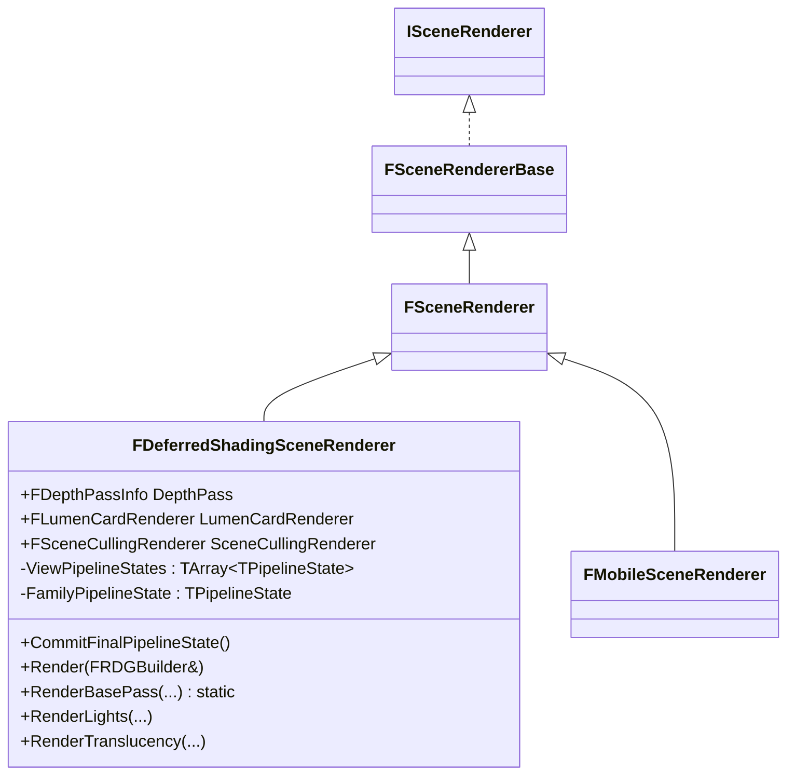
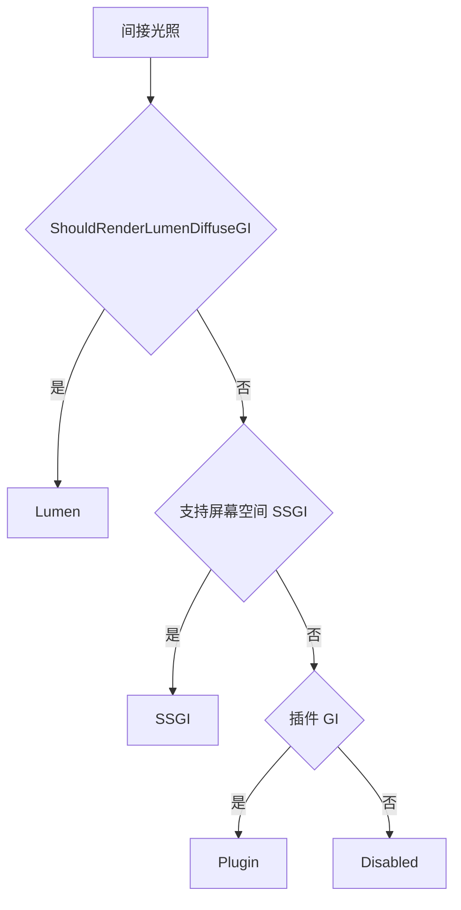
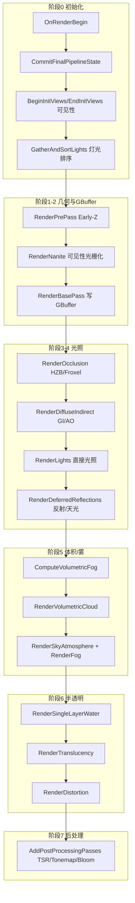

# FDeferredShadingSceneRenderer — UE5 延迟渲染管线解析

## 1. 概述

`FDeferredShadingSceneRenderer` 是虚幻引擎 5 默认的 **延迟着色（Deferred Shading）** 场景渲染器，继承自 `FSceneRenderer`。它负责在渲染线程上构建整帧的 **Render Graph（RDG）**，将场景从可见性计算一路渲染到最终后处理输出。

关键事实：

- 类定义：`DeferredShadingRenderer.h:307`（`class FDeferredShadingSceneRenderer : public FSceneRenderer`）
- 主入口：`DeferredShadingRenderer.cpp:1340` 的 `Render(FRDGBuilder& GraphBuilder)`，约 2200 行，是整个渲染器的心脏。
- 它实现的是 **GBuffer 延迟管线**：先在 BasePass 中把材质属性写入 GBuffer，然后在光照阶段用 GBuffer 逐像素求光照。
- 现代 UE5 中它不再是"纯"延迟：**Nanite**（可见性缓冲光栅化）、**Lumen**（表面缓存 + 屏幕探针）、**Virtual Shadow Maps**（虚拟阴影图）、**Froxel 聚类延迟** 都挂在这个类上。

---

## 2. 类层次结构



核心成员（`DeferredShadingRenderer.h`）：

| 成员 | 作用 |
|------|------|
| `DepthPass` | Early-Z PrePass 配置（`DDM_AllOpaque` / `DDM_None` 等） |
| `LumenCardRenderer` | Lumen 表面缓存（Surface Cache）卡片渲染 |
| `SceneCullingRenderer` | 场景实例剔除 |
| `ViewPipelineStates` | 每视图的管线状态（间接光照/AO/反射方法等） |
| `FamilyPipelineState` | 视图族级管线状态（Nanite、HZB 遮挡） |

---

## 3. 核心概念：管线状态（TPipelineState）

延迟渲染器有大量相互依赖的"维度"（是否用 Nanite、AO 方法、反射方法、HZB 需求……），这些维度之间不能有循环依赖。UE5 用 `TPipelineState<PermutationVectorType>` 模板（`DeferredShadingRenderer.h:168`）来管理：

- `Set(成员指针, 值)`：按 **内存偏移量** 保证维度按序提交，一旦提交就不可更改（`checkf` 防止环依赖）。
- `Commit()`：冻结整个状态，之后只读。
- `operator->` / `operator*`：仅允许在 `Commit()` 后访问。

**每视图状态** `FPerViewPipelineState`（`DeferredShadingRenderer.h:457`）：

```cpp
EDiffuseIndirectMethod DiffuseIndirectMethod;   // 漫反射间接光方法
EAmbientOcclusionMethod AmbientOcclusionMethod; // AO 方法
EReflectionsMethod ReflectionsMethod;           // 反射方法
EReflectionsMethod ReflectionsMethodWater;      // 水面反射方法
bool bComposePlanarReflections;
bool bFurthestHZB, bClosestHZB;                 // 需要的 HZB 类型
```

**视图族状态** `FFamilyPipelineState`（`DeferredShadingRenderer.h:480`）：`bNanite`、`bHZBOcclusion`。

方法枚举（`DeferredShadingRenderer.h:281-302`）：

- `EDiffuseIndirectMethod`：`Disabled` / `SSGI` / `Lumen` / `Plugin`
- `EAmbientOcclusionMethod`：`Disabled` / `SSAO` / `SSGI` / `RTAO`
- `EReflectionsMethod`：`Disabled` / `SSR` / `Lumen`

---

## 4. 管线状态提交（CommitFinalPipelineState / CommitIndirectLightingState）

`CommitFinalPipelineState()`（`DeferredShadingRenderer.cpp:1031`）是整帧最早确定"拓扑结构"的地方，在 `Render()` 的第 1395 行被调用。流程：

1. **Family 级**：写入 `bNanite`（`UseNanite`）与 `bHZBOcclusion`（`r.HZBOcclusion`）。
2. **调用 `CommitIndirectLightingState()`**（`IndirectLightRendering.cpp:468`）：为每个视图决定间接光照/AO/反射方法。
3. **View 级 HZB 需求**：根据选中的方法推导需要 `FurthestHZB` 还是 `ClosestHZB`（如 SSR、SSAO、SSGI、Lumen 需要远 HZB）。
4. **全部 `Commit()`**。

`CommitIndirectLightingState` 的决策逻辑（优先级从上到下）：

- **漫反射 GI**：`ShouldRenderLumenDiffuseGI` → Lumen；否则 `SSGI`；否则插件 GI；否则 Disabled。
- **AO**：SSGI 自带 AO；Lumen 可附加 SSAO（`bLumenWantsSSAO`）；否则 RTAO 或 SSAO。
- **反射**：`ShouldRenderLumenReflections` → Lumen；否则 SSR。

这一步的意义：**一旦提交，整个后续渲染的所有分支判断都基于这份只读状态**，避免同一帧内因条件反复求值导致的不一致。

---

## 5. 渲染主流程 Render()

`Render()` 是纯编排函数，通过 `FRDGBuilder` 构建整帧的 GPU 命令图。下面按执行顺序分阶段拆解（行号对应 `DeferredShadingRenderer.cpp`）。

### 阶段 0：初始化与可见性

```
RendererOutput 判断（FinalSceneColor / BasePass / DepthPrepassOnly）
├─ RayTracing geometry 预处理 (1362)
├─ OnRenderBegin → 创建 InitViewTaskDatas (1374)
├─ 虚拟纹理 BeginUpdate (1385)
├─ CommitFinalPipelineState() (1395)          ← 冻结管线拓扑
├─ 更新天空大气、Lumen 场景任务、Nanite 可见性 (1409-1478)
├─ BeginInitViews / EndInitViews (1614 / 1907) ← 视锥剔除、遮挡、GPU Scene
├─ GatherAndSortLights 异步任务 (1856)          ← 灯光收集排序
```

要点：

- `bRenderDeferredLighting`（1776）：`Lighting && SM5+ && DeferredLighting && bUseGBuffer && !RayTracedOverlay` —— 决定是否走延迟光照。
- `bComputeLightGrid`（1782-1840）：决定是否构建 Froxel 灯光网格（体素雾、Lumen、VSM、聚类延迟等都需要）。
- `bNaniteEnabled = ShouldRenderNanite()`（1350）贯穿全帧。

### 阶段 1：PrePass / Early-Z

`RenderPrepassAndVelocity` lambda（1960）：

```
AddClearDepthStencilPass            ← 清深度/模板
RenderPrePass (1975)                ← 绘制不透明体深度（写 HiZ）
RenderVelocities (DDM_AllOpaqueNoVelocity)
RenderNanite (1996)                 ← Nanite 可见性缓冲光栅化 + 深度输出
AddResolveSceneDepthPass            ← resolve 深度
```

PrePass 的作用：填充 SceneDepth 并构建 **HZB（层级深度）**，供后续遮挡剔除、SSAO/SSR/SSGI/Lumen 采样。`bAllowReadOnlyDepthBasePass`（1592）表示 PrePass 完成后 BasePass 可把深度设为只读。

### 阶段 2：BasePass 与 GBuffer

```
RenderBasePass (2488)                ← 写入 SceneColor + GBuffer A~F
ExtractNormalsForNextFrameReprojection (2558)
SceneTextures.SetupMode |= GBuffers  ← 重建场景纹理 UB
```

BasePass 是延迟管线的核心写入点：把 BaseColor、Metallic、Specular、Roughness、WorldNormal、ShadingModelId 等写入 GBuffer（详见 §6）。Nanite 网格通过 `NaniteBasePassShadingCommands` 单独走可见性缓冲着色。

### 阶段 3：遮挡与 HZB

`RenderOcclusionLambda`（2172）：`RenderOcclusion`（HZB 遮挡查询）+ Froxel 渲染器（体素化灯光网格所需）。可异步 compute。

### 阶段 4：延迟光照（`bRenderDeferredLighting`，2797）

这是延迟着色管线的灵魂，顺序如下：

```
RenderDiffuseIndirectAndAmbientOcclusion   (2808)  ← 漫反射间接光 + AO（Lumen/SSGI/SSAO/DFAO）
RenderIndirectCapsuleShadows               (2819)  ← 胶囊间接阴影
RenderDFAOAsIndirectShadowing              (2822)  ← DFAO 作为间接阴影调制
RenderLights                               (2840)  ← 直接光照（聚类/标准延迟）
RenderMegaLights                           (2844)  ← MegaLights（大量光源）
InjectTranslucencyLightingVolumeAmbientCubemap / Filter (2854)
RenderDiffuseIndirectAndAmbientOcclusion   (2858)  ← 合成（Composite）
RenderDeferredReflectionsAndSkyLighting    (2869)  ← 天光 + 反射（SSR/Lumen）
AddSubsurfacePass                          (2876)  ← 次表面散射
RenderHairStrandsSceneColorScattering      (2881)
```

关键点：

- **间接光先于直接光**：BasePass 输出被当作"间接光缓冲"，先写间接光，再叠直接光。
- **直接光照 `RenderLights`**（`LightRendering.cpp`）：标准延迟（每个光源一个全屏 quad）或 **聚类延迟**（`ShouldUseClusteredDeferredShading`，`r.UseClusteredDeferredShading`）。
- 阴影在 BasePass 之后、光照之前渲染（VSM 页分配 + `RenderShadowDepthMaps`，2679-2701）。

### 阶段 5：雾 / 大气 / 体积

```
ComputeVolumetricFog    (2913)  ← 体积雾
RenderHeterogeneousVolumes (2918)
RenderVolumetricCloud   (2929)  ← 体积云
RenderLightShaftOcclusion / RenderSkyAtmosphere / RenderFog (RenderLigthShaftSkyFogAndCloud, 2974)
```

### 阶段 6：半透明与水面

```
RenderSingleLayerWater   (3060)  ← 单层水面（有自己的深度 PrePass + 反射）
RenderTranslucency       (3129)  ← 半透明（使用 TranslucencyLightingVolume）
RenderFrontLayerTranslucency (3147) ← Lumen/VSM 前层半透明
RenderDistortion         (3181)
```

半透明不走延迟，而是用 **前向** + 半透明光照体积（Translucency Lighting Volume）采样光照。

### 阶段 7：后处理

```
AddResolveSceneColorPass      (3358)
AddPostProcessingPasses       (3452)  ← TSR、Tonemap、Bloom、DOF、MotionBlur……
```

后处理输入包含 `ExposureIlluminance`（曝光）、`PathTracingResources`、`SceneTextures` UB。最后 `OnRenderFinish`（3498）并释放视图历史。

---

## 6. GBuffer 布局

UE5 的 GBuffer 是 **数据驱动** 的（`RenderCore/Public/GBufferInfo.h`）：

- 每个"槽位"（`EGBufferSlot`，`GBufferInfo.h:12`）描述一个逻辑属性，如 `GBS_BaseColor`、`GBS_Metallic`、`GBS_WorldNormal`、`GBS_ShadingModelId`。
- `FGBufferInfo` / `FGBufferItem` 把槽位通过 **压缩格式**（`EGBufferCompression`，如法线八面体编码 `GBC_Packed_Normal_Octahedral_8_8`）打包到物理纹理中。
- `FGBufferBindings`（`GBufferInfo.h:272`）把逻辑属性映射到 `GBufferA~E` + `GBufferVelocity` 六个渲染目标，格式由 `r.GBufferFormat` 决定。

典型的默认 GBuffer 语义（实际由 `FetchFullGBufferInfo` 决定，可因平台/材质模型变化）：

| 目标 | 大致内容 |
|------|----------|
| **GBufferA** | WorldNormal（八面体编码） |
| **GBufferB** | Metallic / Specular / Roughness / ShadingModelId |
| **GBufferC** | BaseColor（RGB） |
| **GBufferD** | ShadingModel 自定义数据（CustomData） |
| **GBufferE** | 预计算阴影 / 各向异性等 |
| **SceneDepth** | 深度（`GBS_Velocity` 单独一个速度缓冲） |

`Substrate` 材质模型会扩展自定义 GBuffer 布局。`FSceneTextures`（`SceneTextures.cpp:697-747`）负责按 `FGBufferBindings` 创建这些纹理（GBufferA 可能是 `PF_B8G8R8A8` 或高精度 `PF_FloatRGBA` 数组）。

---

## 7. 间接光照方法选择

`CommitIndirectLightingState`（§4）决定了每个视图用哪种 GI，这也是 UE5 渲染差异最大的地方：



- **Lumen**（默认移动/高端）：表面缓存 + 屏幕探针（Screen Probe Gather）+ 辐射缓存（Radiance Cache），软件光追或硬件光追。
- **SSGI**：屏幕空间，轻量但只看到屏幕内信息。
- **SSAO / RTAO**：环境光遮蔽。
- **反射**：`Lumen` / `SSR` / `Disabled`。

---

## 8. 整帧管线总览



---

## 9. 关键要点总结

1. **延迟核心**：BasePass 写 GBuffer，光照阶段逐像素读 GBuffer 求光；半透明/水面例外，走前向 + 光照体积。
2. **管线状态先行**：`CommitFinalPipelineState` 在渲染开始前冻结所有分支维度（`TPipelineState` 强制无环依赖），保证整帧决策一致。
3. **现代特性叠加**：Nanite（可见性缓冲）、Lumen（GI/反射）、VSM（阴影）、聚类延迟（Froxel 灯光网格）都集成在 `Render()` 的编排里。
4. **间接光 → 直接光 → 反射 → 合成** 是延迟光照区的固定顺序，BasePass 输出被复用为间接光缓冲。
5. **GBuffer 数据驱动**：逻辑槽位 + 压缩格式 + 物理绑定的三层映射，使 GBuffer 可随材质模型（Substrate）与平台自适应。
6. **RDG 贯穿始终**：所有 pass 都是声明式的，通过 `FRDGBuilder` 构建图，实际执行由 RDG 调度，天然支持异步 compute 与资源别名。

## 参考源码

- `DeferredShadingRenderer.h` / `DeferredShadingRenderer.cpp` — 类定义与主渲染流程
- `IndirectLightRendering.cpp` — `CommitIndirectLightingState`、间接光照
- `LightRendering.cpp` — `RenderLights`（直接光照）
- `BasePassRendering.cpp` — BasePass 与 GBuffer 写入
- `RenderCore/Public/GBufferInfo.h` — GBuffer 数据驱动布局定义
- `SceneTextures.cpp` — 场景纹理（SceneColor/Depth/GBuffer/Velocity）创建
