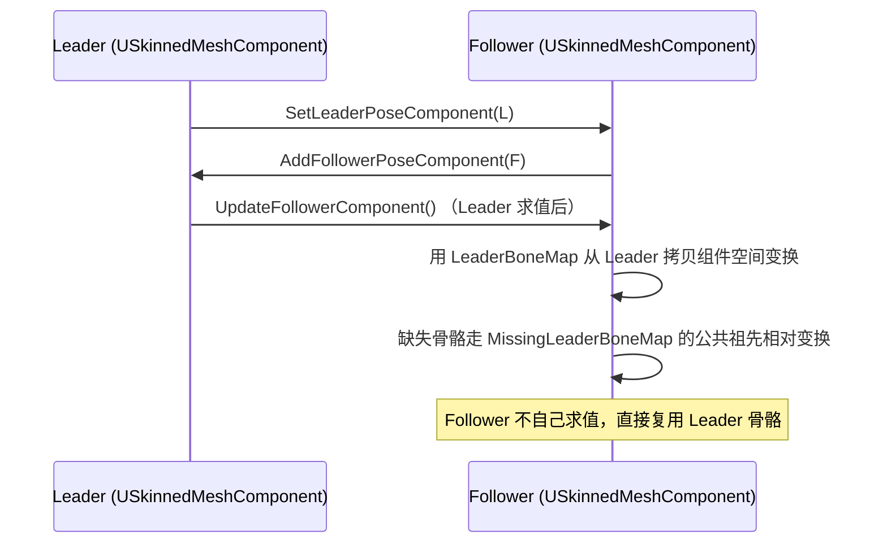
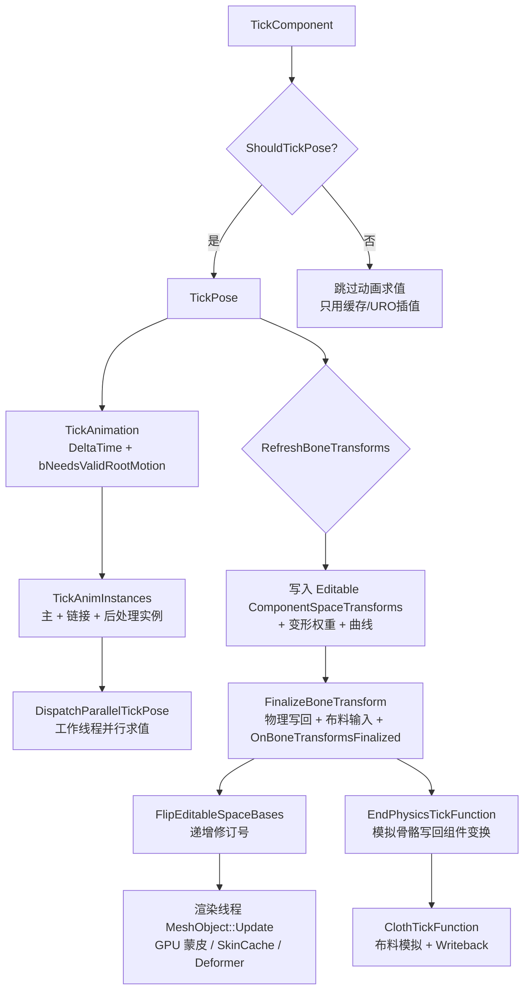

# USkinnedMeshComponent 与 USkeletalMeshComponent 深度解析

> 版本：UE 5.5.4
> 源码路径：
> - `Source/Runtime/Engine/Classes/Components/SkinnedMeshComponent.h`
> - `Source/Runtime/Engine/Classes/Components/SkeletalMeshComponent.h`
> 目标读者：需要理解骨骼网格体（Skeletal Mesh）从"动画求值 → 骨骼变换 → 渲染"完整链路，以及 LOD / 主从组件 / 皮肤权重 / 物理 / 布料各子系统如何挂接在组件上的技术人员

---

## 目录

- [USkinnedMeshComponent 与 USkeletalMeshComponent 深度解析](#uskinnedmeshcomponent-与-uskeletalmeshcomponent-深度解析)
  - [目录](#目录)
  - [1. 定位与类层次](#1-定位与类层次)
    - [1.1 继承关系](#11-继承关系)
    - [1.2 职责划分：Skinned vs Skeletal](#12-职责划分skinned-vs-skeletal)
    - [1.3 SkinnedAsset 抽象（5.1 重构）](#13-skinnedasset-抽象51-重构)
    - [1.4 同时实现的接口](#14-同时实现的接口)
  - [2. USkinnedMeshComponent：蒙皮渲染基础设施](#2-uskinnedmeshcomponent蒙皮渲染基础设施)
    - [2.1 骨骼变换双缓冲（核心数据结构）](#21-骨骼变换双缓冲核心数据结构)
    - [2.2 骨骼可见性系统](#22-骨骼可见性系统)
    - [2.3 LOD 系统](#23-lod-系统)
    - [2.4 LeaderPoseComponent 主从组件](#24-leaderposecomponent-主从组件)
    - [2.5 变形目标 Morph Target](#25-变形目标-morph-target)
    - [2.6 Mesh Deformer 网格变形器](#26-mesh-deformer-网格变形器)
    - [2.7 皮肤权重与顶点覆盖](#27-皮肤权重与顶点覆盖)
    - [2.8 渲染入口：MeshObject 与 CPU 蒙皮查询](#28-渲染入口meshobject-与-cpu-蒙皮查询)
    - [2.9 基类的更新契约（虚函数体系）](#29-基类的更新契约虚函数体系)
  - [3. USkeletalMeshComponent：动画 + 物理 + 布料](#3-uskeletalmeshcomponent动画--物理--布料)
    - [3.1 动画实例管理](#31-动画实例管理)
    - [3.2 动画模式与单节点播放](#32-动画模式与单节点播放)
    - [3.3 求值上下文 FAnimationEvaluationContext](#33-求值上下文-fanimationevaluationcontext)
    - [3.4 骨骼空间 / 曲线 / 自定义属性数据](#34-骨骼空间--曲线--自定义属性数据)
    - [3.5 物理集成](#35-物理集成)
    - [3.6 布料模拟](#36-布料模拟)
    - [3.7 更新率优化 URO](#37-更新率优化-uro)
    - [3.8 一帧 Tick 流程](#38-一帧-tick-流程)
  - [4. 关键机制深入](#4-关键机制深入)
    - [4.1 双缓冲空间变换如何工作](#41-双缓冲空间变换如何工作)
    - [4.2 RequiredBones 与 LOD 骨骼收缩](#42-requiredbones-与-lod-骨骼收缩)
    - [4.3 并行动画评估](#43-并行动画评估)
    - [4.4 Leader/Follower 数据同步](#44-leaderfollower-数据同步)
  - [5. 关键 API 速查表](#5-关键-api-速查表)
    - [USkinnedMeshComponent（基类）](#uskinnedmeshcomponent基类)
    - [USkeletalMeshComponent（派生类）](#uskeletalmeshcomponent派生类)
  - [6. 一帧完整调用链](#6-一帧完整调用链)
  - [附录：调试与诊断入口](#附录调试与诊断入口)

---

## 1. 定位与类层次

### 1.1 继承关系

```
UActorComponent
 └── USceneComponent
      └── UPrimitiveComponent
           └── UMeshComponent
                └── USkinnedMeshComponent   ← 骨骼蒙皮渲染基础设施（不含动画）
                     └── USkeletalMeshComponent  ← 动画 / 物理 / 布料
```

- 类声明见 [SkinnedMeshComponent.h:247](Source/Runtime/Engine/Classes/Components/SkinnedMeshComponent.h#L247) 与 [SkeletalMeshComponent.h:303](Source/Runtime/Engine/Classes/Components/SkeletalMeshComponent.h#L303)。
- `USkinnedMeshComponent` 继承自 `UMeshComponent` 并实现 `ILODSyncInterface`（LOD 同步接口，供 LOD 同步组件/系统查询与强制 LOD）。
- `USkeletalMeshComponent` 额外实现 `IInterface_CollisionDataProvider`（提供逐多边形碰撞的网格数据）。

### 1.2 职责划分：Skinned vs Skeletal

| | `USkinnedMeshComponent`（基类） | `USkeletalMeshComponent`（派生） |
|---|---|---|
| 核心职责 | 维护骨骼组件空间变换、可见性、LOD、主从组件、皮肤权重，并驱动渲染 | 在上层叠加动画求值、物理、布料 |
| 动画 | **不支持**，`RefreshBoneTransforms` 为纯虚函数（[L1467](Source/Runtime/Engine/Classes/Components/SkinnedMeshComponent.h#L1467)） | 支持 AnimBlueprint / 单节点播放 |
| 蒙皮 | 提供渲染所需的骨骼矩阵与皮肤权重 | 复用基类，补充 CPU 蒙皮查询的重载 |
| 物理 / 布料 | 无 | 完整支持 |
| 使用场景 | 可被骨骼蒙皮渲染但不由 Animation 系统驱动的对象（如部分自定义网格组件） | 游戏中的角色 / 怪物等 |

基类头文件注释明确写到：*"Skinned mesh component that supports bone skinned mesh rendering. This class does not support animation."*（[L242-245](Source/Runtime/Engine/Classes/Components/SkinnedMeshComponent.h#L242-L245)）。

### 1.3 SkinnedAsset 抽象（5.1 重构）

5.1 起，组件持有的网格资产从具体类型 `USkeletalMesh` 泛化为 `USkinnedAsset`：

```cpp
// SkinnedMeshComponent.h
UE_DEPRECATED(5.1, "Replaced by SkinnedAsset...")
UPROPERTY(...) TObjectPtr<class USkeletalMesh> SkeletalMesh;   // 仅做蓝图向后兼容

private:
UPROPERTY(BlueprintGetter = GetSkinnedAsset, ...)
TObjectPtr<class USkinnedAsset> SkinnedAsset;                  // 真正的持有指针
```

- 对外应使用 `GetSkinnedAsset() / SetSkinnedAssetAndUpdate() / SetSkinnedAsset()`（[L1073-1090](Source/Runtime/Engine/Classes/Components/SkinnedMeshComponent.h#L1073-L1090)）。
- `USkeletalMeshComponent` 保留了带 Setter/Getter 的 `SkeletalMeshAsset` 属性（[SkeletalMeshComponent.h:320-336](Source/Runtime/Engine/Classes/Components/SkeletalMeshComponent.h#L320-L336)），并提供 `SetSkeletalMeshAsset(NewMesh)`（内部转调 `SetSkeletalMesh(NewMesh, false)`）与 `GetSkeletalMeshAsset()`。
- 这样设计的好处：未来可将蒙皮渲染的对象类型（不一定是传统骨骼网格）统一挂到同一套组件逻辑上。

### 1.4 同时实现的接口

- `ILODSyncInterface`：`GetDesiredSyncLOD / GetBestAvailableLOD / SetForceStreamedLOD / SetForceRenderedLOD / GetNumSyncLODs` 等（[L2010-2018](Source/Runtime/Engine/Classes/Components/SkinnedMeshComponent.h#L2010-L2018)）。它把"渲染用 LOD"与"流式加载用 LOD"分离（见 2.3）。
- `IInterface_AsyncCompilation`（编辑器）：`IsCompiling()`，用于异步编译期间的表现（[L1649-1653](Source/Runtime/Engine/Classes/Components/SkinnedMeshComponent.h#L1649-L1653)）。
- `IInterface_CollisionDataProvider`（仅 Skeletal）：为 `bEnablePerPolyCollision` 提供碰撞数据。

---

## 2. USkinnedMeshComponent：蒙皮渲染基础设施

### 2.1 骨骼变换双缓冲（核心数据结构）

这是整个类的"心脏"：每个骨骼一个组件空间（Component-Space，即相对骨骼根）的 `FTransform`，驱动 GPU 蒙皮。

```cpp
// 双缓冲：两个数组轮流写/读
TArray<FTransform> ComponentSpaceTransformsArray[2];   // L393
int32 CurrentEditableComponentTransforms;              // 当前可写缓冲索引
int32 CurrentReadComponentTransforms;                  // 当前可读缓冲索引
uint8 bDoubleBufferedComponentSpaceTransforms : 1;     // 是否启用双缓冲
uint8 bNeedToFlipSpaceBaseBuffers : 1;                 // 本帧是否需要翻转
```

- 读取入口：`GetComponentSpaceTransforms()`（[L1559](Source/Runtime/Engine/Classes/Components/SkinnedMeshComponent.h#L1559)）、`GetEditableComponentSpaceTransforms()`（[L1565](Source/Runtime/Engine/Classes/Components/SkinnedMeshComponent.h#L1565)）。
- 翻转入口：`FlipEditableSpaceBases()`（[L1624](Source/Runtime/Engine/Classes/Components/SkinnedMeshComponent.h#L1624)）；开关：`SetComponentSpaceTransformsDoubleBuffering(bool)`（[L1597](Source/Runtime/Engine/Classes/Components/SkinnedMeshComponent.h#L1597)）。
- **修订号（Revision）机制**：为了给运动模糊 / TAA 计算骨速度，渲染器需要知道"上一帧的骨骼姿态"。
  - `CurrentBoneTransformRevisionNumber` / `PreviousBoneTransformRevisionNumber`（[L415-419](Source/Runtime/Engine/Classes/Components/SkinnedMeshComponent.h#L415-L419)）。
  - `CurrentBoneTransformFrame` 记录 `GFrameCounter`，保证每帧只递增一次（[L421-422](Source/Runtime/Engine/Classes/Components/SkinnedMeshComponent.h#L421-L422)）。
  - `ClearMotionVector()` / `ForceMotionVector()`（[L376-379](Source/Runtime/Engine/Classes/Components/SkinnedMeshComponent.h#L376-L379)）：通过"连改两次修订号"或"强制改一次"来清除/更新骨速度。
  - 内部用 `BoneTransformUpdateMethodQueue`（`TArray<EBoneTransformUpdateMethod>`）排队这些操作，由 `UpdateBoneTransformRevisionNumber()` 处理（[L381-391](Source/Runtime/Engine/Classes/Components/SkinnedMeshComponent.h#L381-L391)）。
- 上一帧数据：`PreviousComponentSpaceTransformsArray` 与 `PreviousBoneVisibilityStates`（仅当**未**双缓冲时使用，[L396-403](Source/Runtime/Engine/Classes/Components/SkinnedMeshComponent.h#L396-L403)）。
- 查询上一帧修订号的便捷函数：`GetPreviousBoneTransformRevisionNumber()`、`GetBoneTransformRevisionNumber()`（[L357-371](Source/Runtime/Engine/Classes/Components/SkinnedMeshComponent.h#L357-L371)）——注意它们会**优先读取 LeaderPoseComponent** 的修订号（主从组件场景统一）。
- 分配/释放：`AllocateTransformData()` / `DeallocateTransformData()`（[L1639-1640](Source/Runtime/Engine/Classes/Components/SkinnedMeshComponent.h#L1639-L1640)）。

### 2.2 骨骼可见性系统

用于隐藏部分骨骼（如脱战卸下武器），隐藏采用"缩放为 0"的实现方式。

```cpp
enum EBoneVisibilityStatus : int {
    BVS_HiddenByParent,   // 因父骨骼隐藏而隐藏
    BVS_Visible,          // 可见（仅当精确 == 1）
    BVS_ExplicitlyHidden, // 被显式隐藏
};
```

- 状态存储：`BoneVisibilityStates[2]`（同样双缓冲，[L682](Source/Runtime/Engine/Classes/Components/SkinnedMeshComponent.h#L682)）。
- 读取：`GetBoneVisibilityStates()` / `GetEditableBoneVisibilityStates()`（[L1581-1595](Source/Runtime/Engine/Classes/Components/SkinnedMeshComponent.h#L1581-L1595)）。
- 重建：`RebuildVisibilityArray()`（[L1550](Source/Runtime/Engine/Classes/Components/SkinnedMeshComponent.h#L1550)）——刷新 `BVS_HiddenByParent` 传播；判断是否需更新：`ShouldUpdateBoneVisibility()`（[L1671](Source/Runtime/Engine/Classes/Components/SkinnedMeshComponent.h#L1671)）。
- 操作 API：`HideBone(Index, EPhysBodyOp)` / `UnHideBone(Index)` / `IsBoneHidden(Index)`（[L1918-1934](Source/Runtime/Engine/Classes/Components/SkinnedMeshComponent.h#L1918-L1934)），以及按名字版本 `HideBoneByName / UnHideBoneByName / IsBoneHiddenByName`（[L1943-1962](Source/Runtime/Engine/Classes/Components/SkinnedMeshComponent.h#L1943-L1962)）。
- `EPhysBodyOp` 决定隐藏骨骼时其物理体的行为（`PBO_None` 不动 / `PBO_Term` 销毁且不可恢复）。

### 2.3 LOD 系统

LOD 相关成员集中在 [L617-678](Source/Runtime/Engine/Classes/Components/SkinnedMeshComponent.h#L617-L678)：

| 成员 | 含义 |
|---|---|
| `ForcedLodModel` | 强制 LOD（1 起步，0 表示自动选择） |
| `ForceStreamedLodModel` | 仅强制流式加载的 LOD（与渲染 LOD 分离） |
| `MinLodModel` | 下限 LOD，不可低于它 |
| `PredictedLODLevel` | 本帧"预测"使用的 LOD（骨骼基于它更新，渲染不能比它更好） |
| `MaxDistanceFactor` | 上一帧的屏幕空间尺寸 |
| `LODInfo`（`TArray<FSkelMeshComponentLODInfo>`） | 每 LOD 的运行时信息（隐藏材质段、顶点颜色/权重覆盖缓冲） |
| `bOverrideMinLod` / `bSyncAttachParentLOD` / `bIgnoreLeaderPoseComponentLOD` | 控制 LOD 来源 |

关键函数：

- `UpdateLODStatus()`：计算 `PredictedLODLevel` 与 `MaxDistanceFactor`，返回 LOD 是否变化（[L1513](Source/Runtime/Engine/Classes/Components/SkinnedMeshComponent.h#L1513)）。
- `UpdateLODStatus_Internal(LeaderLOD, bRequestedByLeader)`：主从组件下由 Leader 请求时为 Follower 计算 LOD（[L1481](Source/Runtime/Engine/Classes/Components/SkinnedMeshComponent.h#L1481)）。
- `ComputeMinLOD()` / `GetValidMinLOD(idx)`（[L1170-1177](Source/Runtime/Engine/Classes/Components/SkinnedMeshComponent.h#L1170-L1177)）。
- 对外 BP 接口：`SetForcedLOD()` / `GetForcedLOD()`（[L980-985](Source/Runtime/Engine/Classes/Components/SkinnedMeshComponent.h#L980-L985)）、`OverrideMinLOD()`（[L973](Source/Runtime/Engine/Classes/Components/SkinnedMeshComponent.h#L973)，替代已弃用的 `SetMinLOD`）、`GetNumLODs()`（[L956](Source/Runtime/Engine/Classes/Components/SkinnedMeshComponent.h#L956)）。
- `ILODSyncInterface` 允许外部把"渲染 LOD"与"流式 LOD"分开设置：`SetForceRenderedLOD` 改渲染，`SetForceStreamedLOD` 只影响流式（[L639](Source/Runtime/Engine/Classes/Components/SkinnedMeshComponent.h#L639) 注释详细解释了二者关系）。
- LOD 变化的流式回调：`RegisterLODStreamingCallback`（[L1233-1234](Source/Runtime/Engine/Classes/Components/SkinnedMeshComponent.h#L1233-L1234)）。

`FSkelMeshComponentLODInfo`（[L164-197](Source/Runtime/Engine/Classes/Components/SkinnedMeshComponent.h#L164-L197)）还持有：

- `HiddenMaterials`：哪些材质段被隐藏。
- `OverrideVertexColors` / `OverrideSkinWeights` / `OverrideProfileSkinWeights`：顶点颜色、皮肤权重、Profile 皮肤权重的覆盖缓冲（渲染线程安全释放有专用函数 `BeginRelease... / EndRelease...`）。

### 2.4 LeaderPoseComponent 主从组件

让多个骨骼网格共享同一套骨骼变换（例如：一个角色的身体 + 盔甲 + 头发，各自有独立 SkeletalMesh 但共享同一个 Skeleton）。UE 5.1 起从 `MasterPoseComponent` 改名为 `LeaderPoseComponent`。

- 声明：`TWeakObjectPtr<USkinnedMeshComponent> LeaderPoseComponent`（[L279-280](Source/Runtime/Engine/Classes/Components/SkinnedMeshComponent.h#L279-L280)）。
- 设置：`SetLeaderPoseComponent(Comp, bForceUpdate, bInFollowerShouldTickPose)`（[L1694](Source/Runtime/Engine/Classes/Components/SkinnedMeshComponent.h#L1694)）。
- 关键数据：
  - `LeaderBoneMap`：本组件骨骼索引 → Leader 组件骨骼索引的映射（[L436-437](Source/Runtime/Engine/Classes/Components/SkinnedMeshComponent.h#L436-L437)）。
  - `FollowerPoseComponents`：Leader 侧维护的 Follower 弱引用列表（[L430-431](Source/Runtime/Engine/Classes/Components/SkinnedMeshComponent.h#L430-L431)）。
  - `MissingLeaderBoneMap`：当 Leader 骨骼中没有对应骨骼时，缓存的相对变换（基于最早公共祖先），保证 `GetBoneTransform()` 仍有效（[L440-466](Source/Runtime/Engine/Classes/Components/SkinnedMeshComponent.h#L440-L466)）。
- 同步函数：`UpdateLeaderBoneMap()`（[L1739](Source/Runtime/Engine/Classes/Components/SkinnedMeshComponent.h#L1739)）、`UpdateFollowerComponent()`（[L1503](Source/Runtime/Engine/Classes/Components/SkinnedMeshComponent.h#L1503)）、`Add/RemoveFollowerPoseComponent`（[L1707/1713](Source/Runtime/Engine/Classes/Components/SkinnedMeshComponent.h#L1707-L1713)）。
- 所有读取骨骼变换的接口（`GetBoneTransformRevisionNumber` 等）都会自动先查 `LeaderPoseComponent`（见 [L357-373](Source/Runtime/Engine/Classes/Components/SkinnedMeshComponent.h#L357-L373)）。
- 相关选项：`bUseBoundsFromLeaderPoseComponent`（[L725-726](Source/Runtime/Engine/Classes/Components/SkinnedMeshComponent.h#L725-L726)）、`bPropagateCurvesToFollowers`（曲线传播，在 SkeletalMeshComponent [L792-794](Source/Runtime/Engine/Classes/Components/SkeletalMeshComponent.h#L792-L794)）。

### 2.5 变形目标 Morph Target

- 常规（CPU/动画驱动）变形：
  - `ActiveMorphTargets`（`FMorphTargetWeightMap`：`const UMorphTarget*` → 权重数组索引）与 `MorphTargetWeights`（[L570-574](Source/Runtime/Engine/Classes/Components/SkinnedMeshComponent.h#L570-L574)）。由 `RefreshBoneTransforms` 内基于 AnimBlueprint 更新。
  - `SetMorphTarget / ClearMorphTargets / GetMorphTarget` 在 `USkeletalMeshComponent`（[L1214-1227](Source/Runtime/Engine/Classes/Components/SkeletalMeshComponent.h#L1214-L1227)），另有 `MorphTargetCurves` 供 AnimInstance 曲线覆盖。
- **外部 GPU 变形集（External Morph Sets）**（[L497-530](Source/Runtime/Engine/Classes/Components/SkinnedMeshComponent.h#L497-L530)）：
  - `FExternalMorphSets`：每 LOD 一个 `TMap<int32 ID, TSharedPtr<FExternalMorphSet>>`（[L584-585](Source/Runtime/Engine/Classes/Components/SkinnedMeshComponent.h#L584-L585)）。
  - 这类变形**仅存在于 GPU、不序列化、不在编辑器 UI 中出现**，由外部系统拥有缓冲，通过 `AddExternalMorphSet / RemoveExternalMorphSet / ClearExternalMorphSets` 注册。
  - `ExternalMorphWeightData` 保存权重，由 `RefreshExternalMorphTargetWeights()` 初始化（[L576-577](Source/Runtime/Engine/Classes/Components/SkinnedMeshComponent.h#L576-L577)、[L1244-1245](Source/Runtime/Engine/Classes/Components/SkinnedMeshComponent.h#L1244-L1245)）。
- `bDisableMorphTarget` 可整体关闭变形（[L749-750](Source/Runtime/Engine/Classes/Components/SkinnedMeshComponent.h#L749-L750)）。
- 编辑器预览索引：`SectionIndexPreview / MaterialIndexPreview / SelectedEditorSection / SelectedEditorMaterial`（[L588-600](Source/Runtime/Engine/Classes/Components/SkinnedMeshComponent.h#L588-L600)）。

### 2.6 Mesh Deformer 网格变形器

在传统固定管线蒙皮之外，允许用 ML 或自定义 Deformer 输出顶点位置/法线。

- 组件级覆盖：`MeshDeformer` + `bSetMeshDeformer` + `bAlwaysUseMeshDeformer`（[L293-304](Source/Runtime/Engine/Classes/Components/SkinnedMeshComponent.h#L293-L304)）。
- `FMeshDeformerSet`：按 LOD 索引（`DeformerIndexForLOD`）到 Deformer 数组的映射（[L210-223](Source/Runtime/Engine/Classes/Components/SkinnedMeshComponent.h#L210-L223)）。
- 运行实例：`MeshDeformerInstances`（`FMeshDeformerInstanceSet`，[L226-235](Source/Runtime/Engine/Classes/Components/SkinnedMeshComponent.h#L226-L235)、[L324](Source/Runtime/Engine/Classes/Components/SkinnedMeshComponent.h#L324)）。
- 查询：`GetMeshDeformerInstance()` / `GetMeshDeformerInstanceForLOD(LOD)` / `GetMeshDeformerMaxLOD()`（[L331-344](Source/Runtime/Engine/Classes/Components/SkinnedMeshComponent.h#L331-L344)）。
- 运行时开关：`SetMeshDeformer / UnsetMeshDeformer / SetAlwaysUseMeshDeformer`（[L1095-1112](Source/Runtime/Engine/Classes/Components/SkinnedMeshComponent.h#L1095-L1112)）。

### 2.7 皮肤权重与顶点覆盖

- **按组件皮肤权重覆盖**：`SetSkinWeightOverride(LOD, FSkelMeshSkinWeightInfo[])` / `ClearSkinWeightOverride`（[L1388-1394](Source/Runtime/Engine/Classes/Components/SkinnedMeshComponent.h#L1388-L1394)）。
- **皮肤权重 Profile（分层）**：`SetSkinWeightProfile(Name, Layer)` / `ClearSkinWeightProfile` / `SetSkinWeightProfileStack`。支持 Primary / Secondary 两层，权重以稀疏差量存储（[L1396-1441](Source/Runtime/Engine/Classes/Components/SkinnedMeshComponent.h#L1396-L1441)）。
- **顶点颜色覆盖**：`SetVertexColorOverride` / `ClearVertexColorOverride`（[L1370-1379](Source/Runtime/Engine/Classes/Components/SkinnedMeshComponent.h#L1370-L1379)）。
- 当前生效的权重缓冲：`GetSkinWeightBuffer(LOD)`（[L1444](Source/Runtime/Engine/Classes/Components/SkinnedMeshComponent.h#L1444)）——会按"覆盖 > Profile > 基缓冲"的优先级返回。
- 引用姿态覆盖：`SetRefPoseOverride` / `ClearRefPoseOverride`（[L1446-1453](Source/Runtime/Engine/Classes/Components/SkinnedMeshComponent.h#L1446-L1453)）。

### 2.8 渲染入口：MeshObject 与 CPU 蒙皮查询

- `FSkeletalMeshObject* MeshObject`：负责把骨骼变换、变形目标状态等发送到渲染线程的核心对象（[L927-928](Source/Runtime/Engine/Classes/Components/SkinnedMeshComponent.h#L927-L928)）。还支持用户自定义工厂 `MeshObjectFactory`（[L931-934](Source/Runtime/Engine/Classes/Components/SkinnedMeshComponent.h#L931-L934)）。
- 渲染数据来源：`GetSkeletalMeshRenderData()`（[L940](Source/Runtime/Engine/Classes/Components/SkinnedMeshComponent.h#L940)）。
- **CPU 蒙皮查询**（编辑器/工具用途，较慢）：
  - `GetCPUSkinnedVertices(OutVertices, LOD)`：导出蒙皮顶点（含变形），会 Flush 渲染线程（[L538](Source/Runtime/Engine/Classes/Components/SkinnedMeshComponent.h#L538)）。
  - 静态工具函数：`GetSkinnedVertexPosition` / `ComputeSkinnedPositions` / `GetSkinnedTangentBasis` / `ComputeSkinnedTangentBasis`（[L1314-1342](Source/Runtime/Engine/Classes/Components/SkinnedMeshComponent.h#L1314-L1342)、[SkeletalMeshComponent.h:1992-1997](Source/Runtime/Engine/Classes/Components/SkeletalMeshComponent.h#L1992-L1997)）。
  - `CacheRefToLocalMatrices` / `GetCurrentRefToLocalMatrices`：缓存 RefToLocal 矩阵（[L1344-1348](Source/Runtime/Engine/Classes/Components/SkinnedMeshComponent.h#L1344-L1348)）。
- **CPU 蒙皮开关**：`ShouldCPUSkin()` / `SetCPUSkinningEnabled(bool, bRecreateRenderStateImmediately)`（[L1283-1304](Source/Runtime/Engine/Classes/Components/SkinnedMeshComponent.h#L1283-L1304)）。`ShouldNaniteSkin()`（[L1281](Source/Runtime/Engine/Classes/Components/SkinnedMeshComponent.h#L1281)）决定是否走 Nanite 蒙皮。
- `IsSkinCacheAllowed(LodIdx)`：查询该 LOD 是否允许 Skin Cache（[L1157](Source/Runtime/Engine/Classes/Components/SkinnedMeshComponent.h#L1157)），受 `SkinCacheUsage` 数组控制（[L290-291](Source/Runtime/Engine/Classes/Components/SkinnedMeshComponent.h#L290-L291)）。

### 2.9 基类的更新契约（虚函数体系）

`USkinnedMeshComponent` 定义了一套**由派生类实现**的更新契约，`USkeletalMeshComponent` 逐个实现：

```
TickComponent(DeltaTime, TickType, TickFunction)          // 组件 Tick 入口（L1200）
 ├── ShouldTickPose()  →  TickPose(DeltaTime, bNeedsValidRootMotion)   // 驱动动画求值（L1492 / L1632）
 └── RefreshBoneTransforms(TickFunction)                  // 纯虚！产出 ComponentSpaceTransforms（L1467）
      └── FinalizeBoneTransform()                         // 本帧骨骼变换收尾（L1542）
```

- `DispatchParallelTickPose(TickFunction)`：在不需要 RefreshBoneTransforms 时，仍启动并行求值任务的"迷你 Tick"（[L1478](Source/Runtime/Engine/Classes/Components/SkinnedMeshComponent.h#L1478)）。
- `ShouldUpdateTransform(bLODHasChanged)`：决定是否需要更新骨骼变换（[L1619](Source/Runtime/Engine/Classes/Components/SkinnedMeshComponent.h#L1619)）。
- `UpdateRate` 相关：`bEnableUpdateRateOptimizations`（[L819-820](Source/Runtime/Engine/Classes/Components/SkinnedMeshComponent.h#L819-L820)）、`FAnimUpdateRateParameters* AnimUpdateRateParams`（[L2026](Source/Runtime/Engine/Classes/Components/SkinnedMeshComponent.h#L2026)）、`TickUpdateRate()`（[L1683](Source/Runtime/Engine/Classes/Components/SkinnedMeshComponent.h#L1683)）。
- 可见性驱动动画：`VisibilityBasedAnimTickOption`（[L693-694](Source/Runtime/Engine/Classes/Components/SkinnedMeshComponent.h#L693-L694)）——按"是否渲染"决定是否 TickPose / RefreshBones。
- 材质段显示：`ShowMaterialSection / ShowAllMaterialSections / IsMaterialSectionShown`（[L1971-1980](Source/Runtime/Engine/Classes/Components/SkinnedMeshComponent.h#L1971-L1980)）。

---

## 3. USkeletalMeshComponent：动画 + 物理 + 布料

### 3.1 动画实例管理

```
AnimClass (TSubclassOf<UAnimInstance>)      ← 蓝图可编辑，运行时切换
 └── AnimScriptInstance                     ← 主动画实例
      ├── LinkedInstances                   ← 通过 LinkAnimGraphByTag / LinkAnimClassLayers 链接的实例
      └── PostProcessAnimInstance           ← 后期处理 AnimBP（后处理实例，接管最终姿态）
```

- 类声明：`AnimClass`（[L352-353](Source/Runtime/Engine/Classes/Components/SkeletalMeshComponent.h#L352-L353)）、`AnimScriptInstance`（[L356-357](Source/Runtime/Engine/Classes/Components/SkeletalMeshComponent.h#L356-L357)）。
- 运行时设置：`SetAnimInstanceClass(UClass*)`（[L974](Source/Runtime/Engine/Classes/Components/SkeletalMeshComponent.h#L974)）；旧的 `SetAnimClass` 已弃用。
- 链接实例：`LinkAnimGraphByTag(Tag, Class)`（[L1050](Source/Runtime/Engine/Classes/Components/SkeletalMeshComponent.h#L1050)）、`LinkAnimClassLayers(Class)`（[L1062](Source/Runtime/Engine/Classes/Components/SkeletalMeshComponent.h#L1062)）及对应 Unlink；查询 `GetLinkedAnimInstance`、`GetLinkedAnimLayerInstanceByGroup/Class`。
- 后处理：`SetOverridePostProcessAnimBP`（[L391](Source/Runtime/Engine/Classes/Components/SkeletalMeshComponent.h#L391)）、`GetPostProcessInstance()`（[L995](Source/Runtime/Engine/Classes/Components/SkeletalMeshComponent.h#L995)）、`ToggleDisablePostProcessBlueprint`（[L395](Source/Runtime/Engine/Classes/Components/SkeletalMeshComponent.h#L395)）；`PostProcessAnimBPLODThreshold` 控制后处理 BP 的 LOD 上限（[L911](Source/Runtime/Engine/Classes/Components/SkeletalMeshComponent.h#L911)）。
- 共享骨骼容器：`SharedRequiredBones`（`TSharedPtr<FBoneContainer>`，[L445](Source/Runtime/Engine/Classes/Components/SkeletalMeshComponent.h#L445)），`GetSharedRequiredBones()` 首次调用时创建（[L339](Source/Runtime/Engine/Classes/Components/SkeletalMeshComponent.h#L339)）。
- 初始化：`InitAnim(bForceReinit)`（[L1620](Source/Runtime/Engine/Classes/Components/SkeletalMeshComponent.h#L1620)）、`InitializeAnimScriptInstance`（[L1393](Source/Runtime/Engine/Classes/Components/SkeletalMeshComponent.h#L1393)）；`OnAnimInitialized` 广播（[L1624](Source/Runtime/Engine/Classes/Components/SkeletalMeshComponent.h#L1624)）。

### 3.2 动画模式与单节点播放

- `EAnimationMode`：`AnimationBlueprint`（AnimBP）/ `AnimationSingleNode`（单动画资产）/ `AnimationCustomMode`（[L176-186](Source/Runtime/Engine/Classes/Components/SkeletalMeshComponent.h#L176-L186)）。
- `AnimationData`（`FSingleAnimationPlayData`，[L407-408](Source/Runtime/Engine/Classes/Components/SkeletalMeshComponent.h#L407-L408)）承载单节点播放数据。
- 播放接口：`PlayAnimation / SetAnimation / Play / Stop / IsPlaying / SetPosition / GetPosition / SetPlayRate / GetPlayRate`（[L1125-1198](Source/Runtime/Engine/Classes/Components/SkeletalMeshComponent.h#L1125-L1198)）。
- `OverrideAnimationData`：覆盖 `AnimationData` 并**随组件序列化**，可在构造脚本中使用（[L1206-1207](Source/Runtime/Engine/Classes/Components/SkeletalMeshComponent.h#L1206-L1207)）。
- `SetAnimationMode(Mode, bForceInitAnimScriptInstance)`（[L1114](Source/Runtime/Engine/Classes/Components/SkeletalMeshComponent.h#L1114)）。
- `GlobalAnimRateScale`：全局动画播放速率缩放（[L570-571](Source/Runtime/Engine/Classes/Components/SkeletalMeshComponent.h#L570-L571)）。

### 3.3 求值上下文 FAnimationEvaluationContext

并行评估时用于"换入/换出"组件数据的结构（[L76-159](Source/Runtime/Engine/Classes/Components/SkeletalMeshComponent.h#L76-L159)）：

```cpp
struct FAnimationEvaluationContext {
    UAnimInstance* AnimInstance;         // 主实例
    UAnimInstance* PostProcessAnimInstance; // 后处理实例
    USkeletalMesh* SkeletalMesh;
    TArray<FTransform> ComponentSpaceTransforms; // 求值用组件空间变换
    TArray<FTransform> BoneSpaceTransforms;      // 求值用局部空间变换
    TArray<FTransform> CachedComponentSpaceTransforms; // URO 缓存
    TArray<FTransform> CachedBoneSpaceTransforms;
    FVector RootBoneTranslation;
    FBlendedHeapCurve Curve;             // 曲线
    FBlendedHeapCurve CachedCurve;
    UE::Anim::FMeshAttributeContainer CustomAttributes;      // 自定义属性
    UE::Anim::FMeshAttributeContainer CachedCustomAttributes;
    bool bDoInterpolation / bDoEvaluation / bDuplicateToCacheBones /
         bDuplicateToCacheCurve / bDuplicateToCachedAttributes / bForceRefPose;
};
```

它是"工作线程评估"与"游戏线程组件"之间的数据交换载体：求值前把组件当前数据 `Copy` 进上下文，工作线程在**自己的副本**上求值，完成后写回组件。

### 3.4 骨骼空间 / 曲线 / 自定义属性数据

- `BoneSpaceTransforms`：局部空间（相对父骨骼）变换，访问统一走 `GetBoneSpaceTransforms()`（[L412-422](Source/Runtime/Engine/Classes/Components/SkeletalMeshComponent.h#L412-L422)）。
- `CachedComponentSpaceTransforms / CachedBoneSpaceTransforms / CachedCurve`：URO 用的缓存副本（[L449-458](Source/Runtime/Engine/Classes/Components/SkeletalMeshComponent.h#L449-L458)）。
- `RootBoneTranslation`：根骨骼相对参考姿态的偏移，用于包围盒（[L426-427](Source/Runtime/Engine/Classes/Components/SkeletalMeshComponent.h#L426-L427)）。
- `AnimCurves`（`FBlendedHeapCurve`）：混合后的动画曲线（[L433-434](Source/Runtime/Engine/Classes/Components/SkeletalMeshComponent.h#L433-L434)）。
- **自定义属性（Custom Attributes）**：任意类型的骨骼级 / 姿态级键值通道。
  - 运行时容器：`CustomAttributes`（[L461-462](Source/Runtime/Engine/Classes/Components/SkeletalMeshComponent.h#L461-L462)）。
  - 蓝图查询：`GetFloatAttribute / GetTransformAttribute / GetIntegerAttribute / GetStringAttribute` 及 `_Ref` 版本，支持 `ECustomBoneAttributeLookup`（`BoneOnly` / `ImmediateParent` / `ParentHierarchy`）沿父级回溯查找（[L473-561](Source/Runtime/Engine/Classes/Components/SkeletalMeshComponent.h#L473-L561)）。
  - 内部模板实现：`FindAttributeChecked<DataType, CustomAttributeType>`（[L565-566](Source/Runtime/Engine/Classes/Components/SkeletalMeshComponent.h#L565-L566)）。

### 3.5 物理集成

- 资产来源：`PhysicsAssetOverride`（组件覆盖，基类 [L610-611](Source/Runtime/Engine/Classes/Components/SkinnedMeshComponent.h#L610-L611)）；否则用 SkeletalMesh 的 PhysicsAsset；`GetPhysicsAsset()`（[L1996](Source/Runtime/Engine/Classes/Components/SkinnedMeshComponent.h#L1996)）。
- 运行时实例数据：
  - `Bodies`（`TArray<FBodyInstance*>`）与 `Constraints`（`TArray<FConstraintInstance*>`）（[L1434-1438](Source/Runtime/Engine/Classes/Components/SkeletalMeshComponent.h#L1434-L1438)）。
  - `RootBodyData`（body 索引 + 到根的变换偏移）、`SetRootBodyIndex / ResetRootBodyIndex`（[L1416-1426](Source/Runtime/Engine/Classes/Components/SkeletalMeshComponent.h#L1416-L1426)）。
  - `RagdollAggregateThreshold`：超过该数量 body 时使用物理聚合（Aggregate）优化宽相（[L892-893](Source/Runtime/Engine/Classes/Components/SkeletalMeshComponent.h#L892-L893)）。
- 状态与行为标志：
  - `KinematicBonesUpdateType`：`SkipSimulatingBones`（模拟骨骼跳过动画更新）/ `SkipAllBones`（[L165-173](Source/Runtime/Engine/Classes/Components/SkeletalMeshComponent.h#L165-L173)、[L574-575](Source/Runtime/Engine/Classes/Components/SkeletalMeshComponent.h#L574-L575)）。
  - `PhysicsTransformUpdateMode`：`SimulationUpatesComponentTransform`（模拟驱动组件变换）/ `ComponentTransformIsKinematic`（[L188-196](Source/Runtime/Engine/Classes/Components/SkeletalMeshComponent.h#L188-L196)、[L578-579](Source/Runtime/Engine/Classes/Components/SkeletalMeshComponent.h#L578-L579)）。
  - `bUpdateMeshWhenKinematic` / `bUpdateJointsFromAnimation` / `bDeferKinematicBoneUpdate` / `bEnablePhysicsOnDedicatedServer`（[L633-649](Source/Runtime/Engine/Classes/Components/SkeletalMeshComponent.h#L633-L649)、[L726-727](Source/Runtime/Engine/Classes/Components/SkeletalMeshComponent.h#L726-L727)）。
- Tick 集成：
  - `FSkeletalMeshComponentEndPhysicsTickFunction`（[L208-237](Source/Runtime/Engine/Classes/Components/SkeletalMeshComponent.h#L208-L237)）：在 `EndPhysics` 阶段执行后物理工作；`RegisterEndPhysicsTick(bool)`（[L1775](Source/Runtime/Engine/Classes/Components/SkeletalMeshComponent.h#L1775)）。
  - `OnCreatePhysicsState / OnDestroyPhysicsState / ShouldCreatePhysicsState`（[L1756-1760](Source/Runtime/Engine/Classes/Components/SkeletalMeshComponent.h#L1756-L1760)）。
- 常用物理操作：`SetSimulatePhysics` / `SetAllPhysicsPosition/Rotation/LinearVelocity` / `WakeAllRigidBodies` / `PutAllRigidBodiesToSleep` / `AddForceToAllBodiesBelow` / `AddImpulseToAllBodiesBelow`（[L1897-1945](Source/Runtime/Engine/Classes/Components/SkeletalMeshComponent.h#L1897-L1945)）。
- 约束事件：`OnConstraintBroken`（[L916](Source/Runtime/Engine/Classes/Components/SkeletalMeshComponent.h#L916)）、`OnPlasticDeformation`（[L919](Source/Runtime/Engine/Classes/Components/SkeletalMeshComponent.h#L919)）。
- 逐多边形碰撞：`bEnablePerPolyCollision` + `BodySetup`（[L752-753](Source/Runtime/Engine/Classes/Components/SkeletalMeshComponent.h#L752-L753)、[L881-884](Source/Runtime/Engine/Classes/Components/SkeletalMeshComponent.h#L881-L884)）。

### 3.6 布料模拟

- 总开关：`bAllowClothActors`（创建布料 Actor）与 `bDisableClothSimulation`（跳过模拟，[L655-660](Source/Runtime/Engine/Classes/Components/SkeletalMeshComponent.h#L655-L660)）。
- 模拟工厂：`ClothingSimulationFactory`（[L923-924](Source/Runtime/Engine/Classes/Components/SkeletalMeshComponent.h#L923-L924)），用于选择 Chaos Cloth 等具体模拟器。
- Tick 结构：`FSkeletalMeshComponentClothTickFunction`（[L242-270](Source/Runtime/Engine/Classes/Components/SkeletalMeshComponent.h#L242-L270)），`RegisterClothTick(bool)`（[L1781](Source/Runtime/Engine/Classes/Components/SkeletalMeshComponent.h#L1781)），`TickClothing(DeltaTime, TickFunction)`（[L1644](Source/Runtime/Engine/Classes/Components/SkeletalMeshComponent.h#L1644)）。
- 模拟对象：`ClothingSimulation` / `ClothingSimulationContext`（[L1556-1558](Source/Runtime/Engine/Classes/Components/SkeletalMeshComponent.h#L1556-L1558)）、`ClothingInteractor`（蓝图交互器，[L1566](Source/Runtime/Engine/Classes/Components/SkeletalMeshComponent.h#L1566)）。
- 并行与数据读取：
  - `ParallelClothTask`（FGraphEventRef）跟踪并行模拟任务（[L1572](Source/Runtime/Engine/Classes/Components/SkeletalMeshComponent.h#L1572)）。
  - `bWaitForParallelClothTask`：为 true 时游戏线程可在下一阶段拿到最新布料数据（[L858-859](Source/Runtime/Engine/Classes/Components/SkeletalMeshComponent.h#L858-L859)）。
  - `GetCurrentClothingData_GameThread` / `GetCurrentClothingData_AnyThread` / `WaitForExistingParallelClothSimulation_GameThread`（[L1528-1535](Source/Runtime/Engine/Classes/Components/SkeletalMeshComponent.h#L1528-L1535)）。
  - `WritebackClothingSimulationData()`：模拟完成后把数据写回 `CurrentSimulationData`（[L1587](Source/Runtime/Engine/Classes/Components/SkeletalMeshComponent.h#L1587)、[L1599](Source/Runtime/Engine/Classes/Components/SkeletalMeshComponent.h#L1599)）。
- 遥控（Teleport）与参数：`ClothTeleportMode`（[L582-583](Source/Runtime/Engine/Classes/Components/SkeletalMeshComponent.h#L582-L583)）、`TeleportDistanceThreshold` / `TeleportRotationThreshold`（[L1474-1497](Source/Runtime/Engine/Classes/Components/SkeletalMeshComponent.h#L1474-L1497)）、`ForceClothNextUpdateTeleport` / `ForceClothNextUpdateTeleportAndReset`（[L1260-1267](Source/Runtime/Engine/Classes/Components/SkeletalMeshComponent.h#L1260-L1267)）、`ClothBlendWeight`（[L852-853](Source/Runtime/Engine/Classes/Components/SkeletalMeshComponent.h#L852-L853)）、`ClothMaxDistanceScale` / `ClothGeometryScale`（[L895-902](Source/Runtime/Engine/Classes/Components/SkeletalMeshComponent.h#L895-L902)）。
- 挂 Leader 布料：`BindClothToLeaderPoseComponent` / `UnbindClothFromLeaderPoseComponent`（[L1294/1307](Source/Runtime/Engine/Classes/Components/SkeletalMeshComponent.h#L1294-L1307)），`bBindClothToLeaderComponent` 标志（[L681-682](Source/Runtime/Engine/Classes/Components/SkeletalMeshComponent.h#L681-L682)）。
- 暂停：`SuspendClothingSimulation` / `ResumeClothingSimulation` / `IsClothingSimulationSuspended`（[L1270-1279](Source/Runtime/Engine/Classes/Components/SkeletalMeshComponent.h#L1270-L1279)）。

### 3.7 更新率优化 URO

基类持有参数与开关，派生类在求值中应用：

- 开关：`bEnableUpdateRateOptimizations`、调试色 `bDisplayDebugUpdateRateOptimizations`（基类 [L819-826](Source/Runtime/Engine/Classes/Components/SkinnedMeshComponent.h#L819-L826)）。
- 参数：`AnimUpdateRateParams`（`FAnimUpdateRateParameters*`）+ 创建回调 `OnAnimUpdateRateParamsCreated`（基类 [L2022-2026](Source/Runtime/Engine/Classes/Components/SkinnedMeshComponent.h#L2022-L2026)）。
- 判定：`ShouldTickAnimation()`（[L1635](Source/Runtime/Engine/Classes/Components/SkeletalMeshComponent.h#L1635)）——结合可见性 / 屏幕尺寸 / 是否需要 Root Motion 决定本帧是否求值。
- 当跳过求值帧时，使用缓存副本插值：`CachedComponentSpaceTransforms`、`CachedCurve` 等（见 3.4），插值 alpha 由基类的 `ExternalInterpolationAlpha` 等外部控制成员承载（基类 [L668-673](Source/Runtime/Engine/Classes/Components/SkinnedMeshComponent.h#L668-L673)）。

### 3.8 一帧 Tick 流程

`USkeletalMeshComponent::TickComponent` 是入口，典型顺序（依赖注册的 Tick 优先级）：

```
TickComponent
 ├── (bNoSkeletonUpdate 为 false 时)
 │     ├── ShouldTickPose() → TickPose(DeltaTime, bNeedsValidRootMotion)
 │     │       ├── TickAnimation(DeltaTime, bNeedsValidRootMotion)   // 驱动 AnimInstance
 │     │       ├── TickAnimInstances(...)                            // 所有实例（主/链接/后处理）
 │     │       └── DispatchParallelTickPose()                        // 可并行求值
 │     ├── RefreshBoneTransforms(TickFunction)                       // 产出组件空间变换
 │     └── FinalizeBoneTransform()                                   // 收尾 + 广播
 ├── (EndPhysics 阶段)
 │     └── FSkeletalMeshComponentEndPhysicsTickFunction 执行         // 物理写回骨骼
 └── (Cloth 阶段)
       └── FSkeletalMeshComponentClothTickFunction 执行             // 布料模拟
```

---

## 4. 关键机制深入

### 4.1 双缓冲空间变换如何工作


要点：

- 双缓冲避免游戏线程写入与渲染线程读取同一数组造成竞态。
- `CurrentEditableComponentTransforms` 与 `CurrentReadComponentTransforms` 在翻转时交换（异或 1）。
- `CurrentBoneTransformFrame` + 修订号保证"每帧只递增一次"，渲染器据此判断骨速度是否有效；`ClearMotionVector/ForceMotionVector` 通过操作队列强制改修订号实现运动模糊的控制。
- 未启用双缓冲时（`bDoubleBufferedComponentSpaceTransforms == false`），上一帧数据落到 `PreviousComponentSpaceTransformsArray`。

### 4.2 RequiredBones 与 LOD 骨骼收缩

`USkeletalMeshComponent` 侧：

- `RequiredBones`：本帧实际需要的骨骼索引（动画求值只对它们做）（[L1428-1429](Source/Runtime/Engine/Classes/Components/SkeletalMeshComponent.h#L1428-L1429)）。
- `FillComponentSpaceTransformsRequiredBones`：为填充组件空间变换额外需要的骨骼（[L1431-1432](Source/Runtime/Engine/Classes/Components/SkeletalMeshComponent.h#L1431-L1432)）。
- 计算：`ComputeRequiredBones(OutRequiredBones, OutFillBones, LODIndex, bIgnorePhysicsAsset)`（[L1708](Source/Runtime/Engine/Classes/Components/SkeletalMeshComponent.h#L1708)）；重新计算：`RecalcRequiredBones(LODIndex)`（[L1703](Source/Runtime/Engine/Classes/Components/SkeletalMeshComponent.h#L1703)）。
- 输入来源（基类静态工具）：
  - `GetPhysicsRequiredBones`：物理体所需骨骼（[L2053](Source/Runtime/Engine/Classes/Components/SkinnedMeshComponent.h#L2053)）。
  - `GetSocketRequiredBones`：套接字（Socket）所需骨骼，区分"始终动画"与"填充用"（[L2060](Source/Runtime/Engine/Classes/Components/SkinnedMeshComponent.h#L2060)）。
  - `MergeInBoneIndexArrays`：合并已排序数组（[L2066](Source/Runtime/Engine/Classes/Components/SkinnedMeshComponent.h#L2066)）。
  - 派生类可注入：`GetAdditionalRequiredBonesForLeader`（[L2074](Source/Runtime/Engine/Classes/Components/SkinnedMeshComponent.h#L2074)）。
- 虚拟骨骼：`GetRequiredVirtualBones`（[L1711](Source/Runtime/Engine/Classes/Components/SkeletalMeshComponent.h#L1711)）。
- 隐藏骨骼剔除：`ExcludeHiddenBones`（[L1714](Source/Runtime/Engine/Classes/Components/SkeletalMeshComponent.h#L1714)）。
- 曲线收缩：`RecalcRequiredCurves`（[L1727](Source/Runtime/Engine/Classes/Components/SkeletalMeshComponent.h#L1727)）。

> 语义：`RequiredBones` 决定"骨骼空间变换数组长度"= 当前 LOD 的骨骼数。LOD 越低，数组越短，CPU 蒙皮/动画求值开销越小。

### 4.3 并行动画评估

- 动画求值在工作线程上通过 `DispatchParallelTickPose` 派发的任务完成（基类 [L1478](Source/Runtime/Engine/Classes/Components/SkinnedMeshComponent.h#L1478)）。
- 数据隔离依赖 `FAnimationEvaluationContext` 的副本 + `FAnimInstanceProxy`（动画系统侧），组件侧只暴露"已完成的组件空间变换"。
- `RefreshBoneTransforms` 在动画任务完成后把结果收口；`FinalizeBoneTransform` 处理其余同步（如物理、布料输入、`OnBoneTransformsFinalized` 广播——该委托在基类声明、派生类实现广播，[SkinnedMeshComponent.h:51](Source/Runtime/Engine/Classes/Components/SkinnedMeshComponent.h#L51)、[L2081-2087](Source/Runtime/Engine/Classes/Components/SkinnedMeshComponent.h#L2081-L2087)）。

### 4.4 Leader/Follower 数据同步



- 数据层面：Follower 的 `ComponentSpaceTransforms` 不自己求，而是根据 `LeaderBoneMap` 从 Leader 拷贝；`GetBoneTransformRevisionNumber` 等查询自动回落到 Leader。
- 曲线/蒙皮权重是否需要传播由 `bPropagateCurvesToFollowers` 控制（SkeletalMeshComponent [L792-794](Source/Runtime/Engine/Classes/Components/SkeletalMeshComponent.h#L792-L794)）。

---

## 5. 关键 API 速查表

### USkinnedMeshComponent（基类）

| 类别 | 函数 | 说明 |
|---|---|---|
| 资产 | `GetSkinnedAsset / SetSkinnedAssetAndUpdate / SetSkinnedAsset` | 泛化网格资产访问（[L1073-1090](Source/Runtime/Engine/Classes/Components/SkinnedMeshComponent.h#L1073-L1090)） |
| LOD | `GetNumLODs / SetForcedLOD / GetForcedLOD / OverrideMinLOD / ComputeMinLOD` | LOD 控制（[L956-1170](Source/Runtime/Engine/Classes/Components/SkinnedMeshComponent.h#L956-L1170)） |
| 骨骼查询 | `GetBoneIndex / GetBoneName / GetParentBone / BoneIsChildOf` | 名字↔索引（[L1020-1128](Source/Runtime/Engine/Classes/Components/SkinnedMeshComponent.h#L1020-L1128)） |
| 骨骼变换 | `GetBoneTransform / GetBoneMatrix / GetBoneQuaternion / GetBoneLocation / GetBoneAxis` | 世界/组件空间查询（[L1769-1853](Source/Runtime/Engine/Classes/Components/SkinnedMeshComponent.h#L1769-L1853)） |
| 参考姿态 | `GetRefPosePosition / GetRefPoseTransform / GetDeltaTransformFromRefPose` | 相对参考姿态（[L1833-1140](Source/Runtime/Engine/Classes/Components/SkinnedMeshComponent.h#L1833-L1140)） |
| 隐藏 | `HideBone / UnHideBone / IsBoneHidden`（含 ByName 版） | 骨骼可见性（[L1918-1962](Source/Runtime/Engine/Classes/Components/SkinnedMeshComponent.h#L1918-L1962)） |
| 材质段 | `ShowMaterialSection / ShowAllMaterialSections / IsMaterialSectionShown` | 分段显隐（[L1971-1980](Source/Runtime/Engine/Classes/Components/SkinnedMeshComponent.h#L1971-L1980)） |
| 顶点 | `GetVertexColor / SetVertexColorOverride / GetVertexUV` | 顶点颜色/UV（[L1368-1386](Source/Runtime/Engine/Classes/Components/SkinnedMeshComponent.h#L1368-L1386)） |
| 权重 | `SetSkinWeightOverride / SetSkinWeightProfile / GetSkinWeightBuffer` | 皮肤权重覆盖（[L1388-1444](Source/Runtime/Engine/Classes/Components/SkinnedMeshComponent.h#L1388-L1444)） |
| 蒙皮 | `GetCPUSkinnedVertices / ShouldCPUSkin / SetCPUSkinningEnabled / IsSkinCacheAllowed` | 蒙皮方式（[L538-1304](Source/Runtime/Engine/Classes/Components/SkinnedMeshComponent.h#L538-L1304)） |
| 主从 | `SetLeaderPoseComponent / GetFollowerPoseComponents / UpdateLeaderBoneMap` | 主从组件（[L1694-1742](Source/Runtime/Engine/Classes/Components/SkinnedMeshComponent.h#L1694-L1742)） |
| 变形 | `AddExternalMorphSet / RemoveExternalMorphSet / GetExternalMorphWeights` | 外部 GPU 变形（[L497-530](Source/Runtime/Engine/Classes/Components/SkinnedMeshComponent.h#L497-L530)） |
| 参考姿态覆盖 | `SetRefPoseOverride / ClearRefPoseOverride` | 覆盖参考姿态（[L1446-1453](Source/Runtime/Engine/Classes/Components/SkinnedMeshComponent.h#L1446-L1453)） |
| 物理资产 | `GetPhysicsAsset / SetPhysicsAsset` | 物理资产（[L951-952](Source/Runtime/Engine/Classes/Components/SkinnedMeshComponent.h#L951-L952)、[L1996](Source/Runtime/Engine/Classes/Components/SkinnedMeshComponent.h#L1996)） |

### USkeletalMeshComponent（派生类）

| 类别 | 函数 | 说明 |
|---|---|---|
| 资产 | `SetSkeletalMeshAsset / GetSkeletalMeshAsset / SetSkeletalMesh` | SkeletalMesh 专用访问（[L330-336](Source/Runtime/Engine/Classes/Components/SkeletalMeshComponent.h#L330-L336)） |
| 动画实例 | `SetAnimInstanceClass / GetAnimInstance / GetPostProcessInstance / SetOverridePostProcessAnimBP` | 实例管理（[L974-995](Source/Runtime/Engine/Classes/Components/SkeletalMeshComponent.h#L974-L995)） |
| 链接实例 | `LinkAnimGraphByTag / LinkAnimClassLayers / UnlinkAnimClassLayers / GetLinkedAnimLayerInstanceByGroup` | 动态链接（[L1049-1087](Source/Runtime/Engine/Classes/Components/SkeletalMeshComponent.h#L1049-L1087)） |
| 播放 | `Play / PlayAnimation / SetAnimation / Stop / SetPosition / SetPlayRate / OverrideAnimationData` | 单节点播放（[L1125-1207](Source/Runtime/Engine/Classes/Components/SkeletalMeshComponent.h#L1125-L1207)） |
| 变形 | `SetMorphTarget / ClearMorphTargets / GetMorphTarget` | 常规变形（[L1214-1227](Source/Runtime/Engine/Classes/Components/SkeletalMeshComponent.h#L1214-L1227)） |
| 属性 | `GetFloatAttribute / GetTransformAttribute / GetIntegerAttribute / GetStringAttribute` | 自定义属性（[L473-561](Source/Runtime/Engine/Classes/Components/SkeletalMeshComponent.h#L473-L561)） |
| 曲线 | `SetAllowAnimCurveEvaluation / AllowAnimCurveEvaluation / SetAllowedAnimCurvesEvaluation` | 曲线过滤（[L1359-1384](Source/Runtime/Engine/Classes/Components/SkeletalMeshComponent.h#L1359-L1384)） |
| 姿态快照 | `SnapshotPose` | 导出当前姿态（[L1235](Source/Runtime/Engine/Classes/Components/SkeletalMeshComponent.h#L1235)） |
| 物理 | `SetSimulatePhysics / AddForceToAllBodiesBelow / SetEnableBodyGravity / GetClosestPointOnPhysicsAsset` | 物理操作（[L1838-1945](Source/Runtime/Engine/Classes/Components/SkeletalMeshComponent.h#L1838-L1945)） |
| 布料 | `SetAllowClothActors / ForceClothNextUpdateTeleport / SuspendClothingSimulation / GetClothingSimulation` | 布料控制（[L1242-1533](Source/Runtime/Engine/Classes/Components/SkeletalMeshComponent.h#L1242-L1533)） |
| 动画控制 | `SetAnimationMode / GetAnimationMode / SetUpdateAnimationInEditor` | 模式与编辑器更新（[L1113-1333](Source/Runtime/Engine/Classes/Components/SkeletalMeshComponent.h#L1113-L1333)） |

---

## 6. 一帧完整调用链



---

## 附录：调试与诊断入口

- **骨骼可见性 / 更新率调试**：`bDisplayDebugUpdateRateOptimizations`（基类）着色显示 URO 跳帧；`bDisplayBones`（编辑器）绘制骨骼层级。
- **编辑器预览**：`SetSectionPreview / SetMaterialPreview / SetSelectedEditorSection / SetSelectedEditorMaterial`（基类 [L1259-1276](Source/Runtime/Engine/Classes/Components/SkinnedMeshComponent.h#L1259-L1276)）。
- **骨骼查询自检**：`GetNumBones()` / `GetNumComponentSpaceTransforms()`（[L1008](Source/Runtime/Engine/Classes/Components/SkinnedMeshComponent.h#L1008)、[L1576](Source/Runtime/Engine/Classes/Components/SkinnedMeshComponent.h#L1576)）对比数组长度可判断 LOD 收缩是否生效。
- **CPU 蒙皮验证**：`GetCPUSkinnedVertices` / `GetSkinnedVertexPosition` 用于比对 GPU 蒙皮结果。
- **物理自检**：`GetClosestPointOnPhysicsAsset(WorldPos, Out, bApproximate)` 验证动画与物理体位置一致性（[L1871](Source/Runtime/Engine/Classes/Components/SkeletalMeshComponent.h#L1871)）。
- **并行一致性**：`PoseTickedThisFrame()`（[L1502](Source/Runtime/Engine/Classes/Components/SkeletalMeshComponent.h#L1502)）判断本帧是否已 Tick 姿态。
- **后台编译状态**：编辑器下 `IsCompiling()` 判断资产是否仍在异步编译（[L1651](Source/Runtime/Engine/Classes/Components/SkinnedMeshComponent.h#L1651)）。
