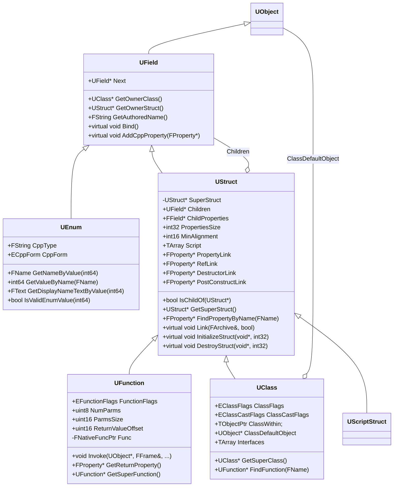
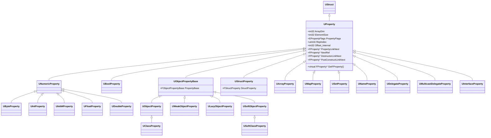
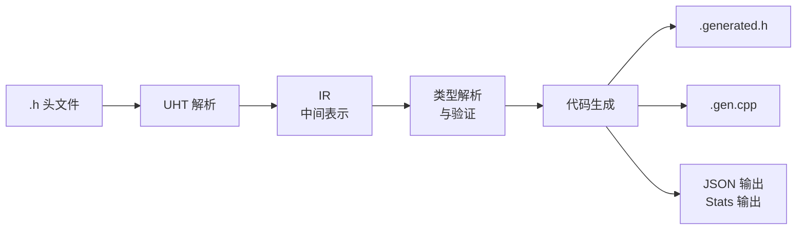
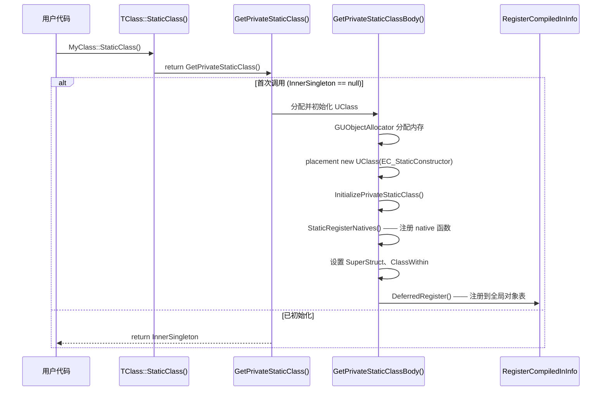
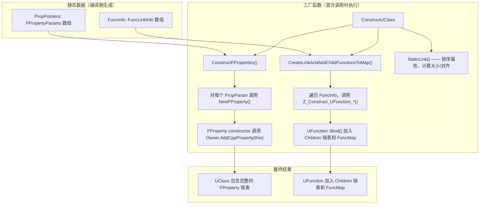

# UE C++ 反射系统

## UE C++ 反射的用法

### 基础用法

#### 获取类型信息

使用 UE 引擎的类创建器，继承 `UObject`，创建一个类 `UMyClass`，其头文件如下：

```cpp
#pragma once

#include "CoreMinimal.h"
#include "UObject/NoExportTypes.h"
#include "MyClass.generated.h"


UCLASS()
class UNLUA_UE_5_5_4_API UMyClass : public UObject
{
    GENERATED_BODY()
};
```

其中，
1. 声明了一个类 `UMyClass`，它继承自 `UObject`，并使用了 `UCLASS()` 宏标记。
1. `#include "MyClass.generated.h"` 是 UHT 自动生成的头文件，包含了 `UMyClass` 的反射数据，必须是最后一个 `#include` 的头文件
1. `GENERATED_BODY()` 宏会展开为 `UMyClass` 的构造函数、反射数据等。

在 UE C++ 中，获取 `UMyClass` 的静态类型：

```cpp
UClass* myClass = UMyClass::StaticClass();
```

类似于 C# 中：

```cs
Type myClass = typeof(MyClass);
```

在 UE C++ 中，获取 `UMyClass` 的对象的运行时类型：

```cpp
UClass* myClass = myObject->GetClass();
```

类似于 C# 中：

```cs
Type myClass = myObject.GetType();
```

UE C++ 中获取 `MyClass` 的基类：

```cpp
UClass* myClass = MyClass::StaticClass();
UClass* superClass = myClass->GetSuperClass();
```

类比于 C# 中：

```cs
Type myClass = typeof(MyClass);
Type superClass = myClass.BaseType;
```

#### 获取成员变量

声明一个成员变量，并用 `UPROPERTY` 宏标记：
```cpp
UPROPERTY()
int MyIntProperty;
```

UE C++ 中获取该成员变量，并赋值：

```cpp
UClass* myClass = myObject->GetClass();
UProperty* myProperty = myClass->FindPropertyByName(TEXT("MyIntProperty"));
if(myProperty != nullptr)
{
    // 获取成员变量的值
    int32* myIntValue = myProperty->ContainerPtrToValuePtr<int32>(myObject);
    if(myIntValue != nullptr)
    {
        *myIntValue = 42; // 赋值
    }
}
```

类比于 C# 中：

```cs
Type myClass = myObject.GetType();
FieldInfo myProperty = myClass.GetField("MyIntProperty");
if(myProperty != null)
{
    // 获取成员变量的值
    int myIntValue = (int)myProperty.GetValue(myObject);
    myProperty.SetValue(myObject, 42); // 赋值
}
```

#### 获取成员函数

声明一个成员函数，并用 `UFUNCTION` 宏标记：

```cpp
UFUNCTION()
float MyFunction(int, float);
```

UE C++ 中获取该成员函数，并调用：

```cpp
UClass* myClass = myObject->GetClass();
UFunction* myFunction = myClass->FindFunctionByName(TEXT("MyFunction"));
if(myFunction != nullptr)
{
    // 参数列表
    struct FMyFunctionParams
    {
        int a;
        float b;
    };
    FMyFunctionParams params;
    params.a = 3;
    params.b = 4.5f;

    // 创建一个函数局部执行栈帧
    FFrame Stack(myObject, myFunction, &params, NULL, myFunction->ChildProperties);

    // 返回值
    float ret;

    // 调用函数
    myFunction->Invoke(myObject, Stack, &ret); // 或者调用 UObject::ProcessEvent 函数
}
```

更简单的方式是使用 `UObject::ProcessEvent` 函数：

```cpp
UClass* myClass = myObject->GetClass();
UFunction* myFunction = myClass->FindFunctionByName(TEXT("MyFunction"));
if(myFunction != nullptr)
{
    struct FMyFunctionParams
    {
        int a;
        float b;
        float ret;
    };
    FMyFunctionParams params;
    params.a = 3;
    params.b = 4.5f;

    // 调用函数
    myObject->ProcessEvent(myFunction, &params);

    // 返回值
    float ret = params.ret;
}
```

类比于 C# 中：
```cs
Type myClass = typeof(MyClass);
MethodInfo myFunction = myClass.GetMethod("MyFunction");
if(myFunction != null)
{
    // 参数列表
    object[] params = new object[] { ... };

    // 调用函数
    object ret = myFunction.Invoke(myObject, parameters);
}
```
#### 类型转换

UE C++ 中类型转换：
```cpp
UClass* myClass = myObject->GetClass();
if (myClass->IsChildOf(AMyActor::StaticClass()))
{
    AMyActor* myActor = Cast<AMyActor>(myObject);
}
```
类比于 C# 中：
```cs
Type myClass = myObject.GetType();
if (typeof(AMyActor).IsAssignableFrom(myClass))
{
    AMyActor myActor = myObject as AMyActor;
}
```

### UE C++ 元数据

UE 元数据（Metadata）是附加在类型、属性、函数上的 **键值对**，使用 `meta=(Key=Value, ...)` 语法嵌入反射宏中。元数据本身不参与运行时代码逻辑——由 C++ 编译器完全忽略——而是由 UHT 解析后编译进反射数据，供编辑器和蓝图系统消费。

#### 元数据的声明

元数据可以附加在以下反射宏的 meta 参数中，填写键值对，键和值都是字符串：
```cpp
UCLASS(meta=(AMyActorMember, MyName = "FirstClass"))
class UMyClass : public UObject
{
    GENERATED_BODY()

    UPROPERTY(meta=(DefaultValue = "10"))
    int MyIntProperty;

    UFUNCTION(meta=(ADefaultValue = "100", BDefaultValue = "3.1415926"))
    float MyFunction(int a, float b);
};
```

类比于 C# 中的 Attribute：
```cs
public class MyClassAttribute : Attribute
{
    public bool AMyActorMember = true;
    public string MyName { get; set; }

    public MyClassAttribute(string myName)
    {
        MyName = myName;
    }
}

public class  MyIntFieldAttribute : Attribute
{
    public int DefaultValue { get; set; }

    public MyIntFieldAttribute(int defaultValue) 
    {
        DefaultValue = defaultValue;
    }
}

public class MyFunctionAttribute : Attribute
{
    public int ADefaultValue { get; set; }

    public float BDefaultValue { get; set; }

    public MyFunctionAttribute(int a, float b)
    {
        ADefaultValue = a;
        BDefaultValue = b;
    }
}

[MyClassAttribute("FirstClass")]
public class MyClass
{
    [MyIntFieldAttribute(10)]
    public int MyIntProperty;

    [MyFunctionAttribute(100, 3.1415926f)]
    public float MyFunction(int a, float b)
    {
        float sum = a;
        sum += b;
        return sum;
    }
}
```

#### 元数据的获取与使用

在 UE C++ 中，通过 `GetMetaData(Key)` 系列 API 获取元数据值，返回字符串或转换后的类型。

```cpp
UClass* myClass = myClassProperty->GetClass();

if (myClass->HasMetaData("AMyActorMember"))
{
    UE_LOG(LogTemp, Warning, TEXT("AMyActor::BeginPlay - AMyActorMember metadata found."));
}

if (myClass->HasMetaData("MyName"))
{
    FString myName = myClass->GetMetaData("MyName");
    UE_LOG(LogTemp, Warning, TEXT("AMyActor::BeginPlay - MyName: %s"), *myName);
}

FProperty* intProperty = myClass->FindPropertyByName(TEXT("MyIntProperty"));
if (intProperty != nullptr && intProperty->HasMetaData(TEXT("DefaultValue")))
{
    int32 defaultValue = intProperty->GetIntMetaData(TEXT("DefaultValue"));
    int32* propPtr = intProperty->ContainerPtrToValuePtr<int32>(myClassProperty);
    if (propPtr!=nullptr)
    {
        *propPtr = defaultValue;
        UE_LOG(LogTemp, Warning, TEXT("AMyActor::BeginPlay - MyIntProperty value: %d"), *propPtr);
    }
}

UFunction* myFunction = myClass->FindFunctionByName(TEXT("MyFunction"));
if (myFunction != nullptr)
{
    if (myFunction->HasMetaData("ADefaultValue") && myFunction->HasMetaData("BDefaultValue"))
    {
        int32 aDefaultValue = myFunction->GetIntMetaData("ADefaultValue");
        float bDefaultValue = myFunction->GetFloatMetaData("BDefaultValue");
        UE_LOG(LogTemp, Warning, TEXT("AMyActor::BeginPlay - MyFunction default values: A=%d, B=%f"), aDefaultValue, bDefaultValue);

        struct FMyFunctionParams
        {
            int a;
            float b;
            float ret;
        };
        FMyFunctionParams params;
        params.a = aDefaultValue;
        params.b = bDefaultValue;
        myClassProperty->ProcessEvent(myFunction, &params);
        UE_LOG(LogTemp, Warning, TEXT("AMyActor::BeginPlay - MyFunction returned: %f"), params.ret);
    }
}
```

类比于 C# 中的 Attribute 获取：

```cs
Type myClass = myObject.GetType();

MyClassAttribute classAttr = myClass.GetCustomAttribute<MyClassAttribute>();
if(classAttr != null)
{
    Console.WriteLine(classAttr.MyName);
}

FieldInfo intProperty = myClass.GetField("MyIntProperty");
if(intProperty != null)
{
    MyIntFieldAttribute propValue = intProperty.GetCustomAttribute<MyIntFieldAttribute>();
    if(propValue != null)
    {
        intProperty.SetValue(myObject, propValue.DefaultValue);
        Console.WriteLine((int)intProperty.GetValue(myObject));
    }
}

MethodInfo myFunction = myClass.GetMethod("MyFunction");
if(myFunction != null)
{
    MyFunctionAttribute funcAttr = myFunction.GetCustomAttribute<MyFunctionAttribute>();
    if(funcAttr != null)
    {
        float result = (float)myFunction.Invoke(myObject, new object[] { funcAttr.ADefaultValue, funcAttr.BDefaultValue });
        Console.WriteLine($"Result of MyFunction: {result}");
    }
}
```


UE 的元数据和 C# 的 Attribute 都是"为类型/成员附加声明性注释"的机制，但设计理念、工作方式和运行时使用存在本质差异：
1. UE C++：嵌入在反射宏中，逗号分隔，无类型系统
2. C#：独立的类实例化语法，有完整的类型系统

运行时查询性能对比：

```cpp
// UE C++ —— O(n) 遍历键值对 Map，字符串匹配
const FString& Val = Property->GetMetaData(TEXT("ClampMin"));
float Min = FCString::Atof(*Val);  // 手动类型转换
```

```csharp
// C# —— O(1) 类型查找，强类型返回值
var attr = property.GetCustomAttribute<RangeAttribute>();
if (attr != null) { float min = (float)attr.Minimum; }
```

UE 的元数据查询本质上是一次 `TMap<FName, FString>` 查找，配合手动的 `FCString::Atof`/`Atoi`。C# 的 Attribute 在编译期嵌入程序集元数据表，运行时通过 Type 索引查找，并且不需要额外的字符串到数值的转换。

| 维度 | UE C++ MetaData | C# Attribute |
|------|-----------------|--------------|
| **本质** | 纯字符串键值对 | 类型化的类实例 |
| **类型安全** | 无——所有值都是字符串，缺少编译期类型检查 | 有——构造函数和属性参数都有类型约束 |
| **自定义扩展** | 无需编码——直接写任意键值对，UHT 原样传递 | 必须继承 `System.Attribute` 编写新类 |
| **复杂参数** | 只能传递字符串，复杂数据需约定编码 | 支持任意类型（基本类型、枚举、Type） |
| **声明点** | 嵌入 UHT 宏内，逗号分隔，一张平板列表 | 独立 `[Brackets]`，可多行，类层次清晰 |
| **继承行为** | 取决于 UHT 的 specifier 定义（有的继承有的不继承） | `AttributeUsage.Inherited` 显式控制 |
| **多实例** | 一个键只能有一个值 | `AllowMultiple = true` 支持同 Attribute 多次 |
| **目标筛选** | UHT 通过 `[PropertyMetadata]`/`[ClassMetadata]` 等注释标记适用范围 | `AttributeTargets` 枚举声明可附加的目标 |
| **程序化生成** | 由 UHT 在编译前解析为 `.gen.cpp` 静态数据 | 编译器原生支持，嵌入程序集元数据 |
| **运行时访问** | 通过字符串 Key 查找 `GetMetaData("Key")` | 通过类型 `GetCustomAttribute<T>()` |

#### 引擎内置常用属性元数据

| 元数据 | 适用类型 | 说明 |
|--------|---------|------|
| `ClampMin="0"` `ClampMax="100"` | 数值类型 | 编辑器 UI 滑条的最小/最大值 |
| `UIMin="0"` `UIMax="100"` | 数值类型 | 滑条端点 |
| `Delta="5"` | 数值类型 | 滑条步长 |
| `Units="cm/s"` | 数值类型 | 单位转换显示 |
| `DisplayName="显示名"` | 所有 | 编辑器/蓝图中显示的名称 |
| `EditCondition="bEnable"` | 所有 | 基于布尔属性的条件编辑 |
| `EditConditionHides` | 所有 | 条件不满足时隐藏（需配合 EditCondition） |
| `AllowedClasses="AActor"` | 对象引用 | 限制资产选择器中显示的类 |
| `MetaClass="UMyBaseClass"` | 子类引用 | 限制类选择器中的父类 |
| `BlueprintBaseOnly` | 类引用 | 只显示蓝图类 |
| `MustImplement="IMyInterface"` | 类引用 | 严格要求实现指定接口 |
| `ExposeOnSpawn` | 所有 | Actor 生成时暴露为引脚 |
| `GetOptions="FuncName"` | FName/FString | 通过 UFunction 动态生成选项列表 |
| `ArrayClamp="ArrayProperty"` | int32 | 限制值在 0 到数组长度之间 |
| `MakeEditWidget` | FTransform/FRotator | 在视口中显示可交互控件 |
| `MakeStructureDefaultValue` | FStructProperty | 指定蓝图 Make 节点的默认值 |
| `MultiLine` | FString/FText | 多行编辑框 |
| `PasswordField` | FString/FText | 密码输入框 |
| `TitleProperty` | 结构体数组 | 指定折叠时的摘要属性 |
| `HideAlphaChannel` | FColor/FLinearColor | 隐藏 Alpha 通道 |
| `Untracked` | 软引用 | 不追踪此引用（不烹饪/不修复重定向器） |
| `ScriptNoExport` | 所有 | 不导出到脚本语言 |

#### 引擎内置常用常用函数元数据

| 元数据 | 说明 |
|--------|------|
| `DisplayName="显示名"` | 蓝图节点标题 |
| `DeprecatedFunction` | 标记为已废弃 |
| `DeprecationMessage="请用 X"` | 废弃提示信息 |
| `ReturnDisplayName="Result"` | 返回值引脚名称 |
| `InternalUseParam` | 参数内部使用，隐藏且不可连接 |
| `Variadic` | 函数接受可变参数 |
| `ForceAsFunction` | 强制无返回值函数在蓝图中出现 |

#### 引擎内置常用常用类元数据

| 元数据 | 说明 |
|--------|------|
| `BlueprintSpawnableComponent` | ActorComponent 可被蓝图生成 |
| `IsBlueprintBase="true"` | 类可作为蓝图基类 |
| `KismetHideOverrides="Event1,Event2"` | 禁止覆盖的事件列表 |
| `ShowWorldContextPin` | 蓝图节点显示 WorldContext 引脚 |
| `DeprecatedNode` | 类在蓝图中已废弃 |
| `ChildCanTick` / `ChildCannotTick` | 子类 Tick 行为控制 |
| `BlueprintThreadSafe` | 标记蓝图函数库线程安全 |
| `UsesHierarchy` | 启用层级编辑 |

<!-- 
### GetClassMetaData —— 将元数据字符串解析为 UClass 指针

在前文的运行时查询 API 表中，`GetClassMetaData(Key)` 是一个特殊的元数据查询方法：它不像 `GetMetaData(Key)` 那样返回原始字符串，而是直接将元数据值解析为 `UClass*` 指针。

#### 内部实现

`GetClassMetaData` 本质上是 `GetMetaData` + `UClass::TryFindTypeSlow` 的组合调用。源码位于 [Field.cpp:752-763](f:\GitHub\UnrealEngine\Engine\Source\Runtime\CoreUObject\Private\UObject\Field.cpp#L752)：

```cpp
// FField::GetClassMetaData 的实现（简化）
UClass* FField::GetClassMetaData(const FName& Key) const
{
    const FString& ClassName = GetMetaData(Key);               // ① 取出字符串
    UClass* FoundClass = UClass::TryFindTypeSlow<UClass>(ClassName); // ② 字符串→UClass*
    return FoundClass;
}
```

**解析流程**：

1. **`GetMetaData(Key)`** — 从 `TMap<FName, FString>` 中取出元数据的原始字符串值，例如 `"/Script/Engine.Blueprint"` 或 `"UMyInterface"` 或短名 `"MyBlueprintClass"`。
2. **`UClass::TryFindTypeSlow<T>(ClassName)`** — 在所有已知的 UPackage 中，通过对象名查找已加载的 UClass。返回 `UClass*`，找不到则返回 `nullptr`。

`TryFindTypeSlow` 是路径感知的：

| 元数据中存储的格式 | 查找行为 |
|---|---|
| 完整路径 `/Script/Engine.AnimBlueprint` | 直接在指定 Package 中查找类型 |
| 简单名称 `MyClass` | 遍历所有已知 Package 查找 |
| 短路径 `Engine.Actor` | 在 `Engine` Package 中查找 |

#### 主要使用场景

##### 场景 1：MustImplement —— 限制引用必须实现指定接口

当在 `UPROPERTY` 上使用 `meta=(MustImplement="IMyInterface")` 时，编辑器属性面板会校验所选对象是否实现了该接口：

```cpp
// 声明：限制引用对象必须实现 UDamageType 接口
UPROPERTY(EditAnywhere, Category="Combat",
    meta=(MustImplement="/Script/Engine.DamageType"))
TSubclassOf<UObject> DamageTypeClass;
```

编辑器内部通过 `GetClassMetaData` 获取接口的 `UClass*` 指针，然后对用户选择的每个类进行 `IsChildOf` 检查：

```cpp
// 引擎内部使用方式（PropertyHandleImpl.cpp:3295）
UClass* InterfaceThatMustBeImplemented =
    Property->GetOwnerProperty()->GetClassMetaData(TEXT("MustImplement"));

// 验证用户选择的类是否实现了该接口
if (InterfaceThatMustBeImplemented)
{
    for (const FAssetData& Asset : FilteredAssets)
    {
        UClass* AssetClass = Asset.GetClass();
        if (!AssetClass->ImplementsInterface(InterfaceThatMustBeImplemented))
        {
            // 过滤掉不实现的类
        }
    }
}
```

##### 场景 2：MetaClass —— 为 TSubclassOf 指定基类

TSubclassOf 属性本身已通过模板参数限定了基类，但 `meta=(MetaClass="...")` 可以在**软引用路径**（FSoftClassPath）上动态指定基类限制：

```cpp
// 声明：软类引用的基类限制
UPROPERTY(EditAnywhere, Category="AI",
    meta=(MetaClass="/Script/AIModule.AIController"))
FSoftClassPath AIControllerClass;
```

编辑器在处理软类路径选择器时，通过 `GetClassMetaData` 解析 `MetaClass`，限制选择器中显示的类：

```cpp
// 引擎内部使用方式（PropertyEditorHelpers.cpp:731）
UClass* MetaClass = NodeProperty->GetOwnerProperty()->GetClassMetaData(TEXT("MetaClass"));
if (MetaClass)
{
    // 限制类选择器只显示 MetaClass 及其子类
    PropertyCustomizationHelpers::FilterClassPicker(RequiredClass, MetaClass, ...);
}
```

##### 场景 3：自定义元数据 —— 存储任意类引用

你可以用任意键名存储类引用，然后通过 `GetClassMetaData` 统一解析：

```cpp
// 声明
UPROPERTY(EditAnywhere, meta=(ValidatorClass="/Script/MyGame.MyValidator"))
UObject* TargetObject;

// 运行时查询
FProperty* Prop = MyClass->FindPropertyByName(TEXT("TargetObject"));
UClass* ValidatorClass = Prop->GetClassMetaData(TEXT("ValidatorClass"));
if (ValidatorClass)
{
    // 直接创建验证器实例
    UMyValidator* Validator = NewObject<UMyValidator>(GetTransientPackage(), ValidatorClass);
    Validator->Validate(TargetObject);
}
```

#### GetClassMetaData 的注意事项

| 注意事项 | 说明 |
|---------|------|
| 类型安全 | 元数据值是纯字符串，如果类名写错或被重命名，`TryFindTypeSlow` 返回 `nullptr`，**编译期和运行时都没有错误提示** |
| 加载顺序 | 依赖的目标类必须先被加载到内存中。如果目标类所在的 Package 尚未加载，`TryFindTypeSlow` 可能返回 `nullptr` |
| 路径格式 | 推荐使用完整路径 `/Script/ModuleName.ClassName`，避免命名冲突 |
| 性能 | `TryFindTypeSlow` 是 O(n) 全局查找，不应在每帧调用的热路径中使用 |
| 空处理 | 始终检查返回值是否为 `nullptr` |

#### 与 C# 对比

C# 的 Attribute 系统可以直接在 Attribute 构造函数或属性中传递 `Type` 对象，无需字符串中间层：

**UE C++（字符串 → 运行时查找）：**

```cpp
// 元数据中存储的是类名字符串
UPROPERTY(meta=(MustImplement="/Script/Engine.DamageType"))
TSubclassOf<UObject> DamageTypeClass;

// 运行时：字符串 → TryFindTypeSlow → UClass*
UClass* InterfaceClass = Property->GetClassMetaData(TEXT("MustImplement"));
// 可能返回 nullptr，无编译期保证
```

**C#（Type 对象直接传递）：**

```csharp
// Attribute 中直接接受 Type 参数（类型安全）
[AttributeUsage(AttributeTargets.Property)]
public class MustImplementAttribute : Attribute
{
    public Type InterfaceType { get; }  // Type 对象，不是字符串
    public MustImplementAttribute(Type interfaceType)
    {
        if (!interfaceType.IsInterface)  // 编译即知是否为接口
            throw new ArgumentException("Must be an interface type");
        InterfaceType = interfaceType;
    }
}

// 使用时传入 typeof，编译期验证类型存在
[MustImplement(typeof(IDamageType))]
public Type DamageTypeClass { get; set; }

// 运行时查询 —— 结果已是强类型 Type 对象，无需字符串解析
var attr = property.GetCustomAttribute<MustImplementAttribute>();
Type interfaceType = attr.InterfaceType;  // 永不返回 null，无需 TryFind
```

**核心差异总结：**

| | UE GetClassMetaData | C# typeof in Attribute |
|---|---|---|
| **存储形式** | 字符串（`"/Script/Engine.Actor"`） | `System.Type` 元数据令牌 |
| **编译期类型验证** | 无——类名写错只在运行时发现（返回 null） | 有——`typeof(X)` 要求 X 必须在当前程序集可见 |
| **重构安全** | 不安全——类改名后元数据字符串不会自动更新 | 安全——IDE 重命名自动更新 `typeof()` 引用 |
| **运行时解析** | `TryFindTypeSlow` 全局字符串搜索 | 直接读程序集元数据表，O(1) |
| **可空性** | 返回 `nullptr`，必须判空 | `Type` 对象非空（除非显式传 `null`） |
| **灵活性** | 高——可在运行时动态指定任意尚未加载的类名 | 低——必须编译时引用目标类型 |

这种差异再次体现了 UE **"字符串为王"** 的设计哲学：牺牲编译期安全换取声明时的灵活性和低耦合（声明方不需要 `#include` 目标类的头文件）。而 C# 选择了 **"类型为王"** 的路径：宁可要求编译期依赖，也要保证类型引用的正确性。

 -->

### UE C++ 与 C# 反射系统对比

||UE C++|C#|
|---|---|---|
|成员基类|`UField`|`MemberInfo`|
|函数|`UFunction`|`MethodInfo`|
|属性|`FProperty`|`FieldInfo`|
|类型|`UClass`|`Type`|
|获取静态类型|`UObject::StaticClass()`|`typeof(MyClass)`|
|获取运行时类型|`UObject::GetClass()`|`Object::GetType()`|
|获取类型名|`UClass::GetName()`|`MemberInfo::Name`|
|获取基类|`UClass::GetSuperClass()`|`Type::BaseType`|
|获取成员函数|`UClass::FindFunctionByName(FName)`|`Type::GetMethod(string)`|
|获取成员变量|`UClass::FindPropertyByName(FName)`|`Type::GetField(string)`|
|元数据| `meta=(Key=Value)`|`[Attribute]`|
|获取元数据| `UField::GetMetaData(FName)` | `MemberInfo::GetCustomAttribute(Type)`|

> 旧版 UE C++ 反射系统，`UProperty` 表示属性，同样继承自成员基类 `UField`，这与 C# 的 `FieldInfo` 继承自 `MemberInfo` 类似。在新版的 UE C++ 反射系统中，用 `FProperty` 代替了 `UProperty`，它不继承自 `UField`。

---
## UField 继承层级与 FProperty

### 类图

UE C++ 反射的实现依赖 UField 及其子类型，类图如下：



`Property` 在不同的 UE 版本中，有两套实现。新版使用 `FField` 体系（轻量级，不继承 `UObject`），旧版使用 `UProperty` 体系（继承 `UObject`）。当前引擎默认使用新版 `FProperty`，旧版仅在序列化兼容或某些特殊场景中使用。

---

### 新版 FProperty 继承层级

定义于 [Runtime/CoreUObject/Public/UObject/UnrealType.h](f:\GitHub\UnrealEngine\Engine\Source\Runtime\CoreUObject\Public\UObject\UnrealType.h)，不继承自 `UObject`，而是继承自轻量级的 `FField`。

```mermaid
classDiagram
    FFieldClass *-- "类型元对象" FField
    FField <|-- FProperty

    FProperty <|-- FNumericProperty
    FNumericProperty <|-- FByteProperty
    FNumericProperty <|-- FInt8Property
    FNumericProperty <|-- FInt16Property
    FNumericProperty <|-- FIntProperty
    FNumericProperty <|-- FInt64Property
    FNumericProperty <|-- FUInt16Property
    FNumericProperty <|-- FUInt32Property
    FNumericProperty <|-- FUInt64Property
    FNumericProperty <|-- FFloatProperty
    FNumericProperty <|-- FDoubleProperty
    FProperty <|-- FBoolProperty
    FProperty <|-- FObjectPropertyBase
    FObjectPropertyBase <|-- FObjectProperty
    FObjectPropertyBase <|-- FWeakObjectProperty
    FObjectPropertyBase <|-- FLazyObjectProperty
    FObjectPropertyBase <|-- FSoftObjectProperty
    FObjectProperty <|-- FClassProperty
    FSoftObjectProperty <|-- FSoftClassProperty
    FProperty <|-- FStructProperty
    FProperty <|-- FArrayProperty
    FProperty <|-- FMapProperty
    FProperty <|-- FSetProperty
    FProperty <|-- FNameProperty
    FProperty <|-- FDelegateProperty
    FProperty <|-- FMulticastDelegateProperty
    FMulticastDelegateProperty <|-- FMulticastInlineDelegateProperty
    FMulticastDelegateProperty <|-- FMulticastSparseDelegateProperty
    FProperty <|-- FInterfaceProperty

    FField o-- FFieldClass : ClassPrivate
    FField o-- FFieldVariant : Owner
    FProperty o-- FProperty : PropertyLinkNext / NextRef

    class FFieldClass {
        +FName Name
        +int64 Id
        +uint64 CastFlags
        +EClassFlags ClassFlags
        +FFieldClass* SuperClass
        +FField* DefaultObject
        +FField* (*ConstructFn)(FFieldVariant&, FName&, EObjectFlags)
    }
    class FField {
        -FFieldClass* ClassPrivate
        +FField* Next
        +FFieldVariant Owner
        +FName NamePrivate
        +EObjectFlags FlagsPrivate
        +virtual void Serialize(FArchive&)
        +virtual void PostLoad()
        +virtual void AddReferencedObjects(FReferenceCollector&)
        +void AddCppProperty(FProperty*)
        +void Bind()
        +bool IsA(const FFieldClass*)
        +bool IsNative()
        +UObject* GetOwnerUObject()
    }
    class FProperty {
        +int32 ArrayDim
        +int32 ElementSize
        +EPropertyFlags PropertyFlags
        +uint16 RepIndex
        +int32 Offset_Internal
        +FProperty* PropertyLinkNext
        +FProperty* NextRef
        +FProperty* DestructorLinkNext
        +FProperty* PostConstructLinkNext
        +virtual bool Identical(const void*, const void*, uint32)
        +virtual void CopySingleValue(void*, const void*)
        +virtual void SerializeItem(FStructuredArchive::FSlot, void*, void const*)
        +virtual bool NetSerializeItem(FArchive&, UPackageMap*, void*, TArray<uint8>*)
        +virtual void ExportTextItem(FString&, const void*, const void*, UObject*, int32)
        +virtual const TCHAR* ImportText(const TCHAR*, void*, int32, UObject*, FOutputDevice*)
        +FORCEINLINE int32 GetOffset_ForDebug()
        +FORCEINLINE int32 GetSize()
        +FORCEINLINE bool IsA(const FFieldClass*)
        +FProperty* GetOwnerProperty()
    }
    class FNumericProperty {
        +virtual bool IsInteger()
        +virtual bool IsFloatingPoint()
        +virtual void SetIntPropertyValue(void*, uint64)
        +virtual void SetFloatingPointPropertyValue(void*, double)
    }
    class FBoolProperty {
        +uint8 FieldSize
        +uint8 ByteOffset
        +uint8 FieldMask
        +bool IsNativeBool()
        +void SetBitfieldValue(void*, bool)
    }
    class FObjectPropertyBase {
        +TObjectPtr<UClass> PropertyClass
        +UClass* GetPropertyClass()
        +void SetObjectPropertyValue(void*, UObject*)
    }
    class FStructProperty {
        +UScriptStruct* Struct
        +UScriptStruct* GetStruct()
    }
    class FArrayProperty {
        +FProperty* Inner
    }
    class FMapProperty {
        +FProperty* KeyProp
        +FProperty* ValueProp
    }
    class FSetProperty {
        +FProperty* ElementProp
    }
    class FFieldVariant {
        -FFieldObjectUnion Container
        +bool IsUObject()
        +bool IsField()
        +UObject* ToUObject()
        +FField* ToField()
    }
```



---

### 旧版 UProperty 继承层级

定义于 [Runtime/CoreUObject/Public/UObject/UnrealTypePrivate.h](f:\GitHub\UnrealEngine\Engine\Source\Runtime\CoreUObject\Public\UObject\UnrealTypePrivate.h)，继承自 `UObject`（经由 `UField → UStruct → UProperty`），是 UE4 时代的遗留实现，用于兼容旧版序列化数据。



**新版 FProperty 与旧版 UProperty 的关键区别：**

| 维度 | 新版 FProperty | 旧版 UProperty |
|------|---------------|---------------|
| **继承链** | `FField → FProperty`（轻量级） | `UObject → UField → UStruct → UProperty`（全UObject开销） |
| **内存开销** | ~128 字节 | ~256+ 字节（含 UObject 头部） |
| **GC 参与** | 不参与 GC（通过所有者 UObject 间接引用） | 参与 GC |
| **运行时创建** | 静态参数 + `NewFProperty<>()` | `NewObject<>()` |
| **类型识别** | `FFieldClass*` + `IsA()` | `UClass*` + `Cast<>()` |

---

### 成员说明

#### UField —— 反射数据的基类

[Class.h:156-350](f:\GitHub\UnrealEngine\Engine\Source\Runtime\CoreUObject\Public\UObject\Class.h#L156)

`UField` 是所有反射类型（`UEnum`、`UStruct`、`UClass`、`UFunction`）的基类。它提供了一个 **`Next` 链表指针**，使子 `UField` 可以链接在父 `UStruct` 的 `Children` 链表上。

**关键成员变量：**

| 成员 | 类型 | 说明 |
|------|------|------|
| `Next` | `UField*` | 链表指针，形成 `Children` 链表 |

**关键成员函数：**

| 函数 | 说明 |
|------|------|
| `AddCppProperty(FProperty*)` | virtual，向此 Field 添加一个属性（新版 FProperty） |
| `Bind()` | virtual，绑定此 Field 到其 C++ 对应物，由子类重写 |
| `GetOwnerClass()` | 沿 Outer 链向上查找所属的 `UClass` |
| `GetOwnerStruct()` | 沿 Outer 链向上查找所属的 `UStruct` |
| `GetAuthoredName()` | 返回创建时指定的"作者名"（默认同 `GetName()`） |

**元数据查询（`#if WITH_METADATA` 保护）：**

| 函数 | 说明 |
|------|------|
| `HasMetaData(Key)` | 检查是否有指定 key 的元数据 |
| `FindMetaData(Key)` | 查找指定 key 的元数据值（返回 `const FString*`） |
| `GetMetaData(Key)` | 获取指定 key 的元数据值（返回 `const FString&`） |
| `SetMetaData(Key, Value)` | 设置元数据键值对 |
| `GetBoolMetaData(Key)` | 将元数据值解析为 bool |
| `GetIntMetaData(Key)` | 将元数据值解析为 int32 |
| `GetFloatMetaData(Key)` | 将元数据值解析为 float |
| `GetClassMetaData(Key)` | 将元数据值（字符串类路径）通过 `TryFindTypeSlow` 解析为 `UClass*` |
| `RemoveMetaData(Key)` | 清除某 key 的元数据 |
| `GetMetaDataText(Key)` | 获取本地化的元数据文本 |

---

#### UStruct —— 容纳 Field 的结构体

[Class.h:386-582](f:\GitHub\UnrealEngine\Engine\Source\Runtime\CoreUObject\Public\UObject\Class.h#L386)

`UStruct` 是**所有能容纳子 `UField` 的类型的基类**——`UClass` 和 `UScriptStruct` 都继承自它。它维护了两条并行的链表：

- **`Children`**（`UField*`）——旧版反射链表，连接所有 `UField` 子对象（`UFunction`、`UEnum` 等）
- **`ChildProperties`**（`FField*`）——新版反射链表，连接所有 `FProperty` 子对象

**关键成员变量：**

| 成员 | 类型 | 说明 |
|------|------|------|
| `SuperStruct` | `UStruct*` (private) | 继承自的父结构体，可为 null |
| `Children` | `UField*` (public) | 子 `UField` 链表头。通过 `Next` 链接，包含 `UFunction`、内嵌 `UEnum` 等 |
| `ChildProperties` | `FField*` (public) | 子 `FProperty` 链表头。通过 `FField::Next` 链接 |
| `PropertiesSize` | `int32` | 所有属性的总大小，实际分配可能更大（受对齐影响） |
| `MinAlignment` | `int32` | 内存对齐要求，结构体至少为这个大小 |
| `Script` | `TArray<uint8>` | 蓝图字节码（仅 `UFunction` 有意义） |
| `PropertyLink` | `FProperty*` | **运行时链表**：从最派生到基类的属性链表，用于迭代序列化 |
| `RefLink` | `FProperty*` | **运行时链表**：所有包含对象引用的属性 |
| `DestructorLink` | `FProperty*` | **运行时链表**：需要析构的属性（不包含由 C++ 原生析构函数处理的） |
| `PostConstructLink` | `FProperty*` | **运行时链表**：构造后需要初始化的属性 |
| `ScriptAndPropertyObjectReferences` | `TArray<UObject*>` | 嵌入在字节码和属性中的对象引用（供 GC 使用） |

**关键成员函数：**

| 函数 | 说明 |
|------|------|
| `GetSuperStruct()` | 获取父结构体 |
| `IsChildOf(UStruct*)` | 判断是否继承自指定结构体。使用 OuterWalk 或 StructArray 两种实现策略（通过 `USTRUCT_FAST_ISCHILDOF_IMPL` 控制） |
| `FindPropertyByName(FName)` | 在属性链表中按名称搜索 `FProperty` |
| `Link(FArchive&, bool)` | **核心函数**：创建属性/字段链表并使结构体可运行时使用。排序属性、计算内存布局、构建 `PropertyLink`/`RefLink`/`DestructorLink`/`PostConstructLink` 链 |
| `StaticLink(bool)` | `Link()` 的静态包装，使用虚拟 Archive |
| `InitializeStruct(void*, int32)` | 在未初始化的内存上初始化结构体（调用 C++ 构造函数或逐个初始化属性） |
| `DestroyStruct(void*, int32)` | 销毁内存中的结构体（调用 C++ 析构函数或逐个销毁属性） |
| `SerializeBin(FArchive&, void*)` | 对结构体进行二进制序列化（不处理默认值差异） |
| `SerializeBinEx(FStructuredArchive::FSlot, void*, void const*, UStruct*)` | 二进制序列化属性数据，只写入与默认值不同的部分 |
| `SerializeTaggedProperties(FStructuredArchive::FSlot, uint8*, UStruct*, uint8*)` | 使用 **属性标签**（Property Tags）进行序列化，处理名称匹配和版本兼容 |
| `GetStructPathName()` | 返回 `FTopLevelAssetPath`（Package + 结构体名） |
| `InstanceSubobjectTemplates(...)` | 对结构体中的组件引用递归创建实例副本 |

---

#### UFunction —— 反射函数

[Class.h:1938-2100](f:\GitHub\UnrealEngine\Engine\Source\Runtime\CoreUObject\Public\UObject\Class.h#L1938)

`UFunction` 表示一个可被反射系统调用的函数。它的 **参数也是 `FProperty` 子对象**，挂在 `ChildProperties` 链表上，每个参数的 `FProperty` 以 `UFunction` 为 Outer。

**UFunction 的参数内存布局：**

```
[参数1 | 参数2 | ... | 返回值]  ← 连续内存块
 ↑ ParmsSize                  ↑ ReturnValueOffset
```

**关键成员变量：**

| 成员 | 类型 | 说明 |
|------|------|------|
| `FunctionFlags` | `EFunctionFlags` | 函数标志：`FUNC_BlueprintCallable`、`FUNC_Native`、`FUNC_Net`、`FUNC_NetServer` 等 |
| `NumParms` | `uint8` | 参数总数 |
| `ParmsSize` | `uint16` | 所有参数在内存中的总大小 |
| `ReturnValueOffset` | `uint16` | 返回值在参数内存中的偏移量（在 `InitializeDerivedMembers()` 中初始化） |
| `RPCId` | `uint16` | 此 RPC 函数的调用 ID（需要 `FUNC_Net`） |
| `RPCResponseId` | `uint16` | 对应响应调用的 ID（需要 `FUNC_Net & FUNC_NetService`） |
| `FirstPropertyToInit` | `FProperty*` | 指向第一个需要在调用前初始化的本地 struct 属性的指针 |
| `Func` | `FNativeFuncPtr` (private) | 绑定的 C++ 函数指针（即 Thunk 函数，如 `execMyFunction`） |

**关键成员函数：**

| 函数 | 说明 |
|------|------|
| `GetNativeFunc()` / `SetNativeFunc()` | 获取/设置绑定的 C++ 函数指针 |
| `Invoke(UObject*, FFrame&, RESULT_DECL)` | 调用此函数，传递对象、栈帧和返回值指针 |
| `Bind()` | 绑定此 UFunction：将属性所有者的 `UClass` 设置为该 UFunction 的 Outer 类 |
| `GetSuperFunction()` | 返回父函数（如果覆盖了父类函数），否则 null |
| `GetReturnProperty()` | 遍历 `ChildProperties` 查找 `CPF_ReturnParm` 标志，返回返回值属性 |
| `InitializeDerivedMembers()` | 初始化 `ReturnValueOffset` 等派生成员 |
| `IsSignatureCompatibleWith(UFunction*, ...)` | 比较两个函数的签名是否兼容（参数类型匹配） |

**父类重写相关：**

UFunction 重写了 `GetInheritanceSuper()` 返回 `nullptr`——这表示 **UFunction 不参与继承链**（函数参数的内存布局不从父函数继承）。函数重写是通过参数签名匹配来确定的，而非结构体继承。

**UDelegateFunction / USparseDelegateFunction：**

- `UDelegateFunction`（[Class.h:2105](f:\GitHub\UnrealEngine\Engine\Source\Runtime\CoreUObject\Public\UObject\Class.h#L2105)）——动态委托的函数签名定义
- `USparseDelegateFunction`（[Class.h:2117](f:\GitHub\UnrealEngine\Engine\Source\Runtime\CoreUObject\Public\UObject\Class.h#L2117)）——稀疏委托的函数定义，额外存储 `OwningClassName` 和 `DelegateName`

---

#### UClass —— 反射类

[Class.h:2898-3394+](f:\GitHub\UnrealEngine\Engine\Source\Runtime\CoreUObject\Public\UObject\Class.h#L2898)

`UClass` 是整个反射系统的核心类型。它不仅包含 `FProperty` 和 `UFunction` 子对象，还维护了 **Class Default Object (CDO)**、**接口列表**、**原生函数查找表** 等关键数据。

**关键成员变量：**

| 成员 | 类型 | 说明 |
|------|------|------|
| `ClassConstructor` | `ClassConstructorType` | C++ 构造函数指针 `(const FObjectInitializer&)` → 用于创建实例 |
| `ClassVTableHelperCtorCaller` | `ClassVTableHelperCtorCallerType` | 热重载使用的 VTable 辅助构造函数 |
| `CppClassStaticFunctions` | `FUObjectCppClassStaticFunctions` | 聚合的 C++ 静态函数指针（`AddReferencedObjects`、`DeclareCustomVersions` 等） |
| `ClassUnique` | `int32` | 伪唯一计数器，用于加速唯一实例名称生成 |
| `ClassFlags` | `EClassFlags` | 类标志：`CLASS_Abstract`、`CLASS_Config`、`CLASS_Transient`、`CLASS_Native` 等 |
| `ClassCastFlags` | `EClassCastFlags` | Cast 标志，加速常用类型的 `dynamic_cast<>` |
| `ClassWithin` | `TObjectPtr<UClass>` | 此类的实例必须被什么类型的对象作为 Outer（如 `AActor` 的 ClassWithin 是 `ULevel`） |
| `ClassConfigName` | `FName` | Config 变量从哪个 `.ini` 文件读取 |
| `ClassDefaultObject` | `TObjectPtr<UObject>` | **CDO**：类的默认对象，用于 delta 序列化和对象初始化 |
| `FuncMap` | `TMap<FName, UFunction*>` (private) | 函数名到 `UFunction` 的映射，由 `FindFunctionByName()` 使用 |
| `AllFunctionsCache` | `TMap<FName, UFunction*>` (private, mutable) | 包含父类函数的缓存 |
| `Interfaces` | `TArray<FImplementedInterface>` | 此类实现的接口列表及其 vtable 偏移处的指针属性 |
| `NativeFunctionLookupTable` | `TArray<FNativeFunctionLookup>` | 原生函数查找表，存储 `FName → FNativeFuncPtr` 的映射 |
| `ClassReps` | `TArray<FRepRecord>` | 网络复制记录列表 |
| `NetFields` | `TArray<UField*>` | 网络相关字段列表（RPC 函数等） |
| `SparseClassData` | `void*` (protected) | 共享的稀疏类数据指针，用于蓝图类的编译期数据共享 |
| `SparseClassDataStruct` | `UScriptStruct*` (protected) | 稀疏类数据的结构体类型 |

**关键成员函数：**

| 函数 | 说明 |
|------|------|
| `GetSuperClass()` | 返回父类（`UClass*`，将 `GetSuperStruct()` 转型） |
| `FindFunctionByName(FName, EIncludeSuperFlag)` | 按名称查找函数，可选择包含父类查找。首先查 `FuncMap`，再查 `AllFunctionsCache` |
| `CreateLinkAndAddChildFunctionsToMap(...)` | 由 `ConstructUClass()` 调用，遍历 `FuncInfo` 数组、创建 `UFunction`、加入 `FuncMap` |
| `AddNativeFunction(Name, Pointer)` | 向 `NativeFunctionLookupTable` 注册原生函数指针（由 `StaticRegisterNatives` 调用） |
| `GetDefaultObject()` | 返回 CDO（`ClassDefaultObject` 的类型安全版本） |
| `GetSparseClassData(EGetSparseClassDataMethod)` | 获取/按需创建稀疏类数据 |
| `Bind()` | 重写自 `UField`，完成原生函数注册等的绑定 |
| `Link(FArchive&, bool)` | 重写自 `UStruct`，额外处理 CDO 创建、接口注册等 |
| `IsChildOf(UStruct*)` | 判断是否是指定类的子类 |
| `GetConfigName()` | 解析并返回类特定的 `.ini` 配置文件名 |
| `GetClassPathName()` | 返回类路径名（`FTopLevelAssetPath`） |
| `TryFindTypeSlow<UClass>(String)` | 在全局范围内通过名称查找 `UClass`（O(n) 搜索，不可用于热路径） |
| `TryFindTypeSlowSafe<UClass>(String)` | 同 `TryFindTypeSlow`，但在 GC/Save 时不 Assert |
| `TryConvertShortTypeNameToPathName(...)` | 将短类名转换为完整路径名 |

---

#### UScriptStruct —— 反射结构体

[Class.h:950-1400+](f:\GitHub\UnrealEngine\Engine\Source\Runtime\CoreUObject\Public\UObject\Class.h#L950)

`UScriptStruct` 表示一个独立的结构体（如 `FVector`、`FRotator`）。它的核心扩展是 **`ICppStructOps`** 接口——一个策略类，包装了结构体的 C++ 构造函数、析构函数、序列化器、比较器、复制器等各种操作。

**关键成员变量（继承自 UStruct 之外）：**

| 成员 | 类型 | 说明 |
|------|------|------|
| `StructFlags` | `EStructFlags` | 结构体标志：`STRUCT_NoExport`、`STRUCT_HasInstancedReference` 等 |
| `CppStructOps` | `ICppStructOps*` | C++ 操作接口指针（如 `TCppStructOps<FVector>`），包含所有原生函数的包装 |
| `StructPathNameGuidForLicensee` | `FGuid` | 被许可方的结构体路径 GUID |
| `FieldPathSerialNumber` | `int32` | 字段路径序列号，在属性被销毁时递增 |

**`ICppStructOps::FCapabilities` 包含的能力标志：**

| 能力 | 说明 |
|------|------|
| `HasZeroConstructor` | `memset` 可替代构造函数 |
| `HasNoopConstructor` | 无操作构造函数（接受 `EForceInit`） |
| `HasDestructor` | 有需要调用的析构函数 |
| `HasSerializer` / `HasStructuredSerializer` | 有自定义序列化 |
| `HasNetSerializer` / `HasNetDeltaSerializer` | 有自定义网络序列化 |
| `HasCopy` / `HasIdentical` | 有自定义复制/比较 |
| `HasExportTextItem` / `HasImportTextItem` | 有自定义文本导入导出 |
| `HasGetTypeHash` | 有自定义哈希函数 |
| `IsPlainOldData` | POD 类型，可直接 `memcpy` |
| `IsUECoreType` | 是 UE 核心类型（在 `CoreMinimal.h` 中） |

**关键成员函数：**

| 函数 | 说明 |
|------|------|
| `InitializeStruct(void*, int32)` | 使用 `ICppStructOps::Construct()` 或逐个属性初始化 |
| `DestroyStruct(void*, int32)` | 使用 `ICppStructOps::Destruct()` 或逐个属性销毁 |
| `GetCppStructOps()` | 返回 `ICppStructOps*` 指针 |

---

#### UEnum —— 反射枚举

[Class.h:2157-2385+](f:\GitHub\UnrealEngine\Engine\Source\Runtime\CoreUObject\Public\UObject\Class.h#L2157)

`UEnum` 表示一个 C++ 枚举的反射数据。它存储了枚举的**名称 → 值**映射表，支持三种 C++ 枚举形式：`Regular`、`Namespaced` 和 `EnumClass`。

**关键成员变量：**

| 成员 | 类型 | 说明 |
|------|------|------|
| `CppType` | `FString` | C++ 中枚举的真实类型名，如 `"ENamespacedEnum::InnerType"` 或 `"EEnumClass"` |
| `CppForm` | `ECppForm` | 枚举的 C++ 声明形式：`Regular`、`Namespaced`、`EnumClass` |
| `Names` | `TArray<FEnumerator>` | 枚举项列表，每个 `FEnumerator` 包含 `FNameView Key` 和 `int64 Value` |
| `EnumFlags` | `EEnumFlags` | 枚举标志（`Flags`——bitfield 语义） |
| `EnumDisplayNameFn` | `FEnumDisplayNameFn` | 显示名称的生成回调（由 `.gen.cpp` 注册） |

**关键成员函数：**

| 函数 | 说明 |
|------|------|
| `GetIndexByValue(int64)` | 根据枚举值查找内部索引，未找到返回 `INDEX_NONE` |
| `GetValueByIndex(int32)` | 根据内部索引获取枚举值 |
| `GetNameByIndex(int32)` | 根据内部索引获取枚举名称 |
| `GetNameByValue(int64)` | 根据枚举值获取枚举名称 |
| `GetValueByName(FName)` | 根据名称获取枚举值 |
| `GetIndexByName(FName)` | 根据名称获取内部索引 |
| `GetValueByNameString(FString)` | 根据名称字符串获取值（处理完整/简短名称） |
| `GetDisplayNameTextByIndex(int32)` | 根据索引获取本地化显示名称 |
| `GetAuthoredNameStringByIndex(int32)` | 根据索引获取作者名称（非本地化，用于数据导入导出） |
| `GetMaxEnumValue()` | 获取枚举最大值；无条目时返回 0 |
| `IsValidEnumValue(int64)` | 检查指定值是否为有效枚举值（包含 `_MAX` 条目） |
| `IsValidEnumValueOrBitfield(int64)` | 检查值或 flag 组合是否有效 |
| `GetValueOrBitfieldAsString(int64)` | 对 Flags 枚举，生成 `"A | B | C"` 格式的字符串 |
| `SetEnumFlags(EEnumFlags)` | 设置枚举标志 |
| `GenerateFullEnumName(TCHAR*)` | 生成完整限定名（`EnumName::ValueName`） |
| `static LookupEnumName(FName, FName)` | 在全局范围内查找枚举值 |
| `static ParseEnum(TCHAR*&)` | 从字符串解析枚举名称并返回对应值 |

---

#### FProperty —— 新版属性的核心

[UnrealType.h:1074-1300+](f:\GitHub\UnrealEngine\Engine\Source\Runtime\CoreUObject\Public\UObject\UnrealType.h)

`FProperty` 是所有新版属性的基类，不继承 `UObject`。它将属性的核心数据保存在自身之内，通过 `struct FProperty` 直接访问。

**关键成员变量：**

| 成员 | 类型 | 说明 |
|------|------|------|
| `ArrayDim` | `int32` | 数组维度。对于 `int Arr[3]`，`ArrayDim = 3`；对于单个变量，`ArrayDim = 1` |
| `ElementSize` | `int32` | 每个元素的字节大小。总大小 = `ArrayDim * ElementSize` |
| `PropertyFlags` | `EPropertyFlags` | 属性标志的 64 位掩码组合。决定属性的读写权限、序列化行为等 |
| `RepIndex` | `uint16` | 复制索引（用于网络复制） |
| `RepNotifyFunc` | `FName` | 复制通知函数名（`ReplicatedUsing=OnRep_X`） |
| `Offset_Internal` | `int32` | 属性在所属结构体/类中的字节偏移。通过 `STRUCT_OFFSET(TClass, Member)` 在编译期计算 |
| `PropertyLinkNext` | `FProperty*` | `PropertyLink` 链表中的下一个属性（运行时构建） |
| `NextRef` | `FProperty*` | `RefLink` 链表中的下一个含对象引用的属性 |
| `DestructorLinkNext` | `FProperty*` | `DestructorLink` 链表中的下一个需析构的属性 |
| `PostConstructLinkNext` | `FProperty*` | `PostConstructLink` 链表中的下一个构造后需初始化的属性 |

**关键成员函数：**

| 函数 | 说明 |
|------|------|
| `Identical(const void* A, const void* B, uint32 PortFlags)` | 虚函数，比较两个属性值是否相等 |
| `CopySingleValue(void* Dest, const void* Src)` | 复制单个元素的值 |
| `CopyCompleteValue(void* Dest, const void* Src)` | 复制完整值（考虑 `ArrayDim`） |
| `GetValue_InContainer(const void* Container, void* OutValue)` | 从容器的内存中提取属性值 |
| `SetValue_InContainer(void* Container, const void* InValue)` | 写入属性值到容器的内存中 |
| `ContainerPtrToValuePtr<void>(const void* Container, int32 ArrayIndex)` | 返回属性在容器中的指针，`Container + Offset_Internal + ArrayIndex * ElementSize` |
| `SerializeItem(FStructuredArchive::FSlot, void*, void const*)` | 虚函数，序列化属性的单个元素 |
| `NetSerializeItem(FArchive&, UPackageMap*, void*, TArray<uint8>*)` | 虚函数，属性的网络序列化 |
| `ExportTextItem(FString&, const void*, ...)` | 将属性值导出为人类可读字符串 |
| `ImportText(const TCHAR*, void*, ...)` | 从人类可读字符串解析为属性值 |
| `GetSize()` | 返回 `ArrayDim * ElementSize`（属性占用的总内存大小） |
| `GetOffset_ForDebug()` | 获取偏移量（仅调试用途） |
| `GetOwnerProperty()` | 返回最外层的包含属性（对于嵌套属性如 `TArray::Inner`，返回 `TArray` 属性本身） |
| `HasAnyPropertyFlags(uint64)` / `HasAllPropertyFlags(uint64)` | 安全地检查属性标志 |
| `IsA(const FFieldClass*)` | 运行时类型检查，使用 `FFieldClass::CastFlags` 进行 O(1) 位运算而非虚函数 |

**重要的 `EPropertyFlags`（属性标志）：**

| 标志 | 说明 |
|------|------|
| `CPF_Edit` | 可在属性编辑器面板中编辑 |
| `CPF_BlueprintVisible` | 在蓝图中可见 |
| `CPF_BlueprintReadOnly` | 在蓝图中只读 |
| `CPF_Net` | 参与网络复制 |
| `CPF_RepNotify` | 复制时调用 `OnRep` 函数 |
| `CPF_Transient` | 不参与序列化 |
| `CPF_SaveGame` | 参与 SaveGame 序列化 |
| `CPF_Config` / `CPF_GlobalConfig` | 从 Config 文件读取/写入值 |
| `CPF_InstancedReference` | 包含对象实例引用（需要深拷贝） |
| `CPF_ContainsInstancedReference` | 包含嵌套的实例引用 |
| `CPF_ReturnParm` | 是函数返回值参数 |
| `CPF_OutParm` | 是函数 out 参数 |
| `CPF_ReferenceParm` | 是函数引用参数 |

---

#### FProperty 子类分支说明

理解了 `FProperty` 基类后，下面是对各关键子类的简要说明。

##### 数值属性族 —— FNumericProperty 及其子类

[UnrealType.h:1695-2462](f:\GitHub\UnrealEngine\Engine\Source\Runtime\CoreUObject\Public\UObject\UnrealType.h)

`FNumericProperty` 是所有数值属性的基类，子类包括 `FByteProperty`、`FIntProperty`、`FInt64Property`、`FFloatProperty`、`FDoubleProperty` 等。核心操作：

- `IsInteger()` / `IsFloatingPoint()` —— 判断数值类型
- `SetIntPropertyValue(void*, uint64)` / `SetFloatingPointPropertyValue(void*, double)` —— 统一设置数值（例如蓝图中的数值转换）

##### FBoolProperty —— 布尔属性

[UnrealType.h:2400-2888](f:\GitHub\UnrealEngine\Engine\Source\Runtime\CoreUObject\Public\UObject\UnrealType.h)

特殊处理 C++ 的多种 bool 表示：
- `FieldSize` / `ByteOffset` / `FieldMask` —— 支持 C++ bitfield bool，使用位掩码存取
- `IsNativeBool()` —— 检查是否为原生 C++ `bool`（`sizeof(bool)` 可能为 1/4/8）

##### 对象属性族 —— FObjectPropertyBase 及其子类

[UnrealType.h:2703-3186](f:\GitHub\UnrealEngine\Engine\Source\Runtime\CoreUObject\Public\UObject\UnrealType.h)

| 子类 | 对应的 C++ 类型 | 说明 |
|------|---------------|------|
| `FObjectProperty` | `TObjectPtr<UObject>` | 硬引用，阻止被引用对象被 GC |
| `FWeakObjectProperty` | `FWeakObjectPtr` | 弱引用，不阻止 GC |
| `FLazyObjectProperty` | `FLazyObjectPtr` | 懒加载引用 |
| `FSoftObjectProperty` | `FSoftObjectPtr` | 软引用，使用路径字符串查找 |
| `FClassProperty` | `TSubclassOf<T>` | 类引用，只允许特定基类的子类 |
| `FSoftClassProperty` | `FSoftClassPath` | 软类引用，使用路径字符串查找类 |

- `PropertyClass` 成员指示允许的对象类型
- `SetObjectPropertyValue(void*, UObject*)` —— 写入对象指针并自动更新 GC 引用

##### FStructProperty —— 结构体属性

[UnrealType.h:5964-6049](f:\GitHub\UnrealEngine\Engine\Source\Runtime\CoreUObject\Public\UObject\UnrealType.h)

- `Struct` 成员指向 `UScriptStruct`，描述了结构体的完整类型信息
- 序列化委托给 `UScriptStruct::SerializeBin()` 或 `UScriptStruct::SerializeTaggedProperties()`

##### 容器属性族

| 子类 | 内部成员 | 说明 |
|------|---------|------|
| `FArrayProperty` | `FProperty* Inner` | 动态数组 `TArray<T>` |
| `FMapProperty` | `FProperty* KeyProp`、`FProperty* ValueProp` | 映射表 `TMap<K, V>` |
| `FSetProperty` | `FProperty* ElementProp` | 集合 `TSet<T>` |

容器属性的成员也是 `FProperty` 子对象（如 `FArrayProperty` 的 `Inner` 属性以该 `FArrayProperty` 为 Owner），形成**属性树**。这使得 UE 的序列化系统可以递归处理任意嵌套的容器类型。

##### 委托属性族

| 子类 | 说明 |
|------|------|
| `FDelegateProperty` | 单播委托 `FScriptDelegate` |
| `FMulticastInlineDelegateProperty` | 内联多播委托 `FMulticastScriptDelegate`（蓝图可分配） |
| `FMulticastSparseDelegateProperty` | 稀疏多播委托 `FSparseDelegate`（大量未注册事件的优化） |

##### 其他重要属性类型

| 子类 | 对应的 C++ 类型 | 说明 |
|------|---------------|------|
| `FNameProperty` | `FName` | UE 名称类型 |
| `FStrProperty` | `FString` | UE 字符串类型 |
| `FTextProperty` | `FText` | UE 本地化文本类型 |
| `FInterfaceProperty` | `TScriptInterface<T>` | 接口引用 |
| `FEnumProperty` | 枚举类型 | 如 `enum class EMyEnum : uint8` |
| `FFieldPathProperty` | `TFieldPath<FProperty>` | 字段路径，引用反射系统中的 `FField` |

---

### UField 继承体系的设计要点

综合以上分析，UField 继承体系的核心设计可总结为几个要点：

1. **双链表结构**：`UStruct` 同时维护旧版 `UField* Children` 和新版 `FField* ChildProperties` 两条链表。旧版用于 `UFunction` 等 `UObject` 继承的对象，新版用于 `FProperty` 等轻量级 Field。两者在 `Link()` 中被统一处理。

2. **静态偏移**：`FProperty::Offset_Internal` 在编译期由 `STRUCT_OFFSET` 宏（即 `offsetof`）计算，不存在运行时查找开销。这就是 `ContainerPtrToValuePtr()` 能完成高效属性访问的原因。

3. **四级链表优化**：`Link()` 阶段构建的 `PropertyLink`、`RefLink`、`DestructorLink`、`PostConstructLink` 分别服务于不同的运行时场景——序列化只需遍历 `PropertyLink`，GC 只需遍历 `RefLink`，避免了属性标志的条件判断。

4. **懒函数查找**：`UClass` 使用双层 Map（`FuncMap` + `AllFunctionsCache`），在首次继承查找时填充缓存，之后的查找为 O(1)。

5. **ICppStructOps 模式**：`UScriptStruct` 使用策略模式包装原生 C++ 操作，在保持反射系统通用性的同时，对 UE 核心类型（`FVector`、`FRotator` 等）仍有原生性能。

### 重要的反射宏

UE 的反射宏定义在 [ObjectMacros.h](f:\GitHub\UnrealEngine\Engine\Source\Runtime\CoreUObject\Public\UObject\ObjectMacros.h) 中。根据它们的角色，可以分为三类：**标记宏**、**注入宏** 和 **Thunk 宏**。

#### 标记宏 —— 给 UHT 看的"注释"

标记宏（`UPROPERTY`、`UFUNCTION`、`USTRUCT`、`UENUM`、`UDELEGATE`）在 C++ 编译阶段**展开为空**：

```cpp
// ObjectMacros.h:712-718
#define UPROPERTY(...)
#define UFUNCTION(...)
#define USTRUCT(...)
#define UENUM(...)
#define UDELEGATE(...)
```

C++ 编译器看到的是**没有 UPROPERTY 的普通成员变量声明**。这些宏的 `(...)` 参数（Specifiers 和 `meta=(...)` 元数据）在编译阶段被抛弃。真正理解这些标记的是 **Unreal Header Tool (UHT)**——它在 C++ 编译器运行前读取源码，解析所有标记，生成反射数据。

这种设计实现了**零运行时开销**：非反射的 C++ 代码路径不受任何影响。

#### UCLASS —— 特殊的标记宏

`UCLASS` 的行为与其他标记宏不同：

```cpp
// ObjectMacros.h:739-743
#if UE_BUILD_DOCS || defined(__INTELLISENSE__)
#define UCLASS(...)
#else
#define UCLASS(...) BODY_MACRO_COMBINE(CURRENT_FILE_ID,_,__LINE__,_PROLOG)
#endif
```

在正常的编译环境中，`UCLASS()` 不是展开为空，而是通过令牌粘贴生成一个形如 `FID_Engine_Source_..._MyClass_h_42_PROLOG` 的令牌。这个令牌在 `.generated.h` 中由 UHT 定义为宏，作为**代码注入点**。在 IntelliSense 和文档生成模式下则展开为空，让 IDE 能正常解析。

这个 PROLOG 宏目前是空的，但为将来的功能预留了扩展点。

#### GENERATED_BODY —— 注入生成的代码

`GENERATED_BODY()` 是整个反射宏系统的核心——它**将 UHT 生成的所有样板代码注入到类中**。

```cpp
// ObjectMacros.h:726-732
#define BODY_MACRO_COMBINE_INNER(A,B,C,D) A##B##C##D
#define BODY_MACRO_COMBINE(A,B,C,D) BODY_MACRO_COMBINE_INNER(A,B,C,D)
#define GENERATED_BODY(...) BODY_MACRO_COMBINE(CURRENT_FILE_ID,_,__LINE__,_GENERATED_BODY);
```

展开过程分两步：

1. **令牌粘贴**：`GENERATED_BODY()` → `FID_Engine_Source_..._MyClass_h_42_GENERATED_BODY;`
2. **宏展开**：该令牌在 `.generated.h` 中被 `#define` 为一个包含大量代码的宏块

对于 `UCLASS`，`GENERATED_BODY` 展开后注入的内容包括（来自 [NoExportTypes.generated.h](f:\GitHub\UnrealEngine\Engine\Intermediate\Build\Win64\UnrealEditor\Inc\CoreUObject\UHT\NoExportTypes.generated.h)）：

```cpp
PRAGMA_DISABLE_DEPRECATION_WARNINGS
public:
    // INCLASS_NO_PURE_DECLS 宏体
    // ... SPARSE_CLASS_DATA ...
private:
    static void StaticRegisterNativesUMyClass();    // 注册 native 函数指针
    friend struct Z_Construct_UClass_UMyClass_Statics; // 友元，允许访问私有成员
public:
    DECLARE_CLASS(UMyClass, UObject, COMPILED_IN_FLAGS(...), CASTCLASS_None,
                  TEXT("/Script/MyModule"), NO_API)
    DECLARE_SERIALIZER(UMyClass)
private:
    // ENHANCED_CONSTRUCTORS 宏体 —— 增强构造函数
    NO_API UMyClass(const FObjectInitializer& ObjectInitializer = FObjectInitializer::Get());
private:
    UMyClass(UMyClass&&);
    UMyClass(const UMyClass&);
public:
    DECLARE_VTABLE_PTR_HELPER_CTOR(NO_API, UMyClass);
    DEFINE_VTABLE_PTR_HELPER_CTOR_CALLER(UMyClass);
    DEFINE_DEFAULT_OBJECT_INITIALIZER_CONSTRUCTOR_CALL(UMyClass)
    NO_API virtual ~UMyClass();
PRAGMA_ENABLE_DEPRECATION_WARNINGS
```

对于 `USTRUCT`，`GENERATED_BODY` 的展开更简单：

```cpp
friend struct Z_Construct_UScriptStruct_FMyStruct_Statics;
static class UScriptStruct* StaticStruct();
```

`GENERATED_BODY` 中的核心子宏说明：

| 子宏 | 说明 |
|------|------|
| `DECLARE_CLASS(TClass, TSuperClass, TFlags, TPackage, TAPI)` | 声明 `StaticClass()`、`Super`/`ThisClass` typedef、自定义 `operator new` |
| `DECLARE_SERIALIZER(TClass)` | 声明序列化函数 |
| `ENHANCED_CONSTRUCTORS` | 声明使用 `FObjectInitializer` 的增强构造函数 |

#### DECLARE_CLASS —— StaticClass 的根源

`DECLARE_CLASS` 是 `GENERATED_BODY` 中最重要的子宏，它提供了 `StaticClass()` 函数：

```cpp
// ObjectMacros.h:1770-1811
#define DECLARE_CLASS(TClass, TSuperClass, TStaticFlags, TStaticCastFlags, TPackage, TRequiredAPI) \
private:                                                                                         \
    TRequiredAPI static UClass* GetPrivateStaticClass();                                         \
public:                                                                                          \
    static constexpr EClassFlags StaticClassFlags = EClassFlags(TStaticFlags);                   \
    typedef TSuperClass Super;                                                                   \
    typedef TClass ThisClass;                                                                    \
    inline static UClass* StaticClass()                                                          \
    {                                                                                            \
        return GetPrivateStaticClass();                                                          \
    }
```

`StaticClass()` 是一个内联的静态函数，代理到 `GetPrivateStaticClass()`，而 `GetPrivateStaticClass()` 的实现由 `IMPLEMENT_CLASS` 或 `IMPLEMENT_CLASS_NO_AUTO_REGISTRATION` 宏在 `.gen.cpp` 中提供。

#### DECLARE_FUNCTION / DEFINE_FUNCTION —— Native 函数 Thunk

这两个宏用于声明和定义 **Thunk 函数**——即蓝图/UFunction 调用到 C++ 原生代码的桥接函数：

```cpp
// ObjectMacros.h:748-751
#define DECLARE_FUNCTION(func) static void func( UObject* Context, FFrame& Stack, RESULT_DECL )
#define DEFINE_FUNCTION(func) void func( UObject* Context, FFrame& Stack, RESULT_DECL )
```

其中 `RESULT_DECL` 展开为 `void*const Z_Param__Result`（[Script.h:91](f:\GitHub\UnrealEngine\Engine\Source\Runtime\CoreUObject\Public\UObject\Script.h#L91)）。

在 `.gen.cpp` 中，UHT 为每个 `UFUNCTION` 生成一个 Thunk 函数：

```cpp
// 生成代码示例：MyClass.gen.cpp
DEFINE_FUNCTION(UMyClass::execMyFunction)
{
    P_GET_INT32(Z_Param_a);           // 从字节码栈读取参数 a
    P_GET_FLOAT(Z_Param_b);           // 从字节码栈读取参数 b
    P_FINISH;                          // 参数读取完毕
    P_NATIVE_BEGIN;
    *(float*)Z_Param__Result = UMyClass::MyFunction(Z_Param_a, Z_Param_b); // 调用实际 C++ 函数
    P_NATIVE_END;
}
```

Thunk 函数负责：
1. 从蓝图虚拟机的字节码栈帧（`FStack`）中读取参数
2. 转换为 C++ 类型
3. 调用实际的 C++ 成员函数
4. 将返回值写回

#### Specifiers —— 修饰符

宏参数中的 Specifiers（如 `EditAnywhere`、`BlueprintCallable`、`BlueprintType`）在 C++ 编译时被忽略，但 UHT 会根据它们设置生成的反射数据中的标志位。为了让 IDE 提供自动补全，UE 在 `UC` 命名空间中声明了伪枚举值：

```cpp
// ObjectMacros.h:755-800
namespace UC
{
    enum {
        classGroup, Within, BlueprintType, NotBlueprintType,
        Blueprintable, NotBlueprintable, MinimalAPI, customConstructor,
        Intrinsic, noexport, placeable, /* ... */
    };
}
```

#### GENERATED_UCLASS_BODY / GENERATED_USTRUCT_BODY —— 旧版宏（不推荐）

```cpp
#define GENERATED_USTRUCT_BODY(...) GENERATED_BODY()
#define GENERATED_UCLASS_BODY(...) GENERATED_BODY_LEGACY()
```

- `GENERATED_USTRUCT_BODY` 等同于 `GENERATED_BODY`，保留只是为了向后兼容
- `GENERATED_UCLASS_BODY` 使用旧版的 `GENERATED_BODY_LEGACY`，包含已废弃的 `STANDARD_CONSTRUCTORS` 宏

新代码应该统一使用 `GENERATED_BODY()`。

#### 反射宏总结

| 宏 | C++ 展开 | UHT 行为 |
|----|---------|---------|
| `UPROPERTY(...)` | 空 | 解析属性值类型、offset、flags、metadata |
| `UFUNCTION(...)` | 空 | 解析参数、返回值、flags，生成 Thunk 函数 |
| `USTRUCT(...)` | 空 | 解析 struct flags |
| `UENUM(...)` | 空 | 解析枚举值、flags |
| `UDELEGATE(...)` | 空 | 解析委托签名 |
| `UCLASS(...)` | `FID_..._PROLOG`（注入点令牌） | 解析 class flags、SuperClass、Within |
| `GENERATED_BODY(...)` | `FID_..._GENERATED_BODY`（注入点令牌） | UHT 在 `.generated.h` 中定义该令牌对应的全量代码块 |

---

### UHT (Unreal Header Tool)

#### UHT 是什么

**Unreal Header Tool (UHT)** 是一个 C# 命令行程序，作为 UnrealBuildTool 的一个 ToolMode 运行。它在 C++ 编译器之前运行，解析所有模块头文件中的反射宏，并为每个头文件生成配套的 `.generated.h` 和 `.gen.cpp` 文件。

UHT 的源码位于：
- **库**：[Engine\Source\Programs\Shared\EpicGames.UHT\](f:\GitHub\UnrealEngine\Engine\Source\Programs\Shared\EpicGames.UHT)
- **入口**：[Engine\Source\Programs\UnrealBuildTool\Modes\UnrealHeaderToolMode.cs](f:\GitHub\UnrealEngine\Engine\Source\Programs\UnrealBuildTool\Modes\UnrealHeaderToolMode.cs)

UHT 被调用时的命令行形式：

```
UnrealBuildTool -Mode=UnrealHeaderTool [ProjectFile ManifestFile]
```

#### UHT 的核心职责



UHT 负责：

1. **解析反射宏** —— 从 C++ 头文件中提取所有 `UCLASS`/`USTRUCT`/`UENUM`/`UPROPERTY`/`UFUNCTION` 声明及其 Specifiers 和 Metadata
2. **类型信息提取** —— 记录每个类的基类、每个属性的 C++ 类型和内存偏移、每个函数的参数和返回值
3. **生成样板代码** —— 生成 `.generated.h`（展开 `GENERATED_BODY` 宏所需的代码）和 `.gen.cpp`（Thunk 函数、静态注册数据）
4. **类型验证** —— 检查循环依赖、Specifier 组合合法性等

#### UHT 的架构

UHT 采用 **Tokenizer → Parser → IR → Resolver → Exporter** 的管道架构：

| 层 | 目录/类 | 职责 |
|----|---------|------|
| **Tokenizer** | `Tokenizer/UhtTokenBufferReader.cs` | 将 C++ 源码分词，处理 `#if`/`#else` 条件编译 |
| **Parser** | `Parsers/UhtClassParser.cs`、`UhtScriptStructParser.cs`、`UhtFunctionParser.cs` 等 | 解析反射宏结构，构造 IR 对象 |
| **Specifiers** | `Specifiers/UhtClassSpecifiers.cs`、`UhtFunctionSpecifiers.cs` 等 | 解析和验证 `(...)` 内的 Specifiers |
| **Types (IR)** | `Types/UhtClass.cs`、`UhtFunction.cs`、`UhtProperty.cs` 等 | 强类型的中间表示 |
| **Resolver** | `UhtSession.StepResolveBases/Properties/Final` | 多趟解析，关联类型、计算 property flags |
| **Exporter** | `Exporters/CodeGen/UhtHeaderCodeGeneratorHFile.cs`、`UhtHeaderCodeGeneratorCppFile.cs` | 输出 `.generated.h` 和 `.gen.cpp` |

#### UHT 的工作流程

`UhtSession.Run()` 方法驱动整个流程，共 12 步：

| 步骤 | 方法 | 说明 |
|------|------|------|
| 1 | `StepReadManifestFile` | 读取 UBT 生成的 JSON Manifest（哪些 .h 属于哪些模块、include 路径等） |
| 2 | `StepPrepareModules` | 为每个模块创建 `UhtModule` 对象 |
| 3 | `StepPrepareHeaders` | 为每个头文件创建 `UhtHeaderFile`，注入 `NoExportTypes.h` 为全局依赖 |
| 4 | **`StepParseHeaders`** | **核心步骤**：逐文件读取内容、Tokenize、分派关键词处理器 |
| 5 | `StepPopulateTypeTable` | 构建符号表（源名→类型、引擎名→类型） |
| 6 | `StepBindSuperAndBases` | 绑定类/结构体的父类型链 |
| 7 | `RecursiveStructCheck` | 检测结构体循环依赖 |
| 8 | `StepResolveBases/Properties/Final` | 多趟类型解析 |
| 9 | `StepResolveValidate` | 运行验证检查 |
| 10 | `StepCollectReferences` | 收集每个头文件引用了哪些类型 |
| 11 | `TopologicalSortHeaderFiles` | 拓扑排序，确保并行代码生成时的依赖顺序 |
| 12 | **`StepExport`** | 运行各 Exporter，生成最终文件 |

#### 核心解析流程

在 `StepParseHeaders` 中，UHT 的解析器使用**关键词作用域链**来分派处理：

1. 头文件开始时创建 `Global` 作用域，注册 `UCLASS`、`USTRUCT`、`UENUM`、`UFUNCTION`、`UPROPERTY` 等顶层关键词
2. 当遇到 `UCLASS` 时，`UhtClassParser.ParseUClass()` 创建 `UhtClass` 对象，解析 Specifiers（`BlueprintType`、`Abstract`、`Within=SomeClass` 等），读取类名和基类，然后打开新的 `Class` 作用域
3. 在新的 `Class` 作用域内，解析 `GENERATED_BODY()`、`UPROPERTY`、`UFUNCTION` 等
4. 对于 `UFUNCTION`，`UhtFunctionParser` 创建 `UhtFunction`，递归调用 Property Parser 解析函数参数
5. 对于 `UPROPERTY`，`UhtPropertyParser` 判断 C++ 类型（`int`、`float`、`UObject*`、`TArray<>`、`TMap<>` 等），创建对应的 `UhtProperty` 子类

#### 代码生成 —— 两个关键输出文件

**`.generated.h`** —— 被源文件 `#include` 的头文件：

- 定义 `CURRENT_FILE_ID` 宏（形如 `FID_Engine_Source_..._MyHeader_h`）
- 为每个 `GENERATED_BODY` 位置定义 `#define` 宏块，展开为 `DECLARE_CLASS`、构造函数等
- 为每个 `UCLASS` 位置定义 `#define` PROLOG 宏（当前为空）

**`.gen.cpp`** —— 被编译的源文件：

- **`Z_Construct_UClass_XXX_Statics`** 结构体 —— 包含属性的 `FPropertyParams` 数据、函数的 `FClassFunctionLinkInfo` 数组、`FClassParams` 聚合
- **`Z_Construct_UClass_XXX()`** 工厂函数 —— 调用 `ConstructUClass()` 创建 `UClass` 对象及其子属性/函数
- **`Z_Construct_UFunction_XXX_FuncName()`** 工厂函数 —— 为每个 `UFUNCTION` 创建 `UFunction` 对象
- **`exec*` Thunk 函数** —— 蓝图字节码到 C++ 的桥接
- **`IMPLEMENT_CLASS_NO_AUTO_REGISTRATION`** —— 提供 `GetPrivateStaticClass()` 的实现
- **`StaticRegisterNatives`** —— 注册 native 函数指针到 `UClass`
- **`static FRegisterCompiledInInfo`** —— 静态初始化时自动调用 `RegisterCompiledInInfo()`

---

### UObject 静态反射的设计与实现原理

UE 的反射系统采用**编译期代码生成 + 静态初始化注册**的设计。核心思想是：让 C++ 编译器"免费"参与反射系统的启动，而不需要任何运行时解析。

#### 两阶段代码注入

UE 的反射宏展开分为两个阶段：

**Phase 1：令牌粘贴阶段**（C++ 预处理器）

```cpp
// 用户写：
GENERATED_BODY()

// 预处理器展开为令牌：
FID_Engine_Source_MyModule_Public_MyClass_h_25_GENERATED_BODY;

// UCLASS() 展开为令牌：
FID_Engine_Source_MyModule_Public_MyClass_h_21_PROLOG
```

`CURRENT_FILE_ID` 由 `.generated.h` 定义，`__LINE__` 保证每个 `GENERATED_BODY()` 位置产生唯一的令牌。这意味着**同一个类的不同 `GENERATED_BODY()` 位置会生成不同的令牌**（当然，通常一个类只有一个）。

**Phase 2：宏展开阶段**（C++ 预处理器继续展开）

`.generated.h` 中将 Phase 1 的令牌 `#define` 为真正的代码块：

```
#define FID_Engine_Source_MyModule_Public_MyClass_h_25_GENERATED_BODY \
PRAGMA_DISABLE_DEPRECATION_WARNINGS \
public: \
    FID_..._25_INCLASS_NO_PURE_DECLS \
    FID_..._25_SPARSE_CLASS_DATA \
private: \
    static void StaticRegisterNativesUMyClass(); \
    friend struct Z_Construct_UClass_UMyClass_Statics; \
public: \
    DECLARE_CLASS(UMyClass, ...) \
    DECLARE_SERIALIZER(UMyClass) \
    /* ... */ \
PRAGMA_ENABLE_DEPRECATION_WARNINGS
```

这样，**用户只写了 `GENERATED_BODY()` 一行，最终注入了几十行样板代码**。

#### StaticClass() 的实现原理

`StaticClass()` 是整个反射系统的入口，其调用链如下：



关键源码（[ObjectMacros.h:2073-2098](f:\GitHub\UnrealEngine\Engine\Source\Runtime\CoreUObject\Public\UObject\ObjectMacros.h#L2073)）：

```cpp
#define IMPLEMENT_CLASS_NO_AUTO_REGISTRATION(TClass) \
    FClassRegistrationInfo Z_Registration_Info_UClass_##TClass; \
    UClass* TClass::GetPrivateStaticClass() \
    { \
        if (!Z_Registration_Info_UClass_##TClass.InnerSingleton) \
        { \
            GetPrivateStaticClassBody( \
                StaticPackage(), \
                (TCHAR*)TEXT(#TClass) + 1,   /* 去掉 U 前缀 */
                Z_Registration_Info_UClass_##TClass.InnerSingleton, \
                StaticRegisterNatives##TClass, \
                sizeof(TClass),                \
                alignof(TClass),               \
                TClass::StaticClassFlags,      \
                TClass::StaticClassCastFlags(),\
                TClass::StaticConfigName(),    \
                (UClass::ClassConstructorType)InternalConstructor<TClass>, \
                /* ... 更多参数 ... */ \
                &TClass::Super::StaticClass,   \
                &TClass::WithinClass::StaticClass \
            ); \
        } \
        return Z_Registration_Info_UClass_##TClass.InnerSingleton; \
    }
```

`GetPrivateStaticClassBody()` 在 [Class.cpp](f:\GitHub\UnrealEngine\Engine\Source\Runtime\CoreUObject\Private\UObject\Class.cpp) 中实现，负责：
1. 通过 `GUObjectAllocator` 分配 `UClass` 内存
2. 用 placement new 构造 `UClass` 对象
3. 调用 `InitializePrivateStaticClass()` 设置内部状态
4. 调用 `Register()` / `DeferredRegister()` 将该类注册到全局对象哈希表

#### FProperty 的静态注册机制

`FProperty`（新版反射）的注册**完全在静态数据初始化和工厂函数调用中完成**，不需要运行时逐个注册。

**第一步：`.gen.cpp` 中的静态数据**

UHT 为每个类生成一个 `Z_Construct_UClass_XXX_Statics` 结构体，包含所有属性的参数数据：

```cpp
// MyClass.gen.cpp 中生成的结构体
struct Z_Construct_UClass_UMyClass_Statics
{
    // 每个属性一个 FPropertyParams 对象
    static const UECodeGen_Private::FIntPropertyParams NewProp_MyInt;
    static const UECodeGen_Private::FFloatPropertyParams NewProp_MyFloat;
    // 属性指针数组
    static const UECodeGen_Private::FPropertyParamsBase* const PropPointers[];
    // 类参数聚合
    static const UECodeGen_Private::FClassParams ClassParams;
};

// 属性定义 —— 包含名称、flags、offset 等
const UECodeGen_Private::FIntPropertyParams
Z_Construct_UClass_UMyClass_Statics::NewProp_MyInt = {
    "MyInt",           // 属性名
    nullptr,           // 元数据
    (EPropertyFlags)0x0010000000000005,
    RF_Public|RF_Transient|RF_MarkAsNative,
    nullptr, nullptr,
    1,                 // ArrayDim
    STRUCT_OFFSET(UMyClass, MyInt),  // ← 关键：编译期计算的内存偏移
    METADATA_PARAMS(UE_ARRAY_COUNT(NewProp_MyInt_MetaData), NewProp_MyInt_MetaData)
};

const UECodeGen_Private::FPropertyParamsBase* const
Z_Construct_UClass_UMyClass_Statics::PropPointers[] = {
    (const UECodeGen_Private::FPropertyParamsBase*)&NewProp_MyInt,
    (const UECodeGen_Private::FPropertyParamsBase*)&NewProp_MyFloat,
};
```

`STRUCT_OFFSET` 宏利用标准 C++ 的 `offsetof` 在编译期计算属性在类中的字节偏移，**不存在运行时计算**。

**第二步：工厂函数调用时构造 FProperty 树**

`Z_Construct_UClass_UMyClass()` 工厂函数调用 `UECodeGen_Private::ConstructUClass()`：

```cpp
UClass* Z_Construct_UClass_UMyClass()
{
    if (!Z_Registration_Info_UClass_UMyClass.OuterSingleton)
    {
        UECodeGen_Private::ConstructUClass(
            Z_Registration_Info_UClass_UMyClass.OuterSingleton,
            Z_Construct_UClass_UMyClass_Statics::ClassParams);
    }
    return Z_Registration_Info_UClass_UMyClass.OuterSingleton;
}
```

`ConstructUClass()`（在 [UObjectGlobals.cpp](f:\GitHub\UnrealEngine\Engine\Source\Runtime\CoreUObject\Private\UObject\UObjectGlobals.cpp) 中）执行：

1. 调用所有 `DependentSingletons` 确保父类和 Package 先注册
2. 调用 `ConstructFProperties()` 遍历 `PropPointers` 数组
3. 对每个 `FPropertyParams`，通过 `NewFProperty<>()` 创建对应的 `FProperty` 子类实例
4. 在 `FProperty` 构造函数中，调用 `Outer.AddCppProperty(this)` 将自身插入 `UStruct::ChildProperties` 链表
5. 调用 `StaticLink()` 进行属性排序、内存布局计算、构建 `PropertyLink`/`DestructorLink`/`RefLink`/`PostConstructLink` 链



#### UFunction 的注册机制

UFunction 的注册涉及两个层面：**UFunction 对象的创建**和**Native 函数指针的注册**。

**层面 1：UFunction 对象的创建**

UHT 为每个 `UFUNCTION` 生成一个工厂函数：

```cpp
// MyClass.gen.cpp
UFunction* Z_Construct_UFunction_UMyClass_MyFunction()
{
    static UFunction* ReturnFunction = nullptr;
    if (!ReturnFunction)
    {
        UECodeGen_Private::ConstructUFunction(&ReturnFunction, FuncParams);
    }
    return ReturnFunction;
}
```

`ConstructUFunction()` 创建 `UFunction` 对象，将函数的**所有参数作为子 `FProperty`** 附加到该 `UFunction` 上（参数本身就是 properties），然后调用 `Bind()` 和 `StaticLink()`。

在 `Z_Construct_UClass_XXX_Statics::FuncInfo[]` 数组中，每个函数被关联到类：

```cpp
static constexpr FClassFunctionLinkInfo FuncInfo[] = {
    { &Z_Construct_UFunction_UMyClass_MyFunction, "MyFunction" },
};
```

当 `ConstructUClass()` 调用 `CreateLinkAndAddChildFunctionsToMap()` 时：
1. 遍历 `FuncInfo` 数组
2. 调用每个工厂函数创建 `UFunction`
3. 将 `UFunction` 加入类的 `Children` 链表
4. 插入 `FuncMap`（`TMap<FName, UFunction*>`）供 `FindFunctionByName()` 快速查找

**层面 2：Native 函数指针的注册**

`UFunction` 对象提供了蓝图调用的**接口**（参数类型、参数名），而 **Native 函数指针**提供了蓝图调用的**实现**（当蓝图被虚拟机执行时，如何跳转到 C++ 代码）。

注册过程：

```cpp
// MyClass.gen.cpp 中自动生成的 StaticRegisterNatives 函数
void UMyClass::StaticRegisterNativesUMyClass()
{
    UClass* Class = UMyClass::StaticClass();
    static const FNameNativePtrPair Funcs[] = {
        { "MyFunction", &UMyClass::execMyFunction },
        // ... 更多函数 ...
    };
    FNativeFunctionRegistrar::RegisterFunctions(Class, Funcs, UE_ARRAY_COUNT(Funcs));
}
```

此函数在 `GetPrivateStaticClassBody()` 初始化 `UClass` 时被自动调用，将 `FName → FNativeFuncPtr` 的映射存入 `UClass::NativeFunctionLookupTable`。

当蓝图虚拟机执行到 `CallFunction` 节点时，它通过函数名在 `NativeFunctionLookupTable` 中查找对应的 Thunk 函数指针，然后调用它。

#### 静态初始化的最后一块拼图：FRegisterCompiledInInfo

每个 `.gen.cpp` 文件末尾包含一个**静态全局对象**：

```cpp
// MyClass.gen.cpp 末尾
static FRegisterCompiledInInfo
Z_CompiledInDeferFile_FID_Engine_Source_MyModule_Public_MyClass_h_123456789(
    TEXT("/Script/MyModule"),       // Package 名称
    ClassInfo, UE_ARRAY_COUNT(ClassInfo),   // 类注册信息
    StructInfo, UE_ARRAY_COUNT(StructInfo), // 结构体注册信息
    EnumInfo, UE_ARRAY_COUNT(EnumInfo));    // 枚举注册信息
```

`FRegisterCompiledInInfo` 的定义在 [UObjectBase.h](f:\GitHub\UnrealEngine\Engine\Source\Runtime\CoreUObject\Public\UObject\UObjectBase.h#L375)：

```cpp
struct FRegisterCompiledInInfo
{
    template <typename ... Args>
    FRegisterCompiledInInfo(Args&& ... args)
    {
        RegisterCompiledInInfo(std::forward<Args>(args)...);
    }
};
```

它的构造函数调用 `RegisterCompiledInInfo()`，将整个文件中的所有类型工厂函数注册到一个**全局延迟注册列表**中。

由于这是一个**静态全局变量**，C++ 保证它在 `main()` 之前被构造。这意味着：

- 所有引擎模块的类型信息在 `main()` 之前自动注册
- 不需要手动调用注册函数
- 利用 C++ 的静态初始化顺序实现自动化

#### 完整注册链总结

```
程序启动
  │
  ├─1. 静态初始化（main 之前）
  │     └─ static FRegisterCompiledInInfo 构造
  │          └─ RegisterCompiledInInfo() → 全局延迟注册列表
  │
  ├─2. CoreUObject 模块启动
  │     └─ FCoreUObjectModule::StartupModule()
  │          └─ UClassRegisterAllCompiledInClasses()
  │
  ├─3. 首次访问 TClass::StaticClass()
  │     └─ GetPrivateStaticClass()
  │          └─ GetPrivateStaticClassBody()
  │               ├─ 分配 + 构造 UClass 对象
  │               ├─ InitializePrivateStaticClass()
  │               │    ├─ 设置 SuperStruct、ClassWithin
  │               │    ├─ RegisterDependencies()
  │               │    └─ Register() → 全局对象哈希表
  │               └─ StaticRegisterNatives() → NativeFunctionLookupTable
  │
  └─4. Z_Construct_UClass_XXX()
         └─ ConstructUClass()
              ├─ 调用所有依赖单例
              ├─ ConstructFProperties() → FProperty 链表
              ├─ CreateLinkAndAddChildFunctionsToMap() → UFunction 链表 + FuncMap
              └─ StaticLink() → 布局计算 + PropertyLink 等链
```

整个过程，反射数据的创建遵循**懒初始化**模式：类型信息在首次被引用时才完成构造。但对于引擎的核心类型（`UObject`、`AActor` 等），它们会在模块启动时通过 `UClassRegisterAllCompiledInClasses()` 被立即初始化。

对比 C#，C# 的反射数据存储在程序集的元数据表中，由 CLR 在加载程序集时解析，不依赖 C++ 这样的静态初始化技巧。但两者都遵循相同的原则：**编译期提取信息 → 存入静态数据 → 运行时按需构建反射对象**。