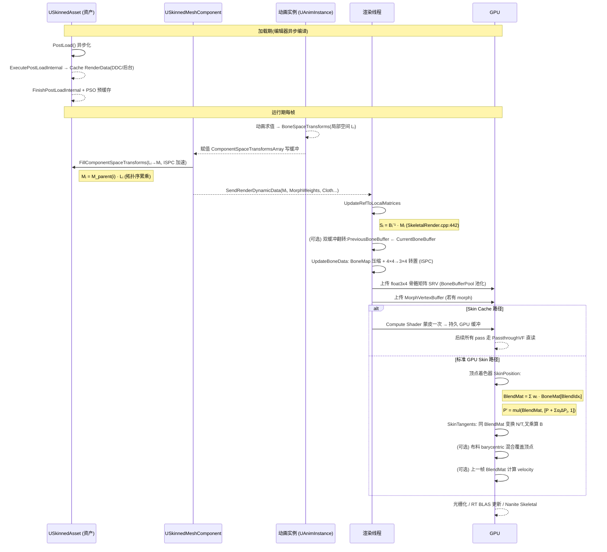

# USkinnedAsset：骨骼网格资产的抽象基类与蒙皮技术深度解析

> 版本：UE 5.5.4
> 源码路径：
> - `Source/Runtime/Engine/Classes/Engine/SkinnedAsset.h`
> - `Source/Runtime/Engine/Private/SkinnedAsset.cpp`
> - `Source/Runtime/Engine/Public/SkinnedAssetCompiler.h`
> - `Source/Runtime/Engine/Classes/Engine/SkinnedAssetAsyncCompileUtils.h`
> - `Source/Runtime/Engine/Classes/Engine/SkinnedAssetCommon.h`
> - `Source/Runtime/Engine/Public/Rendering/SkeletalMeshRenderData.h`
> - `Source/Runtime/Engine/Public/Rendering/SkeletalMeshLODRenderData.h`
> 目标读者：需要理解"骨架网格资产"在 5.x 中如何被抽象为 `USkinnedAsset`、资产与渲染资源之间的数据分层，以及 UE5 蒙皮（Skinning）从骨骼局部空间变换到 GPU 顶点变形全链路实现细节的技术人员
> 姊妹篇：[USkinnedMeshComponent 与 USkeletalMeshComponent 深度解析](../Animation/SkeletalMeshComp.md)（组件 / 渲染侧）

---

## 目录

- [USkinnedAsset：骨骼网格资产的抽象基类与蒙皮技术深度解析](#uskinnedasset骨骼网格资产的抽象基类与蒙皮技术深度解析)
  - [目录](#目录)
  - [1. 定位与设计动机](#1-定位与设计动机)
    - [1.1 为什么需要资产级抽象](#11-为什么需要资产级抽象)
    - [1.2 类层次：资产侧与组件侧](#12-类层次资产侧与组件侧)
    - [1.3 资产——渲染资源的双层结构](#13-资产渲染资源的双层结构)
  - [2. 纯虚契约：USkinnedAsset 的接口设计](#2-纯虚契约uskinnedasset-的接口设计)
    - [2.1 接口族谱（PURE\_VIRTUAL 清单）](#21-接口族谱pure_virtual-清单)
    - [2.2 关键访问器语义](#22-关键访问器语义)
  - [3. 蒙皮技术实现细节](#3-蒙皮技术实现细节)
    - [3.1 蒙皮数学基础（Linear Blend Skinning）](#31-蒙皮数学基础linear-blend-skinning)
    - [3.2 空间链条：局部 → 组件 → 骨骼绑定 → 网格](#32-空间链条局部--组件--骨骼绑定--网格)
    - [3.3 FillComponentSpaceTransforms：局部空间 → 组件空间](#33-fillcomponentspacetransforms局部空间--组件空间)
    - [3.4 UpdateRefToLocalMatrices：合成上传给 GPU 的骨骼矩阵](#34-updatereftolocalmatrices合成上传给-gpu-的骨骼矩阵)
    - [3.5 CPU 蒙皮 vs GPU 蒙皮](#35-cpu-蒙皮-vs-gpu-蒙皮)
    - [3.6 GPU 蒙皮着色器实现（SkinPosition / SkinTangents）](#36-gpu-蒙皮着色器实现skinposition--skintangents)
      - [3.6.1 BoneMatrix 格式：float3x4 转置存储](#361-bonematrix-格式float3x4-转置存储)
      - [3.6.2 权重矩阵混合](#362-权重矩阵混合)
      - [3.6.3 SkinPosition：位置变换](#363-skinposition位置变换)
      - [3.6.4 SkinTangents：法线 / 切线变换](#364-skintangents法线--切线变换)
      - [3.6.5 BoneMap 间接映射：为什么每 Section 只上传子集骨骼](#365-bonemap-间接映射为什么每-section-只上传子集骨骼)
    - [3.7 骨骼矩阵上传：FMatrix3x4 打包与 BoneBufferPool](#37-骨骼矩阵上传fmatrix3x4-打包与-bonebufferpool)
    - [3.8 CPU 蒙皮的 SIMD 累加实现](#38-cpu-蒙皮的-simd-累加实现)
    - [3.9 渲染数据分层：RenderData → LOD → Section](#39-渲染数据分层renderdata--lod--section)
    - [3.10 皮肤权重缓冲格式与四种打包变体](#310-皮肤权重缓冲格式与四种打包变体)
    - [3.11 GPU Skin Cache：一次计算，多次复用](#311-gpu-skin-cache一次计算多次复用)
    - [3.12 Morph Target 叠加与法线正交化](#312-morph-target-叠加与法线正交化)
    - [3.13 双缓冲、运动向量与 Motion Blur](#313-双缓冲运动向量与-motion-blur)
    - [3.14 ISPC 向量化](#314-ispc-向量化)
  - [4. 异步编译系统](#4-异步编译系统)
    - [4.1 PostLoad 异步流程](#41-postload-异步流程)
    - [4.2 异步属性锁（AsyncProperty 机制）](#42-异步属性锁asyncproperty-机制)
    - [4.3 FSkinnedAssetCompilingManager 与三种 Context](#43-fskinnedassetcompilingmanager-与三种-context)
  - [5. LOD、MinLod 与流式](#5-lodminlod-与流式)
  - [6. 渲染支撑设施](#6-渲染支撑设施)
    - [6.1 PSO 预缓存（PrecachePSOs）](#61-pso-预缓存precachepsos)
    - [6.2 UV 密度数据与纹理流送](#62-uv-密度数据与纹理流送)
    - [6.3 光追与蒙皮缓存](#63-光追与蒙皮缓存)
  - [7. 一帧生命周期与时序](#7-一帧生命周期与时序)
  - [8. 关键 API 速查表](#8-关键-api-速查表)
  - [附录：调试与诊断入口](#附录调试与诊断入口)
  - [附录 B：蒙皮性能与优化策略](#附录-b蒙皮性能与优化策略)

---

## 1. 定位与设计动机

### 1.1 为什么需要资产级抽象

在 5.1 之前，骨骼网格（`USkeletalMesh`）既承担"资产本体"职责，又是组件直接持有的类型。随着渲染技术演进（Mesh Deformer、Nanite 化骨骼网格、程序化生成骨骼网格等），引擎需要一个**不绑定具体资产实现**的抽象层：

- 组件侧只需依赖 `USkinnedAsset` 即可驱动蒙皮渲染，无需关心具体是传统骨骼网格还是未来其它"蒙皮渲染对象"。
- 资产侧的构建 / 异步编译 / 渲染资源管理逻辑可以下沉到基类，派生类只负责"自己的数据长什么样"。

这正是 `USkinnedAsset` 存在的意义——它把"**一个可被蒙皮渲染的资产应该对外承诺什么**"提炼成一组纯虚接口，而把"内部数据如何组织"完全留给派生类（目前唯一引擎内实现是 `USkeletalMesh`）。

### 1.2 类层次：资产侧与组件侧

```
资产侧（Asset）                                  组件侧（Component）
─────────────────────────                       ─────────────────────────
UObject
 └── UStreamableRenderAsset                       USkinnedMeshComponent
      └── USkinnedAsset  ← 本类                     └── USkeletalMeshComponent
           └── USkeletalMesh
```

- 类声明见 [SkinnedAsset.h:41](Source/Runtime/Engine/Classes/Engine/SkinnedAsset.h#L41)（`UCLASS(hidecategories = Object, config = Engine, editinlinenew, abstract, MinimalAPI)`，注意 **abstract**——它本身不能实例化）。
- `USkinnedAsset` 继承自 `UStreamableRenderAsset`（获得纹理流送 / PSO 预缓存 / 渲染资源生命周期管理能力），并实现 `IInterface_AsyncCompilation`（编辑器异步编译状态查询）。
- 引擎内唯一派生类 `USkeletalMesh : public USkinnedAsset, public IInterface_CollisionDataProvider, public IInterface_AssetUserData, public INodeMappingProviderInterface`，见 [SkeletalMesh.h:436](Source/Runtime/Engine/Classes/Engine/SkeletalMesh.h#L436)。
- 组件侧对应：`USkinnedMeshComponent` 通过 `GetSkinnedAsset()` 持有 `USkinnedAsset*`（见 [SkeletalMeshComp.md](SkeletalMeshComp.md) 1.3 节）。资产侧接口与组件侧接口**一一呼应**：例如资产 `GetLODInfo()` ↔ 组件 `GetLODInfo()`、资产 `GetMaterials()` ↔ 组件 `GetMaterials()`。

### 1.3 资产——渲染资源的双层结构

一个关键心智模型：**资产（UObject 数据）与渲染资源（RenderData）是分离的两层**。

```
USkinnedAsset（资产本体,CPU/编辑器侧）
 │
 │ GetResourceForRendering()          // PURE_VIRTUAL
 ▼
FSkeletalMeshRenderData（编译产物,只读）
 │
 ├── TIndirectArray<FSkeletalMeshLODRenderData> LODRenderData;   // 每个 LOD 一份
 │
 └── Nanite 资源（可选）、流送状态、光追句柄
```

- `FSkeletalMeshRenderData` 定义于 [SkeletalMeshRenderData.h:17](Source/Runtime/Engine/Public/Rendering/SkeletalMeshRenderData.h#L17)：内含 `LODRenderData`（每个 LOD 一份）、`NaniteResourcesPtr`、`NumInlinedLODs / NumNonOptionalLODs`（流送布局）、`CurrentFirstLODIdx / PendingFirstLODIdx`（流送中当前 / 待生效的最精细 LOD）、`LODBiasModifier`、`bSupportRayTracing` 等。
- 资产通过 `GetResourceForRendering()`（[L112](Source/Runtime/Engine/Classes/Engine/SkinnedAsset.h#L112)）暴露渲染资源；组件拿到后直接从中取顶点缓冲 / 索引缓冲 / 渲染 Section 用于绘制，不再回读资产 CPU 数据。
- 这样分层的好处：cooked 之后，DCC 来源数据（`FSkeletalMeshModel`）只在编辑器存在；运行时只有 `RenderData`。`USkinnedAsset::UpdateUVChannelData()` 中那句注释 *"Once cooked, the resources requires to compute the scales will not be CPU accessible"* 正是这一点的注脚（[SkinnedAsset.cpp:252](Source/Runtime/Engine/Private/SkinnedAsset.cpp#L252)）。

---

## 2. 纯虚契约：USkinnedAsset 的接口设计

### 2.1 接口族谱（PURE_VIRTUAL 清单）

`USkinnedAsset` 的主体是一组 `PURE_VIRTUAL` 访问器——它们定义了"一个可蒙皮资产必须回答的问题"。按职责可划分为五族：

| 族 | 接口（声明位置） | 返回 / 语义 |
|---|---|---|
| **骨架** | `GetRefSkeleton()` [L50-53](Source/Runtime/Engine/Classes/Engine/SkinnedAsset.h#L50-L53) | 引用骨架（骨骼名 / 父级关系），驱动 `FillComponentSpaceTransforms` |
| | `GetRefBasesInvMatrix()` [L98-101](Source/Runtime/Engine/Classes/Engine/SkinnedAsset.h#L98-L101) | 绑定姿势逆矩阵（骨骼→网格空间），GPU 蒙皮常需要它还原绑定姿势 |
| | `GetSkeleton()` / `SetSkeleton()` [L166-171](Source/Runtime/Engine/Classes/Engine/SkinnedAsset.h#L166-L171) | 关联的 `USkeleton` 资产（动画轨道、虚拟骨骼的宿主） |
| | `GetComposedRefPoseMatrix()` [L72-77](Source/Runtime/Engine/Classes/Engine/SkinnedAsset.h#L72-L77) | 某骨骼/插槽在组件空间下的**参考姿势**矩阵（名字/索引两个重载） |
| **材质** | `GetMaterials()` [L127-130](Source/Runtime/Engine/Classes/Engine/SkinnedAsset.h#L127-L130) | `TArray<FSkeletalMaterial>&`，材质槽列表 |
| | `IsValidMaterialIndex()` / `GetNumMaterials()` [L62-65](Source/Runtime/Engine/Classes/Engine/SkinnedAsset.h#L62-L65) | 材质下标校验 / 数量（非纯虚，基类已有实现） |
| | `IsMaterialUsed()` [L135](Source/Runtime/Engine/Classes/Engine/SkinnedAsset.h#L135) | 某材质是否被任意 Section 引用 |
| **LOD / 流送** | `GetLODInfo()` / `GetLODNum()` [L56-59, L132](Source/Runtime/Engine/Classes/Engine/SkinnedAsset.h#L56-L59) | 单个 LOD 信息（替代 5.5 已弃用的 `GetLODInfoArray()`） |
| | `IsValidLODIndex()` / `GetMinLodIdx()` / `GetDefaultMinLod()` [L182-186](Source/Runtime/Engine/Classes/Engine/SkinnedAsset.h#L182-L186) | LOD 校验与最小 LOD 决策 |
| | `GetMinLod()` / `IsMinLodQualityLevelEnable()` [L118-122](Source/Runtime/Engine/Classes/Engine/SkinnedAsset.h#L118-L122) | 平台化 MinLod 属性 |
| | `GetPlatformMinLODIdx()` / `GetDisableBelowMinLodStripping()` [L206-210](Source/Runtime/Engine/Classes/Engine/SkinnedAsset.h#L206-L210) | 目标平台视角的 MinLOD / 是否允许剥离 MinLod 以下数据 |
| | `GetEnableLODStreaming()` / `GetMaxNumStreamedLODs()` / `GetMaxNumOptionalLODs()` [L263-271](Source/Runtime/Engine/Classes/Engine/SkinnedAsset.h#L263-L271) | （编辑器）流送布局策略 |
| **变形 / 皮肤数据** | `GetMorphTargets()` / `FindMorphTarget()` [L189-196](Source/Runtime/Engine/Classes/Engine/SkinnedAsset.h#L189-L196) | 变形目标（顶点偏移 + 动画曲线驱动） |
| | `GetHasVertexColors()` / `GetVertexBufferFlags()` [L203-216](Source/Runtime/Engine/Classes/Engine/SkinnedAsset.h#L203-L216) | 是否含顶点色 → 决定顶点缓冲构建 flag |
| | `NeedCPUData()` [L199](Source/Runtime/Engine/Classes/Engine/SkinnedAsset.h#L199) | 该 LOD 是否需保留 CPU 数据（FX 采样、PhysX 等） |
| | `GetSkinWeightProfilesData()` [L212-213](Source/Runtime/Engine/Classes/Engine/SkinnedAsset.h#L212-L213) | 皮肤权重 Profile（多套权重运行时切换） |
| **渲染 / 物理** | `GetResourceForRendering()` [L112](Source/Runtime/Engine/Classes/Engine/SkinnedAsset.h#L112) | 渲染资源（见 1.3） |
| | `GetSupportRayTracing()` / `GetRayTracingMinLOD()` [L90-95](Source/Runtime/Engine/Classes/Engine/SkinnedAsset.h#L90-L95) | 光追支持与最小光追 LOD |
| | `GetBounds()` [L138](Source/Runtime/Engine/Classes/Engine/SkinnedAsset.h#L138) | 包围盒 / 球（LOD 决策、剔除） |
| | `GetPhysicsAsset()` / `GetShadowPhysicsAsset()` [L124, L68](Source/Runtime/Engine/Classes/Engine/SkinnedAsset.h#L124) | 物理资产 / 阴影用物理资产 |
| | `GetDefaultMeshDeformer()` / `GetOverlayMaterial()` [L173-179](Source/Runtime/Engine/Classes/Engine/SkinnedAsset.h#L173-L179) | Mesh Deformer 默认实例 / 覆盖材质（描边、材质覆盖调试） |
| **插槽** | `GetActiveSocketList()` / `FindSocket()` / `FindSocketInfo()` [L145-164](Source/Runtime/Engine/Classes/Engine/SkinnedAsset.h#L145-L164) | 插槽查询（网格插槽 + 骨架插槽去重合并） |

> 注意：5.5 已弃用 `GetLODInfoArray()`（[L104-109](Source/Runtime/Engine/Classes/Engine/SkinnedAsset.h#L104-L109)），统一改为 `GetLODInfo(Index)` + `GetLODNum()`。这是为了异步编译期间暴露更小的数据面（只按需访问单个 LOD，而不是把整个数组的写权限放出去）。

### 2.2 关键访问器语义

**`GetRefBasesInvMatrix()` 与蒙皮的关系**：GPU 蒙皮本质是求"当前骨骼矩阵 × 绑定姿势逆矩阵 × 顶点原始位置"。`RefBasesInvMatrix` 是**预计算的绑定姿势逆矩阵**，通常由 `FSkeletalMeshObject` 在初始化时从 `GetComposedRefPoseMatrix` 组合得到，用于把顶点从网格空间转到骨骼空间再转到当前动画姿势。`USkinnedAsset` 把它暴露为可覆盖的纯虚函数，派生类可直接缓存避免每次组合。

**材质槽 `FSkeletalMaterial`**（[SkinnedAssetCommon.h:366](Source/Runtime/Engine/Classes/Engine/SkinnedAssetCommon.h#L366)）：

```cpp
struct FSkeletalMaterial
{
    TObjectPtr<UMaterialInterface> MaterialInterface;   // 实际材质
    FName MaterialSlotName;                             // 游戏逻辑用的稳定名字（防止数组重排错乱）
    FName ImportedMaterialSlotName;                     // 导入时的槽名（重导入时恢复顺序）
    FMeshUVChannelInfo UVChannelData;                   // 纹理流送用的 UV 密度数据
};
```

**LOD 信息 `FSkeletalMeshLODInfo`**（[SkinnedAssetCommon.h:120](Source/Runtime/Engine/Classes/Engine/SkinnedAssetCommon.h#L120)）：`ScreenSize`（切换到该 LOD 的屏幕占比）、`LODHysteresis`（滞回防抖）、`LODMaterialMap`（Section→材质槽重映射）、`ReductionSettings / BonesToRemove`（减面与删骨）、`SkinCacheUsage`、`bAllowCPUAccess`、`bAllowMeshDeformer` 等——这些正是组件做 LOD 决策与渲染数据构建时逐 LOD 读取的信息。

---

## 3. 蒙皮技术实现细节

### 3.1 蒙皮数学基础（Linear Blend Skinning）

UE5 使用最经典的 **Linear Blend Skinning（LBS，线性混合蒙皮）**，也称 **Skeletal Subspace Deformation（SSD）** 或俗称的 **Smooth Skinning**。它的数学模型建立在如下前提上：

- 网格顶点 $\mathbf{P}$ 定义在"**绑定姿势（bind / rest pose）**"下的**网格局部空间**（对 UE 而言等价于**组件空间下的引用姿势**）。
- 每根骨骼 $b_i$ 在绑定姿势下有一个"骨骼→网格"变换 $\mathbf{B}_i$；蒙皮时使用其逆 $\mathbf{B}_i^{-1}$（UE 中即 `RefBasesInvMatrix[i]`），把顶点从网格空间"卸载"到骨骼 $b_i$ 的局部空间。
- 动画每帧提供该骨骼的当前"骨骼→网格"变换 $\mathbf{M}_i$（UE 中即 `ComponentSpaceTransform[i]`）。
- 顶点最多受 $k$ 根骨骼影响，权重 $w_i$ 满足 $\sum_i w_i = 1$、$w_i \ge 0$。

**LBS 变形公式**：

$$
\mathbf{P}' \;=\; \sum_{i=1}^{k} w_i \, \bigl(\mathbf{M}_i \, \mathbf{B}_i^{-1}\bigr)\, \mathbf{P}
\;=\; \Bigl(\sum_{i=1}^{k} w_i\, \mathbf{S}_i \Bigr)\, \mathbf{P},\qquad
\mathbf{S}_i \;\equiv\; \mathbf{M}_i \, \mathbf{B}_i^{-1}
$$

其中 $\mathbf{S}_i$ 是**已经"消掉"绑定姿势后的净变形矩阵**：绑定姿势代入（$\mathbf{M}_i = \mathbf{B}_i$）时 $\mathbf{S}_i = \mathbf{I}$，顶点原地不动。UE 里这一步骤合成后的矩阵被命名为 **`ReferenceToLocal[i]`**（在 [SkeletalRender.cpp:442](../../Source/Runtime/Engine/Private/SkeletalRender.cpp#L442) 用一行 `ReferenceToLocal[i] = RefBasesInvMatrix[i] * ComponentTransform[i]` 生成），并作为**每帧上传给 GPU 的骨骼矩阵数组**。

**法线 / 切线的变换**。位置用齐次坐标 $[x,y,z,1]$，方向向量用 $[x,y,z,0]$。严格来说，法线应用**逆转置矩阵** $(\mathbf{S}_i^{-1})^{\top}$ 才能正确处理非等比缩放；但对纯**刚体 + 均匀缩放**的骨骼变换（旋转 + 均匀缩放 + 平移），$\mathbf{S}_i$ 的上 3×3 已是 $\text{scale}\cdot R$，$(R\cdot s)^{-\top}$ 与 $R\cdot s$ 只差一个整体系数，重新 `normalize` 后等价——因此 UE 直接用同一个 `BlendMatrix` 去乘切线/法线，最后 `normalize()` 归一化即可（见 3.6 节 `SkinTangents`）：

$$
\mathbf{n}' \;=\; \operatorname{normalize}\!\left(\Bigl(\sum_i w_i \mathbf{S}_i\Bigr)\, \mathbf{n}\right)
$$

**LBS 的经典缺陷**：矩阵加权和不是刚体变换（矩阵集合在加权平均下不是**李群**闭合的），当两根骨骼旋转差异接近 180° 时会出现"糖果包装"式坍缩（**candy-wrapper artifact**）。业界的常见改进是 **Dual Quaternion Skinning（DQS）**，但 UE5 **默认引擎路径不启用 DQS**——需要更高质量变形时的推荐路径是走 **Skeletal Mesh Deformer（Optimus / DNA / MetaHuman 的 Curve/DQ 图）** 或用 Skin Cache + 自定义 Compute Shader（见 3.11、`AnimationDeformation.md`）。

### 3.2 空间链条：局部 → 组件 → 骨骼绑定 → 网格

理解 UE 蒙皮实现前先厘清四个空间：

| 空间 | 内容 | UE 中的载体 |
|---|---|---|
| **骨骼局部空间（bone-local）** | 每根骨骼相对**其父骨骼**的变换（动画求值直接产出的形式） | `USkinnedMeshComponent::BoneSpaceTransforms` / `FCompactPose` |
| **组件空间（component-space）** | 骨骼相对**资产根骨**的变换（逐层左乘父骨得到） | `USkinnedMeshComponent::ComponentSpaceTransformsArray`（双缓冲） |
| **网格 / 绑定姿势空间（mesh / bind-pose）** | 顶点位置的原始坐标系（等价于**绑定姿势下的组件空间**） | 顶点缓冲 `PositionVertexBuffer` |
| **世界空间（world）** | 组件 `LocalToWorld` 再乘一次 | `PrimitiveUniformBuffer.LocalToWorld` |

一条完整的变换链条：

```
BoneSpaceTransforms[i]   （骨骼相对父骨，local）
    │
    ▼  FillComponentSpaceTransforms （自顶向下累乘父骨）
ComponentSpaceTransforms[i]  （骨骼相对根骨，component）
    │        │
    │        ▼  UpdateRefToLocalMatrices（合成 InvBindPose × Current）
    │   ReferenceToLocal[i] = RefBasesInvMatrix[i] × ComponentSpaceTransforms[i]
    │        │        │
    │        │        ▼  UpdateBoneData（转置打包为 float3x4 上传 GPU）
    │        │   GPU BoneMatrices[Section-local]  （Section BoneMap 压缩）
    │        │
    │        ▼  GPU Vertex Shader
    │   BlendMatrix = Σ wᵢ · BoneMatrices[BoneIndicesᵢ]
    │        │
    │        ▼  mul(BlendMatrix, float4(Pₘₑₛₕ, 1))
    │   Pₘₑₛₕ'  （变形后的顶点,仍在组件空间下）
    │
    ▼  PrimitiveUniformBuffer.LocalToWorld
Pworld   （世界空间,用于光栅化 / 光追）
```

关键洞察：**`RefBasesInvMatrix[i]` 是资产的静态属性**（绑定姿势下的 `ComponentSpaceTransform[i]` 求逆一次即可），存于 `USkinnedAsset::GetRefBasesInvMatrix()`；**`ComponentSpaceTransforms[i]` 每帧变化**；两者相乘的产物 `ReferenceToLocal[i]` 才是 GPU 真正需要的"净变形矩阵"。

### 3.3 FillComponentSpaceTransforms：局部空间 → 组件空间

`USkinnedAsset::FillComponentSpaceTransforms()`（[SkinnedAsset.cpp:429](../../Source/Runtime/Engine/Private/SkinnedAsset.cpp#L429)）把动画求值输出的"骨骼局部变换"逐层累乘为"组件空间变换"。其数学关系是：

$$
\mathbf{M}_i \;=\; \mathbf{M}_{\text{parent}(i)} \cdot \mathbf{L}_i
$$

其中 $\mathbf{L}_i$ = `InBoneSpaceTransforms[i]`（骨骼相对父骨），$\mathbf{M}_i$ = `OutComponentSpaceTransforms[i]`（骨骼相对根骨）。根骨 $\mathbf{M}_0 = \mathbf{L}_0$。签名：

```cpp
void FillComponentSpaceTransforms(
    const TArray<FTransform>& InBoneSpaceTransforms,            // 骨骼相对父骨(局部)
    const TArray<FBoneIndexType>& InFillComponentSpaceTransformsRequiredBones,  // LOD 收缩后需要计算的骨骼
    TArray<FTransform>& OutComponentSpaceTransforms) const;     // 输出:骨骼相对根骨
```

实现要点（[SkinnedAsset.cpp:429-515](../../Source/Runtime/Engine/Private/SkinnedAsset.cpp#L429-L515)）：

- **根骨特判**：数组首元素必须是根骨（`InFillComponentSpaceTransformsRequiredBones[0] == 0`），直接拷贝 `OutComponentSpaceTransforms[0] = InBoneSpaceTransforms[0]`（[L456-458](../../Source/Runtime/Engine/Private/SkinnedAsset.cpp#L456-L458)）。
- **自顶向下遍历**：`RequiredBones` 是**拓扑排序后的稀疏骨骼数组**，保证父骨先于子骨出现——`checkSlow(BoneProcessed[ParentIndex] == 1)` 断言这一不变量（[L504-505](../../Source/Runtime/Engine/Private/SkinnedAsset.cpp#L504-L505)）。
- **矩阵乘法**：`FTransform::Multiply(SpaceBase, LocalTransformsData + BoneIndex, ParentSpaceBase)` 直接以指针写入目标位置，随后 `NormalizeRotation()` 防止四元数漂移（[L507-511](../../Source/Runtime/Engine/Private/SkinnedAsset.cpp#L507-L511)）。
- **预取**：`FPlatformMisc::Prefetch(SpaceBase)` 与 `Prefetch(ParentSpaceBase)` 帮助 CPU 预读下一次迭代要读写的缓存行。
- **DO_GUARD_SLOW 双保险**：Slow 检查下用 `BoneProcessed` 位图追踪已处理骨，确保遍历顺序合法。
- **ISPC 分支**：`IsISPCEnabled()` 为真时整段循环交给 `ispc::FillComponentSpaceTransforms` 向量化执行（见 3.14），并通过 `AutoRTFM::RecordOpenWrite` 登记写区间供事务性内存系统跟踪（[L466-484](../../Source/Runtime/Engine/Private/SkinnedAsset.cpp#L466-L484)）。

**输出仍是组件空间**（不是世界空间）——世界空间的一次乘法留到 GPU 用 `PrimitiveUniformBuffer.LocalToWorld` 完成，避免每根骨骼多做一次 4×4 乘法。

### 3.4 UpdateRefToLocalMatrices：合成上传给 GPU 的骨骼矩阵

有了组件空间变换后，还差最后一步才能喂给 GPU：**合成 `RefBasesInvMatrix[i] × ComponentSpaceTransform[i]`**。这一步由 `UpdateRefToLocalMatrices()`（[SkeletalRender.cpp:454](../../Source/Runtime/Engine/Private/SkeletalRender.cpp#L454)）完成，其内部循环（[L340-444](../../Source/Runtime/Engine/Private/SkeletalRender.cpp#L340-L444)）的**核心一行**是：

```cpp
// SkeletalRender.cpp:442
for (int32 ThisBoneIndex = 0; ThisBoneIndex < ReferenceToLocal.Num(); ++ThisBoneIndex)
{
    ReferenceToLocal[ThisBoneIndex] = (*RefBasesInvMatrix)[ThisBoneIndex] * ReferenceToLocal[ThisBoneIndex];
}
```

对应 3.1 节的 $\mathbf{S}_i = \mathbf{M}_i \, \mathbf{B}_i^{-1}$（UE 使用行向量与右乘约定，写成 `A * B` 相当于数学上的 $A B$，但 `FMatrix` 内部布局是行主序、变换按 $\mathbf{v}' = \mathbf{v} \, M$ 施加，因此这里 `RefBasesInvMatrix * ComponentTransform` 即"先卸载绑定姿势、再套上当前姿势"）。

其他要点：

- **Leader/Follower Pose**：若组件是 Follower（如武器骨骼跟随角色手骨），`LeaderBoneMap[i]` 把本地骨骼索引映射到 Leader 的组件空间数组下标，直接借用其变换（[L365-395](../../Source/Runtime/Engine/Private/SkeletalRender.cpp#L365-L395)）——这是 UE 里"武器/装备无缝挂点"的底层机制。
- **骨骼隐藏**：`BoneVisibilityStates[i] != BVS_Visible` 时，`ReferenceToLocal[i] = ReferenceToLocal[ParentIndex].ApplyScale(0.f)`（[L375](../../Source/Runtime/Engine/Private/SkeletalRender.cpp#L375)）——把该骨骼及其子树缩放到零，实现**骨骼隐藏 = 相关顶点坍缩到父骨位置**。
- **RayTracing 独立 LOD**：光追走独立 LOD 时，`bShouldUseSeparateMatricesForRayTracing` 触发第二份 `ReferenceToLocalForRayTracing` 计算（[SkeletalRenderGPUSkin.cpp:2469](../../Source/Runtime/Engine/Private/SkeletalRenderGPUSkin.cpp#L2469)）。

### 3.5 CPU 蒙皮 vs GPU 蒙皮

蒙皮可在 CPU 或 GPU 完成，决策入口是 `FSkeletalMeshRenderData::RequiresCPUSkinning(FeatureLevel)`（[SkeletalMeshRenderData.h:88](../../Source/Runtime/Engine/Public/Rendering/SkeletalMeshRenderData.h#L88)）：

| | GPU 蒙皮（默认） | CPU 蒙皮 |
|---|---|---|
| 谁做变形 | 顶点着色器按 `BoneMatrices` 数组插值顶点 | 渲染线程用 `SkinVertices` 逐顶点计算后上传静态顶点缓冲 |
| 顶点工厂 | `FSkeletalMeshObjectGPUSkin`（`FGPUSkinVertexFactory` 一族） | `FLocalVertexFactory`（把网格视为"已变形"的静态网格） |
| 触发条件 | 支持蒙皮顶点工厂的 RHI 特性级别 | `bNeedsCPUSkin` 或 `bAlwaysUseLocalVertexFactory`（部分移动路径、特效顶点采样） |
| 顶点数据 | `FSkinWeightVertexBuffer` 每顶点存权重+骨骼索引，GPU 读取 | 权重/骨骼索引在 CPU 端消耗，上传的已是最终位置 |
| 骨骼数上限 | 单 Section 内 `MaxGPUSkinBones`（默认 65536，可平台化下调） | 无硬上限（受内存） |
| 位置存储 | 顶点缓冲存**绑定姿势**位置（只读，反复用） | 顶点缓冲存**每帧变形后**位置（`FFinalSkinVertex`，每帧重写） |
| Motion Blur | 有：`PreviousBoneMatrices` 双缓冲 | 无（`FLocalVertexFactory` 不支持每帧动态位置的 velocity 缓冲） |

`USkinnedAsset::GetVertexFactoryTypesPerMaterialIndex()`（[SkinnedAsset.cpp:176](../../Source/Runtime/Engine/Private/SkinnedAsset.cpp#L176)）在为 PSO 预缓存枚举顶点工厂类型时明确区分了这两条路径：

- `bCPUSkin == true`：强制走 `FLocalVertexFactory`，并检查 `SupportsManualVertexFetch` 决定顶点声明是否需逐元素构建（[L213-228](../../Source/Runtime/Engine/Private/SkinnedAsset.cpp#L213-L228)）。
- GPU 蒙皮：调用 `FSkeletalMeshObjectGPUSkin::GetUsedVertexFactoryData` 收集所有可能用到的蒙皮顶点工厂变体（含 Morph Target 时的变体，见 [L230-235](../../Source/Runtime/Engine/Private/SkinnedAsset.cpp#L230-L235)）。

### 3.6 GPU 蒙皮着色器实现（SkinPosition / SkinTangents）

GPU 蒙皮的核心逻辑在 [GpuSkinCommon.ush](../../Shaders/Private/GpuSkinCommon.ush) 与 [GpuSkinVertexFactory.ush](../../Shaders/Private/GpuSkinVertexFactory.ush)。以下按数据流展开。

#### 3.6.1 BoneMatrix 格式：float3x4 转置存储

出于**寄存器/带宽压缩**考虑，UE 的骨骼矩阵在 GPU 端是 `float3x4`（3 行 × 4 列 = 12 个 float / 48 字节），且是**转置**过的：

```hlsl
// GpuSkinCommon.ush:197
#define FBoneMatrix float3x4

// 从连续 3 个 float4 中构造一个 float3x4
FBoneMatrix InternalGetBoneMatrix(Buffer<float4> InBoneMatrices, uint In)
{
    return FBoneMatrix(InBoneMatrices[In*3], InBoneMatrices[In*3 + 1], InBoneMatrices[In*3 + 2]);
}
```

数学上 `float3x4` 只能表达**仿射变换**（3 行 = 变换后坐标的 x/y/z，第 4 列 = 平移），不能表示透视变换——但对蒙皮完全足够。**转置存储**的含义：数学上要计算 $\mathbf{P}' = M \mathbf{P}$，若 $M$ 存为**行主序**（如 CPU 侧的 `FMatrix44f`），HLSL 中理论上应该 `mul(P, M)`（HLSL 默认列主序）；而 UE 上传时用 `RefToLocal.To3x4MatrixTranspose()`（[GPUSkinVertexFactory.cpp:329](../../Source/Runtime/Engine/Private/GPUSkinVertexFactory.cpp#L329)）显式转置，使得 GPU 端**可以直接** `mul(BlendMatrix, float4(P, 1))`（[GpuSkinVertexFactory.ush:566](../../Shaders/Private/GpuSkinVertexFactory.ush#L566)），无需在 shader 里再转置——这就是注释所说的 *"bone matrices are stored transposed for tighter packing"*。

#### 3.6.2 权重矩阵混合

**限制影响数**（4 或 8 骨，`GPUSKIN_LIMIT_2BONE_INFLUENCES` / `GPUSKIN_USE_EXTRA_INFLUENCES`）路径：

```hlsl
// GpuSkinCommon.ush:205
FBoneMatrix ComputeBoneMatrixWithLimitedInfluences(Buffer<float4> InBoneMatrices, FGPUSkinIndexAndWeight In, bool bExtraInfluences)
{
    FBoneMatrix BoneMatrix;
    BoneMatrix  = In.BlendWeights.x * InternalGetBoneMatrix(InBoneMatrices, In.BlendIndices.x);
    BoneMatrix += In.BlendWeights.y * InternalGetBoneMatrix(InBoneMatrices, In.BlendIndices.y);
#if !GPUSKIN_LIMIT_2BONE_INFLUENCES
    BoneMatrix += In.BlendWeights.z * InternalGetBoneMatrix(InBoneMatrices, In.BlendIndices.z);
    BoneMatrix += In.BlendWeights.w * InternalGetBoneMatrix(InBoneMatrices, In.BlendIndices.w);
    if (bExtraInfluences)   // 影响数 5-8 时启用第二组
    {
        BoneMatrix += In.BlendWeights2.x * InternalGetBoneMatrix(InBoneMatrices, In.BlendIndices2.x);
        BoneMatrix += In.BlendWeights2.y * InternalGetBoneMatrix(InBoneMatrices, In.BlendIndices2.y);
        BoneMatrix += In.BlendWeights2.z * InternalGetBoneMatrix(InBoneMatrices, In.BlendIndices2.z);
        BoneMatrix += In.BlendWeights2.w * InternalGetBoneMatrix(InBoneMatrices, In.BlendIndices2.w);
    }
#endif
    return BoneMatrix;
}
```

这就是 $\mathbf{S}_{\text{blend}} = \sum_i w_i \mathbf{S}_i$ 的直接 HLSL 表达。**权重不再在 shader 里除以 65535 或 255**——顶点属性声明为 `unorm float4`，硬件 fetch 时已归一化到 `[0,1]`。

**无限影响数**（`GPUSKIN_UNLIMITED_BONE_INFLUENCE`）路径（[GpuSkinCommon.ush:224](../../Shaders/Private/GpuSkinCommon.ush#L224)）：每顶点独立记录起始偏移和影响数，循环读取——用于极高质量的角色（如 MetaHuman）、皮肤权重压缩场景。CPU 侧对应 `FSkinWeightLookupVertexBuffer`（[SkinWeightVertexBuffer.cpp:171](../../Source/Runtime/Engine/Private/Rendering/SkinWeightVertexBuffer.cpp#L171)）为每个顶点存 `(WeightOffset << 8) | InfluenceCount`。

#### 3.6.3 SkinPosition：位置变换

```hlsl
// GpuSkinVertexFactory.ush:550
float3 SkinPosition(FVertexFactoryInput Input, FVertexFactoryIntermediates Intermediates)
{
    float3 Position = IsMorphTarget() ? MorphPosition(Input, Intermediates)   // = Unpacked + DeltaPosition
                                      : Intermediates.UnpackedPosition;
    // BlendMatrix 是转置存储的 float3x4,直接左乘齐次坐标 [x,y,z,1]
    Position = mul(Intermediates.BlendMatrix, float4(Position, 1));
    return Position;
}
```

严格对应 LBS 数学：`Position' = BlendMatrix × [P, 1]ᵀ`，其中 `BlendMatrix = Σ wᵢ × BoneMatrix[BlendIndicesᵢ]`。

#### 3.6.4 SkinTangents：法线 / 切线变换

```hlsl
// GpuSkinVertexFactory.ush:601
float3x3 SkinTangents(FVertexFactoryInput Input, FVertexFactoryIntermediates Intermediates)
{
    half3 LocalTangentX = Input.TangentX;                   // -1..1
    half4 LocalTangentZ = Input.TangentZ;                   // .xyz=法线 .w=手性符号

    // (可选) Morph Target 修正:法线加 Delta,切线对新法线正交化
    if (IsMorphTarget()) {
        LocalTangentZ.xyz = normalize(LocalTangentZ.xyz + Input.DeltaTangentZ);
        LocalTangentX = normalize(LocalTangentX - dot(LocalTangentX, LocalTangentZ.xyz) * LocalTangentZ.xyz);
    }

    // w=0 => 只变换方向,不带平移
    TangentToLocal[0] = normalize(mul(Intermediates.BlendMatrix, float4(LocalTangentX,     0)));  // T
    TangentToLocal[2] = normalize(mul(Intermediates.BlendMatrix, float4(LocalTangentZ.xyz, 0)));  // N
    // B = N × T · sign(handedness),保证切线基与原始导入手性一致
    TangentToLocal[1] = normalize(cross(TangentToLocal[2], TangentToLocal[0]) * LocalTangentZ.w);
    return TangentToLocal;
}
```

三点关键：

1. **齐次分量 w=0** 让平移分量对切向量失效——切线和法线只关心旋转/缩放，不能带平移；
2. **副切线 B 用叉乘现算** 而不是存 `TangentY`——节省顶点带宽 12 bytes/顶点，还避免存储 → GPU 归一化的舍入误差；
3. **`LocalTangentZ.w` 存手性符号**（±1）——处理镜像 UV / 双面材质时保证 TBN 基仍为右手系。

#### 3.6.5 BoneMap 间接映射：为什么每 Section 只上传子集骨骼

`Input.BlendIndices` 里存的**不是全资产骨骼下标**，而是 **Section 局部下标**：GPU 端 `BoneMatrices` 只上传该 Section 用到的骨骼子集，`FSkelMeshRenderSection::BoneMap` 是"局部下标 → 全资产下标"的映射，但**映射操作在 CPU 侧的 `UpdateBoneData` 完成**（见 3.7 节代码），GPU 直接按局部下标读，无需二次跳转。

这带来两个收益：
- **常量缓冲/存储缓冲大小可控**：单 Section 内的骨骼数受平台上限（`MaxGPUSkinBones`）约束——即便整个角色有 800 根骨骼，每 Section 也只需上传其真正影响的几十根。
- **索引位宽压缩**：`GPUSKIN_BONE_INDEX_UINT16 = 0` 时用 uint8 存下标（256 个骨骼够用），只有超大 Section 才升级到 uint16。

### 3.7 骨骼矩阵上传：FMatrix3x4 打包与 BoneBufferPool

CPU 侧的 `TArray<FMatrix44f> ReferenceToLocal`（每根 64 字节）不能直接喂给 GPU——一来 shader 用的是 `float3x4`（48 字节），二来还需要按 `BoneMap` 压缩到 Section 子集。桥梁是 `FGPUBaseSkinVertexFactory::FShaderDataType::UpdateBoneData()`（[GPUSkinVertexFactory.cpp:246](../../Source/Runtime/Engine/Private/GPUSkinVertexFactory.cpp#L246)）：

```cpp
void UpdateBoneData(RHICmdList, ReferenceToLocalMatrices, BoneMap, RevisionNumber, ...)
{
    const uint32 NumBones = BoneMap.Num();
    // 每根骨骼 3 × float4 = 48 字节,总大小 = NumBones × 48
    uint32 VectorArraySize = NumBones * 3 * sizeof(FVector4f);

    // 从 BoneBufferPool 借出/复用一个刚好尺寸的 GPU 顶点缓冲(实际按 SRV 采样)
    if (!IsValidRef(*CurrentBoneBuffer) || PooledArraySize != CurrentBoneBuffer->GetSize())
    {
        BoneBufferPool.ReleasePooledResource(*CurrentBoneBuffer);
        *CurrentBoneBuffer = BoneBufferPool.CreatePooledResource(RHICmdList, VectorArraySize);
    }
    FMatrix3x4* ChunkMatrices = (FMatrix3x4*)RHICmdList.LockBuffer(..., RLM_WriteOnly);

    // 逐骨骼: 从全资产 ReferenceToLocal 里按 BoneMap[BoneIdx] 拷贝并转置为 3x4
    for (uint32 BoneIdx = 0; BoneIdx < NumBones; ++BoneIdx)
    {
        const FMatrix44f& RefToLocal = ReferenceToLocalMatrices[BoneMap[BoneIdx]];
        // SIMD 转置: 4×4 行主序 → 3×4 转置版(丢弃第 4 行[0,0,0,1])
        // ...使用 VectorShuffle 4 条指令完成
        RefToLocal.To3x4MatrixTranspose((float*)ChunkMatrices[BoneIdx].M);
    }
    RHICmdList.UnlockBuffer(CurrentBoneBuffer->VertexBufferRHI);
}
```

实现细节亮点：

- **`FMatrix3x4` = 48 字节**（3 行 × 4 列）；SIMD 平台下用 `VectorShuffle` 4 条指令完成 4×4 → 3×4 转置（[GPUSkinVertexFactory.cpp:314-327](../../Source/Runtime/Engine/Private/GPUSkinVertexFactory.cpp#L314-L327)），非 SIMD 平台回退到 `To3x4MatrixTranspose` 标量实现。
- **`FBoneBufferPool`**（[GPUSkinVertexFactory.cpp:225](../../Source/Runtime/Engine/Private/GPUSkinVertexFactory.cpp#L225)）：全局共享的**分档池化分配器**（`FSharedPoolPolicyData`），按 2 的幂档位缓存 `FVertexBufferAndSRV`，避免每帧 `RHICreateBuffer`——大幅降低 GPU 侧碎片。
- **ISPC 加速版**：`bGPUSkin_CopyBones_ISPC_Enabled` 时改调 `ispc::UpdateBoneData_CopyBones`（[GPUSkinVertexFactory.cpp:292-300](../../Source/Runtime/Engine/Private/GPUSkinVertexFactory.cpp#L292-L300)），10~15% 端到端 CPU 节省。
- **双缓冲**：`GetBoneBufferForWriting(bPrevious=false)` / `bPrevious=true` 分别写入当前帧和上一帧的骨骼矩阵，供 Motion Blur / TSR 使用（见 3.13）。
- **RevisionNumber 语义**：每次骨骼更新递增；shader 里通过 `ResolvedView.FrameCounter == GPUSkinVF.BoneUpdatedFrameNumber` 判断"上一帧数据是否新鲜"，决定是否切到 previous 矩阵（[GpuSkinVertexFactory.ush:589](../../Shaders/Private/GpuSkinVertexFactory.ush#L589)）。

**每 Section 独立 BoneBuffer**：因为不同 Section 的 `BoneMap` 不同，压缩后骨骼下标空间也不同，只能一 Section 一份缓冲。这也解释了为什么"减少材质槽 / 合并 Section"是骨骼网格性能优化的重要手段。

### 3.8 CPU 蒙皮的 SIMD 累加实现

对必须走 CPU 蒙皮的路径，[SkeletalRenderCPUSkin.cpp:697](../../Source/Runtime/Engine/Private/SkeletalRenderCPUSkin.cpp#L697) 的 `SkinVertexSection` 是核心内循环。其算法结构：

```cpp
// 权重解包 (uint16 → float,除以 65535)
VectorRegister Weights      = VectorMultiply(VectorLoadURGBA16N(BoneWeights),                       VECTOR_INV_65535);
VectorRegister ExtraWeights = VectorMultiply(VectorLoadURGBA16N(&BoneWeights[MAX_INFLUENCES_PER_STREAM]), VECTOR_INV_65535);

// 加载第 0 根骨骼矩阵与权重
const FMatrix44f BoneMatrix0 = ReferenceToLocal[BoneMap[BoneIndices[INFLUENCE_0]]];
VectorRegister Weight0 = VectorReplicate(Weights, INFLUENCE_0);   // 广播 w0 到 4 分量
VectorRegister M00 = VectorMultiply(VectorLoadAligned(&BoneMatrix0.M[0][0]), Weight0);
VectorRegister M10 = VectorMultiply(VectorLoadAligned(&BoneMatrix0.M[1][0]), Weight0);
VectorRegister M20 = VectorMultiply(VectorLoadAligned(&BoneMatrix0.M[2][0]), Weight0);
VectorRegister M30 = VectorMultiply(VectorLoadAligned(&BoneMatrix0.M[3][0]), Weight0);

// 后续骨骼: VectorMultiplyAdd (a*b+c 融合乘加,一条 FMA 指令)
if (MaxSectionBoneInfluences > 1) {
    const FMatrix44f BoneMatrix1 = ReferenceToLocal[BoneMap[BoneIndices[INFLUENCE_1]]];
    VectorRegister Weight1 = VectorReplicate(Weights, INFLUENCE_1);
    M00 = VectorMultiplyAdd(VectorLoadAligned(&BoneMatrix1.M[0][0]), Weight1, M00);
    // ... M10 M20 M30 类推
}
// ... 最多累加到第 11 根 (EXTRA_BONE_INFLUENCES = 12)

// 最后用累加出的 M00..M30 变换位置和法线,写入 DestVertex
```

- **[M00, M10, M20, M30]** 是 $\mathbf{S}_{\text{blend}}$ 的 4 行 SIMD 累加器；`VectorMultiplyAdd(A, B, C) = A*B + C` 对应硬件 FMA 指令，一条指令完成一次加权矩阵累加。
- **权重编码：uint16 (0-65535)**——CPU 侧的皮肤权重使用比 GPU 高一倍的精度（GPU 常用 `unorm float4` 归一化 uint8），因为 CPU 蒙皮结果直接固化进顶点缓冲、误差没有机会被 GPU 归一化"洗掉"。`VectorLoadURGBA16N` 一次加载 4 个 uint16 并归一化到 `[0,1]`。
- **Morph Target 前置**：若有 Morph，先把 `SrcSoftVertex → VertexCopy`，`UpdateMorphedVertex` 叠加位置/法线增量后再进入 SIMD 累加。

CPU 蒙皮的复杂度 $O(N_{\text{vertex}} \cdot k)$；每顶点 ~10-20 条 SIMD 指令 + 一次法线正交化。为什么 UE 仍保留 CPU 蒙皮路径？两大原因：**（1）** 部分低端移动平台顶点工厂受限；**（2）** 特效系统（Niagara `Sample Static Mesh` / 布料附着点 / 物理接触点）需要**逐帧从 CPU 读取变形后顶点**，此时启用 `bAllowCPUAccess` 后即使主渲染走 GPU，也会额外维护一份 CPU 变形结果（`FinalizeMorphTargetsForCPU`）。

### 3.9 渲染数据分层：RenderData → LOD → Section

蒙皮渲染的顶点组织呈三级分层，均可在 [SkeletalMeshLODRenderData.h](../../Source/Runtime/Engine/Public/Rendering/SkeletalMeshLODRenderData.h) 找到：

```
FSkeletalMeshRenderData
 └── LODRenderData[]                      // 每 LOD 一份（可流送、可剥离）
      ├── RenderSections[]                // FSkelMeshRenderSection：一个材质/一个绘制批次
      ├── MultiSizeIndexContainer         // 索引缓冲（8/16/32bit 按顶点数自动选择）
      ├── StaticVertexBuffers             // 位置/法线/切线/UV（FStaticMeshVertexBuffers）
      ├── SkinWeightVertexBuffer          // 皮肤权重
      ├── ClothVertexBuffer               // 布料模拟后顶点覆盖
      └── SkinWeightProfilesData          // 多套权重 Profile
```

`FSkelMeshRenderSection`（[L27-120](../../Source/Runtime/Engine/Public/Rendering/SkeletalMeshLODRenderData.h#L27-L120)）是"绘制批次"的最小单元，关键字段：

- `MaterialIndex`（该 Section 用的材质槽）、`BaseIndex / NumTriangles`（索引缓冲中的区间）、`BaseVertexIndex / NumVertices`（顶点缓冲区间）。
- **`BoneMap`**：`TArray<FBoneIndexType>`——该 Section 顶点实际用到的骨骼索引（引用骨架下标），GPU 蒙皮用它把"每 Section 的骨骼"紧凑映射到骨骼矩阵存储缓冲（这是把骨骼矩阵数限制在 256/65536 以内以塞进单一 SRV 的关键手段）。
- `MaxBoneInfluences`（默认 4）：该 Section 每顶点最多影响的骨骼数（4 / 8 / 12 三档）。
- `ClothMappingDataLODs`（外层索引 = LOD bias，内层 = 布料顶点映射，见 [L56-65](../../Source/Runtime/Engine/Public/Rendering/SkeletalMeshLODRenderData.h#L56-L65)）：布料蒙皮时把布料网格的模拟结果映射回渲染网格顶点。
- `DuplicatedVerticesBuffer`：蒙皮后顶点可能被多个面共享而需要切线重建时的重复顶点信息。

### 3.10 皮肤权重缓冲格式与四种打包变体

`FSkinWeightVertexBuffer`（[SkinWeightVertexBuffer.h](../../Source/Runtime/Engine/Public/Rendering/SkinWeightVertexBuffer.h)）决定每顶点如何存权重。UE5 支持的组合矩阵（[SkinWeightVertexBuffer.cpp:197-234](../../Source/Runtime/Engine/Private/Rendering/SkinWeightVertexBuffer.cpp#L197-L234)）：

| 维度 | 取值 | 决定字段 |
|---|---|---|
| **每顶点影响骨骼数** | 4 / 8 / 12 | `MaxBoneInfluences`（`MAX_INFLUENCES_PER_STREAM = 4`, `EXTRA_BONE_INFLUENCES = 8`, `MAX_TOTAL_INFLUENCES = 12`） |
| **骨骼索引位宽** | uint8 / uint16 | `bUse16BitBoneIndex`——骨骼总数超过 256 时升级到 uint16 |
| **权重位宽** | uint8 / uint16 | `bUse16BitBoneWeight`——高精度布偶、皮肤衣物折缝需要更细腻权重 |
| **定长 / 变长** | 定长 / `bVariableBonesPerVertex`（`Unlimited Bone Influence`） | 变长模式下每顶点独立记录 `WeightOffset + InfluenceCount`，用 `FSkinWeightLookupVertexBuffer` 索引 |

**Stride 计算示例**（4 影响 + uint8 索引 + uint8 权重）：`4 * 1 + 4 * 1 = 8 bytes/顶点`；（8 影响 + uint16 索引 + uint16 权重）：`8 * 2 + 8 * 2 = 32 bytes/顶点`——高影响 + 高位宽的组合能把顶点带宽推高 4 倍，因此 UE 默认最保守组合。

**权重归一化**：CPU 侧 uint8/uint16 的值直接除以 255 或 65535 归一化到 `[0,1]`；GPU 侧顶点声明使用 `unorm` 格式，硬件 fetch 时自动归一化——**shader 里不再显式除**（除非在无限影响数路径里手动读裸 uint）。

**SkinWeightProfiles**（[SkeletalMeshLODRenderData.h:145](../../Source/Runtime/Engine/Public/Rendering/SkeletalMeshLODRenderData.h#L145)）：一个 LOD 可有多套权重（如"标准 / 高精度布偶 / 面部微表情"），运行时 `USkinnedMeshComponent::SetSkinWeightProfile(ProfileName)` 切换——底层是**替换 `FSkinWeightVertexBuffer` 的 override 覆盖**，不重新构建整个 LOD。

### 3.11 GPU Skin Cache：一次计算，多次复用

**问题**：默认 GPU 蒙皮下，每个 draw call（阴影 pass、光追 BLAS 构建、多视图 stereo、每摄像机再绘一遍……）都要在**顶点着色器**里重新做一次蒙皮矩阵混合，浪费大量算力。

**方案**：**Skin Cache**（[GPUSkinCache.cpp](../../Source/Runtime/Engine/Private/GPUSkinCache.cpp)）在每帧动画更新后**用 compute shader 蒙皮一次**，把变形后的顶点/切线**写入一个持久 GPU 缓冲**，此后所有 pass 走 `FGPUSkinPassthroughVertexFactory`（"直通"顶点工厂）从该缓冲直接读，**不再执行蒙皮 shader**。

关键设计（见 [SkeletalRenderGPUSkin.cpp:773-796](../../Source/Runtime/Engine/Private/SkeletalRenderGPUSkin.cpp#L773-L796)）：

- 逐 Section `GPUSkinCache->ProcessEntry(...)`：把该 Section 的顶点缓冲、权重缓冲、骨骼矩阵登记为一个 Skin Cache Entry，dispatch compute shader 生成变形后位置/切线（可选：也生成 tangent basis 到 SRV）。
- **回退机制**：Skin Cache 内存有限（默认 `r.SkinCache.SceneMemoryLimitInMB`），装不下时该 Section `bSectionUsingSkinCache = false`，回退到普通 GPU 蒙皮顶点工厂。
- **强制开启的场景**：Ray Tracing、Nanite Skeletal Mesh、启用了 Recompute Tangents 的 Section——因为它们**必须**有一份"实体"变形顶点缓冲才能构建 BLAS 或后续处理。
- **RayTracing 更新频率**：由 `SkinCacheUsage` 决定（[SkinnedAssetCommon.h:31-52](../../Source/Runtime/Engine/Classes/Engine/SkinnedAssetCommon.h#L31-L52)）——`Enabled` 每帧更新、`Auto` 交由引擎决定、`Disabled` 时光追走 CPU 蒙皮 + 每帧 BLAS 重建（极慢）。

Skin Cache 是 UE5 大部分**角色+光追**、**MetaHuman + Nanite** 场景性能不塌陷的关键——但它以显存换算力，一个 5 万顶点角色开 Recompute Tangents 每帧占用约 2 MB 显存，5 个 NPC 就是 10 MB，需要 `r.SkinCache.SceneMemoryLimitInMB` 相应放大。

### 3.12 Morph Target 叠加与法线正交化

Morph Target（BlendShape）是"顶点偏移"式变形：每个 target 对每个受影响顶点存一份 $\Delta \mathbf{P}$、$\Delta \mathbf{N}$。动画驱动的权重 $\alpha_j$ 决定融合强度：

$$
\mathbf{P}_{\text{morph}} \;=\; \mathbf{P} + \sum_{j} \alpha_j \, \Delta \mathbf{P}_j,\qquad
\mathbf{N}_{\text{morph}} \;=\; \operatorname{normalize}\!\Bigl(\mathbf{N} + \sum_{j} \alpha_j \, \Delta \mathbf{N}_j\Bigr)
$$

在蒙皮流水线里，**Morph 先做、蒙皮后做**——这是必要的，因为 Morph 增量定义在绑定姿势空间，必须先在绑定姿势空间累加完再走 LBS 变换。GPU 侧的顺序（[GpuSkinVertexFactory.ush:550-566](../../Shaders/Private/GpuSkinVertexFactory.ush#L550-L566)）：

```hlsl
Position = IsMorphTarget() ? MorphPosition(Input, Intermediates)   // Unpacked + DeltaPosition
                           : Intermediates.UnpackedPosition;
Position = mul(Intermediates.BlendMatrix, float4(Position, 1));    // 再做蒙皮
```

**切线正交化**：Morph 只提供 $\Delta \mathbf{N}$（法线增量）不提供 $\Delta \mathbf{T}$（切线增量），因为一旦法线变了，原切线不一定还在切平面内——UE 用 **Gram-Schmidt 正交化**修正（[GpuSkinVertexFactory.ush:706-709](../../Shaders/Private/GpuSkinVertexFactory.ush#L706-L709)）：

$$
\mathbf{T}_{\text{new}} \;=\; \operatorname{normalize}\!\bigl(\mathbf{T} - (\mathbf{T} \cdot \mathbf{N}_{\text{new}})\, \mathbf{N}_{\text{new}}\bigr)
$$

即从原切线中减去它在新法线方向上的分量，保证新的切线基仍是正交的。

**Morph 顶点缓冲**：`FMorphVertexBuffer` 按顶点存 `float3 Delta + float3 DeltaTangentZ`（6 float = 24 字节/顶点）；组件的动画曲线求值出各 Morph 的权重后，`UpdateMorphVertexBuffer`（compute shader）把所有加权 delta 累加到该缓冲，蒙皮顶点着色器再从中 fetch。

**外部 Morph（External Morph Sets）**：5.x 引入的机制，允许 Niagara、Mesh Deformer 等系统运行时**塞入自己的 morph 数据**（如程序化嘴型），与常规 Morph 走同一累加缓冲。

### 3.13 双缓冲、运动向量与 Motion Blur

Motion Blur / TSR 需要**每个顶点的上一帧位置**才能算屏幕空间速度向量。GPU 蒙皮路径下这靠**骨骼矩阵双缓冲**实现——同一 shader、同一顶点缓冲，只是骨骼矩阵换成上一帧的版本重新蒙皮一次：

```hlsl
// GpuSkinVertexFactory.ush:585-596
FBoneMatrix BlendMatrix = Intermediates.BlendMatrix;
if (ResolvedView.FrameCounter == GPUSkinVF.BoneUpdatedFrameNumber && ResolvedView.WorldIsPaused == 0)
{
    BlendMatrix = CalcPreviousBoneMatrix(Input);    // 用 PreviousBoneMatrices SRV
}
Position = mul(BlendMatrix, float4(Position, 1));
```

- **两条 SRV**：`BoneMatrices` 与 `PreviousBoneMatrices`（各是 `FVertexBufferAndSRV`）；每帧 `UpdateBoneData` 时**先把当前写入 previous 槽，再把新数据写入 current 槽**——`SetCurrentRevisionNumber` 会做原子的"当前/上一帧"翻转（[SkeletalRenderGPUSkin.cpp:743-754](../../Source/Runtime/Engine/Private/SkeletalRenderGPUSkin.cpp#L743-L754)）。
- **暂停判定**：`WorldIsPaused` 时不用 previous，避免暂停帧的速度向量还是非零（导致画面模糊在静止时依然生效）。
- **RevisionNumber 校验**：`ResolvedView.FrameCounter == GPUSkinVF.BoneUpdatedFrameNumber`——只有当前帧确实更新过骨骼时才走 previous 路径；否则（例如 dropped-frame 保留上帧数据）直接用当前矩阵 = previous 矩阵，速度为 0。
- **组件侧双缓冲**：`USkinnedMeshComponent::ComponentSpaceTransformsArray[2]` 也是 ping-pong——`GetComponentSpaceTransforms()`（读）与 `GetEditableComponentSpaceTransforms()`（写）分居两块，`FlipEditableSpaceBases()` 才对外可见（见 `SkeletalMeshComp.md` 2.5 节）。

**布料双缓冲**：`ClothShaderData->EnableDoubleBuffer()`（[SkeletalRenderGPUSkin.cpp:819](../../Source/Runtime/Engine/Private/SkeletalRenderGPUSkin.cpp#L819)）——布料模拟每帧结果同样需要 previous 才能算 motion vector。移动端因不支持 motion blur，跳过双缓冲以省显存（`!bIsMobile`）。

### 3.14 ISPC 向量化

蒙皮流水线中**两个热点函数**都有 ISPC 向量化实现：

1. **`ispc::FillComponentSpaceTransforms`**（[SkinnedAsset.cpp:474](../../Source/Runtime/Engine/Private/SkinnedAsset.cpp#L474)）——局部→组件空间累乘。
2. **`ispc::UpdateBoneData_CopyBones`**（[GPUSkinVertexFactory.cpp:295](../../Source/Runtime/Engine/Private/GPUSkinVertexFactory.cpp#L295)）——按 `BoneMap` 拷贝 + 4×4→3×4 转置。

两者都通过 `static_assert(sizeof(ispc::FTransform) == sizeof(FTransform))`（[SkinnedAsset.cpp:21](../../Source/Runtime/Engine/Private/SkinnedAsset.cpp#L21)）保证 ABI 一致，避免布局漂移。

开关体系值得注意——5.5 起旧的 `a.SkeletalMesh.ISPC` 被**废弃迁移**到 `a.SkinnedAsset.ISPC`（`ANIM_SKINNED_ASSET_ISPC_ENABLED_DEFAULT`，见 [L24-34](../../Source/Runtime/Engine/Private/SkinnedAsset.cpp#L24-L34)）；`IsISPCEnabled()`（[L398-422](../../Source/Runtime/Engine/Private/SkinnedAsset.cpp#L398-L422)）会检测旧 CVar 是否被手动改过并优先其值，同时打印弃用警告。非 Shipping 下 CVar 可在运行时开关以便诊断。ISPC 通常提供 8-16× 的 SIMD 加速比，尤其对大量骨骼（>100 根）的角色效果显著。

---

## 4. 异步编译系统

5.x 起，骨骼网格的渲染数据构建从同步阻塞改为**后台线程异步编译**，`USkinnedAsset` 通过 `IInterface_AsyncCompilation` + 属性锁机制保证线程安全。这是资产侧最复杂、也最能体现 5.x 架构演进的部分。

### 4.1 PostLoad 异步流程

[USkinnedAsset::PostLoad()](Source/Runtime/Engine/Private/SkinnedAsset.cpp#L116) 的完整流程：

```cpp
void USkinnedAsset::PostLoad()
{
    Super::PostLoad();
#if WITH_EDITOR
    FSkinnedAssetAsyncBuildScope AsyncBuildScope(this);   // 标记本线程是"编译线程",访问受保护属性不触发等待
#endif
    FSkinnedAssetPostLoadContext Context;
    BeginPostLoadInternal(Context);                        // 阶段1: 游戏线程,不可并行

#if WITH_EDITOR
    if (FSkinnedAssetCompilingManager::Get().IsAsyncCompilationAllowed(this))
    {
        PrepareForAsyncCompilation();                      // 前置准备
        AsyncTask = MakeUnique<FSkinnedAssetAsyncBuildTask>(this, MoveTemp(Context));
        AsyncTask->StartBackgroundTask(ThreadPool, BasePriority, ...);  // 阶段2: 后台线程
        FSkinnedAssetCompilingManager::Get().AddSkinnedAssets({ this }); // 登记待监控
    }
    else
#endif
    {
        ExecutePostLoadInternal(Context);                  // 阶段2: 同步执行
        FinishPostLoadInternal(Context);                   // 阶段3: 游戏线程收尾
    }

    // PSO 预缓存（见 6.1）
    ...
}
```

三个阶段通过 `BeginXxxInternal / ExecuteXxxInternal / FinishXxxInternal` 三个受保护虚函数（[L304-332](Source/Runtime/Engine/Classes/Engine/SkinnedAsset.h#L304-L332)）供派生类挂钩：**Begin/Finish 必须在游戏线程，Execute 可并行**。`USkeletalMesh` 正是把 `Cache()` 渲染数据（即 DDC 检索 + `FSkeletalMeshRenderData::Cache`）放在 `ExecutePostLoadInternal` 中实现异步化。

### 4.2 异步属性锁（AsyncProperty 机制）

异步编译期间资产属性可能被后台线程读写，为此 `USkinnedAsset` 用两个 `std::atomic<uint64>` 位域（[L344-346](Source/Runtime/Engine/Classes/Engine/SkinnedAsset.h#L344-L346)）跟踪：

- `AccessedProperties`：被异步编译**读取**的属性位。
- `ModifiedProperties`：被异步编译**写入**的属性位。

配套 API（[L290-300](Source/Runtime/Engine/Classes/Engine/SkinnedAsset.h#L290-L300)）：

- `AcquireAsyncProperty(Props, LockType)`：编译线程声明将读写哪些属性位（`ReadOnly/WriteOnly/ReadWrite`）。
- `ReleaseAsyncProperty(...)`：释放。
- `WaitUntilAsyncPropertyReleasedInternal(Props, LockType)`：**外部访问方**在访问受保护属性前调用，阻塞到编译释放该属性。

[SkinnedAsset.cpp:331](Source/Runtime/Engine/Private/SkinnedAsset.cpp#L331) 中的等待逻辑含两种视角：

1. **游戏线程外部访问**：若属性仍被写锁持有 → 直接调用 `FSkinnedAssetCompilingManager::Get().FinishCompilation(...)` **强制同步完成编译**再继续（[L352-364](Source/Runtime/Engine/Private/SkinnedAsset.cpp#L352-L364)）。会打 Verbose 日志提示"考虑让调用方 async-aware 以提升性能"。
2. **非游戏线程外部访问**：无法强制完成编译 → `ensureMsgf(false, ...)` 断言失败，要求调用方先同步完成编译（[L366-375](Source/Runtime/Engine/Private/SkinnedAsset.cpp#L366-L375)）。
3. **编译线程自身**：通过 `FSkinnedAssetAsyncBuildScope`（`thread_local SkinnedAssetBeingAsyncCompiled`，见 [SkinnedAssetAsyncCompileUtils.h:70](Source/Runtime/Engine/Classes/Engine/SkinnedAssetAsyncCompileUtils.h#L70)）识别身份，校验属性确实被锁住后放行，避免死锁（[L378-392](Source/Runtime/Engine/Private/SkinnedAsset.cpp#L378-L392)）。

`IsCompiling()`（[L243-247](Source/Runtime/Engine/Private/SkinnedAsset.cpp#L243-L247)）= `AsyncTask != nullptr || AccessedProperties != 0`——只要有异步任务在跑或被读取属性未释放，都视为"编译中"。非编辑器构建下 `IsCompiling()` 恒为 `false`（`FORCEINLINE`，[L247](Source/Runtime/Engine/Classes/Engine/SkinnedAsset.h#L247)），零开销。

### 4.3 FSkinnedAssetCompilingManager 与三种 Context

`FSkinnedAssetCompilingManager`（[SkinnedAssetCompiler.h:19](Source/Runtime/Engine/Public/SkinnedAssetCompiler.h#L19)）是单例调度器：管理线程池、优先级、批处理、进度通知（`FAsyncCompilationNotification`）、GC 前后处理。同名 `UStaticMesh` 侧也有对应的 `FStaticMeshCompilingManager`，两者共享 `IAssetCompilingManager` 接口（`FinishAllCompilation / Shutdown / GetNumRemainingAssets` 等），因此编辑器能统一显示"异步编译中"进度条。

[SkinnedAssetAsyncCompileUtils.h:17](Source/Runtime/Engine/Classes/Engine/SkinnedAssetAsyncCompileUtils.h#L17) 定义了三种编译上下文：

```cpp
FSkinnedAssetCompilationContext         // 基类: bIsSerializeSaving + 编辑器 MorphTarget 收尾数据
 ├── FSkinnedAssetPostLoadContext       // PostLoad 专用: bHasCachedDerivedData
 ├── FSkinnedAssetBuildContext          // 显式构建专用: RecreateRenderStateContext(组件渲染状态重建)
 └── FSkinnedAsyncTaskContext           // 后台任务专用: FEvent* 事件通知
```

`FSkinnedAssetAsyncBuildTask`（[L118-145](Source/Runtime/Engine/Classes/Engine/SkinnedAssetAsyncCompileUtils.h#L118-L145)）包装 `FAsyncTask<FSkinnedAssetAsyncBuildWorker>` 三个重载分别对应 PostLoad / Build / AsyncTask 三种入口。析构时 `AsyncTask->EnsureCompletion()`（[SkinnedAsset.cpp:100](Source/Runtime/Engine/Private/SkinnedAsset.cpp#L100)）保证 UObject 回收时任务已结束。

---

## 5. LOD、MinLod 与流式

LOD 决策在资产侧的信息源（详见 [SkeletalMeshComp.md](SkeletalMeshComp.md) 2.3 节的组件侧视角）：

- `GetLODInfo(Index)` 提供每 LOD 的 `ScreenSize`（基于包围球投影直径的屏幕占比）与 `LODHysteresis`（防抖滞回，[SkinnedAssetCommon.h:129-135](Source/Runtime/Engine/Classes/Engine/SkinnedAssetCommon.h#L129-L135)）。
- `GetMinLodIdx()` / `GetDefaultMinLod()` / `GetPlatformMinLODIdx()` 组合决定**最小可渲染 LOD**（可能因目标平台不同而不同）。
- `GetDisableBelowMinLodStripping()` 控制是否允许在打包时**剥离 MinLod 以下的 LOD 数据**（省内存）。
- 流送布局：`GetEnableLODStreaming / GetMaxNumStreamedLODs / GetMaxNumOptionalLODs`（编辑器）→ `FSkeletalMeshRenderData` 序列化后固化为 `NumInlinedLODs / NumNonOptionalLODs`（[SkeletalMeshRenderData.h:29-33](Source/Runtime/Engine/Public/Rendering/SkeletalMeshRenderData.h#L29-L33)），运行时由 `CurrentFirstLODIdx / PendingFirstLODIdx` 平滑切换。
- 组件侧查询 `USkinnedAsset::GetVertexFactoryTypesPerMaterialIndex` 时传 `MinLODIndex`，保证流送/最小 LOD 之上的全部 LOD 的顶点工厂都被覆盖到（[SkinnedAsset.cpp:182](Source/Runtime/Engine/Private/SkinnedAsset.cpp#L182)）。

---

## 6. 渲染支撑设施

### 6.1 PSO 预缓存（PrecachePSOs）

PostLoad 末尾（[SkinnedAsset.cpp:147-173](Source/Runtime/Engine/Private/SkinnedAsset.cpp#L147-L173)）：

```cpp
if (IsResourcePSOPrecachingEnabled() && GetResourceForRendering() != nullptr)
{
    bool bCPUSkin = false;   // 假设 GPU 蒙皮
    auto VFsPerMaterials = GetVertexFactoryTypesPerMaterialIndex(nullptr, MinLODIndex, bCPUSkin, FeatureLevel);
    bool bAnySectionCastsShadows = GetResourceForRendering()->AnyRenderSectionCastsShadows(MinLODIndex);
    // 以 Movable 移动性 + 阴影状态为参数,逐材质预缓存 PSO
    MaterialInterface->PrecachePSOs(VFsPerMaterial.VertexFactoryDataList, PrecachePSOParams, EPSOPrecachePriority::Medium, ...);
}
```

即：资产加载完成即枚举所有可能用到的**顶点工厂 × 材质 × 渲染状态**组合，提前把管线状态对象（PSO）编译好，避免首次绘制卡顿（hitch）。`GetVertexFactoryTypesPerMaterialIndex` 会遍历 `MinLODIndex` 以上的每个 LOD 每个 Section，按 `LODMaterialMap` 重映射材质后去重（[SkinnedAsset.cpp:196-208](Source/Runtime/Engine/Private/SkinnedAsset.cpp#L196-L208)）。

### 6.2 UV 密度数据与纹理流送

`UpdateUVChannelData(bRebuildAll)`（[SkinnedAsset.cpp:249](Source/Runtime/Engine/Private/SkinnedAsset.cpp#L249)）为每个材质槽计算各 UV 通道的**纹素密度**（texel-per-unit），供纹理流送系统决定每张纹理的 Mip 预算：

- 对每个 LOD 的每个 Section，若其重映射后的材质槽与目标一致，用 `AccumulateUVDensities`（[L38-88](Source/Runtime/Engine/Private/SkinnedAsset.cpp#L38-L88)）按三角形面积加权累加 UV 面积比。
- 结果写入 `FSkeletalMaterial::UVChannelData.LocalUVDensities`（最多 `TEXSTREAM_MAX_NUM_UVCHANNELS` 个通道），再 `SyncUVChannelData(GetMaterials())` 同步到渲染线程（[L296](Source/Runtime/Engine/Private/SkinnedAsset.cpp#L296)）。
- `bRebuildAll` 为 false 时跳过已初始化且非 override 的槽，避免无谓重算。

### 6.3 光追与蒙皮缓存

- `GetSupportRayTracing()` + `GetRayTracingMinLOD()`：光追需要**每一帧**更新骨骼网格的加速结构，因此无论是否启用 Skin Cache，光追都会强制走蒙皮缓存（见 `ESkinCacheUsage::Disabled` 注释 [SkinnedAssetCommon.h:37-39](Source/Runtime/Engine/Classes/Engine/SkinnedAssetCommon.h#L37-L39)）。
- Skin Cache（`ESkinCacheUsage` / `ESkinCacheDefaultBehavior`，[SkinnedAssetCommon.h:31-52](Source/Runtime/Engine/Classes/Engine/SkinnedAssetCommon.h#L31-L52)）：把 GPU 蒙皮结果缓存下来复用（多个相机/视图、粒子系统从网格采样、光追），逐 LOD 在 `FSkeletalMeshLODInfo::SkinCacheUsage` 配置。

---

## 7. 一帧生命周期与时序



要点回顾（**蒙皮流水线四层数学变换**）：

1. **动画层 → 组件层**：$\mathbf{M}_i = \mathbf{M}_{\text{parent}(i)} \cdot \mathbf{L}_i$，由 `FillComponentSpaceTransforms` 完成，ISPC 加速；结果为组件空间下每根骨骼的当前变换。
2. **组件层 → GPU 净变形矩阵**：$\mathbf{S}_i = \mathbf{B}_i^{-1} \cdot \mathbf{M}_i$，由 `UpdateRefToLocalMatrices` 完成一行；这一步合并了"卸载绑定姿势"与"套上当前姿势"，是 GPU 直接消费的形式。
3. **打包上传**：`UpdateBoneData` 把 `TArray<FMatrix44f>` 按 `BoneMap` 压缩、转置为 `FMatrix3x4`（每骨 48 字节），存入池化的 `FBoneBufferPool` GPU 缓冲。
4. **顶点变形**（GPU）：$\mathbf{P}' = (\sum_i w_i \mathbf{S}_i) \cdot [\mathbf{P}_{\text{morphed}}, 1]^{\top}$，蒙皮 + Morph + 可选布料的最终变形。**异步编译只在编辑器**：cooked 运行时 `RenderData` 已固化，`IsCompiling()` 恒 false，零开销。

---

## 8. 关键 API 速查表

| API | 位置 | 用途 |
|---|---|---|
| `GetRefSkeleton()` | [SkinnedAsset.h:50](../../Source/Runtime/Engine/Classes/Engine/SkinnedAsset.h#L50) | 引用骨架（骨骼层级） |
| `GetRefBasesInvMatrix()` | [SkinnedAsset.h:98](../../Source/Runtime/Engine/Classes/Engine/SkinnedAsset.h#L98) | $\mathbf{B}_i^{-1}$ 绑定姿势逆矩阵 |
| `GetMaterials()/GetLODInfo()/GetLODNum()` | [SkinnedAsset.h:56/127/132](../../Source/Runtime/Engine/Classes/Engine/SkinnedAsset.h#L56) | 材质槽 / LOD 信息 |
| `GetResourceForRendering()` | [SkinnedAsset.h:112](../../Source/Runtime/Engine/Classes/Engine/SkinnedAsset.h#L112) | 渲染资源（RenderData） |
| `FillComponentSpaceTransforms()` | [SkinnedAsset.h:223](../../Source/Runtime/Engine/Classes/Engine/SkinnedAsset.h#L223) | 局部→组件空间（$\mathbf{L}_i \to \mathbf{M}_i$） |
| `UpdateRefToLocalMatrices()` | [SkeletalRender.h:32](../../Source/Runtime/Engine/Private/SkeletalRender.h#L32) | 合成 $\mathbf{S}_i = \mathbf{B}_i^{-1} \mathbf{M}_i$ |
| `FShaderDataType::UpdateBoneData()` | [GPUSkinVertexFactory.cpp:246](../../Source/Runtime/Engine/Private/GPUSkinVertexFactory.cpp#L246) | `FMatrix44f → FMatrix3x4` 打包上传 |
| `ComputeBoneMatrixWithLimitedInfluences()` | [GpuSkinCommon.ush:205](../../Shaders/Private/GpuSkinCommon.ush#L205) | GPU 侧 $\sum w_i \mathbf{S}_i$ |
| `SkinPosition()` / `SkinTangents()` | [GpuSkinVertexFactory.ush:550/601](../../Shaders/Private/GpuSkinVertexFactory.ush#L550) | 位置 / 切线蒙皮 |
| `GetVertexFactoryTypesPerMaterialIndex()` | [SkinnedAsset.h:238](../../Source/Runtime/Engine/Classes/Engine/SkinnedAsset.h#L238) | PSO 预缓存枚举顶点工厂 |
| `IsCompiling()` | [SkinnedAsset.h:244](../../Source/Runtime/Engine/Classes/Engine/SkinnedAsset.h#L244) | 异步编译状态 |
| `UpdateUVChannelData()` | [SkinnedAsset.h:288](../../Source/Runtime/Engine/Classes/Engine/SkinnedAsset.h#L288) | UV 密度（纹理流送） |
| `Acquire/ReleaseAsyncProperty()` | [SkinnedAsset.h:292-294](../../Source/Runtime/Engine/Classes/Engine/SkinnedAsset.h#L292) | 异步属性锁 |
| `Begin/Execute/FinishPostLoadInternal()` | [SkinnedAsset.h:328-332](../../Source/Runtime/Engine/Classes/Engine/SkinnedAsset.h#L328) | PostLoad 三阶段挂钩 |

---

## 附录：调试与诊断入口

- **`a.SkinnedAsset.ISPC`**（控制台）：运行时开关 ISPC 向量化（非 Shipping）；旧 `a.SkeletalMesh.ISPC` 已弃用。
- **`a.GPUSkin.CopyBones.ISPC`**：运行时开关 `UpdateBoneData` 的 ISPC 加速路径。
- **`r.SkinCache.CompileShaders` / `r.SkinCache.Mode`**：编译并启用 GPU Skin Cache（Ray Tracing / Nanite Skeletal 依赖）。
- **`r.SkinCache.SceneMemoryLimitInMB`**：Skin Cache 缓冲总预算，装不下则回退到普通蒙皮。
- **`r.GPUSkin.Support16BitBoneIndex`**：允许 16bit 骨骼索引（骨骼总数 > 256 的资产）。
- **`Compat.MAX_GPUSKIN_BONES`**（已弃用）→ 项目设置 → **Rendering → Skinning → Maximum Bones Per Section**：改用平台化的每 Section 骨骼上限。
- **`Editor.AsyncAssetDumpStallStacks`**（控制台）：`WaitUntilAsyncPropertyReleasedInternal` 等待被锁属性时打印调用栈，定位"强制同步完成编译"的调用方（[SkinnedAsset.cpp:359](../../Source/Runtime/Engine/Private/SkinnedAsset.cpp#L359)）。
- **编辑器 Experimental 设置**：可关闭"异步资产编译"，回退到同步路径以排查线程问题（[SkinnedAsset.cpp:371](../../Source/Runtime/Engine/Private/SkinnedAsset.cpp#L371) 提到）。
- **`LogSkinnedAsset`**（Log 级别）：异步编译期间属性访问的相关日志（`SkinnedAssetCompilationStall` CPU profile 事件亦可用 `TRACE_CPUPROFILER` 观察）。
- **`STAT_CPUSkinVertices` / `STAT_GPUSkinCache`**：`stat anim` / `stat gpu` 面板里的 CPU/GPU 蒙皮吞吐诊断。
- **渲染数据内存**：`FSkeletalMeshRenderData::GetResourceSizeEx / GetCPUAccessMemoryOverhead`（[SkeletalMeshRenderData.h:82-85](../../Source/Runtime/Engine/Public/Rendering/SkeletalMeshRenderData.h#L82-L85)）用于统计 CPU 侧缓冲开销（`bAllowCPUAccess` / `NeedCPUData` 相关）。

---

## 附录 B：蒙皮性能与优化策略

以下按"从最大杠杆到最小杠杆"排序：

1. **降低每 Section 骨骼数**——GPU 侧骨骼矩阵 SRV 大小 = `NumBones × 48` 字节；一个 Section 的 `BoneMap` 从 200 缩到 60，SRV 从 9.6 KB 降到 2.9 KB，一次 draw 少读 6.7 KB。手段：合并材质槽减少 Section 数、通过 `BonesToRemove`（`FSkeletalMeshLODInfo`）在低 LOD 剥离不重要骨骼。
2. **限制每顶点影响数**——从 8 影响降到 4 影响，权重缓冲 stride 减半、GPU 蒙皮循环长度减半。质量损失通常可接受（除非有极端布料/肌肉折缝）。
3. **启用 GPU Skin Cache**——多视图（Cascaded Shadow Maps ≥ 3 级、Stereo VR、Reflection Capture）场景下几乎必选，用显存换算力。
4. **RayTracing LOD 分离**——`GetRayTracingMinLOD()` 让光追走更低 LOD（顶点少 4×，BLAS 更新快 4×），肉眼几乎不可辨。
5. **Morph Target 稀疏化**——大量 Morph 且大部分权重为 0 时，`bHasWeightedActiveMorphs` 只累加非零权重，成本随激活数线性增长；美术侧应避免"200 个 Morph 常年权重全零"式的浪费。
6. **CPU 蒙皮 `bAllowCPUAccess` 慎开**——只在特效系统真的需要采样骨骼网格顶点时打开，否则平白多出一份变形顶点副本 + 一次 CPU 蒙皮遍历。
7. **异步编译 async-aware**——编辑器脚本读取 `USkeletalMesh` 属性前，主动 `WaitUntilAsyncPropertyReleased`（或让调用侧接受"编译中返回空"），避免同步 stall 阻塞主线程。
8. **Nanite Skeletal**（UE 5.5 起）——Micropoly 骨骼网格用 Cluster + 独立蒙皮 pipeline，跳过传统 `SkinPosition` 顶点着色器路径；对超高精度角色（1M+ 顶点）优势明显。

---

*相关文档：[USkinnedMeshComponent 与 USkeletalMeshComponent 深度解析](SkeletalMeshComp.md) · [MeshComponent 基类](../Renderer/MeshComponents.md) · [AnimationDeformation（Mesh Deformer）](AnimationDeformation.md)*
