# 引擎完整生命周期流程图

> 基于 Unreal Engine 5.5.4 源码

## 一、总览：引擎生命周期

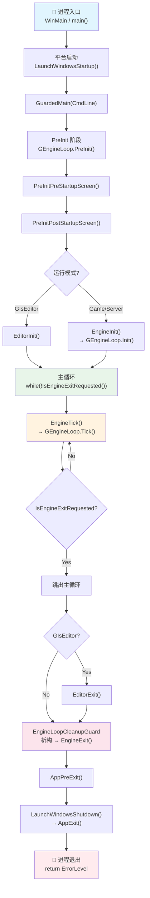

---

## 二、PreInitPreStartupScreen 详细流程

```mermaid
flowchart TD
    subgraph PreInitPreStartupScreen
        A1["开始"] --> A2["运行延迟注册<br/>(StartOfEnginePreInit)"]
        A2 --> A3["设置日志主线程"]
        A3 --> A4["解析命令行选项"]
        A4 --> A5["Ctrl-C 注册<br/>(Windows)"]
        A5 --> A6["切换到可执行文件目录"]
        A6 --> A7["FCommandLine::Set(CmdLine)<br/>⚡ 关键：命令行设置"]
        A7 --> A8["LaunchSetGameName()<br/>解析项目名称和路径"]
        A8 --> A9["FTraceAuxiliary::Initialize()<br/>追踪系统"]
        A9 --> A10["LLM/MemPro 初始化<br/>内存追踪"]
        A10 --> A11["输出设备初始化<br/>GError/GWarn/GLogConsole"]
        A11 --> A12["命令行别名/文件扩展"]
        A12 --> A13["FIoDispatcher::Initialize()<br/>I/O 分发器"]
        A13 --> A14["平台文件覆盖检查<br/>(Pak/网络等)"]
        A14 --> A15["IFileManager 初始化<br/>新异步 I/O"]
        
        A15 --> B1["🎯 运行模式确定"]
        B1 --> B1a["检查 DedicatedServer"]
        B1a --> B1b["检查 Commandlet<br/>(-RUN= / *Commandlet)"]
        B1b --> B1c["检查 Editor<br/>(UE_EDITOR 构建默认)"]
        B1c --> B1d["默认 RegularClient"]
        B1d --> B1e["设置 GIsClient/GIsServer/GIsEditor"]
        
        B1e --> C1["FTaskGraphInterface::Startup()<br/>任务图系统"]
        C1 --> C2["创建线程池<br/>GThreadPool + GBackgroundPool"]
        C2 --> C3["FThreadStats::StartThread()<br/>统计线程"]
        C3 --> C4["LoadCoreModules()<br/>→ CoreUObject"]
        C4 --> C5["渲染 CVar 缓存初始化"]
        C5 --> C6["LoadPreInitModules()<br/>Engine/Renderer/SlateRHIRenderer..."]
        
        C6 --> D1["CSV Profiler 初始化"]
        D1 --> D2["AppLifetimeEventCapture::Init()"]
        D2 --> D3["AppInit()"]
        D3 --> D3a["├─ 文本本地化初始化"]
        D3a --> D3b["├─ 平台 PreInit"]
        D3b --> D3c["├─ 日志设备设置"]
        D3c --> D3d["├─ 配置系统初始化<br/>FConfigCacheIni"]
        D3d --> D3e["└─ CVars 热修复应用"]
        
        D3e --> E1["GIOThreadPool 创建"]
        E1 --> E2["系统设置初始化<br/>GSystemSettings.Initialize()"]
        E2 --> E3["应用 CVar (Renderer/GC/Net等)"]
        E3 --> E4["预加载分辨率设置"]
        E4 --> E5["Scalability 系统初始化<br/>+ 设备配置 + 可伸缩性状态"]
        E5 --> E6["ConsoleVariables.ini 加载"]
        E6 --> E7["平台初始化<br/>PlatformInit + AppInit + MemoryInit"]
        E7 --> E8["InitGamePhys()<br/>物理引擎初始化"]
        
        E8 --> F1["Shader 目录清理"]
        F1 --> F2["InitEngineTextLocalization()"]
        F2 --> F3["FSlateApplication::InitHighDPI()"]
        F3 --> F4{"是否专用服务器?"}
        F4 -->|"No"| F5["创建 Slate 应用<br/>FSlateApplication::Create()"]
        F4 -->|"Yes"| F6["仅基础初始化<br/>EKeys + CoreStyle"]
        
        F5 --> G1["FPackageLocalizationManager 初始化"]
        F6 --> G1
        G1 --> G2["Shader 参数/类型 注册提交"]
        G2 --> G3["PreInitHMDDevice()"]
        G3 --> G4["⚡ RHIInit()<br/>RHI 子系统初始化"]
        G4 --> G5["PipelineStateCache::Init()"]
        G5 --> G6["RenderUtilsInit()"]
        G6 --> G7["ShaderCodeLibrary 初始化"]
        
        G7 --> H1{"需要烘焙数据?"}
        H1 -->|"No"| H2["DDC 初始化<br/>+ ShaderCompilingManager"]
        H1 -->|"Yes"| H3["跳过 DDC"]
        H2 --> H4["GetRendererModule()"]
        H3 --> H4
        
        H4 --> I1["InitializeShaderTypes()"]
        I1 --> I2["CompileGlobalShaderMap()<br/>⚡ 编译全局着色器"]
        I2 --> I3["CreateMoviePlayer()"]
        I3 --> I4["FPreLoadScreenManager::Create()"]
        
        I4 --> J1{"平台支持早期影片?"}
        J1 -->|"Yes"| J2["PostInitRHI() +<br/>InitRenderingThread()"]
        J1 -->|"No"| J3["延迟到 PostStartupScreen"]
        J2 --> J3
        
        J3 --> K1["Slate 渲染器创建<br/>+ 字体服务"]
        K1 --> K2["加载 PostSplashScreen 模块"]
        K2 --> K3["播放预加载画面"]
        K3 --> K4["Verse VM 启动"]
        K4 --> K5["保存 PreInitContext"]
        K5 --> K6["return 0 ✅"]
    end
    
    style A7 fill:#ff9800,color:#fff
    style B1 fill:#9c27b0,color:#fff
    style G4 fill:#f44336,color:#fff
    style I2 fill:#f44336,color:#fff
    style K6 fill:#4caf50,color:#fff
```

---

## 三、PreInitPostStartupScreen 详细流程

```mermaid
flowchart TD
    subgraph PreInitPostStartupScreen
        P1["开始"] --> P2{"IsEngineExitRequested?"}
        P2 -->|"Yes"| P99["return 0"]
        P2 -->|"No"| P3["恢复 PreInitContext"]
        
        P3 --> P4["播放早期启动影片<br/>或预加载画面"]
        P4 --> P5["挂载早期安装的 Pak"]
        P5 --> P6["重新应用 CVar (如果热修复)"]
        P6 --> P7["FShaderCodeLibrary::OpenLibrary()<br/>打开游戏 Shader 库"]
        P7 --> P8["FShaderPipelineCache::<br/>OpenPipelineFileCache()"]
        P8 --> P9["InitGameTextLocalization()"]
        
        P9 --> Q1["注册短包名"]
        Q1 --> Q2["加载 AssetRegistry 模块"]
        Q2 --> Q3["IPackageResourceManager::Initialize()"]
        Q3 --> Q4["⚡ ProcessNewlyLoadedUObjects()<br/>UObject 注册 + CDO 初始化"]
        Q4 --> Q5["初始化默认材质<br/>+ 断言材质存在"]
        Q5 --> Q6["IStreamingManager::Get()<br/>纹理流式系统"]
        Q6 --> Q7["FModuleManager::<br/>StartProcessingNewlyLoadedObjects()"]
        
        Q7 --> R1["LoadStartupCoreModules()<br/>Core/Networking/UMG/Slate/Editor..."]
        R1 --> R2["加载 PreLoadingScreen 模块"]
        
        R2 --> R3{"平台支持早期影片?"}
        R3 -->|"No"| R4["PostInitRHI() +<br/>InitRenderingThread()"]
        R3 -->|"Yes"| R5["已初始化 (跳过)"]
        R4 --> R5
        
        R5 --> S1["播放引擎加载画面<br/>或影片"]
        S1 --> S2["LoadStartupModules()<br/>PreDefault → Default → PostDefault"]
        
        S2 --> S3{"运行模式?"}
        S3 -->|"Commandlet"| S4["🔷 Commandlet 路径"]
        S3 -->|"Game/Editor"| S5["继续初始化"]
        
        S4 --> S4a["查找 Commandlet 类"]
        S4a --> S4b["创建 GEngine<br/>(EditorEngine 或 GameEngine)"]
        S4b --> S4c["GEngine->Init(this)"]
        S4c --> S4d["执行 Commandlet->Main()"]
        S4d --> S4e["RequestEngineExit()<br/>→ return ErrorLevel"]
        
        S5 --> T1["关闭 DisregardForGC"]
        T1 --> T2["NotifyRegistrationComplete()"]
        T2 --> T3["设置 OSS 服务端代理"]
        T3 --> T4["初始化 ProfileVisualizer"]
        T4 --> T5["初始化高分辨率截图"]
        T5 --> T6["预缓存全局 Shader Compute PSO"]
        T6 --> T7["UE::RenderCommandPipe::Initialize()"]
        T7 --> T8["运行冒烟测试"]
        T8 --> T9["PreInitContext.Cleanup()"]
        T9 --> T10["return 0 ✅<br/>(剩余 20% SlowTask)"]
    end
    
    style Q4 fill:#f44336,color:#fff
    style S4 fill:#9c27b0,color:#fff
    style T10 fill:#4caf50,color:#fff
    style P99 fill:#ff9800,color:#fff
```

---

## 四、Init 阶段详细流程

```mermaid
flowchart TD
    subgraph FEngineLoop::Init
        I1["开始"] --> I2{"GIsEditor?"}
        I2 -->|"No"| I3["创建 UGameEngine<br/>从 INI 读取类名<br/>NewObject&lt;UEngine&gt;()"]
        I2 -->|"Yes"| I4["创建 UUnrealEdEngine<br/>GEngine = GEditor = GUnrealEd<br/>(仅 WITH_EDITOR)"]
        
        I3 --> I5["GEngine->ParseCommandline()"]
        I4 --> I5
        I5 --> I6["InitTime()<br/>设置 MaxTickTime/MaxFrameCounter"]
        I6 --> I7["⚡ GEngine->Init(this)<br/>核心引擎初始化"]
        
        I7 --> I8["FCoreDelegates::<br/>OnPostEngineInit.Broadcast()"]
        I8 --> I9["加载 PostEngineInit 模块"]
        I9 --> I10["SetEngineStartupModuleLoadingComplete()"]
        I10 --> I11["GEngine->Start()<br/>启动 World + GameInstance"]
        
        I11 --> J1["SessionService 启动"]
        J1 --> J2["创建 EngineService + TraceService"]
        J2 --> J3["等待引擎加载画面完成"]
        J3 --> J4["FTraceAuxiliary::<br/>EnableCommandlineChannels()"]
        J4 --> J5["Media 模块初始化<br/>设置时间源"]
        J5 --> J6["AutomationWorker 加载"]
        J6 --> J7["AutomationController 加载<br/>(非 Shipping)"]
        J7 --> J8["GIsRunning = true ⚡"]
        J8 --> J9["FViewport::<br/>SetGameRenderingEnabled(true)"]
        J9 --> J10["FThreadHeartBeat::Start()<br/>心跳监控开始"]
        J10 --> J11["FCoreDelegates::<br/>OnFEngineLoopInitComplete.Broadcast()"]
        J11 --> J12["FExternalProfiler 初始化"]
        J12 --> J13["return 0 ✅"]
    end
    
    style I7 fill:#f44336,color:#fff
    style J8 fill:#4caf50,color:#fff
    style J13 fill:#4caf50,color:#fff
```

---

## 五、主循环 Tick 详细流程

```mermaid
flowchart TD
    subgraph "FEngineLoop::Tick() — 每帧执行"
        T0["🔁 帧开始<br/>TRACE_BEGIN_FRAME(Game)"] --> T1
        
        subgraph 帧前阶段
            T1["BeginExitIfRequested()"] --> T2["FThreadHeartBeat::HeartBeat()"]
            T2 --> T3["TickHotfixables()"]
            T3 --> T4["LatchRenderThreadConfiguration()"]
            T4 --> T5["BlockingForceFinished()<br/>影片阻塞检查"]
        end
        
        T5 --> T6
        
        subgraph 时间管理
            T6["⚡ GEngine-><br/>UpdateTimeAndHandleMaxTickRate()"] --> T6a["更新 DeltaTime/CurrentTime"]
            T6a --> T6b["限制最大帧率<br/>(Sleep if needed)"]
        end
        
        T6b --> T7
        
        subgraph 渲染帧开始
            T7["ENQUEUE: BeginFrame<br/>→ RenderThread"] --> T7a["BeginFrameRenderThread()"]
            T7a --> T7b["FScene::StartFrame()<br/>(所有场景)"]
            T7b --> T7c["StartRecording()<br/>渲染命令管道"]
        end
        
        T7c --> T8["动态分辨率 BeginFrame<br/>(非编辑器游戏)"]
        T8 --> T9["TickPerformanceMonitoring()"]
        T9 --> T10["FStats::AdvanceFrame()"]
        T10 --> T11["CalculateFPSTimings()"]
        T11 --> T12["PumpMessages()<br/>Windows 消息泵"]
        
        T12 --> T13{"ShouldUseIdleMode()?<br/>应用无焦点/休眠模式"}
        T13 -->|"Yes"| T14["Sleep(0.1s)<br/>跳过主要逻辑"]
        T13 -->|"No"| T15["Slate PollGameDeviceState()<br/>轮询输入设备"]
        T14 --> T31
        
        T15 --> T16["Slate FinishedInputThisFrame()"]
        T16 --> T17
        
        subgraph 游戏引擎核心
            T17["⚡ GEngine->Tick(DeltaTime, IdleMode)"] --> T17a["遍历 WorldContext"]
            T17a --> T17b["UWorld::Tick()"]
            T17b --> T17c["├─ PrePhysics: Actor Tick"]
            T17c --> T17d["├─ DuringPhysics: 物理模拟"]
            T17d --> T17e["├─ PostPhysics: 动画/相机"]
            T17e --> T17f["├─ NetDriver::TickFlush"]
            T17f --> T17g["├─ TimerManager::Tick"]
            T17g --> T17h["└─ 关卡流式加载"]
            T17h --> T17i["GameInstance::Tick()"]
            T17i --> T17j["GameViewport::Tick()"]
        end
        
        T17j --> T18["等待引擎加载画面完成"]
        T18 --> T19["FAssetCompilingManager::<br/>ProcessAsyncTasks()"]
        T19 --> T20["FMoviePlayerProxy::<br/>BlockingForceFinished()"]
        
        T20 --> T21["Slate Tick<br/>(PlatformAndInput)"]
        T21 --> T22{"bDoAsyncEndOfFrameTasks?"}
        T22 -->|"Yes"| T23["后台线程并发<br/>NetDriver::TickFlushAsyncEndOfFrame"]
        T22 -->|"No"| T25
        T23 --> T24
        
        subgraph Slate渲染
            T24["Slate Tick<br/>(TimeAndWidgets)"] --> T24a["更新 Widget 动画"]
            T24a --> T24b["绘制脏 Widget"]
            T24b --> T24c["生成渲染批次"]
            T24c --> T24d["提交到渲染线程"]
        end
        
        T25["等待并发任务完成"]
        T24d --> T26["AutomationController::Tick()<br/>(Editor)"]
        T26 --> T27["AutomationWorker::Tick()"]
        
        T27 --> T28["StopRecording()<br/>渲染命令管道"]
        T28 --> T29["FScene::EndFrame()<br/>(所有场景)"]
        T29 --> T30["RHITick(DeltaTime)<br/>RHI 帧更新"]
        
        T30 --> T31["SetSimulationLatencyMarkerEnd()"]
        T31 --> T32
        
        subgraph 延迟任务
            T32["清理 PendingCleanupObjects"] --> T33["DeleteLoaders()"]
            T33 --> T34["FTSTicker::Tick()<br/>CoreTicker 回调"]
            T34 --> T35["FThreadManager::Tick()"]
            T35 --> T36["GEngine->TickDeferredCommands()<br/>延迟控制台命令"]
        end
        
        T36 --> T37["Media::TickPostRender()"]
        T37 --> T38["FCoreDelegates::<br/>OnEndFrame.Broadcast()"]
        T38 --> T39["GFrameCounter++ ⚡"]
        T39 --> T40["动态分辨率 EndFrame"]
        T40 --> T41["ENQUEUE: EndFrame<br/>→ RenderThread"]
        
        T41 --> T42["EndFrameRenderThread()<br/>+ RHI EndFrame"]
        T42 --> T43["CPU/GPU 统计更新"]
        T43 --> T44["TRACE_END_FRAME(Game)"]
        T44 --> T45["🔁 帧结束"]
    end
    
    style T0 fill:#2196f3,color:#fff
    style T6 fill:#ff9800,color:#fff
    style T17 fill:#f44336,color:#fff
    style T39 fill:#4caf50,color:#fff
    style T45 fill:#2196f3,color:#fff
```

---

## 六、Exit 详细流程

```mermaid
flowchart TD
    subgraph "FEngineLoop::Exit() — 15 阶段有序关闭"
        X0["开始"] --> X1
        subgraph 阶段1 ["阶段 1: 立即清理"]
            X1["ClearPendingCleanupObjects()"] --> X2["GIsRunning = 0"]
            X2 --> X3["GLogConsole = nullptr"]
        end
        
        X3 --> X4
        subgraph 阶段2 ["阶段 2: 画面系统"]
            X4["FPreLoadScreenManager::Destroy()"] --> X5["FVisualLogger::TearDown()"]
            X5 --> X6["FAssetCompilingManager::Shutdown()"]
        end
        
        X6 --> X7
        subgraph 阶段3 ["阶段 3: 服务"]
            X7["delete EngineService"] --> X8["delete TraceService"]
            X8 --> X9["SessionService->Stop()"]
            X9 --> X10["delete AsyncQueues"]
        end
        
        X10 --> X11
        subgraph 阶段4 ["阶段 4: 引擎预退出"]
            X11["⚡ GEngine->PreExit()"] --> X12["ReleaseAudioDeviceManager()"]
        end
        
        X12 --> X13
        subgraph 阶段5 ["阶段 5: 异步加载清理"]
            X13["FlushAsyncLoading()"] --> X14["SetAsyncLoadingAllowed(false)"]
            X14 --> X15["CancelTextureStreaming()"]
            X15 --> X16["BlockTillAllRequestsFinished()"]
            X16 --> X17["FAudioDeviceManager::Shutdown()"]
        end
        
        X17 --> X18
        subgraph 阶段6 ["阶段 6: UI 关闭"]
            X18["⚡ FSlateApplication::Shutdown()"] --> X19["FEngineFontServices::Destroy()"]
        end
        
        X19 --> X20
        subgraph 阶段7 ["阶段 7: 模块和 PSO"]
            X20["UnloadModule(AssetTools)"] --> X21["UnloadModule(WorldBrowser)"]
            X21 --> X22["ClearMaterialPSORequests()"]
            X22 --> X23["PipelineStateCache::WaitForAllTasks()"]
        end
        
        X23 --> X24
        subgraph 阶段8 ["阶段 8: AppPreExit"]
            X24["⚡ AppPreExit()"] --> X24a["OnPreExit.Broadcast()"]
            X24a --> X24b["OnExit.Broadcast()"]
            X24b --> X24c["GIOThreadPool->Destroy()"]
            X24c --> X24d["Verse::VerseVM::Shutdown()"]
            X24d --> X24e["delete ShaderCompilingManager"]
        end
        
        X24e --> X25["TermGamePhys()<br/>物理引擎"]
        
        X25 --> X26
        subgraph 阶段9 ["阶段 9: 资源和 Shader"]
            X26["IPackageResourceManager::Shutdown()"] --> X27["UnloadModule(AssetRegistry)"]
            X27 --> X28["⚡ ShutdownRenderingThread()"]
            X28 --> X29["FShaderPipelineCache::Shutdown()"]
            X29 --> X30["ShutdownGlobalShaderMap()"]
            X30 --> X31["FShaderCodeLibrary::Shutdown()"]
        end
        
        X31 --> X32
        subgraph 阶段10 ["阶段 10: I/O 和虚拟化"]
            X32["TearDownIoDispatcher()"] --> X33["FIoDispatcher::Shutdown()"]
            X33 --> X34["UE::Virtualization::Shutdown()"]
        end
        
        X34 --> X35["IHotReloadInterface::SaveConfig()"]
        
        X35 --> X36
        subgraph 阶段11 ["阶段 11: 模块卸载"]
            X36["⚡ UnloadModulesAtShutdown()<br/>按加载逆序调用<br/>所有模块的 ShutdownModule()"]
        end
        
        X36 --> X37
        subgraph 阶段12 ["阶段 12: 流式和线程池"]
            X37["IStreamingManager::Shutdown()"] --> X38["FRealtimeGPUProfiler::SafeRelease()"]
            X38 --> X39["DestroyMoviePlayer()"]
            X39 --> X40["FThreadStats::StopThread()"]
            X40 --> X41["GThreadPool->Destroy()"]
            X41 --> X42["GBackgroundPriorityThreadPool->Destroy()"]
        end
        
        X42 --> X43
        subgraph 阶段13 ["阶段 13: 最终系统"]
            X43["RHIExit()"] --> X44["⚡ FTaskGraphInterface::Shutdown()"]
            X44 --> X45["ShutdownTaggedStorage()"]
            X45 --> X46["FWindowsPerfCounters::Shutdown()"]
            X46 --> X47["FFrameProProfiler::TearDown()"]
        end
        
        X47 --> X48["Exit() 完成"]
    end
    
    style X11 fill:#f44336,color:#fff
    style X18 fill:#f44336,color:#fff
    style X24 fill:#ff9800,color:#fff
    style X28 fill:#f44336,color:#fff
    style X36 fill:#9c27b0,color:#fff
    style X44 fill:#f44336,color:#fff
```

---

## 七、AppExit 最终清理

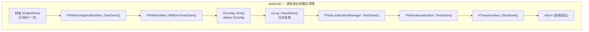

---

## 八、GuardedMain 完整调用链

```mermaid
flowchart TD
    subgraph "GuardedMain(CmdLine) 完整生命周期"
        GM1["GuardedMain 入口"] --> GM2["PreMainInit.Broadcast()"]
        GM2 --> GM3["创建 EngineLoopCleanupGuard<br/>(RAII 退出保障)"]
        GM3 --> GM4["MiniDump 文件名设置"]
        GM4 --> GM5["⚡ EnginePreInit(CmdLine)"]
        
        GM5 --> GM6{"PreInit 成功?"}
        GM6 -->|"Error"| GM7["return ErrorLevel<br/>(CleanupGuard 析构 → Exit)"]
        GM6 -->|"OK"| GM8["FScopedSlowTask(100)"]
        
        GM8 --> GM9{"GIsEditor?"}
        GM9 -->|"Yes"| GM10["EditorInit(GEngineLoop)"]
        GM9 -->|"No"| GM11["EngineInit()<br/>→ GEngineLoop.Init()"]
        
        GM10 --> GM12["记录初始化时间"]
        GM11 --> GM12
        GM12 --> GM13["BootTiming 输出"]
        
        GM13 --> GM14{"IsEmbedded?"}
        GM14 -->|"Yes"| GM15["不进入主循环<br/>(由外部应用驱动)"]
        GM14 -->|"No"| GM16
        
        GM16["🔁 主循环入口"] --> GM17
        subgraph 主循环 ["主循环: while(!IsEngineExitRequested())"]
            GM17["EngineTick()<br/>→ GEngineLoop.Tick()"] --> GM18{"IsEngineExitRequested?"}
            GM18 -->|"No"| GM17
        end
        
        GM18 -->|"Yes"| GM19["跳出循环"]
        GM19 --> GM20{"GIsEditor?"}
        GM20 -->|"Yes"| GM21["EditorExit()"]
        GM20 -->|"No"| GM22["CleanupGuard 析构"]
        GM21 --> GM22
        GM22 --> GM23["EngineExit()<br/>→ GEngineLoop.Exit() + AppPreExit()"]
        GM23 --> GM24["return ErrorLevel<br/>→ 返回给平台层"]
    end
    
    style GM5 fill:#ff9800,color:#fff
    style GM16 fill:#2196f3,color:#fff
    style GM17 fill:#f44336,color:#fff
    style GM24 fill:#795548,color:#fff
```

---

## 九、线程生命周期对比

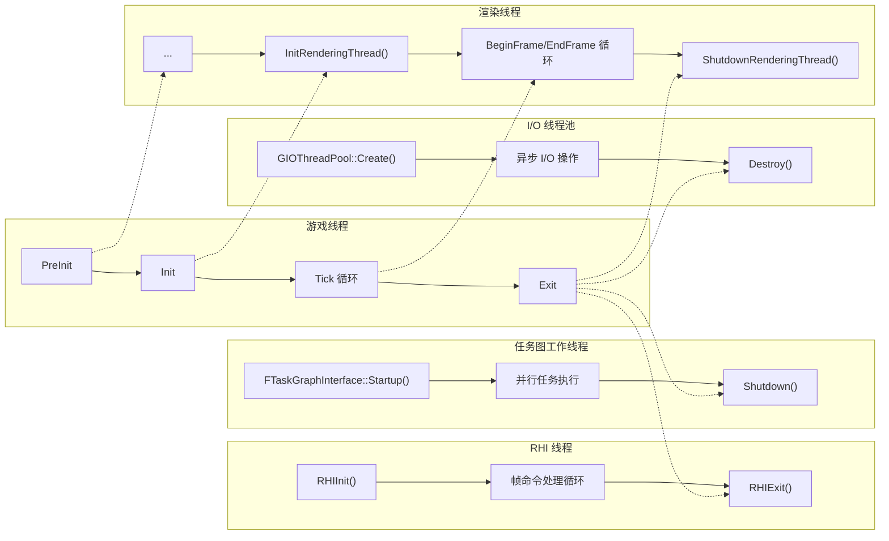

---

## 十、关键初始化时间线

```mermaid
gantt
    title 引擎初始化时间线
    dateFormat X
    axisFormat %s
    
    section 平台入口
    WinMain / LaunchWindowsStartup :done, 0, 2
    
    section PreInitPreStartupScreen
    命令行和环境设置            :done, 2, 5
    追踪和内存系统              :done, 5, 7
    文件系统和 I/O              :done, 7, 10
    运行模式确定                :crit, 10, 12
    任务图和线程池              :done, 12, 14
    模块加载 (Core/PreInit)     :done, 14, 17
    CVar 和可伸缩性             :done, 17, 19
    平台初始化                  :done, 19, 20
    RHI 初始化                  :crit, 20, 24
    Shader 类型初始化           :done, 24, 27
    编译全局 Shader Map         :crit, 27, 32
    Slate 和渲染器创建          :done, 32, 35
    
    section PreInitPostStartupScreen
    Pak 和 Shader 库打开        :done, 35, 37
    UObject 系统初始化           :crit, 37, 41
    默认材质和流式系统          :done, 41, 43
    启动模块加载                :done, 43, 49
    渲染线程启动                :crit, 49, 51
    Commandlet 执行 (如适用)     :done, 51, 55
    
    section Init
    创建 GEngine                 :done, 55, 56
    GEngine->Init()              :crit, 56, 62
    GEngine->Start()             :done, 62, 65
    服务启动                     :done, 65, 67
    
    section 进入主循环
    主循环 Tick                  :active, 67, 100
```

---

## 十一、模块加载阶段与函数映射

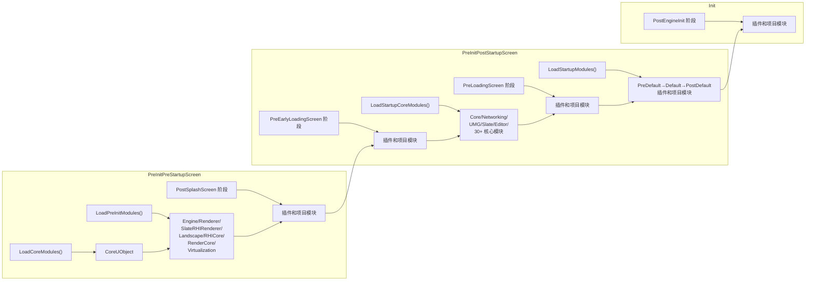

---

## 十二、引擎模式决策树

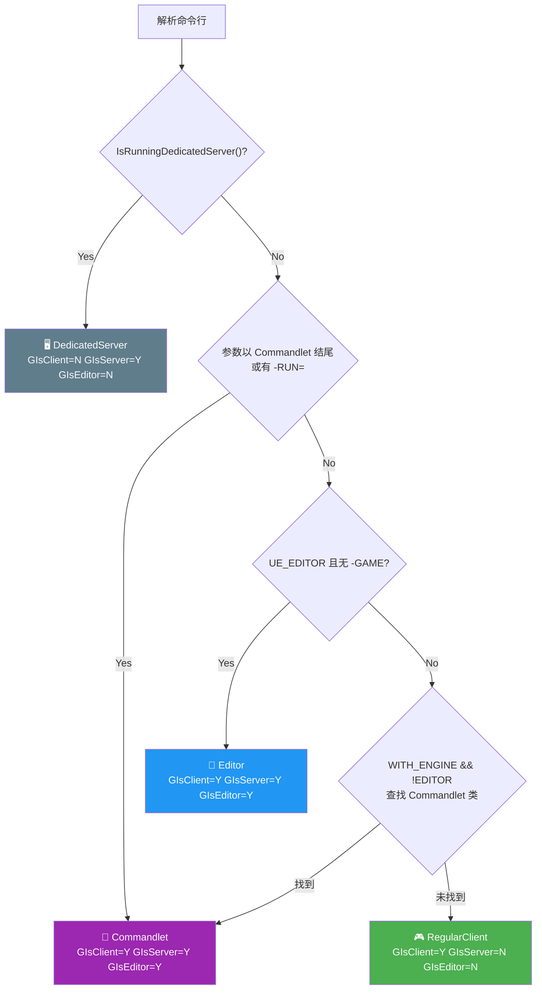

---

## 图例说明

| 符号 | 含义 |
|------|------|
| ⚡ | 关键步骤 |
| 🔁 | 循环入口 |
| 🎯 | 决策点 |
| 🔷 | 特殊路径 |
| ✅ | 成功返回 |
| 🚀 / 🏁 | 起点 / 终点 |
| 🔴 红色 | 核心引擎操作（RHI Init, GEngine Tick 等） |
| 🟠 橙色 | 关键配置操作（命令行，AppPreExit 等） |
| 🟣 紫色 | 特殊路径（Commandlet，模块卸载等） |
| 🟢 绿色 | 成功/完成标记 |
| 🔵 蓝色 | 循环入口/帧边界 |
