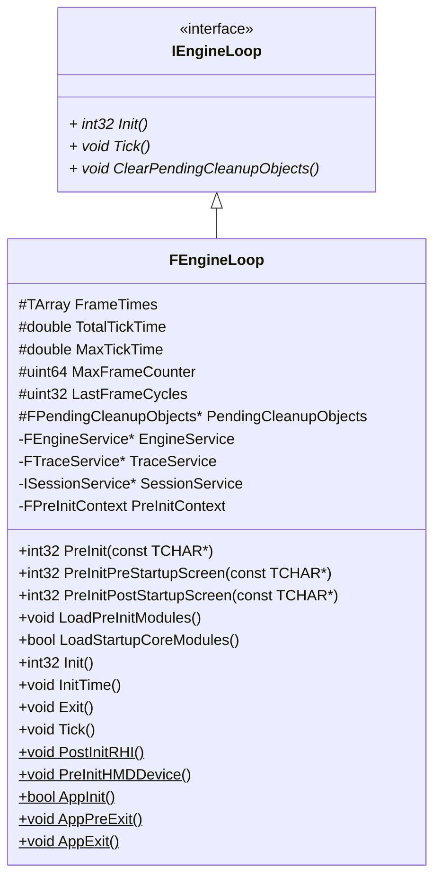

# 引擎启动

> 本文档基于 Unreal Engine 5.5.4 源码分析，核心代码文件：
> - `Runtime/Launch/Public/LaunchEngineLoop.h`
> - `Runtime/Launch/Private/LaunchEngineLoop.cpp`
> - `Runtime/Launch/Private/Launch.cpp`
> - `Runtime/Launch/Private/Windows/LaunchWindows.cpp`

## 系统主函数

在 Windows 平台下，主函数 `WinMain` 定义在 `LaunchWindows.cpp` 中：

```cpp
int32 WINAPI WinMain(_In_ HINSTANCE hInInstance, _In_opt_ HINSTANCE hPrevInstance, _In_ char* pCmdLine, _In_ int32 nCmdShow)
{
    int32 Result = LaunchWindowsStartup(hInInstance, hPrevInstance, pCmdLine, nCmdShow, nullptr);
    LaunchWindowsShutdown();
    return Result;
}
```
其中，`hInInstance`、`hPrevInstance`、`pCmdLine` 和 `nCmdShow` 都是 [Win32 API](https://learn.microsoft.com/zh-cn/windows/win32/) 中，[WinMain](https://learn.microsoft.com/zh-cn/windows/win32/api/winbase/nf-winbase-winmain) 函数的参数。在 WinMain 函数中：
- `LaunchWindowsStartup`：完成 Windows 平台下，环境的设置，并调用 `GuardedMain` 函数，进入引擎的设置与主循环
- `LaunchWindowsShutdown`：应用结束，调用 `FEngineLoop::AppExit()`

## `GuardedMain` 函数

`GuardedMain` 函数定义在 `Launch.cpp` 中：

```cpp
/**
 * Static guarded main function. Rolled into own function so we can have error handling for debug/ release builds depending
 * on whether a debugger is attached or not.
 */
int32 GuardedMain( const TCHAR* CmdLine )
```

`GuardedMain` 是受保护的 UE5 引擎主函数，它需要实现游戏引擎三个基本的流程：
1. **初始化 Init**
2. **主循环 Tick**
3. **退出 Exit**

```
GuardedMain
    ├─ PreMainInitDelegate
    ├─ EnginePreInit
    │       └─ GEngineLoop.PreInit
    ├─ EngineInit
    │       └─ GEngineLoop.Init
    ├─ while (!IsEngineExitRequested())
    │       └─ EngineTick
    │               └─ GEngineLoop.Tick
    └─ EngineExit
        └─ GEngineLoop.Exit
```

> 如果是在编辑器下（`GIsEditor == true`），还需完成编辑器的初始化和退出（`EditorInit/EditorExit`）。

> **Embedded 模式**：是把 Unreal Engine 作为一个库，嵌入到其他宿主程序中运行，而不是由 UE 自己作为独立进程控制完整生命周期。如果是 Embedded 模式，`GuardedMain` 将只完成引擎的初始化工作，不负责主循环和退出两个阶段。Tick 和 Exit 交由宿主程序执行。

## `FEngineLoop` 类

`GEngineLoop` 是定义在 `Launch.cpp` 中的全部变量，其类型是 `FEngineLoop`，声明在 `LaunchEngineLoop.h` 中，是对引擎初始化、主循环和退出三阶段的封装。

