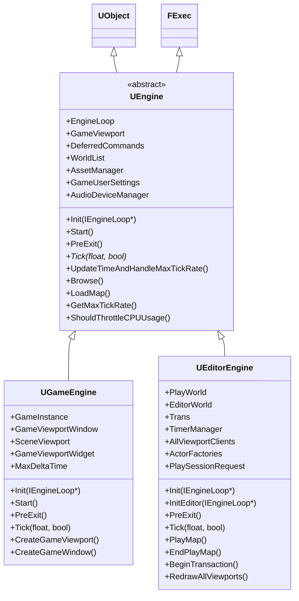

# UEngine / UGameEngine / UEditorEngine 解析

> 本文档基于 Unreal Engine 5.5.4 源码分析，核心代码文件：
> - `Runtime/Engine/Classes/Engine/Engine.h` — UEngine 声明 (~3951 行)
> - `Runtime/Engine/Classes/Engine/GameEngine.h` — UGameEngine 声明
> - `Runtime/Engine/Private/UnrealEngine.cpp` — UEngine 实现 (~16000 行)
> - `Runtime/Engine/Private/GameEngine.cpp` — UGameEngine 实现
> - `Editor/UnrealEd/Classes/Editor/EditorEngine.h` — UEditorEngine 声明
> - `Editor/UnrealEd/Private/EditorEngine.cpp` — UEditorEngine 实现

---

## 1. 类继承体系

```
UObject
  └─ UEngine (abstract)               ← 所有引擎类的抽象基类
       ├─ UGameEngine                  ← 独立游戏启动器
       └─ UEditorEngine               ← Unreal Editor 引擎
```

`UEngine` 同时实现了 `FExec` 接口，可执行控制台命令。从概念上讲，`UEngine` 是 `FEngineLoop`（主循环）和实际游戏/编辑器系统之间的桥梁。

**关键关系**：
- `GEngine` — 全局指针，指向当前的 `UEngine` 实例
- `FEngineLoop::GEngineLoop` — 持有并驱动 `UEngine`
- `GEditor` — 全局指针，当使用编辑器时，指向 `UEditorEngine`（`UEditorEngine::Init` 中 `GEditor = this`）

```
FEngineLoop::Init()
  └─ NewObject<UEngine>(...) → GEngine
       ├─ 游戏模式: GEngine 是 UGameEngine（或项目指定的子类）
       └─ 编辑器模式: GEngine 是 UUnrealEdEngine（→ UEditorEngine）
  
FEngineLoop::Tick()
  └─ GEngine->Tick(DeltaTime, bIdleMode)
       ├─ UGameEngine::Tick() → 遍历 WorldContext → UWorld::Tick(LEVELTICK_All)
       └─ UEditorEngine::Tick() → 编辑器 Tick + PIE 世界 Tick
```



---

## 2. UEngine —— 抽象基类

### 2.1 类声明

```cpp
// Engine.h:707-711
UCLASS(abstract, config=Engine, defaultconfig, transient, MinimalAPI)
class UEngine : public UObject, public FExec
{
    GENERATED_UCLASS_BODY()
    // ...
};
```

- `abstract` — 不能直接实例化
- `config=Engine` — 默认从 `Engine.ini` 读取配置
- `transient` — 不随关卡保存
- `FExec` — 可以执行控制台命令（`Exec` 函数）

### 2.2 核心成员变量

#### 默认类配置（DefaultClasses）

| 变量 | 类型 | 说明 |
|------|------|------|
| `ConsoleClass` | `TSubclassOf<UConsole>` | 游戏控制台类 |
| `GameViewportClientClass` | `TSubclassOf<UGameViewportClient>` | 游戏视口客户端类 |
| `LocalPlayerClass` | `TSubclassOf<ULocalPlayer>` | 本地玩家类 |
| `WorldSettingsClass` | `TSubclassOf<AWorldSettings>` | WorldSettings 类 |
| `NavigationSystemClass` | `TSubclassOf<UNavigationSystemBase>` | 导航系统类 |
| `AvoidanceManagerClass` | `TSubclassOf<UAvoidanceManager>` | 避让管理器类 |
| `GameUserSettingsClass` | `TSubclassOf<UGameUserSettings>` | 游戏用户设置类 |
| `LevelScriptActorClass` | `TSubclassOf<ALevelScriptActor>` | 关卡脚本 Actor 类 |
| `DefaultBlueprintBaseClassName` | `FSoftClassPath` | 新蓝图默认基类 |

#### 游戏单例

| 变量 | 类型 | 说明 |
|------|------|------|
| `GameSingleton` | `UObject*` | 游戏全局单例对象（启动时生成） |
| `AssetManager` | `UAssetManager*` | 全局资产管理器实例 |
| `GameUserSettings` | `UGameUserSettings*` | 全局游戏用户设置实例 |

#### 默认资源和纹理

UEngine 维护了大量默认渲染资源的路径和缓存指针：

| 资源 | 说明 |
|------|------|
| `DefaultTexture` | 全局默认纹理（找不到纹理时使用） |
| `DefaultDiffuseTexture` | 默认漫反射纹理 |
| `DefaultBSPVertexTexture` | BSP 顶点渲染纹理 |
| `HighFrequencyNoiseTexture` | 高频噪声纹理（后处理用） |
| `DefaultBokehTexture` | 默认散景纹理（FFT Bloom） |
| `DefaultBloomKernelTexture` | 默认 Bloom 核纹理 |
| `DefaultFilmGrainTexture` | 默认胶片颗粒纹理 |
| `WireframeMaterial` | 线框渲染材质 |
| `DebugMeshMaterial` | 调试网格材质 |
| `NaniteHiddenSectionMaterial` | Nanite 隐藏截面材质 |
| `EmissiveMeshMaterial` | 自发光网格材质 |
| `LevelColorationLitMaterial` | 关卡着色材质（光照模式） |
| `LevelColorationUnlitMaterial` | 关卡着色材质（无光照模式） |
| `LightingTexelDensityMaterial` | 光照贴图像素密度材质 |
| `VertexColorMaterial` | 顶点颜色可视化材质 |
| `InvalidLightmapSettingsMaterial` | 无效光照贴图提示材质 |
| `ArrowMaterial` / `ArrowMaterialYellow` | 箭头/Widget 渲染材质 |
| `DefaultPhysMaterial` / `DefaultDestructiblePhysMaterial` | 默认物理材质 |
| `RemoveSurfaceMaterial` | BSP 表面移除指示材质 |
| `PreviewShadowsIndicatorMaterial` | 预览阴影指示材质 |
| `ConstraintLimitMaterial` | 约束限制可视化材质 |
| `PreIntegratedSkinBRDFTexture` | 预积分皮肤 BRDF 纹理 |
| `BlueNoiseScalarTexture` / `BlueNoiseVec2Texture` | 蓝噪声纹理 |
| `GGXLTCAmpTexture` / `GGXLTCMatTexture` | LTC (线性变换余弦) 纹理 |
| `SheenLTCTexture` | Sheen LTC 纹理 |
| `GGXReflectionEnergyTexture` / `GGXTransmissionEnergyTexture` | 镜面反射/透射能量纹理 |
| `SheenEnergyTexture` / `DiffuseEnergyTexture` | Sheen/漫反射能量纹理 |
| `GlintTexture` / `GlintTexture2` | 闪烁 BSDF 纹理 |
| `SimpleVolumeTexture` / `SimpleVolumeEnvTexture` | 体积 LUT 纹理 |
| `MiniFontTexture` | 着色器内字体渲染纹理 |
| `WeightMapPlaceholderTexture` | 地形权重图占位纹理 |
| `LightMapDensityTexture` | 光照贴图密度纹理 |

#### 编辑器专用资源 (WITH_EDITORONLY_DATA)

| 资源 | 说明 |
|------|------|
| `GeomMaterial` | 几何模式渲染材质 |
| `BoneWeightMaterial` | 骨骼权重渲染材质 |
| `ClothPaintMaterial` / `ClothPaintMaterialWireframe` | 布料绘制材质 |
| `PhysicalMaterialMaskMaterial` | 物理材质遮罩渲染材质 |
| `DebugEditorMaterial` | 编辑器调试材质 |
| `DefaultFlattenMaterial` / `DefaultHLODFlattenMaterial` | 材质展平 |
| `TexturePaintingMaskMaterial` | 纹理绘制遮罩材质 |
| `EditorBrushMaterial` | Builder Brush 渲染材质 |

#### 字体系统

| 变量 | 说明 |
|------|------|
| `TinyFont` / `TinyFontName` | 最小引擎文本字体 |
| `SmallFont` / `SmallFontName` | 小字体（大多数调试显示） |
| `MediumFont` / `MediumFontName` | 中等字体 |
| `LargeFont` / `LargeFontName` | 大字体 |
| `SubtitleFont` / `SubtitleFontName` | 字幕字体 |
| `AdditionalFonts` / `AdditionalFontNames` | 额外加载的字体 |

#### 渲染和颜色配置

| 配置项 | 说明 |
|--------|------|
| `ShaderComplexityColors` | Shader 复杂度着色颜色 |
| `QuadComplexityColors` | Quad 复杂度着色颜色 |
| `LightComplexityColors` | 光照复杂度着色颜色 |
| `StationaryLightOverlapColors` | 静态光照重叠着色颜色 |
| `LODColorationColors` / `HLODColorationColors` | LOD 着色颜色 |
| `StreamingAccuracyColors` | 纹理流式精度着色颜色 |
| `GPUSkinCacheVisualization*` | GPU SkinCache 可视化颜色 |
| `SelectedMaterialColor` | 选中对象材质颜色 |
| `SelectionOutlineColor` | 选中对象轮廓颜色 |
| `SubduedSelectionOutlineColor` | 子选中轮廓颜色 |
| `C_WorldBox`, `C_BrushWire`, `C_Volume` 等 | 编辑器各种线框/体积颜色 |
| `LightingOnlyBrightness` | 仅光照渲染模式亮度 |

#### 帧率/时间控制

| 变量 | 说明 |
|------|------|
| `CustomTimeStep` | 自定义时间步长控制器（替代默认时钟，如同步到外部进程） |
| `TimecodeProvider` | 时间码提供器（如与外部设备同步） |
| `bUseFixedFrameRate` | 是否使用固定帧率 |
| `FixedFrameRate` | 固定帧率值 |
| `bSmoothFrameRate` | 是否启用帧率平滑（指数平滑 DeltaTime） |
| `SmoothedFrameRateRange` | 平滑帧率范围 |
| `bGenerateDefaultTimecode` | 是否从系统时钟生成默认时间码 |
| `GenerateDefaultTimecodeFrameRate` | 默认时间码的帧率 |
| `MinDesiredFrameRate` | 最低期望帧率（低于此时降低画质） |
| `DisplayGamma` | 显示 Gamma 设置 |

#### 关键内部变量

| 变量 | 说明 |
|------|------|
| `EngineLoop` | 指向 `IEngineLoop` 的回调指针（实际 `FEngineLoop`） |
| `GameViewport` | 当前游戏视口 `UGameViewportClient*` |
| `DeferredCommands` | 延迟控制台命令队列（每帧结束时由 `TickDeferredCommands` 执行） |
| `bIsInitialized` | 引擎是否已初始化 |
| `LastGCFrame` | 上一次 GC 的帧号（防止同一帧内多次 GC） |
| `bFullPurgeTriggered` | 是否触发了完全清除 |
| `bShouldDelayGarbageCollect` | 是否延迟 GC 一帧 |
| `AudioDeviceManager` | 音频设备管理器（所有音频设备的所有者） |
| `MainAudioDeviceHandle` | 主音频设备句柄 |
| `StereoRenderingDevice` | 立体渲染设备接口（VR/AR） |
| `XRSystem` | XR 追踪系统接口 |
| `EyeTrackingDevice` | 眼动追踪设备接口 |
| `ViewExtensions` | 场景视图扩展（渲染线程修改视图参数） |
| `NearClipPlane` | 相机近裁剪面距离 |

#### 网络和传输

| 变量 | 说明 |
|------|------|
| `WorldList` | `TArray<FWorldContext>` — 所有世界上下文列表 |
| `TransitionType` | 当前地图转换状态（None/Paused/Loading/Saving/Connecting/Precaching） |
| `TransitionDescription` | 转换描述文本 |
| `TransitionGameMode` | 目标地图的游戏模式 |

#### 蓝图设置

| 变量 | 说明 |
|------|------|
| `MaximumLoopIterationCount` | 脚本最大循环次数（超过时警告） |
| `bCanBlueprintsTickByDefault` | 蓝图 Actor/Component 是否默认可以 Tick |
| `bOptimizeAnimBlueprintMemberVariableAccess` | 优化动画蓝图成员变量访问 |
| `bAllowMultiThreadedAnimationUpdate` | 允许多线程动画更新 |

#### 调试和信息显示

| 变量 | 说明 |
|------|------|
| `bEnableOnScreenDebugMessages` | 是否处理屏幕调试消息 |
| `bEnableOnScreenDebugMessagesDisplay` | 是否显示屏幕调试消息 |
| `bSuppressMapWarnings` | 是否屏蔽地图警告 |
| `ScreenMessages` | 屏幕消息集合（按 Key 索引） |
| `PriorityScreenMessages` | 优先屏幕消息集合 |

#### 委托 (Delegates)

| 委托 | 说明 |
|------|------|
| `TravelFailureEvent` | 服务器传输失败 |
| `NetworkFailureEvent` | 网络失败 |
| `NetworkLagStateChangedEvent` | 网络延迟状态改变 |
| `NetworkDDoSEscalationEvent` | DDoS 检测升级 |
| `WorldAddedEvent` | 世界被添加到引擎 |
| `WorldDestroyedEvent` | 世界从引擎中移除 |

### 2.3 核心虚函数表

| 方法 | 说明 | 基类实现 |
|------|------|---------|
| `Init(IEngineLoop*)` | 初始化引擎 | **有** — 通用：资源/子系统/音频/分析 |
| `Start()` | 启动游戏（与 Init 分离） | **空** (no-op) |
| `PreExit()` | 关闭时调用，退出清除前 | **有** — 广播 + 屏保 + 时间码 + XR + 子系统 |
| `Tick(float, bool)` | 每帧更新 | **纯虚** `PURE_VIRTUAL` |
| `GetMaxTickRate()` | 计算最大 Tick 速率 | **有** — 基于 MaxFPS/FixedFrameRate |
| `GetMaxFPS()` | 获取最大 FPS | **有** — 从 t.MaxFPS 或 FixedFrameRate |
| `SetMaxFPS(float)` | 覆盖最大 FPS | **有** |
| `UpdateRunningAverageDeltaTime()` | 更新运行平均 DeltaTime | **有** — 指数平滑 |
| `IsAllowedFramerateSmoothing()` | 是否允许帧率平滑 | **有** |
| `UpdateTimeAndHandleMaxTickRate()` | 更新 FApp::CurrentTime/DeltaTime | **有** — 核心时间管理 |
| `CorrectNegativeTimeDelta()` | 修正负 DeltaTime | **有** — 可被子类重写 |
| `ShouldThrottleCPUUsage()` | 是否限制 CPU 使用 | **有** |
| `AreAllWindowsHidden()` | 所有窗口是否隐藏/最小化 | **有** |
| `Browse(FWorldContext&, FURL, FString&)` | 浏览到指定地图 URL | **有** |
| `LoadMap(FWorldContext&, FURL, UPendingNetGame*, FString&)` | 实际加载地图 | **有** |
| `RedrawViewports()` | 重绘所有视口 | **有** |
| `NetworkRemapPath()` | 网络路径重映射 | **有** |
| `ShouldDoAsyncEndOfFrameTasks()` | 是否执行异步帧结束任务 | **有** |
| `IsRenderingSuspended()` | 是否暂停渲染（让出 GPU 给其他应用） | **有** |
| `GetDefaultWorldFeatureLevel()` | 获取默认世界 Feature Level | **有** |
| `OnLostFocusPause(bool)` | 窗口失焦时暂停/恢复 | **有** |
| `ProcessToggleFreezeCommand()` | 处理冻结命令 | **有** |
| `ProcessToggleFreezeStreamingCommand()` | 处理冻结流式命令 | **有** |
| `HandleNetworkFailure()` / `HandleTravelFailure()` | 网络/旅行失败处理 | **有** |

---

## 3. UEngine 生命周期方法详解

### 3.1 `UEngine::Init(IEngineLoop* InEngineLoop)`

最核心的引擎初始化方法。游戏和编辑器都会在各自的 `Init()` 中调用 `Super::Init()`。

```
UEngine::Init()
├── 1. 启动错误/警告收集器（非 Shipping/Test）
├── 2. 为 Crash Reporter 编码插件信息（非内部构建）
├── 3. 设置内存警告处理器 (EngineMemoryWarningHandler)
├── 4. 保存 IEngineLoop 引用 (this->EngineLoop = InEngineLoop)
├── 5. RegisterEngineElements() — 注册类型化元素框架
├── 6. FURL::StaticInit() — URL 系统静态初始化
├── 7. EngineSubsystemCollection.Initialize(this) — 初始化引擎子系统
├── 8. 处理 -DEFAULTMAP= 命令行覆盖
├── 9. InitializeRunningAverageDeltaTime() — 初始化 DeltaTime 平滑
├── 10. AddToRoot() — 添加到 GC 根，防止引擎被回收
├── 11. 注册 PreGarbageCollect 委托
├── 12. 初始化 HMD / VR 设备 (InitializeHMDDevice)
├── 13. 初始化眼动追踪设备 (InitializeEyeTrackingDevice)
├── 14. 如果是游戏客户端（非编辑器）：禁用屏保
├── 15. Slate 声音设备初始化
│     └─ CurrentSlateApp.InitializeSound(FSlateSoundDevice)
├── 16. 设置缩略图压缩/解压器（PNG/JPEG）
├── 17. ★ LoadConfig() — 从 Engine.ini 加载所有 UPROPERTY(config)
│     └─ 这读取 DefaultMaterial、DefaultTexture 等的实际路径
├── 18. SetConfiguredProcessLimits()
├── 19. InitializeObjectReferences() — 加载所有默认资源
│     ├── 加载 TinyFont/SmallFont/MediumFont/LargeFont/SubtitleFont
│     ├── 加载 DefaultMaterials:
│     │   ├── WireframeMaterial, DebugMeshMaterial
│     │   ├── LevelColorationLit/UnlitMaterial
│     │   ├── ShadedLevelColorationLit/UnlitMaterial
│     │   ├── VertexColorMaterial, VertexColorViewMode 系列
│     │   ├── InvalidLightmapSettingsMaterial
│     │   ├── PreviewShadowsIndicatorMaterial
│     │   ├── ArrowMaterial (然后 → ArrowMaterialYellow)
│     │   ├── ConstraintLimit 系列材质实例
│     │   └── NaniteHiddenSectionMaterial, EmissiveMeshMaterial
│     ├── 加载 DefaultTextures:
│     │   ├── DefaultTexture, DefaultDiffuseTexture
│     │   ├── DefaultBSPVertexTexture, HighFrequencyNoiseTexture
│     │   ├── DefaultBokehTexture, DefaultBloomKernelTexture
│     │   ├── DefaultFilmGrainTexture
│     │   ├── PreIntegratedSkinBRDFTexture (条件)
│     │   ├── BlueNoiseScalarTexture, BlueNoiseVec2Texture
│     │   ├── MiniFontTexture, WeightMapPlaceholderTexture
│     │   ├── LightMapDensityTexture
│     │   └── GlintTexture, LTC/Energy Textures
│     ├── 创建 GameSingleton（如果配置了类名）
│     ├── 创建 AssetManager（如果配置了类名）
│     └── 创建 GameUserSettings
├── 20. 从配置更新 bEnableOnScreenDebugMessages
├── 21. 更新 Script 最大循环迭代计数
├── 22. SetNearClipPlaneGlobals(NearClipPlane)
├── 23. UTextRenderComponent::InitializeMIDCache()
├── 24. ★ 如果是编辑器：创建 Editor World Context 和空的 Editor World
│     └─ GWorld = InitialWorldContext.World()
├── 25. 初始化网络项目版本
├── 26. 处理命令行 Exec/ExecCmds/vsync/novsync
├── 27. DDC::NotifyBootComplete()
├── 28. 注册 Travel/Network/Lag 失败处理器
├── 29. 初始化 Online 子系统
├── 30. 初始化 Buffer/Nanite/VirtualShadowMap 可视化数据
├── 31. InitializePortalServices()
├── 32. FEngineAnalytics::Initialize()
├── 33. ★ InitializeAudioDeviceManager() — 创建主音频设备
│     └─ 如果存在 MainAudioDeviceHandle，设置默认 BaseSoundMix
├── 34. 动态加载引擎运行时模块:
│     ├── ImageWriteQueue
│     ├── StreamingPauseRendering
│     ├── MovieScene / MovieSceneTracks
│     ├── LevelSequence / CinematicCamera
│     └── SparseVolumeTexture (Editor only)
├── 35. AssetManager->FinishInitialLoading()
├── 36. ★ 注册引擎内置统计 (EngineStats 数组):
│     ├── STAT_Version, STAT_NamedEvents, STAT_VerboseNamedEvents
│     ├── STAT_FPS, STAT_Summary, STAT_Unit
│     ├── STAT_DrawCount, STAT_Hitches, STAT_AI
│     ├── STAT_Timecode, STAT_FrameCounter
│     ├── STAT_ColorList, STAT_Levels, STAT_Detailed
│     ├── STAT_UnitCriticalPath, STAT_UnitMax, STAT_UnitGraph
│     ├── STAT_UnitTime, STAT_Raw, STAT_ParticlePerf, STAT_TSR
│     └── 广播 NewStatDelegate 通知监听者
├── 37. 处理 NetTrace 命令行参数
├── 38. RecordHMDAnalytics() — HMD 分析记录
├── 39. 检查额外开发内存
└── 40. InitThreadConfig() — 配置线程亲和性
```

**关键设计点**：
- `Init()` 调用 `AddToRoot()` 防止 GC 回收引擎对象
- `Init()` 不调用 `Start()`——它们被有意分离
- 编辑器路径下 `Init()` 立即创建空白 Editor World（非编辑器不在此创建）
- `LoadConfig()` 触发所有 `UPROPERTY(config)` 从 INI 文件加载值
- `InitializeObjectReferences()` 是加载所有默认资源（材质/纹理/字体）的核心函数

### 3.2 `UEngine::Start()`

```cpp
// UnrealEngine.cpp:2319-2322
void UEngine::Start()
{
    // Start the game!
}
```

基类中是**空操作**（no-op）。真正的实现在子类：

| 子类 | Start 实现 |
|------|-----------|
| **UGameEngine** | `GameInstance->StartGameInstance()` — 创建世界、加载启动地图、开始游戏 |
| **UEditorEngine** | 不重写 — 编辑器启动由 `InitEditor()` 处理 |

### 3.3 `UEngine::PreExit()`

在 `FEngineLoop::Exit()` 的第 4 阶段被调用。通用清理在子类 `PreExit()` 之前执行：

```
UEngine::PreExit()
├── 1. FCoreDelegates::OnEnginePreExit.Broadcast() — 引擎预退出广播
├── 2. 关闭 NetTrace
├── 3. 销毁所有活跃的 MovieSceneCapture 实例
├── 4. UTextRenderComponent::ShutdownMIDCache()
├── 5. ShutdownRenderingCVarsCaching()
├── 6. FEngineAnalytics::Shutdown(bIsEngineShutdown=true)
├── 7. 停止并删除 ScreenSaverInhibitor（屏保抑制线程）
├── 8. 关闭 TimecodeProvider（如果已初始化）
├── 9. 关闭 CustomTimeStep（如果已初始化）
├── 10. 关闭眼动追踪设备
├── 11. 关闭 XR 追踪系统 (XRSystem)
├── 12. 关闭立体渲染设备 (StereoRenderingDevice)
├── 13. 释放 ViewExtensions
├── 14. 清理导航系统配置 (NavigationSystemConfigClass)
├── 15. CancelAllPending() — 取消所有异步操作
├── 16. EngineSubsystemCollection.Deinitialize() — 反初始化引擎子系统
├── 17. 通知插件管理器 (OnEnginePreExit)
└── 18. GEngine = nullptr（如果之前指向此引擎实例）
```

### 3.4 `UEngine::UpdateTimeAndHandleMaxTickRate()`

每帧 `FEngineLoop::Tick()` 步骤 #5 中调用。是所有 FPS/时间管理的核心：

```
UpdateTimeAndHandleMaxTickRate()
├── 如果有 CustomTimeStep:
│   └── CustomTimeStep->UpdateTimeStep(DeltaTime) — 委托时间更新
├── 否则：使用系统时钟
│   ├── 计算原始 DeltaTime = Now - LastTime
│   ├── CorrectNegativeTimeDelta(DeltaRealTime) — 战斗负时间
│   ├── 应用时间膨胀 (GetRawTimeDilation)
│   ├── UpdateRunningAverageDeltaTime() — 指数平滑
│   └── [游戏线程] 设置 FApp::CurrentTime, FApp::DeltaTime
├── ★ 最大 Tick 速率限制:
│   ├── GetMaxTickRate(DeltaTime) → 计算 MaxTickRate
│   ├── 如果 MaxTickRate > 0 且当前帧率 > MaxTickRate:
│   │   └── 忙等待或 Sleep(0) 直到满足帧率目标
│   └── 如果 bUseFixedFrameRate: 固定 DeltaTime = 1.0/FixedFrameRate
├── 更新 FApp::IdleTime（等待时间 + 睡眠时间）
├── 更新 Timecode（如果存在 TimecodeProvider）
└── SetSimulationLatencyMarkerStart() — 设置模拟延迟标记
```

---

## 4. UGameEngine —— 游戏引擎

### 4.1 类声明

```cpp
// GameEngine.h:23-27
UCLASS(config=Engine, transient, MinimalAPI)
class UGameEngine : public UEngine
{
    GENERATED_UCLASS_BODY()
    // ...
};
```

### 4.2 核心成员

| 成员 | 类型 | 说明 |
|------|------|------|
| `GameInstance` | `UGameInstance*` | 唯一的 GameInstance（游戏引擎只有一个） |
| `GameViewportWindow` | `TWeakPtr<SWindow>` | 游戏视口所在的 OS 窗口 |
| `SceneViewport` | `TSharedPtr<FSceneViewport>` | 主场景视口（类 FViewport 包装） |
| `GameViewportWidget` | `TSharedPtr<SViewport>` | 游戏视口的 Slate Widget |
| `MaxDeltaTime` | `float` | 最大 DeltaTime（默认 0 = 无限制，防止卡顿后的大幅跳帧） |
| `ServerFlushLogInterval` | `float` | 专用服务器日志刷新间隔（秒，0 = 每帧刷新） |
| `LastTimeLogsFlushed` | `double` | 上次刷新日志的系统时间 |
| `CmdExec` | `TPimplPtr<FEngineConsoleCommandExecutor>` | 控制台命令执行器 |

### 4.3 `UGameEngine::Init(IEngineLoop* InEngineLoop)`

游戏引擎的核心初始化。**在 `UEngine::Init()` 之前和之后都有自己的逻辑**：

```
UGameEngine::Init(InEngineLoop)
├── 1. 创建 CmdExec (FEngineConsoleCommandExecutor)
├── 2. ★ 调用 Super::UEngine::Init(InEngineLoop) — 基类初始化
├── 3. 网络分析器初始化（如果命令行指定了 -NETWORKPROFILER=）
├── 4. ★ 加载并应用用户游戏设置
│     ├── FGlobalComponentRecreateRenderStateContext — 阻塞重建
│     ├── GetGameUserSettings()->LoadSettings()
│     └── GetGameUserSettings()->ApplyNonResolutionSettings()
├── 5. ★ 创建 GameInstance
│     ├── 从 GameMapsSettings 读取 GameInstanceClass
│     ├── NewObject<UGameInstance>(this, GameInstanceClass)
│     │   └── 如果 GameInstanceClass 无效，回退到 UGameInstance
│     └── GameInstance->InitializeStandalone()
├── 6. 初始化 MovieSceneCapture（如果命令行指定）
├── 7. ★ 初始化 GameViewportClient
│     ├── NewObject<UGameViewportClient>(this, GameViewportClientClass)
│     ├── ViewportClient->Init(*GameInstance->GetWorldContext(), GameInstance)
│     ├── GameViewport = ViewportClient
│     └── GameInstance->GetWorldContext()->GameViewport = ViewportClient
├── 8. ★ 创建游戏窗口和视口
│     ├── CreateGameWindow() — 创建操作系统窗口
│     │   ├── DetermineGameWindowResolution() — 确定合适的分辨率和窗口模式
│     │   └── ConditionallyOverrideSettings() — 应用命令行覆盖
│     ├── CreateGameViewport(ViewportClient)
│     │   ├── CreateGameViewportWidget() — 创建 Slate SViewport
│     │   └── 初始化 FSceneViewport
│     ├── SwitchGameWindowToUseGameViewport()
│     └── ★ ViewportClient->SetupInitialLocalPlayer(Error) — 创建 LocalPlayer
│         └── 如果返回 NULL: Fatal Error（没有本地玩家无法运行）
├── 9. BroadcastOnViewportCreated() — 广播视口创建事件
├── 10. Log: "Game Engine Initialized."
└── 11. bIsInitialized = true
```

**关键设计点**：
- `GameInstance` 在引擎级别只有一个——它是所有世界的所有者
- `SetupInitialLocalPlayer()` 失败是 **Fatal** 级别的——没有玩家意味着游戏无法运行
- 游戏窗口的创建发生在 `Init()` 中（不是 `Start()`），因为视口必须在启动前存在
- `FGlobalComponentRecreateRenderStateContext` 确保批量 CVar 更改只触发一次渲染状态重建

### 4.4 `UGameEngine::Start()`

```cpp
void UGameEngine::Start()
{
    UE_LOG(LogInit, Display, TEXT("Starting Game."));
    GameInstance->StartGameInstance();
}
```

`StartGameInstance()` 是真正的 "开始游戏" 触发器：创建初始 World，加载启动地图，开始游戏逻辑循环。

### 4.5 `UGameEngine::Tick(float DeltaSeconds, bool bIdleMode)`

每帧的游戏主更新。**完整帧中游戏逻辑的入口**：

```
UGameEngine::Tick(DeltaSeconds, bIdleMode)
│
├── 前置检查
│   ├── DeltaSeconds < 0 → Fatal Error（负 DeltaTime 崩溃）
│   ├── 慢帧检测: 如果 DeltaSeconds > GSlowFrameLoggingThreshold
│   │   └── Log: "Slow GT frame detected"
│   ├── 专用服务器: 定时刷新日志（ServerFlushLogInterval）
│   └── 非专用服务器且可渲染: CleanupGameViewport()
│
├── 视口关闭检查
│   └── 如果 GIsClient 且 GameViewport == nullptr 且可渲染:
│       └── FPlatformMisc::RequestExit("ViewportClosed")
│
├── 动态画质 (SetDropDetail)
│   └── 如果帧率 < MinDesiredFrameRate 则降低画质
│
├── MediaModule->TickPreEngine()
│   └── 如果没有任何 World 拥有活跃的 Sequencer Tick Handler
│
├── 全局系统 Tick
│   ├── UObject::StaticTick() — 异步加载处理
│   ├── FEngineAnalytics::Tick(DeltaSeconds)
│   └── GConfig->Tick(DeltaSeconds)
│
├── ★★★ 遍历所有 WorldContext 并 Tick ★★★
│   └─ for each WorldContext in WorldList:
│       ├── 跳过: World() == NULL 或 !World()->ShouldTick()
│       ├── 保存/恢复 GWorld
│       ├── TickWorldTravel() — 无缝传输/客户端连接
│       ├── ★ Context.World()->Tick(LEVELTICK_All, DeltaSeconds)
│       │   ├── TG_PrePhysics: 网络接收(TickDispatch) + Actor Tick
│       │   ├── TG_DuringPhysics: 物理模拟
│       │   ├── TG_PostPhysics: 动画 + 相机更新
│       │   ├── 网络发送 (TickFlush)
│       │   ├── TimerManager::Tick
│       │   └── 关卡流式更新
│       ├── 更新反射捕获（天空光优先 → 反射捕获）
│       ├── 地图加载后: causeevent / bTriggerPostLoadMap
│       ├── UpdateTransitionType() — UI 过渡状态
│       ├── 阻断等待异步加载（如果 World 请求）
│       ├── 服务器端: UpdateLevelStreaming()
│       └── ConditionalCommitMapChange() — 提交待处理的地图切换
│
├── FTickableGameObject::TickObjects() — 全局 Tickable 对象
│
├── 恢复原始 GWorld
│
├── MediaModule->TickPostEngine()
│
├── GameViewport->Tick(DeltaSeconds) — 视口级别 Tick
│
├── 首次帧特殊处理
│   ├── 隐藏启动画面
│   ├── 显示游戏窗口
│   └── RegisterGameViewport() 到 Slate
│
├── ★ 渲染
│   ├── 如果 bRenderingSuspended = false:
│   │   ├── RedrawViewports() — 绘制所有视口
│   │   ├── 如果所有窗口隐藏: BlockUntilGPUIdle() — 防止无限提交
│   │   └── PostRenderAllViewports() — 渲染后处理
│   └── 如果 bRenderingSuspended:
│       └── 仍然更新关卡流式
│
├── IStreamingManager::Get().Tick(DeltaSeconds) — 纹理/网格流式
│
├── ★ 音频更新
│   └── GameAudioDeviceManager->UpdateActiveAudioDevices(bIsAnyNonPreviewWorldUnpaused)
│       └── 如果没有任何非预览 World 是未暂停的，则不更新活动设备
│
├── 渲染线程命令
│   ├── GRenderingRealtimeClock.Tick(DeltaSeconds)
│   └── GRenderTargetPool.TickPoolElements()
│
└── 编辑器额外步骤 (WITH_EDITOR)
    ├── BroadcastPostEditorTick(DeltaSeconds)
    └── FAssetRegistryModule::TickAssetRegistry(DeltaSeconds)
```

**关键设计点**：

1. **多 World 支持**：`UGameEngine` 遍历 `WorldList` 中的所有 `FWorldContext`。标准游戏通常只有一个 World，但世界组合或 PIE 可以有多个。

2. **Tick 顺序**：全局系统 → World Tick → 全局 Tickable → 视口 → 渲染 → 流式 → 音频

3. **动态画质**：`SetDropDetail()` 在帧率低于 `MinDesiredFrameRate` 时自动降低渲染保真度。

4. **首次帧**：第一帧不渲染，显示启动画面。`bFirstTime` 设为 `false` 后才显示游戏窗口。

5. **地图切换**：`ConditionalCommitMapChange()` 在 World Tick 之后提交待处理的地图切换。

6. **空闲模式**：当 `bIdleMode=true`（应用不在前台），跳过整个 World Tick 但保持渲染。

### 4.6 `UGameEngine::PreExit()`

```cpp
void UGameEngine::PreExit()
{
    GetGameUserSettings()->SaveSettings();   // 持久化用户设置
    GNetworkProfiler.EnableTracking(false);  // 停止追踪（自动 flush）
    CancelAllPending();                       // 取消所有旅行/连接
    
    // ★ 清理所有 World（逆序拆除）
    for each World:
        World->BeginTearingDown()
        CancelPending(World)                  // 取消待处理的网络连接
        ShutdownWorldNetDriver(World)        // 关闭网络驱动
        World->bIsLevelStreamingFrozen = false
        World->SetShouldForceUnloadStreamingLevels(true)  // 强制卸载所有流式关卡
        World->FlushLevelStreaming(Visibility)  // 确保没有待处理的可见性请求
        World->EndPlay(EEndPlayReason::Quit)
        if World->GetGameInstance() != nullptr:
            World->GetGameInstance()->Shutdown()
        World->CleanupWorld()
    
    Super::PreExit();  // → UEngine::PreExit()
}
```

---

## 5. UEditorEngine —— 编辑器引擎

### 5.1 类声明

```cpp
// EditorEngine.h:344-346
UCLASS(config=Engine, transient, MinimalAPI)
class UEditorEngine : public UEngine
{
    GENERATED_BODY()
    // ...
};
```

### 5.2 核心成员

#### 编辑器工作区

| 成员 | 类型 | 说明 |
|------|------|------|
| `EditorWorld` | `UWorld*` | 编辑器中的原始（非模拟）世界 |
| `PlayWorld` | `UWorld*` | PIE/SIE 模式下的游戏世界 |
| `TempModel` | `UModel*` | 临时 BSP 模型（CSG 操作） |
| `ConversionTempModel` | `UModel*` | 转换用临时模型 |

#### 视口管理

| 成员 | 类型 | 说明 |
|------|------|------|
| `AllViewportClients` | `TArray<FEditorViewportClient*>` | 所有编辑器视口客户端列表 |
| `LevelViewportClients` | `TArray<FLevelEditorViewportClient*>` | 关卡编辑器视口子集 |
| `SlatePlayInEditorMap` | `TMap<FName, FSlatePlayInEditorInfo>` | PIE 视口的 Slate 数据映射 |
| `OnViewportClientListChanged()` | 委托 | 视口列表变更通知 |

#### 编辑器子系统

| 成员 | 类型 | 说明 |
|------|------|------|
| `Trans` | `UTransactor*` | 事务系统（Undo/Redo） |
| `TimerManager` | `TSharedPtr<FTimerManager>` | 编辑器定时器（延迟操作） |
| `EditorWorldExtensionsManager` | `UEditorWorldExtensionManager*` | 编辑器世界扩展管理器 |
| `ActorFactories` | `TArray<UActorFactory*>` | Actor 工厂实例（右键放置菜单） |
| `EditorSubsystemCollection` | 继承 | 编辑器子系统集合 |

#### Play In Editor (PIE) / Simulate In Editor (SIE)

| 成员 | 类型 | 说明 |
|------|------|------|
| `PlaySessionRequest` | `TOptional<FRequestPlaySessionParams>` | 排队的 PIE/SIE 请求（下一帧启动） |
| `PlayInEditorSessionInfo` | `TOptional<FPlayInEditorSessionInfo>` | 当前活跃的 PIE 会话信息 |
| `bIsToggleBetweenPIEandSIEQueued` | `bool` | PIE ↔ SIE 切换请求 |
| `bRequestEndPlayMapQueued` | `bool` | 请求结束当前 PIE 会话 |
| `bAllowMultiplePIEWorlds` | `bool` | 单进程内允许多个 PIE 世界 |
| `PlayWorldDestination` | `int32` | PIE 目标（-1 = 编辑器中，0+ = 控制台） |
| `bMobilePreviewPortrait` | `bool` | 移动端预览的默认方向 |
| `BuildPlayDevice` | `int32` | 移动端预览的目标设备索引 |
| `UserEditedPlayWorldURL` | `FString` | 用户编辑的 PIE URL |
| `InEditorGameURLOptions` | `FString` | 额外的 PIE URL 选项 |

#### 预览和工具

| 成员 | 类型 | 说明 |
|------|------|------|
| `PreviewMeshComp` | `UStaticMeshComponent*` | 预览网格组件 |
| `PreviewAudioComponent` | `UAudioComponent*` | 预览音频组件 |
| `PreviewSoundCue` | `USoundCue*` | 预览 SoundCue |
| `EditorCube` / `EditorSphere` / `EditorPlane` / `EditorCylinder` | `UStaticMesh*` | 编辑器基本几何体 |
| `EditorFont` | `UFont*` | 基于 Canvas 的编辑器使用的字体 |
| `ScratchRenderTarget` (2048/1024/512/256) | `UTextureRenderTarget2D*` | 临时渲染目标 |
| `BrushBuilders` | `TArray<UBrushBuilder*>` | 画刷构建器 |
| `Bad` | `UTexture2D*` | "Bad" 纹理（无效表面指示） |

#### 编辑器渲染/选择设置

| 成员 | 说明 |
|------|------|
| `bShowBrushMarkerPolys` | 在 Builder Brush 和 Volume 上显示半透明标记多边形 |
| `bEnableSocketSnapping` | 启用插座吸附 |
| `bEnableLODLocking` | 相同类型视图 LOD 锁定 |
| `bDrawSocketsInGMode` | 在 G 模式中绘制插座 |
| `bDrawParticleHelpers` | 在编辑器视口中绘制粒子调试辅助 |
| `bFastRebuild` | 启用快速重建 |
| `ClickFlags`, `ClickLocation`, `ClickPlane`, `MouseMovement` | 编辑器点击状态 |
| `PreviewPlatform` | 预览平台信息（Feature Level + Shader Platform） |
| `DefaultWorldFeatureLevel` | 创建新世界的默认 Feature Level |

#### 编辑器事件（部分）

| 事件 | 说明 |
|------|------|
| `OnBlueprintPreCompile()` / `OnBlueprintCompiled()` | 蓝图编译生命周期 |
| `OnBeginObjectMovement()` / `OnEndObjectMovement()` | 对象变换开始/结束 |
| `OnActorsMoved()` | Actor 移动事件 |
| `OnBeginCameraMovement()` / `OnEndCameraMovement()` | 相机移动事件 |
| `PostBugItGoCalled` | BugItGo 命令调用后 |
| `OnLevelActorListChanged()` / `OnLevelActorAdded()` / `OnLevelActorDeleted()` | Actor 列表变更 |
| `OnLevelActorAttached()` / `OnLevelActorDetached()` | Actor 附加/分离 |
| `OnLevelActorFolderChanged()` | Actor 文件夹变更 |
| `OnHLODActorMoved()` / `OnHLODMeshBuild()` 等 | HLOD 变更事件 |
| `OnPostEditorTick()` | 编辑器 Tick 后广播 |
| `OnEditorClose()` | 编辑器关闭事件 |

### 5.3 `UEditorEngine::Init(IEngineLoop* InEngineLoop)`

编辑器引擎初始化分为两层：`Init()` → `InitEditor()`。

```
UEditorEngine::Init(InEngineLoop)
├── 1. 注册核心委托
│     ├── FCoreDelegates::ModalMessageDialog → OnModalMessageDialog
│     ├── FCoreUObjectDelegates::ShouldLoadOnTop → OnShouldLoadOnTop
│     ├── FCoreDelegates::PreWorldOriginOffset
│     ├── FCoreUObjectDelegates::OnAssetLoaded → OnAssetLoaded
│     ├── FWorldDelegates::LevelAddedToWorld / LevelRemovedFromWorld
│     └── IAssetRegistry::OnInMemoryAssetCreated → OnAssetCreated
├── 2. ★ PIE 生命周期委托
│     ├── BeginPIE: 推入/启用游戏文本本地化预览 + 重置动态分辨率历史
│     ├── PrePIEEnded: 销毁 DemoNetDriver
│     └── EndPIE: 弹出/禁用本地化预览 + 恢复动态分辨率 + 重置色觉设置
├── 3. UpdateIsVanillaProduct() + 注册模块变更回调
├── 4. ★★★ GEditor = this — 设置全局编辑器指针
├── 5. ★★★ InitEditor(InEngineLoop) — 核心编辑器初始化（见下）
├── 6. LoadEditorFeatureLevel()
├── 7. Trans = CreateTrans() — 创建事务系统 (UTransactor)
├── 8. LoadDefaultEditorModules() — 加载所有编辑器模块
├── 9. 设置全局 BSP 纹理缩放
├── 10. GLog->EnableBacklog(false)
├── 11. 加载游戏用户设置并应用（ApplySettings(true) 完全应用）
├── 12. 注册 EditorStyleSettings 变更回调
├── 13. Cleanse() — 初始清除（清除选择 + GC + 事务重置）
├── 14. FEditorCommandLineUtils::ProcessEditorCommands() — 处理编辑器命令行
├── 15. CheckForMissingAdvancedRenderingRequirements()
└── 16. bIsInitialized = true
```

### 5.4 `UEditorEngine::InitEditor(IEngineLoop* InEngineLoop)`

编辑器特有的初始化——在游戏引擎中没有对应项：

```
UEditorEngine::InitEditor(InEngineLoop)
├── 1. ★ 初始化 DDC 构建系统
│     ├── 如果 -ExecuteBuildsLocally → 本地构建执行器
│     └── 否则 → 远程构建执行器 + 构建 Workers
├── 2. ★ Super::UEngine::Init(InEngineLoop) — 调用基类
├── 3. PrivateEditorSelection::InitSelectionSets() — 初始化选择集
├── 4. Slate 多选框设置（工具栏图标大小、多选框钩子显示）
├── 5. ★ 色觉缺陷模拟设置
│     ├── DeficiencyType / Severity / Correction
│     └── 应用到 FSlateRenderer
├── 6. UEditorStyleSettings::Init() — 初始化编辑器样式
├── 7. 设置选中材质颜色（来自 ULevelEditorViewportSettings）
│     ├── bHighlightWithBrackets → 选中色 = FLinearColor::Black
│     └── 否则 → 使用 StyleSettings->SelectionColor
├── 8. FNavigationSystem::SetNavigationAutoUpdateEnabled()
├── 9. 创建临时 BSP 模型（TempModel + ConversionTempModel）
├── 10. 创建 TimerManager — 编辑器定时器管理器
├── 11. 创建 EditorWorldExtensionsManager
├── 12. 设置 IsPackageOKToSave 委托
├── 13. UpdateRecentlyLoadedProjectFiles() / UpdateAutoLoadProject()
├── 14. 设置 Widget Reflector 资产访问委托
├── 15. 注册热重载回调 (OnModuleCompileStarted/Finished)
├── 16. 注册书签类型操作
├── 17. ★★★ 创建 Actor 工厂实例
│     ├── 遍历所有 UActorFactory 子类
│     │   ├── 对于 Volume 工厂 → 为每个 Volume 类型 × 工厂创建实例
│     │   └── 对于其他非抽象的 → 如果 bShouldAutoRegister 则创建
│     ├── 按 MenuPriority 排序
│     └── 注册 ReloadAddedClassesDelegate 以便在热重载中为新类创建工厂
├── 18. ★ 初始化 ToolMenus 系统（如果 Slate 初始化了）
│     ├── 设置 EditMenuIcon / EditToolbarIcon
│     ├── 分配 SetTimerForNextTick 委托
│     ├── 注册 "ToolMenus.Edit" 控制台命令
│     └── 注册 "Command" 字符串命令处理器 → GEditor->Exec()
├── 19. 注册资产编译回调 (OnAssetPostCompile)
├── 20. 注册编辑器委托（删除额外对象）
└── 21. 注册 TimecodeProvider / CustomTimeStep 编译委托
```

### 5.5 `UEditorEngine::Tick(float DeltaSeconds, bool bIdleMode)`

最复杂的 Tick 实现。**同时管理编辑器世界和多个 PIE 世界**：

```
UEditorEngine::Tick(DeltaSeconds, bIdleMode)
│
├── 前置处理
│   ├── Clear ObjectsModifiedThisFrame
│   ├── 预留 WorldList 容量
│   ├── IConsoleManager::CallAllConsoleVariableSinks()
│   ├── FRemoteConfigAsyncTaskManager::Tick()
│   └── CleanupGameViewport()
│
├── PIE 视口关闭检查
│   └── 如果 PIE 且 Viewport 关闭且非 Dedicated → EndPlayMap()
│
├── ★ 编辑器世界更新
│   ├── ConditionallyBuildStreamingData()
│   ├── TimerManager->Tick(DeltaSeconds) — 编辑器定时器
│   ├── StaticTick(DeltaSeconds) — 异步加载
│   ├── FEngineAnalytics::Tick()
│   └── ★ 视口实时/可见性状态检查
│       ├── 后台渲染限流 (ThrottleCPUWhenNotForeground)
│       └── 取消后台视图的实时标志
│
├── ★ 音频焦点确定（优先级从高到低）
│   ├── 1) 激活的透视实时视口
│   ├── 2) 任意透视实时视口（先找到的）
│   ├── 3) 激活的透视视口
│   └── 4) 任意透视视口（先找到的）
│
├── 实时状态确定
│   ├── 任何视口是实时的且指向编辑器世界场景 → IsRealtime = true
│   ├── 任何沉浸式 PIE 视口 → bShouldTickEditorWorld = false
│   └── 任何可见的非沉浸式 PIE 视口 → bShouldTickEditorWorld = true
│
├── 音量控制
│   ├── 有焦点或允许后台音频
│   │   ├── 非 PIE: VolumeMultiplier = EditorVolumeLevel
│   │   └── PIE: VolumeMultiplier = 1.0
│   └── 无焦点: SetPreviewMeshMode(false)
│
├── FTickableEditorObject::TickObjects() — 编辑器 Tickable 对象
├── FAssetRegistryModule::TickAssetRegistry()
├── SourceCodeAccess::Tick()
├── DirectoryWatcher::Tick()
│
├── ★ 编辑器 World Tick（如果 bShouldTickEditorWorld 且允许昂贵任务）
│   ├── TickType = IsRealtime ? LEVELTICK_ViewportsOnly : LEVELTICK_TimeOnly
│   └── EditorContext.World()->Tick(TickType, DeltaSeconds)
│       ├── 实时: 更新视口相关（Actor 位置渲染等）
│       └── 非实时: 只更新时间相关（粒子等）
│
├── 编辑器关卡流式预可视 (LevelStreamingVolume Previs)
│   ├── 遍历所有 StreamingLevel
│   └── 根据视口位置计算可见性 → SetShouldBeVisibleInEditor()
│
├── PIE 会话管理
│   ├── StartQueuedPlaySessionRequest() — 启动排队的 PIE 请求
│   ├── ToggleBetweenPIEandSIE() — 如果请求切换
│   └── AddPendingLateJoinClient() — 如果请求延迟加入
│
├── 反射捕获更新（编辑器世界，跳过第一帧）
│
├── DynamicResolution::BeginFrame
│
├── ★★★ PIE 世界 Tick（如果允许昂贵任务）
│   └─ for each PIE WorldContext where World()->ShouldTick():
│       ├── SetPlayInEditorWorld(PlayWorld) — 切换 GWorld
│       ├── 处理固定 PIE Tick (PIEFixedTickSeconds)
│       ├── TickWorldTravel(PieContext, TickDeltaSeconds)
│       ├── UpdateTransitionType(PlayWorld)
│       ├── 专用服务器: UpdateLevelStreaming()
│       ├── GameViewport->SetDropDetail() — 动态画质
│       ├── ★ PlayWorld->Tick(LEVELTICK_All, TickDeltaSeconds)
│       │   ├── [与 UGameEngine 相同的完全 Tick 路径]
│       │   └── bToggledBetweenPIEandSIEThisFrame = bToggled...
│       ├── 阻断等待异步加载（如果请求）
│       ├── 反射捕获更新
│       ├── GameViewport->Tick(TickDeltaSeconds)
│       └── RestoreEditorWorld(OldGWorld) — 恢复 GWorld
│
├── FTickableGameObject::TickObjects() — 如果任何世界被 Tick
│
├── MediaModule->TickPostEngine()
│
├── 再次 CleanupGameViewport()
├── 如果 PIE 视口全关闭 → EndPlayMap()
│
├── EditorWorldExtensionsManager->Tick()
│
├── ★ 编辑器视口客户端 Tick
│   └─ for each AllViewportClients:
│       ├── 如果允许昂贵任务或 bNeedsRedraw，且可见:
│       │   ├── FScopedConditionalWorldSwitcher
│       │   └── ViewportClient->Tick(DeltaSeconds)
│       └── 追踪 bWantsDrawWhenAppIsHidden
│
├── 鼠标悬停状态更新
│   └── 如果鼠标不在任何关卡视口中 → ClearHoverFromObjects()
│
├── 提交 BSP 模型修改 (CommitModelSurfaces)
│
├── ★ 发送所有 EndOfFrame 更新（两阶段：先收集、再发送）
│
├── ★★★ 编辑器视口绘制（批处理优化）
│   ├── 优先绘制当前活跃的关卡编辑视口
│   ├── 然后是其他视口（正交关联视口考虑在内）
│   ├── 每帧只绘制 1 个非实时视口（bEditorFrameNonRealtimeViewportDrawn）
│   └── 如果没有视口被绘制但 RHI 独立线程运行 → FlushRHI
│
├── PostRenderAllViewports()
├── 源代码控制 / 本地化服务 Tick
│
├── ★ PIE 视口渲染
│   └─ for each PIE WorldContext:
│       ├── SetPlayInEditorWorld(PlayWorld)
│       └── if PlayWorld && GameViewport && !bIsSimulatingInEditor:
│           └── RedrawViewports() → 绘制 PIE 渲染结果
│
├── EditorContext.World()->ConditionallyBuildStreamingData() 再次检查
│
├── CleanupGameViewport() 最后检查
│
├── 固定 PIE Tick 速率限制（FApp::GetFixedDeltaTime() sleep）
│
├── RedrawRequests 处理（编辑器重绘请求）
│
├── FTimerManager 定时器清理
│
├── FIOSystemHeartBeat::Tick()
├── BroadcastPostEditorTick(DeltaSeconds)
└── EditorCloseEvent 广播（如果需要）
```

**关键设计点**：

1. **编辑器世界 + PIE 世界共存**：编辑器世界总是先 Tick，然后 PIE 世界在其之后。世界切换使用 `SetPlayInEditorWorld()` / `RestoreEditorWorld()` 配对。

2. **PIE 固定时间步长**：`PIEFixedTickSeconds` 允许 PIE 子系统以独立帧率运行。一个编辑器帧可能包含多次 PIE Tick。

3. **编辑器 Tick 类型分离**：
   - 实时模式 → `LEVELTICK_ViewportsOnly`（只更新与渲染相关的元素）
   - 非实时模式 → `LEVELTICK_TimeOnly`（只更新时间敏感的元素）
   - PIE 模式 → `LEVELTICK_All`（完全 Tick，与游戏一模一样）

4. **视口绘制批处理**：为防止性能损失，每帧只绘制一个非实时视口。实时视口每帧都绘制。

5. **空闲模式**：编辑器中空闲模式与后台限流不同。`FSlateThrottleManager::IsAllowingExpensiveTasks()` 控制是否跳过昂贵的 PIE 和编辑器工作。

6. **第一帧**：跳过了反射捕获更新（`bFirstTick` 检查），因为关卡尚未准备好显示。

### 5.6 `UEditorEngine::PreExit()`

```cpp
void UEditorEngine::PreExit()
{
    if (!HasAnyFlags(RF_ClassDefaultObject))
    {
        // 清理 GWorld
        if (UWorld* World = GWorld)
            World->ClearWorldComponents();
            World->CleanupWorld();
        
        // 清理所有 Inactive 世界
        for each TObjectIterator<UWorld>:
            if World->WorldType == Inactive && World->IsInitialized():
                World->ClearWorldComponents();
                World->CleanupWorld();
        
        // 反初始化编辑器子系统
        EditorSubsystemCollection.Deinitialize();
    }
    
    Super::PreExit();  // → UEngine::PreExit()
}
```

### 5.7 编辑器独有功能一览

#### 事务系统（Undo/Redo）

```cpp
virtual int32 BeginTransaction(const TCHAR* Context, const FText& Description, UObject* PrimaryObject);
virtual int32 EndTransaction();
virtual void CancelTransaction(int32 Index);
bool UndoTransaction(bool bCanRedo = true);
bool RedoTransaction();
void ResetTransaction(const FText& Reason);
bool IsTransactionActive() const;
```

#### PIE 管理

| 方法 | 说明 |
|------|------|
| `PlayMap()` | 启动 PIE 会话（直接调用） |
| `RequestPlaySession()` | 将 PIE 请求排队（延迟到下一帧） |
| `EndPlayMap()` | 结束当前 PIE 会话 |
| `TeardownPlaySession()` | 销毁 PIE 会话并执行清理 |
| `RequestEndPlayMap()` | 将 "结束 PIE" 请求排队 |
| `CreatePIEWorldByDuplication()` | 通过复制编辑器 World 创建 PIE World |
| `SetPIEWorldsPaused(bool)` | 暂停/恢复所有 PIE 世界 |
| `PlaySessionPaused()` / `PlaySessionResumed()` / `PlaySessionSingleStepped()` | 调试器集成 |
| `ProcessDebuggerCommands()` | 来自调试器的输入处理 |
| `BuildPlayWorldURL()` | 构建 PIE 的 URL 参数 |

#### 编辑器视口管理

| 方法 | 说明 |
|------|------|
| `AddViewportClients()` / `RemoveViewportClients()` | 管理编辑器视口 |
| `RedrawAllViewports()` | 重绘所有编辑器和 PIE 视口 |
| `MoveViewportCamerasToActor()` | 将相机定位到目标 Actor |
| `MoveViewportCamerasToComponent()` | 将相机定位到目标 Component |
| `MoveViewportCamerasToBox()` | 将相机定位到包围盒 |
| `UpdateSingleViewportClient()` | 更新单个视口的绘制 |
| `SetViewportsRealtimeOverride()` / `RemoveViewportsRealtimeOverride()` | 实时状态覆盖 |
| `SnapElementTo()` | 吸附元素到指定目标 |
| `SnapViewTo()` | 吸附视图到指定元素 |

#### Actor 管理

| 方法 | 说明 |
|------|------|
| `AddActor()` | 在关卡中生成 Actor |
| `edactCopySelected()` / `edactPasteSelected()` / `edactDuplicateSelected()` | 复制/粘贴/复制 Actor |
| `edactDeleteSelected()` | 删除选中的 Actor |
| `SelectActor()` / `SelectNone()` / `SelectComponent()` | 选择/取消选择 |
| `CanSelectActor()` | 是否可以选中 Actor |

#### BSP / CSG 操作

| 方法 | 说明 |
|------|------|
| `bspBrushCSG()` | 执行 CSG 布尔操作（加/减/交） |
| `RebuildMap()` / `RebuildLevel()` | 重建关卡几何体 |
| `RebuildAlteredBSP()` | 修改后增量重建 BSP |
| `polySelectAll()` / `polySelectMatchingGroups()` 等 | BSP 多边形选择操作 |
| `polyTexPan()` / `polyTexScale()` | 多边形纹理平移/缩放 |

#### 预览功能

| 方法 | 说明 |
|------|------|
| `PlayEditorSound()` / `PlayPreviewSound()` | 播放编辑器声音 |
| `SetPreviewMeshMode()` / `CyclePreviewMesh()` | 预览网格切换 |
| `GetPreviewAudioComponent()` / `ResetPreviewAudioComponent()` | 预览音频 |
| `GetScratchRenderTarget()` | 获取临时渲染目标 |

#### 蓝图/编译

| 方法 | 说明 |
|------|------|
| `BroadcastBlueprintPreCompile()` / `BroadcastBlueprintCompiled()` | 蓝图编译通知 |
| `BroadcastObjectReimported()` | 对象重导入通知 |
| `OnModuleCompileStarted()` / `OnModuleCompileFinished()` | 模块编译回调 |

---

## 6. 三者的对比总结

| 特性 | UEngine (基类) | UGameEngine | UEditorEngine |
|------|---------------|-------------|---------------|
| **定位** | 抽象接口 + 通用实现 | 打包的游戏运行时 | Unreal Editor |
| **Tick 类型** | 纯虚函数（子类实现） | `LEVELTICK_All`（完全游戏 Tick） | `LEVELTICK_ViewportsOnly/TimeOnly`（编辑器）+ `LEVELTICK_All`（PIE） |
| **World 数量** | 定义 WorldList | 通常 1 个 (Game) | 1 个编辑器 + N 个 PIE |
| **视口管理** | 基类 RedrawViewports | 1 个 GameViewport | 多个编辑器视口 + PIE 视口 |
| **Init 重点** | 资源/子系统/音频/分析 | 基类 + 游戏窗口 + 本地玩家 | 基类 + UI/ToolMenus/Actor工厂/事务 |
| **Start** | no-op（空） | `GameInstance->StartGameInstance()` | 不重写 |
| **PreExit** | 通用清理 | 基类 + World 清理 + 设置保存 | 基类 + 编辑器 World 清理 + 子系统 |
| **命令处理** | `Exec()` / `Exec_Dev()` | `Exec()` + 游戏专用命令 | `Exec()` + `Exec_Editor()` + 近百个编辑器命令 |
| **GEditor** | 不适用 | 不适用 | `Init()` 中设置 `GEditor = this` |
| **事务系统** | 不适用 | 不适用 | `UTransactor` (Undo/Redo) |
| **PIE 支持** | 不适用 | 不适用 | 完整 PIE/SIE 管理 |
| **文件位置** | `Runtime/Engine/` | `Runtime/Engine/` | `Editor/UnrealEd/` |

---

## 7. 引擎模式确定

在 `FEngineLoop::PreInitPreStartupScreen()` 中，通过命令行参数确定使用哪种引擎：

```
命令行参数解析
│
├── -SERVER → IsRunningDedicatedServer()
│   └── GIsServer = true, GIsClient = false
│   └── GEngine 类型 = UGameEngine（从 INI 读取 GameEngine 类名）
│
├── -RUN=XXX 或 Commandlet 参数 → IsRunningCommandlet()
│   └── PRIVATE_GIsRunningCommandlet = true
│   └── Commandlet 在 PreInitPostStartupScreen 中执行，不进入主循环
│
├── (UE_EDITOR 构建 & 无 -GAME) → GIsEditor = true
│   └── GEngine 类型 = UUnrealEdEngine (继承自 UEditorEngine)
│   └── 在 GuardedMain 中调用 EditorInit(GEngineLoop)
│
└── 否则 → GIsClient = true（RegularClient）
    └── GEngine 类型 = UGameEngine（或从 Engine.ini 读取的子类）
    └── 在 GuardedMain 中调用 EngineInit() → GEngineLoop.Init()
```

**`GEngine` 的类型由 INI 配置决定**：

```ini
[/Script/Engine.Engine]
; 游戏模式下的引擎类（默认 UGameEngine）
GameEngine=/Script/Engine.GameEngine

; 编辑器模式下的引擎类（默认 UUnrealEdEngine → UEditorEngine）
EditorEngine=/Script/UnrealEd.UnrealEdEngine

; 可选：自定义游戏引擎子类
GameEngine=/Script/MyGame.MyGameEngine
```

---

## 8. 完整生命周期调用链

```
GuardedMain()
│
├── EnginePreInit()
│   └── GEngineLoop.PreInit()
│       ├── PreInitPreStartupScreen()
│       │   └── 决定引擎模式（Game/Server/Editor/Commandlet）
│       └── PreInitPostStartupScreen()
│           └── 如果是 Commandlet：在此创建 GEngine 并执行
│
├── ★ 引擎创建和初始化
│   │
│   ├── 如果是编辑器:
│   │   └── EditorInit(GEngineLoop)
│   │       └── GEngineLoop.Init()
│   │           ├── NewObject<UUnrealEdEngine>(...) → GEngine
│   │           └── UEditorEngine::Init(InEngineLoop)
│   │               ├── 注册委托 + PIE 生命周期
│   │               ├── GEditor = this
│   │               └── InitEditor(InEngineLoop)
│   │                   ├── Super::UEngine::Init(InEngineLoop)
│   │                   │   ├── 加载所有默认资源
│   │                   │   ├── InitializeAudioDeviceManager
│   │                   │   └── AssetManager->FinishInitialLoading
│   │                   ├── 创建 ActorFactories + ToolMenus
│   │                   └── 注册热重载 + 编译回调
│   │               └── bIsInitialized = true
│   │
│   └── 否则（游戏/服务器）:
│       └── EngineInit()
│           └── GEngineLoop.Init()
│               ├── NewObject<UGameEngine>(...) → GEngine
│               ├── UGameEngine::Init(InEngineLoop)
│               │   ├── Super::UEngine::Init(InEngineLoop)
│               │   ├── GetGameUserSettings()->LoadSettings()
│               │   ├── GameInstance = NewObject<UGameInstance>(...)
│               │   ├── GameInstance->InitializeStandalone()
│               │   ├── 创建 GameViewportClient + 本地玩家
│               │   └── CreateGameWindow() + CreateGameViewport()
│               └── bIsInitialized = true
│               ├── GEngine->Start()
│               │   └── GameInstance->StartGameInstance()
│               │       └── 创建初始 World + 加载启动地图
│               └── [PostEngineInit 模块加载]
│
├── ★★★ 主循环 ★★★
│   └── while(!IsEngineExitRequested())
│       └── EngineTick()
│           └── GEngineLoop.Tick()
│               ├── 帧前准备（心跳/热修复/退出检查）
│               ├── UpdateTimeAndHandleMaxTickRate()
│               │   └── GEngine->UpdateTimeAndHandleMaxTickRate()
│               ├── 渲染线程 BeginFrame
│               ├── 平台消息泵 (PumpMessages)
│               ├── ★ GEngine->Tick(DeltaTime, bIdleMode)
│               │   ├── UGameEngine::Tick()
│               │   │   ├── 全局系统 (StaticTick/Analytics/Config)
│               │   │   ├── 遍历 WorldList:
│               │   │   │   └── World->Tick(LEVELTICK_All)
│               │   │   ├── GameViewport->Tick()
│               │   │   ├── RedrawViewports()
│               │   │   ├── 流式管理器/音频
│               │   │   └── 渲染线程计时器
│               │   │
│               │   └── UEditorEngine::Tick()
│               │       ├── TimerManager/StaticTick/Analytics
│               │       ├── EditorContext.World()->Tick(ViewportsOnly/TimeOnly)
│               │       ├── PIE 世界循环:
│               │       │   └── PlayWorld->Tick(LEVELTICK_All)
│               │       ├── 所有 EditorViewportClient->Tick()
│               │       └── 编辑器视口绘制 (UpdateSingleViewportClient)
│               │
│               ├── Slate Tick (TimeAndWidgets)
│               ├── 延迟命令 (TickDeferredCommands)
│               ├── FFrameEndSync::Sync()
│               ├── 渲染线程 EndFrame
│               └── GFrameCounter++
│
├── 如果是编辑器: EditorExit()
│
└── EngineLoopCleanupGuard 析构
    └── EngineExit()
        └── GEngineLoop.Exit()
            ├── ★ GEngine->PreExit()
            │   ├── UGameEngine::PreExit()
            │   │   ├── SaveSettings() + CancelAllPending()
            │   │   ├── World->EndPlay(Quit) + CleanupWorld
            │   │   └── Super::UEngine::PreExit()
            │   │
            │   └── UEditorEngine::PreExit()
            │       ├── GWorld->CleanupWorld()
            │       ├── Inactive Worlds 清理
            │       ├── EditorSubsystemCollection.Deinitialize()
            │       └── Super::UEngine::PreExit()
            │           ├── OnEnginePreExit 广播
            │           ├── 关闭 Timecode/CustomTimeStep/XR
            │           ├── EngineSubsystemCollection.Deinitialize()
            │           └── GEngine = nullptr
            │
            ├── ... 15 阶段子系统关闭 ...
            └── AppPreExit() / AppExit()
```

---

## 9. FWorldContext：世界上下文的容器

`FWorldContext` 是 `UEngine` 的核心数据结构（定义在 `Engine.h:332-486`），它将一个 `UWorld*` 与它的相关状态打包在一起：

```cpp
USTRUCT()
struct FWorldContext
{
    TEnumAsByte<EWorldType::Type> WorldType;   // Game/PIE/Editor/Inactive...
    FSeamlessTravelHandler SeamlessTravelHandler;
    FName ContextHandle;                         // 唯一标识符
    FString TravelURL;                          // 待处理的旅行 URL
    FURL LastURL;                               // 上一次的 URL
    FURL LastRemoteURL;                         // "reconnect" 命令用
    UPendingNetGame* PendingNetGame;            // 待处理的网络游戏
    TArray<FFullyLoadedPackagesInfo> PackagesToFullyLoad; // DLC 包
    TArray<FName> LevelsToLoadForPendingMapChange;
    UGameViewportClient* GameViewport;
    UGameInstance* OwningGameInstance;
    TArray<FNamedNetDriver> ActiveNetDrivers;   // 活跃的网络驱动
    int32 PIEInstance;                          // PIE 实例索引 (-1 = 非 PIE)
    FString PIEPrefix;
    bool RunAsDedicated;
    uint32 AudioDeviceID;

    UWorld* World() const;                      // 获取当前 World
    
private:
    UWorld* ThisCurrentWorld;                   // 实际 World 指针
    TArray<UWorld**> ExternalReferences;        // 外部引用（自动同步）
};
```

**`WorldType` 枚举**决定了该上下文的用途：

| EWorldType | 说明 |
|------------|------|
| `None` | 未初始化 |
| `Game` | 游戏世界（GameEngine 的唯一世界） |
| `Editor` | 编辑器世界（EditorEngine 的主世界） |
| `PIE` | Play In Editor 世界 |
| `EditorPreview` | 编辑器预览世界 |
| `GamePreview` | 游戏预览世界 |
| `GameRPC` | 游戏 RPC（远程过程调用） |
| `Inactive` | 非活跃世界（后台加载） |
