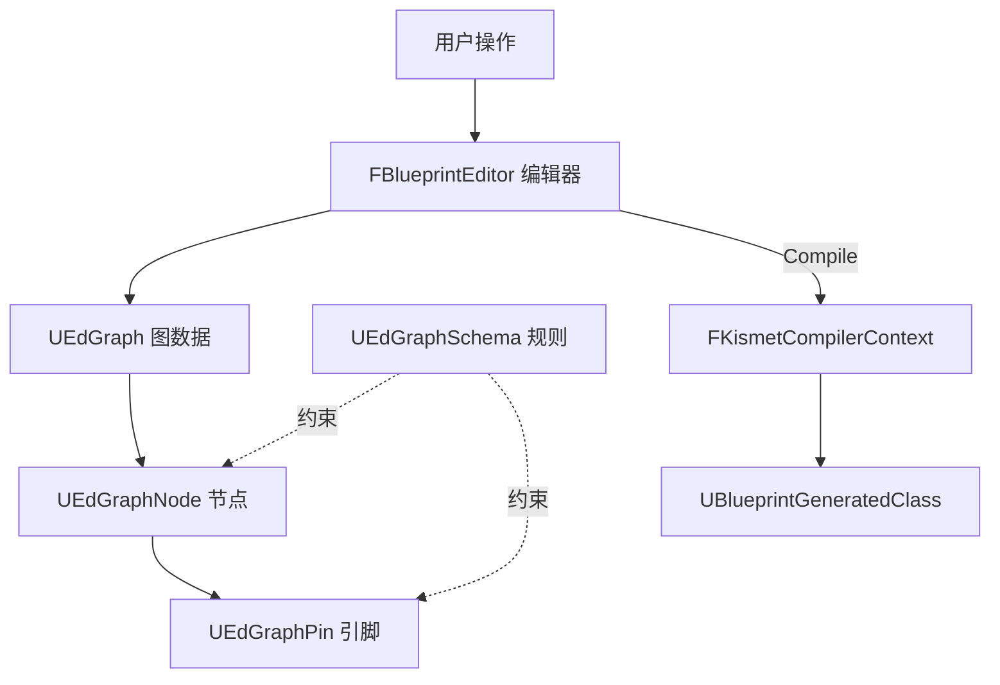
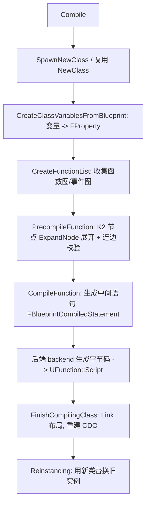
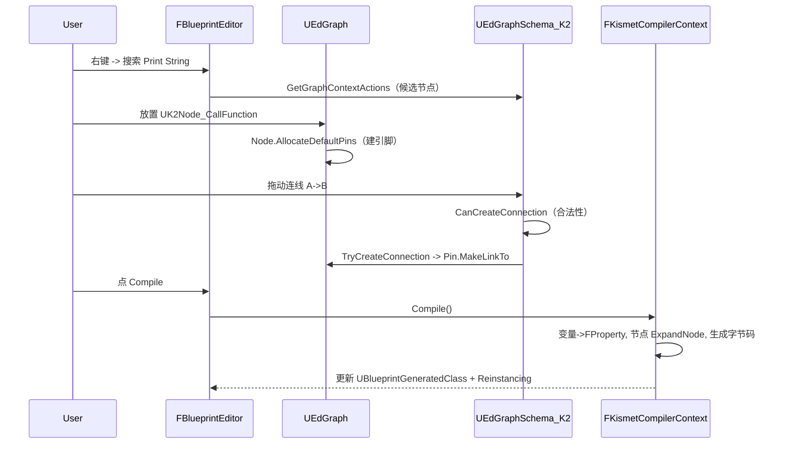

# 蓝图编辑器实现解析

本文结合 UE5.5 源码，解析蓝图编辑器（Blueprint Editor / Kismet）的实现，重点讲清它的**核心概念与数据结构**：图（Graph）、节点（Node）、引脚（Pin）、Schema、K2 节点、编辑器主控 `FBlueprintEditor`，以及把编辑数据变成可运行类的 `FKismetCompilerContext`。

建议先阅读 [Blueprint 实现解析](Blueprint.md) 与 [BlueprintVM 执行解析](BlueprintVM.md)。

主要涉及源码：

- [Source/Runtime/Engine/Classes/EdGraph/EdGraph.h](Source/Runtime/Engine/Classes/EdGraph/EdGraph.h)
- [Source/Runtime/Engine/Classes/EdGraph/EdGraphNode.h](Source/Runtime/Engine/Classes/EdGraph/EdGraphNode.h)
- [Source/Runtime/Engine/Classes/EdGraph/EdGraphPin.h](Source/Runtime/Engine/Classes/EdGraph/EdGraphPin.h)
- [Source/Runtime/Engine/Classes/EdGraph/EdGraphSchema.h](Source/Runtime/Engine/Classes/EdGraph/EdGraphSchema.h)
- [Source/Editor/Kismet/Public/BlueprintEditor.h](Source/Editor/Kismet/Public/BlueprintEditor.h)
- [Source/Editor/KismetCompiler/Public/KismetCompiler.h](Source/Editor/KismetCompiler/Public/KismetCompiler.h)

## 1. 全局视角

蓝图编辑器的职责可以拆成三层：

1. **数据层**：用一套 `UObject`（`UEdGraph`/`UEdGraphNode`/`UEdGraphPin`）表达「用户画的图」，存进 `UBlueprint` 资产（编辑器数据，见 [Blueprint.md](Blueprint.md) 第 4 节）。
2. **规则层**：`UEdGraphSchema` 定义「什么能连、怎么连、右键有哪些节点」等图语义规则。
3. **工具层**：`FBlueprintEditor`（Slate 编辑器）负责 UI、交互、编译触发；`FKismetCompilerContext` 把图编译成 `UBlueprintGeneratedClass`。



关键认知：**编辑器里的一切「图」本身也是 `UObject`**，因此天然可序列化、可 GC、可撤销重做——这与运行时对象共用同一套 `UObject` 基础设施（见 [UObject.md](UObject.md)）。

## 2. 核心概念一：UEdGraph（图）

一张图（事件图、函数图、宏图等）就是一个 `UEdGraph`，见 [EdGraph.h](Source/Runtime/Engine/Classes/EdGraph/EdGraph.h)：

```cpp
class UEdGraph : public UObject
{
    GENERATED_UCLASS_BODY()

    /** 本图遵循的 Schema（规则） */
    UPROPERTY()
    TSubclassOf<class UEdGraphSchema> Schema;

    /** 图中的所有节点 */
    UPROPERTY()
    TArray<TObjectPtr<class UEdGraphNode>> Nodes;

    UPROPERTY() uint32 bEditable:1;
    UPROPERTY() uint32 bAllowDeletion:1;

#if WITH_EDITORONLY_DATA
    /** 纯视觉上的子图 */
    UPROPERTY()
    TArray<TObjectPtr<class UEdGraph>> SubGraphs;

    UPROPERTY() FGuid GraphGuid;
#endif

    ENGINE_API const class UEdGraphSchema* GetSchema() const;
    ENGINE_API virtual void AddNode(UEdGraphNode* NodeToAdd, bool bUserAction = false, bool bSelectNewNode = true);
};
```

- `Nodes`：图里所有节点的容器。
- `Schema`：这张图归哪套规则管（蓝图用 `UEdGraphSchema_K2`）。
- `GraphGuid`：图的唯一标识，用于合并/冲突处理。
- `UBlueprint` 的 `UbergraphPages`/`FunctionGraphs`/`MacroGraphs` 里装的正是一批 `UEdGraph`（见 [Blueprint.md](Blueprint.md) 第 4 节）。

## 3. 核心概念二：UEdGraphNode（节点）

图里每个方块就是一个 `UEdGraphNode`，见 [EdGraphNode.h](Source/Runtime/Engine/Classes/EdGraph/EdGraphNode.h)：

```cpp
class UEdGraphNode : public UObject
{
    GENERATED_UCLASS_BODY()

    /** 本节点的引脚 */
    TArray<UEdGraphPin*> Pins;

    /** 编辑器中的坐标 */
    UPROPERTY() int32 NodePosX;
    UPROPERTY() int32 NodePosY;

    /** 节点唯一标识 */
    UPROPERTY() FGuid NodeGuid;

    /** 创建默认引脚（子类实现） */
    virtual void AllocateDefaultPins() {}

    /** 连线时自动接线（子类实现） */
    virtual void AutowireNewNode(UEdGraphPin* FromPin) {}

    /** 创建一个引脚 */
    ENGINE_API UEdGraphPin* CreatePin(EEdGraphPinDirection Dir, const FEdGraphPinType& InPinType,
                                      const FName PinName, int32 Index = INDEX_NONE);
};
```

- `Pins`：节点的输入/输出引脚集合。
- `AllocateDefaultPins`：节点子类重写此函数，声明自己有哪些引脚（例如「Branch 节点」有 exec 入、True/False 两个 exec 出、一个 Condition 布尔入）。
- `NodeGuid`：节点身份，编译与增量刷新时用它对应。
- `NodePosX/Y`：纯编辑器视觉信息，不影响运行时。

### 3.1 K2 节点：蓝图专用节点

蓝图里那些具体节点（函数调用、变量读写、分支、循环等）是 `UEdGraphNode` 的子类，统称 **K2 节点**（`UK2Node`，位于 `BlueprintGraph` 模块），例如：

- `UK2Node_CallFunction`：调用一个 `UFunction`。
- `UK2Node_VariableGet` / `UK2Node_VariableSet`：读写变量。
- `UK2Node_IfThenElse`：分支。
- `UK2Node_Event`：事件入口（`BeginPlay` 等）。

K2 节点最重要的能力是**编译期展开**：它把「面向用户友好的高层节点」在编译时展开成更底层的节点/表达式，最终交给编译器生成字节码。

## 4. 核心概念三：UEdGraphPin（引脚）与 FEdGraphPinType（引脚类型）

引脚是节点间的连接点，也是数据/执行流的端点，见 [EdGraphPin.h](Source/Runtime/Engine/Classes/EdGraph/EdGraphPin.h)：

```cpp
class UEdGraphPin
{
    FName PinName;                               // 引脚名
    TEnumAsByte<enum EEdGraphPinDirection> Direction;  // 输入 EGPD_Input / 输出 EGPD_Output
    FEdGraphPinType PinType;                     // 引脚类型（见下）
    TArray<UEdGraphPin*> LinkedTo;               // 连到哪些引脚

    ENGINE_API void MakeLinkTo(UEdGraphPin* ToPin, bool bAlwaysMarkDirty = true); // 建立连线
};
```

- `Direction`：输入还是输出。
- `LinkedTo`：这根引脚连到的对端引脚集合——**图的「连线」就是引脚间的 `LinkedTo` 关系**，不是独立对象。
- 注意现代 UE 里 `UEdGraphPin` **不是 `UObject`**（旧版 `UEdGraphPin_Deprecated` 才是），它是轻量对象，由所属节点管理生命周期。

引脚类型由 `FEdGraphPinType` 描述：

```cpp
struct FEdGraphPinType
{
    FName PinCategory;                     // 大类：exec / bool / int / object / struct ...
    FName PinSubCategory;                  // 子类
    TWeakObjectPtr<UObject> PinSubCategoryObject; // 具体类型（如某个 UClass/UScriptStruct）
    EPinContainerType ContainerType;       // 单值 / Array / Set / Map
    uint8 bIsReference:1;
    uint8 bIsConst:1;
};
```

两种最基本的引脚：

- **执行引脚（exec）**：`PinCategory == exec`，白色三角，表达「执行流」的先后顺序。
- **数据引脚**：`bool`/`int`/`object`/`struct` 等，表达「值」的流动。

引脚类型系统直接建立在反射之上：一个 object 引脚的 `PinSubCategoryObject` 就是某个 `UClass`，一个 struct 引脚对应某个 `UScriptStruct`。

## 5. 核心概念四：UEdGraphSchema（规则）

Schema 定义「这张图的语义规则」，是编辑器交互合法性的裁判，见 [EdGraphSchema.h](Source/Runtime/Engine/Classes/EdGraph/EdGraphSchema.h)。蓝图使用 `UEdGraphSchema_K2`。核心职责：

```cpp
// 能否把 A、B 两个引脚连起来，以及连接的后果
virtual const FPinConnectionResponse CanCreateConnection(const UEdGraphPin* A, const UEdGraphPin* B) const;

// 真正建立连接
ENGINE_API virtual bool TryCreateConnection(UEdGraphPin* A, UEdGraphPin* B) const;

// 右键菜单里能放哪些节点
ENGINE_API virtual void GetGraphContextActions(FGraphContextMenuBuilder& ContextMenuBuilder) const;
```

`CanCreateConnection` 返回 `FPinConnectionResponse`，其 `ECanCreateConnectionResponse` 表达结果：允许、拒绝、替换已有连接、需要类型自动转换（插入转换节点）等。

Schema 决定了：

- 类型是否兼容（int 能否连 float、子类能否连父类引脚）。
- 一个输入引脚是否只能有一根连线、exec 引脚的连接规则。
- 拖拽空白处、右键时候选节点列表。

因此 Schema 是**把「反射类型系统」翻译成「图连线规则」的那一层**。

## 6. 核心概念五：FBlueprintEditor（编辑器主控）

`FBlueprintEditor` 是整个蓝图编辑器的 Slate 应用主类，见 [BlueprintEditor.h](Source/Editor/Kismet/Public/BlueprintEditor.h)：

```cpp
class KISMET_API FBlueprintEditor : public IBlueprintEditor, public FGCObject,
    public FNotifyHook, public FTickableEditorObject /* ... */
{
    virtual UBlueprint* GetBlueprintObj() const;         // 正在编辑的蓝图资产
    virtual void RefreshEditors(...) override;            // 刷新各视图
    virtual void Compile();                               // 触发编译
    virtual void OnGraphEditorFocused(const TSharedRef<class SGraphEditor>& InGraphEditor);
    // ...
};
```

它承担：

- 持有并编辑目标 `UBlueprint`（`GetBlueprintObj`）。
- 组织各个面板（Tab）：图编辑区、`My Blueprint`、`Details`、`Components`、`Compiler Results` 等。
- 响应用户操作：加节点、连线、改默认值，转发到 `UEdGraph`/Schema。
- 触发 `Compile()`，调用 Kismet 编译器（见第 7 节）。
- 因为它继承 `FGCObject`，会把编辑中引用的对象登记给 GC，避免编辑期对象被误回收（呼应 [UObject.md](UObject.md) 第 4 节的 `AddReferencedObjects`）。

### 6.1 主要面板与对应数据

| 面板 | 作用 | 背后数据 |
| --- | --- | --- |
| Graph 编辑区（`SGraphEditor`） | 编辑事件图/函数图 | `UEdGraph` + `UEdGraphNode` + `UEdGraphPin` |
| My Blueprint | 变量/函数/宏/事件派发器 | `UBlueprint::NewVariables`/`FunctionGraphs` 等 |
| Details | 编辑选中项属性 | 反射属性面板（`FProperty` 元数据） |
| Components | 组件层级 | `USimpleConstructionScript`（见 [Blueprint.md](Blueprint.md) 第 6.4 节） |
| Compiler Results | 编译错误/警告 | `FCompilerResultsLog` |

## 7. 从图到类：FKismetCompilerContext

「编译」按钮背后是 `FKismetCompilerContext`，它把 `UBlueprint` 的图数据编译成 `UBlueprintGeneratedClass`，见 [KismetCompiler.h](Source/Editor/KismetCompiler/Public/KismetCompiler.h)：

```cpp
class KISMETCOMPILER_API FKismetCompilerContext : public FGraphCompilerContext
{
    UBlueprintGeneratedClass* NewClass;   // 目标生成类

    void CompileClassLayout(EInternalCompilerFlags InternalFlags);  // 阶段一：类布局
    void CompileFunctions(EInternalCompilerFlags InternalFlags);    // 阶段二：函数体
    void Compile();                                                 // 完整编译

    virtual void CreateClassVariablesFromBlueprint(); // NewVariables -> FProperty
    virtual void CreateFunctionList();                // 收集要编译的函数图
    virtual void PrecompileFunction(FKismetFunctionContext& Context, ...); // 展开节点、连边
    virtual void CompileFunction(FKismetFunctionContext& Context);         // 生成语句
    virtual void FinishCompilingClass(UClass* Class);                      // 收尾、建 CDO
};
```

### 7.1 编译主要阶段



分步说明：

1. **建类**：创建或复用 `UBlueprintGeneratedClass`（`NewClass`）。
2. **变量 → 属性**：`CreateClassVariablesFromBlueprint` 把 `NewVariables` 转成生成类上的 `FProperty`。
3. **收集函数**：`CreateFunctionList` 把每个函数图、合并后的事件图整理成待编译单元。
4. **展开节点**：`PrecompileFunction` 期间调用每个 K2 节点的 `ExpandNode`，把高层节点展开成底层节点，并做引脚连边校验。
5. **生成语句**：`CompileFunction` 遍历展开后的节点，生成中间表示 `FBlueprintCompiledStatement`。
6. **后端出字节码**：编译后端把语句翻译成字节码，写进对应 `UFunction::Script`（供 BP VM 执行，见 [BlueprintVM.md](BlueprintVM.md)）。
7. **收尾**：`FinishCompilingClass` 触发 `Link` 计算布局、重建 CDO（承载默认值与默认子对象）。

### 7.2 Reinstancing（重实例化）

编译会生成**新的类对象**，此时内存里可能已有旧类的实例（尤其在 PIE / 编辑器预览中）。为保持一致，编译后走 reinstancing：

- 用新类替换旧类，逐个把旧实例的属性迁移到新类的新实例上。
- `FBlueprintCompileReinstancer` 负责这套迁移（它是 `UObjectBase`/`UClass` 的友元，能改对象的 `ClassPrivate`）。
- 这也是为什么改父蓝图会连带重编译子蓝图（见 [Blueprint.md](Blueprint.md) 第 6.5 节）。

## 8. 一次完整交互链路

以「拖出一个 Print String 节点并连线、然后编译」为例：



## 9. 核心概念速查

| 概念 | 类型 | 是否 UObject | 角色 |
| --- | --- | --- | --- |
| 图 | `UEdGraph` | 是 | 承载节点集合，归属某 Schema |
| 节点 | `UEdGraphNode`（蓝图为 `UK2Node`） | 是 | 一个操作/表达式；`AllocateDefaultPins` 定义引脚 |
| 引脚 | `UEdGraphPin` | 否（轻量） | 连接点；`LinkedTo` 表达连线 |
| 引脚类型 | `FEdGraphPinType` | 结构体 | 建立在反射类型系统之上 |
| 规则 | `UEdGraphSchema`（K2） | 是（CDO 单例） | 连线合法性、右键菜单 |
| 编辑器 | `FBlueprintEditor` | 否（Slate + FGCObject） | UI、交互、触发编译 |
| 编译器 | `FKismetCompilerContext` | 否 | 图 → `UBlueprintGeneratedClass` |

## 10. 小结

- 蓝图编辑器的数据核心是三件套 **图 `UEdGraph` / 节点 `UEdGraphNode` / 引脚 `UEdGraphPin`**，其中图与节点是 `UObject`，因此天然可序列化、可撤销、可 GC。
- **Schema（`UEdGraphSchema_K2`）** 是规则裁判，把反射类型系统翻译成连线规则与右键候选。
- **K2 节点**在编译期通过 `ExpandNode` 把高层节点展开成底层逻辑。
- **`FBlueprintEditor`** 是 Slate 编辑器主控，负责 UI、交互与触发编译。
- **`FKismetCompilerContext`** 把图编译成 `UBlueprintGeneratedClass`：变量转 `FProperty`、节点转字节码、重建 CDO，最后通过 reinstancing 替换旧实例。

蓝图编辑器之所以能与运行时无缝衔接，根本原因是：**它编辑的数据和它产出的类，共享同一套 `UObject`/反射基础设施**——编辑器只是这套系统之上的可视化生产工具。

相关文档：

- [对象与蓝图总览](UObjectAndBPOverview.md)
- [UObject 实现解析](UObject.md)
- [Blueprint 实现解析](Blueprint.md)
- [BlueprintVM 执行解析](BlueprintVM.md)
