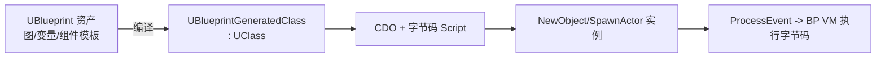
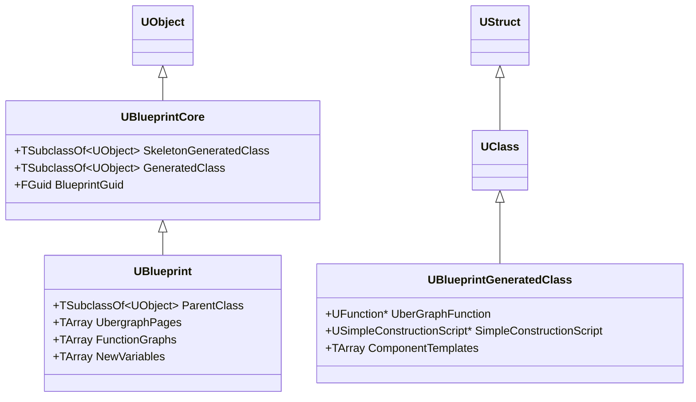
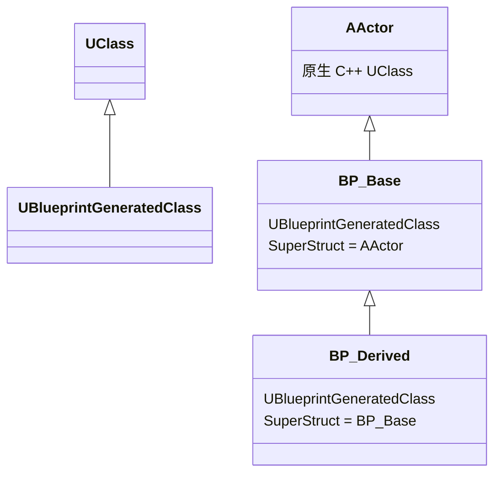
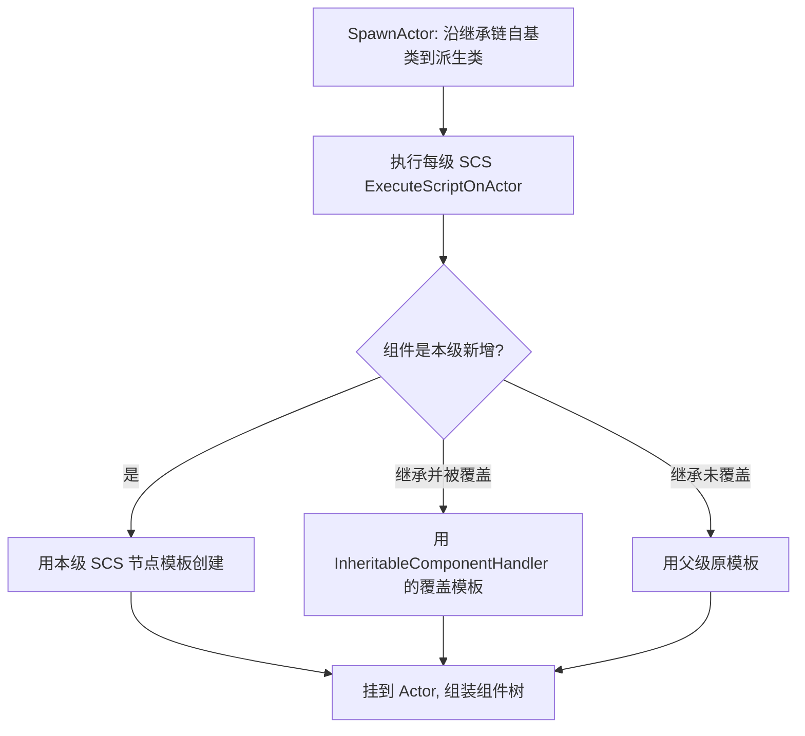
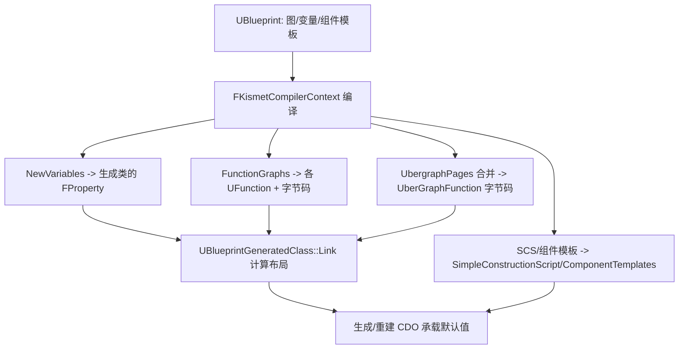
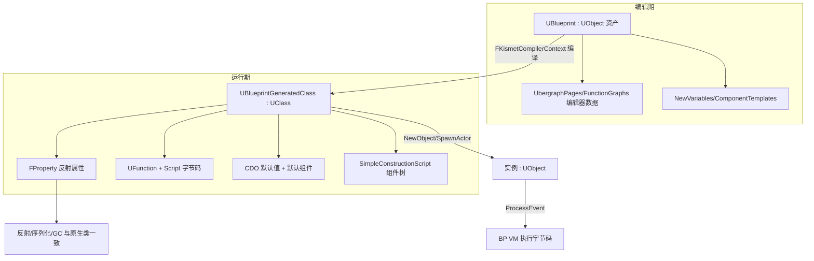

# Blueprint 实现解析

本文结合 UE5.5 源码，解析 Blueprint 如何完全建立在 `UObject` 反射系统之上：从蓝图资产 `UBlueprint`，到编译产物 `UBlueprintGeneratedClass`（BPGC），再到运行时脚本的执行方式，并对比「蓝图执行」与「原生 C++ UObject 执行」的本质区别。

阅读本文前建议先了解 [UObject 实现解析](UObject.md)。

主要涉及源码：

- [Source/Runtime/Engine/Classes/Engine/BlueprintCore.h](Source/Runtime/Engine/Classes/Engine/BlueprintCore.h)
- [Source/Runtime/Engine/Classes/Engine/Blueprint.h](Source/Runtime/Engine/Classes/Engine/Blueprint.h)
- [Source/Runtime/Engine/Classes/Engine/BlueprintGeneratedClass.h](Source/Runtime/Engine/Classes/Engine/BlueprintGeneratedClass.h)
- [Source/Runtime/CoreUObject/Public/UObject/Object.h](Source/Runtime/CoreUObject/Public/UObject/Object.h)
- [Source/Runtime/CoreUObject/Private/UObject/ScriptCore.cpp](Source/Runtime/CoreUObject/Private/UObject/ScriptCore.cpp)

## 1. 一句话概括

Blueprint 不是独立于 `UObject` 的另一套系统，而是**在 `UObject`/`UClass` 之上生成运行时类的一种方式**：

- 编辑期数据存在一个 `UObject` 资产里（`UBlueprint`）。
- 编译后产出一个 `UClass` 派生类（`UBlueprintGeneratedClass`）。
- 蓝图逻辑被编译成字节码，存放在 `UStruct::Script`，由虚拟机通过 `UObject::ProcessEvent` 执行。



## 2. 蓝图相关类的继承关系

蓝图涉及的核心类全部是 `UObject` 派生：



注意两条独立的线：

- `UBlueprint`（编辑期资产）继承自 `UObject`。
- `UBlueprintGeneratedClass`（运行期类）继承自 `UClass`。

它们是「资产」与「类」的关系，不是父子类关系。

## 3. UBlueprintCore：资产与生成类的纽带

`UBlueprintCore` 定义在 [BlueprintCore.h](Source/Runtime/Engine/Classes/Engine/BlueprintCore.h)，是所有蓝图资产的基类：

```cpp
UCLASS(MinimalAPI)
class UBlueprintCore : public UObject
{
    GENERATED_UCLASS_BODY()

    /** 骨架类：每次增删成员/函数就重生成，通常不含代码，供编辑器解析引用 */
    UPROPERTY(nontransactional, transient)
    TSubclassOf<class UObject>  SkeletonGeneratedClass;

    /** 指向「最新一次完整生成」的类 */
    UPROPERTY(nontransactional)
    TSubclassOf<class UObject>  GeneratedClass;

private:
    UPROPERTY()
    FGuid BlueprintGuid;   // 蓝图唯一标识
};
```

两个关键指针：

- `GeneratedClass`：编译产出的正式类，运行时用它创建实例。它实际类型就是 `UBlueprintGeneratedClass`。
- `SkeletonGeneratedClass`：骨架类，仅供编辑器在「还没完整编译」时解析变量/函数签名、支持交叉引用与编译顺序。

这就是 Blueprint「资产 → 类」桥接的起点：**一个 `UObject` 资产内部持有指向 `UClass` 的指针**。

## 4. UBlueprint：编辑期的资产

`UBlueprint` 定义在 [Blueprint.h](Source/Runtime/Engine/Classes/Engine/Blueprint.h)，保存的是「人在编辑器里编辑的一切」，而非可直接运行的东西：

```cpp
UCLASS(config=Engine, MinimalAPI)
class UBlueprint : public UBlueprintCore, public IBlueprintPropertyGuidProvider
{
    GENERATED_UCLASS_BODY()

    /** 生成类应继承的父类 */
    UPROPERTY(meta=(NoResetToDefault))
    TSubclassOf<UObject> ParentClass;

    TEnumAsByte<enum EBlueprintType> BlueprintType;

#if WITH_EDITORONLY_DATA
    /** 合并成一张 uber-graph 的事件图页 */
    UPROPERTY()
    TArray<TObjectPtr<UEdGraph>> UbergraphPages;

    /** 图形化实现的函数 */
    UPROPERTY()
    TArray<TObjectPtr<UEdGraph>> FunctionGraphs;

    /** 宏 */
    UPROPERTY()
    TArray<TObjectPtr<UEdGraph>> MacroGraphs;

    /** 实际编译出的事件图（瞬态） */
    UPROPERTY(transient, duplicatetransient)
    TArray<TObjectPtr<UEdGraph>> EventGraphs;
#endif

    /** 组件模板，供 AddComponent 使用 */
    UPROPERTY()
    TArray<TObjectPtr<class UActorComponent>> ComponentTemplates;

    /** Timeline 模板 */
    UPROPERTY()
    TArray<TObjectPtr<class UTimelineTemplate>> Timelines;

#if WITH_EDITORONLY_DATA
    /** 要加进生成类的新变量 */
    UPROPERTY()
    TArray<struct FBPVariableDescription> NewVariables;
#endif
};
```

要点：

- `ParentClass`：蓝图继承谁。可以是原生类（如 `AActor`）或另一个蓝图类。
- `UbergraphPages` / `FunctionGraphs` / `MacroGraphs`：`UEdGraph` 节点图，是**编辑器数据**，纯为 `WITH_EDITORONLY_DATA`——打包后的运行时不含这些图。
- `NewVariables`：蓝图新增变量的描述（`FBPVariableDescription`），编译时转成生成类上的 `FProperty`。
- `ComponentTemplates` / `Timelines`：组件与时间轴模板。

**关键结论**：`UBlueprint` 里几乎所有「图」都是编辑器数据，运行时不需要。真正能跑的东西都在编译后的 `UBlueprintGeneratedClass` 里。

## 5. UBlueprintGeneratedClass：编译产物（运行期的类）

`UBlueprintGeneratedClass : public UClass`，见 [BlueprintGeneratedClass.h](Source/Runtime/Engine/Classes/Engine/BlueprintGeneratedClass.h)。因为它 **就是一个 `UClass`**，所以蓝图类和原生 C++ 类在运行时对 `NewObject`、GC、序列化、`Cast<>` 而言毫无区别：

```cpp
class UBlueprintGeneratedClass : public UClass, public IBlueprintPropertyGuidProvider
{
    GENERATED_UCLASS_BODY()

    /** 动态委托绑定信息（事件绑定） */
    UPROPERTY()
    TArray<TObjectPtr<class UDynamicBlueprintBinding>> DynamicBindingObjects;

    /** 组件模板（AddComponent 用） */
    UPROPERTY()
    TArray<TObjectPtr<class UActorComponent>> ComponentTemplates;

    /** Timeline 模板 */
    UPROPERTY()
    TArray<TObjectPtr<class UTimelineTemplate>> Timelines;

    /** 简单构造脚本：要实例化的组件树 */
    UPROPERTY()
    TObjectPtr<class USimpleConstructionScript> SimpleConstructionScript;

    /** 子类对父类 SCS 组件的覆盖 */
    UPROPERTY()
    TObjectPtr<class UInheritableComponentHandler> InheritableComponentHandler;

    /** 指向持久 UberGraphFrame 的结构属性 */
    FStructProperty* UberGraphFramePointerProperty;

    /** 事件图被编译成的那个 UFunction */
    UPROPERTY()
    TObjectPtr<UFunction> UberGraphFunction;

    // 运行时重写：管理事件图的持久帧
    virtual uint8* GetPersistentUberGraphFrame(UObject* Obj, UFunction* FuncToCheck) const override;
    virtual void CreatePersistentUberGraphFrame(UObject* Obj, ...) const override;
    virtual void DestroyPersistentUberGraphFrame(UObject* Obj, ...) const override;

    virtual void Link(FArchive& Ar, bool bRelinkExistingProperties) override;
    virtual void Bind() override;
    virtual void InitPropertiesFromCustomList(uint8* DataPtr, const uint8* DefaultDataPtr) override;
};
```

核心成员解读：

- `UberGraphFunction`：**整张事件图被编译成一个 `UFunction`**（叫 uber-graph）。各个 Event（`BeginPlay`、`Tick` 等）是它内部的入口点，通过 `ExecuteUbergraph(EntryPoint)` 跳转。
- `UberGraphFramePointerProperty` + 持久帧：事件图的局部变量/临时状态存在一块「持久帧」（Persistent Uber Graph Frame）里，随实例分配，见第 8 节。
- `SimpleConstructionScript`（SCS）：描述蓝图新增的组件层级。`SpawnActor` 时由它实例化组件树；`InheritableComponentHandler` 处理子蓝图对继承组件的覆盖。
- `ComponentTemplates` / `Timelines`：运行时创建组件/时间轴所需的模板，从 `UBlueprint` 迁移而来。
- `DynamicBindingObjects`：把编辑器里连的事件（如输入、Overlap）在实例化时动态绑定到委托。

其中 `Link` / `Bind` / `InitPropertiesFromCustomList` 都是重写 `UClass`/`UStruct` 的虚函数，让 BPGC 融入标准的类初始化流程。

## 6. 蓝图的继承

蓝图继承既可以「蓝图继承原生 C++ 类」，也可以「蓝图继承另一个蓝图类」。因为 `UBlueprintGeneratedClass` 就是 `UClass`，蓝图继承**复用的正是 `UObject` 的类继承机制**，只是额外处理了变量、事件图、组件的叠加。

### 6.1 两个层面的父类

要分清「资产层」和「类层」两条继承线：

- **资产层**：`UBlueprint::ParentClass` 记录该蓝图打算继承谁（见第 4 节）。
- **类层**：编译产物 `UBlueprintGeneratedClass` 的 `UStruct::SuperStruct` 指向真正的父 `UClass`（见 [UObject.md](UObject.md) 第 2.2 节）。



编译时，`UBlueprint::ParentClass` 决定生成类的 `SuperStruct`。因此运行时 `IsA` / `Cast<>` / `IsChildOf`（沿 `SuperStruct` 上溯）对蓝图类与原生类**一视同仁**——`BP_Derived` 的实例 `IsA(AActor::StaticClass())` 为真。

### 6.2 属性（变量）的继承

- 父类的所有 `FProperty`（无论来自 C++ 还是父蓝图）通过 `SuperStruct` 天然被子类继承，`Link()` 计算布局时子类属性排在父类属性之后。
- 子蓝图在 `NewVariables` 里**只新增自己的变量**，父类变量不复制。
- 默认值通过 CDO 父链叠加：创建子类 CDO 时先递归创建父类 CDO（见 [UObject.md](UObject.md) 第 5.2 节），子类 CDO 以父类 CDO 为模板，再套用子蓝图设置的默认值。这就是「子蓝图改一个继承来的属性默认值」的本质。

### 6.3 函数与事件的继承、覆盖

- 父类的 `UFunction` 经 `FuncMap` / `AllFunctionsCache` 对子类可见，`FindFunction` 会沿父链查找。
- 子蓝图可**覆盖（Override）**父类的 `BlueprintImplementableEvent` / `BlueprintNativeEvent` 或蓝图函数：生成同名 `UFunction`，其 `SuperFunction` 指向父版本，`Parent` 节点即调用 `Super::`。
- 事件图（`UberGraphFunction`）每个类各有一份；子类事件图通过入口点独立执行，`ExecuteUbergraph` 按类分发（见第 8 节）。

### 6.4 组件的继承：SCS 与 InheritableComponentHandler

组件继承是蓝图继承里最特殊的部分。蓝图新增的组件由 `SimpleConstructionScript`（SCS）以节点树描述，见 [SimpleConstructionScript.h](Source/Runtime/Engine/Classes/Engine/SimpleConstructionScript.h)：

```cpp
// USimpleConstructionScript
TArray<TObjectPtr<class USCS_Node>> RootNodes;  // 根组件节点
TArray<TObjectPtr<class USCS_Node>> AllNodes;   // 全部组件节点
void ExecuteScriptOnActor(AActor* Actor, ...);  // 在实例上创建该类新增的组件
```

`SpawnActor` 时，引擎会**沿继承链、从最基类到最派生类，逐个执行每一级的 SCS**，把各级新增组件依次挂到 Actor 上。`UBlueprintGeneratedClass` 提供了遍历这条链的工具：

```cpp
// UBlueprintGeneratedClass
static bool GetGeneratedClassesHierarchy(const UClass* InClass,
    TArray<const UBlueprintGeneratedClass*>& OutBPGClasses); // 0th=自身, Nth=最基类 BP
static bool ForEachGeneratedClassInHierarchy(const UClass* InClass,
    TFunctionRef<bool(const UBlueprintGeneratedClass*)> InFunc);
static void CreateComponentsForActor(const UClass* ThisClass, AActor* Actor);
```

子蓝图若要**修改从父类继承来的组件的默认值**（而非新增组件），不能直接改父类模板，否则会污染父类所有实例。为此有 `InheritableComponentHandler`：

```cpp
// UBlueprintGeneratedClass
/** 存储子类对父类（SCS 创建的）组件的覆盖 */
UPROPERTY()
TObjectPtr<class UInheritableComponentHandler> InheritableComponentHandler;

UInheritableComponentHandler* GetInheritableComponentHandler(const bool bCreateIfNecessary = false);
```

它为每个被覆盖的继承组件保存一份「覆盖模板」，实例化时用覆盖模板取代父类原模板——这就是编辑器里选中一个继承组件、改它的属性所发生的事。



### 6.5 编译顺序：父先于子

因为子类布局、CDO、组件都依赖父类，蓝图编译存在依赖顺序：

- 父蓝图（或父 C++ 类）必须先就绪，子蓝图才能正确 `Link` 与建 CDO。
- 编辑器为此维护 `SkeletonGeneratedClass`（第 3 节）：即使父蓝图尚未完整编译，骨架类也能提供签名，支撑交叉引用与编译排序。
- 修改父蓝图会触发子蓝图重编译（reinstancing），保证继承链一致。

### 6.6 与原生继承的对照

| 方面 | 原生 C++ 继承 | 蓝图继承 |
| --- | --- | --- |
| 父类记录 | C++ `: public Base` | `UBlueprint::ParentClass` → 生成类 `SuperStruct` |
| 类型判定 | `SuperStruct` 上溯 | **同一机制**，无差别 |
| 属性叠加 | 编译期布局 | `Link` 计算布局 + CDO 父链叠加默认值 |
| 函数覆盖 | virtual override | 同名 `UFunction` + `SuperFunction` |
| 组件继承 | 构造函数 `CreateDefaultSubobject` | 逐级 SCS + `InheritableComponentHandler` 覆盖 |

**结论**：蓝图继承没有另造轮子，类型与函数继承直接用 `UObject` 那套；额外工程量集中在「组件继承的覆盖」（SCS + ICH）与「编译依赖顺序」上。

## 7. 从资产到类：编译流程

蓝图「编译」的本质是：**读 `UBlueprint` 的编辑器数据 → 生成/填充 `UBlueprintGeneratedClass`**。



编译输出主要有三类，全部落到那个 `UClass` 上：

1. **属性**：`NewVariables` → 生成类的 `FProperty`（挂到 `ChildProperties`），因此蓝图变量和 C++ `UPROPERTY` 在反射层面完全一致。
2. **函数与字节码**：每个函数图/事件图编译成 `UFunction`，其可执行逻辑是**字节码**，存进 `UStruct::Script`（见 [UObject.md](UObject.md) 第 2.2 节）。
3. **默认值与组件**：CDO 重建，蓝图设置的默认属性写进 CDO；SCS 描述的组件成为默认子对象。

因此蓝图类的「默认值来自 CDO、属性来自反射、函数可被 `FindFunction`」这些，与原生类完全一样——差别只在函数体是字节码还是机器码。

## 8. 蓝图运行 vs 原生 C++ 运行

这是本文重点。两者都通过同一个 `UObject` 反射入口被调用，但**函数体的执行方式不同**。

### 7.1 统一入口：ProcessEvent / CallFunction

无论蓝图还是原生 `UFUNCTION`，对外都可通过 `UObject::ProcessEvent` 或 `CallFunction` 调用，声明在 [Object.h](Source/Runtime/CoreUObject/Public/UObject/Object.h)：

```cpp
COREUOBJECT_API virtual void ProcessEvent(UFunction* Function, void* Parms);
COREUOBJECT_API void CallFunction(FFrame& Stack, RESULT_DECL, UFunction* Function);
```

事件图的调用最终走到：

```cpp
// Object.h
void ExecuteUbergraph(int32 EntryPoint)
{
    Object_eventExecuteUbergraph_Parms Parms;
    Parms.EntryPoint = EntryPoint;
    ProcessEvent(FindFunctionChecked(NAME_ExecuteUbergraph), &Parms);
}
```

### 7.2 分叉点：FUNC_Native 还是字节码

真正的区别在 `UObject::CallFunction`，见 [ScriptCore.cpp](Source/Runtime/CoreUObject/Private/UObject/ScriptCore.cpp)：

```cpp
void UObject::CallFunction(FFrame& Stack, RESULT_DECL, UFunction* Function)
{
    // ...
    if (Function->FunctionFlags & FUNC_Native)
    {
        // ... 处理网络 RPC ...
        // 调用真正的原生函数（机器码）
        Function->Invoke(this, Stack, RESULT_PARAM);
    }
    else
    {
        // 蓝图函数：进入脚本处理，解释执行字节码
        ProcessScriptFunction(this, Function, Stack, RESULT_PARAM, ProcessInternal);
    }
}
```

- **原生 C++**：`UFunction` 带 `FUNC_Native`，`Func` 指针指向 UHT 生成的 thunk，最终调用你写的 C++ 函数——直接跑机器码。
- **蓝图**：`UFunction` 无 `FUNC_Native`，其逻辑是 `UStruct::Script` 里的字节码，交给虚拟机解释执行。

### 7.3 虚拟机如何解释字节码

蓝图 VM 是一个基于 `FFrame`（栈帧）的字节码解释器。核心是 `FFrame::Step` 的分派循环，见 [ScriptCore.cpp](Source/Runtime/CoreUObject/Private/UObject/ScriptCore.cpp)：

```cpp
COREUOBJECT_API FNativeFuncPtr GNatives[EX_Max];   // 操作码 -> 处理函数 表

void FFrame::Step(UObject* Context, RESULT_DECL)
{
    int32 B = *Code++;              // 读取一个操作码 (EExprToken)
    (GNatives[B])(Context, *this, RESULT_PARAM);  // 跳到对应处理函数
}
```

- `GNatives` 是操作码到处理函数的跳转表，索引是 `EX_*` 操作码（如 `EX_LocalVariable`、`EX_CallMath`、`EX_Let`）。
- VM 逐条读 `Code`、`Step` 分派，读取参数、调用函数、写回结果。
- 蓝图节点里调用的「函数」大多本身是 `FUNC_Native`——所以蓝图往往是**用字节码把一串原生函数调用串起来**，真正的重活仍由 C++ 完成。

关于 VM 的完整机制（操作码、栈帧、UberGraphFrame）详见 [BlueprintVM](BlueprintVM.md)。

### 7.4 持久 UberGraphFrame

原生 C++ 函数的局部变量在真实调用栈上。而蓝图事件图为了跨多次事件保持某些状态、避免频繁分配，采用「持久帧」：

```cpp
// UBlueprintGeneratedClass
FStructProperty* UberGraphFramePointerProperty;
virtual void CreatePersistentUberGraphFrame(UObject* Obj, ...) const override;
virtual uint8* GetPersistentUberGraphFrame(UObject* Obj, UFunction* FuncToCheck) const override;
```

实例创建时分配一块持久帧，事件图执行时把它当作局部变量存储区。这是蓝图相对原生 C++ 的额外内存/间接开销之一。

### 7.5 对比总结

| 维度 | 原生 C++ UObject | Blueprint |
| --- | --- | --- |
| 类的来源 | `IMPLEMENT_CLASS` + UHT 生成 `UClass` | 编译 `UBlueprint` 生成 `UBlueprintGeneratedClass`（仍是 `UClass`） |
| 函数体 | 机器码（`FUNC_Native`，`Func` thunk） | 字节码（`UStruct::Script`），VM 解释 |
| 调用入口 | `ProcessEvent` / `CallFunction` → `Function->Invoke` | `ProcessEvent` / `CallFunction` → `ProcessScriptFunction` |
| 局部变量 | 真实调用栈 | 事件图用持久 UberGraphFrame |
| 反射/GC/序列化 | 走 `UClass` 标准流程 | **完全相同**（因为也是 `UClass`） |
| 性能 | 快，无解释开销 | 有 VM 分派、间接调用开销，适合高层逻辑 |
| 迭代 | 需重新编译 C++ | 编辑器内即时编译，迭代快 |

**本质**：蓝图和原生类共享同一套 `UObject`/`UClass` 运行时；唯一实质差异是「函数逻辑是字节码还是机器码」，以及事件图的持久帧机制。这就是为什么蓝图可以无缝继承 C++ 类、互相调用、被 GC 与序列化统一管理。

## 9. Blueprint 如何「建立在 UObject 上」的完整链路



- **建在 UObject 上的第 1 层**：`UBlueprint` 本身是 `UObject`，能被资产系统保存、被 GC 管理、被序列化（`.uasset`）。
- **第 2 层**：编译产物 `UBlueprintGeneratedClass` 是 `UClass`，天生拥有反射、CDO、GC token 流、`FindFunction` 等全部能力。
- **第 3 层**：蓝图变量是 `FProperty`、蓝图函数是 `UFunction`，与原生成员在反射层面无差别。
- **第 4 层**：实例通过 CDO 初始化、通过 `ProcessEvent` 调用逻辑，只是逻辑体走 VM 而非机器码。

## 10. 小结

- `UBlueprint`（`: UObject`）是**编辑期资产**，装的是节点图、变量描述、组件模板等编辑器数据。
- `UBlueprintGeneratedClass`（`: UClass`）是**编译产物**，是一个真正的运行时类，承载反射属性、`UFunction`、字节码、CDO 与组件构造脚本。
- 蓝图与原生 C++ 共享同一套 `UObject`/`UClass` 基础设施；运行差异仅在于：蓝图函数体是字节码、由 VM（`FFrame::Step` + `GNatives`）解释执行，并使用持久 UberGraphFrame，而原生函数直接执行机器码。

正因如此，Blueprint 才能自然地继承 C++ 类、与之互调，并统一享受序列化、GC 和编辑器集成——它是 `UObject` 系统之上的一层，而非另起炉灶。

相关文档：

- [对象与蓝图总览](UObjectAndBPOverview.md)
- [UObject 实现解析](UObject.md)
- [BlueprintVM](BlueprintVM.md)
- [BlueprintEditor](BlueprintEditor.md)
