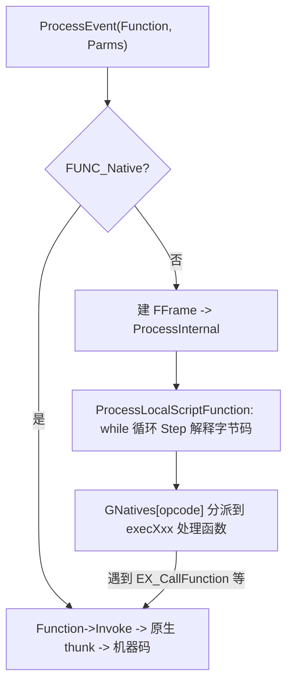
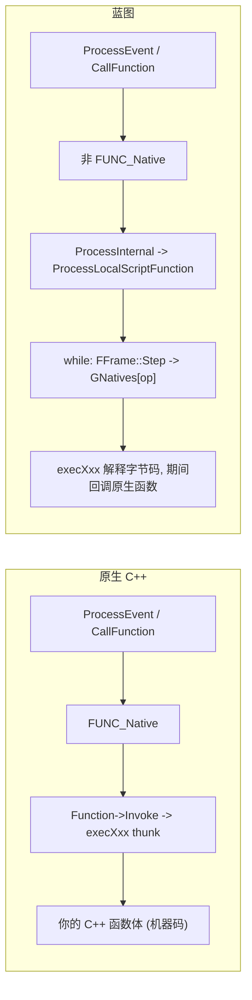
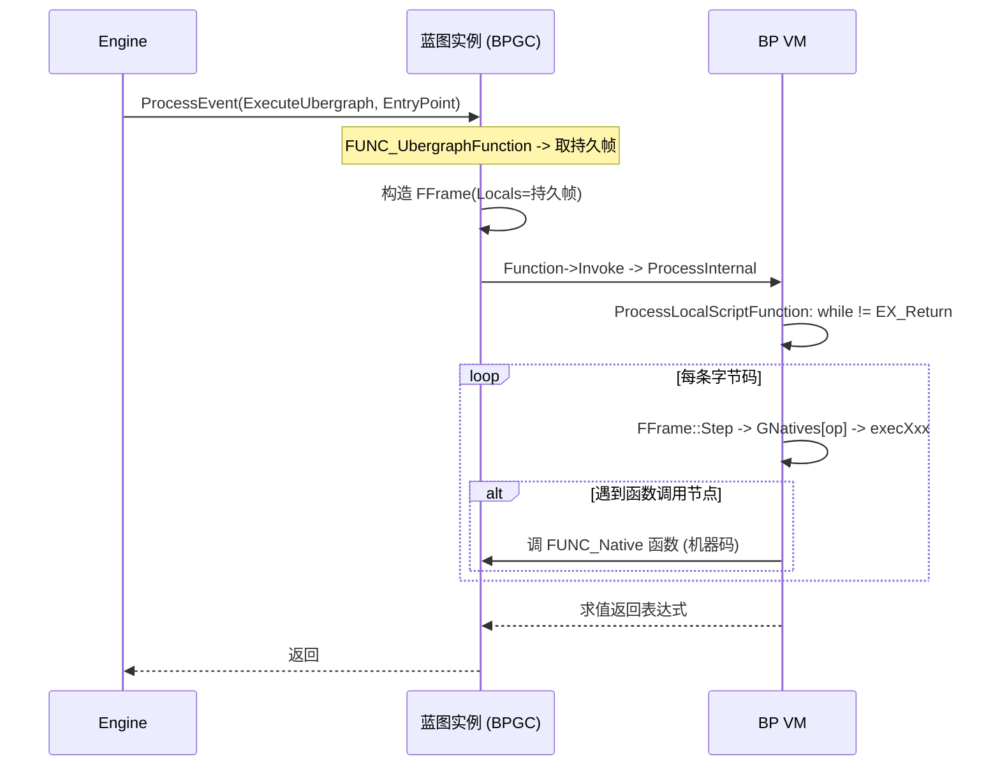

# 蓝图执行解析：BP VM vs 原生 UClass

本文结合 UE5.5 源码，解析蓝图逻辑在运行时**如何被执行**：从统一入口 `ProcessEvent`，到蓝图虚拟机（BP VM）的字节码解释循环，再到与原生 C++ `UClass` 函数执行路径的逐点对比。

建议先阅读 [UObject 实现解析](UObject.md) 与 [Blueprint 实现解析](Blueprint.md)。

主要涉及源码：

- [Source/Runtime/CoreUObject/Public/UObject/Object.h](Source/Runtime/CoreUObject/Public/UObject/Object.h)
- [Source/Runtime/CoreUObject/Public/UObject/Stack.h](Source/Runtime/CoreUObject/Public/UObject/Stack.h)
- [Source/Runtime/CoreUObject/Public/UObject/Script.h](Source/Runtime/CoreUObject/Public/UObject/Script.h)
- [Source/Runtime/CoreUObject/Private/UObject/ScriptCore.cpp](Source/Runtime/CoreUObject/Private/UObject/ScriptCore.cpp)

## 1. 核心结论先行

- 蓝图和原生 C++ 函数**共用同一个调用入口** `UObject::ProcessEvent` / `UObject::CallFunction`。
- 两者的分叉点只有一个：`UFunction` 是否带 `FUNC_Native`。
  - 带 `FUNC_Native`：直接跳原生 thunk，执行机器码。
  - 不带：进入 BP VM，逐条解释 `UFunction::Script` 里的字节码。
- BP VM 是一个**基于 `FFrame` 栈帧、以 `GNatives` 跳转表分派操作码**的解释器。
- 蓝图节点里真正干活的函数大多本身是 `FUNC_Native`，所以蓝图执行本质是「用字节码把一串原生调用串起来」。



## 2. 统一入口：ProcessEvent

无论蓝图还是原生 `UFUNCTION`，事件调用都进入 `UObject::ProcessEvent`，见 [ScriptCore.cpp](Source/Runtime/CoreUObject/Private/UObject/ScriptCore.cpp)：

```cpp
void UObject::ProcessEvent(UFunction* Function, void* Parms)
{
    // ... 各种安全检查：对象可达性、PostLoad、断点暂停 ...

    if ((Function->FunctionFlags & FUNC_Native) != 0)
    {
        int32 FunctionCallspace = GetFunctionCallspace(Function, NULL);
        if (FunctionCallspace & FunctionCallspace::Remote)
        {
            CallRemoteFunction(Function, Parms, NULL, NULL);   // 网络 RPC
        }
        if ((FunctionCallspace & FunctionCallspace::Local) == 0)
        {
            return;
        }
    }
    else if (Function->Script.Num() == 0)
    {
        return;   // 蓝图函数但没有字节码，直接返回
    }

    // 准备栈帧内存 Frame
    uint8* Frame = nullptr;
    if (Function->HasAnyFunctionFlags(FUNC_UbergraphFunction))
    {
        // 事件图函数：使用实例上的持久帧（Persistent Uber Graph Frame）
        Frame = Function->GetOuterUClassUnchecked()->GetPersistentUberGraphFrame(this, Function);
    }
    // 非持久帧：在虚拟栈上按 Function->PropertiesSize 分配并清零局部变量
    // ...

    // 拷贝入参、构造 FFrame，然后 Invoke
    FMemory::Memcpy(Frame, Parms, Function->ParmsSize);
    FFrame NewStack(this, Function, Frame, NULL, Function->ChildProperties);
    // ... 处理 out 参数、初始化局部变量 ...

    uint8* ReturnValueAddress = /* 依据 ReturnValueOffset */;
    Function->Invoke(this, NewStack, ReturnValueAddress);

    // ... 非持久帧：销毁局部变量、拷回构造型 out 参数 ...
}
```

要点：

- 先按 `FUNC_Native` 与网络 callspace 决定是否本地执行/远程 RPC。
- 为函数准备一块栈帧内存 `Frame`：
  - **事件图函数**（`FUNC_UbergraphFunction`）用实例上的**持久帧**（见第 6 节）。
  - **普通蓝图函数**在虚拟栈上按 `Function->PropertiesSize` 分配，并把非参数区清零。
- 拷入参数，构造 `FFrame NewStack`，再调用 `Function->Invoke`。

## 3. Invoke 的分叉：原生 or 字节码

`Function->Invoke` 与 `UObject::CallFunction` 是真正区分蓝图与原生的地方：

```cpp
// UObject::CallFunction（简化）
void UObject::CallFunction(FFrame& Stack, RESULT_DECL, UFunction* Function)
{
    if (Function->FunctionFlags & FUNC_Native)
    {
        // ... 网络处理 ...
        Function->Invoke(this, Stack, RESULT_PARAM);   // 原生：机器码
    }
    else
    {
        ProcessScriptFunction(this, Function, Stack, RESULT_PARAM, ProcessInternal); // 蓝图：VM
    }
}
```

对蓝图函数，`Invoke` 内部的 `Func` 指针指向 `UObject::ProcessInternal`（VM 派发），最终落到 `ProcessLocalScriptFunction`——即字节码解释循环。

```cpp
DEFINE_FUNCTION(UObject::ProcessInternal)
{
    UFunction* Function = (UFunction*)Stack.Node;
    int32 FunctionCallspace = P_THIS->GetFunctionCallspace(Function, NULL);
    if (FunctionCallspace & FunctionCallspace::Remote)
    {
        P_THIS->CallRemoteFunction(Function, Stack.Locals, Stack.OutParms, NULL);
    }
    if (FunctionCallspace & FunctionCallspace::Local)
    {
        ProcessLocalScriptFunction(Context, Stack, RESULT_PARAM);  // 解释字节码
    }
    // ...
}
```

## 4. FFrame：虚拟机的栈帧

BP VM 的执行状态集中在 `FFrame`，见 [Stack.h](Source/Runtime/CoreUObject/Public/UObject/Stack.h)：

```cpp
struct FFrame : public FOutputDevice
{
    UFunction* Node;      // 当前执行的函数
    UObject* Object;      // this（执行上下文）
    uint8* Code;          // 字节码指令指针（IP）
    uint8* Locals;        // 局部变量 + 参数存储区

    FProperty* MostRecentProperty;         // 最近一次寻址到的属性
    uint8* MostRecentPropertyAddress;      // 及其地址（表达式求值用）

    FlowStackType FlowStack;   // 编译后 Kismet 代码的执行流栈
    FFrame* PreviousFrame;     // 调用者帧
    FOutParmRec* OutParms;     // out 参数链表
    // ...
    bool bAbortingExecution;   // 触发中止执行
};
```

- `Code` 是「指令指针」，VM 通过 `*Code++` 逐字节读取操作码与操作数。
- `Locals` 存放该次调用的参数和局部变量（对应 `UFunction` 上的 `FProperty`）。
- `MostRecentProperty(Address)` 用于「表达式寻址」：许多操作码先把某个变量/属性的地址算出来放这里，供上层读写。
- `FlowStack` 支撑蓝图的执行流跳转（分支、循环）。

## 5. 解释循环：ProcessLocalScriptFunction + Step + GNatives

### 5.1 主循环

字节码解释的心脏是 `ProcessLocalScriptFunction`，见 [ScriptCore.cpp](Source/Runtime/CoreUObject/Private/UObject/ScriptCore.cpp)：

```cpp
void ProcessLocalScriptFunction(UObject* Context, FFrame& Stack, RESULT_DECL)
{
    UFunction* Function = (UFunction*)Stack.Node;
    MS_ALIGN(16) uint8 Buffer[MAX_SIMPLE_RETURN_VALUE_SIZE] GCC_ALIGN(16);

    // 逐条执行字节码，直到遇到 EX_Return
    while (*Stack.Code != EX_Return && !Stack.bAbortingExecution)
    {
        // DO_BLUEPRINT_GUARD 下有 runaway/递归保护（GMaximumScriptLoopIterations 等）
        Stack.Step(Stack.Object, Buffer);
    }

    if (!Stack.bAbortingExecution)
    {
        Stack.Code++;                       // 跳过 EX_Return
        if (*Stack.Code != EX_Nothing)
        {
            Stack.Step(Stack.Object, RESULT_PARAM);  // 求值返回表达式
        }
        else { Stack.Code++; }
    }
    // ...
}
```

- 一个 `while` 循环反复 `Step`，直到读到 `EX_Return` 操作码。
- `DO_BLUEPRINT_GUARD` 下带**防跑飞机制**：递归超过 `GScriptRecurseLimit` 或循环超过 `GMaximumScriptLoopIterations` 会抛 `EBlueprintExceptionType::InfiniteLoop`，避免死循环卡死引擎。

### 5.2 Step：一次分派

```cpp
COREUOBJECT_API FNativeFuncPtr GNatives[EX_Max];   // 操作码 -> 处理函数 跳转表

void FFrame::Step(UObject* Context, RESULT_DECL)
{
    int32 B = *Code++;                        // 读一个操作码 (EExprToken)
    (GNatives[B])(Context, *this, RESULT_PARAM);  // 跳到对应 execXxx
}
```

- `GNatives` 是一张以操作码 `EX_*`（`EExprToken`，定义在 [Script.h](Source/Runtime/CoreUObject/Public/UObject/Script.h)）为索引的函数指针表。
- 每个操作码有一个 `execXxx` 处理函数，通过 `IMPLEMENT_VM_FUNCTION(EX_Xxx, execXxx)` 注册进表。例如：
  - `EX_LocalVariable` → `execLocalVariable`：把局部变量地址算入 `MostRecentPropertyAddress`。
  - `EX_Let` → `execLet`：赋值。
  - `EX_CallMath` → `execCallMathFunction`：调用一个静态数学函数（快路径）。
  - `EX_FinalFunction` / `EX_VirtualFunction` / `EX_LocalFinalFunction`：函数调用。
- 表达式是「嵌套 Step」：一个操作码处理函数内部可以再调用 `Stack.Step` 求值它的操作数，从而解释出整棵表达式树。

### 5.3 函数调用如何回到原生

蓝图节点调用其他函数时，会走到 `ProcessLocalFunction`：

```cpp
void ProcessLocalFunction(UObject* Context, UFunction* Fn, FFrame& Stack, RESULT_DECL)
{
    if (Fn->HasAnyFunctionFlags(FUNC_Native))
    {
        Fn->Invoke(Context, Stack, RESULT_PARAM);                 // 被调是原生：直接机器码
    }
    else
    {
        ProcessScriptFunction(Context, Fn, Stack, RESULT_PARAM, ProcessLocalScriptFunction); // 被调也是蓝图：递归解释
    }
}
```

这印证了第 1 节的结论：**蓝图的重活最终大多落到 `FUNC_Native` 函数上**，VM 只负责编排。

## 6. 持久 UberGraphFrame

普通蓝图函数每次调用都在虚拟栈上新建/销毁 `Locals`。而**事件图**（`UberGraphFunction`，标 `FUNC_UbergraphFunction`）为跨事件保持状态并减少分配，使用「持久帧」：

```cpp
// ProcessEvent 中
if (Function->HasAnyFunctionFlags(FUNC_UbergraphFunction))
{
    Frame = Function->GetOuterUClassUnchecked()->GetPersistentUberGraphFrame(this, Function);
}
```

- 持久帧随对象实例分配（由 `UBlueprintGeneratedClass::CreatePersistentUberGraphFrame` 创建，见 [Blueprint.md](Blueprint.md) 第 5、8 节）。
- 事件图执行时，`FFrame::Locals` 直接指向该持久帧，故**不用每次分配/清零/销毁局部变量**——这是相对普通函数的差异，也是蓝图事件图的一项优化。
- 代价是每个带事件图的蓝图实例都多占一块持久帧内存。

## 7. 蓝图执行 vs 原生 UClass 执行

### 7.1 路径对比



### 7.2 逐点对比

| 维度 | 原生 C++ `UClass` 执行 | 蓝图执行（BP VM） |
| --- | --- | --- |
| 调用入口 | `ProcessEvent` / `CallFunction` | **相同** |
| 分叉标志 | `UFunction` 带 `FUNC_Native` | 不带 `FUNC_Native`，有 `Script` 字节码 |
| 函数体 | UHT 生成的 `execXxx` thunk → 你的 C++ 实现 | `UFunction::Script` 字节码 |
| 执行方式 | CPU 直接跑机器码 | `FFrame::Step` + `GNatives` 逐条解释 |
| 局部变量 | 真实 C++ 调用栈 | `FFrame::Locals`（虚拟栈或持久帧） |
| 参数传递 | C++ 栈/寄存器 | 拷进 `Frame`，按 `FProperty` 布局读写 |
| 表达式求值 | 编译器生成 | 嵌套 `Step` 递归解释 |
| 安全保护 | 无额外开销 | runaway/递归上限、异常抛出（`DO_BLUEPRINT_GUARD`） |
| 调试 | C++ 调试器 | 蓝图断点/单步（VM 感知） |
| 性能 | 最快 | 有解释、分派、间接调用开销 |
| 反射/GC/序列化 | 走 `UClass` 标准流程 | **完全相同**（BPGC 也是 `UClass`） |

### 7.3 性能直觉

- **单条节点开销**：读操作码 + 跳表分派 + 属性寻址，比一次机器码指令昂贵得多。
- **调用密集/循环密集**的逻辑放蓝图会明显慢；**事件编排、状态机、内容驱动**的高层逻辑放蓝图性价比高。
- 常见优化：把热点算法用 C++ 实现为 `BlueprintCallable` 的 `FUNC_Native` 函数，蓝图只负责调用与编排——正好利用了「VM 编排 + 原生干活」的结构。

## 8. 一次调用的完整时序

以蓝图事件 `BeginPlay` 为例：



## 9. 小结

- 蓝图与原生 C++ 的执行**共享 `ProcessEvent` 入口和 `UClass`/`UFunction` 反射体系**；唯一实质区别是 `UFunction` 是否 `FUNC_Native`。
- 原生函数直接跑机器码；蓝图函数由 BP VM 以 `FFrame` 栈帧 + `GNatives` 跳转表逐条解释 `Script` 字节码，并带防跑飞与异常保护。
- 事件图使用持久 UberGraphFrame 优化局部变量分配。
- 蓝图逻辑通常是「字节码编排 + 原生函数干活」，因此性能适合高层逻辑；热点应下沉到 C++。
- 因为蓝图类仍是 `UClass`，其反射、序列化、GC 与原生类完全一致——VM 只改变「函数体怎么跑」，不改变「对象系统怎么管」。

相关文档：

- [对象与蓝图总览](UObjectAndBPOverview.md)
- [UObject 实现解析](UObject.md)
- [Blueprint 实现解析](Blueprint.md)
- [BlueprintEditor](BlueprintEditor.md)
