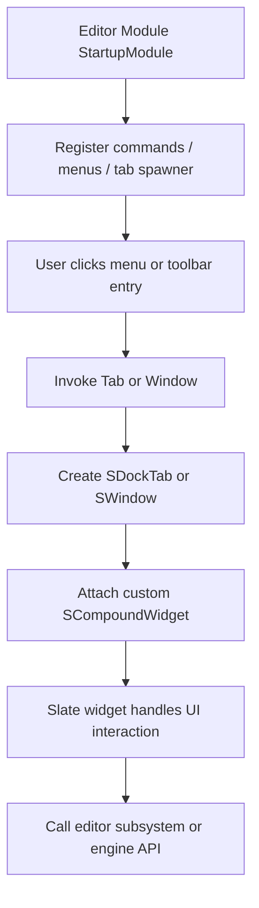

# Slate 概览

本文结合 UE5.5 源码，介绍 Slate 的定位、设计思想、核心类，以及如何用 Slate 拓展 Unreal Editor。

如果把 UE 的 UI 体系粗略分层，可以这样看：

- **Slate**：底层原生 UI 框架，主要面向 C++，负责布局、绘制、输入、焦点、窗口、停靠、菜单等机制。
- **UMG**：构建在 Slate 之上的高层 UI 封装，主要面向游戏 UI 与蓝图工作流。

因此，理解 Slate 的最好方式不是把它看成“一个控件库”，而是把它看成 **UE 的原生声明式 UI 框架**。编辑器本身的大量界面，包括各种面板、工具窗口、资产编辑器，都是用 Slate 构建的。

主要涉及源码：

- [Source/Runtime/SlateCore/Public/Widgets/SWidget.h](Source/Runtime/SlateCore/Public/Widgets/SWidget.h)
- [Source/Runtime/SlateCore/Public/Widgets/DeclarativeSyntaxSupport.h](Source/Runtime/SlateCore/Public/Widgets/DeclarativeSyntaxSupport.h)
- [Source/Runtime/Slate/Public/Framework/Application/SlateApplication.h](Source/Runtime/Slate/Public/Framework/Application/SlateApplication.h)
- [Source/Runtime/Slate/Public/Widgets/Layout/SBorder.h](Source/Runtime/Slate/Public/Widgets/Layout/SBorder.h)
- [Source/Developer/ToolMenus/Public/ToolMenus.h](Source/Developer/ToolMenus/Public/ToolMenus.h)
- [Source/Editor/WorkspaceMenuStructure/Public/WorkspaceMenuStructure.h](Source/Editor/WorkspaceMenuStructure/Public/WorkspaceMenuStructure.h)
- [Source/Editor/LevelEditor/Public/LevelEditor.h](Source/Editor/LevelEditor/Public/LevelEditor.h)

## 1. Slate 的定位

Slate 是 Unreal 的底层 UI 框架，既服务于运行时，也服务于编辑器，但**最典型的应用场景是编辑器 UI**。

它和常见游戏运行时 UI 系统的差异在于：

- 它不是 `UObject` 驱动的控件树，而是主要基于 `TSharedRef` / `TSharedPtr` 管理生命周期。
- 它不是“在场景里摆 Widget Component”的思路，而是典型桌面 UI 框架思路：窗口、面板、菜单、Dock Tab、命令、工具栏。
- 它强调**声明式构建 UI 树**，并通过 attribute / delegate 进行数据绑定，而不是在构造后逐个手动设置属性。

从源码注释看，`SWidget` 被定义为“所有交互式 Slate 实体的基类”，见 [Source/Runtime/SlateCore/Public/Widgets/SWidget.h](Source/Runtime/SlateCore/Public/Widgets/SWidget.h)。

## 2. 设计思想

## 2.1 声明式语法，而不是命令式搭建

Slate 最显著的特征，是它的声明式 DSL。这个 DSL 由 [Source/Runtime/SlateCore/Public/Widgets/DeclarativeSyntaxSupport.h](Source/Runtime/SlateCore/Public/Widgets/DeclarativeSyntaxSupport.h) 里的宏提供，比如：

- `SNew`
- `SAssignNew`
- `SLATE_BEGIN_ARGS`
- `SLATE_ARGUMENT`
- `SLATE_ATTRIBUTE`

典型写法：

```cpp
ChildSlot
[
	SNew(SBorder)
	.Padding(8.0f)
	[
		SNew(STextBlock)
		.Text(FText::FromString("Hello Slate"))
	]
];
```

这套风格的核心目的，是把“控件结构”和“配置参数”放在一处描述。相比命令式 UI 构建，它更容易直接读出：

- 这个控件树长什么样
- 子控件嵌套关系是什么
- 每层控件的关键参数是什么

对编辑器工具来说，这一点很重要，因为很多工具面板本质上就是“静态骨架 + 少量动态数据绑定”。

## 2.2 组合优于继承

Slate 虽然有一套控件继承体系，但它更强调通过**组合已有 widget** 搭界面，而不是不断派生复杂大控件。

比如一个面板往往由这些基础控件组合而成：

- `SBorder`
- `SBox`
- `SVerticalBox`
- `SHorizontalBox`
- `SSplitter`
- `SScrollBox`
- `STextBlock`
- `SButton`
- `SEditableTextBox`
- `SListView`
- `STreeView`

只有当你确实需要新的行为边界时，才去定义新的 `SCompoundWidget`、`SLeafWidget` 或 `SPanel` 子类。

## 2.3 属性绑定而不是“每帧手动同步”

Slate 有一个非常重要的设计点：**控件属性既可以是常量值，也可以是可求值 attribute**。

例如 `SLATE_ATTRIBUTE` 允许属性绑定到：

- 普通值
- lambda
- 成员函数
- `UObject` 方法

这意味着 UI 可以直接表达“文本来自某个 getter”“是否可见由某个状态函数决定”，而不是在外部不断手动 `SetText` / `SetVisibility`。

简化理解就是：

- `SLATE_ARGUMENT` 更像一次性构造参数。
- `SLATE_ATTRIBUTE` 更像可绑定、可动态计算的属性。

## 2.4 面向桌面工具的输入与窗口系统

Slate 不是只关心“画一个按钮”，它还管理整个应用级 UI 行为。这个入口就是 [Source/Runtime/Slate/Public/Framework/Application/SlateApplication.h](Source/Runtime/Slate/Public/Framework/Application/SlateApplication.h) 里的 `FSlateApplication`。

从这个类的接口和依赖可以看出，Slate 把这些问题都放到了统一框架里：

- 平台窗口接入
- 鼠标 / 键盘 / 手柄输入分发
- 焦点管理
- 菜单栈与弹出层
- Tick / Paint 流程
- 多用户输入映射
- 编辑器与工具类交互

所以如果说 `SWidget` 是“局部控件树”的根抽象，那么 `FSlateApplication` 就是“整个 Slate 世界的运行调度中心”。

## 3. 核心类

下面按“从底到上”的顺序介绍 Slate 最重要的一组类。

## 3.1 `SWidget`：所有 Slate 控件的基类

`SWidget` 定义在 [Source/Runtime/SlateCore/Public/Widgets/SWidget.h](Source/Runtime/SlateCore/Public/Widgets/SWidget.h)。它是所有交互式 Slate 实体的基础抽象。

它负责的核心能力包括：

- 可见性与启用状态
- 几何信息与布局
- Tick 与 Paint
- 鼠标 / 键盘 / 导航事件
- 焦点与输入响应
- 无障碍元数据
- invalidation 与 fast update

需要注意的是，源码注释明确写着：**不要直接从 `SWidget` 继承**。通常应该从更具体的抽象出发，比如：

- `SCompoundWidget`
- `SLeafWidget`
- `SPanel`

原因很简单：`SWidget` 的职责面太大，而这些派生基类已经把常见使用模式分好了层。

## 3.2 `SCompoundWidget`：最常见的自定义控件基类

`SCompoundWidget` 是 Slate 里最常用的派生基类之一。它适合表示“有一个根槽位，内部再包一棵子树”的控件。

最典型的自定义面板类往往长这样：

```cpp
class SMyToolPanel : public SCompoundWidget
{
public:
	SLATE_BEGIN_ARGS(SMyToolPanel) {}
	SLATE_END_ARGS()

	void Construct(const FArguments& InArgs)
	{
		ChildSlot
		[
			SNew(SVerticalBox)
			+ SVerticalBox::Slot()
			.AutoHeight()
			[
				SNew(STextBlock)
				.Text(FText::FromString("My Tool"))
			]
		];
	}
};
```

对于编辑器扩展来说，大部分“新建一个窗口/面板”的需求，都可以先从 `SCompoundWidget` 开始。

## 3.3 `SLeafWidget`：无子控件、自己绘制的控件

当一个控件没有子树，而是自己决定尺寸、自己绘制内容时，通常用 `SLeafWidget`。这类控件适合：

- 特殊绘制元素
- 轻量状态指示器
- 自定义图形视图中的节点、标记、轨道元素

如果你的需求只是“组合现成控件”，不需要自己画，那通常不该用它。

## 3.4 `SPanel`：负责子布局的容器基类

`SPanel` 适合实现真正的“容器型布局控件”，例如垂直排列、水平排列、网格、Overlay 等。

像 `SVerticalBox`、`SHorizontalBox`、`SOverlay` 这类控件，本质上都属于“管理多个子控件布局”的范畴。你只有在默认容器不满足需求时，才需要自己写 `SPanel` 子类。

## 3.5 `FSlateApplication`：Slate 运行调度中心

`FSlateApplication` 定义在 [Source/Runtime/Slate/Public/Framework/Application/SlateApplication.h](Source/Runtime/Slate/Public/Framework/Application/SlateApplication.h)。它是整个 Slate 应用层的核心对象。

可以把它理解成“桌面 UI 世界的总管”：

- 管平台窗口
- 管输入事件路由
- 管 popup / menu stack
- 管用户焦点
- 管 Tick / Paint 主循环

很多编辑器层能力最终都要和它交互，例如：

- 新建顶层窗口 `SWindow`
- 把窗口加到应用中
- 获取显示器 / DPI 信息
- 注册输入前处理器

## 3.6 `SWindow`：顶层窗口

当你不是往现有编辑器 tab 里塞内容，而是希望弹出独立窗口时，通常会创建 `SWindow`。例如一些工具浏览器、导入窗口、批处理面板等，往往会走这条路。

源码里的很多工具都采用：

```cpp
TSharedRef<SWindow> Window = SNew(SWindow)
	.Title(LOCTEXT("WindowTitle", "My Tool"));

FSlateApplication::Get().AddWindow(Window);
```

## 3.7 `FSlateStyleSet` / `FSlateIcon`：视觉风格系统

Slate 不是把图标和颜色硬编码在控件里，而是通过 style system 管理视觉资源。

在编辑器扩展里，你常见到：

- `FSlateStyleSet`
- `FAppStyle`
- `FSlateIcon`

例如菜单、tab、工具栏按钮的图标一般通过 `FSlateIcon` 指向 style set 中的资源名。这样做的好处是：

- 统一视觉风格
- 资源复用
- 更容易适配编辑器主题

## 3.8 `FUICommandList` 与命令系统

虽然“按钮点击回调”可以直接绑 lambda，但 UE 编辑器里更正规的做法，是把操作抽象成命令，再把命令绑定到菜单、工具栏和快捷键。

这套体系常见组成是：

- `TCommands<>`
- `FUICommandInfo`
- `FUICommandList`
- `FExecuteAction` / `FCanExecuteAction`

这样一个命令就可以同时服务：

- 菜单项
- 工具栏按钮
- 快捷键

这也是 Slate 与“编辑器工具框架”结合得很紧的一点。

## 4. Slate 控件是怎么构建的

一个自定义 Slate 控件，通常包含三部分：

1. 继承合适的基类，通常是 `SCompoundWidget`。
2. 用 `SLATE_BEGIN_ARGS` / `SLATE_END_ARGS` 声明构造参数。
3. 在 `Construct` 中用 `SNew` 组合出控件树。

示例：

```cpp
class SMyStatsPanel : public SCompoundWidget
{
public:
	SLATE_BEGIN_ARGS(SMyStatsPanel) {}
		SLATE_ATTRIBUTE(FText, Title)
	SLATE_END_ARGS()

	void Construct(const FArguments& InArgs)
	{
		Title = InArgs._Title;

		ChildSlot
		[
			SNew(SBorder)
			.Padding(12.0f)
			[
				SNew(STextBlock)
				.Text(Title)
			]
		];
	}

private:
	TAttribute<FText> Title;
};
```

这个例子已经体现了 Slate 的几个关键习惯：

- 构造参数不是传统构造函数，而是 `FArguments`
- UI 树在 `Construct` 中一次性描述
- 动态文本优先使用 `TAttribute<FText>`

## 5. Slate 与 UMG 的关系

理解 Slate 时，最好顺手把它和 UMG 的边界记住：

- `UWidget` / `UUserWidget` 属于 `UObject` 世界，服务蓝图和资产化工作流。
- `SWidget` 属于 Slate 世界，服务底层 UI 机制与编辑器工具。
- 很多 UMG 控件最终会在底层生成对应的 Slate widget 进行真实绘制与交互。

因此：

- 做游戏 HUD、菜单、背包界面，优先考虑 UMG。
- 做编辑器面板、资产工具、自定义详情面板、图表编辑器，通常直接用 Slate。
- 当 UMG 现成能力不够时，也会写自定义 Slate 控件，再包进 UMG。

## 6. 如何用 Slate 拓展编辑器

Slate 拓展编辑器，最常见的是下面三类方式：

1. **新增一个 Tab / 面板**
2. **扩展菜单或工具栏**
3. **在现有编辑器中嵌入自定义 Slate 控件**

这三类方式本质上都在做同一件事：把你的 `SWidget` 接进编辑器已有的宿主框架。

## 6.1 新增一个编辑器 Tab

这是最经典的 Slate 编辑器扩展方式。通常在编辑器模块启动时，通过 `FGlobalTabmanager` 注册一个 tab spawner。

源码里可以参考 [Source/Developer/TraceInsightsFrontend/Private/InsightsFrontend/TraceInsightsFrontendModule.cpp](Source/Developer/TraceInsightsFrontend/Private/InsightsFrontend/TraceInsightsFrontendModule.cpp) 中的 `RegisterNomadTabSpawner` 用法。

基本流程：

1. 在模块启动时注册 `NomadTab`。
2. 提供 `OnSpawnTab` 回调。
3. 在回调里返回一个包含自定义 Slate 控件的 `SDockTab`。
4. 把它挂到某个 workspace menu 分类下，便于用户在编辑器中打开。

简化示例：

```cpp
static const FName MyToolTabName("MyToolTab");

void FMyEditorModule::StartupModule()
{
	FGlobalTabmanager::Get()->RegisterNomadTabSpawner(
		MyToolTabName,
		FOnSpawnTab::CreateRaw(this, &FMyEditorModule::SpawnMyToolTab)
	)
	.SetDisplayName(LOCTEXT("MyToolTabTitle", "My Tool"))
	.SetGroup(WorkspaceMenu::GetMenuStructure().GetDeveloperToolsMiscCategory());
}

TSharedRef<SDockTab> FMyEditorModule::SpawnMyToolTab(const FSpawnTabArgs& Args)
{
	return SNew(SDockTab)
	[
		SNew(SMyToolPanel)
	];
}

void FMyEditorModule::ShutdownModule()
{
	FGlobalTabmanager::Get()->UnregisterNomadTabSpawner(MyToolTabName);
}
```

这里有几个关键点：

- `NomadTab` 适合独立工具面板。
- `SDockTab` 是停靠系统中的 tab 容器。
- `WorkspaceMenu::GetMenuStructure()` 来自 [Source/Editor/WorkspaceMenuStructure/Public/WorkspaceMenuStructure.h](Source/Editor/WorkspaceMenuStructure/Public/WorkspaceMenuStructure.h)，用于把 tab 放进编辑器菜单结构中。

## 6.2 扩展菜单和工具栏

如果你不需要新开一个面板，而是想在现有编辑器菜单、内容浏览器右键菜单、工具栏里加入口，那么常见做法是 `UToolMenus`。

这个入口定义在 [Source/Developer/ToolMenus/Public/ToolMenus.h](Source/Developer/ToolMenus/Public/ToolMenus.h)。从接口可以直接看出它的用途：

- `RegisterStartupCallback`
- `ExtendMenu`
- `AddSection`
- `AddEntry`
- `GenerateWidget`

源码里一个很直接的例子是 [Source/Editor/AnimationModifiers/Private/AnimationModifiersModule.cpp](Source/Editor/AnimationModifiers/Private/AnimationModifiersModule.cpp)，它扩展了 `ContentBrowser.AssetContextMenu.AnimSequence`。

简化示例：

```cpp
void FMyEditorModule::RegisterMenus()
{
	FToolMenuOwnerScoped OwnerScoped(this);

	UToolMenus* ToolMenus = UToolMenus::Get();
	UToolMenu* Menu = ToolMenus->ExtendMenu("LevelEditor.MainMenu.Window");
	FToolMenuSection& Section = Menu->FindOrAddSection("WindowLayout");

	Section.AddMenuEntry(
		"OpenMyTool",
		LOCTEXT("OpenMyTool", "My Tool"),
		LOCTEXT("OpenMyToolTooltip", "Open My Tool window."),
		FSlateIcon(),
		FUIAction(FExecuteAction::CreateRaw(this, &FMyEditorModule::OpenMyTool))
	);
}
```

这条路径的特点是：

- 接入成本低
- 很适合给已有工具加入口
- 常和 `FUICommandList`、`TCommands<>` 搭配使用

## 6.3 创建独立窗口

如果你的工具不适合停靠 tab，也可以直接用 `SWindow` 新建独立窗口，再交给 `FSlateApplication` 管理。

```cpp
TSharedRef<SWindow> Window = SNew(SWindow)
	.Title(LOCTEXT("MyToolWindowTitle", "My Tool"))
	.ClientSize(FVector2D(800.0f, 600.0f))
	[
		SNew(SMyToolPanel)
	];

FSlateApplication::Get().AddWindow(Window);
```

这种方式常用于：

- 独立浏览器
- 批处理工具
- 临时配置窗口
- 非停靠式辅助工具

## 6.4 在现有编辑器中嵌入 Slate 控件

有些时候你不是做一个全新的工具，而是给现有资产编辑器、模式面板、详情面板、图表编辑器增加一块 UI。这个时候通常不是自己新建窗口，而是找到对方暴露的扩展点，把一个 `SWidget` 塞进去。

常见宿主包括：

- Level Editor
- Asset Editor Toolkit
- Details 面板定制
- Graph Editor
- Content Browser

虽然不同系统的扩展 API 不同，但底层承载的仍然是 Slate 控件树。

## 7. 一个典型编辑器 Slate 插件会长什么样

通常结构如下：



也就是说，Slate 自身主要解决的是“界面表现与交互”，而真正的业务逻辑通常仍在：

- 你的 editor module
- 某个 toolkit / subsystem
- 资产操作逻辑
- 命令执行逻辑

## 8. 为什么编辑器扩展通常选择 Slate

原因主要有四个：

1. **编辑器本身就是 Slate 世界**。直接用 Slate，最容易和现有工具体系接轨。
2. **桌面工具能力完整**。停靠、菜单、工具栏、快捷键、弹窗、树表控件，这些都是编辑器扩展常需能力。
3. **C++ 集成深**。做资产、模块、命令、模式、反射工具时，和引擎内部 API 衔接自然。
4. **可组合性强**。很多工具并不需要自定义绘制，只要把现有控件组合起来即可。

## 9. 学习 Slate 时最值得优先掌握的内容

如果你是第一次系统学习 Slate，建议先掌握下面这些点：

1. `SNew` / `SAssignNew` / `SLATE_BEGIN_ARGS` 这套声明式语法。
2. `SWidget`、`SCompoundWidget`、`SPanel` 这些核心基类的职责边界。
3. `TSharedPtr` / `TSharedRef` 生命周期模型。
4. `FSlateApplication`、`SWindow`、`SDockTab` 在应用级 UI 中的角色。
5. `UToolMenus`、`FGlobalTabmanager`、`FUICommandList` 这些编辑器扩展常用入口。

当这些基础打牢后，再去读更复杂的系统，例如：

- Details 定制
- Graph Editor
- Workflow / Asset Editor Toolkit
- 自定义列表、树、表格控件
- 自定义绘制与性能优化

## 10. 小结

可以把 Slate 归纳成一句话：**它是 UE 的底层声明式原生 UI 框架，也是 Unreal Editor UI 的基础设施。**

它的几个关键特征是：

- 以 `SWidget` 为核心抽象
- 以声明式语法描述控件树
- 以 attribute / delegate 绑定数据与交互
- 以 `FSlateApplication` 管理应用级输入、窗口和绘制
- 通过 `UToolMenus`、`FGlobalTabmanager`、`SWindow` 等机制拓展编辑器

对 UE 工具开发来说，Slate 不是可选知识，而是**理解编辑器实现与扩展编辑器能力的核心基础**。
