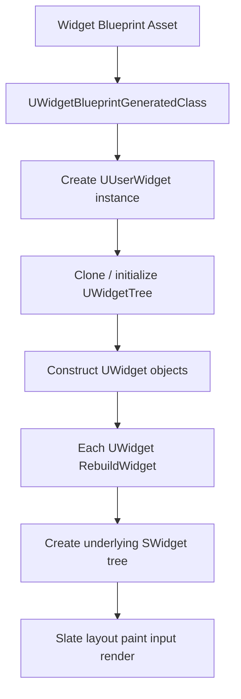

# UMG 概览：基于 Slate 的高层 UI 框架

本文结合 UE5.5 源码，在 Slate 的基础上介绍 UMG（Unreal Motion Graphics）的实现思路、核心对象模型，以及运行时几个最重要的概念。

如果把 UE 的 UI 体系按层次拆开，可以先记住一句话：

- **Slate** 负责底层原生 UI 机制与渲染。
- **UMG** 负责把 UI 变成 `UObject` / Blueprint 友好的高层框架。

也就是说，UMG 并不是另一套完全独立的 UI 系统，而是**建立在 Slate 之上的包装层、资产层和运行时管理层**。

建议先阅读 [SlateOverview.md](SlateOverview.md) 与 [SlateRenderering.md](SlateRenderering.md)。

主要涉及源码：

- [Source/Runtime/UMG/Public/Components/Widget.h](Source/Runtime/UMG/Public/Components/Widget.h)
- [Source/Runtime/UMG/Public/Blueprint/UserWidget.h](Source/Runtime/UMG/Public/Blueprint/UserWidget.h)
- [Source/Runtime/UMG/Public/Blueprint/WidgetTree.h](Source/Runtime/UMG/Public/Blueprint/WidgetTree.h)
- [Source/Runtime/UMG/Public/Blueprint/WidgetBlueprintGeneratedClass.h](Source/Runtime/UMG/Public/Blueprint/WidgetBlueprintGeneratedClass.h)
- [Source/Runtime/UMG/Public/Components/PanelWidget.h](Source/Runtime/UMG/Public/Components/PanelWidget.h)
- [Source/Runtime/UMG/Public/Components/PanelSlot.h](Source/Runtime/UMG/Public/Components/PanelSlot.h)
- [Source/Runtime/UMG/Public/Components/SlateWrapperTypes.h](Source/Runtime/UMG/Public/Components/SlateWrapperTypes.h)
- [Source/Runtime/UMG/Public/Components/WidgetComponent.h](Source/Runtime/UMG/Public/Components/WidgetComponent.h)

## 1. UMG 的定位

UMG 是 Unreal 面向游戏 UI 的高层框架，它解决的不是“怎么画一个按钮”这种底层问题，而是这些更上层的问题：

- 让 UI 可以成为 `UObject` / 资产 / 蓝图
- 让 UI 可以在设计器中可视化编辑
- 让属性、动画、绑定、事件、导航这些能力更适合游戏开发
- 让游戏 UI 更容易和反射系统、GC、蓝图、序列化、组件系统整合

这意味着，UMG 的设计目标和 Slate 不完全一样：

- Slate 偏底层、偏 C++、偏原生桌面 UI 框架
- UMG 偏高层、偏可视化、偏游戏生产工作流

对项目开发来说，通常是：

- **游戏 HUD / 菜单 / 背包 / 设置界面**：优先 UMG
- **编辑器工具 / 原生复杂控件 / 底层自定义绘制**：优先 Slate

## 2. UMG 和 Slate 的关系

UMG 最核心的关系可以概括成：

**UMG 用 `UObject` 世界描述 UI，再在运行时把这些 `UWidget` 包装转成底层的 `SWidget` 树。**

这也是 [Source/Runtime/UMG/Public/Components/Widget.h](Source/Runtime/UMG/Public/Components/Widget.h) 最值得注意的一句注释：

> `This is the base class for all wrapped Slate controls that are exposed to UObjects.`

也就是说：

- `SWidget` 是底层原生控件
- `UWidget` 是暴露给 `UObject` / Blueprint 的包装层

所以 UMG 并不是替代 Slate，而是**把 Slate 控件体系“对象化、蓝图化、资产化”**。

## 3. 全局视角：UMG 是怎么工作的

从大图上看，UMG 的一条典型运行链路如下：



所以，UMG 做的事情可以分成三层：

1. **资产/类层**：Widget Blueprint 被编译成 `UWidgetBlueprintGeneratedClass`
2. **对象树层**：运行时得到一棵 `UWidgetTree`
3. **底层控件层**：每个 `UWidget` 再生成对应的 `SWidget`

## 4. 核心概念一：`UWidget`

`UWidget` 是所有 UMG 控件的基类，定义在 [Source/Runtime/UMG/Public/Components/Widget.h](Source/Runtime/UMG/Public/Components/Widget.h)。

它的重要意义不是“具体控件行为”，而是：

- 它把控件纳入 `UObject` 体系
- 它支持反射、序列化、GC、蓝图暴露
- 它定义了 UMG 和底层 Slate 的桥接边界

从这个头文件里可以直接看出几个很典型的 UMG 特征：

- `BindWidget` / `BindWidgetOptional` 元数据
- 动态属性绑定宏 `PROPERTY_BINDING`
- `SlateWrapperTypes.h` 中的一系列 UMG 暴露类型
- 对 `SWidget` 的直接依赖

这说明 `UWidget` 本身就是一个“桥”。

### 4.1 `UWidget` 不是自己画自己

要特别注意的一点是：

- `UWidget` 不是最终渲染对象
- 真正参与 Slate 布局、绘制、输入的是底层 `SWidget`

因此，从职责划分上看：

- `UWidget` 负责高层状态、属性、反射暴露、蓝图交互
- `SWidget` 负责底层布局、Paint、输入与渲染链路

## 5. 核心概念二：`UUserWidget`

如果说 `UWidget` 是“所有 UMG 控件的基类”，那么 [Source/Runtime/UMG/Public/Blueprint/UserWidget.h](Source/Runtime/UMG/Public/Blueprint/UserWidget.h) 里的 `UUserWidget` 就是最典型的“一个界面蓝图 / 一个完整 UI 页面”的承载类。

平时在项目中创建的 Widget Blueprint，运行时实例通常就是某个 `UUserWidget` 子类。

`UUserWidget` 之所以重要，是因为它额外承担了：

- 生命周期入口
- 动画播放与管理
- 蓝图事件与扩展点
- named slot 内容填充
- 和玩家、viewport、输入上下文之间的连接

从头文件里也能直接看出它对 UMG 动画体系的整合，例如：

- `UWidgetAnimation`
- `UUMGSequencePlayer`
- `FAnimationEventBinding`
- `EWidgetTickFrequency`

这说明 `UUserWidget` 不只是“一个容器”，还是 UMG 运行时行为的主控对象。

## 6. 核心概念三：`UWidgetTree`

[Source/Runtime/UMG/Public/Blueprint/WidgetTree.h](Source/Runtime/UMG/Public/Blueprint/WidgetTree.h) 里的 `UWidgetTree` 是理解 UMG 最关键的数据结构之一。

它的定位在注释里写得很直接：

> `The widget tree manages the collection of widgets in a blueprint widget.`

也就是说，`UWidgetTree` 管的是：

- 一张 Widget Blueprint 对应的 `UWidget` 层级结构
- root widget
- named slot 绑定内容
- 递归查找、遍历、构建 widget 实例

这个类最重要的成员是：

```cpp
UPROPERTY(Instanced)
TObjectPtr<UWidget> RootWidget;
```

因此，UMG 设计器里那棵可视化控件树，在运行时的对象模型核心就是 `UWidgetTree`。

## 7. 核心概念四：`UWidgetBlueprintGeneratedClass`

Widget Blueprint 编译后的类是 [Source/Runtime/UMG/Public/Blueprint/WidgetBlueprintGeneratedClass.h](Source/Runtime/UMG/Public/Blueprint/WidgetBlueprintGeneratedClass.h) 里的 `UWidgetBlueprintGeneratedClass`。

这个类很重要，因为它解释了：

- 为什么 Widget Blueprint 不是单纯的 `UUserWidget` 子类
- 为什么它能在运行时自动创建控件树、自动绑定动画、自动做属性/委托绑定

头文件注释里有一句非常关键：

> `This is the function that makes UMG work.`

对应的就是：

```cpp
void InitializeWidget(UUserWidget* UserWidget) const;
```

这句话并不夸张。`UWidgetBlueprintGeneratedClass` 保存了：

- `WidgetTree` 模板
- `Bindings`
- `Animations`
- named slot 信息

运行时当 `UUserWidget` 被构造后，正是这个 generated class 负责：

- 初始化 widget tree
- 做 delegate / property binding
- 绑定动画对象
- 完成类似 Actor Blueprint 那样的“蓝图类实例化后初始化”工作

所以，UMG 的类层核心不是只有 `UUserWidget`，还必须加上 `UWidgetBlueprintGeneratedClass`。

## 8. 核心概念五：`UPanelWidget` 与 `UPanelSlot`

UMG 的容器模型主要由这两个类型构成：

- [Source/Runtime/UMG/Public/Components/PanelWidget.h](Source/Runtime/UMG/Public/Components/PanelWidget.h)
- [Source/Runtime/UMG/Public/Components/PanelSlot.h](Source/Runtime/UMG/Public/Components/PanelSlot.h)

### 8.1 `UPanelWidget`

`UPanelWidget` 是所有容器型控件的基类，核心成员是：

```cpp
UPROPERTY(Instanced)
TArray<TObjectPtr<UPanelSlot>> Slots;
```

这说明 UMG 里的“容器管理子控件”并不是直接存 `UWidget*`，而是通过 slot 层来表达。

这和 Slate 的思想是一脉相承的：

- 控件树不仅有 child
- child 还附带布局规则、slot 参数

### 8.2 `UPanelSlot`

`UPanelSlot` 是 UMG 侧 slot 的基类，里面最关键的两个成员是：

```cpp
TObjectPtr<UPanelWidget> Parent;
TObjectPtr<UWidget> Content;
```

slot 之所以单独成类，是因为布局参数属于“子控件在父容器中的呈现方式”，不属于 child widget 自己。

例如：

- `UCanvasPanelSlot` 关心 anchors / offsets / ZOrder
- `UHorizontalBoxSlot` 关心 padding / size / alignment
- `UOverlaySlot` 关心 alignment / padding

因此，slot 是理解 UMG 布局模型必须掌握的概念。

## 9. 核心概念六：UMG 类型包装层

[Source/Runtime/UMG/Public/Components/SlateWrapperTypes.h](Source/Runtime/UMG/Public/Components/SlateWrapperTypes.h) 展示了 UMG 的另一个重要职责：

**把 Slate / 输入 / 可访问性 / 布局中的很多底层类型包装成蓝图友好的 UENUM / USTRUCT。**

例如：

- `ESlateVisibility`
- `ESlateAccessibleBehavior`
- `FEventReply`
- `FSlateChildSize`

这类类型很重要，因为它们说明 UMG 并不是“另写一套 UI 语义”，而是把 Slate 那套核心概念重新包装成更适合编辑器面板和蓝图暴露的形式。

比如：

- Slate 里原生的 visibility / reply / size rule
- 到 UMG 里就变成能被 `UPROPERTY`、蓝图节点和设计器识别的包装类型

## 10. 关键实现点：`RebuildWidget()`

UMG 和 Slate 之间真正最关键的一跳，是 `RebuildWidget()`。

在 UMG 各种具体控件里，你都能看到这个函数，例如：

- `UTextBlock::RebuildWidget()`
- `UButton::RebuildWidget()`
- `UCanvasPanel::RebuildWidget()`

它的意义非常直接：

**把一个 `UWidget` 对象，构建成底层实际工作的 `SWidget`。**

这一步是 UMG 实现的核心桥梁。

## 11. 一个直观例子：`UTextBlock` 如何变成 `STextBlock`

`UTextBlock` 的声明在 [Source/Runtime/UMG/Public/Components/TextBlock.h](Source/Runtime/UMG/Public/Components/TextBlock.h)，实现位于 `Source/Runtime/UMG/Private/Components/TextBlock.cpp`。

从这个类型可以非常清楚地看到 UMG 的典型模式：

- `UTextBlock` 暴露 `Text`、`ColorAndOpacity`、`Font` 等 UPROPERTY
- 同时支持 delegate 绑定，比如 `TextDelegate`
- 内部持有底层 Slate 控件指针，例如 `MyTextBlock`
- 运行时通过 `RebuildWidget()` 创建真正的 `STextBlock`

这类控件的工作方式几乎就是 UMG 的标准范式：

1. UMG 侧保存高层属性与蓝图绑定信息。
2. `RebuildWidget()` 创建底层 Slate 控件。
3. `SynchronizeProperties()` 一类逻辑把 UMG 属性同步到底层 Slate。
4. 后续属性变化再增量更新 live Slate widget。

因此可以把 `UTextBlock` 视为“UMG 控件实现模板”的一个经典例子。

## 12. UMG 的属性绑定是怎么回事

在 [Source/Runtime/UMG/Public/Components/Widget.h](Source/Runtime/UMG/Public/Components/Widget.h) 里可以看到一系列宏：

- `PROPERTY_BINDING`
- `PROPERTY_BINDING_IMPLEMENTATION`
- `OPTIONAL_BINDING_CONVERT`

这套宏的核心作用是：

- 让 UMG 属性既可以来自常量值
- 也可以来自蓝图函数 / `UObject` 方法绑定
- 最终在构建 Slate widget 时变成底层 `TAttribute` 或对应 delegate

也就是说，UMG 里的“绑定文本”“绑定颜色”“绑定可见性”，本质上最终还是落回到了 Slate 的 attribute 体系，只不过外层包装得更适合蓝图与调试。

## 13. UMG 的动画为什么是 UMG 自己的一层能力

Slate 自身当然可以通过属性更新、tick、curve 等方式做动画，但 UMG 在上层又专门提供了一套更面向设计器和 Blueprint 的动画系统。

从 `UUserWidget.h` 里能看到：

- `UWidgetAnimation`
- `UUMGSequencePlayer`
- `FAnimationEventBinding`

这些类型表明 UMG 的动画能力是：

- 可以在 Widget Blueprint 里可视化编辑
- 可以作为 widget blueprint 资产的一部分被编译保存
- 可以在运行时自动绑定到实例上

所以 UMG 的动画体系，本质上是“建立在底层 UI 更新能力之上的高层可视化动画系统”。

## 14. UMG 的生命周期，应该怎么理解

实际使用 UMG 时，经常会接触到 `PreConstruct`、`Construct`、`OnInitialized` 这类概念。虽然本文不展开完整生命周期细节，但从实现结构上至少应该先记住：

- `UUserWidget` 是运行时主对象
- generated class 会对实例做初始化
- widget tree 会在这个过程中被克隆/建立
- 各子控件会逐步生成对应的 Slate widget

因此，UMG 生命周期本质上围绕着两件事：

1. 建立 `UWidget` 对象树
2. 建立并同步对应的 `SWidget` 树

如果你对某个生命周期事件的行为感到困惑，通常都可以回到这两件事去理解它发生在“对象层”还是“底层 Slate 层”。

## 15. UMG 里的“设计时”和“运行时”是两套语境

UMG 和纯 Slate 最大的不同之一，就是它天然有**设计时（Designer）**这个语境。

在 `Widget.h` 里就能看到相关概念，例如：

- `EWidgetDesignFlags`
- `DesignerRebuild`
- `IsDesignTime()`

这很重要，因为 UMG 控件经常需要区分：

- 现在是在 Widget Blueprint 设计器里预览
- 还是在游戏运行时真实执行

这也是为什么 UMG 控件里很多逻辑会专门判断 `IsDesignTime()`，以及为什么某些绑定、预构建逻辑在 Designer 中表现和运行时不完全一样。

## 16. UMG 不只是屏幕 UI，还可以进 3D 世界

[Source/Runtime/UMG/Public/Components/WidgetComponent.h](Source/Runtime/UMG/Public/Components/WidgetComponent.h) 展示了 UMG 的另一个重要能力：

**Widget 可以作为组件被渲染到世界中。**

`UWidgetComponent` 的注释非常直白：

> Widgets are first rendered to a render target, then that render target is displayed in the world.

这意味着：

- `Screen Space`：直接作为屏幕 UI 使用
- `World Space`：先渲染到 render target，再映射到世界中的 mesh/surface

这也是 UMG 相比传统桌面 UI 框架非常“游戏引擎化”的一点。

同时 `UWidgetComponent` 还支持：

- `SetWidget(UUserWidget*)`
- `SetSlateWidget(TSharedPtr<SWidget>)`

这再次证明 UMG 和 Slate 底层是打通的：即使通过组件进 3D 世界，最终显示的仍然是 Slate 内容。

## 17. 一个最重要的认知：UMG 的本体不是渲染，而是“运行时 UI 对象系统”

很多人刚接触 UMG 时，容易把它理解成“蓝图版 Slate”。这并不完全错，但还不够准确。

更准确的说法是：

**UMG 的本体不是另一套渲染器，而是一套建立在 Slate 之上的 UI 对象系统、资产系统和运行时管理系统。**

它解决的是：

- UI 如何成为资产
- UI 如何被蓝图编辑器可视化创建
- UI 如何和 UObject / GC / 序列化融合
- UI 如何有动画、绑定、设计时预览、组件化世界渲染这些高层能力

而渲染本身，最终仍然依赖 Slate。

## 18. 学 UMG 时最该先掌握的几个概念

如果你要系统读 UMG 实现，建议优先掌握下面这些概念：

1. `UWidget` 和 `SWidget` 的分层关系。
2. `UUserWidget` 是“完整界面实例”的承载类。
3. `UWidgetTree` 是设计器树 / 运行时对象树的核心结构。
4. `UWidgetBlueprintGeneratedClass` 负责把 Widget Blueprint 编译结果初始化到实例上。
5. `UPanelWidget` + `UPanelSlot` 是 UMG 布局模型的基础。
6. `RebuildWidget()` 是 UMG 到 Slate 的关键桥梁。
7. 属性绑定、动画、设计时预览，是 UMG 比纯 Slate 更高层的价值所在。

## 19. 小结

可以把 UMG 总结成一句话：**它是构建在 Slate 之上的高层游戏 UI 框架，把底层原生控件系统包装成了可反射、可蓝图化、可资产化、可设计器编辑的 UI 对象体系。**

它最重要的几个概念分别是：

- `UWidget`：Slate 控件的 UObject 包装基类
- `UUserWidget`：完整界面/Widget Blueprint 实例的主类
- `UWidgetTree`：管理一棵 UMG 控件树
- `UWidgetBlueprintGeneratedClass`：管理 Widget Blueprint 的运行时初始化
- `UPanelWidget` / `UPanelSlot`：容器与布局规则模型
- `RebuildWidget()`：把 `UWidget` 转成底层 `SWidget`
- `WidgetComponent`：把 UMG/Slate 内容渲染到 3D 世界

因此，理解 UMG 的关键不是只盯着某个按钮怎么画，而是要看清：**它如何把 Slate 的底层控件机制，扩展成 UE 的完整 UI 生产与运行体系。**
