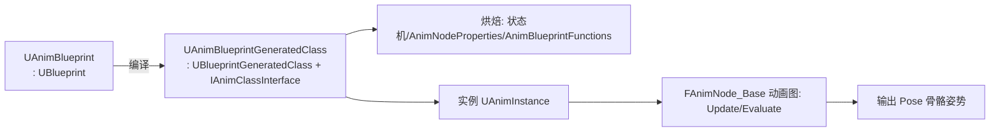
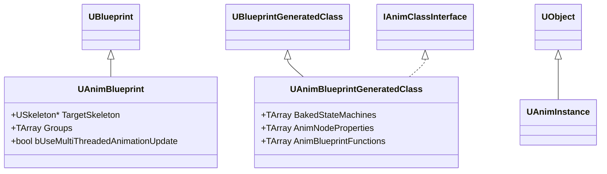
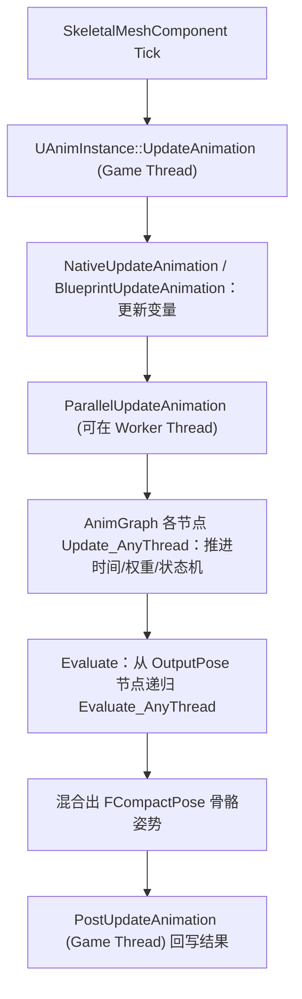
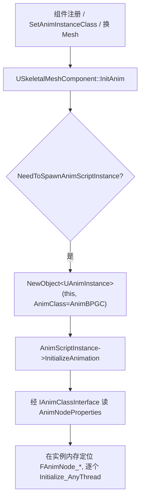
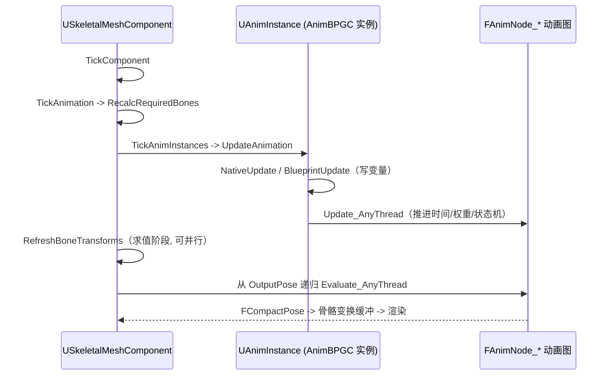
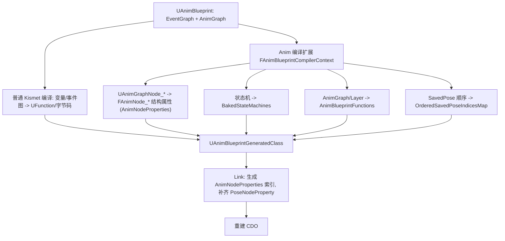

# 动画蓝图实现解析：UAnimBlueprint 与 UAnimBlueprintGeneratedClass

本文结合 UE5.5 源码，解析动画蓝图（Animation Blueprint）的实现细节，重点解析编辑期资产 `UAnimBlueprint` 与编译产物 `UAnimBlueprintGeneratedClass`（AnimBPGC），并说明它们如何在普通蓝图体系（`UBlueprint` / `UBlueprintGeneratedClass`）之上扩展出「动画图」这一套东西。

建议先阅读 [Blueprint 实现解析](../UObjectAndBP/Blueprint.md) 与 [BlueprintVM 执行解析](../UObjectAndBP/BlueprintVM.md)。

主要涉及源码：

- [Source/Runtime/Engine/Classes/Animation/AnimBlueprint.h](Source/Runtime/Engine/Classes/Animation/AnimBlueprint.h)
- [Source/Runtime/Engine/Classes/Animation/AnimBlueprintGeneratedClass.h](Source/Runtime/Engine/Classes/Animation/AnimBlueprintGeneratedClass.h)
- [Source/Runtime/Engine/Classes/Animation/AnimClassInterface.h](Source/Runtime/Engine/Classes/Animation/AnimClassInterface.h)
- [Source/Runtime/Engine/Classes/Animation/AnimInstance.h](Source/Runtime/Engine/Classes/Animation/AnimInstance.h)
- [Source/Runtime/Engine/Classes/Animation/AnimNodeBase.h](Source/Runtime/Engine/Classes/Animation/AnimNodeBase.h)

## 1. 一句话概括

动画蓝图是**普通蓝图的一个特化**：

- `UAnimBlueprint : public UBlueprint` —— 编辑期资产，额外记录目标骨架、同步组等动画信息。
- `UAnimBlueprintGeneratedClass : public UBlueprintGeneratedClass, public IAnimClassInterface` —— 编译产物，除了普通 BPGC 的一切，还烘焙了状态机、动画节点属性等「动画图运行数据」。
- 运行时实例是 `UAnimInstance`，其内部持有一组 `FAnimNode_Base`（动画图节点），按 `Initialize/Update/Evaluate` 流程驱动出骨骼姿势。



## 2. 与普通蓝图的继承关系



要点：动画蓝图没有另起炉灶。类型、反射、CDO、序列化、GC、字节码 VM 全部复用普通蓝图那一套（见 [Blueprint.md](../UObjectAndBP/Blueprint.md)）；它只是**在生成类里额外烘焙了「动画图」数据，并额外定义了一条 Update/Evaluate 执行链**。

## 3. UAnimBlueprint：编辑期资产

`UAnimBlueprint` 定义在 [AnimBlueprint.h](Source/Runtime/Engine/Classes/Animation/AnimBlueprint.h)：

```cpp
class UAnimBlueprint : public UBlueprint, public IInterface_PreviewMeshProvider
{
    GENERATED_UCLASS_BODY()

    /** 目标骨架：本 BP 生成的 AnimInstance 所驱动的骨架，引用的动画都应兼容它 */
    UPROPERTY(AssetRegistrySearchable, EditAnywhere, AdvancedDisplay, Category=ClassOptions)
    TObjectPtr<USkeleton> TargetSkeleton;

    /** 动画同步组列表 */
    UPROPERTY()
    TArray<FAnimGroupInfo> Groups;

    /** 模板动画蓝图：不绑定具体骨架（TargetSkeleton 为空） */
    UPROPERTY(AssetRegistrySearchable)
    bool bIsTemplate;

    /** 允许在工作线程更新动画（原生更新、混合树、蒙太奇、资源播放器） */
    UPROPERTY(EditAnywhere, Category = Optimization)
    bool bUseMultiThreadedAnimationUpdate;

    /** 编译期在「动画图里调用蓝图」时发出警告，帮助定位可优化点 */
    UPROPERTY(EditAnywhere, Category = Optimization)
    bool bWarnAboutBlueprintUsage;

    ENGINE_API class UAnimBlueprintGeneratedClass* GetAnimBlueprintGeneratedClass() const;
    ENGINE_API class UAnimBlueprintGeneratedClass* GetAnimBlueprintSkeletonClass() const;
};
```

相比 `UBlueprint`，它多出的核心是动画上下文：

- `TargetSkeleton`：这份动画蓝图服务于哪个骨架。所有引用的 AnimSequence/BlendSpace 都应兼容它。
- `Groups`：同步组（Sync Group）信息，让多个动画按归一化相位同步播放（如行走/奔跑混合）。
- `bIsTemplate`：模板动画蓝图，不绑定骨架，可被不同骨架复用。
- `bUseMultiThreadedAnimationUpdate`：允许动画更新跑到 worker 线程（需配合项目设置），是动画性能的关键开关。
- 它编辑器里那些额外的「AnimGraph」也是 `UEdGraph`（见 [BlueprintEditor.md](../UObjectAndBP/BlueprintEditor.md)），只是节点是 `UAnimGraphNode_*`。

`GetAnimBlueprintGeneratedClass` / `GetAnimBlueprintSkeletonClass` 就是把 `UBlueprint::GeneratedClass` / `SkeletonGeneratedClass`（见 [Blueprint.md](../UObjectAndBP/Blueprint.md) 第 3 节）向下转型成 AnimBPGC。

## 4. UAnimBlueprintGeneratedClass：编译产物

AnimBPGC 定义在 [AnimBlueprintGeneratedClass.h](Source/Runtime/Engine/Classes/Animation/AnimBlueprintGeneratedClass.h)：

```cpp
class UAnimBlueprintGeneratedClass : public UBlueprintGeneratedClass, public IAnimClassInterface
{
    GENERATED_UCLASS_BODY()

    friend class FAnimBlueprintCompilerContext;

    /** 本类中所有被烘焙的状态机 */
    UPROPERTY()
    TArray<FBakedAnimationStateMachine> BakedStateMachines;

    /** 目标骨架 */
    UPROPERTY(AssetRegistrySearchable)
    TObjectPtr<USkeleton> TargetSkeleton;

    /** 状态机等可引用的动画通知列表 */
    UPROPERTY()
    TArray<FAnimNotifyEvent> AnimNotifies;

    /** 需要更新的 SavedPose（缓存姿势）节点索引，按更新顺序、按层排列 */
    UPROPERTY()
    TMap<FName, FCachedPoseIndices> OrderedSavedPoseIndicesMap;

    /** 本类持有的各动画函数（GenerateAnimationBlueprintFunctions 期间创建） */
    TArray<FAnimBlueprintFunction> AnimBlueprintFunctions;

    /** 动画节点属性数组；瞬态生成数据（Link 期间创建） */
    TArray<FStructProperty*> AnimNodeProperties;
    TArray<FStructProperty*> LinkedAnimGraphNodeProperties;
    TArray<FStructProperty*> LinkedAnimLayerNodeProperties;
    TArray<FStructProperty*> PreUpdateNodeProperties;
    TArray<FStructProperty*> DynamicResetNodeProperties;
    TArray<FStructProperty*> StateMachineNodeProperties;
    TArray<FStructProperty*> InitializationNodeProperties;
};
```

关键成员解读：

### 4.1 AnimNodeProperties：动画图的真身

- 每个动画图节点（`FAnimNode_Sequence`、`FAnimNode_BlendSpacePlayer`、`FAnimNode_StateMachine` 等）都是一个 `USTRUCT`，编译后作为 `FStructProperty` **实际存储在 AnimInstance 实例上**。
- `AnimNodeProperties` 就是这些结构属性的数组（在 `Link` 期间生成），是「动画图在实例内存里的布局索引」。
- 按功能还细分了多份子集：`StateMachineNodeProperties`（状态机节点）、`PreUpdateNodeProperties`（需要预更新的节点）、`InitializationNodeProperties`（需要初始化的节点）等，便于运行时按类别高效遍历。
- 注意源码里节点索引普遍是「反向」的：`AnimNodeProperties.Num() - 1 - Index`，这是编译器布局约定。

### 4.2 BakedStateMachines：烘焙状态机

- 编辑器里画的状态机（State/Transition）在编译时被烘焙成 `FBakedAnimationStateMachine` 数据（状态、转移条件、进入/退出规则等），运行时由 `FAnimNode_StateMachine` 解释执行。
- `OrderedSavedPoseIndicesMap` 记录缓存姿势节点（Save/Use cached pose）的更新顺序，保证依赖关系正确。

### 4.3 AnimBlueprintFunctions：动画函数

`FAnimBlueprintFunction`（见 [AnimClassInterface.h](Source/Runtime/Engine/Classes/Animation/AnimClassInterface.h)）描述一个「动画图函数」（如主 AnimGraph、各 Linked Anim Layer）：

```cpp
struct FAnimBlueprintFunction
{
    UPROPERTY() FName Name;                 // 函数名（如 AnimGraph）
    UPROPERTY() FName Group;
    UPROPERTY() int32 OutputPoseNodeIndex;  // 输出姿势节点的索引
    UPROPERTY() TArray<FName> InputPoseNames;
    UPROPERTY() TArray<int32> InputPoseNodeIndices;

    FStructProperty* OutputPoseNodeProperty;             // Link 期间补齐
    TArray<FStructProperty*> InputPoseNodeProperties;
};
```

- 一个 AnimGraph 从「输出姿势节点」（`OutputPoseNodeIndex`，通常是 Output Pose）出发，沿节点连接反向递归求值，得到最终 Pose。
- Linked Anim Layer 是「可被子类/外部覆盖的动画子图」，也表达为一个 `FAnimBlueprintFunction`。

### 4.4 IAnimClassInterface：运行时访问契约

AnimBPGC 实现 `IAnimClassInterface`，向运行时暴露上述烘焙数据：

```cpp
class IAnimClassInterface
{
    virtual const TArray<FStructProperty*>& GetAnimNodeProperties() const = 0;
    virtual const TArray<FBakedAnimationStateMachine>& GetBakedStateMachines() const = 0;
    virtual const TArray<FAnimBlueprintFunction>& GetAnimBlueprintFunctions() const = 0;
    // ...
};
```

`UAnimInstance` 在初始化和更新时通过这个接口拿到「本类的动画图布局」，从而在实例内存上定位每个 `FAnimNode_*` 并驱动它们。这实现了「类持有布局元数据、实例持有节点数据」的分工——与 `UClass` 持有 `FProperty`、实例持有属性值的模式一致（见 [UObject.md](../UObjectAndBP/UObject.md)）。

## 5. 运行时：UAnimInstance 与动画图节点

### 5.1 节点模型 FAnimNode_Base

动画图的每个节点都从 `FAnimNode_Base` 派生，见 [AnimNodeBase.h](Source/Runtime/Engine/Classes/Animation/AnimNodeBase.h)：

```cpp
struct FAnimNode_Base
{
    // 初始化（重置状态）
    ENGINE_API virtual void Initialize_AnyThread(const FAnimationInitializeContext& Context);
    // 计算所需骨骼
    ENGINE_API virtual void CacheBones_AnyThread(const FAnimationCacheBonesContext& Context);
    // 更新（推进时间、权重、状态机转移等）——不产出最终姿势
    ENGINE_API virtual void Update_AnyThread(const FAnimationUpdateContext& Context);
    // 求值（产出骨骼姿势）
    ENGINE_API virtual void Evaluate_AnyThread(FPoseContext& Output);
};
```

- 后缀 `_AnyThread` 表明这些函数设计为**可在工作线程执行**（配合 `bUseMultiThreadedAnimationUpdate`）。
- 节点之间通过 `FPoseLink`（`FPoseLinkBase`）连接，形成「姿势数据流图」；`FPoseLink` 记录连到的上游节点属性索引。
- 关键区分：**Update 与 Evaluate 分离**。Update 阶段只推进逻辑（时间、混合权重、状态转移），Evaluate 阶段才真正采样动画、混合骨骼、输出 `FCompactPose`。

### 5.2 更新—求值流程

`UAnimInstance` 定义在 [AnimInstance.h](Source/Runtime/Engine/Classes/Animation/AnimInstance.h)，暴露多层可覆盖入口：

```cpp
// 每帧更新入口
ENGINE_API void UpdateAnimation(float DeltaSeconds, bool bNeedsValidRootMotion, EUpdateAnimationFlag UpdateFlag);
ENGINE_API void ParallelUpdateAnimation();   // 工作线程上的并行更新

// C++ 可覆盖的更新钩子
ENGINE_API virtual void NativeUpdateAnimation(float DeltaSeconds);
ENGINE_API virtual void NativeThreadSafeUpdateAnimation(float DeltaSeconds);

// 蓝图事件（Event Graph）
ENGINE_API void BlueprintUpdateAnimation(float DeltaTimeX);
ENGINE_API void BlueprintThreadSafeUpdateAnimation(float DeltaTime);
```

整帧动画的典型流程：



- **Game Thread**：`UpdateAnimation` → `NativeUpdateAnimation`（C++）/ `BlueprintUpdateAnimation`（事件图，走 BP VM，见 [BlueprintVM.md](../UObjectAndBP/BlueprintVM.md)）——通常在这里读取角色速度、状态等，写入 AnimInstance 变量。
- **Worker Thread（可选）**：`ParallelUpdateAnimation` 驱动 AnimGraph 节点的 `Update_AnyThread` 与 `Evaluate_AnyThread`。因为动画图节点是 `_AnyThread` 且不直接访问游戏对象，才能安全并行——这正是 `bUseMultiThreadedAnimationUpdate` 与 `bWarnAboutBlueprintUsage` 存在的意义（在动画图里调蓝图/访问游戏线程数据会破坏线程安全）。
- **回到 Game Thread**：`PostUpdateAnimation` 回写最终姿势与根运动。

### 5.3 FAnimInstanceProxy 的作用

为支持线程安全，实际的动画图数据与更新逻辑大多放在 `FAnimInstanceProxy`（`GetProxyOnGameThread` / `GetProxyOnAnyThread`）里。Proxy 在 worker 线程上运行，隔离了「游戏线程的 `UAnimInstance`」与「可并行的动画求值」，避免直接触碰 UObject 状态。

### 5.4 AnimBPGC 如何构建 UAnimInstance 并在 SkeletalMeshComponent 上更新

前面讲了「类持布局、实例持数据」，这里从 `USkeletalMeshComponent` 视角把「构建实例」和「每帧更新」两条链路走完，见 [SkeletalMeshComponent.cpp](Source/Runtime/Engine/Private/Components/SkeletalMeshComponent.cpp)。

#### 5.4.1 组件持有的两个关键成员

`USkeletalMeshComponent` 上有：

```cpp
// SkeletalMeshComponent.h
/** 使用的动画类（即 AnimBPGC 或其子类） */
UPROPERTY()
class TSubclassOf<UAnimInstance> AnimClass;

/** 运行时创建出来的动画实例 */
UPROPERTY(transient)
TObjectPtr<UAnimInstance> AnimScriptInstance;
```

- `AnimClass` 就是**要用哪个 AnimBPGC**（通过 `SetAnimInstanceClass` / 蓝图里指定 Anim Class 设置，或来自 SkeletalMesh 的 PostProcess AnimBP）。
- `AnimScriptInstance` 是**该类的一个实例**——这正是第 4.5/5 节说的「类 ↔ 实例」在组件上的落点。

#### 5.4.2 构建：InitAnim → NewObject → InitializeAnimation

组件在 `InitAnim` 里决定是否需要（重新）创建实例，真正的创建在 `InitializeAnimScriptInstance`：

```cpp
// USkeletalMeshComponent::InitializeAnimScriptInstance（简化）
if (NeedToSpawnAnimScriptInstance())
{
    // 用 AnimClass（AnimBPGC）在本组件下 new 一个 UAnimInstance 实例
    AnimScriptInstance = NewObject<UAnimInstance>(this, AnimClass);

    if (AnimScriptInstance)
    {
        ResetLinkedAnimInstances();
        AnimScriptInstance->InitializeAnimation(bInDeferRootNodeInitialization); // 初始化动画图
        if (HasBegunPlay())
        {
            AnimScriptInstance->NativeBeginPlay();
            AnimScriptInstance->BlueprintBeginPlay();
        }
    }
}
```

两步关键：

1. **`NewObject<UAnimInstance>(this, AnimClass)`**：以 AnimBPGC 为 `Class`、组件为 `Outer` 创建实例（见 [UObject.md](../UObjectAndBP/UObject.md) 第 6 节的 NewObject 流程）。实例内存布局由 AnimBPGC 的 `PropertiesSize` 决定，因此 `AnimNodeProperties` 指向的那些 `FAnimNode_*` 就随实例一起分配出来。
2. **`InitializeAnimation`**：`UAnimInstance` 通过 `IAnimClassInterface` 读取本类的 `AnimNodeProperties` / `AnimBlueprintFunctions`，在实例内存上定位每个 `FAnimNode_*`，逐个 `Initialize_AnyThread`，并建立 Proxy。



CDO 的作用也在这里体现：新实例的 `FAnimNode_*` 默认值来自 AnimBPGC 的 CDO（节点上编辑器设置的默认参数），再叠加实例运行时状态。

#### 5.4.3 更新：TickComponent → TickAnimation → UpdateAnimation

创建后，组件每帧在 `TickComponent` 里驱动动画：

```cpp
// 调用链（简化）
USkeletalMeshComponent::TickComponent
  -> TickAnimation(DeltaTime, bNeedsValidRootMotion)
       -> TickAnimInstances(DeltaTime, ...)
            -> AnimScriptInstance->UpdateAnimation(DeltaTime, ...)   // 见 5.2
```

`TickAnimation` 里还会先保证 `RequiredBones`（本帧需要计算的骨骼）是最新的，再 `TickAnimInstances` 把每个 AnimInstance 的 `UpdateAnimation` 跑起来（可派发到 worker 线程并行）。`UpdateAnimation` 内部就是第 5.2 节的 Update（推进逻辑）流程。

姿势的最终**求值**在骨骼刷新阶段（`RefreshBoneTransforms` / 并行动画求值任务）触发 AnimGraph 从 Output Pose 节点递归 `Evaluate_AnyThread`，产出 `FCompactPose`，再回写到组件的骨骼变换缓冲、送去渲染。



#### 5.4.4 何时会重建实例

`InitAnim` 会在检测到不匹配时先 `ClearAnimScriptInstance` 再重建，常见触发：

- `AnimClass` 变了（换了动画蓝图）——源码里的 `bBlueprintMismatch`。
- SkeletalMesh 的骨架与当前实例骨架不匹配——`bSkeletonMismatch`。
- 蓝图重编译（reinstancing，见 [BlueprintEditor.md](../UObjectAndBP/BlueprintEditor.md) 第 7.2 节）会让旧实例被新类实例替换。

这也解释了为什么运行时切换动画蓝图、换骨骼网格体，都会重新走一遍「NewObject + InitializeAnimation」。

## 6. 编译：从 AnimGraph 到 AnimBPGC

动画蓝图编译在普通 Kismet 编译（见 [BlueprintEditor.md](../UObjectAndBP/BlueprintEditor.md) 第 7 节）之上，由 `FAnimBlueprintCompilerContext` 扩展完成：



要点：

- **事件图**照常编译成字节码 `UFunction`（`BlueprintUpdateAnimation` 等），由 BP VM 执行。
- **AnimGraph** 不编成字节码，而是把每个 `UAnimGraphNode_*` 烘焙成实例上的 `FAnimNode_*` 结构属性，运行时由 C++ 直接 `Update_AnyThread`/`Evaluate_AnyThread`——因此动画图求值走的是**原生 C++ 路径**，性能远高于字节码解释。
- `Link` 阶段填充 `AnimNodeProperties` 等索引数组，并补齐 `FAnimBlueprintFunction` 里的 `OutputPoseNodeProperty`/`InputPoseNodeProperties`。

## 7. 与普通蓝图的对照

| 方面 | 普通蓝图 | 动画蓝图 |
| --- | --- | --- |
| 资产类 | `UBlueprint` | `UAnimBlueprint`（+ TargetSkeleton/Groups） |
| 生成类 | `UBlueprintGeneratedClass` | `UAnimBlueprintGeneratedClass`（+ `IAnimClassInterface`） |
| 实例 | 任意 `UObject`/`AActor` | `UAnimInstance` |
| 逻辑图执行 | 事件图/函数图 → 字节码 → BP VM | 事件图仍走 VM；**AnimGraph 走原生 `FAnimNode` 求值** |
| 额外烘焙数据 | 无 | 状态机、`AnimNodeProperties`、`AnimBlueprintFunctions` |
| 线程模型 | 主要在游戏线程 | 支持工作线程并行更新（`_AnyThread` + Proxy） |
| 反射/GC/序列化 | `UClass` 标准流程 | **完全相同**（AnimBPGC 也是 `UClass`） |

## 8. 小结

- `UAnimBlueprint`（`: UBlueprint`）是**编辑期资产**，在普通蓝图基础上补充目标骨架、同步组、多线程更新开关等动画上下文，并额外拥有 AnimGraph。
- `UAnimBlueprintGeneratedClass`（`: UBlueprintGeneratedClass, IAnimClassInterface`）是**编译产物**，除了普通 BPGC 的属性/函数/字节码/CDO，还烘焙了 `BakedStateMachines`、`AnimNodeProperties`、`AnimBlueprintFunctions` 等动画图运行数据，并通过 `IAnimClassInterface` 暴露给运行时。
- 运行时实例是 `UAnimInstance`，其内存上按 `AnimNodeProperties` 布局着一组 `FAnimNode_Base`；每帧经 Update（推进逻辑）+ Evaluate（产出姿势）驱动，事件图逻辑走 BP VM、AnimGraph 求值走原生 C++，并可借助 `FAnimInstanceProxy` 在工作线程并行。

核心认知：**动画蓝图 = 普通蓝图 + 一套烘焙进生成类的动画图数据 + 一条原生的 Update/Evaluate 执行链**。它完全站在 `UObject`/`UClass`/蓝图体系之上，只是为「高性能、可并行的骨骼动画求值」做了专门扩展。

相关文档：

- [对象与蓝图总览](../UObjectAndBP/UObjectAndBPOverview.md)
- [UObject 实现解析](../UObjectAndBP/UObject.md)
- [Blueprint 实现解析](../UObjectAndBP/Blueprint.md)
- [BlueprintVM 执行解析](../UObjectAndBP/BlueprintVM.md)
- [BlueprintEditor 实现解析](../UObjectAndBP/BlueprintEditor.md)