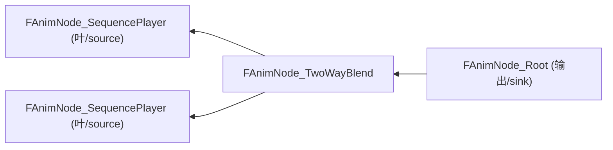
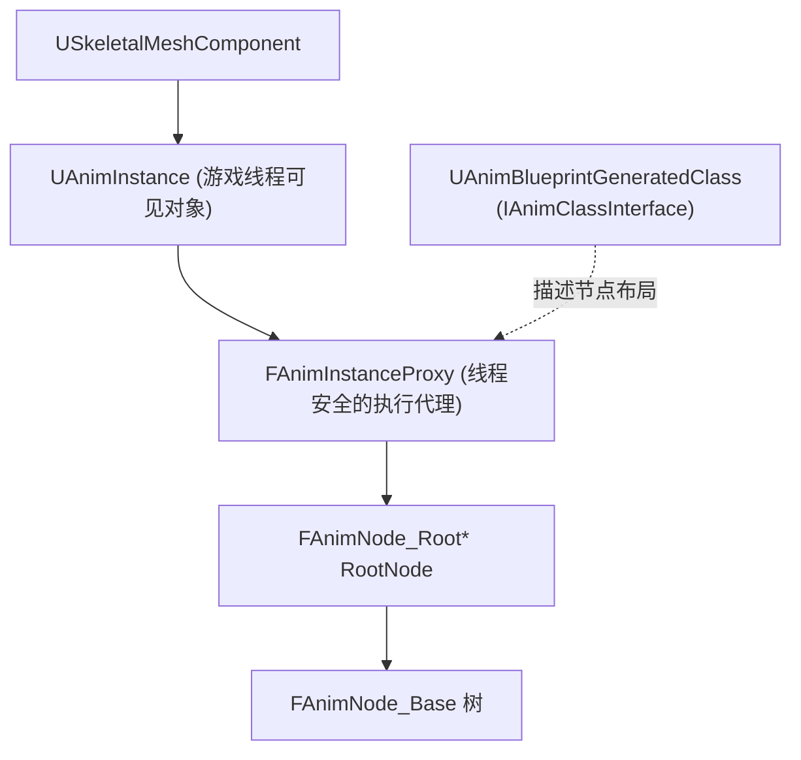
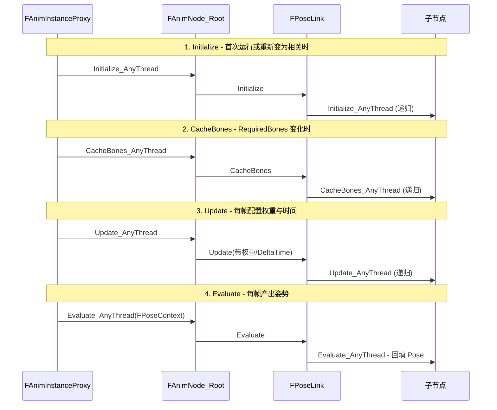
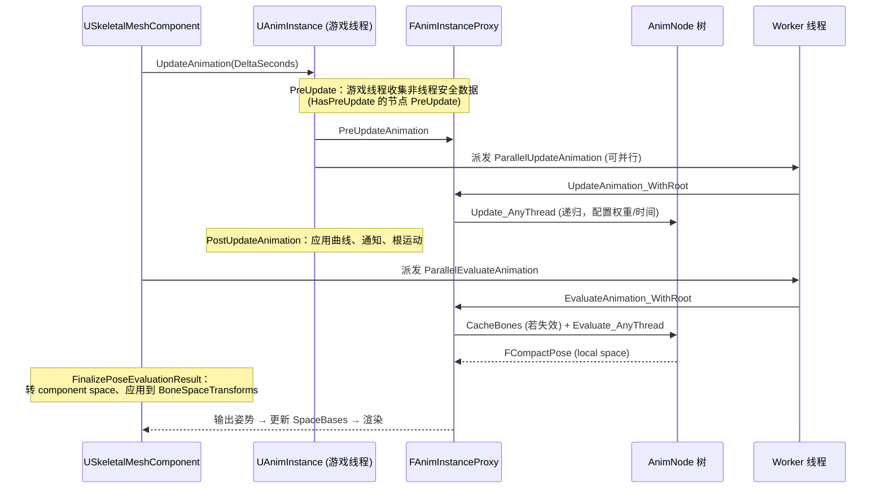
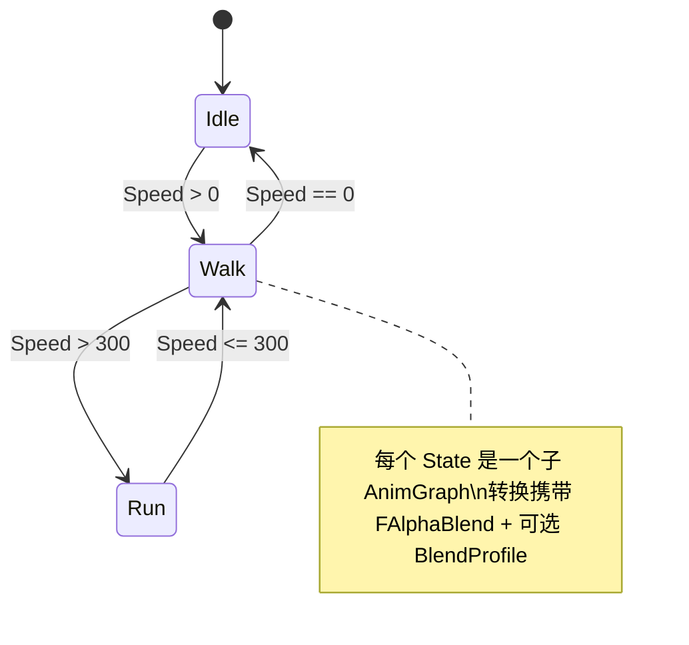

# Unreal Engine 动画系统运行时：AnimationGraph 详解

> 基于 UE 5.5.4 源码。本文聚焦“运行时（Runtime）”的 AnimGraph 执行机制，不涉及编辑器编译细节（那属于 `AnimGraph` 编辑器模块）。
>
> 关键源码路径：
> - `Engine/Source/Runtime/Engine/Classes/Animation/AnimNodeBase.h`（节点基类与上下文）
> - `Engine/Source/Runtime/Engine/Private/Animation/AnimNodeBase.cpp`（PoseLink 实现）
> - `Engine/Source/Runtime/Engine/Public/Animation/AnimInstanceProxy.h` / `.cpp`（图的驱动器）
> - `Engine/Source/Runtime/Engine/Private/Animation/AnimInstance.cpp`（Tick 入口）
> - `Engine/Source/Runtime/AnimGraphRuntime/`（具体节点实现，如混合、状态机等）

---

## 1. 总览：AnimGraph 到底是什么

在运行时，一个动画蓝图（AnimBlueprint）编译后不再是“图”，而是被**烘焙成一棵由 `FAnimNode_Base` 派生结构体组成的树（Anim Node Tree / 求值树）**。

- **图（Graph）是编辑器视角**：节点、连线、Pin。
- **树（Tree）是运行时视角**：每个 AnimGraphNode 对应一个运行时 `FAnimNode_Base` 结构体，Pin 连线对应 `FPoseLink`（姿势链接）。

树的**根节点是 sink（汇点）**：`FAnimNode_Root`，代表 Graph 的输出姿势。求值从根开始，通过 `FPoseLink` **逆着数据流方向递归**到叶子节点（如序列播放器），再把姿势逐层混合/修改回传到根。



数据流：叶子产生姿势 → 沿箭头反向传递 → Root 汇总。遍历（Initialize/Update/Evaluate）则从 Root 出发，递归进入子节点。

---

## 2. 运行时对象关系



| 对象 | 角色 |
|------|------|
| `USkeletalMeshComponent` | 拥有骨骼、发起 Tick、把姿势应用到骨骼 |
| `UAnimInstance` | 用户可见的动画蓝图实例（游戏线程），暴露事件/变量 |
| `FAnimInstanceProxy` | **真正驱动 AnimGraph 的执行代理**，可在 worker 线程执行；隔离游戏线程数据 |
| `IAnimClassInterface`（`UAnimBlueprintGeneratedClass`） | 描述节点属性布局：节点数组、根节点属性、暴露值处理器等 |
| `FAnimNode_Base` 树 | 实际运行时节点，执行 Initialize/Update/Evaluate |

**为什么要有 Proxy？** 动画求值默认在 worker 线程并行执行（`CanUpdateInWorkerThread`）。`UAnimInstance`（UObject）不是线程安全的，因此把可并行的执行状态放进 `FAnimInstanceProxy`（普通 struct），游戏线程与 worker 线程之间通过明确的 PreUpdate/PostUpdate 边界交换数据。

---

## 3. 节点基类 `FAnimNode_Base`

所有运行时节点都派生自它（`AnimNodeBase.h`）。核心是四个 **`_AnyThread`** 生命周期虚函数（“AnyThread”表明可在任意线程调用）：

```cpp
struct FAnimNode_Base
{
    // 首次运行时（进入 state / cached pose 分支可能多次）
    virtual void Initialize_AnyThread(const FAnimationInitializeContext& Context);
    // LOD 切换等导致 RequiredBones 变化时，缓存骨骼索引
    virtual void CacheBones_AnyThread(const FAnimationCacheBonesContext& Context);
    // 更新阶段：配置权重、推进时间。通常在此调用 EvaluateGraphExposedInputs
    virtual void Update_AnyThread(const FAnimationUpdateContext& Context);
    // 求值阶段：产生 local-space 姿势
    virtual void Evaluate_AnyThread(FPoseContext& Output);
    // 或产生 component-space 姿势（二选一，不要同时实现）
    virtual void EvaluateComponentSpace_AnyThread(FComponentSpacePoseContext& Output);

    // 调试
    virtual void GatherDebugData(FNodeDebugData& DebugData);

    // 线程能力声明
    virtual bool CanUpdateInWorkerThread() const { return true; }
    virtual bool HasPreUpdate() const { return false; }        // 需要游戏线程预处理
    virtual void PreUpdate(const UAnimInstance* InAnimInstance) {} // 在游戏线程收集非线程安全数据
    virtual bool NeedsDynamicReset() const { return false; }   // 物理/模拟类，需处理传送
    virtual void ResetDynamics(ETeleportType InTeleportType);
};
```

关键设计点：

- **`FAnimNode_Base` 本身没有指向子节点的成员**。子节点连接由派生节点自己声明的 `FPoseLink` 成员表示（如 `FAnimNode_TwoWayBlend::A`、`::B`）。因此“树结构”是数据驱动的、由各节点的 PoseLink 组合而成。
- **NodeData（折叠数据）**：`const FAnimNodeData* NodeData` 指向类级别的常量/折叠数据。`GetNodeIndex()`、暴露值处理器都通过它索引。这是 UE5 “constant folding” 优化：多个实例共享的常量数据只存一份于 Class 上。

### 创建自定义节点的约定
> 运行时 struct `FAnimNode_Xxx : FAnimNode_Base` + 编辑器 class `UAnimGraphNode_Xxx : UAnimGraphNode_Base`（内含前者作为成员）。

---

## 4. PoseLink：连接节点的“边”

`FPoseLinkBase`（`AnimNodeBase.h`）是父节点持有的、指向子节点的链接：

```cpp
struct FPoseLinkBase
{
protected:
    FAnimNode_Base* LinkedNode;   // 非序列化：运行时解析出的子节点指针
public:
    UPROPERTY() int32 LinkID;     // 序列化的链接 ID，用于构建 LinkedNode 指针映射
    // ...
    void Initialize(const FAnimationInitializeContext& Context);
    void CacheBones(const FAnimationCacheBonesContext& Context);
    void Update(const FAnimationUpdateContext& Context);
};

struct FPoseLink : public FPoseLinkBase            // local-space 姿势链接
{ void Evaluate(FPoseContext& Output); };

struct FComponentSpacePoseLink : public FPoseLinkBase  // component-space 姿势链接
{ void EvaluateComponentSpace(FComponentSpacePoseContext& Output); };
```

**PoseLink 的作用是“递归的桥梁”**。以 `Update` 为例（`AnimNodeBase.cpp`）：

```cpp
void FPoseLinkBase::Update(const FAnimationUpdateContext& InContext)
{
    // DO_CHECK：用 bProcessed 防止循环链接导致的无限递归
    if (LinkedNode != nullptr)
    {
        FAnimationUpdateContext LinkContext(InContext.WithNodeId(LinkID));
        // 若节点绑定了 图函数（初始更新/变为相关/更新），先调用它们
        if (LinkedNode->NodeData && LinkedNode->NodeData->HasNodeAnyFlags(EAnimNodeDataFlags::AllFunctions))
        {
            UE::Anim::FNodeFunctionCaller::InitialUpdate(LinkContext, *LinkedNode);
            UE::Anim::FNodeFunctionCaller::BecomeRelevant(LinkContext, *LinkedNode);
            UE::Anim::FNodeFunctionCaller::Update(LinkContext, *LinkedNode);
        }
        LinkedNode->Update_AnyThread(LinkContext);   // 递归进入子节点
    }
}
```

要点：
- `LinkedNode` 在初始化时通过 `AttemptRelink` 从 `LinkID` 解析（`LinkID` 是编译期烘焙的类内属性索引）。
- 每次进入子节点会用 `WithNodeId(LinkID)` 记录 CurrentNodeId/PreviousNodeId，用于调试可视化与消息栈。
- `bProcessed` 保护环形链接（在编辑器/`DO_CHECK` 下断言）。

---

## 5. 遍历上下文（Context）

四个阶段各自有一个 Context，全部派生自 `FAnimationBaseContext`：

```cpp
struct FAnimationBaseContext
{
    FAnimInstanceProxy* AnimInstanceProxy;         // 执行代理
    FAnimationUpdateSharedContext* SharedContext;  // 遍历期间共享的消息栈等
    int32 CurrentNodeId, PreviousNodeId;           // 当前/上一个节点 ID（沿 PoseLink 传播）
    bool bIsActive;                                // 该分支是否活跃（非 blending out）
    // GetMessage<T>() / GetMessageChecked<T>()：从消息栈取作用域消息（替代旧的 AncestorTracker）
};
```

| Context | 阶段 | 关键载荷 |
|---------|------|----------|
| `FAnimationInitializeContext` | Initialize | 无额外数据 |
| `FAnimationCacheBonesContext` | CacheBones | 无额外数据 |
| `FAnimationUpdateContext` | Update | `DeltaTime`、`CurrentWeight`（最终混合权重）、`RootMotionWeightModifier` |
| `FPoseContext` | Evaluate (local) | `FCompactPose Pose` + `FBlendedCurve Curve` + `FStackAttributeContainer` |
| `FComponentSpacePoseContext` | Evaluate (CS) | `FCSPose<FCompactPose> Pose` + Curve + Attributes |

### 5.1 `FAnimationUpdateContext` 的权重传播（关键）

Update 阶段最重要的职责是**沿树向下传播权重**，这样每个节点知道自己对最终姿势的贡献。它提供一组 with-style 拷贝方法（不可变、拷贝返回）：

```cpp
FAnimationUpdateContext FractionalWeight(float WeightMultiplier) const;               // 只缩放权重
FAnimationUpdateContext FractionalWeightAndTime(float W, float TimeMultiplier) const; // 权重 + 时间缩放
FAnimationUpdateContext FractionalWeightAndRootMotion(float W, float RootMotionMul) const;
FAnimationUpdateContext AsInactive() const;   // 标记分支 blending out（bIsActive=false）
float GetFinalBlendWeight() const;            // 该节点的最终混合权重贡献
float GetDeltaTime() const;
```

例如混合节点会给两个子分支各传 `FractionalWeight(1-alpha)` 与 `FractionalWeight(alpha)`。叶子节点据此知道“我现在有多重要”，可用于同步组、根运动累积、相关性剔除等。

### 5.2 `FPoseContext`：姿势的容器

```cpp
struct FPoseContext : public FAnimationBaseContext
{
    FCompactPose  Pose;      // 用 MemStack 分配，仅限栈上使用
    FBlendedCurve Curve;
    UE::Anim::FStackAttributeContainer CustomAttributes;
    void ResetToRefPose();          // 重置为参考姿势（additive 时重置为 additive identity）
    bool ExpectsAdditivePose() const;
};
```

- **`FCompactPose`（紧凑姿势）**：只包含当前 LOD `RequiredBones` 的骨骼变换，索引是 compact index，而非 skeleton index。这是姿势在图中传递的标准格式。
- 姿势内存来自 **MemStack**（帧临时栈分配器），因此 `FPoseContext` 只能在栈上使用，求值结束即释放。
- Local-space vs Component-space：大多数节点用 local-space（`FPoseContext`）；SkeletalControl / IK 类节点常用 component-space（`FComponentSpacePoseContext`），因为要计算世界/组件空间的骨骼位置。

---

## 6. 四个执行阶段详解



### 6.1 Initialize
建立或重置节点的**运行时内部状态**，并递归初始化整条子树。典型工作：

- 清空上一轮运行残留的瞬态状态。
- 初始化 alpha blend、滤波器、播放时间累加器、状态机当前状态等。
- 通过 `FPoseLinkBase::Initialize()` 递归进入子节点，并在进入子节点前用 `SetNodeId(LinkID)` 记录当前遍历位置。
- 在 `DO_CHECK` 下用 `bProcessed` 防止图中出现环导致无限递归。

这一阶段**不是只在 AnimInstance 创建时执行一次**。凡是一个分支重新变为 relevant，都可能重新初始化：

- 状态机切入某个状态时，该状态子图会重新 Initialize。
- `SaveCachedPose` 分支重新激活时，会重新 Initialize。
- 某些混合节点启用 `bResetChildOnActivation` 后，子分支重新获得权重时也会主动重置。

从源码看，`FPoseLinkBase::Initialize()` 的核心就是：

```cpp
AttemptRelink(InContext);
if (LinkedNode != nullptr)
{
    FAnimationInitializeContext LinkContext(InContext);
    LinkContext.SetNodeId(LinkID);
    LinkedNode->Initialize_AnyThread(LinkContext);
}
```

也就是说，Initialize 的本质是“**确保链接正确，然后把初始化递归地下发**”。

### 6.2 CacheBones
当 `RequiredBones` 发生变化时，节点需要把自己依赖的骨骼引用重新映射到当前 LOD 的 compact 索引。典型触发时机：

- SkeletalMeshComponent 切换 LOD。
- RequiredBones 集合变化。
- 某些 linked graph 或 layer 导致骨骼需求重新计算。

这一阶段通常不做复杂业务逻辑，而是做**骨骼索引缓存**：

- `FBoneReference::Initialize` / `CacheBones`。
- 重建 per-bone blend 权重表。
- 刷新 IK、SkeletalControl、LayeredBlend 等节点依赖的骨骼映射。

`FAnimInstanceProxy::CacheBones()` 并不会每帧无条件递归，而是受 `bBoneCachesInvalidated` 控制，只有缓存失效时才执行：

```cpp
if (bBoneCachesInvalidated && RootNode)
{
    FAnimationCacheBonesContext Context(this);
    RootNode->CacheBones_AnyThread(Context);
}
```

这也是为什么很多节点把昂贵的骨骼映射准备工作放进 `CacheBones_AnyThread`，而不是放进 `Update_AnyThread`。因为前者只在骨骼集变化时执行，后者是逐帧执行。

### 6.3 Update（配置阶段，不产生姿势）
- 计算并向子节点分发权重；推进播放时间（对资产播放器）；处理同步组、状态机转换、通知触发的时间窗等。
- 通常首行调用 `GetEvaluateGraphExposedInputs().Execute(Context)` 把蓝图“暴露的输入 Pin”求值到节点成员上（见 §8）。
- **不产生姿势数据**，只更新“将要产生什么姿势”的元信息。

这是 AnimGraph 每帧最关键的“**配置阶段**”。它的职责不是输出骨骼变换，而是决定稍后 Evaluate 应该如何工作。可以把它理解成“先算控制参数，再算姿势”。

Update 阶段典型会做这些事：

- 执行 `EvaluateGraphExposedInputs`，把蓝图变量、曲线值、Pin 输入写回节点成员。
- 沿树向下传播 `DeltaTime`、`FinalBlendWeight`、`RootMotionWeightModifier`。
- 推进资产播放器时间，如 SequencePlayer / BlendSpacePlayer 的播放进度。
- 维护同步组、状态机转换、slot 权重、cached pose 的更新上下文。
- 决定哪些分支 relevant，从而让后续 Evaluate 只采样真正有贡献的子树。

最重要的性质是：**Update 是“控制流 + 时间流 + 权重流”的传播，不是姿势流**。

例如 `FAnimNode_TwoWayBlend` 在 Update 中只做三件事：

1. 算出 `InternalBlendAlpha`。
2. 判定 A/B 哪些分支 relevant。
3. 把不同权重的 `FAnimationUpdateContext` 分发给各子节点。

```cpp
A.Update(Context.FractionalWeight(1.0f - InternalBlendAlpha));
B.Update(Context.FractionalWeight(InternalBlendAlpha));
```

这里传下去的是“这个子分支对最终结果有多大贡献”，而不是姿势本身。

另外，Update 阶段也决定了很多系统级行为：

- 状态机是否切状态。
- Montage/Slot 当前权重是多少。
- 哪些 cached pose 本帧真正需要更新。
- 哪些分支因为权重为 0 可以被跳过。

### 6.4 Evaluate（求值阶段，产生姿势）
- 根据 Update 阶段配置的权重，真正采样动画、混合、施加控制，把结果写入 `FPoseContext::Pose`。
- 你只实现 `Evaluate_AnyThread` 或 `EvaluateComponentSpace_AnyThread` 其中之一。

Evaluate 阶段才真正产生姿势。它接收的是 `FPoseContext` 或 `FComponentSpacePoseContext`，输出的是：

- 骨骼局部变换 `Pose`
- 动画曲线 `Curve`
- 自定义属性 `CustomAttributes`

`FPoseLink::Evaluate()` 的核心逻辑是：

```cpp
if (LinkedNode != nullptr)
{
    Output.SetNodeId(LinkID);
    LinkedNode->Evaluate_AnyThread(Output);
}
else
{
    Output.ResetToRefPose();
}
```

也就是说，Evaluate 是**沿 PoseLink 递归深入子树，再把结果原地回填到 Output**。这也是 AnimGraph 常见写法 `FPoseContext PoseA(Output);` 的原因：

- 先从当前输出上下文派生出若干临时姿势容器。
- 各子节点分别写入这些容器。
- 父节点再把这些姿势混合/叠加/修改后写回最终 `Output`。

这一阶段常见操作包括：

- SequencePlayer 在给定时间点采样序列。
- BlendSpacePlayer 按样本权重采样多个序列并求和。
- TwoWayBlend / LayeredBoneBlend 按 alpha 或 per-bone 权重混合。
- ApplyAdditive 把 additive 偏移叠加到 base pose。
- Component-space 控制节点在组件空间修改骨骼，再转回所需格式。

Evaluate 结束后，`FPoseLink::Evaluate()` 还会做一些额外工作：

- 调试记录节点属性与曲线。
- 在非 Shipping/Test 下调用 `ValidatePose` 检查 NaN、未归一化姿势等问题。

### 6.5 四阶段之间的关系

这四个阶段不是独立的，而是严格协作：

- **Initialize** 负责让节点进入可运行状态。
- **CacheBones** 负责让节点知道“当前骨骼索引怎么映射”。
- **Update** 负责决定“本帧该怎么播放、怎么混、哪些分支 relevant”。
- **Evaluate** 负责真正产出姿势。

可以把它们概括为：

| 阶段 | 核心问题 | 产物 |
|------|----------|------|
| Initialize | 节点是否已正确进入运行状态？ | 内部状态被重置/建立 |
| CacheBones | 当前 LOD 下骨骼索引怎么访问？ | 骨骼缓存、per-bone 映射 |
| Update | 本帧应该如何播放和混合？ | 权重、时间、状态、相关性 |
| Evaluate | 最终姿势是什么？ | `FCompactPose` / Curve / Attributes |

如果只记一句话：

> **Update 决定“怎么算”，Evaluate 才真正“算出姿势”；Initialize 和 CacheBones 则分别提供状态初始化与骨骼访问前提。**

---

## 7. 图的“驱动器”：`FAnimInstanceProxy`

`FAnimInstanceProxy` 持有根节点并发起遍历。

### 7.1 拿到根节点（`Initialize`）
```cpp
void FAnimInstanceProxy::Initialize(UAnimInstance* InAnimInstance)
{
    AnimClassInterface = IAnimClassInterface::GetFromClass(InAnimInstance->GetClass());
    // ...
    RootNode = nullptr;
    if (AnimClassInterface->GetAnimBlueprintFunctions().Num() > 0)
    {
        if (FProperty* RootNodeProperty = AnimClassInterface->GetAnimBlueprintFunctions()[0].OutputPoseNodeProperty)
        {
            // 从 Class 布局中，用属性偏移在“实例”上取到 FAnimNode_Root
            RootNode = RootNodeProperty->ContainerPtrToValuePtr<FAnimNode_Root>(InAnimInstance);
        }
    }
    // 收集 SaveCachedPose 节点、按依赖顺序建立更新队列（SavedPoseQueueMap）
}
```
**关键点**：节点结构体实际存储在 `UAnimInstance` 实例的内存里（作为 GeneratedClass 的属性），Proxy 通过 `IAnimClassInterface` 提供的 `FStructProperty` 偏移访问它们。

### 7.2 Update 驱动（`UpdateAnimationNode_WithRoot`）
```cpp
void FAnimInstanceProxy::UpdateAnimationNode_WithRoot(const FAnimationUpdateContext& InContext,
                                                      FAnimNode_Base* InRootNode, FName InLayerName)
{
    if (InRootNode != nullptr)
    {
        if (InRootNode == RootNode) UpdateCounter.Increment();

        // 图函数：初始更新 / 变为相关 / 更新
        UE::Anim::FNodeFunctionCaller::InitialUpdate(InContext, *InRootNode);
        UE::Anim::FNodeFunctionCaller::BecomeRelevant(InContext, *InRootNode);
        UE::Anim::FNodeFunctionCaller::Update(InContext, *InRootNode);
        InRootNode->Update_AnyThread(InContext);   // 递归更新整棵树

        // 图更新完毕后，按依赖顺序更新 SaveCachedPose 段
        if (TArray<FAnimNode_SaveCachedPose*>* Q = SavedPoseQueueMap.Find(InLayerName))
            for (FAnimNode_SaveCachedPose* PoseNode : *Q) PoseNode->PostGraphUpdate();
    }
}
```

### 7.3 Evaluate 驱动（`EvaluateAnimationNode_WithRoot`）
```cpp
void FAnimInstanceProxy::EvaluateAnimation_WithRoot(FPoseContext& Output, FAnimNode_Base* InRootNode)
{
    // 求值前先确保骨骼缓存有效
    if (InRootNode == RootNode) CacheBones(); else CacheBones_WithRoot(InRootNode);

    // 允许 native 覆盖，否则走节点图
    if (!Evaluate_WithRoot(Output, InRootNode))
        EvaluateAnimationNode_WithRoot(Output, InRootNode);
}

void FAnimInstanceProxy::EvaluateAnimationNode_WithRoot(FPoseContext& Output, FAnimNode_Base* InRootNode)
{
    if (InRootNode != nullptr)
    {
        if (InRootNode == RootNode) EvaluationCounter.Increment();
        InRootNode->Evaluate_AnyThread(Output);   // 递归求值，姿势回填到 Output
    }
    else
    {
        Output.ResetToRefPose();                  // 没有图 → 参考姿势
    }
}
```

### 7.4 CacheBones 驱动（懒失效）
```cpp
void FAnimInstanceProxy::CacheBones()
{
    if (bBoneCachesInvalidated && RootNode)   // 仅当被标记失效才递归
    {
        CachedBonesCounter.Increment();
        FAnimationCacheBonesContext Context(this);
        RootNode->CacheBones_AnyThread(Context);
        // 用递归计数器确保嵌套（如 linked layer）全部完成后才清除失效标记
        if (--CacheBonesRecursionCounter == 0) bBoneCachesInvalidated = false;
    }
}
```

**遍历计数器**（`InitializationCounter` / `CachedBonesCounter` / `UpdateCounter` / `EvaluationCounter`，`FGraphTraversalCounter`）用于校验遍历顺序正确性：不能在没 Update 的情况下 Evaluate、不能在没 Initialize 的情况下 Update（在 `ENABLE_ANIMGRAPH_TRAVERSAL_DEBUG` 下断言）。

---

## 8. 暴露值处理器（Exposed Value Handler）

蓝图里“接到节点 Pin 上的变量/表达式”在运行时不是每帧解释执行，而是被编译成 `FExposedValueHandler`。节点在 `Update_AnyThread` 开头调用：

```cpp
GetEvaluateGraphExposedInputs().Execute(Context);
```

其实现（`AnimNodeBase.cpp`）通过 NodeData 从 Class 的 `FAnimSubsystem_Base` 里按 NodeIndex 取到对应处理器：

```cpp
const FExposedValueHandler& FAnimNode_Base::GetEvaluateGraphExposedInputs() const
{
    if (NodeData)
    {
        const int32 NodeIndex = NodeData->GetNodeIndex();
        return NodeData->GetAnimClassInterface()
                 .GetSubsystem<FAnimSubsystem_Base>()
                 .GetExposedValueHandlers()[NodeIndex];
    }
    static const FExposedValueHandler Default;
    return Default;
}
```

这样把“把最新的蓝图变量值拷进节点成员”做成了数据驱动、可批处理的操作，避免虚函数与解释开销。

---

## 9. 实例：`FAnimNode_TwoWayBlend`（两路混合）

这是理解 Update/Evaluate 配合的最佳范例（`AnimNode_TwoWayBlend.cpp`）。

**Update：算 alpha，按权重更新两个分支**
```cpp
void FAnimNode_TwoWayBlend::Update_AnyThread(const FAnimationUpdateContext& Context)
{
    GetEvaluateGraphExposedInputs().Execute(Context);  // 拉取 Alpha 等输入

    // 依据输入类型（Float/Bool/Curve）计算 InternalBlendAlpha 并 Clamp 到 [0,1]
    // ...
    bAIsRelevant = !FAnimWeight::IsFullWeight(InternalBlendAlpha);
    bBIsRelevant = FAnimWeight::IsRelevant(InternalBlendAlpha);

    if (bBIsRelevant)
    {
        if (bAIsRelevant) {                       // 两路都相关 → 各自按分数权重更新
            A.Update(Context.FractionalWeight(1.0f - InternalBlendAlpha));
            B.Update(Context.FractionalWeight(InternalBlendAlpha));
        } else {
            B.Update(Context);                    // 只有 B 相关 → B 拿全权重
        }
    } else {
        A.Update(Context);                        // 只有 A 相关
    }
}
```

**Evaluate：只对相关分支采样，再混合姿势**
```cpp
void FAnimNode_TwoWayBlend::Evaluate_AnyThread(FPoseContext& Output)
{
    if (bBIsRelevant)
    {
        if (bAIsRelevant) {
            FPoseContext Pose1(Output), Pose2(Output);  // 从 Output 派生两个临时姿势容器
            A.Evaluate(Pose1);
            B.Evaluate(Pose2);
            FAnimationRuntime::BlendTwoPosesTogether(
                FAnimationPoseData(Pose1), FAnimationPoseData(Pose2),
                (1.0f - InternalBlendAlpha), FAnimationPoseData(Output)); // 结果写回 Output
        } else {
            B.Evaluate(Output);                    // 直通
        }
    } else {
        A.Evaluate(Output);
    }
}
```

**性能要点**：只有“相关（relevant）”的分支才会被 Update 和 Evaluate。若 alpha=0，B 完全不被求值——这是 AnimGraph 的相关性剔除（relevancy culling），大幅节省开销。

---

## 10. 每帧完整时序（从组件到骨骼）



关键阶段（`AnimInstance.cpp`）：
1. **`UpdateAnimation`**（游戏线程入口）→ 决定立即更新还是并行更新。
2. **`PreUpdateAnimation`** → 对 `HasPreUpdate()` 的节点在游戏线程调用 `PreUpdate`，采集非线程安全数据（如物理、组件查询）。
3. **`ParallelUpdateAnimation`**（worker）→ 调 `Proxy->UpdateAnimation_WithRoot` → 递归 `Update_AnyThread`。
4. **`PostUpdateAnimation`**（游戏线程）→ 处理动画通知（Notify）、曲线、Montage、根运动等需要回到游戏线程的结果。
5. **`ParallelEvaluateAnimation`**（worker）→ `Proxy->EvaluateAnimation` → 递归 `Evaluate_AnyThread`，产出 `FCompactPose`。
6. 组件把 local-space 姿势转换为 component-space，写入 `SpaceBases`，供渲染与物理使用。

> 若图中任何节点 `CanUpdateInWorkerThread()` 返回 false，则**整图**退回游戏线程更新。

---

## 11. 线程安全模型小结

- **游戏线程独占**：`PreUpdate`、`PostUpdate`、Notify 处理、访问 UObject/组件。
- **可并行（Worker）**：`Update_AnyThread` / `Evaluate_AnyThread` / `CacheBones_AnyThread`（全部标注 `_AnyThread`）。
- **数据隔离靠 `FAnimInstanceProxy`**：worker 期间只读写 Proxy 内的数据；游戏线程与 worker 通过 Pre/Post 边界同步。
- 节点若需游戏线程数据，声明 `HasPreUpdate()==true` 并在 `PreUpdate` 中缓存到节点成员，供后续 `Update_AnyThread` 读取。

---

## 12. 关键类型速查表

| 类型 | 文件 | 作用 |
|------|------|------|
| `FAnimNode_Base` | `AnimNodeBase.h` | 所有运行时节点基类，4 阶段虚函数 |
| `FAnimNode_Root` | `AnimNode_Root.h` | 图的输出 sink，遍历入口 |
| `FPoseLink` / `FComponentSpacePoseLink` | `AnimNodeBase.h` | 节点间连接（递归桥梁） |
| `FAnimationUpdateContext` | `AnimNodeBase.h` | Update 上下文：权重、时间、根运动 |
| `FPoseContext` | `AnimNodeBase.h` | Evaluate 上下文：`FCompactPose`+曲线+属性 |
| `FCompactPose` | `BonePose.h` | 当前 LOD 的紧凑姿势（图内传递格式） |
| `FAnimInstanceProxy` | `AnimInstanceProxy.h/.cpp` | 图的执行驱动器（线程安全代理） |
| `IAnimClassInterface` | `AnimClassInterface.h` | 描述节点属性布局/根节点/暴露值 |
| `FExposedValueHandler` | `ExposedValueHandler.h` | 把蓝图变量拷入节点成员 |
| `FAnimNodeData` | `AnimNodeData.h` | 折叠常量数据 + NodeIndex |

---

## 13. 一句话总结

> AnimGraph 在运行时是一棵 `FAnimNode_Base` 树，以 `FAnimNode_Root` 为 sink；由 `FAnimInstanceProxy` 在（通常并行的）worker 线程上，按 **Initialize → CacheBones → Update（配权重/时间）→ Evaluate（产姿势）** 的顺序、通过 `FPoseLink` 递归遍历；姿势以 `FCompactPose` 在节点间传递并逐层混合，最终回到 Root 输出给骨骼组件。

---

## 14. 常用重要 FAnimNode 详解

按“产生姿势 / 混合姿势 / 修改姿势 / 控制流 / 缓存复用 / 组合”几类归纳。所有节点都遵循 §6 的四阶段协议。

### 14.1 资产播放器基类：`FAnimNode_AssetPlayerBase`

> `Runtime/Engine/Classes/Animation/AnimNode_AssetPlayerBase.h`

所有“**源节点（source / leaf）**”的公共基类，如序列播放器、BlendSpace 播放器。它的关键在于把 `Update_AnyThread` 拆成同步组友好的两步：

- `Update_AnyThread` → 处理**同步组（Sync Group）**注册，再调用虚函数 `UpdateAssetPlayer`。
- 派生类只需实现 `UpdateAssetPlayer` 推进播放时间。

关键成员/接口：
- `InternalTimeAccumulator`：当前播放时间（秒）。
- `GetCurrentAssetTime()` / `GetCurrentAssetLength()` / `GetCurrentAssetTimePlayRateAdjusted()`：供同步组、相关性测试查询。
- **同步组（EAnimSyncMethod）**：`DoNotSync` / `SyncGroup`（按名字组内同步）/ `Graph`（基于图的同步标记）。同步让多个动画（如“行走”与“奔跑”）按归一化相位对齐，避免脚步打滑。

### 14.2 `FAnimNode_SequencePlayer`（序列播放器）

> `Runtime/Engine/Classes/Animation/AnimNode_SequencePlayer.h`

最常见的叶子节点：播放一个 `UAnimSequenceBase`。

- **Update**（`UpdateAssetPlayer`）：按 `PlayRate`（经 `PlayRateBasis` 与 `ScaleBiasClamp` 处理）推进 `InternalTimeAccumulator`，处理循环、通知、同步组。
- **Evaluate**：调用序列的采样接口，把某一时刻的骨骼变换写入 `Output.Pose`。
- **UE5 常量折叠**：`GroupName`/`PlayRate`/`Sequence` 等标注 `meta=(FoldProperty)`，编译期折叠为类级常量，多实例共享。
- 变体：`FAnimNode_SequencePlayer_Standalone`（不参与常量折叠，可用 C++ 直接设置资产）。

### 14.3 `FAnimNode_BlendSpacePlayer`（BlendSpace 播放器）

> `Runtime/AnimGraphRuntime/Public/AnimNodes/AnimNode_BlendSpacePlayer.h`

根据 1D/2D 输入坐标（如 Speed、Direction）在多个采样动画间混合，是移动动画的核心。

```cpp
struct FAnimNode_BlendSpacePlayerBase : public FAnimNode_AssetPlayerBase
{
    FBlendFilter BlendFilter;                       // 阻尼输入坐标变化（避免突变）
    TArray<FBlendSampleData> BlendSampleDataCache;  // 当前坐标下各采样点的权重
};
```

- **Update**：把输入 X/Y 送入 BlendSpace 的三角剖分/分段，得到一组 `FBlendSampleData`（哪些采样以什么权重参与），并统一推进它们的归一化时间（内部保证多采样同步）。
- **Evaluate**：按缓存权重采样并混合多个序列 → `Output.Pose`。
- `BlendFilter` 提供输入平滑，防止玩家瞬间转向导致姿势跳变。

### 14.4 `FAnimNode_ApplyAdditive`（叠加动画）

> `Runtime/AnimGraphRuntime/Public/AnimNodes/AnimNode_ApplyAdditive.h`

把一个 **additive（差量）姿势**按 alpha 叠加到 base 姿势上。常用于呼吸、瞄准偏移、后坐力等。

```cpp
FPoseLink Base;       // 基础姿势
FPoseLink Additive;   // 叠加（差量）姿势
float Alpha;          // 叠加强度
```

- **Update**：算 `ActualAlpha`；若相关则更新 `Base` 与 `Additive`（`Additive` 的 `FPoseContext` 会标记 `bExpectsAdditivePose`）。
- **Evaluate**：`FAnimationRuntime::AccumulateAdditivePose(Base, Additive, Alpha)` —— 加法而非插值。
- 与 `FAnimNode_TwoWayBlend`（§9，插值混合）本质不同：additive 是“在基础上加偏移”。

### 14.5 `FAnimNode_LayeredBoneBlend`（分层/逐骨混合）

> `Runtime/AnimGraphRuntime/Public/AnimNodes/AnimNode_LayeredBoneBlend.h`

在**基础姿势之上、对不同骨骼子集叠加不同的图层**。经典用途：下半身跑步 + 上半身开火。

```cpp
FPoseLink BasePose;                 // 基础姿势
TArray<FPoseLink> BlendPoses;       // 各图层姿势
TArray<float> BlendWeights;         // 各图层权重
ELayeredBoneBlendMode BlendMode;    // BranchFilter 或 BlendMask
```

- **逐骨权重**：通过 `BranchFilter`（指定某骨骼及其子树的影响）或 `BlendMask`（`UBlendProfile` 提供每骨 alpha）生成 `PerBoneBlendWeights`。
- **CacheBones 时**根据当前 `RequiredBones` 把骨骼级权重展开为 compact 索引的 `DesiredBoneBlendWeights`（`SkeletonGuid`/`RequiredBonesSerialNumber` 用于判断是否需重建）。
- **Evaluate**：对每根骨骼，用其专属权重在 base 与各 layer 间混合 → 实现空间分区混合。
- 支持 `LODThreshold`：超过阈值 LOD 时停止运行以省性能。

### 14.6 `FAnimNode_Slot`（插槽节点 / Montage 注入点）

> `Runtime/AnimGraphRuntime/Public/AnimNodes/AnimNode_Slot.h`

平时是 `Source` 的**直通（passthru）**；当游戏代码播放 Montage 或 `PlaySlotAnimation` 到该 `SlotName` 时，临时把 Montage 姿势混入并覆盖 Source。

```cpp
FPoseLink Source;    // 常态下直通的输入
FName SlotName;      // 供 gameplay 代码/Montage 定位
bool bAlwaysUpdateSourcePose;  // 即使 Montage 全权重也持续更新 Source
```

- **Update**：查询该 slot 上正在播放的 Montage 权重，据此决定是否/如何更新 `Source`。
- **Evaluate**：`AnimInstanceProxy->SlotEvaluatePose(...)` 把 Montage 姿势与 Source 混合（支持每骨混合 profile）。
- 是**动画蒙太奇（Montage）系统进入 AnimGraph 的桥梁**——Montage 由 gameplay 触发，通过命名 slot 注入图中。

### 14.7 `FAnimNode_StateMachine`（状态机）

> `Runtime/Engine/Classes/Animation/AnimNode_StateMachine.h`

AnimGraph 里最复杂也最常用的控制流节点：管理若干**状态（每个状态是一个子图）**及其间的**转换（Transition）**。

```cpp
int32 StateMachineIndexInClass;   // 指向 Class 上烘焙的 FBakedAnimationStateMachine
int32 MaxTransitionsPerFrame;     // 单帧最多转换次数
bool bSkipFirstUpdateTransition;  // 进入时是否立刻尝试转换
bool bReinitializeOnBecomingRelevant;
```

运行机制：
- **烘焙数据**：状态、转换规则、进入状态等由编译器烘焙进 `UAnimBlueprintGeneratedClass` 的 `BakedStateMachines`；运行时节点只持有索引与动态状态。
- **转换栈**：`FAnimationActiveTransitionEntry` 表示一次进行中的交叉淡入淡出，持有 `FAlphaBlend`、`CrossfadeDuration`、可选 `BlendProfile`（逐骨转换）、以及可选的 `CustomTransitionGraph`（自定义转换图）。
- **Update**：求值当前状态子图 → 评估出边转换条件（转换规则本身是小图/函数）→ 若满足则压入转换栈并推进各转换的 alpha → 完成后切换 `CurrentState`。
- **Evaluate**：若无转换，直接求值当前状态；若有转换，按转换栈从后往前逐层混合来源状态与目标状态的姿势（`TransitionPoseEvaluator` 可缓存来源姿势以支持“冻结”式过渡）。
- 支持 Conduit（导管，逻辑分流的空状态）、通知元数据（`bCreateNotifyMetaData`）等。



### 14.8 缓存姿势：`FAnimNode_SaveCachedPose` + `FAnimNode_UseCachedPose`

> `Runtime/Engine/Classes/Animation/AnimNode_SaveCachedPose.h` / `AnimNode_UseCachedPose.h`

用于**同一姿势被多处引用时只求值一次**（DAG 复用，避免重复计算）。

- `FAnimNode_SaveCachedPose`：包裹一段子图（`FPoseLink Pose`），求值结果被缓存。
- `FAnimNode_UseCachedPose`：多个位置引用同一个 SaveCachedPose 的结果。
- **难点在 Update 的多次访问**：一个缓存姿势可能被多条不同权重的路径引用。节点用 `CachedUpdateContexts` 收集所有访问上下文，`FAnimInstanceProxy::UpdateAnimationNode_WithRoot` 在图更新末尾统一调用 `PostGraphUpdate()`，用**合并后的最大权重上下文**只更新一次子图（其余被“跳过”的更新通过 `FCachedPoseSkippedUpdateHandler` 消息通知需要的节点）。
- 这就是 §7.1 里 `SavedPoseQueueMap` 按依赖顺序建队列的原因——保证缓存节点在被引用者之后、按正确顺序结算。

### 14.9 `FAnimNode_Inertialization`（惯性化混合）

> `Runtime/Engine/Classes/Animation/AnimNode_Inertialization.h`

现代替代“交叉淡化（crossfade）”的高质量过渡技术。不同于同时求值两个姿势再插值，惯性化**只在切换瞬间记录姿势与速度，之后用多项式衰减把“姿势差”平滑归零**。

- 优点：过渡期间只需求值**一个**姿势（目标姿势），性能更好，且不会出现两姿势平均导致的“漂浮/穿模”。
- 触发：其他节点（如状态机转换、slot）发出 `Inertialization Request`（携带混合时长），沿图向上冒泡到 `FAnimNode_Inertialization` 节点处理。
- 通常放在图中较高层（如状态机之后、输出之前）统一处理其子树的所有过渡请求。

### 14.10 `FAnimNode_LinkedAnimLayer` / `FAnimNode_LinkedAnimGraph`（链接子图/图层）

> `Runtime/Engine/Classes/Animation/AnimNode_LinkedAnimLayer.h`

把**另一个 AnimInstance 的子图**动态链接进当前图，实现模块化与运行时替换（如按装备切换上半身动画层）。

- `FAnimNode_LinkedAnimGraph`：链接一个完整的外部动画蓝图图。
- `FAnimNode_LinkedAnimLayer`：基于 `UAnimLayerInterface`（图层接口）链接具名图层，支持“self（自身实现）”或“外部 overlay 实例（`SetLinkedLayerInstance`）”。
- 遍历时通过 `SetDynamicLinkNode` 把外部子图的 PoseLink 接入本图，实现跨 AnimInstance 的递归 Update/Evaluate（见 §7.2 中 `GetLinkedAnimLayerNodeProperties` 的延迟初始化处理）。

### 常用节点分类速查

| 分类 | 节点 | 作用 |
|------|------|------|
| 源（叶子） | `FAnimNode_SequencePlayer` | 播放单个序列 |
| 源（叶子） | `FAnimNode_BlendSpacePlayer` | 按坐标混合多序列（移动） |
| 混合 | `FAnimNode_TwoWayBlend` | 两路按 alpha 插值（§9） |
| 混合 | `FAnimNode_LayeredBoneBlend` | 逐骨/分层混合（上下身） |
| 叠加 | `FAnimNode_ApplyAdditive` | additive 差量叠加 |
| 注入 | `FAnimNode_Slot` | Montage/slot 动画注入点 |
| 控制流 | `FAnimNode_StateMachine` | 状态 + 转换 |
| 过渡 | `FAnimNode_Inertialization` | 惯性化平滑过渡 |
| 复用 | `FAnimNode_SaveCachedPose` / `UseCachedPose` | 姿势缓存与复用 |
| 组合 | `FAnimNode_LinkedAnimLayer` / `LinkedAnimGraph` | 链接外部子图/图层 |
| 输出 | `FAnimNode_Root` | 图的 sink（§前述） |
```
