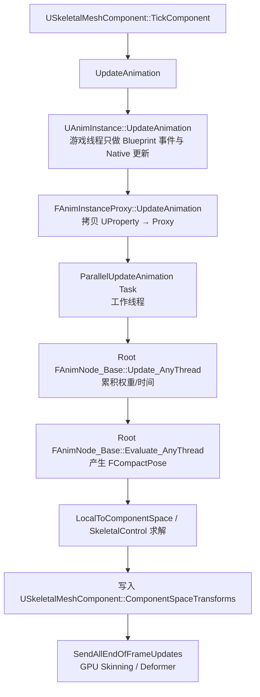
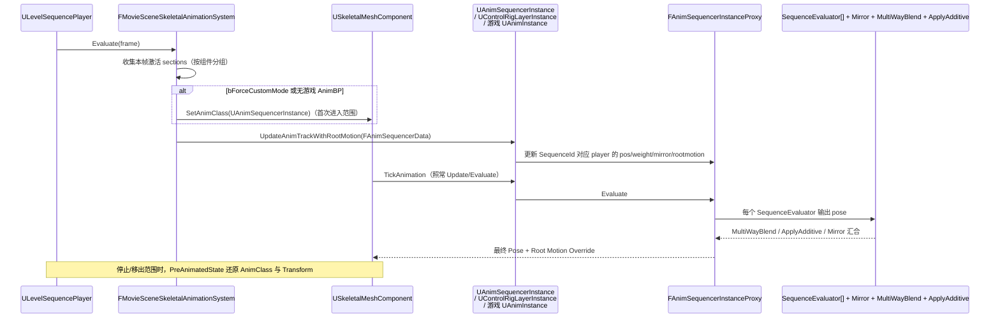
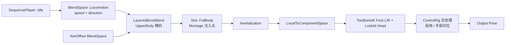

# Unreal Engine 5 动画系统深度解析

> 版本：UE 5.5.4  
> 覆盖：`Engine/Source/Runtime` 中的动画运行时 + `Engine/Plugins/Animation` 中的官方插件  
> 目标读者：需要理解动画数据流、AnimGraph 执行模型、IK/骨骼求解、姿态混合与匹配算法的技术人员

---

## 目录

- [Unreal Engine 5 动画系统深度解析](#unreal-engine-5-动画系统深度解析)
  - [目录](#目录)
  - [1. 基本概念与设计思想](#1-基本概念与设计思想)
    - [1.1 三条数据流](#11-三条数据流)
    - [1.2 分层设计](#12-分层设计)
    - [1.3 求值管线（一帧内的顺序）](#13-求值管线一帧内的顺序)
  - [2. 自底向上模块视图](#2-自底向上模块视图)
    - [2.1 `AnimationCore` — 数学与骨骼求解基础层](#21-animationcore--数学与骨骼求解基础层)
    - [2.2 `AnimationDataController` / `AnimData` — 源数据抽象层](#22-animationdatacontroller--animdata--源数据抽象层)
    - [2.3 `Engine.Animation` — 资产与运行时对象层](#23-engineanimation--资产与运行时对象层)
      - [2.3.1 静态资产（`UObject`）](#231-静态资产uobject)
      - [2.3.2 运行时实例](#232-运行时实例)
      - [2.3.3 节点基类](#233-节点基类)
    - [2.4 `AnimGraphRuntime` — 节点执行层](#24-animgraphruntime--节点执行层)
    - [2.5 `AnimationBlueprintLibrary` / `AnimationBlueprintEditor` — 蓝图编辑层](#25-animationblueprintlibrary--animationblueprinteditor--蓝图编辑层)
    - [2.6 插件生态（自底向上）](#26-插件生态自底向上)
      - [底层运行时插件](#底层运行时插件)
      - [骨骼控制/装配](#骨骼控制装配)
      - [高级姿态与匹配](#高级姿态与匹配)
      - [变形与高级 skinning](#变形与高级-skinning)
      - [数据采集/调试/工具](#数据采集调试工具)
    - [2.7 Sequencer 与动画系统的集成](#27-sequencer-与动画系统的集成)
      - [2.7.1 数据侧：Track / Section / Params](#271-数据侧track--section--params)
      - [2.7.2 绑定与求值系统](#272-绑定与求值系统)
      - [2.7.3 两种执行模式：Slot Blend vs Custom Mode](#273-两种执行模式slot-blend-vs-custom-mode)
      - [2.7.4 UAnimSequencerInstance 内部结构](#274-uanimsequencerinstance-内部结构)
      - [2.7.5 ControlRig 分层：UControlRigLayerInstance](#275-controlrig-分层ucontrolriglayerinstance)
      - [2.7.6 Root Motion 与 SwapRootBone](#276-root-motion-与-swaprootbone)
      - [2.7.7 PreAnimatedState 与状态还原](#277-preanimatedstate-与状态还原)
      - [2.7.8 一帧调用链](#278-一帧调用链)
  - [3. 技术原理与算法公式](#3-技术原理与算法公式)
    - [3.1 骨骼变换与空间约定](#31-骨骼变换与空间约定)
    - [3.2 姿态混合数学](#32-姿态混合数学)
    - [3.3 BlendSpace 权重求解](#33-blendspace-权重求解)
    - [3.4 Inertialization（惯性化）与 Dead Blending](#34-inertialization惯性化与-dead-blending)
    - [3.5 IK 求解器：TwoBoneIK / FABRIK / CCDIK / SplineIK](#35-ik-求解器twoboneik--fabrik--ccdik--splineik)
      - [3.5.1 TwoBoneIK（解析式）](#351-twoboneik解析式)
      - [3.5.2 FABRIK（Forward And Backward Reaching Inverse Kinematics, Aristidou 2011）](#352-fabrikforward-and-backward-reaching-inverse-kinematics-aristidou-2011)
      - [3.5.3 CCDIK（Cyclic Coordinate Descent）](#353-ccdikcyclic-coordinate-descent)
      - [3.5.4 SplineIK](#354-splineik)
    - [3.6 RBF 插值与 Pose Driver](#36-rbf-插值与-pose-driver)
    - [3.7 Motion Matching / Pose Search](#37-motion-matching--pose-search)
    - [3.8 Motion Warping 与 Root Motion](#38-motion-warping-与-root-motion)
    - [3.9 压缩与曲线压缩](#39-压缩与曲线压缩)
    - [3.10 并行更新与 FastPath](#310-并行更新与-fastpath)
  - [附录 A：一次典型 AnimGraph 求值（Third Person Locomotion）](#附录-a一次典型-animgraph-求值third-person-locomotion)
  - [附录 B：关键源码定位速查](#附录-b关键源码定位速查)
  - [附录 C：性能与优化清单](#附录-c性能与优化清单)

---

## 1. 基本概念与设计思想

### 1.1 三条数据流

UE 的动画系统由三条正交的数据流交织构成：

| 数据流 | 载体类型 | 含义 |
|---|---|---|
| Pose（姿态） | `FCompactPose` / `FCSPose` | 每根骨骼的 `FTransform`（T-R-S） |
| Curve（曲线） | `FBlendedCurve` / `FBlendedHeapCurve` | 命名 float，用于表情、状态标记、材质驱动 |
| Attribute（自定义属性） | `UE::Anim::FStackAttributeContainer` | 5.0+ 通用键值通道（骨骼级或 pose 级），任意类型 |

三者被封装为 `FAnimationPoseData`，作为节点间的统一传递载荷。

### 1.2 分层设计

```
UAnimInstance ── 承载 UAnimBlueprint 生成的 GeneratedClass ── UAnimBlueprintGeneratedClass
     │
     ├── FAnimInstanceProxy（游戏线程与工作线程之间的桥）
     │       │
     │       └── FAnimNode_Base 树（AnimGraph 节点，工作线程 Evaluate）
     │
     └── AnimNotify / Montage / Slot（游戏线程回调）
```

设计要点：

- **图 + 状态机 + 事件** 三位一体：AnimGraph 提供纯函数式姿态混合，`FAnimNode_StateMachine` 承载时间性/条件性切换，Notify/Montage 处理离散事件。
- **数据/行为分离**：`UAnimSequence` 只存原始数据（`IAnimationDataModel`），`FCompactPose` 只是求值时的临时结构，`FBoneContainer` 描述当前 LOD 下的骨骼集合。
- **工作线程无锁并行**：`FAnimInstanceProxy` 承担线程边界，所有 `FAnimNode_Base::Evaluate_AnyThread` 都可以在 Worker 上跑；游戏线程仅接触 `NativeUpdateAnimation` 与已经拷贝到 Proxy 的 UProperty。
- **LOD 感知**：`FBoneContainer` 中的 `FCompactPoseBoneIndex` 会随 LOD 收缩，Pose 数组长度=当前 LOD 骨骼数，避免高 LOD 骨骼被无谓求值。
- **可插拔求解**：IK 求解、压缩、姿态搜索、变形器（Deformer）全部通过接口/抽象基类接入，用户可自定义。

### 1.3 求值管线（一帧内的顺序）



Update 与 Evaluate 是两个**独立遍历**：Update 只处理时间推进与权重（廉价、每帧必做），Evaluate 只在 Pose 需要真正生成时执行（可跳过：不可见时的 Update Rate Optimization）。

---

## 2. 自底向上模块视图

### 2.1 `AnimationCore` — 数学与骨骼求解基础层

路径：`Engine/Source/Runtime/AnimationCore`  
定位：**不依赖 Engine 模块**的纯数学 / 拓扑 / IK 库，可被 ControlRig、AnimGraphRuntime、编辑器工具复用。

关键类型：

| 头文件 | 作用 |
|---|---|
| `BoneIndices.h` | `FCompactPoseBoneIndex`、`FSkeletonPoseBoneIndex`、`FMeshPoseBoneIndex` 三种强类型索引，避免混淆 |
| `BoneWeights.h` | 顶点蒙皮权重（8-bit / 16-bit 量化，归一化） |
| `CommonAnimTypes.h` | `EAxis`、`FAnimationAxis` 等基础枚举 |
| `EulerTransform.h` | 显式欧拉的变换（ControlRig 内部用来暴露给美术） |
| `NodeHierarchy.h` / `NodeChain.h` | 通用父子拓扑与链结构 |
| `Constraint.h` | 位置/旋转/父子约束基元 |
| `AngularLimit.h` | 关节角度限制 |
| `TwoBoneIK.h` | 解析式二骨 IK（膝/肘） |
| `FABRIK.h` | FABRIK 位置迭代求解 |
| `CCDIK.h` | Cyclic Coordinate Descent |
| `SplineIK.h` | 曲线拟合 IK（脊柱、尾巴） |
| `SoftIK.h` | 到达阈值前的软化（避免锁腿） |

### 2.2 `AnimationDataController` / `AnimData` — 源数据抽象层

路径：`Engine/Source/Developer/AnimationDataController`、`Engine/Source/Runtime/Engine/Classes/Animation/AnimData`

- `IAnimationDataModel` / `UAnimDataModel`：`UAnimSequence` 背后的真正数据仓库。存储 raw 轨道（每根骨骼独立的 `FRawAnimSequenceTrack`：`PosKeys/RotKeys/ScaleKeys`）、曲线、Attribute 轨道、Notify Track。
- `IAnimationDataController`：唯一允许修改 Model 的入口（事务化、发出 `EAnimDataModelNotifyType` 通知）。所有编辑器操作都走 Controller，保证撤销/重做与派生数据（DDC）失效正确。
- `FBoneAnimationTrack`：骨骼名 + 关键帧数组。
- `FRichCurve` / `FFloatCurve` / `FTransformCurve`：曲线的编辑态表示。

设计哲学：**source-of-truth 只有 Model，压缩数据是 derived**。运行时用的是压缩后的 `FCompressedAnimSequence`，Model 不进最终 cook。

### 2.3 `Engine.Animation` — 资产与运行时对象层

路径：`Engine/Source/Runtime/Engine/Classes/Animation`

#### 2.3.1 静态资产（`UObject`）

| 类 | 语义 |
|---|---|
| `USkeleton` | 骨骼集合的**规范**：BoneTree、SmartName（Curve/Notify 元数据）、`FReferenceSkeleton`。所有兼容此 Skeleton 的资产共享它。 |
| `USkeletalMesh` | 顶点、材质、蒙皮权重、`FReferenceSkeleton` 的 Mesh 侧副本、`USkeleton` 引用 |
| `UAnimSequenceBase` → `UAnimSequence` / `UAnimComposite` / `UAnimMontage` / `UAnimStreamable` | 时间线动画资产 |
| `UBlendSpace` / `UBlendSpace1D` / `UAimOffsetBlendSpace(1D)` | 参数驱动的样本混合 |
| `UPoseAsset` | 命名 pose 集合，用于面部/UMorph 驱动 |
| `UAnimBlueprint` → `UAnimBlueprintGeneratedClass` | 用户编写的图，编译为节点树 |
| `UBlendProfile` | 每骨骼混合权重曲线 |
| `UMirrorDataTable` | 骨骼与曲线的镜像映射表 |
| `UAnimBoneCompressionSettings` / `UAnimCurveCompressionSettings` | 压缩策略资产 |
| `UAnimNotify` / `UAnimNotifyState` | 事件基类 |

#### 2.3.2 运行时实例

- `UAnimInstance`：UObject 侧的动画实例（每个 `USkeletalMeshComponent` 一个）。用户在其子类里写 `NativeUpdateAnimation` / `BlueprintUpdateAnimation`。
- `FAnimInstanceProxy`：**关键抽象**。UObject 不能被工作线程访问，Proxy 是它的镜像。包含 `FBoneContainer`、`FAnimAssetTickContext`、Root Motion 累积、Curve 累积。
- `USkeletalMeshComponent`：宿主。持有 `AnimScriptInstance`（主图）、`PostProcessAnimInstance`（后处理图，绑定在 SkeletalMesh 上）、`SubInstances`（Linked Layer）。
- `UAnimSingleNodeInstance`：预览与 Sequencer 用的极简实例，直接播一个资产。

#### 2.3.3 节点基类

`FAnimNode_Base`（`AnimNodeBase.h`）暴露的核心接口：

```cpp
virtual void Initialize_AnyThread(const FAnimationInitializeContext&);
virtual void CacheBones_AnyThread(const FAnimationCacheBonesContext&);
virtual void Update_AnyThread(const FAnimationUpdateContext&);
virtual void Evaluate_AnyThread(FPoseContext&);          // 局部空间
virtual void EvaluateComponentSpace_AnyThread(FComponentSpacePoseContext&); // 组件空间
virtual void GatherDebugData(FNodeDebugData&);
```

- `FPoseContext` 携带 `FCompactPose` + `FBlendedCurve` + `FStackAttributeContainer`。
- `FComponentSpacePoseContext` 携带 `FCSPose<FCompactPose>`（组件空间视图，惰性求值）。
- 派生的公共基类：`FAnimNode_AssetPlayerBase`（时间性播放器）、`FAnimNode_SkeletalControlBase`（骨骼控制器，工作在 CSPose 下）。

### 2.4 `AnimGraphRuntime` — 节点执行层

路径：`Engine/Source/Runtime/AnimGraphRuntime`  
定位：**具体节点实现**。AnimGraph 编译器把用户蓝图节点转成这里的 `FAnimNode_*` 结构。

分类：

- **Asset Players**：`FAnimNode_SequencePlayer`、`FAnimNode_BlendSpacePlayer`、`FAnimNode_PoseHandler`、`FAnimNode_PoseByName`、`FAnimNode_PoseBlendNode`。
- **混合**：`FAnimNode_Blend`、`FAnimNode_BlendListBase`、`FAnimNode_BlendListByBool/Enum/Int`、`FAnimNode_LayeredBoneBlend`、`FAnimNode_ApplyAdditive`、`FAnimNode_ApplyMeshSpaceAdditive`、`FAnimNode_BlendSpaceEvaluator`。
- **Slot / Montage**：`FAnimNode_Slot`（Montage 唯一入口）。
- **状态机**：`FAnimNode_StateMachine`、`FAnimStateMachineTypes`（`FAnimNode_TransitionResult`、`FAnimNode_TransitionPoseEvaluator`）。
- **缓存**：`FAnimNode_SaveCachedPose` + `FAnimNode_UseCachedPose`（同一 pose 多次消费，防止重复求值）。
- **链接**：`FAnimNode_LinkedAnimGraph`（Sub Anim Instance）、`FAnimNode_LinkedAnimLayer`（可运行时替换的层）、`FAnimNode_LinkedInputPose`。
- **惯性化**：`FAnimNode_Inertialization`、`FAnimNode_DeadBlending`。
- **BoneControllers**（`SkeletalControlBase` 子类，工作在 CSPose）：
  - `FAnimNode_TwoBoneIK`（膝/肘 IK）
  - `FAnimNode_Fabrik`（多骨 IK）
  - `FAnimNode_SplineIK`（脊柱/尾巴）
  - `FAnimNode_SpringBone`（弹簧骨，头发/披风）
  - `FAnimNode_Trail`（拖尾骨）
  - `FAnimNode_RigidBody`（关节链物理，AnimDynamics 替代）
  - `FAnimNode_ScaleChainLength`、`FAnimNode_LookAt`、`FAnimNode_HandIKRetargeting`、`FAnimNode_CopyBone(Delta)`、`FAnimNode_ModifyBone`、`FAnimNode_ObserveBone`、`FAnimNode_ResetRoot`、`FAnimNode_RotationMultiplier`、`FAnimNode_TwistCorrectiveNode`。
- **蓝图函数库**：`SequencePlayerLibrary`、`BlendSpaceLibrary`、`SkeletalControlLibrary`、`LayeredBoneBlendLibrary`、`MirrorAnimLibrary`、`ModifyCurveLibrary`、`KismetAnimationLibrary`、`CommonAnimationLibrary`（含 `EaseFloat`、`SmoothDamp` 等）。
- **RBF**：`RBFSolver.h` / `RBFInterpolator.h`，被 Pose Driver、AnimNode_PoseDriver、RigLogic 使用。

### 2.5 `AnimationBlueprintLibrary` / `AnimationBlueprintEditor` — 蓝图编辑层

路径：`Engine/Source/Editor/AnimationBlueprintEditor`、`Engine/Source/Editor/AnimGraph`

- **AnimGraph**：`UAnimGraphNode_*` 是每个 `FAnimNode_*` 的 UEdGraphNode 包装，负责序列化、pin 生成、编译时 IR。
- **编译器**：`FAnimBlueprintCompilerContext`。把图节点线性化到 `FStructProperty` 数组（`UAnimBlueprintGeneratedClass::AnimNodeProperties`），生成 `FExposedValueHandler`（每帧把 UProperty 拷入节点结构），并识别 FastPath。
- **AnimationBlueprintLibrary**：给编辑器脚本（Python / EditorUtilityBlueprint）用的批处理接口（加曲线、Notify、Metadata、Retarget）。

### 2.6 插件生态（自底向上）

`Engine/Plugins/Animation` 下的插件按**依赖层级**排序如下：

#### 底层运行时插件

| 插件 | 定位 |
|---|---|
| `ACLPlugin` | Animation Compression Library（Nicholas Frechette）。作为 `UAnimBoneCompressionCodec` 与 `UAnimCurveCompressionCodec` 的高质量替代，位速率更低、解码更快。 |
| `RigLogic` | MetaHuman 面部驱动。DNA 文件→关节 + Morph + Map 的低级别 rig solver。 |
| `AnimationData` | 额外的 raw data 工具（`FVariableFrameStrippingSettings` 支持等）。 |

#### 骨骼控制/装配

| 插件 | 定位 |
|---|---|
| `ControlRig` | UE 内建的过程化 rig 系统。基于 `URigVM` 字节码 + `URigHierarchy` 拓扑。可作为 `FAnimNode_ControlRig` 嵌入 AnimGraph（后处理 IK、程序化动画）、也作为独立 rig 资产（`UControlRigBlueprint`）在 Sequencer 上做手 K 动画。 |
| `ControlRigModules` / `ControlRigSpline` | ControlRig 的可复用模块与样条数学。 |
| `IKRig` | 骨骼无关的 IK 求解框架。`UIKRigDefinition` 定义 goals、solvers（FBIK/PBIK/SetTransform/CCDIK/LimbIK）；`UIKRetargeter` 基于两套 IKRig 做 chain-based retarget。可作为 `FAnimNode_IKRig` 用。 |
| `AnimationWarping` | Foot Placement、Orientation Warping、Stride Warping 节点。用于**保持贴地感与朝向**同时不改变原始动画剪辑。 |
| `MotionWarping` | 通过 Root Motion 修正让攀爬/翻越/攻击命中精准落点。基于 `URootMotionModifier`（Warp、Skew、AdjustmentBlendWarp）。 |
| `AnimationLocomotionLibrary` | 常见 locomotion 工具节点（Predict Ground Movement 等）。 |

#### 高级姿态与匹配

| 插件 | 定位 |
|---|---|
| `PoseSearch` | Motion Matching 官方实现。核心：`UPoseSearchDatabase` + `UPoseSearchSchema` + `FPoseSearchIndex`（KD-Tree/暴力）+ `FAnimNode_MotionMatching`。 |
| `BlendStack` | 动态入栈动画剪辑的堆栈式混合器（`FAnimNode_BlendStack`）。是 Motion Matching 的默认下游混合器，也可单独用作 Snapshot 混合。 |
| `Chooser` | 数据驱动的条件表：给定输入上下文选择某个动画资产/pose 数据库，作为 Motion Matching 的资产选择前端。 |
| `AnimatorKit` | 面向动画师的实用节点合集（Look-at 变体、Curve 采样、Ease 等）。 |
| `BlendSpaceMotionAnalysis` | 从 BlendSpace 样本自动分析轴参数（速度、方向），减少手动配轴。 |
| `AnimationModifierLibrary` | `UAnimationModifier` 派生的批处理器（自动生成 Sync Markers、镜像、根骨提取）。 |

#### 变形与高级 skinning

| 插件 | 定位 |
|---|---|
| `DeformerGraph` | 基于计算着色器的可视化 `UMeshDeformer`。让美术在图里写 GPU 蒙皮/肌肉/布料替代方案；输出与 `USkeletalMeshComponent::MeshDeformer` 绑定。 |
| `MLDeformer` | 神经网络（NNE 后端）驱动的变形器：训练 hi-poly vs. lo-poly 差异，运行时用 NN 推理修正 skinning artifact。 |

#### 数据采集/调试/工具

| 插件 | 定位 |
|---|---|
| `LiveLink` / `LiveLinkHub` / `LiveLinkCurveDebugUI` | 外部实时数据（mocap、DCC、iPhone Face）流入 UE。`ULiveLinkInstance` 是 AnimInstance 的一种实现。 |
| `PerformanceCaptureCore` | 表演捕捉的会话/take 管理。 |
| `GameplayInsights` | 动画追踪（Rewind Debugger 的动画通道），可回放每帧 AnimGraph 的节点激活权重。 |
| `PoseSearch`（Editor 部分） | Motion Matching Debug/编辑。 |

---

### 2.7 Sequencer 与动画系统的集成

Sequencer 不"替换"动画系统——它把自己接到**同一个 `USkeletalMeshComponent`** 上，通过一套专用接口 `ISequencerAnimationSupport` 把时间轴上的片段注入到动画求值管线里。相关代码分布在 `Engine/Source/Runtime/MovieSceneTracks/`、`Engine/Source/Runtime/AnimGraphRuntime/` 与 `Engine/Plugins/Animation/ControlRig/` 三处。

#### 2.7.1 数据侧：Track / Section / Params

`ULevelSequence`（`UMovieSceneSequence` 子类）里挂着 `UMovieSceneSkeletalAnimationTrack`，每个剪辑是一个 `UMovieSceneSkeletalAnimationSection`。核心字段（`FMovieSceneSkeletalAnimationParams`）：

| 字段 | 作用 |
|---|---|
| `Animation` (`UAnimSequenceBase`) | 要播放的资产（Sequence / Composite / Streamable） |
| `Weight` (`FMovieSceneFloatChannel`) | 每帧的混合权重曲线 |
| `PlayRate` (`FMovieSceneTimeWarpVariant`) | 速率 / TimeWarp 曲线 |
| `SlotName` | 将剪辑注入到目标 AnimBP 里同名 `FAnimNode_Slot` |
| `bForceCustomMode` | 强制夺权：把 SkeletalMeshComponent 的 AnimClass 换成 `UAnimSequencerInstance` |
| `bSkipAnimNotifiers` | 播放时是否派发 AnimNotify |
| `SwapRootBone` | `SwapRootBone_Component` / `_Actor` / `_None`：根骨位移交给谁 |
| `MirrorDataTable` | 镜像映射（左右手动作复用） |
| `FirstLoopStartFrameOffset` / `Start/EndFrameOffset` | 剪辑内偏移与首圈偏移 |

`MapTimeToAnimation` 负责把 Section 帧 → 动画内部时间，处理循环、offset、reverse、TimeWarp。

#### 2.7.2 绑定与求值系统

- Sequencer Binding（Possessable / Spawnable）解析到 `AActor`，播放器（`ULevelSequencePlayer`）遍历其上的 `USkeletalMeshComponent`。
- `FMovieSceneSkeletalAnimationSystem`（ECS 化的 `UMovieSceneEntitySystem` 子系统，`Runtime/MovieSceneTracks/Public/Systems/`）在每个 Evaluation Phase 收集该组件上激活的所有 Section，形成 "component → active sections" 表。
- 每帧对每个组件调用 `ISequencerAnimationSupport::UpdateAnimTrackWithRootMotion(FAnimSequencerData)`，一次性把 `SequenceId / FromPosition / ToPosition / Weight / RootMotionOverride / SwapRootBone / MirrorDataTable` 全部下发。
- 用 `FromPosition → ToPosition` 而非 `DeltaTime` 是因为 Sequencer 会 scrub、跳转、反向，底层必须支持任意时刻求值——这也是为什么 Proxy 里用 `FAnimNode_SequenceEvaluator_Standalone` 而非 `SequencePlayer`。

#### 2.7.3 两种执行模式：Slot Blend vs Custom Mode

Sequencer 根据 Section 与目标组件的现状选择一种模式：

**模式 A：Slot Blend（非侵入，推荐）**

当组件已有游戏用 `UAnimInstance` 且 `bForceCustomMode = false`：

- Sequencer 通过 Montage 动态注入机制（等价于 `PlaySlotAnimationAsDynamicMontage`）向匹配 `SlotName` 的 `FAnimNode_Slot` 注入姿态与权重。
- 权重来自 Section 的 `Weight` 通道。
- 结果：Sequencer 剪辑走**游戏的 AnimGraph** 与 Slot 混合——locomotion / IK / 后处理照常生效。适合 gameplay 与动画协同的镜头（如角色边跑边被 Sequencer 控制播放对话动作）。

**模式 B：Custom Mode / Full Override（侵入，精确）**

当 `bForceCustomMode = true` 或组件没有游戏 AnimBP：

- 通过 `USkeletalMeshComponent::SetAnimClass(UAnimSequencerInstance::StaticClass())` 把 AnimClass 换成 `UAnimSequencerInstance`——一个**为 Sequencer 专用的极简 AnimInstance**，实现 `ISequencerAnimationSupport`。
- 序列停止时 `PreAnimatedState` 系统还原原 AnimClass 与 Pose，回到游戏 AnimBP。
- 适合过场动画（cinematic）：绝对精准、无游戏逻辑污染。

#### 2.7.4 UAnimSequencerInstance 内部结构

`FAnimSequencerInstanceProxy`（`Runtime/AnimGraphRuntime/Public/AnimSequencerInstanceProxy.h`）内部动态维护一张 `SequenceId → FSequencerPlayerBase*` 表，节点拓扑大致为：

```
FSequencerPlayerAnimSequence[i] ──┐
  (FAnimNode_SequenceEvaluator_   │
     Standalone + Mirror)         ├── FAnimNode_MultiWayBlend ──┐
                                  │                              │
                                ...┘                              ├── FAnimNode_ApplyAdditive ── Output
                                                                  │
FSequencerPlayerAnimSequence[j]  (additive) ─── FAnimNode_ApplyAdditive 支路
```

- 每个 Track/Section 分配一个稳定 `SequenceId`，避免每帧重建节点，只更新对应播放器的 `(pos, weight, mirror)`。
- `FAnimNode_MultiWayBlend` 对多个 base 剪辑做权重归一化。
- Additive 剪辑单独走 `FAnimNode_ApplyAdditive` 支路，不参与归一化。
- `FAnimNode_Mirror` 按 `MirrorDataTable` 做骨骼与曲线镜像。
- `FAnimNode_PoseSnapshot` 用于 `SavePose()` / `RestorePose()`（如 Take Recorder 场景）。

#### 2.7.5 ControlRig 分层：UControlRigLayerInstance

当同一组件上还有 `UMovieSceneControlRigParameterTrack` 时，Sequencer 切到 `UControlRigLayerInstance`（`Plugins/Animation/ControlRig/Source/ControlRig/Public/Sequencer/`），它同样实现 `ISequencerAnimationSupport`，且 `DoesSupportDifferentSourceAnimInstance() = true`：

1. `SetSourceAnimInstance(...)` 保留一个"源 AnimInstance"（游戏 AnimBP 或 `UAnimSequencerInstance`）作为**底层 Pose**。
2. `AddControlRigTrack(ControlRigID, UControlRig*)` 按 ID 管理 ControlRig 栈；`UpdateControlRigTrack(ID, Weight, FControlRigIOSettings, bExecute)` 每帧更新。
3. AnimGraph 里对应节点是 `FAnimNode_ControlRigBase`，每层 ControlRig 按 Sequencer 给的 `Weight` 叠加到源 Pose 之上。

这就是"给一段跑步动画上叠加手臂 ControlRig 手 K 曲线"的技术基础——底层动画 + 逐层 rig 覆盖。

#### 2.7.6 Root Motion 与 SwapRootBone

`FRootMotionOverride`（`bBlendFirstChildOfRoot` / `ChildBoneIndex` / `RootMotion` / `PreviousTransform`）在骨骼层直接覆盖 root，配合 `ESwapRootBone`：

| 枚举 | 行为 | 典型用途 |
|---|---|---|
| `SwapRootBone_Component` | 把根骨位移搬到 `SkeletalMeshComponent` 相对变换 | 让组件真的移动，同时骨骼原点归零 |
| `SwapRootBone_Actor` | 搬到 Actor Root，让 Sequencer 的 Transform 轨道能进一步操作 | 过场里的角色路径编辑 |
| `SwapRootBone_None` | 保留在骨骼内 | 纯姿态动画，位移由外部驱动 |

`bBlendFirstChildOfRoot` 用于**根骨是虚拟骨、真正的运动挂在其第一个子骨**上的资产。

#### 2.7.7 PreAnimatedState 与状态还原

Sequencer 通过 `IMovieScenePreAnimatedState` 快照下列内容，播放范围移出或停止时逐个还原：

- `USkeletalMeshComponent::AnimClass` / `AnimationMode`（模式 B 切走了 AnimClass 时必须还原）
- `USkeletalMeshComponent::RelativeTransform`（`SwapRootBone_Component` 修改过）
- `AActor::RootComponent` Transform（`SwapRootBone_Actor` 修改过）
- 初始 Pose 快照（scrub 或跳出范围时的一致性）

这保证 **编辑器 scrub 不改坏 PIE/关卡状态**——这是 Sequencer 与所有 runtime 系统交互的通用契约。

#### 2.7.8 一帧调用链



小结：

> Sequencer 通过 `ISequencerAnimationSupport` 接入组件——默认走 **Slot 混合到游戏 AnimBP**；`bForceCustomMode` 时**换 AnimClass 到 `UAnimSequencerInstance`** 独占播放；接 ControlRig 时再套一层 **`UControlRigLayerInstance`** 做栈式覆盖。核心是把"轨道时间 + 权重曲线"翻译成每帧对 `SequenceEvaluator` 节点的 `(FromPos, ToPos, Weight)` 三元组更新。

---

## 3. 技术原理与算法公式

### 3.1 骨骼变换与空间约定

三种空间：

- **Local (Bone / Parent) Space**：`Bone_i` 相对 `Parent(i)` 的 `FTransform`，动画剪辑存储的形式。
- **Component Space**：所有骨骼相对 SkeletalMeshComponent 根的 `FTransform`。IK/LookAt/Physics 通常在此空间。
- **World Space**：Component Space × Component 的世界变换。

关系（左乘约定，UE 用行向量 `v' = v · M`，但对外接口按数学右乘书写更清晰）：

$$
T^{\text{cs}}_i = T^{\text{cs}}_{\text{parent}(i)} \cdot T^{\text{ls}}_i, \qquad
T^{\text{ls}}_i = (T^{\text{cs}}_{\text{parent}(i)})^{-1} \cdot T^{\text{cs}}_i
$$

`FCSPose` 惰性求值：只在被访问的骨骼上做累积乘法并缓存。

### 3.2 姿态混合数学

单骨骼 `FTransform` = (T, R, S)，权重 $\alpha \in [0,1]$ 的两姿态混合：

- 平移：$T = (1-\alpha) T_A + \alpha T_B$
- 缩放：$S = (1-\alpha) S_A + \alpha S_B$
- 旋转（四元数最短路 slerp / nlerp）：

$$
R = \operatorname{Slerp}(R_A, R_B, \alpha),\quad \text{若 } R_A \cdot R_B < 0 \text{ 则 } R_B \leftarrow -R_B
$$

UE 默认在 `FQuat::FastLerp` 使用 nlerp + 归一化以获得 SIMD 吞吐；对高角度差可回退到 slerp。

**Additive Blend**（两种模式）：

- **LocalSpace Additive**：附加姿态存差分 $\Delta R$（相对参考姿态）。应用：

$$
R'_i = R^{\text{base}}_i \cdot \operatorname{Slerp}(\mathbf{1}, \Delta R_i, \alpha)
$$

- **MeshSpace Additive**（旋转追踪世界方向，如瞄准偏移）：转到 CS 应用差分，再回 LS。见 `FAnimNode_ApplyMeshSpaceAdditive`。

**BlendProfile**：每根骨骼一个 $\alpha_i$，用于让上/下身以不同速度过渡（`UBlendProfile::GetBoneBlendScale`）。

**Layered Bone Blend**：给出骨骼掩码 `FBoneMask`，只对掩码内骨骼混合到 B，掩码外保留 A。

### 3.3 BlendSpace 权重求解

`UBlendSpace` 把样本布置在 1D/2D 参数空间（如 speed×direction）。求值时给定坐标 $\mathbf{p}$，需要输出若干样本 $\{s_i\}$ 及其权重 $\{w_i\}$，$\sum w_i = 1$。

- **1D**：找到区间 $[s_k, s_{k+1}]$，线性插值 $w_k = 1-t$，$w_{k+1}=t$。
- **2D**：将样本三角化（Delaunay），对 $\mathbf{p}$ 所在三角形使用重心坐标：

$$
\mathbf{p} = w_1 \mathbf{v}_1 + w_2 \mathbf{v}_2 + w_3 \mathbf{v}_3,\quad w_1+w_2+w_3=1
$$

- **同步**：多个样本按各自 `Length` 归一化到 [0,1)，或按 Sync Marker 名称对齐。Leader 由最高权重样本选出，其他 Follower 播放位置由 leader 的归一化时间反查。

### 3.4 Inertialization（惯性化）与 Dead Blending

**背景**：Bollo 2018（Gears of War 4）提出的“无源过渡”方法——不需要保留 A 剪辑继续播放，仅需捕获**过渡瞬间的 pose 差与差的导数**，再按解析曲线衰减。

**捕获**（切换发生前 1 帧到当前帧）：对每根骨骼，取上一帧 $q_{-1}$、当前帧 $q_{0}$：

- 差分 $\Delta q = q_0 \cdot q_{\text{new}}^{-1}$（应用在**新动画**之上把它拉回 $q_0$）
- 差分转 axis-angle：$\Delta q \Rightarrow (\hat{n}, \theta_0)$
- 角速度 $\dot{\theta}_0 = (\theta_0 - \theta_{-1})/dt$（$\theta_{-1}$ 由前一帧差分同样方式取得）

**衰减**：在过渡时长 $t_1$ 内求 $\theta(t)$，使 $\theta(0)=\theta_0$、$\dot\theta(0)=\dot\theta_0$、$\theta(t_1)=0$、$\dot\theta(t_1)=0$，且尽量单调。UE 采用五次多项式（保证位置/速度/加速度三阶端点条件近似）：

$$
\theta(t) = a_5 t^5 + a_4 t^4 + a_3 t^3 + a_2 t^2 + \dot\theta_0 t + \theta_0
$$

对平移与缩放差量执行等价流程（向量分量各自五次多项式）。每帧对新剪辑姿态叠加 $\Delta q(t)$ 恢复出连续过渡。

代码：`Engine/Source/Runtime/Engine/Private/Animation/AnimNode_Inertialization.cpp`（关键：`FInertializationPoseDiff::InitFrom`、`ApplyTo`）。

**Dead Blending**（`FAnimNode_DeadBlending`，Daniel Holden 提出的替代方案）：

对**源动画**做外推：以过渡瞬间速度 $\dot q_0$ 前向推进，速度按指数半衰期 $\tau$ 衰减：

$$
\dot\theta(t) = \dot\theta_0 \cdot 2^{-t/\tau}
$$

再用普通 cross-fade 把外推源与目标混合。$\tau$ 自适应：当源速度方向与目标 pose 差方向一致且大小合理时用较大 $\tau$（更平滑），反之用较小 $\tau$（防止畸形）。参数 `ExtrapolationHalfLife`、`ExtrapolationHalfLifeMin/Max` 控制该范围。

### 3.5 IK 求解器：TwoBoneIK / FABRIK / CCDIK / SplineIK

#### 3.5.1 TwoBoneIK（解析式）

链：Root → Joint → End，目标 Effector $E$，Pole/JointTarget $P$。

- 令 $L_1 = |J - R|$，$L_2 = |E_{\text{orig}} - J|$，$L = |E - R|$（钳位到 $L_1 + L_2$，可选拉伸）。
- 由余弦定理求肘部“凸起”高度：

$$
\cos\alpha = \frac{L_1^2 + L^2 - L_2^2}{2 L_1 L}, \quad
h = L_1 \sin\alpha,\quad d = L_1 \cos\alpha
$$

- 沿 $\hat u = (E-R)/L$ 走 $d$，得到肘投影点 $J_{\text{proj}} = R + d\hat u$。
- 在垂直于 $\hat u$、朝向 $P$ 的方向上偏移 $h$：

$$
\hat v = \operatorname{normalize}\bigl((P - R) - ((P-R)\cdot\hat u)\hat u\bigr),\quad J' = J_{\text{proj}} + h\hat v
$$

- 输出 $J' , E$。旋转由“旋转差”从 $\overrightarrow{RJ}\to\overrightarrow{RJ'}$、$\overrightarrow{JE}\to\overrightarrow{J'E}$ 计算并应用回骨骼变换。

**拉伸**：当 $L > (L_1+L_2) \cdot \text{StartStretchRatio}$，等比放大 $L_1, L_2$，最大到 `MaxStretchScale`。

#### 3.5.2 FABRIK（Forward And Backward Reaching Inverse Kinematics, Aristidou 2011）

链：$P_0$（Root，固定）→ $P_1 \to \dots \to P_n$（End）。段长 $d_i = |P_i - P_{i-1}|$。

**可达性检查**：若 $|T - P_0| > \sum d_i$，把整条链拉直朝向 $T$。

**迭代**（每轮两趟）：

1. **Backward reach**（从末端到根）：$P_n \leftarrow T$；for $i = n-1 \dots 0$：

$$
r_i = |P_{i+1} - P_i|,\ \lambda_i = d_{i+1}/r_i,\ P_i \leftarrow (1-\lambda_i) P_{i+1} + \lambda_i P_i
$$

2. **Forward reach**（从根到末端）：$P_0 \leftarrow P_0^{\text{orig}}$；for $i = 1 \dots n$：

$$
r_i = |P_i - P_{i-1}|,\ \lambda_i = d_i/r_i,\ P_i \leftarrow (1-\lambda_i) P_{i-1} + \lambda_i P_i
$$

直至 $|P_n - T| < \varepsilon$ 或达到 `MaxIteration`。

优点：$O(n)$ 每次迭代，收敛快，无奇异；缺点：位置求解后需二次推导旋转（UE 从每段方向变化 delta rotation 传递到骨骼四元数）。

#### 3.5.3 CCDIK（Cyclic Coordinate Descent）

从末端向根迭代，每根骨骼旋转，使 EE 朝目标：

$$
\theta_i = \arccos\bigl(\hat u_i \cdot \hat v_i\bigr),\ \hat n_i = \hat u_i \times \hat v_i
$$

其中 $\hat u_i = \operatorname{normalize}(EE - P_i)$，$\hat v_i = \operatorname{normalize}(T - P_i)$。将骨骼 $i$ 绕 $\hat n_i$ 旋转 $\theta_i$，更新下游位置，进入下一根。UE 支持角度限幅（`AngleDelta`）和轴锁。

#### 3.5.4 SplineIK

在链的骨骼位置上拟合 Catmull-Rom / Cubic Hermite 样条。给出目标点数组 $\{Q_j\}$（或单一末端 + 切线），沿弧长参数 $s\in[0, L]$ 均匀采样与原始骨长匹配的点作为新的骨位置；旋转由样条切线 + 上向量（Twist 沿链插值）构造：

$$
\hat t(s) = \frac{d\mathbf{C}(s)}{ds}\Big/\left\|\cdot\right\|,\quad
R_i = \operatorname{QuatFromAxes}(\hat t, \hat u_i, \hat t \times \hat u_i)
$$

### 3.6 RBF 插值与 Pose Driver

`FRBFSolver`（`AnimGraphRuntime/Public/RBF/`）用于**从若干驱动骨骼姿态到若干目标 pose 权重的映射**（如 Pose Driver 节点、RigLogic 表情、UE PoseAsset）。

给定 $N$ 个训练样本，每个样本是驱动量 $\mathbf{x}_k \in \mathbb{R}^d$（通常 $d=3$ 或 $d=4$ 的四元数分量）与目标标量/向量 $\mathbf{y}_k$。构造：

$$
\mathbf{y}(\mathbf{x}) = \sum_{k=1}^N w_k \, \phi(\|\mathbf{x} - \mathbf{x}_k\|)
$$

核函数选项（`ERBFKernelType`）：Gaussian $\phi(r) = e^{-(r/\sigma)^2}$、Exponential $\phi(r)=e^{-r/\sigma}$、Multi-Quadric、Linear。

$\{w_k\}$ 由训练时求解线性系统 $\Phi \mathbf{w} = \mathbf{y}$，其中 $\Phi_{ij} = \phi(\|\mathbf{x}_i - \mathbf{x}_j\|)$。运行时是一次矩阵-向量乘 $O(Nd)$。

在四元数上的“距离”按 `ERBFDistanceMethod` 可选：Euclidean（把四元数当 4D 向量）、Quaternion（$2\arccos|q_1\cdot q_2|$）、SwingAngle、TwistAngle。

### 3.7 Motion Matching / Pose Search

插件 `PoseSearch` 的核心思想：把动画数据库转成**特征向量**索引，运行时**每 N 帧**查询与“未来轨迹 + 当前姿态”最匹配的帧并跳转过去。

**特征向量** $\mathbf{f}$（由 `UPoseSearchSchema` 定义 channels 决定）通常包含：

- 当前姿态：若干关键骨骼（脚、手）的位置/速度（组件空间或轨迹空间）
- 未来轨迹：若干 look-ahead 时间点（0.2s / 0.4s / 0.6s / 1.0s）的位置 & facing direction

**距离**：加权 L2

$$
D(\mathbf{f}_{\text{query}}, \mathbf{f}_k) = \sum_c w_c \,\|\mathbf{f}_{\text{query},c} - \mathbf{f}_{k,c}\|^2 + \text{MirrorCost} + \text{ContinuationBias}
$$

- $w_c$ 由 Schema 的每个 channel 权重给出
- **Continuation Bias**：优先当前动画继续播放（避免每帧跳），实现为对当前正在播放的候选加权惩罚为负
- **Mirror Cost**：镜像样本要付一点代价，避免不必要的 flip

**索引**：`FPoseSearchIndex` 使用 PCA 降维 + KD-Tree（`nanoflann`）加速最近邻；小库直接暴力。

**跳转与混合**：命中新帧后不是硬切，而是通过 `FAnimNode_BlendStack` 把新剪辑推到栈顶，与栈中前一段做惯性化过渡；栈超过深度阈值时最老的剪辑被丢弃。

**采样节流**：`SearchThrottleTime` 控制查询频率（如 0.1s 一次），未查询帧就照当前剪辑推进时间。

### 3.8 Motion Warping 与 Root Motion

**Root Motion** 基础：`UAnimSequence` 的第 0 号骨骼位移被提取为 `FRootMotionMovementParams`（增量 `FTransform`），交给 `UCharacterMovementComponent` 用作角色实际位移，从而“动画驱动移动”。

**Motion Warping**（插件 `MotionWarping`）：在保留动画节奏的前提下，把 root motion 的 XY/朝向**扭曲**到指定 target（例：动画原本翻越 100cm 墙，玩家面前是 130cm）。

- `URootMotionModifier_Warp`：在指定 `Notify State` 时间窗内，读取 `WarpTarget` 的位置/朝向，在每帧对提取到的 root delta 作线性缩放：

$$
\Delta P'_{xy} = \Delta P_{xy} \cdot \frac{\text{TargetDelta}_{xy}}{\text{OriginalDelta}_{xy}},\quad
\Delta \theta' = \Delta \theta \cdot \frac{\text{TargetYaw}}{\text{OriginalYaw}}
$$

- `URootMotionModifier_SkewWarp`：额外对垂直分量做斜切，避免大幅缩放 XY 时 Z 落差感失真。
- `URootMotionModifier_AdjustmentBlendWarp`：不改 root motion，而是对**全身姿态**做小幅偏移（IK 后处理），适合微量对位。

**AnimationWarping** 插件的 `Orientation / Stride / Foot Placement Warping`：不是修改 root motion，而是**在 AnimGraph 内**根据当前角色速度/朝向修改姿态骨骼旋转与脚 IK，让原地循环 locomotion 适配不同速度/曲线转身。

### 3.9 压缩与曲线压缩

**骨骼压缩** `UAnimBoneCompressionCodec`：

- 内建：`AnimCompress_BitwiseCompressOnly`（每分量量化）、`RemoveTrivialKeys`（删除近似恒定轨道）、`RemoveLinearKeys`（对线性区间只留端点）、`RemoveEverySecondKey`、`PerTrackCompression`（对每轨道选最佳位速率）。UE 会在 `UAnimBoneCompressionSettings` 里配置多个候选，编译期选**误差 ≤ 阈值下体积最小**的组合（“LeastDestructive”策略）。
- 误差度量：对若干采样骨骼末端点的**世界位置**误差（考虑子骨骼杠杆效应）。
- 位速率取自 `AnimationCompressionFormat`（`ACF_Float96NoW`、`ACF_Fixed48NoW`、`ACF_IntervalFixed32NoW` 等）。四元数存 3 分量并从 $q_w = \sqrt{1 - q_x^2-q_y^2-q_z^2}$ 恢复（要求 $q_w \ge 0$）。
- **ACLPlugin**：用变长块（segment）+ 变量子流的高级压缩，通常在等价误差下比 UE 内建小 40–60%。

**曲线压缩** `UAnimCurveCompressionCodec`：`UniformlySampled`（等间隔量化）、`UniformIndexable`（O(1) 查询）、`CompressedRichCurve`（保关键点+切线）。

**采样求值**（默认 `LinearKeyLerp`）：给出 $\tau \in [0, \text{Length}]$，找到相邻帧 $k, k+1$，$\alpha = \tau/\Delta T - k$，做逐分量 lerp + 四元数 nlerp。

### 3.10 并行更新与 FastPath

`bRunUpdatesInWorkerThreads` + `UAnimBlueprintGeneratedClass` 编译期的 FastPath 使 AnimGraph 高效：

- **UProperty → AnimNode 拷贝**：`FExposedValueHandler` 描述每个 pin 的赋值方式。若右值是纯 UProperty 读取（无 BP 表达式），标记为 `bServicesNodeProperties` = FastPath，跳过 BP 虚拟机，直接 `FMemory::Memcpy`。编辑器 AnimGraph 节点显示闪电图标表示已进入 FastPath。
- **游戏线程屏障**：`UAnimInstance::PreUpdateAnimation` 拷贝 mutable 状态到 Proxy 后，工作线程独占 Proxy，直到 `PostUpdateAnimation`。用户在 `NativeThreadSafeUpdateAnimation` 里可以直接在工作线程读写 Proxy 的属性，是官方推荐路径。
- **Task graph**：每个可见 SkeletalMeshComponent 提交一个 `FParallelAnimationEvaluationTask`；SendAllEndOfFrameUpdates 在 render thread 之前汇合。
- **URO（Update Rate Optimization）**：`FAnimUpdateRateParameters` 根据可见性/距离动态降低 UpdateRate（跳帧 Update）和 EvaluationRate（跳帧 Evaluate，用插值补齐）。跳过 Evaluate 时用最近两次结果对 `ComponentSpaceTransforms` 做 lerp/slerp。

---

## 附录 A：一次典型 AnimGraph 求值（Third Person Locomotion）



- 状态机嵌在 BlendSpace 上游用于 Idle↔Move↔Jump 切换；每次状态切换都 `RequestInertialization(0.2s)`，Inertialization 节点消费该请求。
- Slot 让 Montage（攻击、被击）可以覆盖上半身。
- ControlRig 作为 `FAnimNode_ControlRig` 放在末端做 IK 二次修正与武器对位。

## 附录 B：关键源码定位速查

| 主题 | 关键文件 |
|---|---|
| 节点基类 | [Runtime/Engine/Classes/Animation/AnimNodeBase.h](Source/Runtime/Engine/Classes/Animation/AnimNodeBase.h) |
| Proxy | [Runtime/Engine/Public/Animation/AnimInstanceProxy.h](Source/Runtime/Engine/Public/Animation/AnimInstanceProxy.h) |
| 状态机 | [Runtime/Engine/Private/Animation/AnimNode_StateMachine.cpp](Source/Runtime/Engine/Private/Animation/AnimNode_StateMachine.cpp) |
| 惯性化 | [Runtime/Engine/Private/Animation/AnimNode_Inertialization.cpp](Source/Runtime/Engine/Private/Animation/AnimNode_Inertialization.cpp) |
| Dead Blending | [Runtime/Engine/Private/Animation/AnimNode_DeadBlending.cpp](Source/Runtime/Engine/Private/Animation/AnimNode_DeadBlending.cpp) |
| FABRIK | [Runtime/AnimationCore/Private/FABRIK.cpp](Source/Runtime/AnimationCore/Private/FABRIK.cpp) |
| TwoBoneIK | [Runtime/AnimationCore/Private/TwoBoneIK.cpp](Source/Runtime/AnimationCore/Private/TwoBoneIK.cpp) |
| RBF | [Runtime/AnimGraphRuntime/Public/RBF/RBFSolver.h](Source/Runtime/AnimGraphRuntime/Public/RBF/RBFSolver.h) |
| BlendSpace | [Runtime/Engine/Private/Animation/BlendSpace.cpp](Source/Runtime/Engine/Private/Animation/BlendSpace.cpp) |
| Anim Compression 入口 | [Runtime/Engine/Private/Animation/AnimCompress.cpp](Source/Runtime/Engine/Private/Animation/AnimCompress.cpp) |
| PoseSearch | [Plugins/Animation/PoseSearch/Source/Runtime/Public/PoseSearch/PoseSearchLibrary.h](Plugins/Animation/PoseSearch/Source/Runtime/Public/PoseSearch/PoseSearchLibrary.h) |
| MotionWarping | [Plugins/Animation/MotionWarping/Source/Public/MotionWarpingComponent.h](Plugins/Animation/MotionWarping/Source/Public/MotionWarpingComponent.h) |
| ControlRig VM | [Plugins/Animation/ControlRig/Source/ControlRig/Public/RigVMCore/RigVM.h](Plugins/Animation/ControlRig/Source/ControlRig/Public/RigVMCore/RigVM.h) |
| IKRig / Retargeter | [Plugins/Animation/IKRig/Source/IKRig/Public/Rig/IKRigDefinition.h](Plugins/Animation/IKRig/Source/IKRig/Public/Rig/IKRigDefinition.h) |
| Sequencer 接口 | [Runtime/AnimGraphRuntime/Public/SequencerAnimationSupport.h](Source/Runtime/AnimGraphRuntime/Public/SequencerAnimationSupport.h) |
| Sequencer AnimInstance | [Runtime/AnimGraphRuntime/Public/AnimSequencerInstance.h](Source/Runtime/AnimGraphRuntime/Public/AnimSequencerInstance.h) |
| Sequencer Proxy | [Runtime/AnimGraphRuntime/Public/AnimSequencerInstanceProxy.h](Source/Runtime/AnimGraphRuntime/Public/AnimSequencerInstanceProxy.h) |
| Skeletal Animation Section | [Runtime/MovieSceneTracks/Public/Sections/MovieSceneSkeletalAnimationSection.h](Source/Runtime/MovieSceneTracks/Public/Sections/MovieSceneSkeletalAnimationSection.h) |
| Skeletal Animation Track | [Runtime/MovieSceneTracks/Public/Tracks/MovieSceneSkeletalAnimationTrack.h](Source/Runtime/MovieSceneTracks/Public/Tracks/MovieSceneSkeletalAnimationTrack.h) |
| Skeletal Animation 求值系统 | [Runtime/MovieSceneTracks/Public/Systems/MovieSceneSkeletalAnimationSystem.h](Source/Runtime/MovieSceneTracks/Public/Systems/MovieSceneSkeletalAnimationSystem.h) |
| ControlRig 分层 | [Plugins/Animation/ControlRig/Source/ControlRig/Public/Sequencer/ControlRigLayerInstance.h](Plugins/Animation/ControlRig/Source/ControlRig/Public/Sequencer/ControlRigLayerInstance.h) |

## 附录 C：性能与优化清单

1. 打开 AnimGraph 中每个数值 pin 的 FastPath（避免在 pin 上写函数/BP 表达式）。
2. 让 `Update` 尽量在 `NativeThreadSafeUpdateAnimation` 里做，避免游戏线程主 UpdateAnimation 反射性 hitch。
3. 用 `Update Rate Optimization`：不可见/远处角色降 UpdateRate。
4. 长链 IK 优先 `FABRIK`（$O(n)$）而非 `CCDIK`（$O(n\cdot k)$）。
5. 状态切换统一走 Inertialization/Dead Blending，比 crossfade 便宜，且不需要保留 A 剪辑。
6. Motion Matching 时开启 PCA + KD-Tree；调低 `SearchThrottleTime`；用 `Continuation Bias` 抑制颤跳。
7. 用 ACL 替换默认压缩（引擎设置里全局切换 codec）。
8. SkeletalMeshComponent 上开 `bEnableUpdateRateOptimizations` + `VisibilityBasedAnimTickOption = OnlyTickPoseWhenRendered`。
9. 大量同源角色考虑 `USkinnedMeshComponent::AddSlavePoseComponent`（Leader-Follower Pose），只求解一次。
10. 复杂面部/肌肉考虑 `DeformerGraph` 或 `MLDeformer` 卸载到 GPU。
