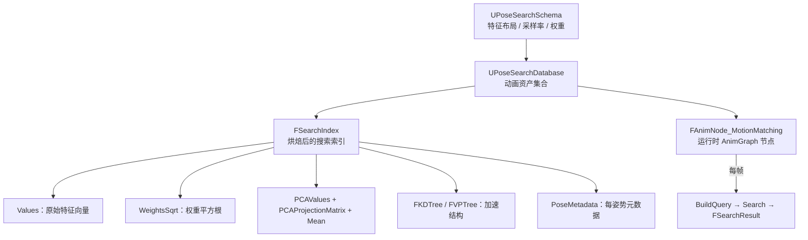
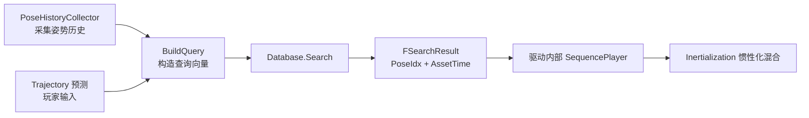
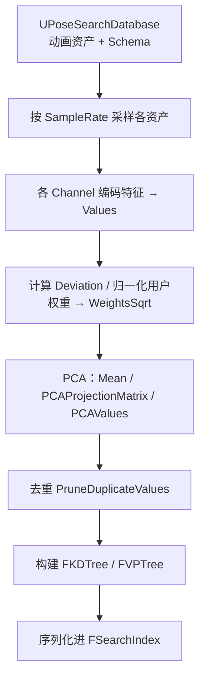
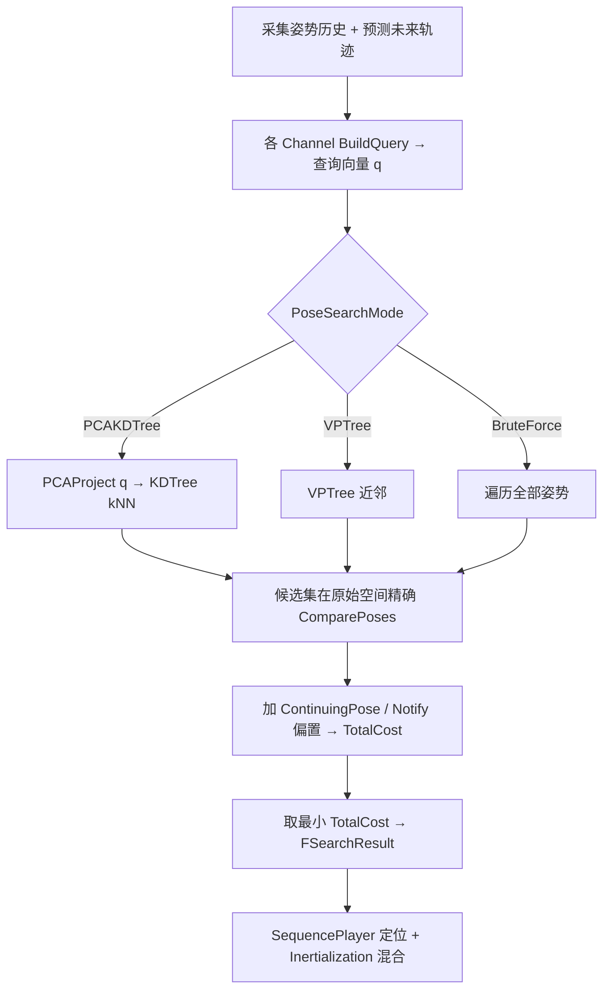

# Motion Matching 数学原理与 UE5 PoseSearch 实现解析

> 基于 UnrealEngine 5.5.4 源码
> 插件路径：`Engine/Plugins/Animation/PoseSearch`
> 核心命名空间：`UE::PoseSearch`

---

## 目录

- [Motion Matching 数学原理与 UE5 PoseSearch 实现解析](#motion-matching-数学原理与-ue5-posesearch-实现解析)
  - [目录](#目录)
- [第一部分 Motion Matching 数学原理](#第一部分-motion-matching-数学原理)
  - [1.1 核心思想](#11-核心思想)
  - [1.2 特征向量（Feature Vector）](#12-特征向量feature-vector)
  - [1.3 距离度量：加权马氏距离](#13-距离度量加权马氏距离)
  - [1.4 时间连续性与代价偏置](#14-时间连续性与代价偏置)
  - [1.5 加速：PCA 降维 + 空间划分树](#15-加速pca-降维--空间划分树)
- [第二部分 UE5 PoseSearch 实现](#第二部分-ue5-posesearch-实现)
  - [2.1 模块与数据结构总览](#21-模块与数据结构总览)
  - [2.2 Schema：特征布局定义](#22-schema特征布局定义)
  - [2.3 Feature Channels：特征的模块化编码](#23-feature-channels特征的模块化编码)
  - [2.4 搜索索引 FSearchIndex](#24-搜索索引-fsearchindex)
  - [2.5 代价函数实现](#25-代价函数实现)
  - [2.6 权重归一化与马氏距离](#26-权重归一化与马氏距离)
  - [2.7 PCA 的实现](#27-pca-的实现)
  - [2.8 三种搜索模式](#28-三种搜索模式)
  - [2.9 KD-Tree 与 VP-Tree](#29-kd-tree-与-vp-tree)
  - [2.10 鲁棒性与性能的工程细节](#210-鲁棒性与性能的工程细节)
  - [2.11 运行时：AnimGraph 节点](#211-运行时animgraph-节点)
- [第三部分 端到端流程](#第三部分-端到端流程)
- [附录：数学与代码对照表](#附录数学与代码对照表)

---

# 第一部分 Motion Matching 数学原理

## 1.1 核心思想

传统动画依赖状态机（State Machine）和混合树（Blend Tree）：由美术/程序显式设计状态与过渡。当动作组合爆炸时，维护成本极高。

**Motion Matching** 把动画选择重新表述为一个**最近邻搜索（Nearest Neighbor Search）**问题，去掉了显式的状态图。每一帧（或每隔若干帧）：

1. 从**角色当前状态**（当前姿势、速度）与**玩家输入预测的未来轨迹**构造一个**查询向量** $q \in \mathbb{R}^d$。
2. 在离线烘焙好的**动画特征数据库** $\{p_i \in \mathbb{R}^d\}_{i=1}^N$ 中，找到与 $q$ 代价最小的姿势 $p_{i^*}$：

$$i^* = \arg\min_{i} \; \mathrm{Cost}(q,\, p_i)$$

3. 跳转（或惯性化混合）到 $p_{i^*}$ 对应的**动画片段与时间点**，继续播放，直到下一次搜索。

其威力在于：动作库越丰富，匹配越自然，而**几乎不需要手工连线**。

## 1.2 特征向量（Feature Vector）

每个姿势被编码成一个**定长浮点向量**。典型分量：

| 类别 | 含义 | 目的 |
|------|------|------|
| 姿势特征 Pose | 关键骨骼（双脚、手等）相对根骨骼的**位置** $\mathbf{p}_b$、**速度** $\mathbf{v}_b$ | 保证跳转前后姿势连续、不穿模 |
| 轨迹特征 Trajectory | 过去/未来若干时间采样点上根的**位置/朝向/速度** | 匹配玩家意图（往哪走、转向） |
| 可选特征 | 相位 Phase、朝向 Heading、曲线 Curve 等 | 步态同步、风格控制 |

- **数据库侧**：这些特征在离线烘焙时按固定频率（如 30Hz）从动画资产采样得到。
- **查询侧**：姿势部分来自角色**当前真实姿势**，轨迹部分来自**玩家输入 + 运动预测**。

只要"过去轨迹 + 当前姿势"匹配得好，就保证了**平滑衔接**；"未来轨迹"匹配得好，就保证了**响应玩家意图**。

## 1.3 距离度量：加权马氏距离

朴素度量是**加权平方欧氏距离**：

$$\mathrm{Cost}(q, p) = \sum_{k=1}^{d} w_k\,(q_k - p_k)^2$$

权重 $w_k$ 需要同时解决两个问题：

**(a) 量纲不一致**：位置（cm）、速度（cm/s）、角度的数值范围差异巨大，直接相加会让大数值维度主导代价。解决方法是用数据集在每一维上的**标准差 $\sigma_k$** 归一化，得到**对角马氏距离（Mahalanobis distance）**：

$$\mathrm{Cost}(q,p) = \sum_{k} \frac{u_k}{\sigma_k^2}\,(q_k - p_k)^2$$

**(b) 语义重要性**：用户权重 $u_k$ 表达偏好，例如"轨迹比手部姿势更重要"。

综合得到每维权重：

$$w_k = \frac{u_k}{\sigma_k^2}$$

## 1.4 时间连续性与代价偏置

只做最近邻搜索会导致**逐帧抖动**：连续帧可能在不同片段间反复跳变。因此实际代价加入偏置项：

$$\text{TotalCost} = \underbrace{\sum_k w_k (q_k-p_k)^2}_{\text{DissimilarityCost}} \;+\; \underbrace{C_{\text{notify}}}_{\text{Notify/BaseBias}} \;+\; \underbrace{C_{\text{cont}}}_{\text{ContinuingPose 偏置}}$$

- **ContinuingPose 偏置**：给"继续播放当前动画的下一帧"一个负向折扣，只有当别的候选**明显更优**时才跳转，抑制抖动。
- **Notify/BaseCostBias**：允许美术对特定片段/帧加减代价（如让某些动作更/更不容易被选中）。

## 1.5 加速：PCA 降维 + 空间划分树

数据库可达数十万姿势，逐一比较（brute force）为 $O(Nd)$，每帧做代价高。加速两步走：

**PCA 降维**：对加权、中心化后的数据做主成分分析，把 $d$ 维压到 $r$ 维（$r \ll d$，保留主要方差）。数学上是对协方差矩阵做特征分解：

$$\Sigma = \frac{1}{N-1}\tilde{X}^\top \tilde{X}, \qquad \Sigma = V\Lambda V^\top$$

取最大 $r$ 个特征值对应的特征向量组成投影矩阵 $W = [v_1,\dots,v_r]$，投影：

$$z = (x_w - \mu)\,W, \qquad x_w = x \odot \sqrt{w}$$

**空间划分树**：在低维空间构建 **KD-Tree**（或在原始度量空间构建 **VP-Tree**）做近似 $k$-NN，把候选从 $N$ 缩到 $k$，再在**原始高维空间**对这 $k$ 个候选**精确**计算代价。树只用于缩小候选集，最终质量由精确代价保证。

---

# 第二部分 UE5 PoseSearch 实现

## 2.1 模块与数据结构总览



关键文件：

| 文件 | 职责 |
|------|------|
| `Public/PoseSearch/PoseSearchSchema.h` | Schema 定义（维度、采样率、通道、权重） |
| `Public/PoseSearch/PoseSearchIndex.h` | `FSearchIndex` / `FSearchIndexBase` / `FPoseMetadata` |
| `Private/PoseSearchIndex.cpp` | 代价函数、PCA 投影/重建、去重 |
| `Public/PoseSearch/PoseSearchCost.h` | `FPoseSearchCost` 代价聚合 |
| `Private/PoseSearchDerivedData.cpp` | 离线烘焙：权重归一化、PCA、建树 |
| `Private/PoseSearchDatabase.cpp` | `Search` / `SearchBruteForce` / `SearchPCAKDTree` / `SearchVPTree` |
| `Public/PoseSearch/KDTree.h` / `VPTree.h` | 加速结构（KD-Tree 基于 nanoflann） |
| `Private/PoseSearchFeatureChannel_*.cpp` | 各类特征通道（Pose/Velocity/Trajectory/Heading/Phase…） |
| `Public/PoseSearch/AnimNode_MotionMatching.h` | 运行时 AnimGraph 节点 |

## 2.2 Schema：特征布局定义

`UPoseSearchSchema`（`PoseSearchSchema.h`）是特征向量的"蓝图"：

- `SampleRate`（默认 30）：数据库采样频率，越高搜索越精细但内存越大。
- `Channels`：一组 `UPoseSearchFeatureChannel`，每个通道负责一段特征。
- `FinalizedChannels`：`Finalize` 后展开（可注入依赖/调试通道）的实际通道列表。
- `SchemaCardinality`：整个特征向量的维度 $d$。
- `MirrorDataTable`：镜像表，用于左右镜像地扩充数据库。
- `PermutationsSampleRate` / `PermutationsTimeOffset`：时间置换采样（在不同时间偏移上生成多份特征，增强时间维度覆盖）。

设计要点：把"数学"分解为**可组合的通道模块**，每个通道自洽地负责编码、查询构造与权重填充。

## 2.3 Feature Channels：特征的模块化编码

基类 `UPoseSearchFeatureChannel`（`PoseSearchFeatureChannel.h`）关键接口：

```cpp
// 烘焙期：为该通道在 Schema 中预留布局
virtual bool Finalize(UPoseSearchSchema* Schema);
// 运行时：把该通道的数据写入查询向量
virtual void BuildQuery(UE::PoseSearch::FSearchContext& SearchContext) const;
// 子通道（通道可嵌套组合）
virtual TArrayView<TObjectPtr<UPoseSearchFeatureChannel>> GetSubChannels();
```

- `GetChannelCardinality()` / `GetChannelDataOffset()`：该通道占据的维数与在总向量中的偏移。
- 同时实现 `IPoseSearchFilter`：`IsFilterValid` 可让通道对候选姿势做**硬过滤**（如 `FilterCrashingLegs` 排除双腿交叉的非法姿势）。

具体通道（`Private/PoseSearchFeatureChannel_*.cpp`）：`Pose`、`Position`、`Velocity`、`Heading`、`Trajectory`、`Phase`、`Curve`、`SamplingTime`、`TimeToEvent`、`PermutationTime`、`Padding`、`Group`、`FilterCrashingLegs`。

`FFeatureVectorHelper` 提供编解码工具：`EncodeVector`/`DecodeVector`（支持 `EComponentStrippingVector` 剥离 XY 或 Z 分量，例如只在水平面匹配）、`EncodeVector2D`、`EncodeFloat`。

## 2.4 搜索索引 FSearchIndex

`FSearchIndexBase`（`PoseSearchIndex.h`）——数据挖掘基类：

```cpp
struct FSearchIndexBase
{
    TAlignedArray<float> Values;                          // 所有姿势的原始特征（扁平存储）
    FSparsePoseMultiMap<int32> ValuesVectorToPoseIndexes; // 去重后 值向量 → 多个 PoseIdx
    TAlignedArray<FPoseMetadata> PoseMetadata;            // 每姿势元数据
    bool bAnyBlockTransition = false;
    TAlignedArray<FSearchIndexAsset> Assets;              // 源资产分段信息
    float MinCostAddend = -MAX_FLT;                       // 代价下界（用于提前剪枝）
};
```

`FSearchIndex : FSearchIndexBase`——完整搜索索引，额外持有：

```cpp
TAlignedArray<float> WeightsSqrt;         // 权重平方根（见 2.5/2.6）
TAlignedArray<float> PCAValues;           // 姿势在 PCA 空间的投影
TAlignedArray<float> PCAProjectionMatrix; // 投影矩阵 W (d × r)
TAlignedArray<float> Mean;                // 加权数据的均值 μ
FKDTree KDTree;                           // PCA 空间 KD-Tree
FVPTree VPTree;                           // 原始空间 VP-Tree
```

`FPoseMetadata` 用**位域**极致压缩：

```cpp
uint32 ValueOffset      : 27; // 特征在 Values 中的偏移
uint32 AssetIndex       : 20; // 所属资产
bool   bBlockTransition : 1;  // 该帧是否禁止作为跳转目标
FFloat16 CostAddend;          // Notify 代价偏置（半精度）
```

`FSearchIndexAsset` 记录每个源资产采样出的姿势区间（`FirstPoseIdx`、采样区间、是否镜像/循环/禁止重选、混合参数），并提供 `GetPoseIndexFromTime` / `GetTimeFromPoseIndex` 在**姿势索引 ↔ 动画时间**之间换算（循环资产做取模回绕）。

`FSparsePoseMultiMap` 是"数组的数组"的紧凑表示，用于去重后一个特征向量映射到多个姿势索引，节省内存。

## 2.5 代价函数实现

代价类型 `FPoseSearchCost`（`PoseSearchCost.h`）：

```cpp
FPoseSearchCost(float DissimilarityCost, float NotifyCostAddend, float ContinuingPoseCostAddend)
: TotalCost(DissimilarityCost + NotifyCostAddend + ContinuingPoseCostAddend) { ... }
```

即 §1.4 的 $\text{TotalCost} = \text{Dissimilarity} + \text{Notify} + \text{Continuing}$。

特征距离核（`PoseSearchIndex.cpp`），Eigen 版：

```cpp
static FORCEINLINE float CompareFeatureVectors(
    TConstArrayView<float> A, TConstArrayView<float> B, TConstArrayView<float> WeightsSqrt)
{
    Eigen::Map<const Eigen::ArrayXf> VA(A.GetData(), A.Num());
    Eigen::Map<const Eigen::ArrayXf> VB(B.GetData(), B.Num());
    Eigen::Map<const Eigen::ArrayXf> VW(WeightsSqrt.GetData(), WeightsSqrt.Num());
    return ((VA - VB) * VW).square().sum();   // Σ [ (a-b)·√w ]²
}
```

**为何存权重平方根而非权重？** 索引头文件注释明确：为减小数值误差，计算

$$\sum_k \big[(q_k-p_k)\sqrt{w_k}\big]^2$$

而不是 $\sum_k (q_k-p_k)^2 \cdot w_k$。两者数学等价，但前者避免了 $(q-p)^2$ 先产生大数再乘权重带来的精度损失。

**SIMD 版** `CompareAlignedFeatureVectors`：要求维度为 4 的倍数且 16 字节对齐（数据被 padding），用 `VectorRegister4Float` 一次处理 4 维，`VectorMultiplyAdd` 做融合乘加，末尾用 swizzle 做水平求和：

```cpp
const VectorRegister4Float Diff = VectorSubtract(*VA, *VB);
const VectorRegister4Float WeightedDiff = VectorMultiply(Diff, *VW);
PartialCost = VectorMultiplyAdd(WeightedDiff, WeightedDiff, PartialCost);
```

对外接口：

```cpp
FPoseSearchCost FSearchIndex::ComparePoses(int32 PoseIdx, float ContinuingPoseCostBias,
    TConstArrayView<float> PoseValues, TConstArrayView<float> QueryValues) const
{
    const float DissimilarityCost = CompareFeatureVectors(PoseValues, QueryValues, WeightsSqrt);
    const float NotifyAddend = PoseMetadata[PoseIdx].GetCostAddend();
    return FPoseSearchCost(DissimilarityCost, NotifyAddend, ContinuingPoseCostBias);
}
```

`CompareAlignedPoses` 是其 SIMD 版本。

## 2.6 权重归一化与马氏距离

烘焙阶段（`PoseSearchDerivedData.cpp`）计算 `WeightsSqrt`：

1. 初始化全 1，各通道 `FillWeights` 填入用户权重 $u_k$。
2. `Normalize` 模式：把用户权重归一化为**单位向量**（使不同 Schema 的数据库可互相比较）。
3. 取平方根：`WeightsSqrt[k] = Sqrt(u_k)`。
4. 除以每维标准差 `Deviation[k]`（$\sigma_k$）：

```cpp
if (DataPreprocessor != EPoseSearchDataPreprocessor::None)
{
    for (int32 Dimension = 0; Dimension != NumDimensions; ++Dimension)
    {
        // 预乘方差倒数 => "加权马氏距离"
        SearchIndex.WeightsSqrt[Dimension] /= Deviation[Dimension];
    }
}
```

最终 `WeightsSqrt[k] = √(u_k) / σ_k`，平方后正是 §1.3 的 $w_k = u_k/\sigma_k^2$。归一化采用改进的 z-score（对离群值更敏感，因为平方距离放大方差）。

## 2.7 PCA 的实现

`PreprocessSearchIndexPCAData`（`PoseSearchDerivedData.cpp`）完整实现 §1.5 的 PCA：

```cpp
// 1. 加权：X_w = X ⊙ √w （逐行乘 WeightsSqrt）
const RowMajorMatrix WeightedValues = MapValues.array().rowwise() * MapWeightsSqrt.array();

// 2. 求均值并中心化：μ = mean(X_w), X_c = X_w - μ
MapMean = WeightedValues.colwise().mean();
const RowMajorMatrix CenteredValues = WeightedValues.rowwise() - MapMean;

// 3. 协方差矩阵：Σ = X_cᵀ X_c / (N-1)
const ColMajorMatrix CovariantMatrix =
    (CenteredValues.transpose() * CenteredValues) / float(NumPoses - 1);

// 4. 对称矩阵特征分解：Σ = V Λ Vᵀ
const Eigen::SelfAdjointEigenSolver<ColMajorMatrix> EigenSolver(CovariantMatrix);
```

之后按特征值从大到小排序，取前 $r$ 个特征向量组成 `PCAProjectionMatrix` $W$（$d\times r$），把每个姿势投影后存入 `PCAValues`。`PCAExplainedVariance` 记录所保留的方差占比。

运行时查询投影 `FSearchIndex::PCAProject`（`PoseSearchIndex.cpp`）与训练一致：

```cpp
WeightedPoseValuesMap = PoseValuesMap.array() * WeightsSqrtMap.array(); // q ⊙ √w
CenteredPoseValuesMap = WeightedPoseValuesMap - MeanMap;                // 减 μ
ProjectedPoseValuesMap = CenteredPoseValuesMap * PCAProjectionMatrixMap;// × W
```

即 $z = (q \odot \sqrt{w} - \mu)\,W$。

逆运算 `GetReconstructedPoseValues` 用于内存优化（只存 PCA 值、按需重建原始特征）：

$$x \approx (z\,W^\top + \mu) \oslash \sqrt{w}$$

```cpp
const RowMajorVector ReciprocalWeightsSqrt = MapWeightsSqrt.cwiseInverse();
const RowMajorVector WeightedReconstructedValues =
    MapPCAValues.row(PoseIdx) * MapPCAProjectionMatrix.transpose() + MapMean;
ReconstructedPoseValues = WeightedReconstructedValues.array() * ReciprocalWeightsSqrt.array();
```

## 2.8 三种搜索模式

入口 `UPoseSearchDatabase::Search`（`PoseSearchDatabase.cpp`）按 `PoseSearchMode` 分派：

| 模式 | 函数 | 复杂度 | 特点 |
|------|------|--------|------|
| `BruteForce` | `SearchBruteForce` | $O(Nd)$ | 遍历全部姿势，精确、最慢，常作为验证基准 |
| `PCAKDTree` | `SearchPCAKDTree` | $\approx O(\log N \cdot r + k d)$ | PCA 空间 KD-Tree 近似 kNN，再精确复核 |
| `VPTree` | `SearchVPTree` | 类似 | VP-Tree，在原始度量空间上做近邻 |

**PCAKDTree 流程**（`SearchPCAKDTree`）：

1. 提前剪枝：若 `CurrentBestTotalCost <= MinCostAddend` 则跳过整个搜索。
2. `GetOrBuildQuery` 构造查询向量 → `PCAProject` 投影到 $r$ 维 `PCAQueryValues`。
3. `KDTree.FindNeighbors` 取 `KDTreeQueryNumNeighbors` 个候选（支持带过滤的 `FFilteredKNNResultSet`）。
4. 对每个候选调用 `EvaluatePoseKernel` 在**原始高维空间**用 `ComparePoses` 精确算代价，更新最优 `FSearchResult`。
5. 若 PCA 值被去重（一个 PCA 向量对应多个姿势），遍历 `PCAValuesVectorToPoseIndexes` 展开所有对应姿势。

调试期（`WITH_EDITOR && ENABLE_ANIM_DEBUG`）可开 `ValidateKNNSearch`，把 KD-Tree 结果与穷举结果对比，确保近似顺序/代价一致。

**BruteForce 流程**根据数据形态选择不同内核：需要 PCA 重建（`Values` 为空）走 `EvaluatePoseKernel<true,false>`；维度是 4 的倍数走 SIMD `<false,true>`；否则走标量 `<false,false>`。

## 2.9 KD-Tree 与 VP-Tree

**KD-Tree**（`KDTree.h`，底层 nanoflann）：

- `FDataSource` 适配器暴露 `kdtree_get_point_count` / `kdtree_get_pt`，让 nanoflann 直接读扁平数组。
- `FKNNResultSet::addPoint` 用**插入排序**维护 top-k 最近邻（对小 k 高效）；容量比 k 多一位以省去边界判断。
- 还提供 `FRadiusResultSet`（半径查询，用于去重）与 `FFilteredKNNResultSet`（内建 `NonSelectableIdx` 过滤）。
- KD-Tree 建在 **PCA 低维空间**，因为高维 KD-Tree 会退化（维度灾难）。

**VP-Tree**（`VPTree.h`）：

- 直接在**原始特征度量空间**上做近邻，不依赖 PCA。
- `SearchVPTree` 用 `FVPTreeDataSource` + `FVPTreeResultSet` 查询，返回的 `FIndexDistance.Distance` 已是 $\sqrt{\text{DissimilarityCost}}$。

去重加速：`PruneDuplicateValues` / `PruneDuplicatePCAValues` 借助 KD-Tree 半径查询找出近似重复的姿势合并，用 `FSparsePoseMultiMap` 保持"值向量 → 多姿势"映射。

## 2.10 鲁棒性与性能的工程细节

- **ContinuingPose 偏置**：`SearchContinuingPose` 给"继续当前动画"一个代价折扣，避免逐帧抖动跳变。
- **提前剪枝**：`MinCostAddend` 是任意搜索代价的下界，若当前最优已优于它，整个数据库搜索被跳过。
- **过滤系统** `FSearchFilters`：
  - `NonSelectableIdx`：禁止重选（`bDisableReselection`）、当前正在播放等不可选姿势。
  - `SelectableAssetIdx`：限定只在部分资产中搜索。
  - `bBlockTransition`：`FPoseMetadata` 位标记的过渡帧不能作为跳转目标。
- **去重**：合并近似重复姿势，显著减小索引体积与搜索量。
- **数据紧凑化**：`FPoseMetadata` 位域压缩、`FFloat16` 半精度、`TAlignedArray` 16 字节对齐以配合 SIMD。
- **内存/速度权衡**：可只存 PCA 值，运行时 `GetReconstructedPoseValues` 重建原始特征。
- **多线程/异步烘焙**：`FAsyncPoseSearchDatabasesManagement::RequestAsyncBuildIndex` 在编辑器下异步构建索引；搜索时若索引未就绪则安全跳过。
- **归一化集** `UPoseSearchNormalizationSet`：让使用不同 Schema 的多个数据库共享一致的归一化基准，从而跨库比较代价。

## 2.11 运行时：AnimGraph 节点

`FAnimNode_MotionMatching`（`AnimNode_MotionMatching.h`）把上述搜索接入 AnimGraph：



- 由 `FAnimNode_PoseSearchHistoryCollector` 维护过去若干帧的姿势/根轨迹历史，作为查询的"过去"部分。
- 未来轨迹由玩家输入 + 运动模型（`PoseSearchTrajectory*`）预测。
- 搜索返回 `FSearchResult`（命中的 `PoseIdx` 与对应 `AssetTime`），节点据此选片段、定位时间，并通过**惯性化（Inertialization）**平滑过渡，避免硬切。
- 蓝图库 `MotionMatchingAnimNodeLibrary` 暴露参数供 BP 动态调整。

---

# 第三部分 端到端流程

**离线烘焙（Editor）：**



**运行时（每帧或每 N 帧）：**



---

# 附录：数学与代码对照表

| 数学概念 | 公式 | UE5 对应实现 |
|----------|------|--------------|
| 特征向量 | $x \in \mathbb{R}^d$ | `FSearchIndex::Values` + Feature Channels |
| 每维权重 | $w_k = u_k/\sigma_k^2$ | `WeightsSqrt[k] = √u_k / σ_k`（`PoseSearchDerivedData.cpp`） |
| 加权马氏距离 | $\sum_k w_k(q_k-p_k)^2$ | `CompareFeatureVectors` / `CompareAlignedFeatureVectors` |
| 总代价 | $\text{Dissim}+C_{\text{notify}}+C_{\text{cont}}$ | `FPoseSearchCost::TotalCost` |
| 最近邻 | $\arg\min_i \mathrm{Cost}(q,p_i)$ | `Search` / `EvaluatePoseKernel` |
| 均值中心化 | $X_c = X_w - \mu$ | `WeightedValues.rowwise() - MapMean` |
| 协方差 | $\Sigma = \tilde{X}^\top\tilde{X}/(N-1)$ | `CenteredValues.transpose()*CenteredValues/(N-1)` |
| 特征分解 | $\Sigma = V\Lambda V^\top$ | `Eigen::SelfAdjointEigenSolver` |
| PCA 投影 | $z=(x\odot\sqrt{w}-\mu)W$ | `FSearchIndex::PCAProject` |
| PCA 重建 | $x\approx(zW^\top+\mu)\oslash\sqrt{w}$ | `FSearchIndex::GetReconstructedPoseValues` |
| 近似 kNN | — | `FKDTree`（nanoflann）/ `FVPTree` |
| 时间连续性 | $C_{\text{cont}}$ | `SearchContinuingPose` / `ContinuingPoseCostBias` |
| 提前剪枝 | $\text{best} \le \text{lb}$ | `MinCostAddend` |

---

*本文档基于 UnrealEngine 5.5.4 源码分析整理，代码引用均来自 `Engine/Plugins/Animation/PoseSearch`。*
