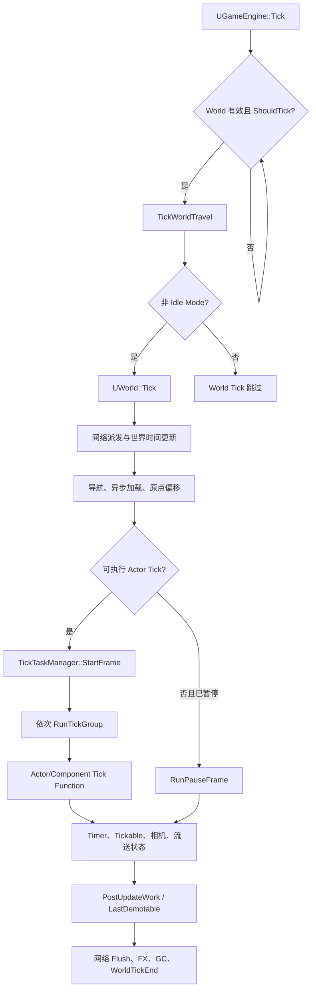
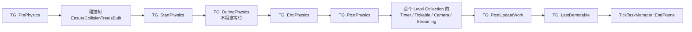

# UE5 `UWorld::Tick` 流程

本文基于当前 Runtime 源码梳理游戏世界在单帧中的 Tick 路径。主入口是 `UGameEngine::Tick`，其为每个可 Tick 的 `FWorldContext` 调用 `UWorld::Tick(LEVELTICK_All, DeltaSeconds)`。

## 调用链

`UGameEngine::Tick` 在 World Tick 后继续处理反射捕获、关卡流送、Viewport、渲染、资源流送和音频；这些步骤不属于 `UWorld::Tick` 本体。

## `UWorld::Tick` 的帧内阶段

1. **帧起始与网络输入**
	- 广播 `FWorldDelegates::OnWorldTickStart`，并启动性能追踪和 XR 帧。
	- 设置 `bInTick`，通过 `BroadcastTickDispatch` 和 `BroadcastPostTickDispatch` 接收网络数据；客户端连接关闭时由 `TickNetClient` 报告网络失败。

2. **时间与世界状态**
	- `RealTimeSeconds` 使用原始 `DeltaSeconds` 递增；暂停时 `AudioTimeSeconds` 与 `TimeSeconds` 不递增。
	- 先应用 `AWorldSettings::GetEffectiveTimeDilation()`，再由 `FixupDeltaSeconds` 钳制，结果写入 `DeltaTimeSeconds`。此后的游戏性 Tick 使用该 dilated/clamped 值。
	- 保存未缩放的 `RealDeltaSeconds`，网络 Flush 使用它。
	- 处理高优先级异步加载、世界原点变换和 `NavigationSystem->Tick`。

3. **决定是否执行常规 Actor Tick**

	`bDoingActorTicks` 为真需要同时满足：

	- `TickType != LEVELTICK_TimeOnly`；
	- 世界未暂停；
	- 不存在客户端连接，或连接状态为 `USOCK_Open`。

	`bPlayersOnly` 会把 `TickType` 改为 `LEVELTICK_ViewportsOnly`。暂停时不走常规 Tick Group，而是使用受限的暂停 Tick 路径。

4. **Tick Task 调度与 Tick Group**
	- 每个有效 `FLevelCollection` 都构造 `LevelsToTick`，并通过 `FScopedLevelCollectionContextSwitch` 切换上下文。
	- `FTickTaskManagerInterface::StartFrame` 收集 Level 中已注册的 Tick Function，建立前置依赖和批处理任务；它不直接完成所有 Actor Tick。
	- `RunTickGroup` 释放当前组任务。常规顺序如下：

	`TG_DuringPhysics` 调用时传入 `bBlockTillComplete=false`，用于与后续工作重叠；随后 `TG_EndPhysics` 的同步执行会等待其依赖所需的工作。同步组边界还会让 Tick Task Manager 排入并执行 `TG_NewlySpawned` 中的新 Tick Function，避免当帧递归生成无限延续。

5. **Actor Tick 的最终落点**
	- `FActorTickFunction::ExecuteTick` 验证 `Target`，应用 Actor 的 `CustomTimeDilation`，然后调用 `AActor::TickActor`。
	- `AActor::TickActor` 调用可重写的 `AActor::Tick`。
	- 基类 `AActor::Tick` 会向 Blueprint Actor 触发 `ReceiveTick`，并处理该 Actor 的 Latent Action。Latent Action 使用 `UWorld::GetDeltaSeconds()`，而不是因 Tick Interval 累积的 Actor 专属 Delta。
	- `PrimaryActorTick` 默认属于 `TG_PrePhysics`，但 Actor/Component 可以通过 Tick Group、Tick Prerequisite、Tick Interval 和 `bRunOnAnyThread` 改变实际调度条件。

6. **首个 Collection 的世界级工作**
	仅在本帧第一个包含 Level 的 Collection 中执行一次：

	- 处理未被 Actor Tick 消费的 Latent Action；
	- 未暂停时 Tick `TimerManager`；
	- Tick 与此 World 关联的 `FTickableGameObject`；
	- 更新玩家相机；
	- 游戏世界未暂停时调用 `InternalUpdateStreamingState`。

7. **收尾**
	- Actor Tick 完成后广播 `OnWorldPostActorTick`，并完成异步 Trace。
	- 使用原始 `RealDeltaSeconds` 执行 `BroadcastPreTickFlush`、`BroadcastTickFlush` 和 `BroadcastPostTickFlush`。
	- 更新 SpeedTree、FX，清理内存标记，执行条件 GC，并处理玩家限制、统计、视图缓存、XR 帧结束和渲染线程性能追踪。
	- 最后广播 `FWorldDelegates::OnWorldTickEnd`。

## 暂停与 `TimeOnly` 行为

| 场景 | 常规 Tick Group | 暂停 Tick | Timer | World Tickable |
| --- | --- | --- | --- | --- |
| 正常游戏 | 执行 | 否 | 执行 | 执行 |
| 已暂停 | 不执行 | `RunPauseFrame` | 不执行 | 仅 `IsTickableWhenPaused()` 为真者 |
| `LEVELTICK_TimeOnly` | 不执行 | 仅在已暂停时 | 不执行 | 不执行游戏性 Tick |

`RunPauseFrame` 在 Game Thread 同步运行，且不提供普通 Tick Frame 中的依赖排序、Tick Group 或新生成对象支持。因此需要在暂停时保持更新的逻辑，应使用支持暂停的 Tick 设置，或显式选择合适的暂停机制。

## 关键源码

- [Engine/Private/GameEngine.cpp](../../Engine/Private/GameEngine.cpp)：`UGameEngine::Tick` 遍历 `WorldList` 并进入 World Tick。
- [Engine/Private/LevelTick.cpp](../../Engine/Private/LevelTick.cpp)：`UWorld::Tick`、`RunTickGroup` 和世界级收尾工作。
- [Engine/Private/TickTaskManager.cpp](../../Engine/Private/TickTaskManager.cpp)：`StartFrame`、`RunTickGroup`、`RunPauseFrame`、`EndFrame`，以及 Tick Function 依赖调度。
- [Engine/Private/Actor.cpp](../../Engine/Private/Actor.cpp)：`FActorTickFunction::ExecuteTick`、`AActor::TickActor`、`AActor::Tick`。
