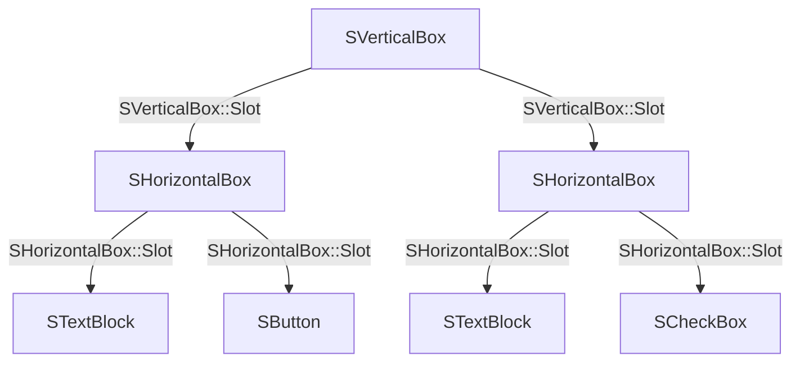
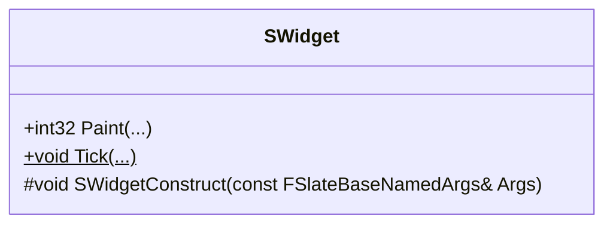
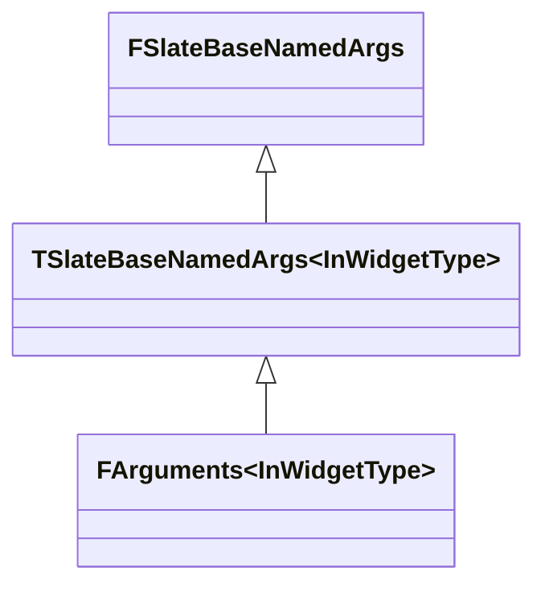
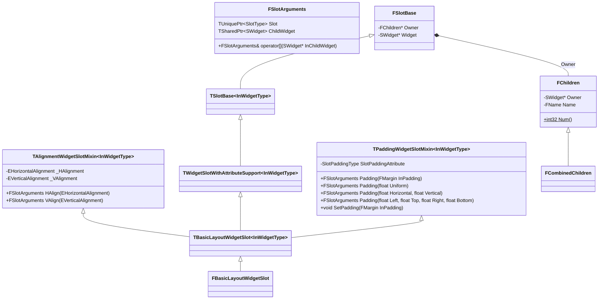
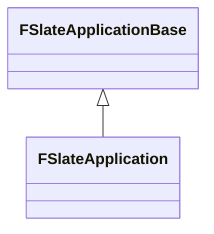

# Slate

## 语法

[Slate UI](https://dev.epicgames.com/documentation/unreal-engine/slate-user-interface-programming-framework-for-unreal-engine) 是 Unreal Engine 的底层 UI 框架，引擎的[编辑器界面](https://dev.epicgames.com/documentation/unreal-engine/slate-editor-window-quickstart-guide-for-unreal-engine)和游戏的 [UMG](https://dev.epicgames.com/documentation/unreal-engine/umg-editor-reference-for-unreal-engine) 都是基于 Slate UI 构建的。

一个 Slate UI 是一颗控件树，由两部分构成：
1. 控件 Widget
2. 槽位 Slot

其中，Widget 表示 UI 元素，比如：按钮、文本、图片等；Slot 表示 Widget 之间的父子关系与布局信息。比如在 UMG 中，Hierarchy 可视化了控件树的结构，Details 可视化了 Slot 的布局信息：


Slate UI 是一种**声明式 UI (Declarative UI)** 框架，UE 通过 C++ 的宏，定义了一套 DSL (Domain Specific Language) 来描述 UI 的结构和行为，比如：
- `SNew`：声明（实例化）一个控件
- `SAssignNew`：声明控件，并把构造中的共享指针保存到变量
- `SLATE_BEGIN_ARGS`：开始定义控件的参数属性
- `SLATE_END_ARGS`：结束定义控件的参数属性
- `SLATE_ARGUMENT`：定义控件的参数
- `SLATE_ATTRIBUTE`：定义控件的属性
- `SLATE_EVENT`：定义控件的事件
- `SLATE_SLOT_ARGUMENT`：定义控件的 Slot 参数

声明式 UI 的特点是把“控件声明”和“参数属性”放在一起描述。`SNew` 产生一个临时的构造器对象，链式调用先填充 `FArguments`，最后由 `operator<<=` 完成真正构造。控件之间的父子关系通过 Slot 描述：父控件拥有 Slot，Slot 再拥有子控件和布局信息。使用 Slate UI 编写的 UI 代码如下：

```cpp
SNew(SVerticalBox)
+SVerticalBox::Slot()
.AutoHeight()
[
    SNew(SHorizontalBox)
    +SHorizontalBox::Slot()
    .VAlign(VAlign_Top)
    [
        SNew(STextBlock)
        .Text(FText::FromString("Test Button"))
    ]
    +SHorizontalBox::Slot()
    .VAlign(VAlign_Top)
    [
        SNew(SButton)
        .Text(FText::FromString("Press Me"))
    ]
]
+SVerticalBox::Slot()
.AutoHeight()
[
    SNew(SHorizontalBox)
    +SHorizontalBox::Slot()
    .VAlign(VAlign_Top)
    [
        SNew(STextBlock)
        .Text(FText::FromString("Test Checkbox"))
    ]
    + SHorizontalBox::Slot()
    .VAlign(VAlign_Top)
    [
        SNew(SCheckBox)
    ]
]
```

Slate UI 的语法宏定义在 `Runtime/SlateCore/Public/Widgets/DeclarativeSyntaxSupport.h` 文件中，其中：
- 宏 `SNew` 声明一个 Widget，紧随其后的 `.XXX(...)` 函数用于设置 Widget 的参数属性
- `+SVerticalBox::Slot()` 声明一个 Slot，紧随其后的 `.XXX(...)` 函数用于设置 Slot 的参数属性，`operator[]` 操作符用于设置 Widget 的子控件

声明式 UI 的优点是：能直接从代码中读出控件树的结构、控件之间的嵌套关系和每层控件/槽位的参数属性。上述代码得到的控件树结构如下：



编译后得到的编辑器窗口如下：


## 控件

控件是构建 Slate UI 的基本单元，所有 Slate UI 的控件都继承自 `SWidget`



`SWidget` 的成员 | 描述
-|-
`SWidgetConstruct(...)` | 传入参数，构造控件

### 控件的声明

`SNew` 是创建 Slate UI 控件的宏，用于声明和初始化控件实例，其定义如下：

```cpp
#define SNew( WidgetType, ... ) \
	MakeTDecl<WidgetType>( #WidgetType, __FILE__, __LINE__, RequiredArgs::MakeRequiredArgs(__VA_ARGS__) ) <<= TYPENAME_OUTSIDE_TEMPLATE WidgetType::FArguments()

```

其中，`MakeTDecl` 是一个模板函数，定义为：

```cpp
template<typename WidgetType, typename RequiredArgsPayloadType>
TSlateDecl<WidgetType, RequiredArgsPayloadType> MakeTDecl( const ANSICHAR* InType, const ANSICHAR* InFile, int32 OnLine, RequiredArgsPayloadType&& InRequiredArgs )
{
	LLM_SCOPE_BYTAG(UI_Slate);
	return TSlateDecl<WidgetType, RequiredArgsPayloadType>(InType, InFile, OnLine, Forward<RequiredArgsPayloadType>(InRequiredArgs));
}
```

`TSlateDecl` 是一个模板类，用于 Slate UI 控件的实例化：

```cpp
/**
 * Utility class used during widget instantiation.
 * Performs widget allocation and construction.
 * Ensures that debug info is set correctly.
 * Returns TSharedRef to widget.
 *
 * @see SNew
 * @see SAssignNew
 */
template<class WidgetType, typename RequiredArgsPayloadType>
struct TSlateDecl
{
    TSlateDecl( const ANSICHAR* InType, const ANSICHAR* InFile, int32 OnLine, RequiredArgsPayloadType&& InRequiredArgs )
        : _RequiredArgs(InRequiredArgs)
    {
        if constexpr (std::is_base_of_v<SUserWidget, WidgetType>)
        {
            /**
                * SUserWidgets are allocated in the corresponding CPP file, so that
                * the implementer can return an implementation that differs from the
                * public interface. @see SUserWidgetExample
                */
            _Widget = WidgetType::New();
        }
        else
        {
            /** Normal widgets are allocated directly by the TSlateDecl. */
            _Widget = MakeShared<WidgetType>();
        }

        _Widget->SetDebugInfo(InType, InFile, OnLine, sizeof(WidgetType));
    }

    /**
        * Initialize OutVarToInit with the widget that is being constructed.
        * @see SAssignNew
        */
    template<class ExposeAsWidgetType>
    TSlateDecl&& Expose( TSharedPtr<ExposeAsWidgetType>& OutVarToInit ) &&
    {
        // Can't move out _Widget here because operator<<= needs it
        OutVarToInit = _Widget;
        return MoveTemp(*this);
    }

    /**
        * Initialize OutVarToInit with the widget that is being constructed.
        * @see SAssignNew
        */
    template<class ExposeAsWidgetType>
    TSlateDecl&& Expose( TSharedRef<ExposeAsWidgetType>& OutVarToInit ) &&
    {
        // Can't move out _Widget here because operator<<= needs it
        OutVarToInit = _Widget.ToSharedRef();
        return MoveTemp(*this);
    }

    /**
        * Initialize a WEAK OutVarToInit with the widget that is being constructed.
        * @see SAssignNew
        */
    template<class ExposeAsWidgetType>
    TSlateDecl&& Expose( TWeakPtr<ExposeAsWidgetType>& OutVarToInit ) &&
    {
        // Can't move out _Widget here because operator<<= needs it
        OutVarToInit = _Widget.ToWeakPtr();
        return MoveTemp(*this);
    }

    /**
        * Complete widget construction from InArgs.
        *
        * @param InArgs  NamedArguments from which to construct the widget.
        *
        * @return A reference to the widget that we constructed.
        */
    TSharedRef<WidgetType> operator<<=( const typename WidgetType::FArguments& InArgs ) &&
    {
        _Widget->SWidgetConstruct(InArgs);
        _RequiredArgs.CallConstruct(_Widget.Get(), InArgs);
        _Widget->CacheVolatility();
        _Widget->bIsDeclarativeSyntaxConstructionCompleted = true;

        return MoveTemp(_Widget).ToSharedRef();
    }

    TSharedPtr<WidgetType> _Widget;
    RequiredArgsPayloadType& _RequiredArgs;
};
```

其中，`operator<<=` 是构造的提交点，顺序是：

1. 调用 `SWidget::SWidgetConstruct(InArgs)`，初始化所有控件共有的属性，如 `Visibility`、`IsEnabled`、`RenderTransform`、`ToolTip` 和元数据。
2. 调用 `RequiredArgs::CallConstruct`，进而调用具体控件的 `Construct(const FArguments&, ...)`；控件在这里读取自身参数、保存属性并组装子控件树。
3. 调用 `CacheVolatility`，标记声明式构造已结束，并返回 `TSharedRef<WidgetType>`。

因此 `SWidgetConstruct` 不是派生控件的完整构造函数；自定义控件应实现 `Construct`，而不应直接调用 `SWidgetConstruct`。比如声明一个 `SButton` 控件，并设置它的 Text 参数和点击回调：

```cpp
SNew(SButton)
.Text(FText::FromString("Press Me"))
.OnClicked(FOnClicked::CreateSP(this, &OnTestButtonClicked))
```

`SNew` 宏展开为：

```cpp
MakeTDecl<SButton>("SButton", "SLuaGameFrameworkWidget.cpp", 18, RequiredArgs::MakeRequiredArgs()) <<= SButton::FArguments()
.Text(FText::FromString("Press Me"))
.OnClicked(FOnClicked::CreateSP(this, &OnTestButtonClicked))
```

其中，`SButton::FArguments::Text(...)` 和 `SButton::FArguments::OnClicked(...)` 是 `SButton` 的参数属性。`operator<<=` 将已填充的 `FArguments` 交给 `SButton::Construct`，完成控件构造。下面详细介绍控件的参数。

### 控件参数

控件构造函数 `SWidget::SWidgetConstruct(FSlateBaseNamedArgs&)` 接受的参数是 `FSlateBaseNamedArgs` 及其派生类：



在 `SWidget` 的派生类中，可以通过 `SLATE_BEGIN_ARGS` 和 `SLATE_END_ARGS` 宏，定义一个派生类 `FArguments`，并在其中自定义控件的参数属性。

```cpp
/**
 * Widget authors can use SLATE_BEGIN_ARGS and SLATE_END_ARS to add support
 * for widget construction via SNew and SAssignNew.
 * e.g.
 * 
 *    SLATE_BEGIN_ARGS( SMyWidget )
 *         , _PreferredWidth( 150.0f )
 *         , _ForegroundColor( FLinearColor::White )
 *         {}
 *
 *         SLATE_ATTRIBUTE(float, PreferredWidth)
 *         SLATE_ATTRIBUTE(FSlateColor, ForegroundColor)
 *    SLATE_END_ARGS()
 */

#define SLATE_BEGIN_ARGS( InWidgetType ) \
	public: \
	struct FArguments : public TSlateBaseNamedArgs<InWidgetType> \
	{ \
		typedef FArguments WidgetArgsType; \
		typedef InWidgetType WidgetType; \
		FORCENOINLINE FArguments()

#define SLATE_END_ARGS() \
	};
```

比如在 `SImage` 中：

```cpp
class SImage
	: public SLeafWidget
{
    SLATE_DECLARE_WIDGET_API(SImage, SLeafWidget, SLATECORE_API)

    public:
    SLATE_BEGIN_ARGS( SImage )
        : _Image( FCoreStyle::Get().GetDefaultBrush() )
        , _ColorAndOpacity( FLinearColor::White )
        , _FlipForRightToLeftFlowDirection( false )
        { }

        /** Image resource */
        SLATE_ATTRIBUTE(const FSlateBrush*, Image)

        /** Color and opacity */
        SLATE_ATTRIBUTE(FSlateColor, ColorAndOpacity)

        /** When specified, ignore the brushes size and report the DesiredSizeOverride as the desired image size. */
        SLATE_ATTRIBUTE(TOptional<FVector2D>, DesiredSizeOverride)

        /** Flips the image if the localization's flow direction is RightToLeft */
        SLATE_ARGUMENT( bool, FlipForRightToLeftFlowDirection )

        /** Invoked when the mouse is pressed in the widget. */
        SLATE_EVENT(FPointerEventHandler, OnMouseButtonDown)
    SLATE_END_ARGS()

    ...
}
```

那么这个宏展开为：

```cpp
class SImage
	: public SLeafWidget
{
    SLATE_DECLARE_WIDGET_API(SImage, SLeafWidget, SLATECORE_API)

    public:
    public:
    struct FArguments : public TSlateBaseNamedArgs<SImage>
    {
        typedef FArguments WidgetArgsType;
        typedef SImage WidgetType;
        __declspec(noinline) FArguments()
        { }

        /** Image resource */
        SLATE_ATTRIBUTE(const FSlateBrush*, Image)

        /** Color and opacity */
        SLATE_ATTRIBUTE(FSlateColor, ColorAndOpacity)

        /** When specified, ignore the brushes size and report the DesiredSizeOverride as the desired image size. */
        SLATE_ATTRIBUTE(TOptional<FVector2D>, DesiredSizeOverride)

        /** Flips the image if the localization's flow direction is RightToLeft */
        SLATE_ARGUMENT( bool, FlipForRightToLeftFlowDirection )

        /** Invoked when the mouse is pressed in the widget. */
        SLATE_EVENT(FPointerEventHandler, OnMouseButtonDown)
    };

    ...
};
```

其中，通过如下的宏，为 `FArguments` 定义控件的参数属性：
- `SLATE_ATTRIBUTE` 为 `FArguments` 定义 `TAttribute` 属性。它可保存常量值，也可绑定 Getter；属性更新时会参与 Slate 的失效处理。
- `SLATE_ARGUMENT` 为 `FArguments` 定义仅在构造时传入的普通值，不具备运行期绑定能力。
- `SLATE_ARGUMENT_DEFAULT` 为 `FArguments` 定义一个控件的参数，并支持设置默认值
- `SLATE_STYLE_ARGUMENT` 为 `FArguments` 定义一个控件的样式参数，与 `SLATE_ARGUMENT` 的不同之处在于，在为 `SLATE_ARGUMENT` 传递参数值时，通常会复制或移动对象，而 `SLATE_STYLE_ARGUMENT` 传递的是参数对象的只读指针，避免了不必要的拷贝开销
- `SLATE_EVENT` 为 `FArguments` 定义一个控件的事件
- `SLATE_SLOT_ARGUMENT` 为 `FArguments` 定义一个控件的槽位参数

> 这些宏只能在 `SLATE_BEGIN_ARGS` 和 `SLATE_END_ARGS` 之间使用

除了通过 `SLATE_BEGIN_ARGS` 定义一个 `FArguments` 外，还可以通过 `SLATE_USER_ARGS` 定义一个 `FUserArguments`：
```cpp
/**
 * Just like SLATE_BEGIN_ARGS but requires the user to implement the New() method in the .CPP.
 * Allows for widget implementation details to be entirely reside in the .CPP file.
 */
#define SLATE_USER_ARGS( WidgetType ) \
	public: \
	static TSharedRef<WidgetType> New(); \
	struct FArguments; \
	struct FArguments : public TSlateBaseNamedArgs<WidgetType> \
	{ \
		typedef FArguments WidgetArgsType; \
		FORCENOINLINE FArguments()
```

`SLATE_USER_ARGS` 不同于 `SLATE_BEGIN_ARGS` 的地方在于，`SLATE_USER_ARGS` 要求用户在 `.cpp` 文件中实现 `New()` 方法。它配合 `SUserWidget` 使用，可以把实现类隐藏在 `.cpp` 文件中，同时保持公开接口稳定。

## 槽位

槽位 Slot 用于构建控件树的父子级关系。父控件并不直接引用子控件，而是通过 Slot 间接引用子控件。Slot 不仅持有子控件的引用，还保存了子控件相对父控件的布局 Layout 信息。在 UMG 的编辑器中，Slot 属性的底层，就是 Slate UI 的 Slot。


### 槽位声明

在 Slate UI 中，通过 `+WidgetType::Slot()` 来声明一个 Slot

```cpp
SNew(SVerticalBox)
+SVerticalBox::Slot()
.AutoHeight()
.Padding(5.0f)
.HAlign(HAlign_Center)
[
    SNew(STextBlock)
    .Text(FText::FromString(TEXT("Hello")))
]
```

通过宏 `SLATE_SLOT_ARGUMENT` 在`SLATE_BEGIN_ARGS` 和 `SLATE_END_ARGS` 之间定义一个槽位参数：

```cpp
/**
 * Use this macro between SLATE_BEGIN_ARGS and SLATE_END_ARGS
 * in order to add support for slots with the construct pattern.
 */
#define SLATE_SLOT_ARGUMENT( SlotType, SlotName ) \
    TArray<typename SlotType::FSlotArguments> _##SlotName; \
    WidgetArgsType& operator + (typename SlotType::FSlotArguments& SlotToAdd) \
    { \
        _##SlotName.Add( MoveTemp(SlotToAdd) ); \
        return static_cast<WidgetArgsType*>(this)->Me(); \
    } \
    WidgetArgsType& operator + (typename SlotType::FSlotArguments&& SlotToAdd) \
    { \
        _##SlotName.Add( MoveTemp(SlotToAdd) ); \
        return static_cast<WidgetArgsType*>(this)->Me(); \
    }
```

比如在 `SHorizontalBox` 中：

```cpp
/** A Horizontal Box Panel. See SBoxPanel for more info. */
class SHorizontalBox : public SBoxPanel
{
    SLATE_DECLARE_WIDGET_API(SHorizontalBox, SBoxPanel, SLATECORE_API)
public:
    class FSlot
    {
        ...
    };

    SLATE_BEGIN_ARGS( SHorizontalBox )
    {
        _Visibility = EVisibility::SelfHitTestInvisible;
    }
    SLATE_SLOT_ARGUMENT(SHorizontalBox::FSlot, Slots)
    SLATE_END_ARGS()
};
```
宏展开为：

```cpp
/** A Horizontal Box Panel. See SBoxPanel for more info. */
class SHorizontalBox : public SBoxPanel
{
    SLATE_DECLARE_WIDGET_API(SHorizontalBox, SBoxPanel, SLATECORE_API)
public:
    class FSlot
    {
        ...
    };

    public:
    struct FArguments : public TSlateBaseNamedArgs<SHorizontalBox>
    {
        typedef FArguments WidgetArgsType;
        typedef SHorizontalBox WidgetType;
        __declspec(noinline) FArguments()
        {
            _Visibility = EVisibility::SelfHitTestInvisible;
        }
        TArray<typename SHorizontalBox::FSlot::FSlotArguments> _Slots;
        WidgetArgsType& operator +(typename SHorizontalBox::FSlot::FSlotArguments& SlotToAdd)
        {
            _Slots.Add(MoveTemp(SlotToAdd));
            return static_cast<WidgetArgsType*>(this)->Me();
        }
        WidgetArgsType& operator +(typename SHorizontalBox::FSlot::FSlotArguments&& SlotToAdd)
        {
            _Slots.Add(MoveTemp(SlotToAdd));
            return static_cast<WidgetArgsType*>(this)->Me();
        }
    };
};
```

其中，`operator+` 为控件添加槽位。`FSlotArguments::operator[]` 则把 `SNew(...)` 返回的 `TSharedRef<SWidget>` 放入该 Slot。`SCompoundWidget` 常使用 `SLATE_DEFAULT_SLOT`，只拥有一个名为 `Content` 的根 Slot；`SPanel` 则通常使用 `SLATE_SLOT_ARGUMENT`，拥有可变数量的 Slot。


### 槽位参数



`FSlotArguments` 是用于构造 Slot 的参数类：

```cpp
struct FSlotArguments
{
    ...
public:
    /** Attach the child widget the slot will own. */
    typename SlotType::FSlotArguments& operator[](TSharedRef<SWidget>&& InChildWidget)
    {
        ChildWidget = MoveTemp(InChildWidget);
        return Me();
    }
    typename SlotType::FSlotArguments& operator[](const TSharedRef<SWidget>& InChildWidget)
    {
        ChildWidget = InChildWidget;
        return Me();
    }

    /** Initialize OutVarToInit with the slot that is being constructed. */
    typename SlotType::FSlotArguments& Expose(SlotType*& OutVarToInit)
    {
        OutVarToInit = Slot.Get();
        return Me();
    }

    /** Used by the named argument pattern as a safe way to 'return *this' for call-chaining purposes. */
    typename SlotType::FSlotArguments& Me()
    {
        return static_cast<typename SlotType::FSlotArguments&>(*this);
    }

    ...
private:
    TUniquePtr<SlotType> Slot;
    TSharedPtr<SWidget> ChildWidget;
}
```

其中，`operator[]` 用于设置 Slot 的子控件。


## 应用与交互输入



`FSlateApplication` 是 Slate 的运行时协调者。它维护顶层 `SWindow`、用户焦点与鼠标捕获状态，接收平台层输入，并每帧调度 Tick、布局和绘制。平台事件被转换为 `FPointerEvent`、`FKeyEvent` 等事件后，应用通过 `FWidgetPath` 定位目标控件并按路由策略分发；例如键盘事件会沿焦点路径冒泡，鼠标事件会根据命中测试路径使用隧道、直接或冒泡策略。控件用 `FReply` 返回是否已处理，以及焦点、鼠标捕获、拖放等后续操作。

## 布局、绘制与失效

Slate 的控件树不会在每帧重新创建。构造后的树通过属性、事件和失效机制更新，帧处理的关键阶段如下：

1. **Prepass**：从根向下调用 `SlatePrepass`。控件先更新受管理的属性，再递归子控件并调用 `ComputeDesiredSize`，得到期望尺寸。
2. **Arrange**：父控件在 `OnArrangeChildren` 中，根据自己的已分配 `FGeometry` 和每个 Slot 的布局参数，为可见子控件计算 `FArrangedWidget`。这是 `SVerticalBox`、`SOverlay` 等布局控件的职责。
3. **Paint**：`SWidget::Paint` 处理可见性、裁剪、变换和失效缓存，然后调用派生类的 `OnPaint`。控件在其中向 `FSlateWindowElementList` 添加 `FSlateDrawElement`，容器还会按排列结果递归绘制子控件。

属性或状态变化时，控件通过 `Invalidate` 标记受影响的范围，常见原因为 `Layout`、`Paint`、`Visibility` 和 `ChildOrder`。失效根（通常是窗口或 `SInvalidationPanel`）可以保留未变化子树的绘制数据；易变化的控件可被标记为 volatile，每帧重绘而不污染静态缓存。因而自定义控件应准确选择失效原因，避免既漏刷又把整个树不必要地重绘。

渲染阶段的具体元素生成与 GPU 提交见 [slate_rendering.md](slate_rendering.md)。

## 源码入口

- `SlateCore/Public/Widgets/DeclarativeSyntaxSupport.h`：`SNew`、`FArguments` 和 Slot 相关宏。
- `SlateCore/Public/Widgets/SWidget.h`、`SlateCore/Private/Widgets/SWidget.cpp`：控件生命周期、Prepass、`Paint` 与失效。
- `SlateCore/Public/SlotBase.h`、`SlateCore/Public/Layout/Children.h`：Slot 与子控件集合。
- `Slate/Private/Framework/Application/SlateApplication.cpp`：应用循环、输入路由和窗口绘制调度。