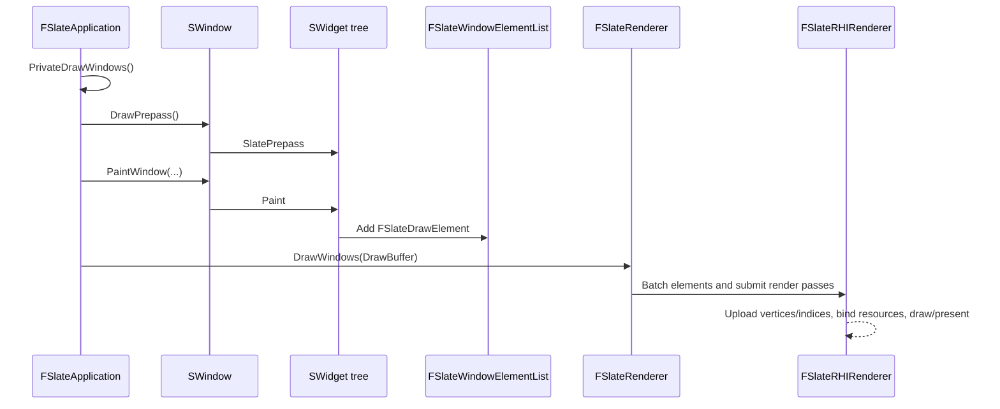

# Slate 渲染

Slate 的渲染目标不是让每个控件直接提交 GPU draw call，而是让控件树先生成与平台无关的绘制元素，再由渲染器统一批处理和提交。这样控件只需描述“画什么”，而 `FSlateRenderer` 的具体实现负责“如何画到窗口或纹理”。

## 一帧的主路径

在 `FSlateApplication::PrivateDrawWindows` 中，应用先调用 `DrawPrepass`，再从 `FSlateRenderer` 获取 `FSlateDrawBuffer`。每个需要绘制的 `SWindow` 都有一个 `FSlateWindowElementList`；应用调用 `SWindow::PaintWindow`，由窗口根控件生成绘制元素。元素列表填充完毕后，应用调用 `FSlateRenderer::DrawWindows`。运行时通常使用 `FSlateRHIRenderer`，它将工作转交到渲染线程和 Render Graph 相关通道。

## 从 Widget 到 Draw Element

`SWidget::Paint` 是所有控件绘制的非虚入口。它负责通用前置/后置逻辑：可见性、裁剪栈、渲染变换、样式继承、失效缓存和 volatile 控件处理；最终调用派生类的 `OnPaint`。

`OnPaint` 不直接操作 RHI。控件根据 `AllottedGeometry`、`FWidgetStyle` 和当前 `LayerId`，调用 `FSlateDrawElement` 的静态函数向 `FSlateWindowElementList` 添加元素，例如：

- `MakeBox`：画 Brush、边框和九宫格等盒模型。
- `MakeText` / `MakeShapedText`：画文本字形。
- `MakeLines`：画线段。
- `MakeCustom`：在确有需要时插入自定义绘制。

元素携带几何信息、Brush/字体等资源、颜色、不透明度、裁剪状态、绘制效果和层级。`LayerId` 决定同一窗口内的前后顺序；父控件通常把子控件绘制在更高层，`OnPaint` 返回已使用的最大层级。

## 布局如何影响绘制

绘制前，`SlatePrepass` 自底向上收集期望尺寸：父控件先让子控件完成 Prepass，再通过 `ComputeDesiredSize` 得出自己的尺寸。绘制时，父控件根据已分配的 `FGeometry` 在 `OnArrangeChildren` 中生成 `FArrangedChildren`，每一项是“子控件 + 已计算的几何信息”。`OnPaint` 用这些结果递归调用子控件的 `Paint`。

`FGeometry` 包含局部尺寸以及累计布局/渲染变换。布局变换决定控件的位置和大小；渲染变换可在布局完成后进一步旋转、缩放或平移，不会改变父控件的布局分配。裁剪状态会随控件树向下传递，并在元素中保留，必要时使用 scissor 或 stencil 裁剪。

## 批处理与 GPU 提交

`FSlateWindowElementList` 收集一整个窗口的未缓存元素以及失效缓存元素。`FSlateElementBatcher::AddElements` 把元素转换为顶点/索引数据和 `FSlateRenderBatch`。只有资源、着色器、绘制效果、图元类型、裁剪状态等批次键兼容的元素才能合并；层级和裁剪通常会限制合批。

批处理完成后，`FSlateRHIRenderer::DrawWindows` 准备每个窗口的绘制输入；渲染线程上的 `DrawWindows_RenderThread` 和 `DrawWindow_RenderThread` 上传缓冲区、绑定纹理/字体图集和 Slate shader，并执行最终的 RHI 绘制与窗口呈现。文本和图片资源会经由字体缓存、Brush 资源和图集系统管理，而不是由每个控件独立创建 GPU 资源。

## 失效缓存与性能

Slate 的性能关键在于减少需要重新生成的控件和元素，而不仅是减少 draw call：

- `EInvalidateWidgetReason::Layout` 会导致尺寸或排列结果重新计算，代价通常高于仅重绘。
- `EInvalidateWidgetReason::Paint` 只要求重新生成绘制元素。
- 失效根会缓存未变化控件的元素；变化的子树才会重新生成并更新缓存。
- `ForceVolatile` 或动态易变控件会每帧绘制，适合动画或频繁变化的内容，但不应滥用。
- 减少不必要的层级、裁剪切换、动态 Brush/字体资源和频繁的布局失效，通常比微调单个 `OnPaint` 更有效。

## 源码入口

- `Slate/Private/Framework/Application/SlateApplication.cpp`：`FSlateApplication::PrivateDrawWindows`，帧级绘制调度。
- `SlateCore/Private/Widgets/SWidget.cpp`：`SlatePrepass`、`Paint` 与 `Prepass_Internal`。
- `SlateCore/Public/Rendering/DrawElements.h`：窗口元素列表与绘制元素缓存。
- `SlateCore/Private/Rendering/ElementBatcher.cpp`：`FSlateElementBatcher::AddElements`，元素到批次的转换。
- `SlateRHIRenderer/Private/SlateRHIRenderer.cpp`：`FSlateRHIRenderer::DrawWindows` 和渲染线程提交。