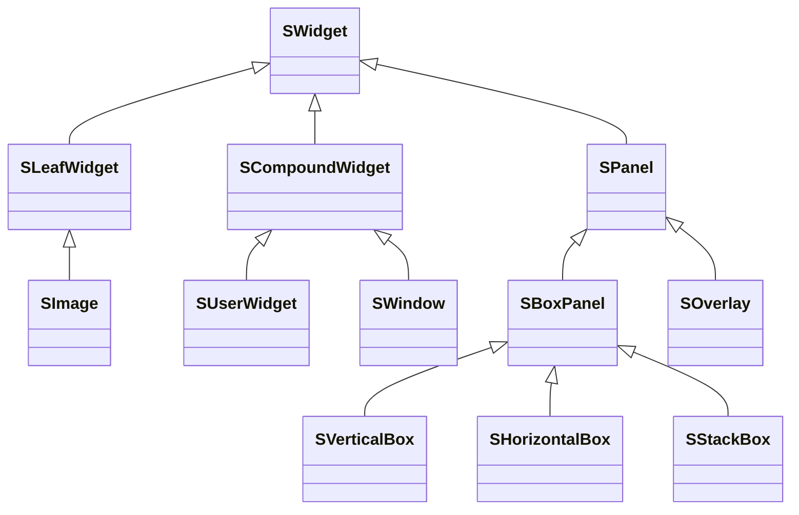
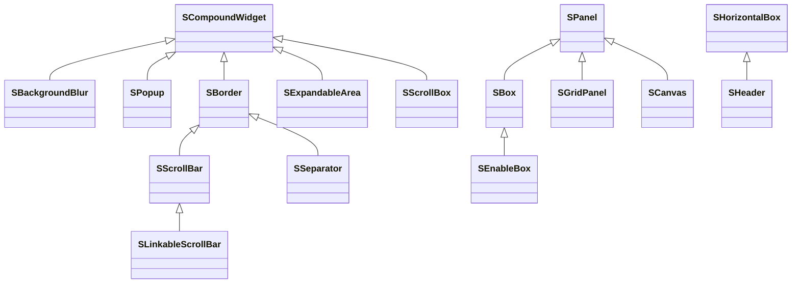
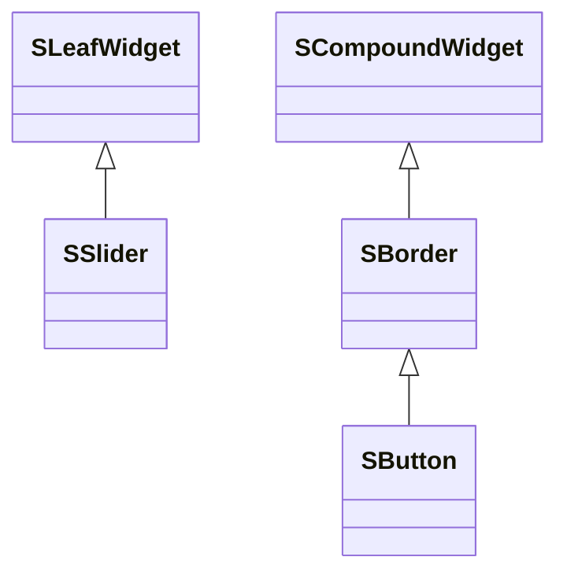
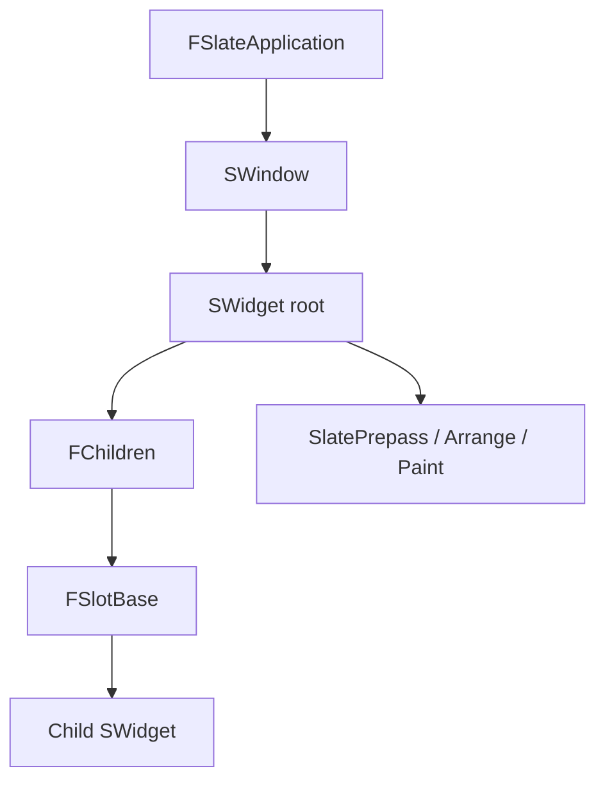

# Slate UI Widget

Slate UI 由两个 Modules 组成：
1. `SlateCore` 是 Slate UI 的核心模块，提供了最基础的 UI 类型和功能 
2. `Slate` 是对 `SlateCore` 的扩展，提供了更多的 UI 控件（Widget）类型。

在 `SlateCore` 中，定义了 Slate UI 最基础的类 —— `SWidget` 及其基础派生类：

`SWidget` 是所有 Slate UI 控件的基类。它定义控件的可见性、启用状态、裁剪、渲染变换、属性注册、失效、命中测试以及布局/绘制的统一入口；派生类主要实现 `ComputeDesiredSize`、`OnArrangeChildren` 和 `OnPaint`。

`SCompoundWidget` 是 Slate 里最常用的派生基类之一。它拥有唯一的 `ChildSlot`，适合表示“有一个根槽位，内部再包一棵子树”的控件；`SBorder` 是典型例子。

`SLeafWidget` 没有子树，适用于直接产生绘制元素的控件，如 `SImage`、`SSlider`。

`SPanel` 适合实现真正的“容器型布局控件”，例如垂直排列、水平排列、网格、Overlay 等。`SVerticalBox`、`SHorizontalBox`、`SOverlay` 这类控件，本质上都属于“管理多个子控件布局”的范畴。你只有在默认容器不满足需求时，才需要自己写 `SPanel` 子类。

`SWindow` 是顶层容器，既承载 Slate 控件树，也可对应平台原生窗口。它是应用层绘制、命中测试和渲染目标管理的边界，并不只是普通的 `SCompoundWidget`。

在 `Slate` 中，定义了更多的 UI 控件类型。大致分为如下几类：

1. 布局 Layout：`SBorder`、`SBox`、`SScrollBar`
2. 输入 Input：`SButton`，`SCheckBox`，`SSlider`
3. 文本 Text：
4. 视图 View：`SListView`、`STreeView`
5. 颜色 Color
6. 图像 Image
7. 其他 Other：`SDockTab`，`SBreadcrumbTrail`

这些分类是使用上的概览，不是严格的继承层级。例如 `SScrollBar` 是 `SBorder` 的派生类，而 `SScrollBox` 是独立的复合控件；二者都与滚动有关，但承担的布局职责不同。

### 布局类型

### 输入类型

### 自定义控件的选择

| 需求 | 优先选择 | 原因 |
|-|-|-|
| 包装一个已有控件树 | `SCompoundWidget` | 单一 `ChildSlot` 足够，代码最小。 |
| 绘制一个没有子控件的元素 | `SLeafWidget` | 只需实现尺寸计算和 `OnPaint`。 |
| 管理多个子控件并自定义排列规则 | `SPanel` | 可定义 Slot 类型，并在 `OnArrangeChildren` 中计算每个子控件几何信息。 |
| 仅调整单个子控件的尺寸、对齐或填充 | `SBox`、`SBorder` 等现有控件 | 复用既有 Slot 布局和失效逻辑。 |

自定义控件一般在头文件中用 `SLATE_BEGIN_ARGS` 声明参数，并实现 `Construct(const FArguments&)`。`Construct` 应保存属性、绑定事件和组装子树；布局规则写在 `ComputeDesiredSize`/`OnArrangeChildren`，绘制规则写在 `OnPaint`。不要在 `OnPaint` 中改变控件树或做昂贵的资源加载，因为它可能被频繁调用。

### 关键关系

Slot 是父控件拥有的布局记录，而不是独立存在的 UI 元素。它保存子控件引用及边距、对齐、填充比例等信息；父控件依据这些信息排列子控件。`FChildren` 为控件暴露可遍历的子项集合，供 Prepass、布局、绘制和命中测试共同使用。