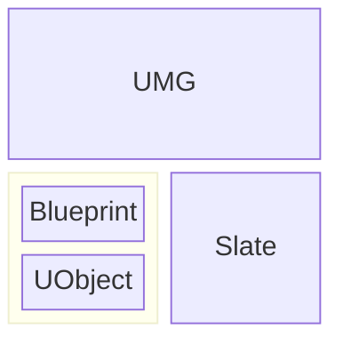
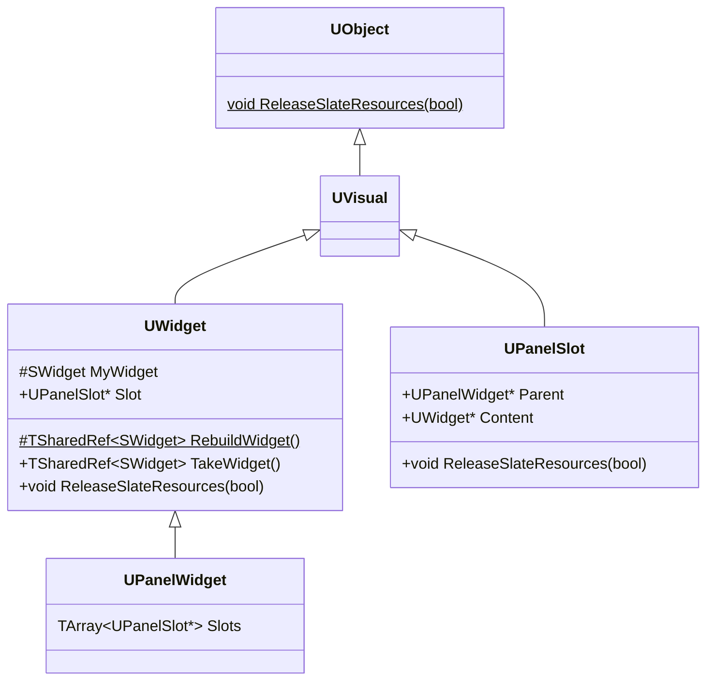
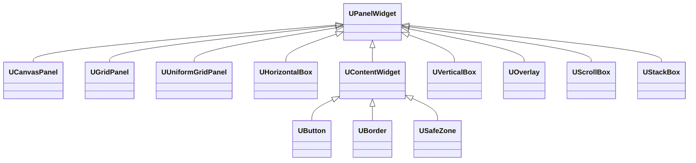
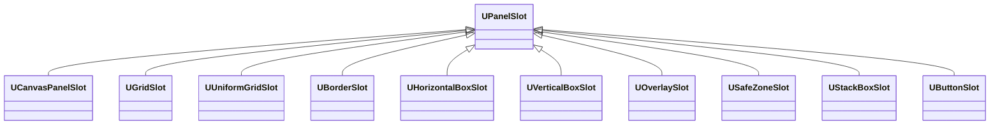
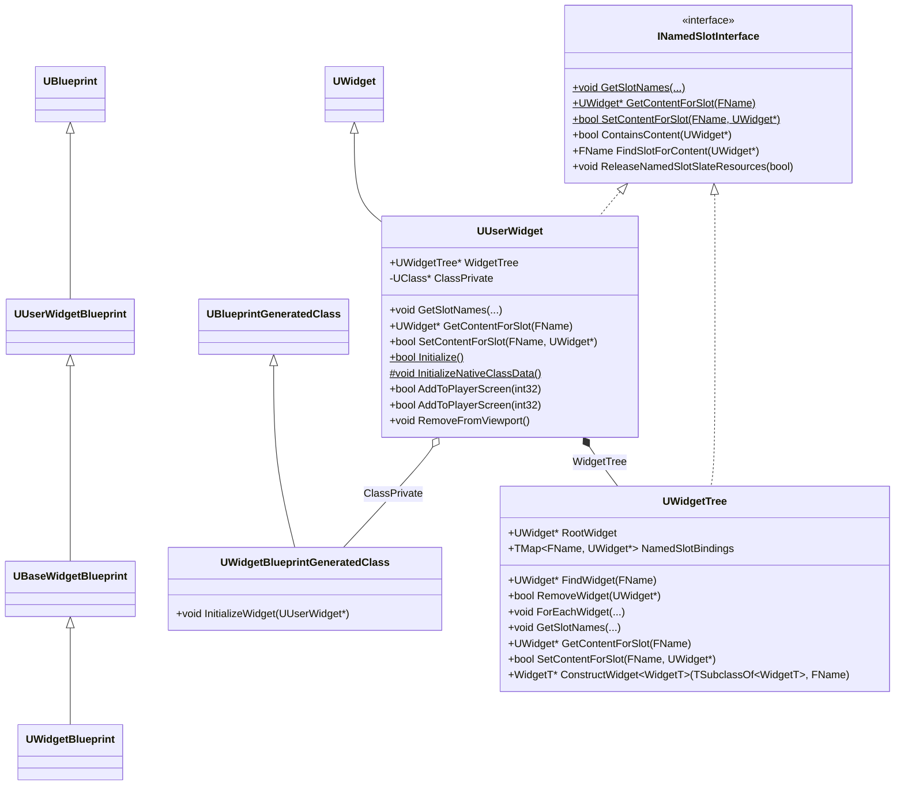
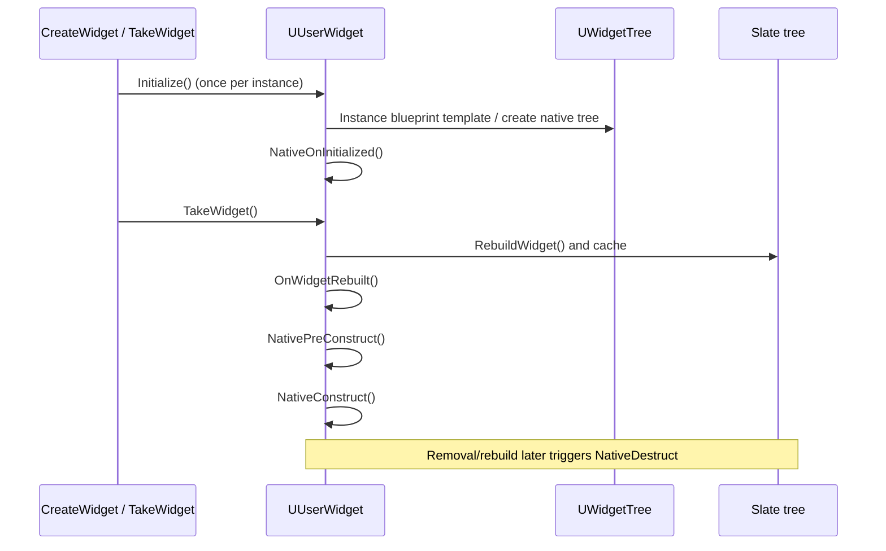
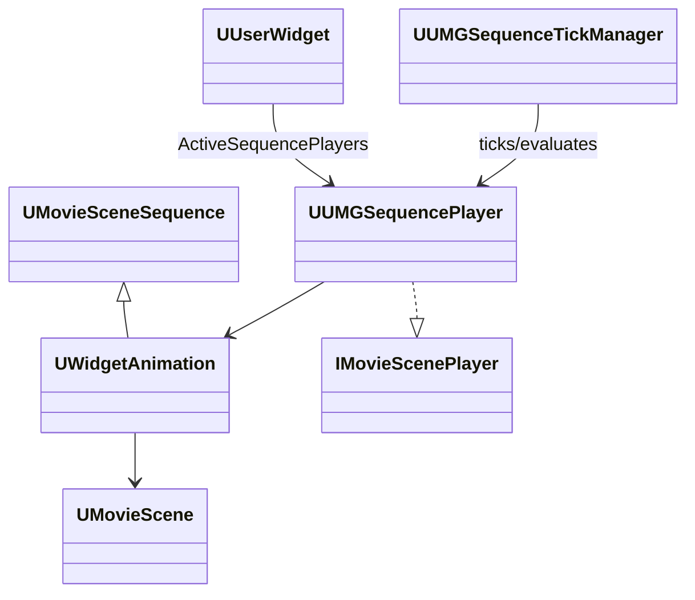

# UMG

UMG（Unreal Motion Graphics）是 Unreal Engine 面向游戏运行时 UI 的框架，允许开发者使用蓝图和 C++ 创建 HUD、菜单和交互界面。

UMG 建立在 UObject、Blueprint 和 Slate 之上，UObject 提供反射、序列化和垃圾回收功能，Blueprint 提供可视化编辑和脚本功能，Slate 提供底层的布局、渲染和输入交互功能



## UMG 与 Slate



每个作为面板子项的 `UWidget` 持有 `UWidget::Slot`；该 `UPanelSlot` 再通过 `Parent` 指向父 `UPanelWidget`。根控件和命名 Slot 中的内容不一定拥有普通的 `UPanelSlot`。

### UWidget

`UWidget` 是所有 UMG 控件的基类，但它不继承 `SWidget`，而是一个 UObject。它保存能被反射、序列化、蓝图和 GC 管理的状态；Slate Widget 则是运行时的呈现对象。

`UWidget::TakeWidget()` 是 UObject 层进入 Slate 的入口。如果 `MyWidget` 尚未有效，它调用 `RebuildWidget()` 并缓存结果，然后调用 `SynchronizeProperties()` 将 UMG 属性推送到该 Slate 控件。之后的调用复用缓存的 Slate 对象，而不会重建整棵树。对于 `UUserWidget`，`TakeWidget_Private` 会把其内容包装为 `SObjectWidget`，使仍在 Slate 树中的用户控件不会被 UObject GC 回收；设计器模式下还可能再加一层预览包装。

`UWidget::RebuildWidget()` 是 `UWidget` 的核心虚函数，用于构建 Slate Widget。其实现如下：

```cpp
TSharedRef<SWidget> UWidget::RebuildWidget()
{
    ensureMsgf(false, TEXT("You must implement RebuildWidget() in your child class"));
    return SNew(SSpacer);
}
```

具体地，`USpacer` 的 `RebuildWidget` 函数实现如下：

```cpp
TSharedRef<SWidget> USpacer::RebuildWidget()
{
    MySpacer = SNew(SSpacer)
        .Size(Size);

    return MySpacer.ToSharedRef();
}
```

`RebuildWidget` 只负责创建 Slate 对象与初始树结构。运行期属性变更应优先在 `SynchronizeProperties()`、对应 Setter 或 Slot 的 `SynchronizeProperties()` 中推送到现有 Slate 对象；需要改变结构时才释放资源并重建。

### UPanelWidget 与 UPanelSlot

`UPanelWidget` 继承自 `UWidget`，是所有 UMG 容器类控件的基类。继承 `UPanelWidget`，实现不同的组件容器。



在 UMG 中，只有继承自 `UPanelWidget` 的控件，才能拥有子控件，而直接继承自 `UWidget` 的控件则不能拥有子控件：


`UPanelSlot` 是构建 UMG Widget 父子关系的桥梁，每个 `UPanelWidget` 都会持有一组 `UPanelSlot`，通过 `UPanelWidget::Slots` 间接引用子 `UWidget`，而每个 `UWidget` 也会通过 `UWidget::Slot` 间接引用父 `UPanelWidget`。`UPanelSlot` 还决定子 `UWidget` 在父 `UPanelWidget` 中的布局方式。通过继承 `UPanelSlot`，可以实现不同容器的布局方式。



> `UPanelSlot` 类似于 Slate UI 中的 Slot，但它们不是同一个层面的概念。`UPanelSlot` 是 UObject 层的可编辑、可序列化布局对象；具体面板在自己的 `RebuildWidget`、`OnSlotAdded` 和 `OnSlotRemoved` 中，把它的属性同步到相应的 Slate Slot。例如 `UVerticalBoxSlot` 对应 `SVerticalBox::FSlot`。这个转换不是由基类 `UWidget::RebuildWidget()` 统一完成的。

运行时调用 `UPanelWidget::AddChild` 时，面板会先将子控件从旧父控件移除，创建正确类型的 `UPanelSlot`，同时建立 `Slot`、`Parent` 与 `Content` 的双向关系，再调用 `OnSlotAdded` 更新已经存在的 Slate 容器。移除时则调用 `OnSlotRemoved`、释放子树的 Slate 资源并触发布局/易变性失效。`InsertChildAt` 不会更新已存在的 Slate 版本，需要重建 UI 才能显示顺序变化。

`UPanelSlot` 重写了的 `ReleaseSlateResources()` 函数实现如下，以便沿 UI 树，释放 Slate UI 资源：

```cpp
void UPanelSlot::ReleaseSlateResources(bool bReleaseChildren)
{
    Super::ReleaseSlateResources(bReleaseChildren);

    // ReleaseSlateResources for Content unless the content is a UUserWidget as they are responsible for releasing their own content.
    if (Content && !Content->IsA<UUserWidget>())
    {
        Content->ReleaseSlateResources(bReleaseChildren);
    }
}
```

## UMG 与 Blueprint



### UUserWidget 与 UWidgetTree


`UWidgetTree` 是 UObject 层面的 UI 树，它保存根 `RootWidget`、命名 Slot 绑定及对控件的遍历、查找、构造和移除接口。普通遍历不会进入嵌套 `UUserWidget` 的外部 WidgetTree；`ForEachWidgetAndDescendants` 才会跨越这个边界。

`UUserWidget` 是 `UWidget` 最重要的派生类，是用户创建的 UI 基类。


`UUserWidget` 内部拥有一个 WidgetTree。在 `RebuildWidget()` 时，它确保实例已初始化，将有效的 Player Context 传递给嵌套 `UUserWidget`，并以 `RootWidget->TakeWidget()` 作为自己的 Slate 内容；空树时返回 `SSpacer`：

```cpp
TSharedRef<SWidget> UUserWidget::RebuildWidget()
{
	check(!HasAnyFlags(RF_ClassDefaultObject | RF_ArchetypeObject));
	
	// In the event this widget is replaced in memory by the blueprint compiler update
	// the widget won't be properly initialized, so we ensure it's initialized and initialize
	// it if it hasn't been.
	if ( !bInitialized )
	{
		Initialize();
	}

	// Setup the player context on sub user widgets, if we have a valid context
	if (PlayerContext.IsValid())
	{
		WidgetTree->ForEachWidget([&] (UWidget* Widget) {
			if ( UUserWidget* UserWidget = Cast<UUserWidget>(Widget) )
			{
				UserWidget->SetPlayerContext(PlayerContext);
			}
		});
	}

	// Add the first component to the root of the widget surface.
	TSharedRef<SWidget> UserRootWidget = WidgetTree->RootWidget ? WidgetTree->RootWidget->TakeWidget() : TSharedRef<SWidget>(SNew(SSpacer));

	return UserRootWidget;
}
```

在 `UUserWidget::Initialize()` 初始化函数中，可以看到 WidgetTree 的初始化：

```cpp
bool UUserWidget::Initialize()
{
    // If it's not initialized initialize it, as long as it's not the CDO, we never initialize the CDO.
    if (!bInitialized && !HasAnyFlags(RF_ClassDefaultObject))
    {
        // If this is a sub-widget of another UserWidget, default designer flags and player context to match those of the owning widget
        if (UUserWidget* OwningUserWidget = GetTypedOuter<UUserWidget>())
        {
    #if WITH_EDITOR
            SetDesignerFlags(OwningUserWidget->GetDesignerFlags());
    #endif
            SetPlayerContext(OwningUserWidget->GetPlayerContext());
        }

        UWidgetBlueprintGeneratedClass* BGClass = Cast<UWidgetBlueprintGeneratedClass>(GetClass());
        // Only do this if this widget is of a blueprint class
        if (BGClass)
        {
            BGClass->InitializeWidget(this);
        }
        else
        {
            InitializeNativeClassData();
        }

        if ( WidgetTree == nullptr )
        {
            WidgetTree = NewObject<UWidgetTree>(this, TEXT("WidgetTree"), RF_Transient);
        }
        else
        {
            WidgetTree->SetFlags(RF_Transient);

            InitializeNamedSlots();
        }

        // For backward compatibility, run the initialize event on widget that doesn't have a player context only when the class authorized it.
        bool bClassWantsToRunInitialized = BGClass && BGClass->bCanCallInitializedWithoutPlayerContext;
        if (!IsDesignTime() && (PlayerContext.IsValid() || bClassWantsToRunInitialized))
        {
            NativeOnInitialized();
        }

        bInitialized = true;
        return true;
    }

    return false;
}

void UUserWidget::InitializeNamedSlots()
{
    for (const FNamedSlotBinding& Binding : NamedSlotBindings )
    {
        if ( UWidget* BindingContent = Binding.Content )
        {
            FObjectPropertyBase* NamedSlotProperty = FindFProperty<FObjectPropertyBase>(GetClass(), Binding.Name);
    #if !WITH_EDITOR
            // In editor, renaming a NamedSlot widget will cause this ensure in UpdatePreviewWidget of widget that use that namedslot
            ensure(NamedSlotProperty);
    #endif
            if ( NamedSlotProperty ) 
            {
                UNamedSlot* NamedSlot = Cast<UNamedSlot>(NamedSlotProperty->GetObjectPropertyValue_InContainer(this));
                if ( ensure(NamedSlot) )
                {
                    NamedSlot->ClearChildren();
                    NamedSlot->AddChild(BindingContent);
                }
            }
        }
    }
}
```

`UUserWidget` 和 WidgetTree 在 [UMG 界面设计器（Unreal Motion Graphics UI Designer）](https://dev.epicgames.com/documentation/unreal-engine/umg-ui-designer-quick-start-guide-in-unreal-engine?application_version=5.5)中编辑。

### 实例初始化与生命周期

蓝图 `UUserWidget` 的 `Initialize()` 会调用 `UWidgetBlueprintGeneratedClass::InitializeWidget(this)`，据模板实例化 WidgetTree、绑定 `BindWidget`/`BindWidgetAnim` 等生成的数据，并初始化子 `UUserWidget`。纯 C++ 类则走 `InitializeNativeClassData()`；无模板树时会创建一个空的 transient `UWidgetTree`。

需要区分一次性的初始化与可能多次发生的构造：



- `NativeOnInitialized`：实例初始化完成后的单次入口，适合一次性绑定。
- `NativePreConstruct`：构造期间调用，在设计器中也可能执行，用于让编辑器预览属性。
- `NativeConstruct`：Slate 树可用后调用；控件被移除再加入、或资源重建时可再次调用。
- `NativeDestruct`：对应运行期 Slate 构造的拆除。不要把只能执行一次的逻辑放在 `Construct`。

`AddToViewport` 与 `AddToPlayerScreen` 会通过 `UGameViewportSubsystem` 把 `UUserWidget` 挂到游戏视口；后者要求存在 Owning Local Player，并添加到玩家对应的层。移除应使用 `RemoveFromParent()`；`RemoveFromViewport()` 已被弃用。

## UMG 与 C++

自定义 UMG 控件通常有两种层次：

1. **包装已有 Slate 控件**：继承 `UWidget`，在 `RebuildWidget` 创建 `SNew(SMyWidget)`，把 `TSharedPtr<SMyWidget>` 保存在成员中；在 `SynchronizeProperties` 和 Setter 中把 UObject 属性同步到它。
2. **实现容器**：继承 `UPanelWidget`，定义相应的 `UPanelSlot` 子类，并在 `OnSlotAdded` / `OnSlotRemoved` 中更新底层 Slate Panel。只有确实需要新的多子项布局策略时才这样做。

最小包装控件的结构如下：

```cpp
UCLASS()
class UMyWidget : public UWidget
{
    GENERATED_BODY()

public:
    UPROPERTY(EditAnywhere, BlueprintReadWrite, Category = "Content")
    FText Label;

protected:
    virtual TSharedRef<SWidget> RebuildWidget() override
    {
        MySlateWidget = SNew(STextBlock);
        return MySlateWidget.ToSharedRef();
    }

    virtual void SynchronizeProperties() override
    {
        Super::SynchronizeProperties();
        MySlateWidget->SetText(Label);
    }

private:
    TSharedPtr<STextBlock> MySlateWidget;
};
```

`MySlateWidget` 使用 `TSharedPtr`，因为 Slate 的生命周期由共享指针管理；在同步前应考虑它可能尚未构造或已因 `ReleaseSlateResources` 失效。UMG 的 `PROPERTY_BINDING` 宏可把蓝图动态委托转换为 Slate `TAttribute`，但高频绑定会参与 UI 更新，应优先使用字段通知、事件驱动更新或明确的 Setter 来缩小更新范围。

## UMG 与 Animation



UMG 动画建立在 MovieScene 上，而不是单独的一套插值系统：`UWidgetAnimation` 继承 `UMovieSceneSequence`，持有 `UMovieScene` 和 `FWidgetAnimationBinding` 数组。绑定记录把序列中的 Possessable 绑定到当前 `UUserWidget` 实例的目标控件，因此同一个 Widget Blueprint 动画可以用于不同实例。

`UUserWidget::PlayAnimation` 创建或复用 `UUMGSequencePlayer`，调用其 `InitSequencePlayer` 和 `Play`。播放器以 MovieScene 的帧率推进时间，支持正放、反放、PingPong、循环、播放速率与结束状态恢复；它通过 `FMovieSceneRootEvaluationTemplateInstance` 对 Track 求值，再把结果写回目标控件属性。

`UUMGSequenceTickManager` 注册到 `FSlateApplication::OnPreTick`/`OnPostTick`，集中推进可见且仍在构造状态的 `UUserWidget` 动画，并驱动 MovieScene Entity System Linker 的求值。动画完成后，播放器触发完成事件，`UUserWidget` 再转发 Blueprint/C++ 的开始和结束委托。`BindWidgetAnim` 可以将设计器内的动画引用绑定到 C++ 成员；运行期应通过 `PlayAnimation`、`StopAnimation` 等 `UUserWidget` API 控制，而不是直接修改 `UWidgetAnimation` 资源。

## 源码入口

- `UMG/Private/Components/Widget.cpp`：`TakeWidget`、`RebuildWidget`、属性同步和 Slate 资源释放。
- `UMG/Private/Components/PanelWidget.cpp`：面板子项、`UPanelSlot` 所有权与运行期增删。
- `UMG/Private/UserWidget.cpp`：`Initialize`、`RebuildWidget`、生命周期、视口和动画 API。
- `UMG/Private/WidgetBlueprintGeneratedClass.cpp`：蓝图 WidgetTree 实例化与生成绑定初始化。
- `UMG/Private/Animation/UMGSequencePlayer.cpp`、`UMGSequenceTickManager.cpp`：MovieScene 动画播放与统一 Tick。