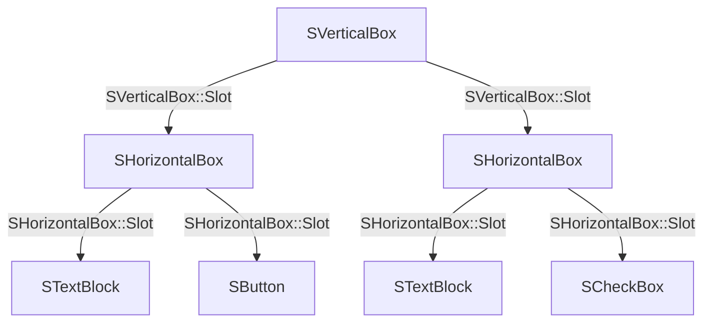
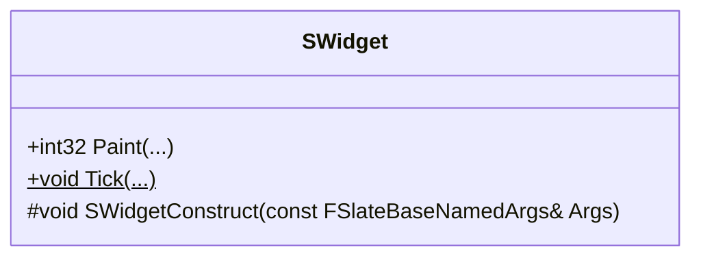
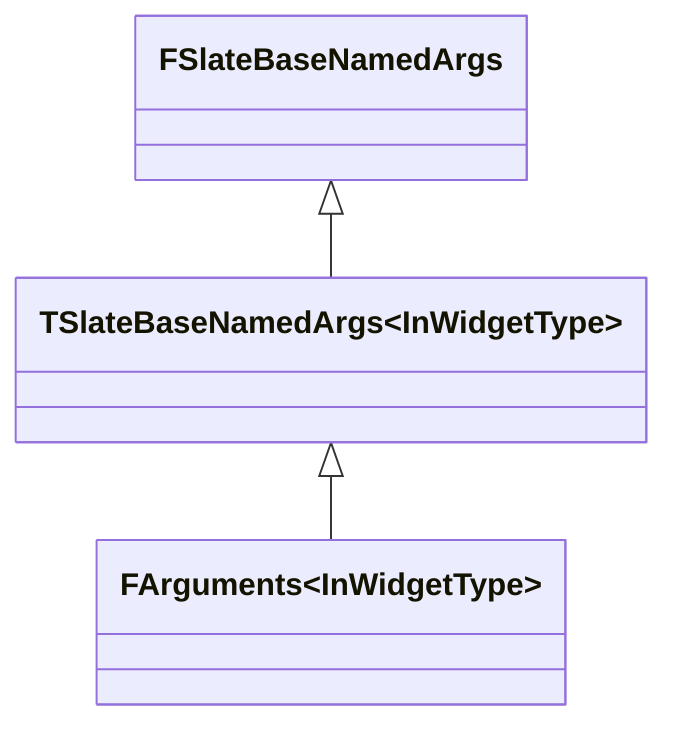
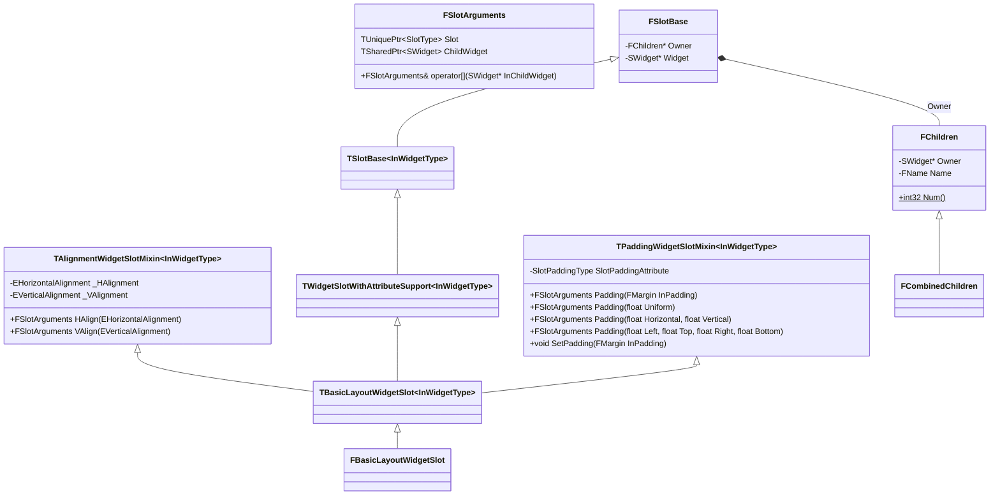
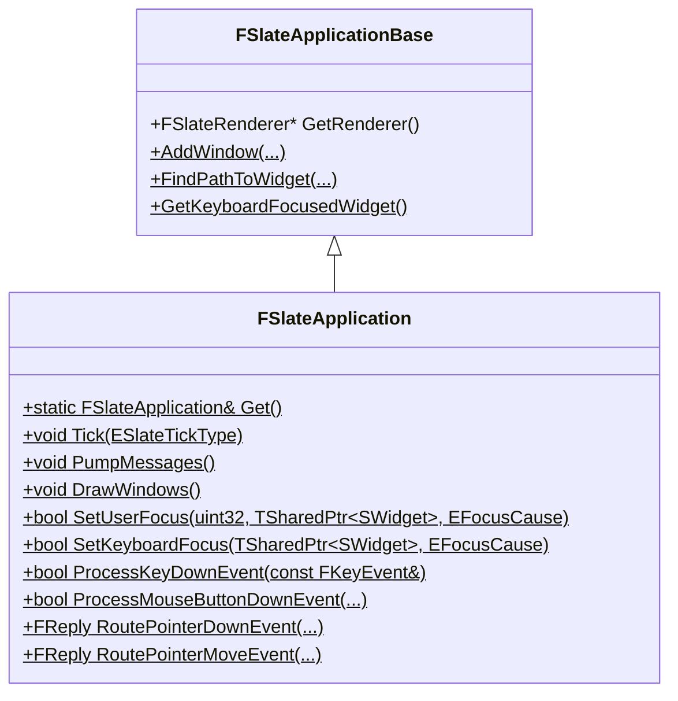
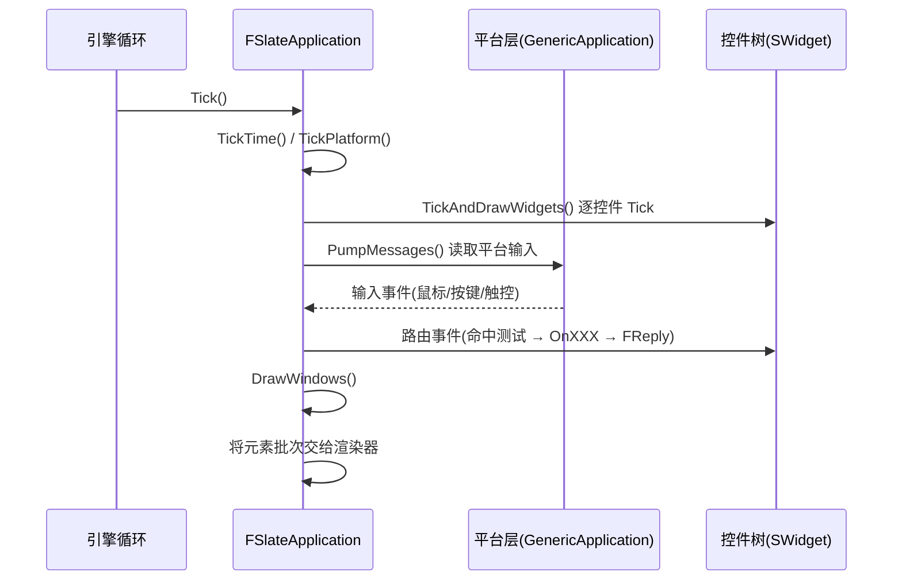
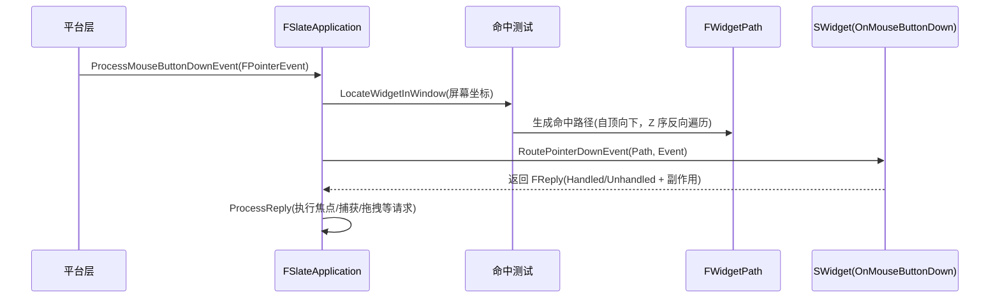
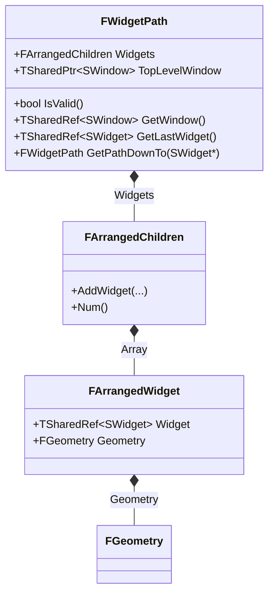
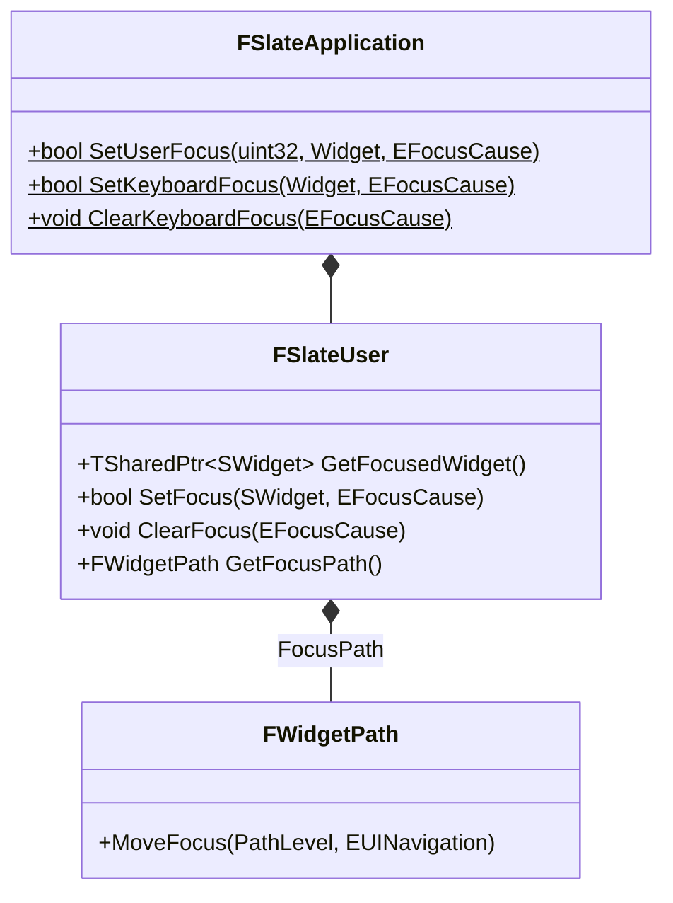
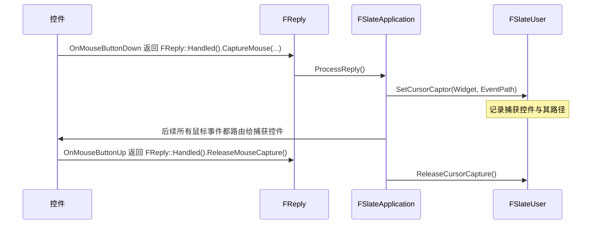

# Slate

## 语法

[Slate UI](https://dev.epicgames.com/documentation/unreal-engine/slate-user-interface-programming-framework-for-unreal-engine) 是 Unreal Engine 的底层 UI 框架，引擎的[编辑器界面](https://dev.epicgames.com/documentation/unreal-engine/slate-editor-window-quickstart-guide-for-unreal-engine)和游戏的 [UMG](https://dev.epicgames.com/documentation/unreal-engine/umg-editor-reference-for-unreal-engine) 都是基于 Slate UI 构建的。

一个 Slate UI 是一颗控件树，由两部分构成：
1. 控件 Widget
2. 槽位 Slot

其中，Widget 表示 UI 元素，比如：按钮、文本、图片等；Slot 表示 Widget 之间的父子关系与布局信息。比如在 UMG 中，Hierarchy 可视化了控件树的结构，Details 可视化了 Slot 的布局信息：


不管是 Widget 还是 Slot，都有参数属性。Slate UI 是一种**声明式 UI (Declarative UI)** 框架，其特点是将控件/槽位的声明与参数赋值放在一起描述。

Slate UI 是一种**声明式 UI (Declarative UI)** 框架，UE 通过 C++ 的宏，定义了一套 DSL (Domain Specific Language) 来描述 UI 的结构和行为，比如：
- `SNew`：声明（实例化）一个控件
- `SLATE_BEGIN_ARGS`：开始定义控件的参数属性
- `SLATE_END_ARGS`：结束定义控件的参数属性
- `SLATE_ARGUMENT`：定义控件的参数
- `SLATE_ATTRIBUTE`：定义控件的属性
- `SLATE_EVENT`：定义控件的事件
- `SLATE_SLOT_ARGUMENT`：定义控件的 Slot 参数

> 

声明式 UI 的特点是：是把“控件声明”和“参数属性”放在一起描述。在 Slate UI 中，通过 `SNew` 宏来声明一个控件，并通过链式调用的方式来配置控件的参数属性。控件之间的“父子关系”通过 Slot 来描述，父控件引用 Slot，Slot 引用子控件。使用 Slate UI 编写的 UI 代码如下：

```cpp
SNew(SVerticalBox)
+SVerticalBox::Slot()
.AutoHeight()
[
    SNew(SHorizontalBox)
    +SHorizontalBox::Slot()
    .VAlign(VAlign_Top)
    [
        SNew(STextBlock)
        .Text(FText::FromString("Test Button"))
    ]
    +SHorizontalBox::Slot()
    .VAlign(VAlign_Top)
    [
        SNew(SButton)
        .Text(FText::FromString("Press Me"))
    ]
]
+SVerticalBox::Slot()
.AutoHeight()
[
    SNew(SHorizontalBox)
    +SHorizontalBox::Slot()
    .VAlign(VAlign_Top)
    [
        SNew(STextBlock)
        .Text(FText::FromString("Test Checkbox"))
    ]
    + SHorizontalBox::Slot()
    .VAlign(VAlign_Top)
    [
        SNew(SCheckBox)
    ]
]
```

Slate UI 的语法宏定义在 `Runtime/SlateCore/Public/Widgets/DeclarativeSyntaxSupport.h` 文件中，其中：
- 宏 `SNew` 声明一个 Widget，紧随其后的 `.XXX(...)` 函数用于设置 Widget 的参数属性
- `+SVerticalBox::Slot()` 声明一个 Slot，紧随其后的 `.XXX(...)` 函数用于设置 Slot 的参数属性，`operator[]` 操作符用于设置 Widget 的子控件

声明式 UI 的优点是：能直接从代码中读出控件树的结构、控件之间的嵌套关系和每层控件/槽位的参数属性。上述代码得到的控件树结构如下：



编译后得到的编辑器窗口如下：


## 控件

控件是构建 Slate UI 的基本单元，所有 Slate UI 的控件都继承自 `SWidget`



`SWidget` 的成员 | 描述
-|-
`SWidgetConstruct(...)` | 传入参数，构造控件

### 控件的声明

`SNew` 是创建 Slate UI 控件的宏，用于声明和初始化控件实例，其定义如下：

```cpp
#define SNew( WidgetType, ... ) \
	MakeTDecl<WidgetType>( #WidgetType, __FILE__, __LINE__, RequiredArgs::MakeRequiredArgs(__VA_ARGS__) ) <<= TYPENAME_OUTSIDE_TEMPLATE WidgetType::FArguments()

```

其中，`MakeTDecl` 是一个模板函数，定义为：

```cpp
template<typename WidgetType, typename RequiredArgsPayloadType>
TSlateDecl<WidgetType, RequiredArgsPayloadType> MakeTDecl( const ANSICHAR* InType, const ANSICHAR* InFile, int32 OnLine, RequiredArgsPayloadType&& InRequiredArgs )
{
	LLM_SCOPE_BYTAG(UI_Slate);
	return TSlateDecl<WidgetType, RequiredArgsPayloadType>(InType, InFile, OnLine, Forward<RequiredArgsPayloadType>(InRequiredArgs));
}
```

`TSlateDecl` 是一个模板类，用于 Slate UI 控件的实例化：

```cpp
/**
 * Utility class used during widget instantiation.
 * Performs widget allocation and construction.
 * Ensures that debug info is set correctly.
 * Returns TSharedRef to widget.
 *
 * @see SNew
 * @see SAssignNew
 */
template<class WidgetType, typename RequiredArgsPayloadType>
struct TSlateDecl
{
    TSlateDecl( const ANSICHAR* InType, const ANSICHAR* InFile, int32 OnLine, RequiredArgsPayloadType&& InRequiredArgs )
        : _RequiredArgs(InRequiredArgs)
    {
        if constexpr (std::is_base_of_v<SUserWidget, WidgetType>)
        {
            /**
                * SUserWidgets are allocated in the corresponding CPP file, so that
                * the implementer can return an implementation that differs from the
                * public interface. @see SUserWidgetExample
                */
            _Widget = WidgetType::New();
        }
        else
        {
            /** Normal widgets are allocated directly by the TSlateDecl. */
            _Widget = MakeShared<WidgetType>();
        }

        _Widget->SetDebugInfo(InType, InFile, OnLine, sizeof(WidgetType));
    }

    /**
        * Initialize OutVarToInit with the widget that is being constructed.
        * @see SAssignNew
        */
    template<class ExposeAsWidgetType>
    TSlateDecl&& Expose( TSharedPtr<ExposeAsWidgetType>& OutVarToInit ) &&
    {
        // Can't move out _Widget here because operator<<= needs it
        OutVarToInit = _Widget;
        return MoveTemp(*this);
    }

    /**
        * Initialize OutVarToInit with the widget that is being constructed.
        * @see SAssignNew
        */
    template<class ExposeAsWidgetType>
    TSlateDecl&& Expose( TSharedRef<ExposeAsWidgetType>& OutVarToInit ) &&
    {
        // Can't move out _Widget here because operator<<= needs it
        OutVarToInit = _Widget.ToSharedRef();
        return MoveTemp(*this);
    }

    /**
        * Initialize a WEAK OutVarToInit with the widget that is being constructed.
        * @see SAssignNew
        */
    template<class ExposeAsWidgetType>
    TSlateDecl&& Expose( TWeakPtr<ExposeAsWidgetType>& OutVarToInit ) &&
    {
        // Can't move out _Widget here because operator<<= needs it
        OutVarToInit = _Widget.ToWeakPtr();
        return MoveTemp(*this);
    }

    /**
        * Complete widget construction from InArgs.
        *
        * @param InArgs  NamedArguments from which to construct the widget.
        *
        * @return A reference to the widget that we constructed.
        */
    TSharedRef<WidgetType> operator<<=( const typename WidgetType::FArguments& InArgs ) &&
    {
        _Widget->SWidgetConstruct(InArgs);
        _RequiredArgs.CallConstruct(_Widget.Get(), InArgs);
        _Widget->CacheVolatility();
        _Widget->bIsDeclarativeSyntaxConstructionCompleted = true;

        return MoveTemp(_Widget).ToSharedRef();
    }

    TSharedPtr<WidgetType> _Widget;
    RequiredArgsPayloadType& _RequiredArgs;
};
```

其中，`operator<<=` 是一个重载的运算符函数，用于将控件参数 `FArguments`，传递给控件的构造函数 `SWidget::SWidgetConstruct(...)`，并返回控件的指针 `TSharedRef<WidgetType>`。比如声明一个 `SButton` 控件，并设置它的 Text 参数，并设置 OnClick 回调：

```cpp
SNew(SButton)
.Text(FText::FromString("Press Me"))
.OnClicked(FOnClicked::CreateSP(this, &OnTestButtonClicked))
```

`SNew` 宏展开为：

```cpp
MakeTDecl<SButton>("SButton", "SLuaGameFrameworkWidget.cpp", 18, RequiredArgs::MakeRequiredArgs()) <<= SButton::FArguments()
.Text(FText::FromString("Press Me"))
.OnClicked(FOnClicked::CreateSP(this, &OnTestButtonClicked))
```

其中，`SButton::FArguments::Text(...)` 和 `SButton::FArguments::OnClicked(...)` 是 `SButton` 的参数属性，`operator<<=` 将这些参数传递给 `SButton::SWidgetConstruct(...)`，完成控件的构造。下面详细介绍控件的参数。

### 控件参数

控件构造函数 `SWidget::SWidgetConstruct(FSlateBaseNamedArgs&)` 接受的参数是 `FSlateBaseNamedArgs` 及其派生类：



在 `SWidget` 的派生类中，可以通过 `SLATE_BEGIN_ARGS` 和 `SLATE_END_ARGS` 宏，定义一个派生类 `FArguments`，并在其中自定义控件的参数属性。

```cpp
/**
 * Widget authors can use SLATE_BEGIN_ARGS and SLATE_END_ARS to add support
 * for widget construction via SNew and SAssignNew.
 * e.g.
 * 
 *    SLATE_BEGIN_ARGS( SMyWidget )
 *         , _PreferredWidth( 150.0f )
 *         , _ForegroundColor( FLinearColor::White )
 *         {}
 *
 *         SLATE_ATTRIBUTE(float, PreferredWidth)
 *         SLATE_ATTRIBUTE(FSlateColor, ForegroundColor)
 *    SLATE_END_ARGS()
 */

#define SLATE_BEGIN_ARGS( InWidgetType ) \
	public: \
	struct FArguments : public TSlateBaseNamedArgs<InWidgetType> \
	{ \
		typedef FArguments WidgetArgsType; \
		typedef InWidgetType WidgetType; \
		FORCENOINLINE FArguments()

#define SLATE_END_ARGS() \
	};
```

比如在 `SImage` 中：

```cpp
class SImage
	: public SLeafWidget
{
    SLATE_DECLARE_WIDGET_API(SImage, SLeafWidget, SLATECORE_API)

    public:
    SLATE_BEGIN_ARGS( SImage )
        : _Image( FCoreStyle::Get().GetDefaultBrush() )
        , _ColorAndOpacity( FLinearColor::White )
        , _FlipForRightToLeftFlowDirection( false )
        { }

        /** Image resource */
        SLATE_ATTRIBUTE(const FSlateBrush*, Image)

        /** Color and opacity */
        SLATE_ATTRIBUTE(FSlateColor, ColorAndOpacity)

        /** When specified, ignore the brushes size and report the DesiredSizeOverride as the desired image size. */
        SLATE_ATTRIBUTE(TOptional<FVector2D>, DesiredSizeOverride)

        /** Flips the image if the localization's flow direction is RightToLeft */
        SLATE_ARGUMENT( bool, FlipForRightToLeftFlowDirection )

        /** Invoked when the mouse is pressed in the widget. */
        SLATE_EVENT(FPointerEventHandler, OnMouseButtonDown)
    SLATE_END_ARGS()

    ...
}
```

那么这个宏展开为：

```cpp
class SImage
	: public SLeafWidget
{
    SLATE_DECLARE_WIDGET_API(SImage, SLeafWidget, SLATECORE_API)

    public:
    public:
    struct FArguments : public TSlateBaseNamedArgs<SImage>
    {
        typedef FArguments WidgetArgsType;
        typedef SImage WidgetType;
        __declspec(noinline) FArguments()
        { }

        /** Image resource */
        SLATE_ATTRIBUTE(const FSlateBrush*, Image)

        /** Color and opacity */
        SLATE_ATTRIBUTE(FSlateColor, ColorAndOpacity)

        /** When specified, ignore the brushes size and report the DesiredSizeOverride as the desired image size. */
        SLATE_ATTRIBUTE(TOptional<FVector2D>, DesiredSizeOverride)

        /** Flips the image if the localization's flow direction is RightToLeft */
        SLATE_ARGUMENT( bool, FlipForRightToLeftFlowDirection )

        /** Invoked when the mouse is pressed in the widget. */
        SLATE_EVENT(FPointerEventHandler, OnMouseButtonDown)
    };

    ...
};
```

其中，通过如下的宏，为 `FArguments` 定义控件的参数属性：
- `SLATE_ATTRIBUTE` 为 `FArguments` 定义一个控件的属性，属性的类型可以是值，也可以是函数
- `SLATE_ARGUMENT` 为 `FArguments` 定义一个控件的参数，与 `SLATE_ATTRIBUTE` 的不同之处在于，`SLATE_ARGUMENT` 接受的参数只能是值
- `SLATE_ARGUMENT_DEFAULT` 为 `FArguments` 定义一个控件的参数，并支持设置默认值
- `SLATE_STYLE_ARGUMENT` 为 `FArguments` 定义一个控件的样式参数，与 `SLATE_ARGUMENT` 的不同之处在于，在为 `SLATE_ARGUMENT` 传递参数值时，通常会复制或移动对象，而 `SLATE_STYLE_ARGUMENT` 传递的是参数对象的只读指针，避免了不必要的拷贝开销
- `SLATE_EVENT` 为 `FArguments` 定义一个控件的事件
- `SLATE_SLOT_ARGUMENT` 为 `FArguments` 定义一个控件的槽位参数

> 这些宏只能在 `SLATE_BEGIN_ARGS` 和 `SLATE_END_ARGS` 之间使用

除了通过 `SLATE_BEGIN_ARGS` 定义一个 `FArguments` 外，还可以通过 `SLATE_USER_ARGS` 定义一个 `FUserArguments`：
```cpp
/**
 * Just like SLATE_BEGIN_ARGS but requires the user to implement the New() method in the .CPP.
 * Allows for widget implementation details to be entirely reside in the .CPP file.
 */
#define SLATE_USER_ARGS( WidgetType ) \
	public: \
	static TSharedRef<WidgetType> New(); \
	struct FArguments; \
	struct FArguments : public TSlateBaseNamedArgs<WidgetType> \
	{ \
		typedef FArguments WidgetArgsType; \
		FORCENOINLINE FArguments()
```

`SLATE_USER_ARGS` 不同于 `SLATE_BEGIN_ARGS` 的地方在于，`SLATE_USER_ARGS` 要求用户在 `.cpp` 文件中实现 `New()` 方法，而 `SLATE_BEGIN_ARGS` 不需要。

## 槽位

槽位 Slot 用于构建控件树的父子级关系。父控件并不直接引用子控件，而是通过 Slot 间接引用子控件。Slot 不仅持有子控件的引用，还保存了子控件相对父控件的布局 Layout 信息。在 UMG 的编辑器中，Slot 属性的底层，就是 Slate UI 的 Slot。


### 槽位声明

在 Slate UI 中，通过 `+WidgetType::Slot()` 来声明一个 Slot

```cpp
SNew(SVerticalBox)
+SVerticalBox::Slot()
.AutoHeight()
.Padding(5.0f)
.HAlign(HAlign_Center)
[
    SNew(STextBlock)
    .Text(FText::FromString(TEXT("Hello")))
]
```

通过宏 `SLATE_SLOT_ARGUMENT` 在`SLATE_BEGIN_ARGS` 和 `SLATE_END_ARGS` 之间定义一个槽位参数：

```cpp
/**
 * Use this macro between SLATE_BEGIN_ARGS and SLATE_END_ARGS
 * in order to add support for slots with the construct pattern.
 */
#define SLATE_SLOT_ARGUMENT( SlotType, SlotName ) \
    TArray<typename SlotType::FSlotArguments> _##SlotName; \
    WidgetArgsType& operator + (typename SlotType::FSlotArguments& SlotToAdd) \
    { \
        _##SlotName.Add( MoveTemp(SlotToAdd) ); \
        return static_cast<WidgetArgsType*>(this)->Me(); \
    } \
    WidgetArgsType& operator + (typename SlotType::FSlotArguments&& SlotToAdd) \
    { \
        _##SlotName.Add( MoveTemp(SlotToAdd) ); \
        return static_cast<WidgetArgsType*>(this)->Me(); \
    }
```

比如在 `SHorizontalBox` 中：

```cpp
/** A Horizontal Box Panel. See SBoxPanel for more info. */
class SHorizontalBox : public SBoxPanel
{
    SLATE_DECLARE_WIDGET_API(SHorizontalBox, SBoxPanel, SLATECORE_API)
public:
    class FSlot
    {
        ...
    };

    SLATE_BEGIN_ARGS( SHorizontalBox )
    {
        _Visibility = EVisibility::SelfHitTestInvisible;
    }
    SLATE_SLOT_ARGUMENT(SHorizontalBox::FSlot, Slots)
    SLATE_END_ARGS()
};
```
宏展开为：

```cpp
/** A Horizontal Box Panel. See SBoxPanel for more info. */
class SHorizontalBox : public SBoxPanel
{
    SLATE_DECLARE_WIDGET_API(SHorizontalBox, SBoxPanel, SLATECORE_API)
public:
    class FSlot
    {
        ...
    };

    public:
    struct FArguments : public TSlateBaseNamedArgs<SHorizontalBox>
    {
        typedef FArguments WidgetArgsType;
        typedef SHorizontalBox WidgetType;
        __declspec(noinline) FArguments()
        {
            _Visibility = EVisibility::SelfHitTestInvisible;
        }
        TArray<typename SHorizontalBox::FSlot::FSlotArguments> _Slots;
        WidgetArgsType& operator +(typename SHorizontalBox::FSlot::FSlotArguments& SlotToAdd)
        {
            _Slots.Add(MoveTemp(SlotToAdd));
            return static_cast<WidgetArgsType*>(this)->Me();
        }
        WidgetArgsType& operator +(typename SHorizontalBox::FSlot::FSlotArguments&& SlotToAdd)
        {
            _Slots.Add(MoveTemp(SlotToAdd));
            return static_cast<WidgetArgsType*>(this)->Me();
        }
    };
};
```

其中，`operator+` 为控件添加槽位。


### 槽位参数



`FSlotArguments` 是用于构造 Slot 的参数类：

```cpp
struct FSlotArguments
{
    ...
public:
    /** Attach the child widget the slot will own. */
    typename SlotType::FSlotArguments& operator[](TSharedRef<SWidget>&& InChildWidget)
    {
        ChildWidget = MoveTemp(InChildWidget);
        return Me();
    }
    typename SlotType::FSlotArguments& operator[](const TSharedRef<SWidget>& InChildWidget)
    {
        ChildWidget = InChildWidget;
        return Me();
    }

    /** Initialize OutVarToInit with the slot that is being constructed. */
    typename SlotType::FSlotArguments& Expose(SlotType*& OutVarToInit)
    {
        OutVarToInit = Slot.Get();
        return Me();
    }

    /** Used by the named argument pattern as a safe way to 'return *this' for call-chaining purposes. */
    typename SlotType::FSlotArguments& Me()
    {
        return static_cast<typename SlotType::FSlotArguments&>(*this);
    }

    ...
private:
    TUniquePtr<SlotType> Slot;
    TSharedPtr<SWidget> ChildWidget;
}
```

其中，`operator[]` 用于设置 Slot 的子控件。


## 应用与交互输入

Slate 的交互输入由 `Slate` 模块中的 `FSlateApplication` 负责。它是整个 Slate 应用的**单例入口**（通过 `FSlateApplication::Get()` 获取），继承自 `SlateCore` 中的抽象基类 `FSlateApplicationBase`，负责三大职责：

1. **主循环**：`Tick()`、`PumpMessages()`（消息泵）、`DrawWindows()`（绘制）
2. **输入路由**：把平台层（键盘/鼠标/触控/手柄）产生的输入事件，路由到控件树中命中的控件
3. **焦点与捕获管理**：维护键盘焦点、鼠标捕获、光标状态



### 主循环

`FSlateApplication` 的每一帧由引擎循环驱动，核心流程如下：



- `Tick(ESlateTickType)`：驱动整个应用的逻辑更新，其中 `TickAndDrawWidgets()` 会自顶向下调用每个控件的 `SWidget::Tick()`。
- `PumpMessages()`：从平台层 `GenericApplication` 读取消息队列，并转换成 Slate 的输入事件，再交给对应的 `ProcessXXXEvent` 处理。
- `DrawWindows()`：遍历所有可见窗口，触发控件树的 `Paint` 流程，最后把渲染批次交给 `FSlateRenderer` 提交 GPU。

### 输入事件

平台输入被转换成 Slate 的输入事件对象，作为参数传入控件的事件处理器：

| 事件类 | 描述 |
|-|-|
| `FPointerEvent` | 鼠标/触控指针事件（按下、抬起、移动、滚轮） |
| `FKeyEvent` | 键盘按键事件 |
| `FCharacterEvent` | 字符输入事件 |
| `FFocusEvent` | 焦点变化事件（含 `EFocusCause` 与 `UserIndex`） |
| `FNavigationEvent` | 导航事件（方向键、Tab、手柄 DPad） |
| `FAnalogInputEvent` | 模拟量输入事件（手柄摇杆/扳机） |
| `FMotionEvent` | 运动传感器事件 |
| `FDragDropEvent` | 拖拽事件 |

这些事件最终通过 `SWidget` 上的虚函数回调传递给控件，例如 `OnMouseButtonDown`、`OnKeyDown`、`OnFocusReceived`、`OnNavigation` 等（定义在 [SWidget.h](SlateCore/Public/Widgets/SWidget.h) 中）。

### 输入路由

一次鼠标按下事件，从平台层到控件处理器的完整路由流程如下：



关键步骤：

1. **命中测试（Hit Testing）**：`FSlateApplicationBase::LocateWidgetInWindow()` 从顶层窗口开始，用 `SWidget::FindChildUnderPosition()` **按 Z 序反向**遍历子控件，找到屏幕上某个坐标下最顶层的控件，生成一条从窗口到叶子控件的 `FWidgetPath`。
2. **路由（Routing）**：`RoutePointerDownEvent`、`RoutePointerMoveEvent`、`RoutePointerUpEvent` 等函数把事件沿着 `FWidgetPath` 分发给控件，控件通过返回 `FReply` 表示是否处理。
3. **处理回复（ProcessReply）**：`FSlateApplication::ProcessReply()` 读取 `FReply` 中携带的请求，执行相应的动作（设置焦点、捕获鼠标、开始拖拽、发起导航等）。

事件在控件树上的分发由 `FEventRouter`（定义在 `SlateApplication.cpp` 中）完成，它支持四种**路由策略（Policy）**：

| 策略 | 遍历方向 | 典型用途 |
|-|-|-|
| `FTunnelPolicy`（隧道） | 窗口 → 叶子（自顶向下） | `OnPreviewKeyDown`、`OnPreviewMouseButtonDown` |
| `FBubblePolicy`（冒泡） | 叶子 → 窗口（自底向上） | 大多数事件：`OnKeyDown`、`OnMouseButtonDown` |
| `FToLeafmostPolicy` | 只发给路径最深处的控件 | 鼠标捕获时直接路由给捕获控件 |
| `FDirectPolicy` | 发给指定的单一控件 | 特殊定向路由 |

以键盘按下为例，`ProcessKeyDownEvent` 先沿焦点路径**隧道**下发 `OnPreviewKeyDown`（父控件有机会抢先拦截），若未处理再**冒泡**下发 `OnKeyDown`（子控件先处理）。无论哪种策略，路由循环都会在某个控件的 `FReply::IsEventHandled()` 为真时立即停止。

命中测试的底层实现是每个窗口持有的**命中测试网格 `FHittestGrid`**：`LocateWidgetInWindow` 调用 `SWindow::GetHittestGrid().GetBubblePath(坐标, 半径, ...)`，直接返回坐标下有序的控件列表（含 3D 控件的虚拟指针位置），从而高效地构造 `FWidgetPath`，避免了逐帧递归遍历整棵控件树。

输入在被路由到控件树之前，还可以经过**输入预处理器（Input Preprocessor）**：通过 `FSlateApplication::RegisterInputPreProcessor()` 注册的 `IInputProcessor` 会优先拦截输入事件，用于实现快捷键、全局手势等（如编辑器中的 `FEditorModeTools`）。

### FWidgetPath

`FWidgetPath`（[WidgetPath.h](SlateCore/Public/Layout/WidgetPath.h)）表示控件树中的一条**垂直切片**，是输入路由的载体：



- 规范形式是**叶子控件在最后**（leafmost last），索引 0 永远是顶层窗口 `SWindow`。
- 每个节点是一个 `FArrangedWidget`，同时保存了控件引用 `Widget` 和它被排列后的几何信息 `FGeometry`——后者可用于把事件坐标从屏幕空间转换到控件本地空间（`AbsoluteToLocal`）。
- `GetLastWidget()` 返回路径末端（最深层）的控件，即事件最终命中的控件。

### FReply

控件的事件处理器通过返回 `FReply`（[Reply.h](SlateCore/Public/Input/Reply.h)）来告知系统事件是否被处理，以及请求系统执行哪些后续动作：

```cpp
virtual FReply OnMouseButtonDown(const FGeometry& MyGeometry, const FPointerEvent& MouseEvent) override
{
    return FReply::Handled()
        .CaptureMouse(SharedThis(this))   // 请求捕获鼠标
        .SetUserFocus(SharedThis(this));  // 请求设置焦点
}
```

`FReply` 提供两个静态工厂方法：`FReply::Handled()` 表示事件已处理、`FReply::Unhandled()` 表示未处理；在这之后可以链式调用一系列请求方法：

| 方法 | 请求的动作 |
|-|-|
| `CaptureMouse(Widget)` / `ReleaseMouseCapture()` | 捕获 / 释放鼠标 |
| `UseHighPrecisionMouseMovement(Widget)` | 使用高精度（原始）鼠标输入 |
| `SetMousePos(FIntPoint)` | 移动光标到指定位置 |
| `SetUserFocus(Widget, Cause)` / `ClearUserFocus()` | 设置 / 清除用户焦点 |
| `SetNavigation(Type)` / `SetNavigation(Widget)` | 发起导航 |
| `DetectDrag(Widget, MouseButton)` | 检测拖拽 |
| `BeginDragDrop(Content)` / `EndDragDrop()` | 开始 / 结束拖拽操作 |
| `LockMouseToWidget(Widget)` / `ReleaseMouseLock()` | 锁定 / 解锁鼠标 |
| `PreventThrottling()` | 阻止输入节流 |

`FReply` 内部用 `TWeakPtr<SWidget>` + 位域标志存储这些请求，之后由 `FSlateApplication::ProcessReply()` 统一执行。

### 焦点管理

Slate 的键盘焦点是**按用户（User）区分**的。每个输入用户（`FSlateUser`）独立维护自己的焦点路径：



- `SetUserFocus(UserIndex, Widget, Cause)`：为指定用户把焦点设置到某个控件，内部会构造该控件的 `FWidgetPath` 并交给对应的 `FSlateUser::SetFocus()`。
- `SetKeyboardFocus(Widget, Cause)`：设置**当前键盘用户**的焦点（等价于对键盘用户调用 `SetUserFocus`）。
- `GetKeyboardFocusedWidget()` / `GetUserFocusedWidget(UserIndex)`：查询当前焦点控件。

焦点变化会触发控件树上的一系列回调：旧焦点控件收到 `OnFocusLost`，新焦点控件收到 `OnFocusReceived`，路径中间的控件收到 `OnFocusChanging`。焦点变化的原因由枚举 `EFocusCause` 描述：

```cpp
enum class EFocusCause : uint8
{
    Mouse,               // 鼠标点击
    Navigation,          // 导航（方向键/Tab/手柄）
    SetDirectly,         // 代码直接设置
    Cleared,             // 通过 Esc 等显式清除
    OtherWidgetLostFocus,// 因其他控件失焦而转移
    WindowActivate,      // 窗口被激活
};
```

焦点是导航的基础：`FWidgetPath::MoveFocus(PathLevel, EUINavigation)` 会在指定层级内查找下一个可聚焦控件，实现方向键/Tab 在控件间的移动。

### 鼠标捕获

当用户按住鼠标按键并拖动时，如果中间经过其他控件，通常希望事件始终发给最初按下的控件。这就是**鼠标捕获（Mouse Capture）**机制：



- 捕获信息存储在每个 `FSlateUser` 中（`SetCursorCaptor` / `SetPointerCaptor` / `ReleaseAllCapture`），因此支持多点触控时**按指针索引**独立捕获。
- 一旦控件被捕获，后续的 `OnMouseMove`、`OnMouseButtonUp` 事件会绕过命中测试，直接发给捕获控件；当捕获被释放时，控件会收到 `OnMouseCaptureLost` 回调。
- `FSlateApplication` 还提供 `ReleaseMouseCapture()`、`DoesWidgetHaveMouseCapture()` 等全局接口用于查询和释放捕获状态。

### FSlateUser

`FSlateUser`（[SlateUser.h](Slate/Public/Framework/Application/SlateUser.h)）是 Slate 对**单个输入用户**的抽象。随着新的输入源（键盘、鼠标、手柄、虚拟用户）接入，系统会创建对应的 `FSlateUser`。它集中维护了该用户的全部交互状态：

| 状态 | 相关接口 |
|-|-|
| 键盘焦点 | `GetFocusedWidget()` / `SetFocus()` / `HasFocusedDescendants()` |
| 鼠标/指针捕获 | `SetCursorCaptor()` / `HasAnyCapture()` / `ReleaseAllCapture()` |
| 光标位置与可见性 | `GetCursorPosition()` / `SetCursorPosition()` / `SetCursorVisibility()` |
| 悬停命中 | `IsWidgetUnderCursor()` / `GetLastWidgetsUnderCursor()` |
| 拖拽 | `DetectDrag()` / `SetDragDropContent()` / `IsDragDropping()` |
| 提示框 | `ShowTooltip()` / `CloseTooltip()` |

> `FSlateApplication::GetUser(PlatformUserId)` / `GetOrCreateUser(UserIndex)` 用于按平台用户或用户索引获取对应的 `FSlateUser`。这种“每用户一份交互状态”的设计，正是 Slate 支持本地多人分屏、多手柄、多鼠标等场景的基础。

### 游戏视口的输入

游戏运行时的 3D 视口（`SViewport`）通过 `ISlateViewport` 接口（[RenderingCommon.h](SlateCore/Public/Rendering/RenderingCommon.h)）接入输入系统：`FSlateApplication` 在事件命中到视口控件时，会调用 `ISlateViewport` 上对应的 `OnMouseButtonDown`、`OnKeyDown` 等方法，让游戏逻辑（如玩家控制器）消费这些输入，同样以 `FReply` 作为返回值。
