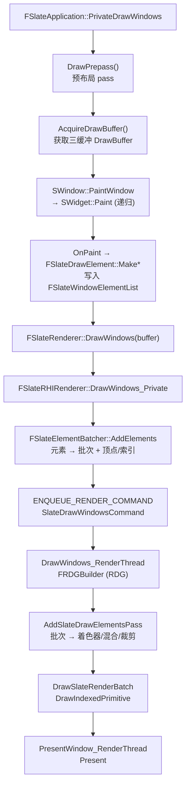
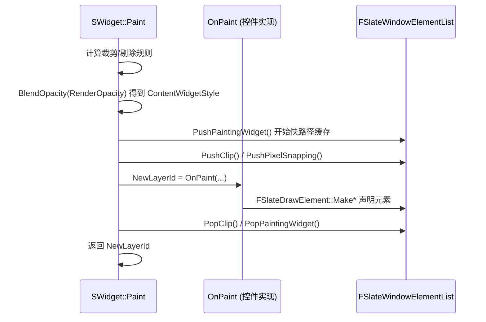
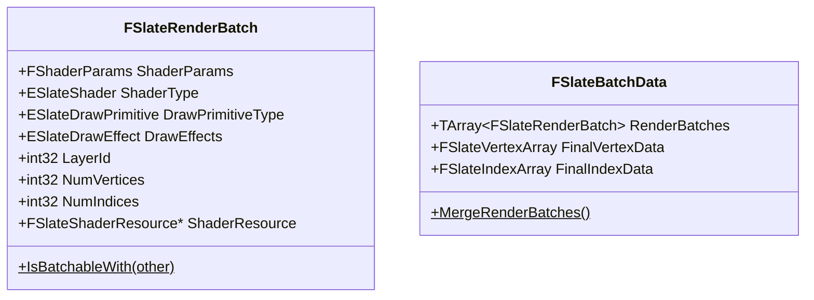
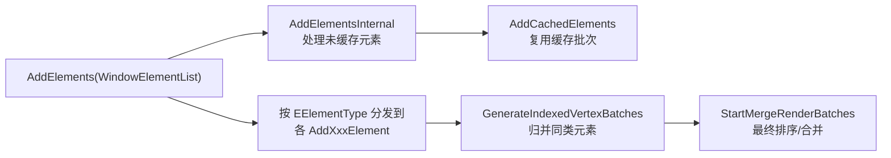
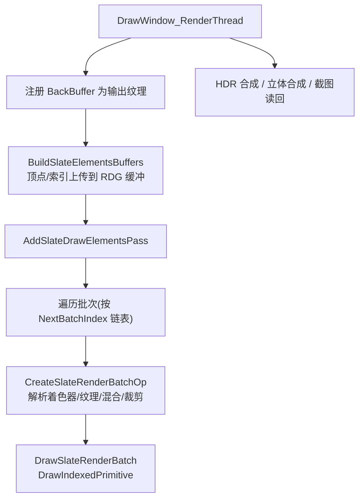

# Slate 渲染

Slate UI 的渲染是一个从控件树出发，逐控件收集绘制元素，最终把绘制元素批量提交给 RHI（Render Hardware Interface）的过程。整个渲染流水线由三个模块协作完成：

1. `SlateCore`：定义渲染的抽象——绘制元素（`FSlateDrawElement`）、元素列表（`FSlateWindowElementList`）、抽象渲染器（`FSlateRenderer`）、画刷（`FSlateBrush`）等，与具体图形 API 无关。
2. `Slate`：应用层（`FSlateApplication`）驱动控件树执行 `Paint`，把绘制元素写入元素列表。
3. `SlateRHIRenderer`：RHI 后端，把绘制元素批量转换成 GPU 顶点/索引数据与着色器调用（`FSlateRHIRenderer` / `FSlateRHIRenderingPolicy`）。

## 渲染管线概览

一帧 Slate UI 的完整渲染流程如下：



整体上可以划分为**游戏线程（Slate 线程）**与**渲染线程**两段：

- **游戏线程**：控件树递归 `Paint`，每个控件通过 `FSlateDrawElement` 的工厂方法声明“我要画什么”，元素被追加到窗口级元素列表 `FSlateWindowElementList` 中；随后 `FSlateElementBatcher` 把这些元素按（图层、着色器参数、纹理资源、着色器类型、绘制效果、裁剪、场景）归并成 `FSlateRenderBatch` 批次，并拼接出最终的顶点/索引数据。
- **渲染线程**：`FSlateRHIRenderingPolicy` 把每个批次映射为具体的 GPU 状态（顶点/像素着色器、混合状态、裁剪、纹理与采样器），在一个 RDG（Render Dependency Graph）Pass 里提交 `DrawIndexedPrimitive`。

## 绘制入口：Paint

每个控件通过继承 `SWidget` 并实现 `OnPaint` 来声明自己的绘制内容：

```cpp
class SMyWidget : public SLeafWidget
{
    virtual int32 OnPaint(const FPaintArgs& Args, const FGeometry& AllottedGeometry,
        const FSlateRect& MyCullingRect, FSlateWindowElementList& OutDrawElements,
        int32 LayerId, const FWidgetStyle& InWidgetStyle, bool bParentEnabled) const override
    {
        // 声明一个带颜色的矩形绘制元素
        FSlateDrawElement::MakeBox(
            OutDrawElements,
            LayerId,
            AllottedGeometry.ToPaintGeometry(),
            FCoreStyle::Get().GetBrush("WhiteBrush"),
            ESlateDrawEffect::None,
            FLinearColor::Red
        );
        return LayerId; // 返回新的最大图层 ID
    }
};
```

`SWidget::Paint`（非虚入口）会在调用虚函数 `OnPaint` 之前/之后做一系列公共处理，是渲染递归的核心：



绘制时传递的几个关键对象：

| 对象 | 作用 |
|-|-|
| `FGeometry`（`AllottedGeometry`） | 控件在窗口中的布局几何信息（尺寸、缩放、累计变换），`ToPaintGeometry()` 转成绘制几何 |
| `FPaintGeometry` | 传给 `FSlateDrawElement::Make*` 的绘制空间位置/尺寸/变换 |
| `FWidgetStyle`（`InWidgetStyle`） | 层级传播的颜色/透明度/前景色，逐控件乘上自己的 `RenderOpacity` |
| `int32 LayerId` | 绘制层级，作为批次排序的主键，父控件决定子控件的起始 LayerId |

## 绘制元素：FSlateDrawElement

`FSlateDrawElement`（[DrawElementTypes.h](SlateCore/Public/Rendering/DrawElementTypes.h)）是 Slate 渲染的基本单元，描述“绘制什么、在哪里、如何混合”。控件**不直接调用 GPU**，而是通过 `FSlateDrawElement` 的静态工厂方法声明绘制元素。

### 元素类型

`EElementType` 枚举（[DrawElementCoreTypes.h](SlateCore/Public/Rendering/DrawElementCoreTypes.h)）定义了所有可绘制的元素类型：

```cpp
enum class EElementType : uint8
{
    ET_Box,             // 矩形/图像四边形
    ET_DebugQuad,       // 线框调试四边形
    ET_Text,            // 文本（每字符一个四边形）
    ET_ShapedText,      // 塑形字形文本（推荐）
    ET_Spline,          // 贝塞尔/埃尔米特样条
    ET_Line,            // 折线（可抗锯齿、虚线）
    ET_Gradient,        // 渐变矩形
    ET_Viewport,        // 场景视口的纹理四边形
    ET_Border,          // 3x3 边框（边平铺，中心留空）
    ET_Custom,          // ICustomSlateElement 自定义绘制
    ET_CustomVerts,     // 原始顶点/索引网格
    ET_PostProcessPass, // 后处理（模糊）Pass
    ET_RoundedBox,      // 带描边的圆角矩形
    ET_NonMapped,       // 未分组的兜底
};
```

每种元素类型对应一个元素子类（`FSlateBoxElement`、`FSlateTextElement`、`FSlateShapedTextElement`、`FSlateGradientElement`、`FSlateSplineElement`、`FSlateLineElement`、`FSlateViewportElement`、`FSlateCustomDrawerElement`、`FSlateCustomVertsElement`、`FSlatePostProcessElement`、`FSlateRoundedBoxElement` 等）。

### 工厂方法

控件通过 `FSlateDrawElement` 的静态工厂方法声明元素：

| 方法 | 用途 |
|-|-|
| `MakeBox` | 绘制矩形/图像（最常用） |
| `MakeRotatedBox` | 带旋转角的矩形 |
| `MakeText` / `MakeShapedText` | 绘制文本 |
| `MakeGradient` | 绘制渐变 |
| `MakeSpline` / `MakeCubicBezierSpline` | 绘制样条曲线 |
| `MakeLines` / `MakeDashedLines` | 绘制折线/虚线 |
| `MakeViewport` | 绘制场景视口纹理 |
| `MakeCustom` | 自定义绘制（`ICustomSlateElement`） |
| `MakeCustomVerts` | 绘制原始网格（顶点/索引） |
| `MakePostProcessBlur` | 后处理模糊 |

这些工厂方法最终都会往 `FSlateWindowElementList` 里追加一个元素，并把 `FPaintGeometry` 中的位置/尺寸/变换信息写入元素的 `Position`、`LocalSize`、`Scale`、`RenderTransform` 等字段。

## 元素列表：FSlateWindowElementList

`FSlateWindowElementList`（[DrawElements.h](SlateCore/Public/Rendering/DrawElements.h)）是**每个窗口**一份的元素容器，在整个窗口绘制期间被填充。

### 按类型分桶存储

为了缓存友好，元素并不是存成一个扁平列表，而是按 `EElementType` 分桶：

```cpp
using FSlateDrawElementMap = TTuple<
    FSlateDrawElementArray<FSlateBoxElement>,          // ET_Box
    FSlateDrawElementArray<FSlateBoxElement>,          // ET_DebugQuad
    FSlateDrawElementArray<FSlateTextElement>,         // ET_Text
    FSlateDrawElementArray<FSlateShapedTextElement>,   // ET_ShapedText
    /* ... 其余类型 ... */
    FSlateDrawElementArray<FSlateDrawElement>>;        // ET_NonMapped
```

`AddUninitialized<ElementType>()` 负责向对应类型的数组追加元素。

### 裁剪栈与像素对齐

元素列表还维护了**裁剪状态栈**（`FSlateClippingManager`）与**像素对齐栈**（`PixelSnappingMethodStack`）：

- 当控件设置了 `Clipping = EWidgetClipping::ClipToBounds` 时，`Paint` 会调用 `PushClip(FSlateClippingZone)`，该控件及其子树产生的元素都共享这个裁剪状态。
- `PushPixelSnappingMethod` / `PopPixelSnappingMethod` 用于控制元素是否做像素对齐（`EWidgetPixelSnapping`）。

### 快路径缓存

Slate 的**失效（Invalidation）系统**允许把“没有变化的控件”的绘制结果缓存下来，下一帧直接复用，从而跳过逐元素的 `OnPaint`。相关结构在 [DrawElements.h](SlateCore/Public/Rendering/DrawElements.h) 中：

| 结构 | 作用 |
|-|-|
| `FSlateCachedElementList` | 某个控件缓存下来的元素列表与已构建的批次 |
| `FSlateCachedElementsHandle` | 指向缓存列表的弱句柄，用于失效/修改 |
| `FSlateCachedElementData` | 每个失效根（Invalidation Root）的缓存仓库 |
| `FSlateCachedFastPathRenderingData` | 缓存下来的顶点/索引数据 |

当控件 `Invalidate(EInvalidateWidgetReason::Paint)` 时，其缓存的元素被标记为脏，下一帧重新 `OnPaint`；否则直接复用缓存批次，大幅降低 CPU 开销。`SInvalidationPanel` 就是一个典型的失效根控件。

### FSlateDrawBuffer

`FSlateDrawBuffer`（[SlateDrawBuffer.h](SlateCore/Public/Rendering/SlateDrawBuffer.h)）是帧级的、**三缓冲**的缓冲区，持有本帧所有窗口的 `FSlateWindowElementList`。渲染器通过 `AcquireDrawBuffer()` / `ReleaseDrawBuffer()` 获取/归还，配合 `Lock()` / `Unlock()` 实现游戏线程与渲染线程之间的同步。

## 元素批次：FSlateElementBatcher

`FSlateElementBatcher`（[ElementBatcher.h](SlateCore/Public/Rendering/ElementBatcher.h)）负责把分散的元素转换成可提交给 GPU 的批次。

### 批次与批次数据



- `FSlateRenderBatch` 是最终的 GPU 提交单元，描述“用哪种着色器、哪张纹理、哪个裁剪状态、画多少个顶点/索引”。
- `FSlateBatchData` 持有有序的批次数组与拼接后的顶点/索引数据。
- `IsBatchableWith()` 比较图层、着色器参数、资源、图元类型、着色器类型、绘制效果、绘制标志、场景、裁剪状态，判断两个元素能否合并进同一个批次——合并能减少状态切换与 Draw Call 数量。

### 批处理流程



- `AddElementsInternal` 遍历 `FSlateDrawElementMap` 的每个类型槽，分发给对应的添加器（`AddBoxElements`、`AddTextElement`、`AddShapedTextElement`、`AddBorderElement`、`AddGradientElement`、`AddSplineElement`、`AddLineElements`、`AddViewportElement`、`AddCustomElement`、`AddCustomVerts`、`AddPostProcessPass`）。
- 每个添加器负责把元素展开成顶点/索引（例如一个带 `Margin` 的 Box 会被展开成 9 个四边形），并根据 `ESlateBrushDrawType` 选择着色器（如 `RoundedBox` 对应 `ESlateShader::RoundedBox`）。
- 文本元素在批处理阶段逐字形解析，从字体图集取纹理，按字体图集内容类型选择着色器（灰度字体 / 彩色字体 / SDF 字体 / MSDF 字体）。

## 顶点格式：FSlateVertex

`FSlateVertex`（[RenderingCommon.h](SlateCore/Public/Rendering/RenderingCommon.h)）是 Slate 提交给 GPU 的统一顶点格式：

```cpp
struct FSlateVertex
{
    float TexCoords[4];          // 纹理坐标（xy 与 zw 各一组）
    FVector2f MaterialTexCoords; // 材质纹理坐标（透传给材质）
    FVector2f Position;          // 窗口空间位置
    FColor Color;                // 顶点颜色
    FColor SecondaryColor;       // 次要顶点颜色（一般用于描边）
    uint16 PixelSize[2];         // 元素局部像素尺寸
};
```

顶点通过多个 `Make(...)` 工厂构造，模板参数 `ESlateVertexRounding` 控制是否对位置做像素对齐取整（`IsPixelSnapped()` 决定）。

## 着色器：SlateShaders

Slate 的着色器定义在 `SlateRHIRenderer` 模块的 [SlateShaders.h](SlateRHIRenderer/Private/SlateShaders.h) 中。

### 着色器类型

`ESlateShader` 枚举（[RenderingCommon.h](SlateCore/Public/Rendering/RenderingCommon.h)）枚举了所有着色器类型，与 shader 文件中的 `SHADER_TYPE` 宏一一对应：

```cpp
enum class ESlateShader : uint8
{
    Default       = 0, // 默认：简单纹理采样
    Border        = 1, // 3x3 边框
    GrayscaleFont = 2, // 灰度字体（仅 alpha 通道）
    ColorFont     = 3, // 彩色字体（sRGB 纹理）
    LineSegment   = 4, // 抗锯齿线段
    Custom        = 5, // 完全自定义材质
    PostProcess   = 6, // 后处理 Pass
    RoundedBox    = 7, // 圆角矩形
    SdfFont       = 8, // 有向距离场字体
    MsdfFont      = 9, // 多通道有向距离场字体
};
```

### 着色器类

| 类 | 作用 |
|-|-|
| `FSlateElementVS` | Slate 的顶点着色器（`SlateVertexShader.usf`） |
| `TSlateElementPS<ShaderType, bDrawDisabledEffect, ...>` | 像素着色器模板，按 `SHADER_TYPE` 宏实例化不同元素类型 |
| `FSlateMaskingVS` / `FSlateMaskingPS` | 裁剪遮罩（stencil）着色器 |
| `TSlateMaterialShaderPS<ShaderType>` | 材质对应的像素着色器 |
| `FSlateVertexDeclaration` | 顶点布局声明（`FSlateVertex` 的 6 个元素） |
| `FSlateInstancedVertexDeclaration` | 带实例数据的顶点声明（用于 `ET_CustomVerts` 实例化） |

> 与旧版本不同，现代 UE 中 Box、Text、Gradient、Border 等**并不是各自独立的着色器类**，而是 `TSlateElementPS` 模板的不同实例（通过 `SHADER_TYPE` 宏区分），元素类型的分支在 `.usf` 的 `Main` 中处理。像素着色器的排列组合（permutation）由 `(ESlateShader, ESlateDrawEffect, 灰度, 虚拟纹理)` 决定。

### 绘制效果与批次标志

```cpp
enum class ESlateDrawEffect : uint8
{
    None = 0,
    NoBlending         = 1 << 0, // 不混合
    PreMultipliedAlpha = 1 << 1, // 预乘 alpha 混合
    NoGamma            = 1 << 2, // 不做 gamma 校正
    InvertAlpha        = 1 << 3, // alpha 取反
    NoPixelSnapping    = 1 << 4, // 禁用像素对齐
    DisabledEffect     = 1 << 5, // 禁用效果
    IgnoreTextureAlpha = 1 << 6, // 忽略纹理 alpha
    ReverseGamma       = 1 << 7, // 反转 gamma 校正
};

enum class ESlateBatchDrawFlag : uint16
{
    /* 前四位与 ESlateDrawEffect 对齐 */
    Wireframe  = 1 << 4, // 线框
    TileU      = 1 << 5, // 水平平铺
    TileV      = 1 << 6, // 垂直平铺
    ReverseGamma = 1 << 7,
    HDR        = 1 << 8, // HDR 批次
};
```

## 渲染器：FSlateRenderer / FSlateRHIRenderer

### 抽象渲染器

`FSlateRenderer`（[SlateRenderer.h](SlateCore/Public/Rendering/SlateRenderer.h)）是 Slate 渲染后端的抽象基类，屏蔽了具体图形 API：

| 纯虚接口 | 作用 |
|-|-|
| `AcquireDrawBuffer` / `ReleaseDrawBuffer` | 三缓冲 DrawBuffer 的获取与归还 |
| `Initialize` / `Destroy` | 初始化与销毁 |
| `CreateViewport` / `RequestResize` / `UpdateFullscreenState` | 视口管理 |
| `DrawWindows(FSlateDrawBuffer&)` | 顶层渲染入口，把元素批次提交给渲染线程 |
| `GetResourceHandle(const FSlateBrush&)` | 获取画刷的渲染资源句柄 |
| `CreateUpdatableTexture` / `ReleaseUpdatableTexture` | 动态纹理 |
| `GetTextureAtlasProvider` / `GetFontAtlasProvider` | 纹理/字体图集 |

此外，`FSlateRenderer` 还持有 `FSlateFontServices`（游戏线程 + 渲染线程的字体缓存与测量服务）。

### RHI 渲染器

`FSlateRHIRenderer`（`SlateRHIRenderer` 模块）是 `FSlateRenderer` 的标准实现。它持有：

- 三个 `FSlateDrawBuffer`（`NumDrawBuffers = 3`，三缓冲）
- `FSlateElementBatcher`（元素批处理）
- `FSlateRHIResourceManager`（纹理/资源管理）
- `FSlateRHIRenderingPolicy`（渲染策略，负责把批次映射为 GPU 状态）
- 窗口到视口信息的映射（`WindowToViewportInfo`）

`DrawWindows_Private` 在游戏线程上依次：

1. 对每个窗口调用 `ElementBatcher->AddElements(*WindowElementList)`，把元素转换为批次与顶点/索引数据。
2. 更新字体缓存、裁剪后处理渲染目标。
3. 构造 `FSlateDrawWindowsCommand` 并通过 `ENQUEUE_RENDER_COMMAND` 提交到渲染线程。

渲染线程的 `DrawWindows_RenderThread` 创建一个 `FRDGBuilder`（RDG），对每个窗口调用 `DrawWindow_RenderThread`：



### 渲染策略

`FSlateRHIRenderingPolicy`（[SlateRHIRenderingPolicy.cpp](SlateRHIRenderer/Private/SlateRHIRenderingPolicy.cpp)）是批次到 GPU 状态的映射核心：

- `BuildSlateElementsBuffers` 把 CPU 侧的 `FinalVertexData` / `FinalIndexData` 通过 `QueueBufferUpload` 上传为 RDG 缓冲。
- `AddSlateDrawElementsPass` 是核心渲染 Pass：按批次链表遍历，把连续相同裁剪状态的批次分组合并为一个 Pass，并把每个批次分类为**自定义绘制 / 后处理 / 图元**三类。
- `CreateSlateRenderBatchOp` 把批次映射为具体 GPU 状态：
  - **材质资源**：解析材质的 Slate 着色器（`TSlateMaterialShaderVS` / `TSlateMaterialShaderPS`），设置材质参数与混合状态。
  - **纹理资源**：按 `(ShaderType, DrawEffects, 灰度, 虚拟纹理)` 选择像素着色器，设置纹理与采样器（由 `TileU/TileV` 决定包裹模式）。
  - **混合状态**：`NoBlending` → 不透明；`PreMultipliedAlpha` → 预乘；否则标准 `SourceAlpha / InverseSourceAlpha`。
- `DrawSlateRenderBatch` 设置裁剪、光栅化状态、顶点声明、顶点/像素着色器、流源，最终调用 `DrawIndexedPrimitive`。

## 裁剪

Slate 支持两种裁剪方式（`SetSlateClipping` / `GetSlateClippingPipelineState`）：

| 方式 | 适用场景 |
|-|-|
| **Scissor（裁剪矩形）** | 轴对齐的矩形裁剪区域，通过 `RHICmdList.SetScissorRect` 实现 |
| **Stencil（模板缓冲）** | 旋转/嵌套的裁剪区域，通过渲染遮罩四边形累积模板值实现 |

Stencil 裁剪的工作原理：先渲染遮罩四边形（`FSlateMaskingVS/PS`），第一个区域用 `SO_Replace` 写入模板参考值 `MaskingId+1`，后续区域用 `SO_SaturatedIncrement` 累加；随后绘制元素时使用 `CF_Equal` 深度模板状态，`StencilRef = MaskingId + Zones.Num()`，使得只有落在所有裁剪区域交集内的像素才通过测试。

## 纹理与资源管理

### FSlateShaderResource

`FSlateShaderResource`（[SlateShaderResource.h](SlateCore/Public/Textures/SlateShaderResource.h)）是渲染资源的抽象，类型包括：`NativeTexture`（原生纹理）、`TextureObject`（`UTexture`）、`Material`（材质）、`PostProcess`、`Invalid`。

`FSlateShaderResourceProxy` 是对图集 UV 的间接引用，保存 `StartUV`、`SizeUV`、`ActualSize` 与实际资源指针，批次处理全程通过它取纹理坐标。

### 纹理图集与字体图集

`FSlateRHIResourceManager` 同时实现了 `ISlateAtlasProvider` 与 `FSlateShaderResourceManager`，负责：

- **纹理图集（Texture Atlas）**：把多个小纹理打包进大图集纹理，`UpdateTextureAtlases` 负责更新；`GetShaderResource` 返回画刷对应的资源代理（含图集 UV）。
- **字体图集（Font Atlas）**：`FSlateFontAtlasRHI` 紧密打包字形，字体内容类型（灰度/彩色/SDF/MSDF）决定像素格式与着色器选择。
- **动态资源**：`MakeDynamicUTextureResource` / `MakeDynamicTextureResource` 创建运行时动态纹理。

### FSlateBrush

`FSlateBrush`（[SlateBrush.h](SlateCore/Public/Styling/SlateBrush.h)）是 Slate 的“画刷”，描述一个可绘制图像的外观：

| 字段 | 说明 |
|-|-|
| `TintColor` | 着色（`FSlateColor`，可引用样式颜色） |
| `DrawAs` | 绘制类型：`Box` / `Border` / `Image` / `RoundedBox` / `NoDrawType` |
| `Tiling` / `Mirroring` | 平铺 / 镜像方式 |
| `Margin` | Box/Border 模式下 9 宫格的边距 |
| `ImageSize` | 图像尺寸 |
| `ResourceObject` | 资源对象（`UTexture` / `UMaterialInterface` / 图集接口） |
| `OutlineSettings` | 圆角矩形描边设置（圆角半径、颜色、宽度） |
| `UVRegion` | 可选的 UV 区域覆盖 |

`GetRenderingResource(LocalSize, DrawScale)` 会惰性调用 `UpdateRenderingResource` 并返回缓存的 `FSlateResourceHandle`，这是画刷到渲染资源的快路径。

## 小结

Slate 的渲染架构可以用一句话概括：**控件树递归 `Paint` 声明绘制元素 → 元素按类型分桶写入窗口元素列表 → 批处理器把元素归并成批次并拼接顶点/索引 → RHI 渲染策略把批次映射为着色器/纹理/混合/裁剪状态并提交 GPU**。其中：

- 通过**按类型分桶**与**批次合并**减少状态切换与 Draw Call；
- 通过**失效快路径缓存**复用未变化控件的绘制结果；
- 通过**三缓冲 DrawBuffer** 与 **RDG** 实现游戏线程与渲染线程的解耦；
- 通过**抽象渲染器接口**（`FSlateRenderer`）将上层逻辑与具体图形 API 解耦，使得 Slate 可以运行在 D3D、Vulkan、Metal 等不同 RHI 后端之上。
