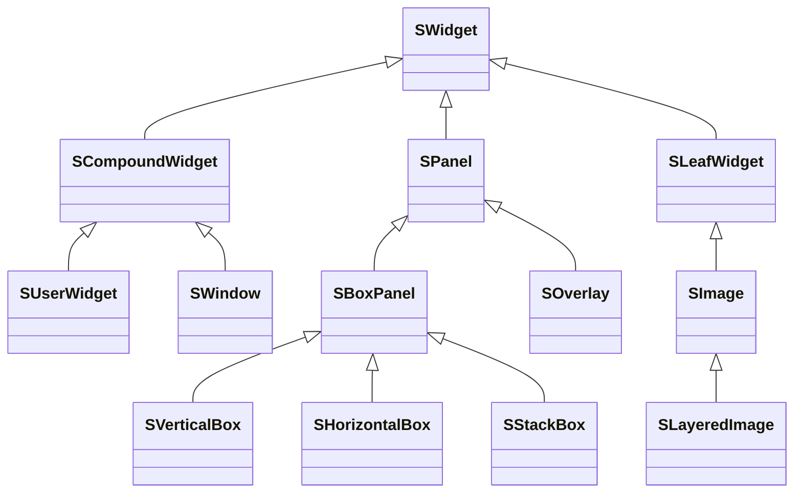
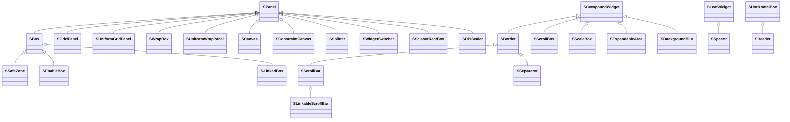
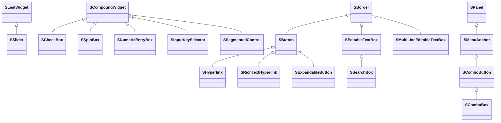
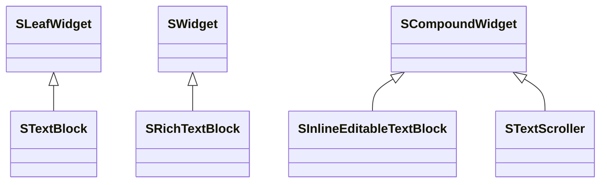
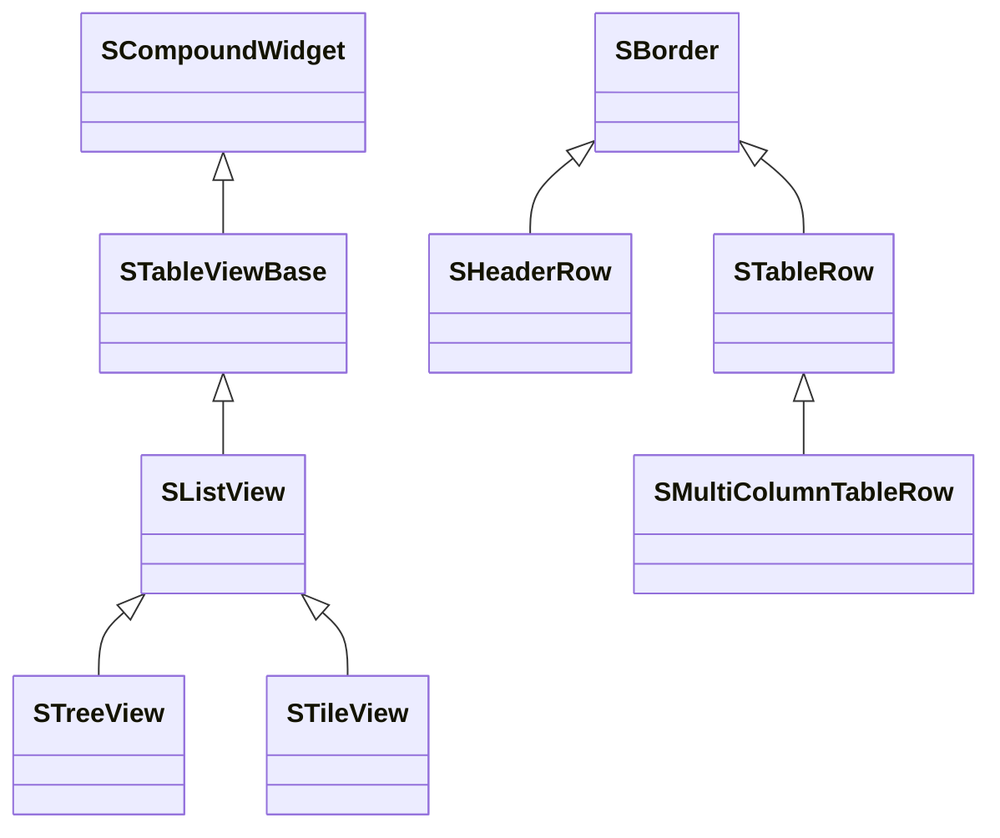
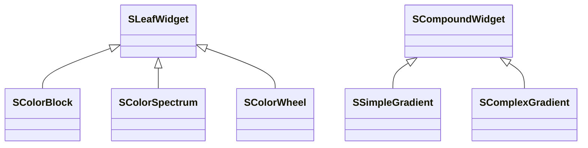
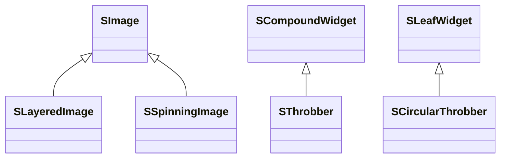
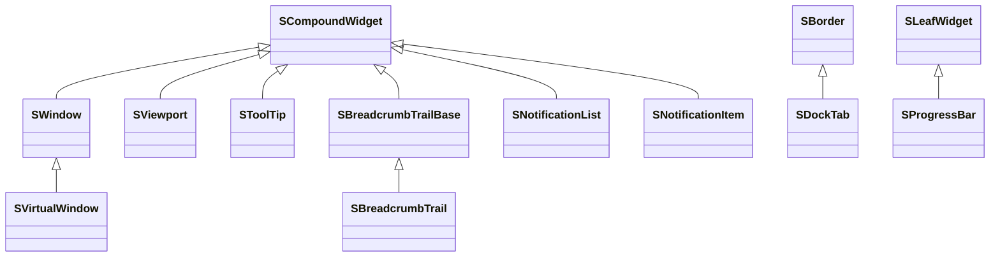

# Slate UI Widget

Slate UI 由两个模块（Module）组成：

1. `SlateCore` 是 Slate UI 的核心模块，提供最基础的控件基类、布局、渲染抽象、输入事件与样式等基础设施。
2. `Slate` 是对 `SlateCore` 的扩展，提供了丰富、可直接使用的控件（Widget）类型集合。

在 `SlateCore` 中，定义了 Slate UI 最基础的类 —— `SWidget` 及其基础派生类：

`SWidget` 是所有 Slate UI 控件的基类，但它是一个抽象基类，官方注释明确建议**不要直接从 `SWidget` 继承**，而是根据控件是否需要子控件，选择从 `SCompoundWidget`、`SPanel` 或 `SLeafWidget` 派生：

| 基类 | 子控件 | 适用场景 |
|-|-|-|
| `SCompoundWidget` | 恰好一个（`ChildSlot`） | 有一个根槽位、内部再包一棵子树的控件，如 `SButton`、`SBorder` |
| `SPanel` | 多个（一组 `Slot`） | 管理多个子控件布局的容器，如 `SVerticalBox`、`SOverlay`、`SGridPanel` |
| `SLeafWidget` | 无 | 叶子控件，只负责绘制与期望尺寸，如 `SImage`、`STextBlock`、`SSlider` |

> `SNullWidget` 是一个特殊的占位类（并不是 `SWidget` 的子类），它暴露一个静态的 `TSharedRef<SWidget> NullWidget`。当一个 Slot 没有显式设置子控件时，就会用 `SNullWidget::NullWidget` 作为占位内容。

在 `Slate` 模块中，定义了更多可以直接使用的控件类型，大致分为以下几类：

1. 布局 Layout：`SBox`、`SBorder`、`SScrollBox`、`SScrollBar`、`SSplitter`
2. 输入 Input：`SButton`、`SCheckBox`、`SSlider`、`SEditableTextBox`、`SComboBox`
3. 文本 Text：`STextBlock`、`SRichTextBlock`、`SEditableText`
4. 视图 View：`SListView`、`STreeView`、`STileView`
5. 颜色 Color：`SColorBlock`、`SColorSpectrum`、`SColorWheel`
6. 图像 Image：`SImage`、`SThrobber`、`SCircularThrobber`
7. 其他 Other：`SDockTab`、`SBreadcrumbTrail`、`SViewport`

### 布局类型

布局控件负责管理子控件的排列方式：

常用的布局控件：

| 控件 | 基类 | 说明 |
|-|-|-|
| `SBox` | `SPanel` | 单子控件容器，可显式指定宽/高/纵横比 |
| `SBorder` | `SCompoundWidget` | 带边框/背景画刷（Brush）的单子控件容器 |
| `SGridPanel` | `SPanel` | 行列网格，Slot 通过行列坐标定位 |
| `SUniformGridPanel` | `SPanel` | 单元格尺寸均匀的网格 |
| `SWrapBox` | `SPanel` | 宽度不足时自动换行的流式布局 |
| `SCanvas` | `SPanel` | 自由坐标定位子控件的画布 |
| `SSplitter` | `SPanel` | 可拖拽调整大小的多窗格分割器 |
| `SWidgetSwitcher` | `SPanel` | 同一时刻只显示众多子控件中的一个 |
| `SScrollBox` | `SCompoundWidget` | 可滚动的容器，纵向/横向排列任意子控件 |
| `SScrollBar` | `SBorder` | 可拖拽的滚动条 |
| `SScaleBox` | `SCompoundWidget` | 将单个子控件缩放到指定区域 |
| `SExpandableArea` | `SCompoundWidget` | 可折叠/展开的带标题区域 |
| `SBackgroundBlur` | `SCompoundWidget` | 对子控件背后的内容做模糊处理 |
| `SSpacer` | `SLeafWidget` | 不绘制内容、只占用期望尺寸的占位控件 |

### 输入类型

输入控件用于接收用户的交互输入：

常用的输入控件：

| 控件 | 基类 | 说明 |
|-|-|-|
| `SButton` | `SBorder` | 可点击的按钮，内容任意，提供 `OnClicked` 等回调 |
| `SCheckBox` | `SCompoundWidget` | 可切换勾选的复选框（勾选/未勾选/不确定三态） |
| `SSlider` | `SLeafWidget` | 可拖拽的标量滑块 |
| `SSpinBox` | `SCompoundWidget` | 带上下箭头的数值输入框 |
| `SNumericEntryBox` | `SCompoundWidget` | 支持单位/格式化的数值输入框 |
| `SEditableTextBox` | `SBorder` | 带边框样式的单行可编辑文本框 |
| `SMultiLineEditableTextBox` | `SBorder` | 多行可编辑文本框 |
| `SSearchBox` | `SEditableTextBox` | 带搜索图标与清除按钮的搜索框 |
| `SComboBox` | `SComboButton` | 下拉选择框（按钮 + `SListView` 菜单） |
| `SInputKeySelector` | `SCompoundWidget` | 捕获用户按下的按键/组合键 |
| `SMenuAnchor` | `SPanel` | 锚定并管理弹出菜单 |

### 文本类型

| 控件 | 基类 | 说明 |
|-|-|-|
| `STextBlock` | `SLeafWidget` | 静态只读文本 |
| `SRichTextBlock` | `SWidget` | 支持内联标记（加粗、颜色、图片、链接）的富文本 |
| `SInlineEditableTextBlock` | `SCompoundWidget` | 点击后变为可编辑的文本 |
| `STextScroller` | `SCompoundWidget` | 在固定宽度内滚动文本 |

### 视图类型

视图控件实现了模型/视图（Model/View）架构，用于展示海量数据列表与树：

| 控件 | 基类 | 说明 |
|-|-|-|
| `STableViewBase` | `SCompoundWidget` | 类型无关的列表/树/瓦片视图基类（滚动、生成、选择） |
| `SListView` | `STableViewBase` | 观察数据数组、虚拟化行的模板列表 |
| `STreeView` | `SListView` | 带可展开节点的层级树视图 |
| `STileView` | `SListView` | 网格/瓦片形式的列表视图 |
| `SHeaderRow` | `SBorder` | 可调整大小、排序的列标题行 |
| `STableRow` | `SBorder` | 单个列表/树项的模板行控件 |

> `SListView`/`STreeView` 采用**行虚拟化**：只生成可见区域内的行控件，滚动时复用行，因此可以高效地展示成千上万条数据。

### 颜色类型

| 控件 | 基类 | 说明 |
|-|-|-|
| `SColorBlock` | `SLeafWidget` | 纯色块 |
| `SColorSpectrum` | `SLeafWidget` | 饱和度/明度的二维取色器 |
| `SColorWheel` | `SLeafWidget` | 圆形色相/饱和度转盘 |
| `SSimpleGradient` | `SCompoundWidget` | 双色渐变 |
| `SComplexGradient` | `SCompoundWidget` | 多段渐变 |

### 图像类型

| 控件 | 基类 | 说明 |
|-|-|-|
| `SImage` | `SLeafWidget` | 绘制单个 `FSlateBrush` 图像 |
| `SLayeredImage` | `SImage` | 绘制多个层叠的画刷 |
| `SThrobber` | `SCompoundWidget` | 分段动画的“加载中”指示器 |
| `SCircularThrobber` | `SLeafWidget` | 圆形旋转的加载指示器 |
| `SSpinningImage` | `SImage` | 持续旋转的图像 |

### 其他类型

除了上述分类，`Slate` 还提供了窗口、视口、停靠、导航、通知等控件：

| 控件 | 基类 | 说明 |
|-|-|-|
| `SWindow` | `SCompoundWidget` | 顶层操作系统窗口（在 `SlateCore` 中） |
| `SVirtualWindow` | `SWindow` | 非 OS 窗口，用于弹窗/渲染目标 |
| `SViewport` | `SCompoundWidget` | 承载渲染视口的控件 |
| `SToolTip` | `SCompoundWidget` | 悬浮提示框 |
| `SDockTab` | `SBorder` | 停靠布局中的单个标签页 |
| `SBreadcrumbTrail` | `SBreadcrumbTrailBase` | 面包屑导航路径 |
| `SNotificationList` | `SCompoundWidget` | 通知堆栈 |
| `SProgressBar` | `SLeafWidget` | 水平进度条 |
