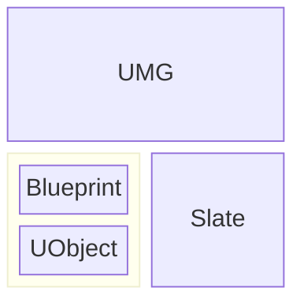
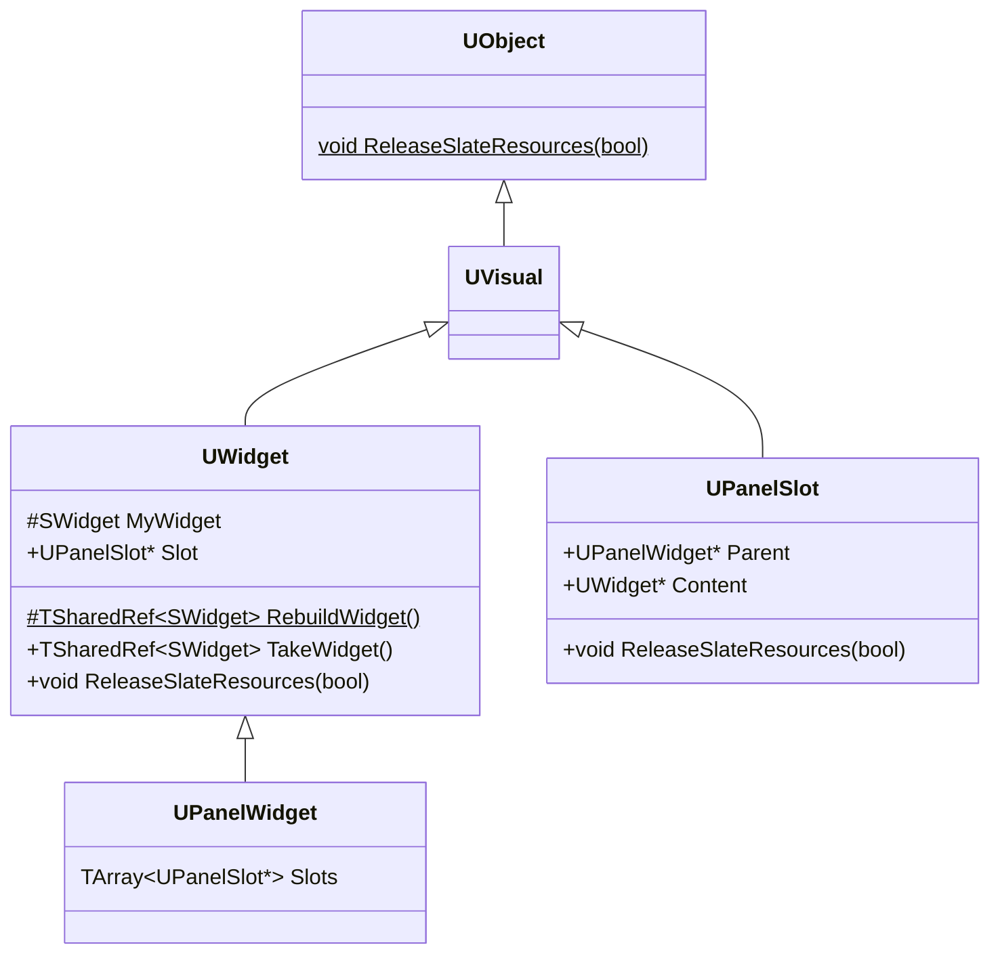
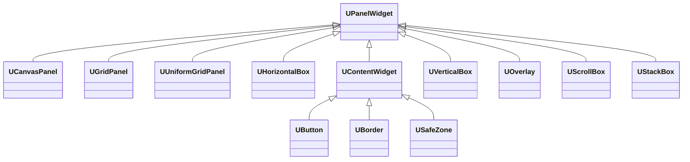
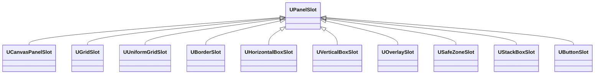
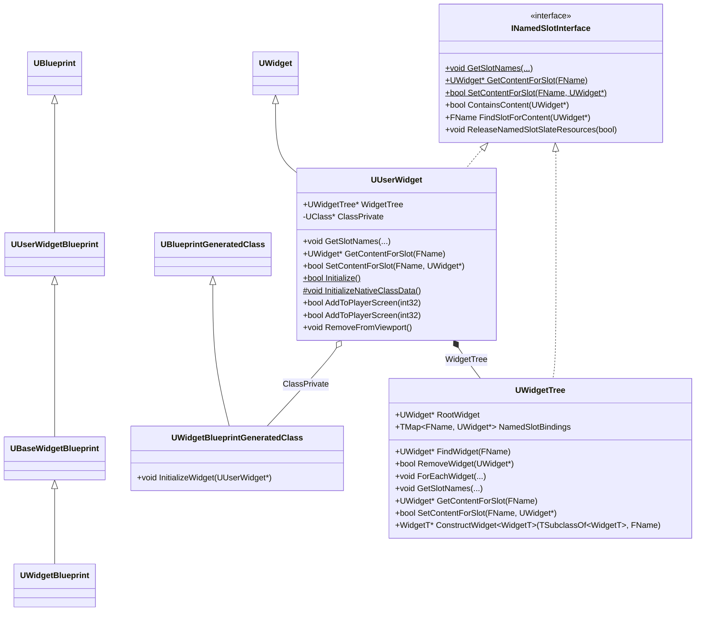
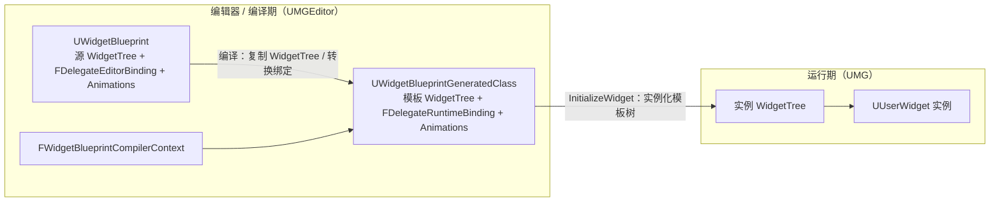
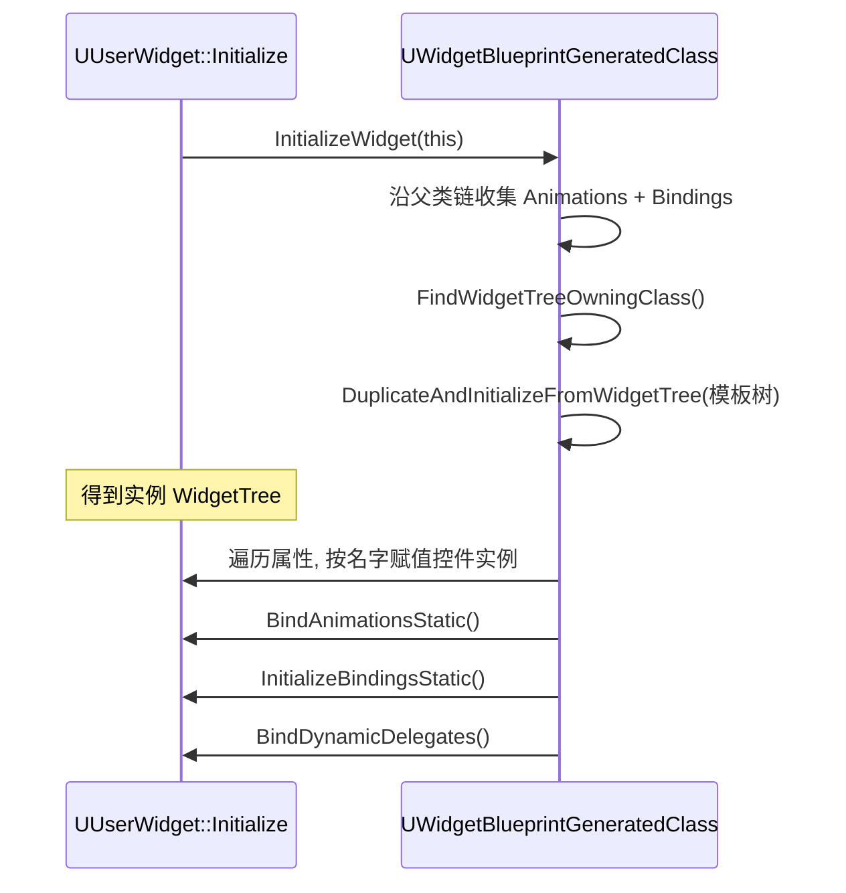
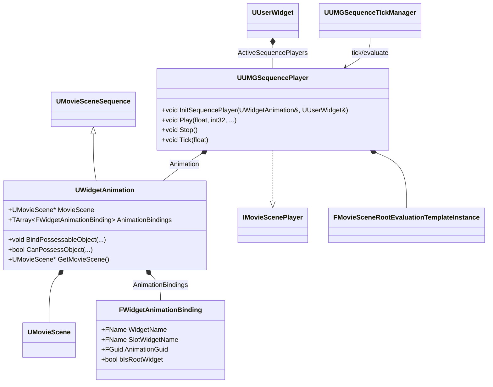
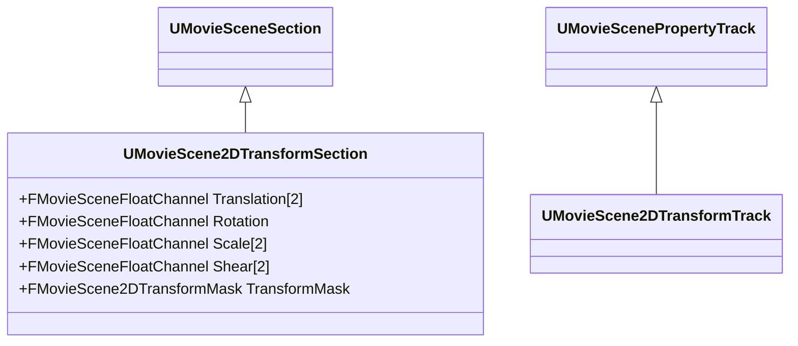

# UMG

UMG（Unreal Motion Graphics）是 Unreal Engine 的游戏 HUD 框架，允许开发者使用蓝图和 C++ 创建用户界面。

UMG 建立在 UObject、Blueprint 和 Slate 之上，UObject 提供反射、序列化和垃圾回收功能，Blueprint 提供可视化编辑和脚本功能，Slate 提供底层的布局、渲染和输入交互功能



## UMG 与 Slate



每个 `UWidget` 通过 `UWidget::Slot` 索引其父 `UPanelWidget`

### UWidget

`UWidget` 是所有 UMG 控件的基类，但它并不继承 `SWidget`，而是 是一个 UObject。`UWidget` 的成员函数 `UWidget::TakeWidget()` 用于获取 `UWidget` 对应的 Slate Widget，如果 Slate Widget 还没有构建，则会调用 `UWidget::RebuildWidget()` 来构建它。 

`UWidget::RebuildWidget()` 是 `UWidget` 的核心虚函数，用于构建 Slate Widget。其实现如下：

```cpp
TSharedRef<SWidget> UWidget::RebuildWidget()
{
    ensureMsgf(false, TEXT("You must implement RebuildWidget() in your child class"));
    return SNew(SSpacer);
}
```

具体地，`USpacer` 的 `RebuildWidget` 函数实现如下：

```cpp
TSharedRef<SWidget> USpacer::RebuildWidget()
{
    MySpacer = SNew(SSpacer)
        .Size(Size);

    return MySpacer.ToSharedRef();
}
```

`TakeWidget()` 是 UObject 层进入 Slate 的入口。当内部缓存的 `MyWidget`（`TWeakPtr<SWidget>`）失效时，`TakeWidget()` 调用 `RebuildWidget()` 创建 Slate 对象并缓存；若该控件是 `UUserWidget`，还会把其内容包装成 `SObjectWidget`——它通过 `FGCObject` 持有对 `UUserWidget` 的强引用，保证仍在 Slate 树中的用户控件不会被 UObject GC 回收。首次构建后，`TakeWidget()` 会依次调用 `SynchronizeProperties()`（把 UMG 属性推送到 Slate 对象）和 `OnWidgetRebuilt()`；之后的调用直接复用缓存对象，不再重建整棵树。

`RebuildWidget()` 只负责创建 Slate 对象与初始树结构。运行期属性变更应优先在 `SynchronizeProperties()`、对应的 Setter 或 `UPanelSlot::SynchronizeProperties()` 中推送到现有 Slate 对象；需要改变结构时才调用 `ReleaseSlateResources()` 释放资源并触发重建。

### UPanelWidget 与 UPanelSlot

`UPanelWidget` 继承自 `UWidget`，是所有 UMG 容器类控件的基类。继承 `UPanelWidget`，实现不同的组件容器。



在 UMG 中，只有继承自 `UPanelWidget` 的控件，才能拥有子控件，而直接继承自 `UWidget` 的控件则不能拥有子控件：


`UPanelSlot` 是构建 UMG Widget 父子关系的桥梁，每个 `UPanelWidget` 都会持有一组 `UPanelSlot`，通过 `UPanelWidget::Slots` 间接引用子 `UWidget`，而每个 `UWidget` 也会通过 `UWidget::Slot` 间接引用父 `UPanelWidget`。`UPanelSlot` 还决定子 `UWidget` 在父 `UPanelWidget` 中的布局方式。通过继承 `UPanelSlot`，可以实现不同容器的布局方式。



> `UPanelSlot` 类似于 Slate UI 中的 Slot，但它们不是同一个层面的概念。`UPanelSlot` 可以看成是 UObject 层面，对 Slate UI Slot 的封装，最终在 `UWidget::RebuildWidget()` 中，`UPanelSlot` 会被转换为 Slate UI Slot。

`UPanelSlot` 重写了的 `ReleaseSlateResources()` 函数实现如下，以便沿 UI 树，释放 Slate UI 资源：

```cpp
void UPanelSlot::ReleaseSlateResources(bool bReleaseChildren)
{
    Super::ReleaseSlateResources(bReleaseChildren);

    // ReleaseSlateResources for Content unless the content is a UUserWidget as they are responsible for releasing their own content.
    if (Content && !Content->IsA<UUserWidget>())
    {
        Content->ReleaseSlateResources(bReleaseChildren);
    }
}
```

## UMG 与 Blueprint



### UUserWidget 与 UWidgetTree


`UWidgetTree` 是 UObject 层面的 UI 树，它保存了根 Widget、提供了对 Widget 的增删改查接口

`UUserWidget` 是 `UWidget` 最重要的派生类，是用户创建的 UI 基类。


`UUserWidget` 内部拥有一个 WidgetTree，在 `RebuildWidget()` 时会将 UMG Widget Tree 转换为 Slate Widget Tree：

```cpp
TSharedRef<SWidget> UUserWidget::RebuildWidget()
{
	check(!HasAnyFlags(RF_ClassDefaultObject | RF_ArchetypeObject));
	
	// In the event this widget is replaced in memory by the blueprint compiler update
	// the widget won't be properly initialized, so we ensure it's initialized and initialize
	// it if it hasn't been.
	if ( !bInitialized )
	{
		Initialize();
	}

	// Setup the player context on sub user widgets, if we have a valid context
	if (PlayerContext.IsValid())
	{
		WidgetTree->ForEachWidget([&] (UWidget* Widget) {
			if ( UUserWidget* UserWidget = Cast<UUserWidget>(Widget) )
			{
				UserWidget->SetPlayerContext(PlayerContext);
			}
		});
	}

	// Add the first component to the root of the widget surface.
	TSharedRef<SWidget> UserRootWidget = WidgetTree->RootWidget ? WidgetTree->RootWidget->TakeWidget() : TSharedRef<SWidget>(SNew(SSpacer));

	return UserRootWidget;
}
```

在 `UUserWidget::Initialize()` 初始化函数中，可以看到 WidgetTree 的初始化：

```cpp
bool UUserWidget::Initialize()
{
    // If it's not initialized initialize it, as long as it's not the CDO, we never initialize the CDO.
    if (!bInitialized && !HasAnyFlags(RF_ClassDefaultObject))
    {
        // If this is a sub-widget of another UserWidget, default designer flags and player context to match those of the owning widget
        if (UUserWidget* OwningUserWidget = GetTypedOuter<UUserWidget>())
        {
    #if WITH_EDITOR
            SetDesignerFlags(OwningUserWidget->GetDesignerFlags());
    #endif
            SetPlayerContext(OwningUserWidget->GetPlayerContext());
        }

        UWidgetBlueprintGeneratedClass* BGClass = Cast<UWidgetBlueprintGeneratedClass>(GetClass());
        // Only do this if this widget is of a blueprint class
        if (BGClass)
        {
            BGClass->InitializeWidget(this);
        }
        else
        {
            InitializeNativeClassData();
        }

        if ( WidgetTree == nullptr )
        {
            WidgetTree = NewObject<UWidgetTree>(this, TEXT("WidgetTree"), RF_Transient);
        }
        else
        {
            WidgetTree->SetFlags(RF_Transient);

            InitializeNamedSlots();
        }

        // For backward compatibility, run the initialize event on widget that doesn't have a player context only when the class authorized it.
        bool bClassWantsToRunInitialized = BGClass && BGClass->bCanCallInitializedWithoutPlayerContext;
        if (!IsDesignTime() && (PlayerContext.IsValid() || bClassWantsToRunInitialized))
        {
            NativeOnInitialized();
        }

        bInitialized = true;
        return true;
    }

    return false;
}

void UUserWidget::InitializeNamedSlots()
{
    for (const FNamedSlotBinding& Binding : NamedSlotBindings )
    {
        if ( UWidget* BindingContent = Binding.Content )
        {
            FObjectPropertyBase* NamedSlotProperty = FindFProperty<FObjectPropertyBase>(GetClass(), Binding.Name);
    #if !WITH_EDITOR
            // In editor, renaming a NamedSlot widget will cause this ensure in UpdatePreviewWidget of widget that use that namedslot
            ensure(NamedSlotProperty);
    #endif
            if ( NamedSlotProperty ) 
            {
                UNamedSlot* NamedSlot = Cast<UNamedSlot>(NamedSlotProperty->GetObjectPropertyValue_InContainer(this));
                if ( ensure(NamedSlot) )
                {
                    NamedSlot->ClearChildren();
                    NamedSlot->AddChild(BindingContent);
                }
            }
        }
    }
}
```

`UUserWidget` 和 WidgetTree 在 [UMG 界面设计器（Unreal Motion Graphics UI Designer）](https://dev.epicgames.com/documentation/unreal-engine/umg-ui-designer-quick-start-guide-in-unreal-engine?application_version=5.5)中编辑。

### UWidgetBlueprintGeneratedClass 与 UUserWidgetBlueprint

UMG 蓝图由两条继承链组成，分别对应「蓝图资产（编辑器侧）」与「生成的类（运行期）」：

- **蓝图资产**：`UBlueprint` → `UUserWidgetBlueprint`（Runtime 模块，抽象）→ `UBaseWidgetBlueprint`（UnrealEd 模块，抽象）→ `UWidgetBlueprint`（UMGEditor 模块，具体）。
- **生成的类**：`UBlueprintGeneratedClass` → `UWidgetBlueprintGeneratedClass`（Runtime 模块）。

之所以在 Runtime 模块留一个抽象的 `UUserWidgetBlueprint` 基类（它只有 `AllowEditorWidget()` 一个虚函数），是为了让运行时代码能通过 `Cast<UUserWidgetBlueprint>(ClassGeneratedBy)` 拿到蓝图资产，而不必依赖只在编辑器存在的 UMGEditor 模块；具体的 `UWidgetBlueprint` 则待在编辑器模块里。`UBaseWidgetBlueprint` 补齐了编辑器侧的 `WidgetTree` 源树，`UWidgetBlueprint` 再补上绑定、动画等完整功能。

当蓝图的父类是 `UUserWidget`（或其子类）时，`FWidgetBlueprintCompiler::GetBlueprintTypesForClass()` 返回 true，蓝图系统据此选用 `UWidgetBlueprint` 作为资产类、`UWidgetBlueprintGeneratedClass` 作为生成类——这就是「UserWidget 蓝图」和普通蓝图（默认 `UBlueprint` / `UBlueprintGeneratedClass`）分流的机制。



#### 蓝图资产：UWidgetBlueprint

`UWidgetBlueprint` 是用户在编辑器里编辑的资产（.uasset）。除 `UBlueprint` 通用内容（变量、函数、事件图）外，它还持有 UMG 特有数据：

- `WidgetTree`（继承自 `UBaseWidgetBlueprint`）：设计器中编辑的**源控件树**，即用户编辑的模板。
- `Bindings`：`TArray<FDelegateEditorBinding>`，编辑器侧的属性/事件绑定。
- `Animations`：`TArray<UWidgetAnimation>`，设计器中创建的动画。
- `bCanCallInitializedWithoutPlayerContext`：允许在没有 PlayerContext（如 UMG Widget Preview）时调用 `Initialize()`。

`UWidgetBlueprint` 重写了若干 `UBlueprint` 虚函数，声明自己的编译行为：

```cpp
UClass* UWidgetBlueprint::GetBlueprintClass() const
{
    return UWidgetBlueprintGeneratedClass::StaticClass();
}

// Widget 蓝图永远不是 Data Only 蓝图（它必须能声明新的控件成员变量），所以加载时总要重新编译
virtual bool AlwaysCompileOnLoad() const override { return true; }
virtual bool AllowsDynamicBinding() const override { return true; }
virtual bool SupportsInputEvents() const override { return true; }
```

其中 `GetBlueprintClass()` 决定编译产物是 `UWidgetBlueprintGeneratedClass` 而非默认的 `UBlueprintGeneratedClass`。此外它还维护了编译期性能/诊断元数据：`TickFrequency`、`TickPrediction`、`TickPredictionReason`（tick 预测）、`PropertyBindings`（属性绑定计数，作为性能告警参考）。

#### 编译过程：FWidgetBlueprintCompilerContext

Widget 蓝图的编译由 `FWidgetBlueprintCompiler`（实现 `IBlueprintCompiler`）驱动，其 `Compile()` 创建 `FWidgetBlueprintCompilerContext`（继承 `FKismetCompilerContext`）并执行编译。编译的核心产出，是把编辑器里的源 `WidgetTree` 变成生成类里的**模板树**，并收集绑定、动画与命名槽：

- `SpawnNewClass()`：`NewObject<UWidgetBlueprintGeneratedClass>`，作为本次编译的 `NewClass`。
- `CleanAndSanitizeClass()` / `SaveSubObjectsFromCleanAndSanitizeClass()`：在重编译前把旧的 WidgetTree、动画、命名槽内容移入 transient 包或先保存下来，避免被 sub-object 清理逻辑误删。
- `CreateClassVariablesFromBlueprint()`：为控件树中「标记为变量（`Widget->bIsVariable`）、被绑定引用、或是 `UNamedSlot`」的每个控件，在生成类上创建一个 **instanced 对象属性**（`CPF_Instanced`，名称等于控件名）；动画同理创建同名属性。这样运行期才能用 `FindFProperty` 按名字反查控件/动画实例。
- `FinishCompilingClass()`：把 `WidgetBlueprint->WidgetTree` 用 `StaticDuplicateObjectEx` **复制**一份进生成类（以生成类为 Outer），作为 `UWidgetBlueprintGeneratedClass::WidgetTree` 模板；把动画 `DuplicateObject` 成 `_INST` 后缀的实例；把 `FDelegateEditorBinding` 校验并转换为运行期 `FDelegateRuntimeBinding`；最后统计命名槽。
- `CopyTermDefaultsToDefaultObject()`：把 `bHasScriptImplementedTick` / `bHasScriptImplementedPaint` 写进 CDO，并调用 `SetClassRequiresNativeTick()` 记录原生父类是否需要 tick。

编辑器绑定 `FDelegateEditorBinding` 用 `ObjectName` + `PropertyName` + 一条 `FEditorPropertyPath`（`SourcePath`）描述绑定关系。`FEditorPropertyPath` 的每个分段用 GUID（`MemberGuid`）记录成员，因此成员重命名后绑定仍能追溯；运行期被转换成只含名字与属性路径的 `FDelegateRuntimeBinding`：

```cpp
USTRUCT()
struct FDelegateRuntimeBinding
{
    UPROPERTY() FString ObjectName;                // 被绑定的控件成员名
    UPROPERTY() FName PropertyName;                // 控件上要被绑定的属性（或事件）名
    UPROPERTY() FName FunctionName;                // 绑定的源函数/属性
    UPROPERTY() FDynamicPropertyPath SourcePath;   // 源对象上的属性路径
    UPROPERTY() EBindingKind Kind = EBindingKind::Property; // 属性绑定 or 函数绑定
};
```

#### 生成类：UWidgetBlueprintGeneratedClass

`UWidgetBlueprintGeneratedClass` 是 Widget 蓝图的编译产物，也是把「蓝图」和「运行期 UMG」接起来的关键。头文件注释开宗明义：

> 所有 `UWidgetBlueprintGeneratedClass` 都是 `UUserWidget` 的类，它们通过这个类完成特殊的初始化后处理，从而获得与 AActor 蓝图类似的能力，例如为控件做动态委托绑定。

它持有（部分字段只在编辑器构建中存在）：

- `WidgetTree`（`DuplicateTransient`）：编译时从蓝图复制的**模板控件树**（Archetype）。注意它与 `UBaseWidgetBlueprint::WidgetTree`（编辑器源树）不是同一份对象。
- `Bindings`：`TArray<FDelegateRuntimeBinding>`，运行期委托绑定。
- `Animations`：`TArray<UWidgetAnimation>`，动画实例。
- `NamedSlots` / `AvailableNamedSlots` / `InstanceNamedSlots`（及编辑器侧的 `NamedSlotsWithID` / `NamedSlotsWithContentInSameTree`）：命名槽相关集合（见下）。
- `Extensions`：`TArray<UWidgetBlueprintGeneratedClassExtension>`，可插拔的类扩展（见下）。
- `bClassRequiresNativeTick`：原生父类是否需要 tick；`bCanCallInitializedWithoutPlayerContext`：无 PlayerContext 时是否允许初始化。

`UWidgetBlueprintGeneratedClass::InitializeWidget()` 是运行期入口——`UUserWidget::Initialize()`（见上文）发现自己的类 `IsA<UWidgetBlueprintGeneratedClass>` 时就调用它：

```cpp
void UWidgetBlueprintGeneratedClass::InitializeWidget(UUserWidget* UserWidget) const
{
    TArray<UWidgetAnimation*> AllAnims;
    TArray<FDelegateRuntimeBinding> AllBindings;

    // 沿父类链收集所有动画与绑定（父蓝图中的绑定同样要应用）
    UClass* SuperClass = UserWidget->GetClass();
    while (UWidgetBlueprintGeneratedClass* WBPGC = Cast<UWidgetBlueprintGeneratedClass>(SuperClass))
    {
        AllAnims.Append(WBPGC->Animations);
        AllBindings.Append(WBPGC->Bindings);
        SuperClass = SuperClass->GetSuperClass();
    }

    // 找到真正持有根控件的类（子类可能没重写根，需向上找 WidgetTree）
    UWidgetTree* PrimaryWidgetTree = WidgetTree;
    if (UWidgetBlueprintGeneratedClass* PrimaryWidgetTreeClass = FindWidgetTreeOwningClass())
    {
        PrimaryWidgetTree = PrimaryWidgetTreeClass->WidgetTree;
    }

    InitializeWidgetStatic(UserWidget, this, PrimaryWidgetTree, PrimaryWidgetTreeClass, AllAnims, AllBindings);
}
```

`InitializeWidgetStatic()` 完成实际的初始化：

1. 设置 `WidgetGeneratedBy`（`WITH_EDITORONLY_DATA`）/ `WidgetGeneratedByClass`（`UE_HAS_WIDGET_GENERATED_BY_CLASS`），用于编辑器定位来源蓝图。
2. 若实例的 `WidgetTree` 为空，调用 `UUserWidget::DuplicateAndInitializeFromWidgetTree()`，把生成类里的**模板树**实例化到该 UserWidget 上——用 `FObjectInstancingGraph` 逐对象复制，嵌套的 `UUserWidget` 会递归 `Initialize()`，并把父类已填好内容的命名槽内容合并进来。
3. 遍历生成类的所有 `FObjectPropertyBase`，建立 `FName → 属性` 的 `ObjectPropertiesMap`。
4. `BindAnimationsStatic()`：把动画按名字赋值到对应成员属性。
5. 遍历实例树中每个控件，用控件名在 `ObjectPropertiesMap` 里找到同名成员属性并赋值为该控件实例（这就是蓝图里「变量」指向实际控件的机制），同时解析 `Navigation` 规则。
6. `InitializeBindingsStatic()`：应用委托绑定（见下）。
7. 非设计期调用 `UBlueprintGeneratedClass::BindDynamicDelegates()`，绑定事件委托。



`InitializeBindingsStatic()` 是属性/事件绑定的核心。对每条 `FDelegateRuntimeBinding`：按 `ObjectName` 找到 UserWidget 上对应的控件属性 → 取出该控件实例 → 在该控件类上找委托属性（先试 `PropertyName + "Delegate"`，再试 `PropertyName`）→ 若存在 `SourcePath`，调用 `UWidget::AddBinding()` 走**属性绑定**（`UPropertyBinding` / `TAttribute`，见「UMG 与 C++」）；否则退化为直接把 `FunctionName` 绑定到委托（事件/函数绑定）：

```cpp
if (Binding.SourcePath.IsValid())
{
    bSourcePathBound = Widget->AddBinding(DelegateProperty, UserWidget, Binding.SourcePath);
}
if (bSourcePathBound == false)
{
    FScriptDelegate* ScriptDelegate = DelegateProperty->GetPropertyValuePtr_InContainer(Widget);
    if (ScriptDelegate)
    {
        ScriptDelegate->BindUFunction(UserWidget, Binding.FunctionName);
    }
}
```

#### 三棵 WidgetTree

到这里可以清晰地看到 UMG 蓝图里同时存在**三棵** WidgetTree，各司其职：

| 位置 | 归属 | 作用 |
| --- | --- | --- |
| `UBaseWidgetBlueprint::WidgetTree` | 蓝图资产（编辑器） | 用户在设计器中编辑的源树 |
| `UWidgetBlueprintGeneratedClass::WidgetTree` | 生成类（模板） | 编译时从源树复制，作为实例化模板 |
| `UUserWidget::WidgetTree` | 控件实例 | 运行期从模板树实例化出的实际树 |

编译负责「源树 → 模板树」，`InitializeWidget()` 负责「模板树 → 实例树」。

#### 命名槽 NamedSlot

`UNamedSlot` 是 Widget 蓝图中可被子类/调用方填充的「占位」控件，对应 `INamedSlotInterface`。编译时 `FinishCompilingClass()` 沿父子链收集所有 `UNamedSlot`，生成三组数据：

- `NamedSlots`：所有命名槽（含已被父类填内容的）。
- `AvailableNamedSlots`：子类**可填充**的槽——从 `NamedSlots` 中剔除已在父类填入内容的槽、以及 `bExposeOnInstanceOnly` 的槽。
- `InstanceNamedSlots`：实例上可用的槽集合（`AvailableNamedSlots` 再并入 `bExposeOnInstanceOnly` 的槽）。

运行期 `GetNamedSlotArchetypeContent()` 沿父类链查找某槽在哪个类里填了内容，`DuplicateAndInitializeFromWidgetTree()` 据此把父类填好的内容合并进子类实例树。编译时还会校验子类不能重复填父类已填的命名槽。

#### 类扩展 Extension

`UWidgetBlueprintGeneratedClassExtension`（`DefaultToInstanced`）为 Widget 类提供了类似组件的行为注入：通过 `GetExtension<T>()` / `ForEachExtension()` 沿类层次查询。它暴露 `Initialize` / `PreConstruct` / `Construct` / `Destruct` 四个钩子，分别扩展现有 `UUserWidget` 的对应生命周期函数。扩展在编译期由 `FWidgetBlueprintCompilerContext::AddExtension()` 写入生成类的 `Extensions` 数组。

## UMG 与 C++

在 C++ 中自定义 UMG 控件，本质上就是**封装 Slate 控件**：继承 `UWidget`（或 `UPanelWidget`），在 `RebuildWidget()` 中创建对应的 Slate Widget，并实现属性同步与资源释放。通常有两种层次：

1. **包装已有 Slate 控件**：继承 `UWidget`，重写 `RebuildWidget()`、`SynchronizeProperties()`、`ReleaseSlateResources()`。这是最常见的做法，`USpacer`、`UTextBlock`、`UImage` 都属于这一类。
2. **实现新的容器**：继承 `UPanelWidget`，并定义配套的 `UPanelSlot` 子类，在 `OnSlotAdded()` / `OnSlotRemoved()` 中更新底层 Slate Panel。仅当需要全新的多子项布局策略时才这样做。

以 `USpacer` 为例，它包装了 Slate 的 `SSpacer`，完整实现如下：

```cpp
// Spacer.h
UCLASS(MinimalAPI)
class USpacer : public UWidget
{
    GENERATED_UCLASS_BODY()

public:
    UPROPERTY(EditAnywhere, BlueprintReadWrite, Getter, Setter, BlueprintSetter="SetSize", Category="Appearance")
    FVector2D Size;

    UMG_API void SetSize(FVector2D InSize);
    UMG_API virtual void SynchronizeProperties() override;
    UMG_API virtual void ReleaseSlateResources(bool bReleaseChildren) override;

protected:
    UMG_API virtual TSharedRef<SWidget> RebuildWidget() override;
    TSharedPtr<SSpacer> MySpacer;   // Slate 对象用 TSharedPtr 持有
};
```

```cpp
// Spacer.cpp
TSharedRef<SWidget> USpacer::RebuildWidget()
{
    MySpacer = SNew(SSpacer).Size(Size);
    return MySpacer.ToSharedRef();
}

void USpacer::SynchronizeProperties()
{
    Super::SynchronizeProperties();
    if (!MySpacer.IsValid()) { return; }
    MySpacer->SetSize(Size);
}

void USpacer::ReleaseSlateResources(bool bReleaseChildren)
{
    Super::ReleaseSlateResources(bReleaseChildren);
    MySpacer.Reset();   // 释放 TSharedPtr，下一帧 TakeWidget() 会重建
}
```

自定义控件需遵循以下约定：

- **`RebuildWidget()`**：只负责创建 Slate 对象与初始树结构，返回 `TSharedRef<SWidget>`。由 `TakeWidget()` 在缓存失效时调用一次，之后复用缓存对象。
- **`SynchronizeProperties()`**：把 UMG 属性推送到已存在的 Slate 对象，必须调用 `Super::SynchronizeProperties()`（基类会同步 Visibility、Enabled、RenderTransform、Clipping 等通用属性）。它会在控件构建后、以及编辑器修改属性时被调用。
- **`ReleaseSlateResources(bool)`**：释放 `TSharedPtr` 持有的 Slate 对象。Slate 生命周期由共享指针管理，所以成员用 `TSharedPtr`；`UWidget` 内部则用 `TWeakPtr<SWidget>` 缓存，避免与 Slate 形成循环所有权。
- **Setter**：运行期修改属性时，除更新 `UPROPERTY` 外，还要通过 `GetCachedWidget()` 把变更立即推送到活着的 Slate 对象，否则要等下一次重建才生效。

### 属性绑定

`UWidget` 提供了一组 `PROPERTY_BINDING(ReturnType, MemberName)` 宏，可把蓝图动态委托转换为 Slate 的 `TAttribute`：委托被绑定时走绑定路径，否则返回 `UPROPERTY` 常量值。底层 `UWidget::AddBinding()` 依据委托的返回值类型，在 `UPropertyBinding` 的子类（`UFloatBinding`、`FTextBinding`、`FVisibilityBinding` 等）中查找原生绑定器，存入 `NativeBindings`，避免高频属性更新反复经过蓝图 VM。

此外 `UWidget` 实现了 `INotifyFieldValueChanged`（`CustomFieldNotify`），配合 `FieldNotify` 元数据与 `BroadcastFieldValueChanged()`，可像 ViewModel 一样对外广播 `Visibility`、`bIsEnabled`、`ToolTipText` 等字段的变更，供蓝图绑定与 FieldNotification 系统订阅。

## UMG 与 Animation



UMG 动画建立在 **MovieScene** 之上，而不是一套独立的插值系统。

### UWidgetAnimation

`UWidgetAnimation` 继承 `UMovieSceneSequence`，持有：

- `UMovieScene* MovieScene`：动画的时间轴，包含 Track 与 Section；
- `TArray<FWidgetAnimationBinding> AnimationBindings`：把序列中的 Possessable 映射到控件实例。

`FWidgetAnimationBinding` 用 `WidgetName`（控件名）、`SlotWidgetName`（插槽所属控件名）、`AnimationGuid`（Possessable GUID）与 `bIsRootWidget` 描述一个绑定目标。编辑器里 `UWidgetAnimation::BindPossessableObject()` 把可动画的 `UWidget` / `UPanelSlot` 记录成绑定：根控件、`UPanelSlot`（记录其 `Content`）与普通 `UWidget` 分别用不同字段表达。运行时 `FindRuntimeObject()` 从当前 `UUserWidget` 的 `WidgetTree` 中按名字找到实际要动画的实例，因此同一个 Widget Blueprint 动画可作用于不同实例。

### UUMGSequencePlayer

`UUserWidget::PlayAnimation()` 创建或复用 `UUMGSequencePlayer`（保存在 `ActiveSequencePlayers`），调用 `InitSequencePlayer()` + `Play()`。`UUMGSequencePlayer` 实现 `IMovieScenePlayer`，内部用 `FMovieSceneRootEvaluationTemplateInstance` 对 Track 求值，支持正放、反放、PingPong、循环与播放速率，并把求值结果写回目标控件属性。

### UMGSequenceTickManager

`UUMGSequenceTickManager` 是一个全局对象，通过 `FSlateApplication` 的 PreTick / PostTick 句柄统一推进可见且仍在构造中的 `UUserWidget` 的动画，并驱动 MovieScene Entity System Linker（`UMovieSceneEntitySystemLinker` + `FMovieSceneEntitySystemRunner`）的求值。动画结束后播放器触发完成事件，`UUserWidget::BroadcastAnimationStateChange()` 再转发给 `OnAnimationStarted` / `OnAnimationFinished` 及蓝图绑定的事件。

### 变换动画

UMG 中最典型的动画是控件的 Render Transform 动画，由 `UMovieScene2DTransformSection` / `UMovieScene2DTransformTrack` 表达：



Section 用 7 条 `FMovieSceneFloatChannel` 曲线（Translation.X/Y、Rotation、Scale.X/Y、Shear.X/Y）描述 `FWidgetTransform` 的插值，`TransformMask` 决定哪些通道参与动画。求值时，`ImportEntityImpl()` 把这些通道注册为 MovieScene 实体系统中的 `FloatChannel` 组件，并打上 `FMovieSceneUMGComponentTypes::WidgetTransform` 标签；`UMovieScene2DTransformPropertySystem` 绑定到该属性，将插值结果（经 `FIntermediateWidgetTransform`）写回目标 `UWidget` 的 `RenderTransform`，最终通过 `UWidget::UpdateRenderTransform()` 应用到 Slate 对象。

> 也就是说，动画数据最终是作为**属性**（`RenderTransform`）作用于 UMG 控件，而非直接操作 Slate Widget。

### 播放 API

`UUserWidget` 提供了 `PlayAnimation` / `StopAnimation` / `PauseAnimation` / `SetPlaybackSpeed` 等蓝图接口；`BindWidgetAnim` 元数据可把设计器中的动画引用绑定到 C++/蓝图成员。运行期应通过这些 API 控制动画，而不是直接修改 `UWidgetAnimation` 资源。

## 源码入口

- `UMG/Private/Components/Widget.cpp`：`TakeWidget`、`RebuildWidget`、`SynchronizeProperties` 与 Slate 资源释放。
- `UMG/Private/Components/PanelWidget.cpp`：面板子项、`UPanelSlot` 所有权与运行期增删。
- `UMG/Private/UserWidget.cpp`：`Initialize`、`RebuildWidget`、生命周期、视口与动画 API。
- `UMG/Private/WidgetBlueprintGeneratedClass.cpp`：蓝图 WidgetTree 实例化与生成绑定初始化。
- `UMGEditor/Private/WidgetBlueprint.cpp`：Widget 蓝图资产、编辑器绑定 `FDelegateEditorBinding` 与绑定校验。
- `UMGEditor/Private/WidgetBlueprintCompiler.cpp`：`FWidgetBlueprintCompilerContext`，把源 WidgetTree 编译为生成类模板树、收集绑定/动画/命名槽。
- `UMG/Private/Animation/WidgetAnimation.cpp`：动画绑定与 Possessable 解析。
- `UMG/Private/Animation/UMGSequencePlayer.cpp`、`UMGSequenceTickManager.cpp`：MovieScene 动画播放与统一 Tick。