# GamePlay 框架

本文档基于 Unreal Engine 5.5.4 源码分析，核心类型申明在如下文件中：
- Runtime\Engine\Classes\Engine\GameInstance.h
- Runtime\Engine\Classes\Engine\World.h
- Runtime\Engine\Classes\Engine\Level.h
- Runtime\Engine\Classes\GameFramework\Actor.h
- Runtime\Engine\Classes\GameFramework\HUD.h
- Runtime\Engine\Classes\GameFramework\Info.h
- Runtime\Engine\Classes\GameFramework\WorldSettings.h
- Runtime\Engine\Classes\GameFramework\GameModeBase.h
- Runtime\Engine\Classes\GameFramework\GameMode.h
- Runtime\Engine\Classes\GameFramework\GameStateBase.h
- Runtime\Engine\Classes\GameFramework\GameState.h
- Runtime\Engine\Classes\GameFramework\GameSession.h
- Runtime\Engine\Classes\GameFramework\Pawn.h
- Runtime\Engine\Classes\GameFramework\Character.h
- Runtime\Engine\Classes\GameFramework\Controller.h
- Runtime\Engine\Classes\GameFramework\PlayerController.h
- Runtime\AIModule\Classes\AIController.h
- Runtime\Engine\Classes\Components\ActorComponent.h
- Runtime\Engine\Classes\Components\SceneComponent.h

Unreal Engine GamePlay Framework 核心类型之间的继承关系：

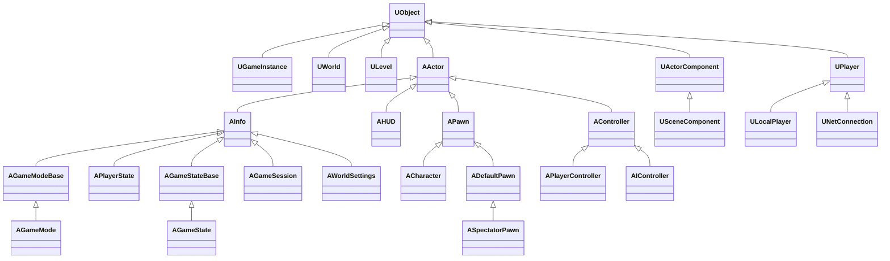

## GameInstance

`UGameInstance` 表示一个正在运行的游戏实例，是 Gameplay 框架中最顶层的对象，在非编辑器模式下是全局单例。生命周期横跨整个游戏进程，可以为项目派生一个自定义的 `UGameInstance`，并在 Project Settings 中设置，管理跨越不同游戏世界和游戏关卡的全局状态，比如：游戏的全局性配置、游戏的整体通关进度等。

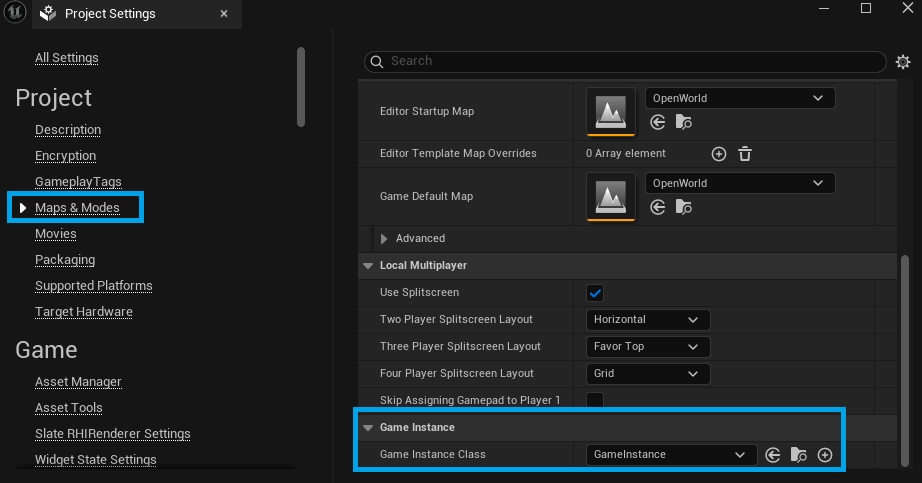

> 在多人游戏中，`UGameInstance` 即存在于所有玩家的客户端进程，也存在于服务器进程中。

> `UGameInstance` 的生命周期详见[[engine_lifecycle|引擎的生命周期]]。`UGameInstance` 实例在游戏发布环境和编辑器环境有所不同：
> - 如果是非编辑器环境，`UGameEngine` 会持有 `UGameInstance`，在 `UGameEngine::Init()` 函数中会读取 GameMapsSettings 配置，创建 `UGameInstance` 实例。
> - 如果是编辑器环境，`UUnrealEdEngine` 不会持有 `UGameInstance`，只有在启动 PIE（Play In Editor）时，按需为每个 PIE 实例创建 `UGameInstance` 实例。（`UEditorEngine::CreateInnerProcessPIEGameInstance`）

在非编辑器环境中，`UGameEngine` 持有 `UGameInstance`，`UGameInstance` 通过 `FWorldContext` 间接持有 `UWorld`（游戏世界）：

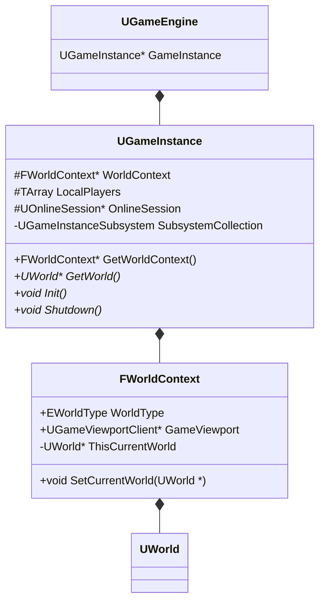

## World-Level

`UWorld` 表示一个游戏世界，`ULevel` 表示一个游戏关卡。`UWorld` 是 `ULevel` 的容器，一个 `UWorld` 可以包含多个 `ULevel`，而 `ULevel` 是 `AActor` 的容器，一个 `ULevel` 可以包含多个 `AActor`。

在 UE 中，Level 加载的经典方式是 [Level Streaming](https://dev.epicgames.com/documentation/unreal-engine/level-streaming-in-unreal-engine?application_version=5.5)，也即每个 `UWorld` 会有一个**持久化关卡 （Persistent Level）**，以及若干个**流式关卡（Streaming Level）**。

- **持久化关卡（Persistent Level）**：游戏世界的核心关卡，通常包含游戏的主要逻辑和基础设施，在游戏运行时随 World 一同创建。
- **流式关卡（Streaming Level）**：用于动态加/卸载内容，流式有两种设置：
  1. **Blueprint**：通过关卡流送体（Level Streaming Volume）、蓝图或 C++ 代码动态加载或卸载
  2. **Always Loaded**：与持久关卡一同加载，并设为可视状态，无法通过流送体、蓝图或代码加载。这种关卡也不被卸载，除非游戏世界切换

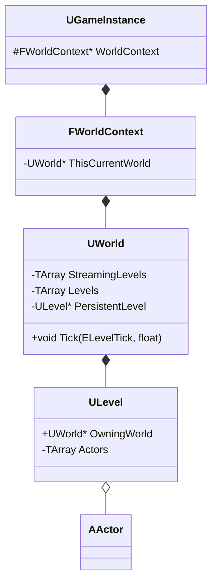

### 地图资产创建与管理

在 Content Browser 中，右键 Level 创建一个 *.umap 文件：

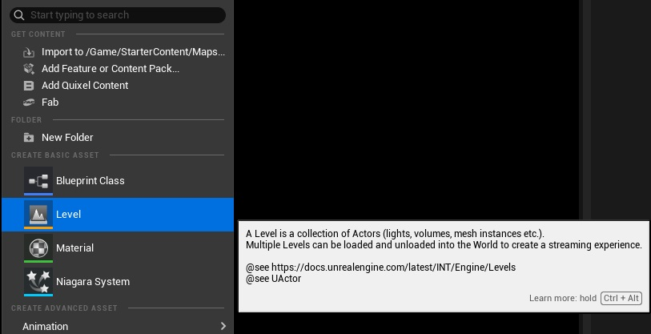

*.umap 类型资产称为 Map 文件，对应的 C++ 类型是 `UWorld`。打开一个 Map，在 Levels 面板中，可以为 World 配置关卡：

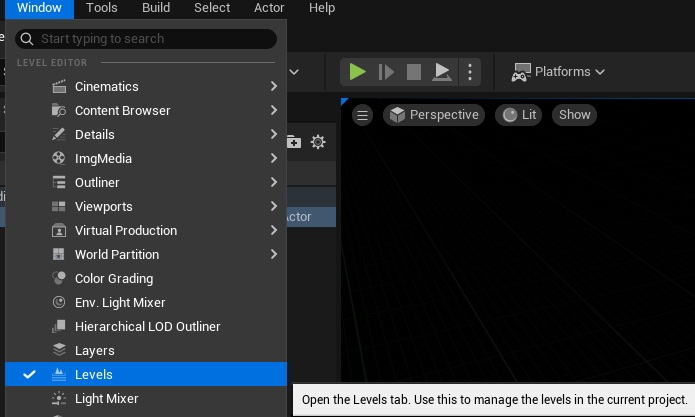

如果将 Map2 文件拖进 Map1 的 Levels 面板中，会将 Map2 的持久化关卡作为 Map1 的流式关卡，在 Levels 面板中可以为 Map2 配置流式加载方式：

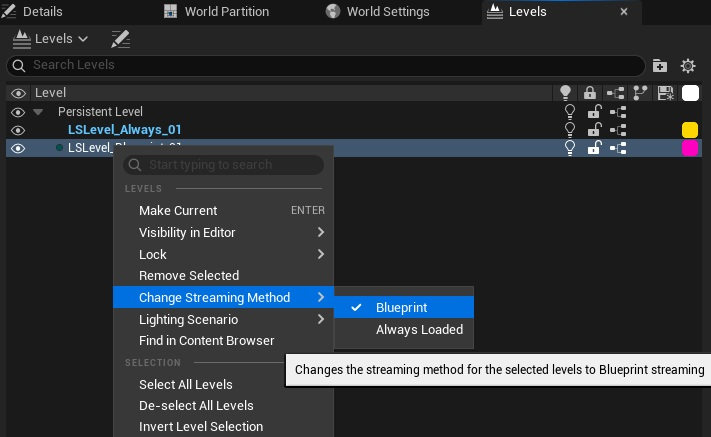

### 关卡蓝图

点击按钮可以打开关卡蓝图：

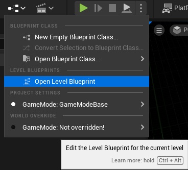

或者在 Levels 面板中选择关卡点击按钮打开关卡蓝图：

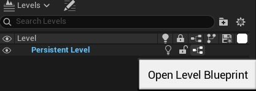

关卡蓝图的资产类型为 `LevelScriptBlueprint`，是 EditorOnlyData，用于生成 `LevelScriptActor`。`LevelScriptActor` 是关卡蓝图运行时的实例化对象，继承自 `AActor`。当 `ULevel` 被加载并初始化时，会创建该 Level 的 `LevelScriptActor`；当 Level 被卸载或整个 World 被销毁时，该 Actor 一并清理。

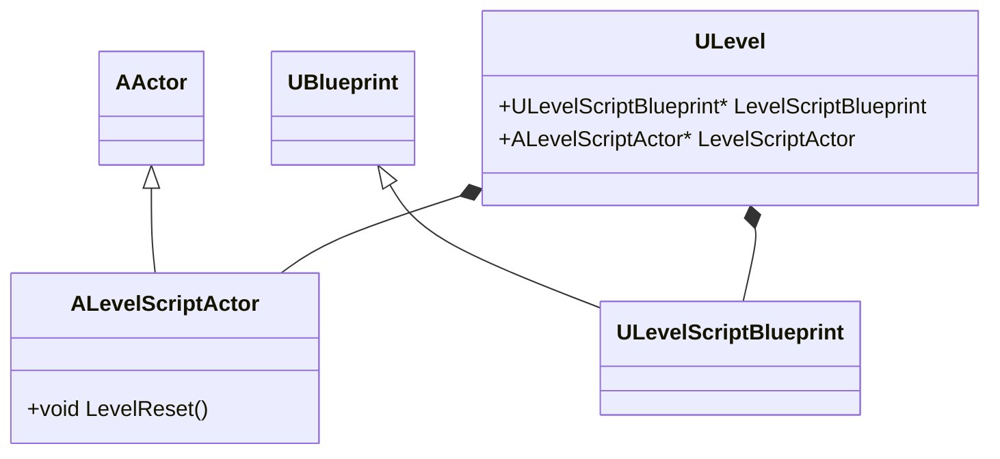

### Level Instance

### World Settings

### World Partition

## Actor-Component

`AActor` 是游戏世界中的一个对象，即可以是有实体、可交互的具体对象（比如 `APawn`，`ACharacter` 等），也可以是无实体的逻辑对象（比如 `AController`），还可以是无实体的数据对象（比如 `AInfo`，`AWorldSettings` 等）。`UActorComponent` 表示一个组件，用于拓展 `AActor` 的功能和行为。在 Unreal Engine 中，Component 分为两大类：
1. **Actor Component**：`UActorComponent` 是所有组件的基类，提供特定的属性和行为
2. **Scene Component**：`USceneComponent` 继承者 `UActorComponent` ，提供了 Transform 属性，用于设置组件的空间变换与组件之间的附着（Attach）关系。每个 Actor 都有一个 RootComponent，它是一个 SceneComponent 类型，以便在游戏世界里自由放置（Placing），该 Actor 下的所有 SceneComponent 都会 Attach 到这个 RootComponent 下。Actor 的 RootComponent 也能 Attach 到另一个 Actor 的某个 SceneComponent 下。如果没有父 Actor，则默认 Attach 到世界坐标系下

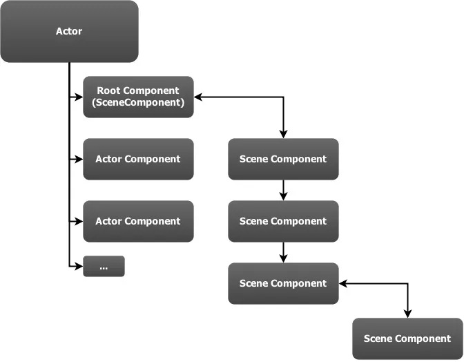

> 如果 `UWorld` 是 `ULevel` 的容器，`ULevel` 是 `AActor` 的容器，那么 `AActor` 就是 `UActorComponent` 的容器。

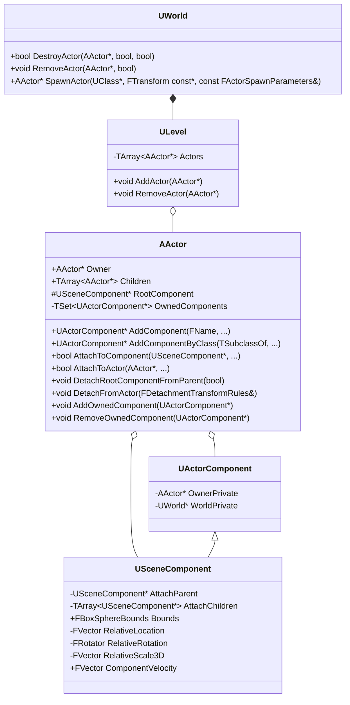

`UWorld` 类成员 | 描述 
-|-
`UWorld::SpawnActor(...)` | 用于在游戏世界中创建一个 Actor 实例，可以通过 `FActorSpawnParameters` 参数指定 Actor 创建时的各种设置。Actor 实例最终会归属一个 `ULevel`，如果没在 `FActorSpawnParameters` 中指定，则会归属 `UWorld::PersistentLevel` 持久化关卡。
`UWorld::RemoveActor(...)` | 移除 Actor 
`UWorld::DestroyActor(...)` | 销毁 Actor

### Actor 生命周期

详见[官方文档](https://dev.epicgames.com/documentation/unreal-engine/unreal-engine-actor-lifecycle?application_version=5.5)

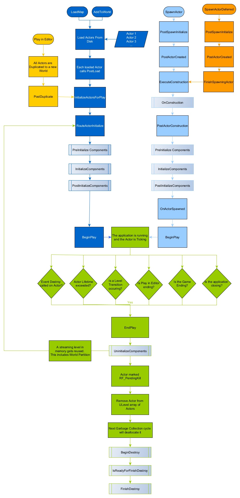

### 网络复制

## Mode-State-Session

## Player-Pawn-Controller

## Server-Client

## Subsystem

## Summary