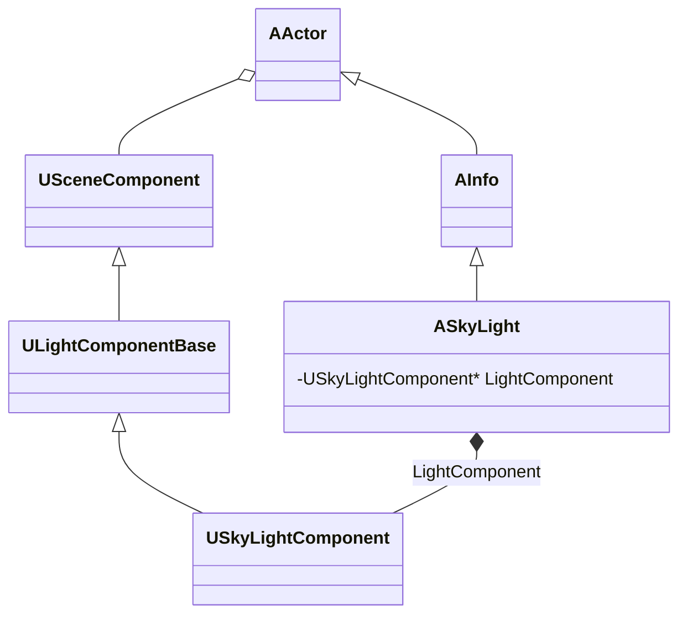
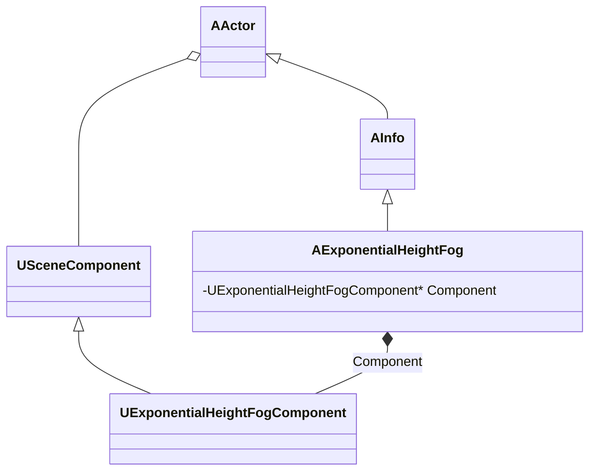
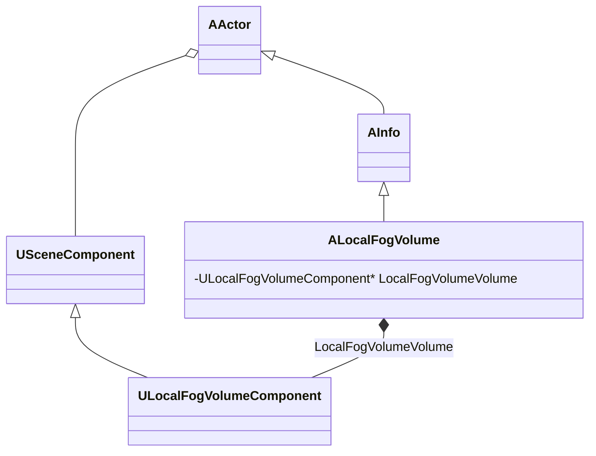
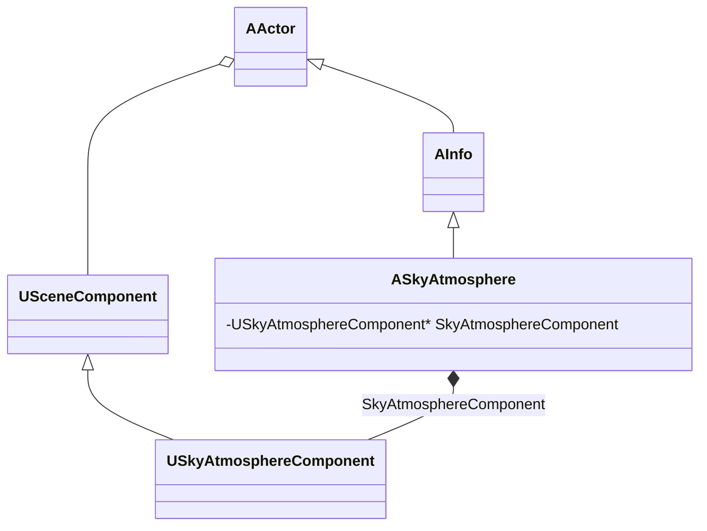

# 雾、云、天空和大气

天光：

```mermaid
classDiagram
    AActor <|-- AInfo
    AActor o-- USceneComponent
    USceneComponent <|-- ULightComponentBase
    ULightComponentBase <|-- USkyLightComponent
    AInfo <|-- ASkyLight
    ASkyLight *-- USkyLightComponent : LightComponent

    class ASkyLight {
        -USkyLightComponent* LightComponent
    }
```

全局高度雾：

```mermaid
classDiagram
    AActor <|-- AInfo
    AActor o-- USceneComponent
    USceneComponent <|-- UExponentialHeightFogComponent
    AInfo <|-- AExponentialHeightFog
    AExponentialHeightFog *-- UExponentialHeightFogComponent : Component

    class AExponentialHeightFog {
        -UExponentialHeightFogComponent* Component
    }
```

局部体积雾：

```mermaid
classDiagram
    AActor <|-- AInfo
    AActor o-- USceneComponent
    USceneComponent <|-- ULocalFogVolumeComponent
    AInfo <|-- ALocalFogVolume
    ALocalFogVolume *-- ULocalFogVolumeComponent : LocalFogVolumeVolume

    class ALocalFogVolume {
        -ULocalFogVolumeComponent* LocalFogVolumeVolume
    }
```

大气：

```mermaid
classDiagram
    AActor <|-- AInfo
    AActor o-- USceneComponent
    USceneComponent <|-- USkyAtmosphereComponent
    AInfo <|-- ASkyAtmosphere
    ASkyAtmosphere *-- USkyAtmosphereComponent : SkyAtmosphereComponent

    class ASkyAtmosphere {
        -USkyAtmosphereComponent* SkyAtmosphereComponent
    }
```

体积云：

```mermaid
classDiagram
    AActor <|-- AInfo
    AActor o-- USceneComponent
    USceneComponent <|-- UVolumetricCloudComponent
    AInfo <|-- AVolumetricCloud
    AVolumetricCloud *-- UVolumetricCloudComponent : VolumetricCloudComponent

    class AVolumetricCloud {
        -UVolumetricCloudComponent* VolumetricCloudComponent
    }
```