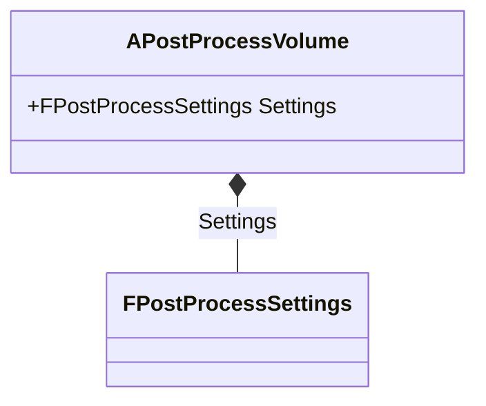

# 后处理

```mermaid
classDiagram
    APostProcessVolume *-- FPostProcessSettings : Settings
    class APostProcessVolume {
        +FPostProcessSettings Settings
    }

    class FPostProcessSettings {

    }
```