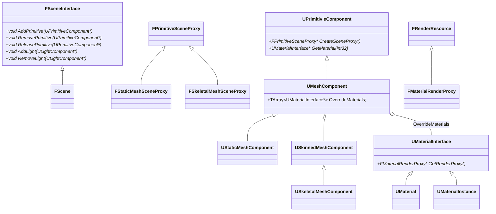
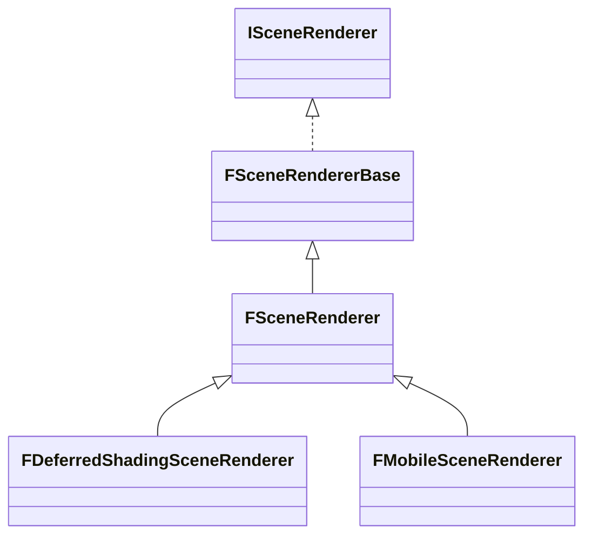
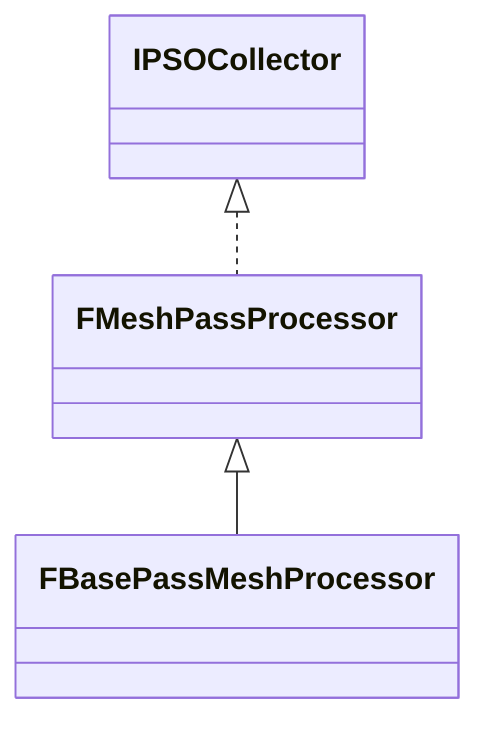

FScene

```mermaid
classDiagram
    FSceneInterface <|-- FScene
    FPrimitiveSceneProxy <|-- FStaticMeshSceneProxy
    FPrimitiveSceneProxy <|-- FSkeletalMeshSceneProxy
    UPrimitivieComponent  <|-- UMeshComponent
    UMeshComponent <|-- UStaticMeshComponent
    UMeshComponent <|-- USkinnedMeshComponent
    USkinnedMeshComponent <|-- USkeletalMeshComponent
    UMeshComponent o-- UMaterialInterface : OverrideMaterials
    UMaterialInterface <|-- UMaterial
    UMaterialInterface <|-- UMaterialInstance
    FRenderResource <|-- FMaterialRenderProxy

    class UPrimitivieComponent {
        +FPrimitiveSceneProxy* CreateSceneProxy()*
        +UMaterialInterface* GetMaterial(int32)*
    }

    class UMeshComponent {
        +TArray~UMaterialInterface*~ OverrideMaterials;
    }

    class FPrimitiveSceneProxy {

    }

    class FSceneInterface {
        +void AddPrimitive(UPrimitiveComponent*)*
        +void RemovePrimitive(UPrimitiveComponent*)*
        +void ReleasePrimitive(UPrimitiveComponent*)*
        +void AddLight(ULightComponent*)*
        +void RemoveLight(ULightComponent*)*
    }

    class FMaterialRenderProxy {

    }

    class UMaterialInterface {
        +FMaterialRenderProxy* GetRenderProxy()*
    }
```

场景渲染器：

```mermaid
classDiagram
    ISceneRenderer <|.. FSceneRendererBase
    FSceneRendererBase <|-- FSceneRenderer
    FSceneRenderer <|-- FDeferredShadingSceneRenderer
    FSceneRenderer <|-- FMobileSceneRenderer
```

```mermaid
classDiagram
    IPSOCollector <|.. FMeshPassProcessor
    FMeshPassProcessor <|-- FBasePassMeshProcessor
```