# 虚幻引擎渲染概览

## 渲染组件

在游戏世界 `UWorld` 中，`AActor` 是逻辑的载体，但它并不直接参与渲染，需要为 `AActor` 添加渲染相关组件。Unreal Engine 中，渲染相关的组件分三大类：
1. `UCameraComponent`：决定观察的视角
2. `UPrimitiveComponent`：决定被渲染物体的几何与材质
3. `ULightComponent`：决定场景的光照

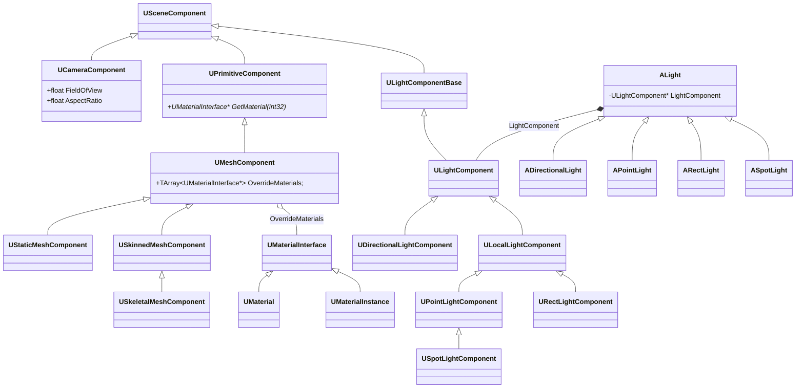

### 相机

相机决定渲染时的观察视角，相机组件 `UCameraComponent` 决定了相机的具体参数，如视野（`FieldOfView`）、投影模式（`ProjectionMode`）等，详见[官方文档](https://dev.epicgames.com/documentation/unreal-engine/using-cameras-in-unreal-engine)。相机与后处理（PostProcess）紧密相关，相机组件 `UCameraComponent` 包含了后处理相关的设置，如 `PostProcessBlendWeight` 和 `PostProcessSettings`。具体的后处理参数，详见[官方文档](https://dev.epicgames.com/documentation/unreal-engine/post-process-effects-in-unreal-engine)

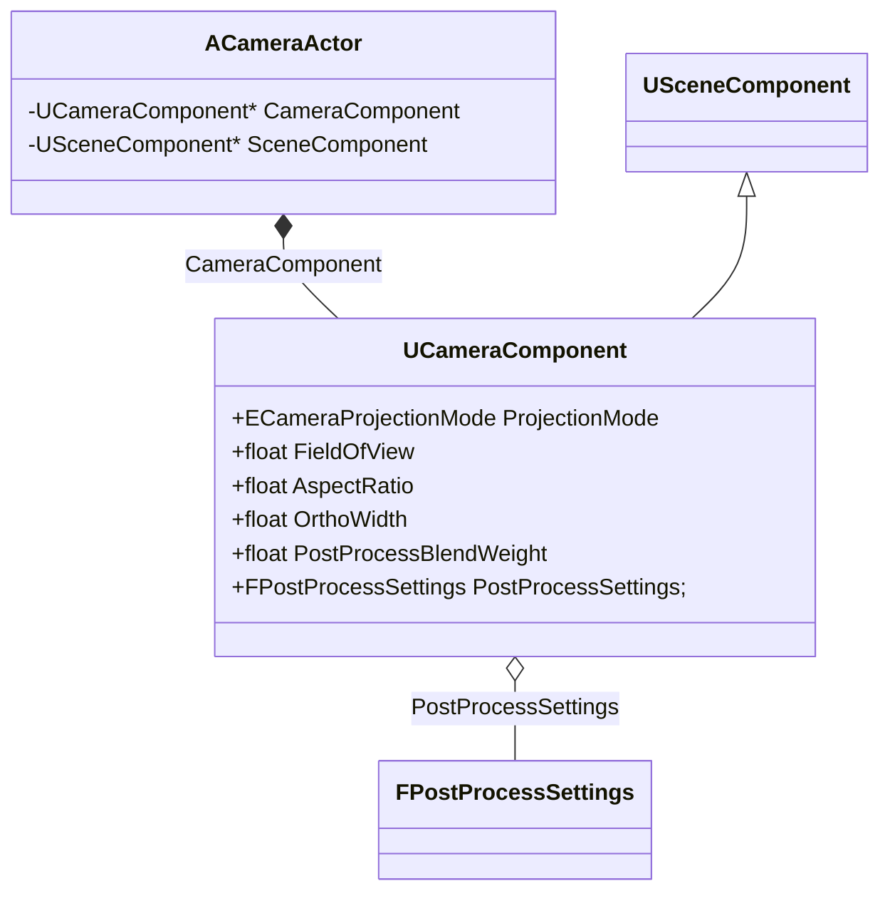

在 Detials 面板上设置相机相关的参数：

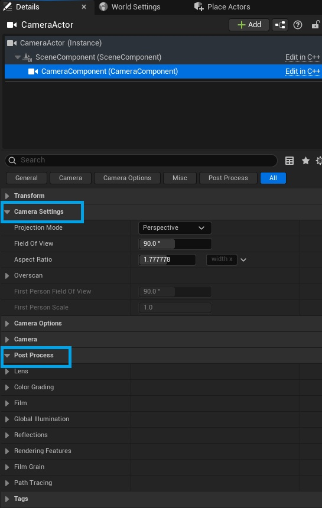

### 图形与材质

`UPrimitiveComponent` 是图形组件的“抽象”基类，提供了对材质的访问接口 `GetMaterial` 方法。`UMaterialInterface` 是材质的接口，`UMaterial` 和 `UMaterialInstance` 是其具体实现。

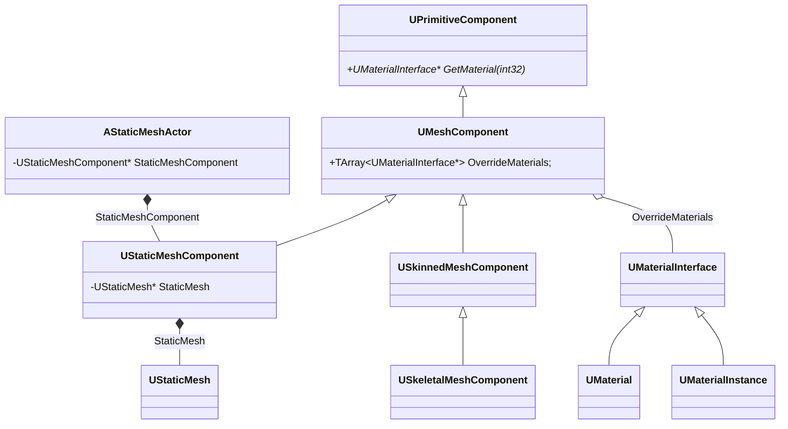

#### 静态网格体（Static Mesh）

静态网格体（Static Mesh）表示一个不会发生形变的几何体，详见[官方文档](https://dev.epicgames.com/documentation/unreal-engine/static-meshes) 

### 光照

天光：

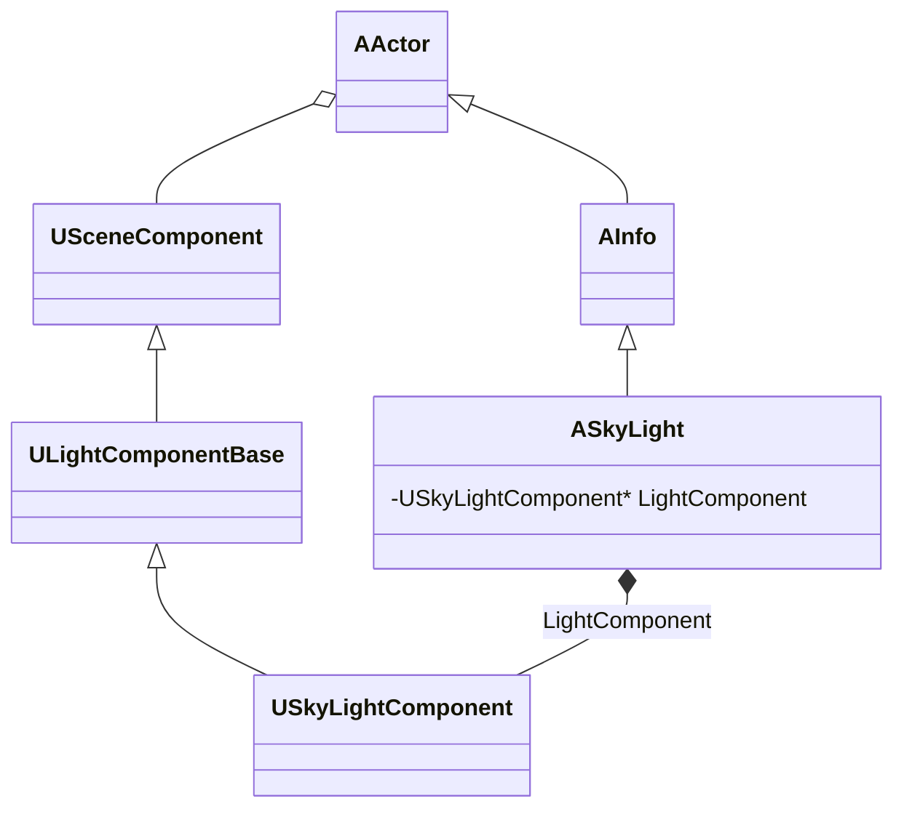

### 后处理

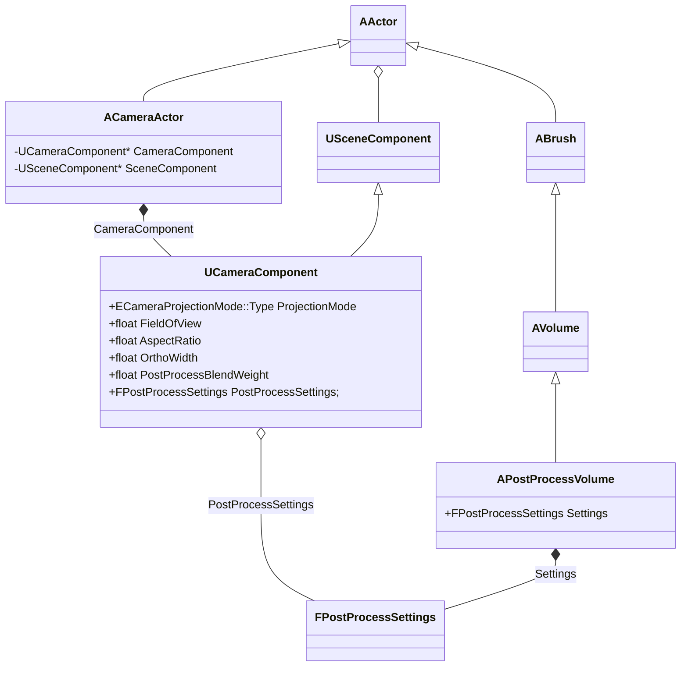

### 全局光照

### 大气与雾气

详见[官方文档](https://dev.epicgames.com/documentation/unreal-engine/environmental-light-with-fog-clouds-sky-and-atmosphere-in-unreal-engine)

全局高度雾：

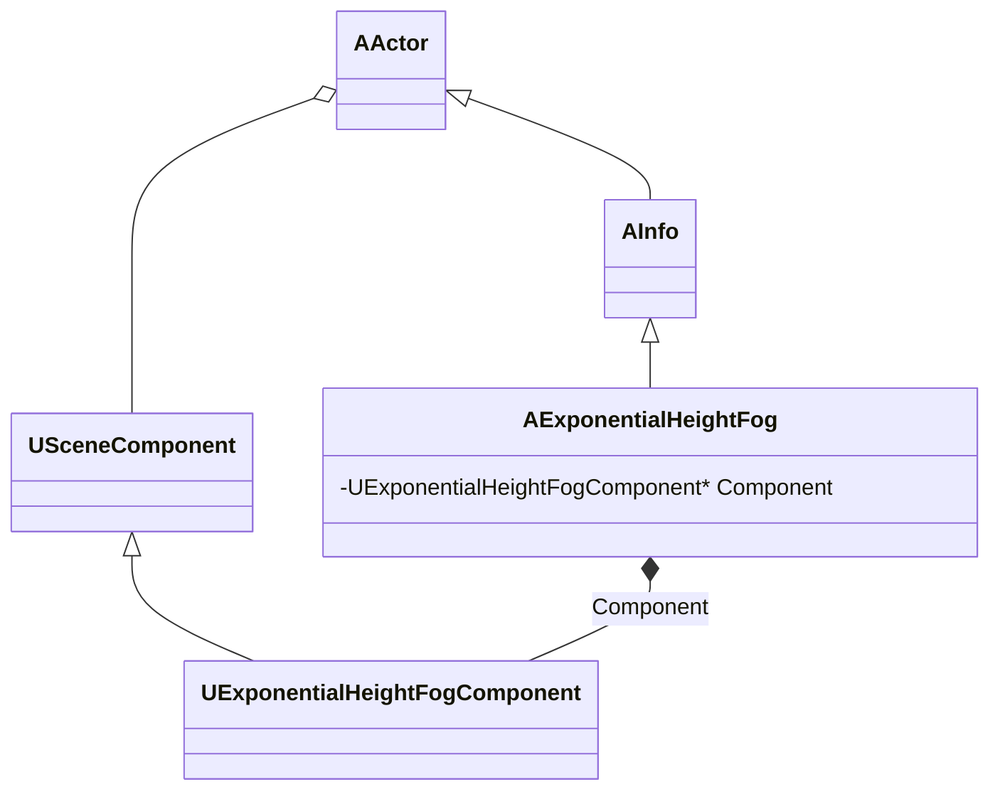

局部体积雾：

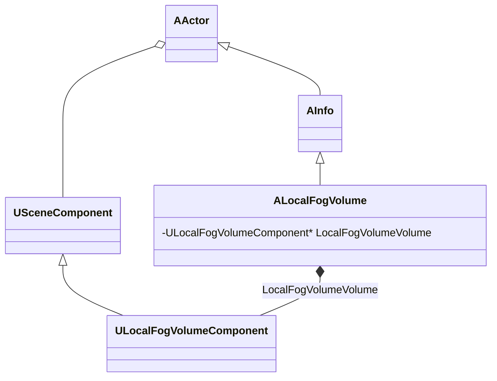

大气：

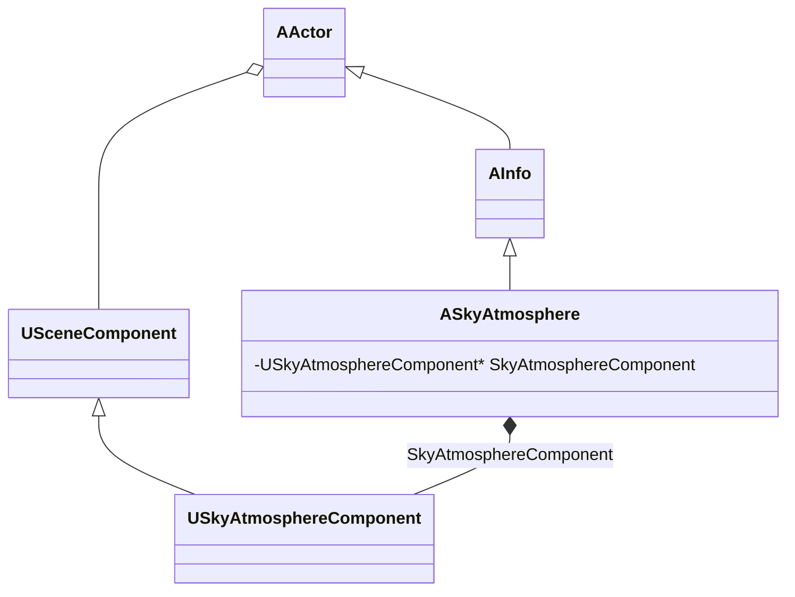

体积云：


## 渲染线程与渲染场景

### 渲染线程

为了提高效率，渲染逻辑和游戏逻辑运行在不同的线程上。渲染线程 `FRenderingThread` 继承自 `FRunnable`，其核心成员如下：

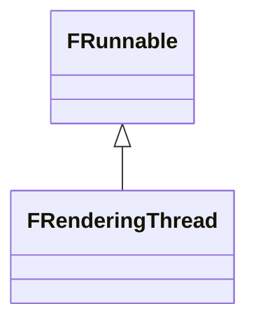

#### 渲染命令

```cpp
/** Declares a new render command tag type from a name. */
#define DECLARE_RENDER_COMMAND_TAG(Type, Name, ...) \
    struct UE_JOIN(TSTR_, Name, __LINE__) \
    {  \
        static const char* CStr() { return #Name; } \
        static const TCHAR* TStr() { return TEXT(#Name); } \
        static constexpr ERenderCommandCategory GetCategory() { return __VA_OPT__(ERenderCommandCategory::__VA_ARGS__;) ERenderCommandCategory::Unknown; } \
    }; \
    using Type = TRenderCommandTag<UE_JOIN(TSTR_, Name, __LINE__)>;

/** Enqueues a render command to a render pipe. The default implementation takes a lambda and schedules on the render thread.
 *  Alternative implementations accept either a reference or pointer to an FRenderCommandPipe instance to schedule on an async
 *  pipe, if enabled.
 */
#define ENQUEUE_RENDER_COMMAND(Type, ...) \
    DECLARE_RENDER_COMMAND_TAG(UE_JOIN(FRenderCommandTag_, Type, __LINE__), Type, __VA_ARGS__) \
    FRenderCommandDispatcher::Enqueue<UE_JOIN(FRenderCommandTag_, Type, __LINE__)>
```


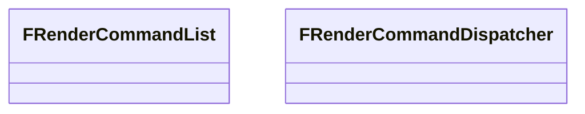

### 渲染场景

```mermaid
classDiagram
    FSceneInterface <|-- FScene
    FPrimitiveSceneProxy <|-- FStaticMeshSceneProxy
    FPrimitiveSceneProxy <|-- FSkeletalMeshSceneProxy
    FMaterial <|-- FMaterialResource
    FSceneView <|-- FViewInfo

    class UCameraComponent {
        +void GetCameraView(float, FMinimalViewInfo&)*
        +void AddOrUpdateBlendable(...)
        +void RemoveBlendable(...)
    }

    class FSceneInterface {
        +void AddPrimitive(UPrimitiveComponent*)*
        +void RemovePrimitive(UPrimitiveComponent*)*
        +void ReleasePrimitive(UPrimitiveComponent*)*
        +void AddLight(ULightComponent*)*
        +void RemoveLight(ULightComponent*)*
    }

    class FPrimitiveSceneProxy {

    }

    class UPrimitivieComponent {
        +FPrimitiveSceneProxy* CreateSceneProxy()*
    }

    class UMaterialInterface {
        +FMaterialRenderProxy* GetRenderProxy()*
    }

    class ULightComponent {
        +FLightSceneProxy* CreateSceneProxy()*
    }

    class FLightSceneProxy {

    }

    class FMinimalViewInfo {
        +FVector Location
        +FRotator Rotation
        +float FOV
        +float PerspectiveNearClipPlane
        +float AspectRatio
        +ECameraProjectionMode ProjectionMode
        +float PostProcessBlendWeight
        +FPostProcessSettings PostProcessSettings
    }
```

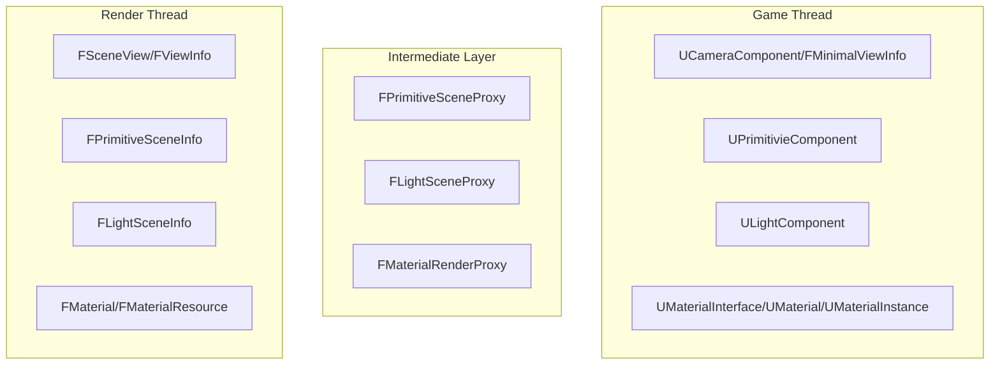

在游戏的主线程，通过 `UCameraComponent::GetCameraView()` 函数，获取当前相机的 `FMinimalViewInfo` 信息，它是游戏线程相机属性的快照。


在 SceneRendering.cpp 中，不同版本的 Unreal Engine 略有差异：

Unreal Engine 5.5
```cpp
RenderViewFamilies_RenderThread
```

Unreal Engine 5.6
```cpp
RenderViewFamily_RenderThread
```

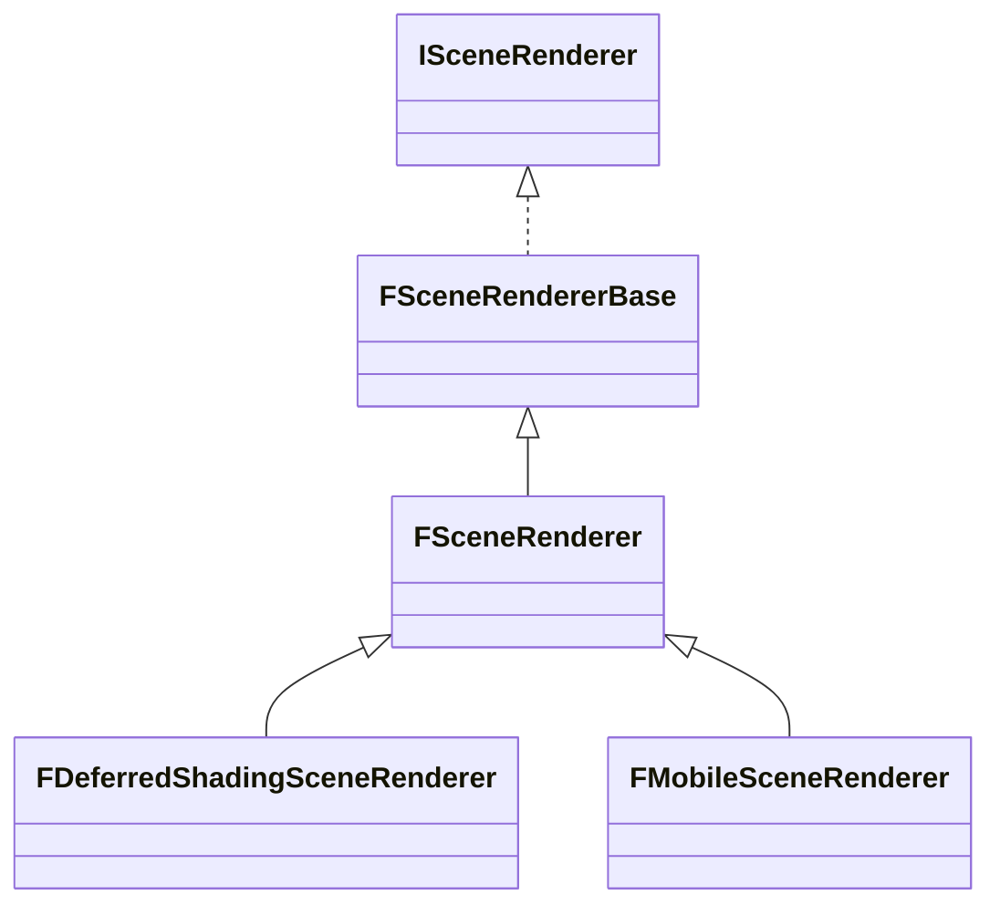

## 延迟渲染管线与着色器

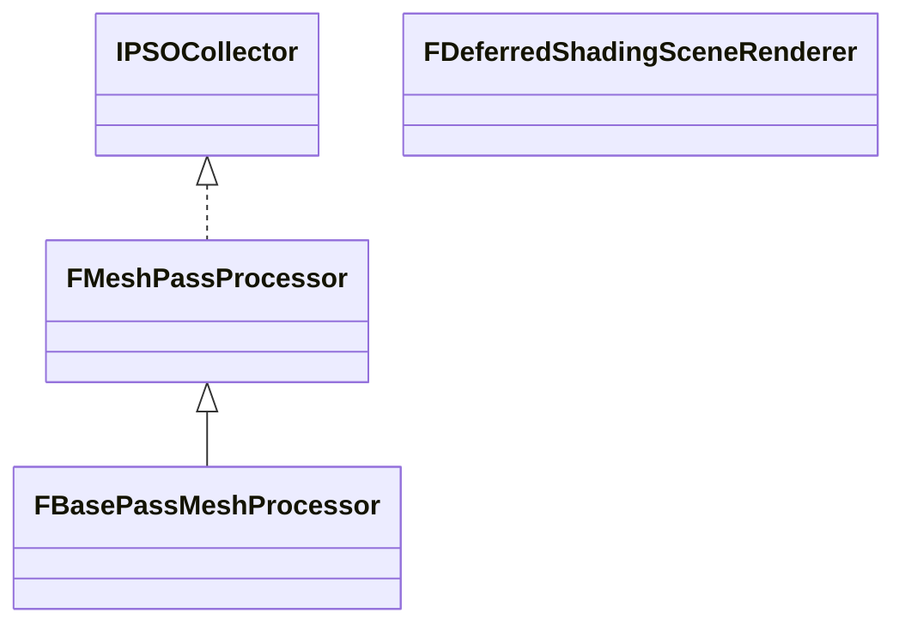

### Shader

## RDG & RHI
