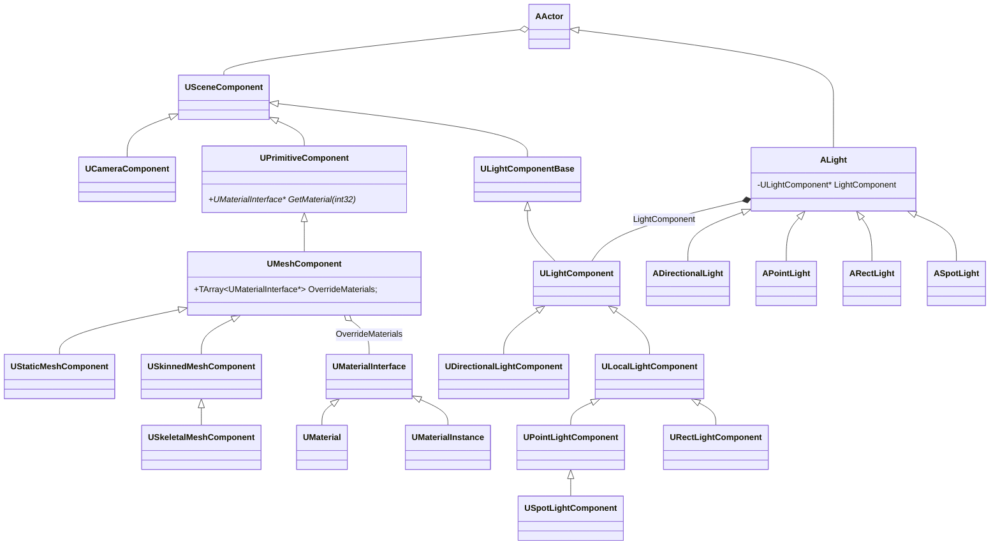
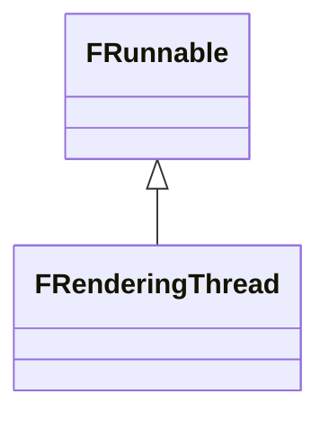
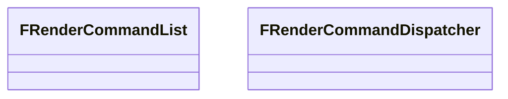
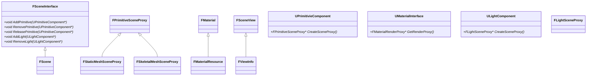
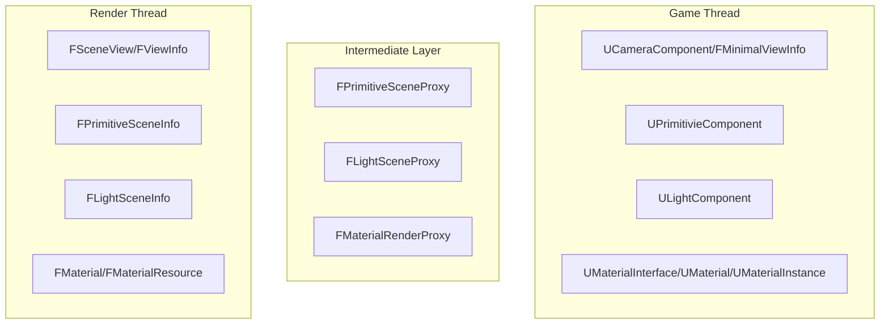
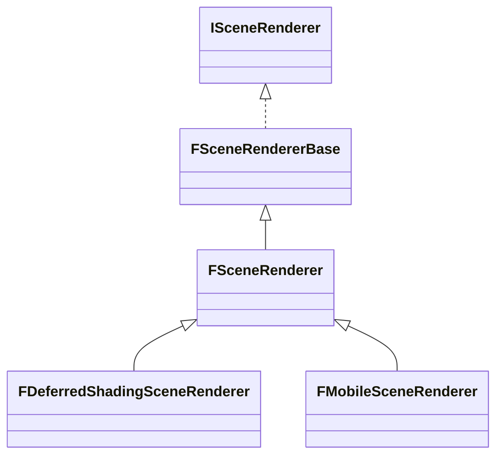
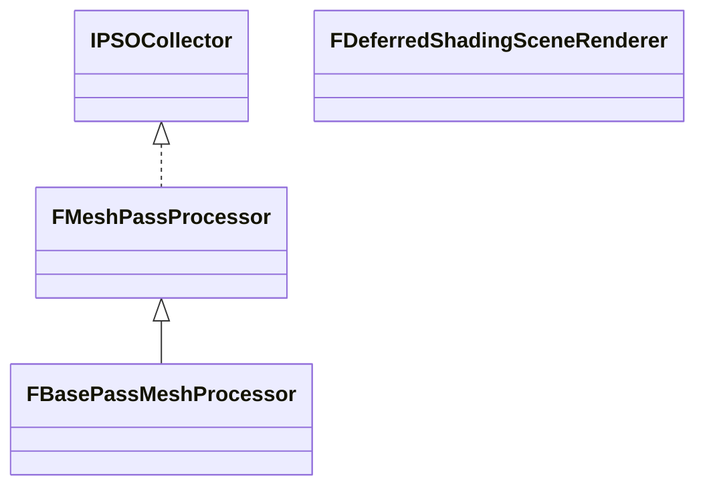

# 虚幻引擎渲染概览

## 渲染组件

在游戏世界 `UWorld` 中，`AActor` 是逻辑的载体，但它并不直接参与渲染，需要为 `AActor` 添加渲染相关组件。Unreal Engine 中，渲染相关的组件分三大类：
1. `UCameraComponent`：决定观察的视角
2. `UPrimitiveComponent`：决定被渲染物体的几何与材质
3. `ULightComponent`：决定场景的光照



### 相机

### 图形与材质

### 光照

## 渲染线程与渲染场景

### 渲染线程

为了提高效率，渲染逻辑和游戏逻辑运行在不同的线程上。渲染线程 `FRenderingThread` 继承自 `FRunnable`，其核心成员如下：



#### 渲染命令

```cpp
/** Declares a new render command tag type from a name. */
#define DECLARE_RENDER_COMMAND_TAG(Type, Name, ...) \
    struct UE_JOIN(TSTR_, Name, __LINE__) \
    {  \
        static const char* CStr() { return #Name; } \
        static const TCHAR* TStr() { return TEXT(#Name); } \
        static constexpr ERenderCommandCategory GetCategory() { return __VA_OPT__(ERenderCommandCategory::__VA_ARGS__;) ERenderCommandCategory::Unknown; } \
    }; \
    using Type = TRenderCommandTag<UE_JOIN(TSTR_, Name, __LINE__)>;

/** Enqueues a render command to a render pipe. The default implementation takes a lambda and schedules on the render thread.
 *  Alternative implementations accept either a reference or pointer to an FRenderCommandPipe instance to schedule on an async
 *  pipe, if enabled.
 */
#define ENQUEUE_RENDER_COMMAND(Type, ...) \
    DECLARE_RENDER_COMMAND_TAG(UE_JOIN(FRenderCommandTag_, Type, __LINE__), Type, __VA_ARGS__) \
    FRenderCommandDispatcher::Enqueue<UE_JOIN(FRenderCommandTag_, Type, __LINE__)>
```




### 渲染场景





在 SceneRendering.cpp 中，不同版本的 Unreal Engine 略有差异：

Unreal Engine 5.5
```cpp
RenderViewFamilies_RenderThread
```

Unreal Engine 5.6
```cpp
RenderViewFamily_RenderThread
```



## 延迟渲染管线



## RDG & RHI
