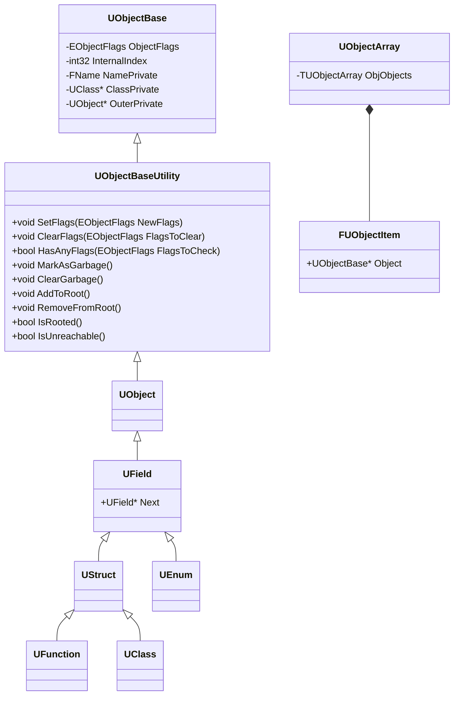
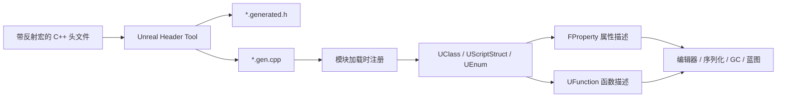

# UObject Overview

UObject 是虚幻引擎实现的对象系统，在 C++ 的基础上实现反射、序列化、垃圾回收等现代编程语言的特性。

## 重要类型

核心类型声明在如下文件中：

- Runtime/CoreUObject/Public/UObject/UObjectBase.h
- Runtime/CoreUObject/Public/UObject/UObjectBaseUtility.h
- Runtime/CoreUObject/Public/UObject/UObjectArray.h
- Runtime/CoreUObject/Public/UObject/Object.h
- Runtime/CoreUObject/Public/UObject/Class.h


核心类型的继承关系：



## 反射与 UHT

UE5 的反射不是 C++ 编译器自动提供的能力，也不是单纯依赖 RTTI。它采用“**UHT 生成代码 + 运行时 UObject 元对象**”的方案：UHT 在编译前扫描带有反射宏的头文件，生成描述类型、属性和函数的代码；引擎启动或模块加载时执行这些代码，把信息注册为 `UClass`、`FProperty`、`UFunction` 等运行时对象。之后编辑器、蓝图、序列化系统和 GC 都通过这些元对象访问 C++ 类型。

### 1. 反射声明

只有继承自 UObject 体系、并使用 UHT 能识别的声明，才会进入 UE 的反射系统。常见宏的职责如下：

- `UCLASS(...)`：声明一个可被反射的 `UClass`，参数控制蓝图可见性、生成规则、配置文件等。
- `USTRUCT(...)`：声明可反射的值类型，运行时描述对象是 `UScriptStruct`。
- `UENUM(...)`：声明枚举及其枚举项名称。
- `UPROPERTY(...)`：把成员变量登记为 `FProperty`，参数描述编辑器、蓝图、序列化、复制和 GC 行为。
- `UFUNCTION(...)`：把成员函数登记为 `UFunction`，参数描述蓝图调用、RPC、事件和调用权限。
- `GENERATED_BODY()`：在声明内部插入 UHT 生成的类型相关代码，是反射声明和生成代码的连接点。

例如：

```cpp
UCLASS(BlueprintType)
class MYGAME_API UHealthComponent : public UActorComponent
{
  GENERATED_BODY()

public:
  UPROPERTY(EditAnywhere, BlueprintReadWrite, Category = "Health")
  float MaxHealth = 100.0f;

  UFUNCTION(BlueprintCallable, Category = "Health")
  void ApplyDamage(float Damage);
};
```

这些宏大多不是在运行时自己完成反射，而是给 UHT 提供语法标记和参数。宏展开、普通 C++ 编译和 UHT 解析是三个相关但不同的阶段。

### 2. UHT 的编译期工作

UHT（Unreal Header Tool）由 UnrealBuildTool 在编译模块时驱动。它不需要完整地执行 C++ 代码，而是解析 UE 约定的头文件语法，主要完成以下工作：

1. 查找 `UCLASS`、`USTRUCT`、`UENUM`、`UPROPERTY` 和 `UFUNCTION` 等声明，并校验宏参数和类型约束。
2. 收集类型名、继承关系、属性类型、函数参数、默认值、元数据和访问标记。
3. 为每个模块生成 `*.generated.h`，并生成包含反射注册、属性构造、函数参数封装和序列化辅助逻辑的 `*.gen.cpp`。

因此，使用反射宏的头文件通常必须包含自己的生成头，并且 `*.generated.h` 应当是最后一个 `#include`：

```cpp
#include "Components/ActorComponent.h"
#include "HealthComponent.generated.h"
```

生成头不是开发者手写的业务代码，也不应直接修改。修改宏声明后需要重新运行 UHT；如果生成代码没有更新，常见表现是类型未注册、链接错误，或蓝图看不到属性和函数。

### 3. 运行时元对象模型

UHT 生成的代码把编译期收集的信息转换成 UObject 运行时可以使用的对象关系：



核心关系可以这样理解：

- `UClass` 描述 UObject 派生类，并保存父类、默认对象（CDO）、属性链和函数查找信息。
- `UScriptStruct` 描述可反射的结构体；`UEnum` 描述枚举及其名称和值。
- `FProperty` 描述一个字段的类型、偏移、数组维度、标记和元数据。它本身不是字段值，字段值仍位于对象实例的内存中。
- `UFunction` 描述函数的名字、参数属性、标记和调用信息。蓝图或脚本可以通过 `ProcessEvent` 按反射信息组织参数并调用函数。
- `UField`、`UStruct` 等类型把这些描述对象组织成 UObject 体系，因此它们自身也能被全局对象系统、名称系统和 GC 管理。

对象实例通过 `UObjectBase::ClassPrivate` 指向自己的 `UClass`。沿着 `UClass` 的父类链可以判断继承关系；沿着属性和函数描述可以按名字或标记查询成员，而不需要在调用方重新写一份类型表。

### 4. 一次反射调用的路径

以蓝图调用 `UFUNCTION(BlueprintCallable)` 为例，典型路径是：

1. UHT 根据函数声明生成 `UFunction` 的注册和参数描述代码。
2. 模块加载时，注册代码把 `UFunction` 挂到对应的 `UClass` 上。
3. 蓝图节点保存目标函数的反射信息，并在运行时准备一块符合参数布局的内存。
4. 引擎通过 `UFunction` 找到实际函数入口，通常经 `UObject::ProcessEvent` 分发调用。
5. 函数执行完成后，调用方按同一组 `FProperty` 描述读取返回值或输出参数。

属性访问和序列化遵循相同思想：系统遍历 `FProperty`，根据属性标记决定是否编辑、保存、复制或参与引用追踪。`UPROPERTY` 并不会把任意 C++ 指针自动变成安全的 UObject 引用；只有被反射系统识别且使用正确属性类型和标记的引用，相关系统才能正确处理它。

### 5. 反射系统的边界

- UE 反射与 C++ RTTI 是两套系统。项目通常关闭 RTTI，而 `Cast<>`、`IsA()`、`GetClass()` 等 UObject 类型判断依赖 `UClass` 元数据和继承关系。
- 不是所有 C++ 类型都可反射。任意模板实例、没有 UE 宏声明的普通类、未标记的成员和函数不会自动出现在蓝图或编辑器中。
- 反射宏不会改变 C++ 的访问控制，也不会让私有成员变成普通 C++ 调用方可访问的成员；它们只是让引擎获得额外的类型描述。
- `UFUNCTION` 只有在适合的签名和标记下才能暴露给蓝图或网络系统；普通 C++ 函数即使名字相似，也不会自动成为 `UFunction`。
- 反射信息包含类型结构和元数据，但不等于完整的运行时调试信息。它不能替代 C++ 编译器的重载解析、模板实例化或任意代码生成能力。

从整体上看，UHT 解决“**如何从 C++ 声明生成稳定的元数据和胶水代码**”，UObject 运行时解决“**如何保存、查找和使用这些元数据**”。二者共同构成 UE5 反射的基础，并为蓝图、编辑器、序列化、网络复制和垃圾回收提供统一入口。


## 类型简介

### `UObjectBase`

UObjectBase 是 UObject 的基类，其成员变量是 UObject 的核心组成部分，决定了对象的状态、类型、层级和名称。

**重要成员变量**
- `ObjectFlags`：对象标志位（RF_XXX），决定对象状态。这是引擎大量判断分支的基础。
- `InternalIndex`：对象在全局对象数组中的索引，属于对象运行时身份的一部分；GetUniqueID 本质上就是基于它。
- `ClassPrivate`：指向对象所属的 UClass，决定“这个对象是什么类型”。
- `NamePrivate`：对象名，和 Outer 共同决定对象路径/命名层级。
- `OuterPrivate`：指向持有该对象的外部对象，构成 UObject 层级关系。

**重要成员函数**

- 注册与初始化流程：这组函数决定对象/类在引擎启动和模块加载时如何进入反射与对象管理系统，是“编译期注册 + 运行时接入”的关键
  - `RegisterDependencies()`
  - `Register(...)`
  - `DeferredRegister(...)`
  - `AddObject(...)`（私有）
  
- Flags 读写：UE5 明确强调原子接口，避免并发场景下 flags 竞争
  - `GetFlags()`
  - `AtomicallySetFlags(...)`
  - `AtomicallyClearFlags(...)`

- GC/引用计数相关：增量 GC 可达性标记、强引用计数管理
  - `MarkAsReachable()`
  - `AddRef()`
  - `ReleaseRef()`  

- 外部包相关：
  - `GetExternalPackage()`
  - `SetExternalPackage(...)`
  - `GetExternalPackageInternal()`

- 预取优化：偏底层性能优化，减少访问类指针/Outer 指针时的缓存失配
  - `PrefetchClass(...)`
  - `PrefetchOuter(...)`

### `UObjectBaseUtility`

`UObjectBaseUtility` 没有重要的成员变量，其成员变量继承自 `UObjectBase`，`UObjectBaseUtility` 提供了各种对 UObject 状态标记的增删改查接口。

### `UObject`

`UObject` 没有重要的成员变量，其成员变量继承自 `UObjectBase`。UObject 

### `UField`

### `UEnum`

### `UStruct`

### `UFunction`

### `UClass`

### `UObjectArray`
