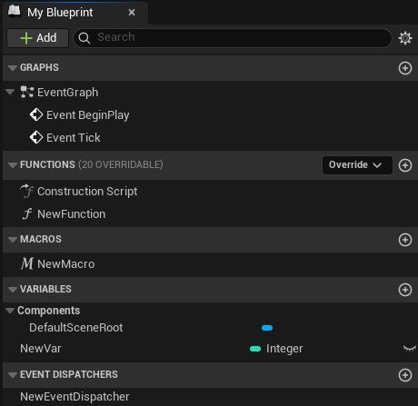
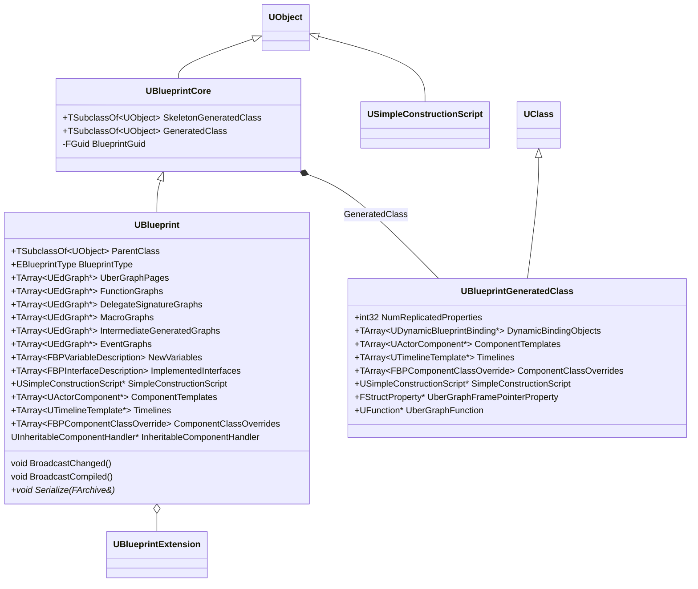
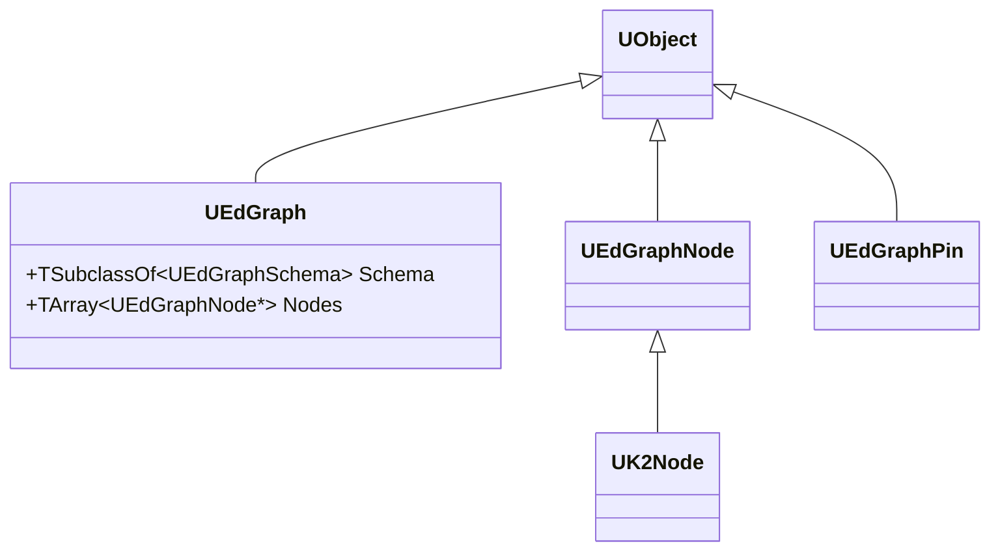

# 蓝图

[蓝图（Blueprint）](https://dev.epicgames.com/documentation/unreal-engine/blueprints-visual-scripting-in-unreal-engine?application_version=5.5)是 Unreal Engine 提供的一种可视化脚本系统，允许开发者通过节点和连线的方式实现游戏逻辑，而无需编写 C++ 代码。蓝图本质上是 UObject 的派生类，可以用来创建 Actor、组件、游戏模式等各种游戏对象。

UE5 的蓝图分为两部分：
1. 蓝图编辑的对象类型是 `UBlueprint`，它序列化后对应一个 *.uasset 文件。
2. 蓝图运行时的对象类型是 `UBlueprintGeneratedClass`（BPGC）

蓝图的编译，就是从 `UBlueprint` 生成 `UBlueprintGeneratedClass` 的过程。

`UBlueprintCore` 是蓝图的核心类，其中最重要的成员是 `GeneratedClass`，对应的就是运行时类。

`UBlueprintCore` 成员 | 描述
-|-
`SkeletonGeneratedClass`|是蓝图的骨架类，仅供编辑器在还没完整编译时解析变量/函数签名、支持交叉引用与编译顺序
`GeneratedClass`|是蓝图的最终编译生成的类，运行时将用它创建蓝图实例

`UBlueprint` 是编辑时蓝图，对应一个蓝图资产。

`UBlueprint` 成员 | 描述
-|-
`ParentClass` | 蓝图继承的父类，可以是 C++ 的 `UObject` 类，也可以是另一个蓝图类
`BlueprintType` | 蓝图的类型，可以是普通蓝图、宏蓝图、接口蓝图、关卡蓝图等
`UberGraphPages` | 一组蓝图的事件图，EditorOnlyData
`FunctionGraphs` | 一组蓝图的函数图，EditorOnlyData
`DelegateSignatureGraphs` | 一组蓝图的委托签名图，EditorOnlyData
`MacroGraphs` | 一组蓝图的宏图，EditorOnlyData
`IntermediateGeneratedGraphs` | 一组蓝图的中间生成图，EditorOnlyData
`EventGraphs` | 一组蓝图的事件图，EditorOnlyData
`NewVariables` | 一组蓝图新增变量的描述，EditorOnlyData，编译时转成生成类上的 `FProperty`
`SimpleConstructionScript` |

> `UEdGraph` 是虚幻引擎编辑器中用于构建各种“可视化节点图”的基础类型。

`UBlueprintGeneratedClass` 是蓝图编译后的运行时类：

`UBlueprintGeneratedClass` 成员 | 描述
-|-
`DynamicBindingObjects` | 
`SimpleConstructionScript` |

## 蓝图的继承

蓝图既可以继承 C++ 的 UObject 类，也可以继承另一个蓝图类。因为 `UBlueprintGeneratedClass` 就是一个 `UClass`，蓝图继承本质是 `UObject` 的类继承。蓝图的继承有「资产层」和「类层」两条继承线：
- **资产层**：`UBlueprint::ParentClass` 记录该蓝图打算继承谁。
- **类层**：编译产物 `UBlueprintGeneratedClass` 的 `UStruct::SuperStruct` 指向真正的父 `UClass`
  
编译时，`UBlueprint::ParentClass` 决定 BPGC 的 `SuperStruct`。因此运行时 `IsA` / `Cast<>` / `IsChildOf`（沿 `SuperStruct` 上溯）对蓝图类与原生类**一视同仁**。

子蓝图的属性（Property）：
- 父类的所有 `FProperty`（无论来自 C++ 还是父蓝图）通过 `SuperStruct` 天然被子类继承，`Link()` 计算布局时子类属性排在父类属性之后
- 子类蓝图新增的变量在 `UBlueprint::NewVariables` 中，编译时转成 `FProperty` 并加入到 BPGC 中
- 默认值通过 CDO 父链叠加：创建子类 CDO 时先递归创建父类 CDO，子类 CDO 以父类 CDO 为模板，再套用子蓝图设置的默认值

子蓝图的函数（Function）：
- 在运行时，BPGC 跟普通的 UClass 一样，其 SuperClass 的 `UClass::FuncMap`、`UClass::Interfaces` 和 `UClass::AllFunctionsCache`，可以通过 `UClass::FindFunctionByName(FName,...)` 函数，会沿父链查询

## 蓝图的编译

蓝图**编译**的本质是：**读 `UBlueprint` 的编辑器数据，生成/填充 `UBlueprintGeneratedClass`**

## 蓝图的运行

## 蓝图编辑器

`UEdGraph` 是虚幻引擎编辑器中用于构建各种“可视化节点图”的基础类型。

- `UEdGraph` 一张节点图，负责组织节点
- `UEdGraphNode` 节点图中的节点
- `UEdGraphPin` 节点上的输入/输出端口
- `UEdGraphSchema` 定义图的规则
- `UK2Node` 继承自 `UEdGraphNode`，是所有蓝图特定节点的基类。每个 `UK2Node` 子类代表了蓝图中的一种"语句"或"表达式"——编译器遍历节点图时，通过 `UK2Node` 的虚函数接口将每个节点翻译为字节码。

