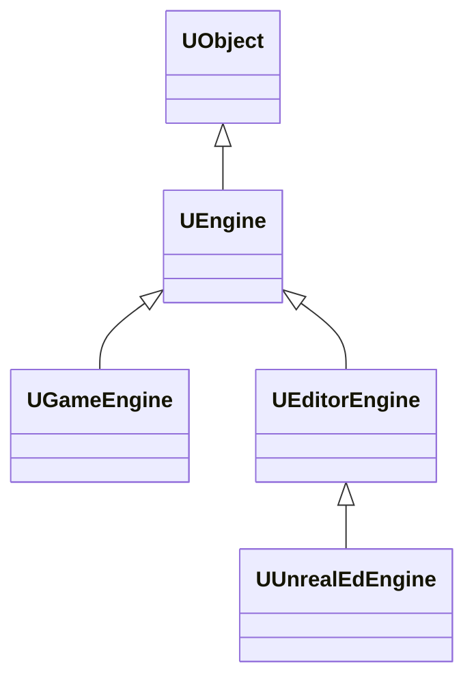

# UEngine 对象

> 本文档基于 Unreal Engine 5.5.4 源码分析，核心代码文件：
> - `Runtime/Engine/Classes/Engine/Engine.h`
> - `Editor/UnrealEd/Classes/Editor/EditorEngine.h`
> - `Runtime/Engine/Classes/Engine/GameEngine.h`

`UEngine` 是一个 UObject 类型，是所有引擎类型的抽象基类。

